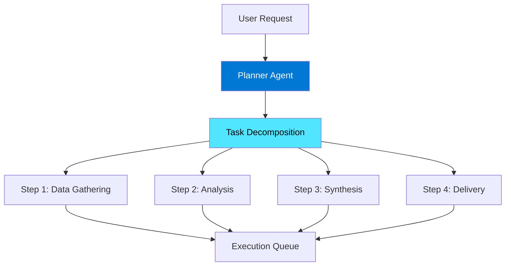
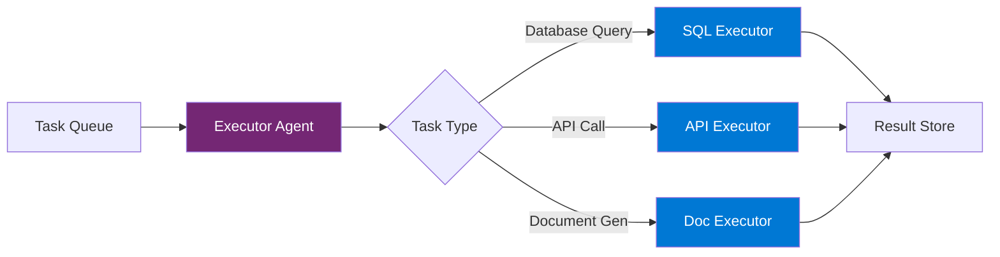
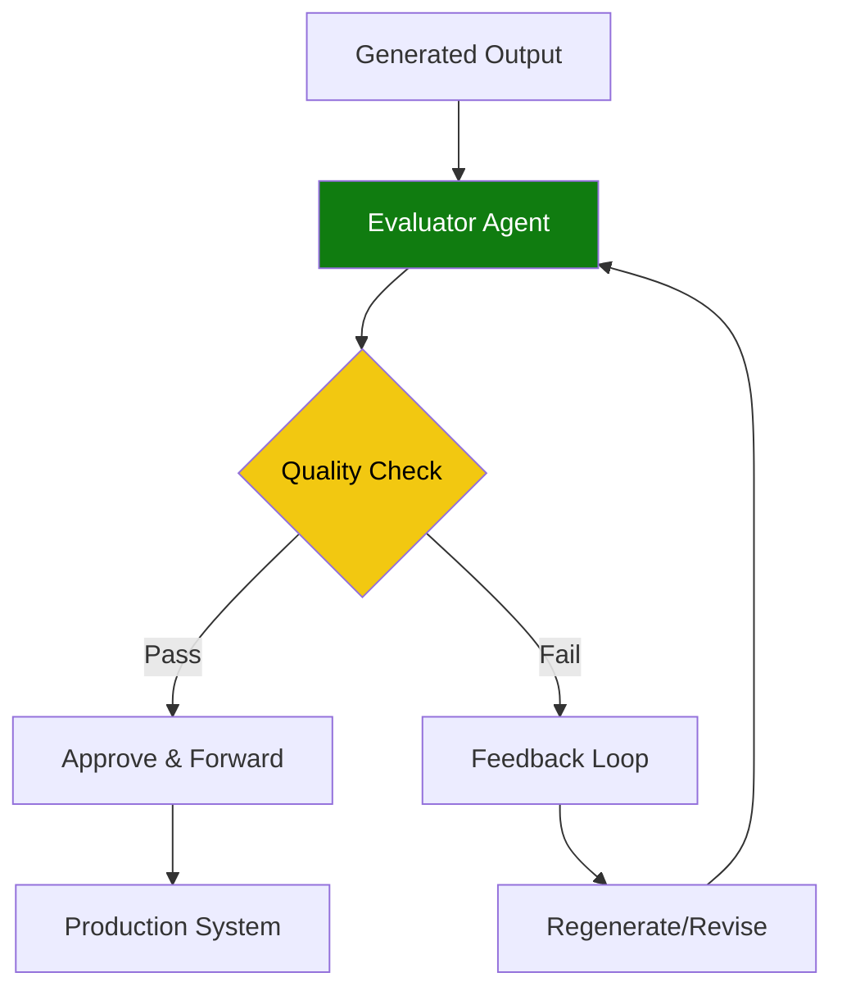
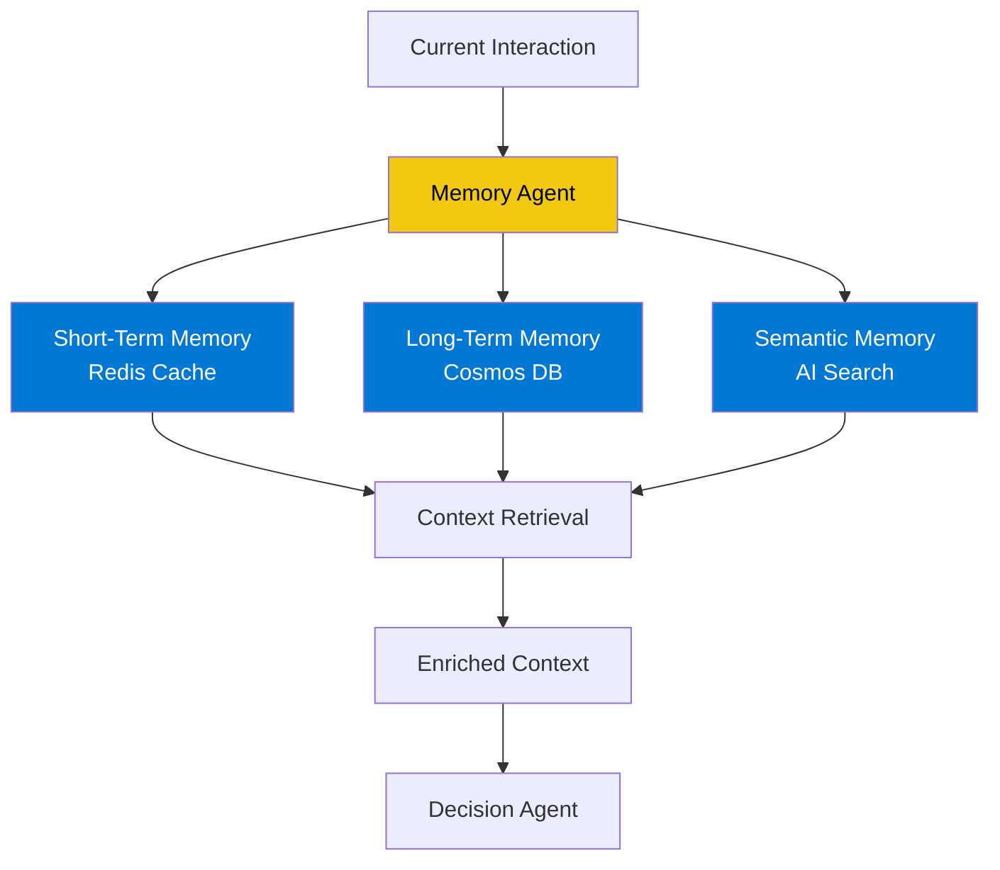
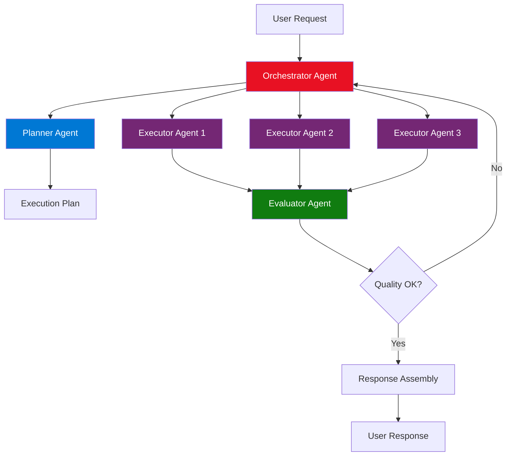
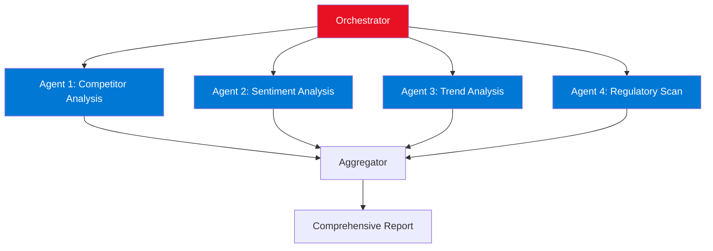
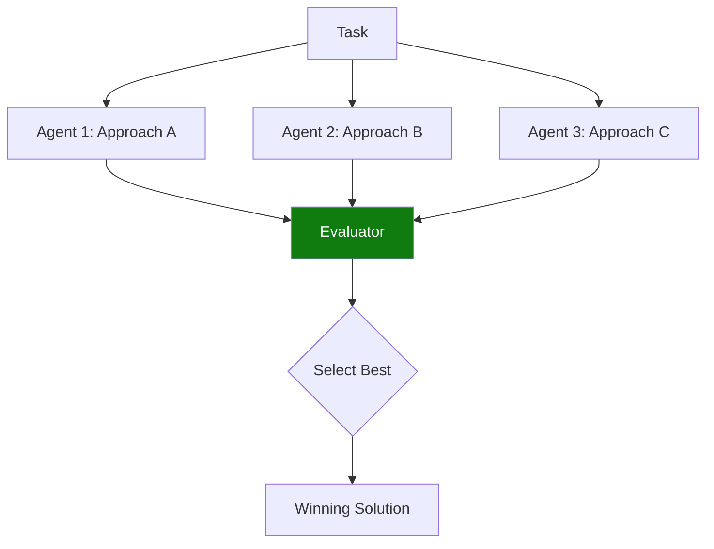
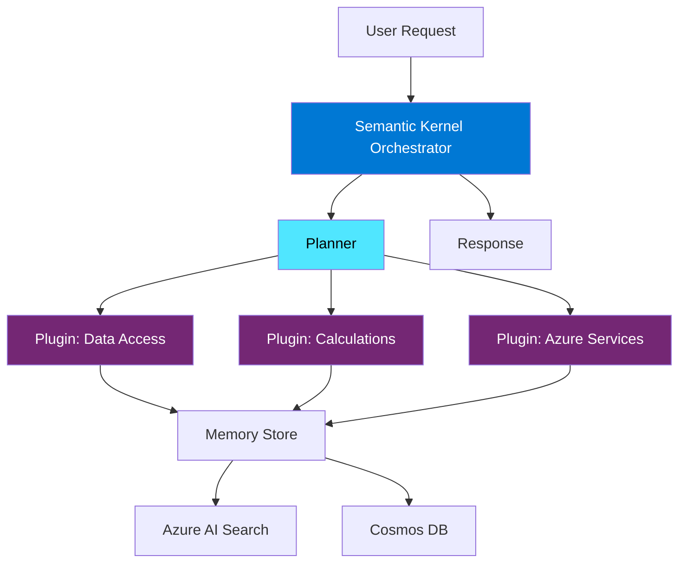
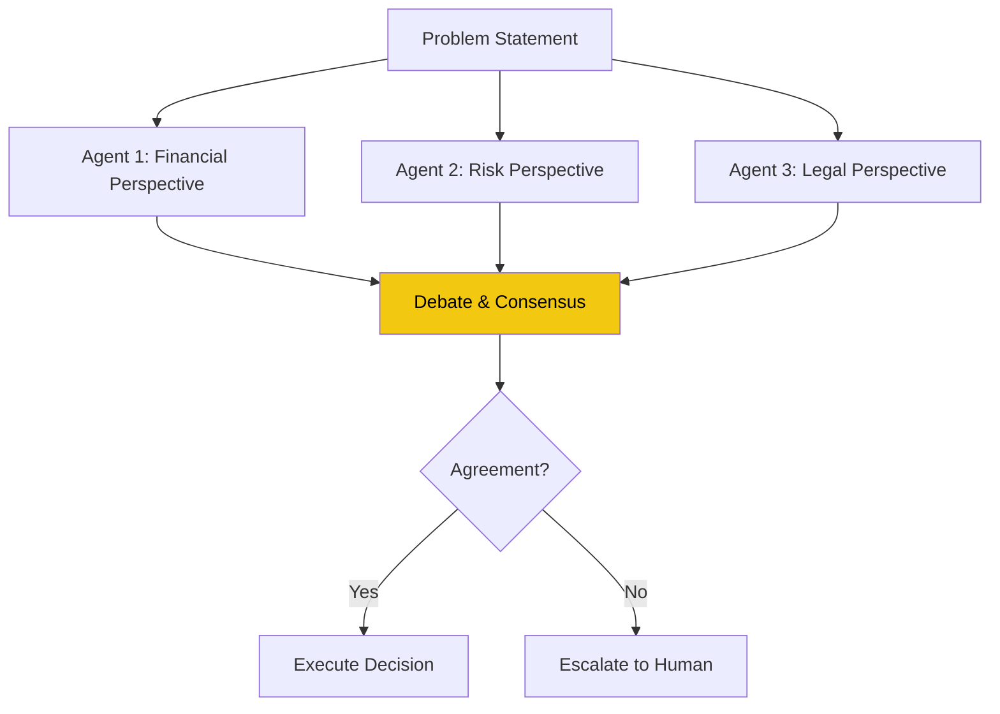

# Agent Development Framework - Multi-Agent Systems and Orchestration

## Definition

The Agent Development Framework provides architectural patterns and best practices for designing, implementing, and orchestrating AI agents in enterprise environments. An agent is an autonomous AI system that can perceive its environment, make decisions, and take actions to achieve specific goals. In the Microsoft ecosystem, agents leverage Azure OpenAI, Copilot Studio, Semantic Kernel, and other AI services to deliver intelligent automation and decision support.

Modern enterprise AI architectures increasingly rely on multi-agent systems: collections of specialized agents that collaborate to solve complex problems that would be difficult or impossible for a single agent to handle. These systems mirror human organizational structures where specialists work together, each contributing their unique expertise while coordinating through well-defined communication protocols.

This framework addresses the unique challenges of building production-grade agent systems: orchestration patterns, state management, error handling, human oversight, security, and integration with existing enterprise systems across Microsoft platforms including Dynamics 365, Power Platform, Azure, and Microsoft 365.

## Core Agent Design Patterns

### 1. Planner Agent

**Purpose**: Decompose complex tasks into sequences of smaller, manageable steps. The planner analyzes the user's request, determines what needs to be done, and creates an execution plan.

**Characteristics**:
- High-level reasoning and task decomposition
- Understanding of available capabilities and resources
- Ability to create contingency plans
- Monitoring execution and adjusting plans when needed

**Microsoft Implementation**:
- Azure OpenAI GPT-4 for complex reasoning
- Semantic Kernel's planner functionality
- Copilot Studio topics for structured planning

**Example Use Case**: A project management agent that breaks down "Prepare Q4 board presentation" into subtasks: gather financial data, create visualizations, draft narrative, compile slides, and schedule review sessions.

### 2. Executor Agent

**Purpose**: Perform specific, well-defined tasks with high reliability. Executors are specialists that excel at particular operations like database queries, API calls, document generation, or calculations.

**Characteristics**:
- Domain-specific expertise
- Deterministic, reliable execution
- Error handling and retry logic
- Clear input/output contracts

**Microsoft Implementation**:
- Azure Functions for discrete operations
- Power Automate flows for business process automation
- Custom plugins in Semantic Kernel
- Copilot Studio skills and actions

**Example Use Case**: A data retrieval executor that queries Dynamics 365 Sales for opportunity pipeline data, formats it consistently, and returns structured results to the orchestrator.

### 3. Evaluator Agent

**Purpose**: Assess the quality, correctness, and completeness of outputs from other agents. Evaluators provide quality control and can trigger re-execution or alternative strategies when results are insufficient.

**Characteristics**:
- Domain knowledge for quality assessment
- Scoring and grading capabilities
- Comparison against requirements
- Feedback generation for improvement

**Microsoft Implementation**:
- Azure OpenAI for semantic evaluation
- Custom scoring logic in Azure Functions
- Power Automate approval workflows
- Azure Machine Learning for ML-based validation

**Example Use Case**: An evaluator that reviews generated customer emails for tone, accuracy, compliance with brand guidelines, and presence of required information before sending.

### 4. Memory Agent

**Purpose**: Maintain context, conversation history, and learned patterns across interactions. Memory agents enable continuity, personalization, and learning from past experiences.

**Characteristics**:
- Storage and retrieval of interaction history
- Semantic search across past conversations
- Pattern recognition and learning
- Personalization based on user preferences

**Microsoft Implementation**:
- Azure Cosmos DB for conversation state
- Azure AI Search for semantic memory retrieval
- Redis Cache for short-term context
- Microsoft Dataverse for structured business data
- Semantic Kernel's memory connectors

**Example Use Case**: A customer service agent that remembers previous interactions with a customer, their preferences, past issues, and resolution history to provide personalized support.

### 5. Orchestrator Agent

**Purpose**: Coordinate multiple specialized agents, manage workflow state, and ensure overall system coherence. The orchestrator is the conductor of the multi-agent symphony.

**Characteristics**:
- Workflow management and routing
- Agent lifecycle management
- Error handling and compensation
- State tracking across distributed operations

**Microsoft Implementation**:
- Azure Durable Functions for stateful orchestration
- Azure Logic Apps for complex workflows
- Semantic Kernel's orchestration capabilities
- Copilot Studio topic chaining

**Example Use Case**: An order processing orchestrator that coordinates inventory checking, payment processing, shipment scheduling, and customer notification agents.

## Multi-Agent Orchestration Patterns

### 1. Sequential Workflow

Agents execute in a predefined sequence, with each agent's output becoming the next agent's input. This is the simplest orchestration pattern, suitable for linear processes.

**When to Use**:
- Clear, linear process flow
- Each step depends on previous step's completion
- Deterministic ordering is required

**Microsoft Implementation**: Azure Logic Apps with sequential actions, Durable Functions with function chaining.

**Example**: Document processing pipeline: Extract text → Classify content → Extract entities → Generate summary → Store results.

### 2. Parallel Execution

Multiple agents execute simultaneously, often processing different aspects of the same problem independently. Results are aggregated when all agents complete.

**When to Use**:
- Independent subtasks that can run concurrently
- Need to minimize total execution time
- Aggregating multiple perspectives or data sources

**Microsoft Implementation**: Azure Durable Functions fan-out/fan-in pattern, parallel branches in Logic Apps.

**Example**: Market research agent dispatches parallel agents to analyze competitors, customer sentiment, industry trends, and regulatory changes simultaneously.

### 3. Conditional Routing

The orchestrator routes tasks to different agents based on conditions, classifications, or decision logic. Enables dynamic, adaptive workflows.

**When to Use**:
- Different scenarios require different handling
- Classification or triage is needed
- Resource optimization based on complexity

**Microsoft Implementation**: Copilot Studio conditional branching, Logic Apps switch/condition actions, Semantic Kernel with dynamic plugin selection.

**Example**: Customer inquiry router that directs technical questions to engineering agents, billing questions to finance agents, and general questions to a generalist agent.

### 4. Iterative Refinement

An agent produces an initial output, an evaluator assesses it, and based on feedback, the output is refined through multiple iterations until quality thresholds are met.

**When to Use**:
- Quality standards are critical
- Initial attempts may need improvement
- Feedback-driven improvement is possible

**Microsoft Implementation**: Azure Durable Functions with eternal orchestrations, Power Automate approval loops.

**Example**: Content generation agent creates marketing copy, evaluator checks brand compliance and persuasiveness, iterates until both metrics exceed thresholds or max iterations reached.

### 5. Competitive Execution

Multiple agents attempt the same task using different approaches or models. The best result (based on evaluation criteria) is selected.

**When to Use**:
- Uncertainty about optimal approach
- Quality is paramount
- Computational resources allow redundancy

**Microsoft Implementation**: Multiple Azure OpenAI deployments with different models/prompts, A/B testing with Application Insights.

**Example**: Code generation task executed by GPT-4, Claude, and Gemini agents simultaneously, with automated testing selecting the version that passes most test cases.

### 6. Hierarchical Delegation

A high-level agent delegates subtasks to specialized sub-agents, which may further delegate to their own sub-agents, creating a tree structure.

**When to Use**:
- Complex problems with natural hierarchical decomposition
- Different levels of abstraction are needed
- Specialist agents exist for specific domains

**Microsoft Implementation**: Nested Durable Functions orchestrations, Copilot Studio with multiple nested topics.

**Example**: Executive assistant agent delegates to calendar agent (which coordinates with meeting scheduler and attendee availability agents), travel agent (which coordinates with booking and expense agents), and communications agent.

## Integration with Microsoft AI Stack

### Azure OpenAI Service

**Role**: Provides the foundational large language models (GPT-4, GPT-4 Turbo, GPT-4o) that power cognitive agent capabilities.

**Agent Applications**:
- Natural language understanding for user intent
- Planning and reasoning in planner agents
- Content generation in executor agents
- Quality assessment in evaluator agents
- Semantic understanding in memory agents

**Best Practices**:
- Use GPT-4 for complex reasoning and planning
- Use GPT-4o for multimodal tasks (vision + language)
- Implement prompt engineering best practices
- Use function calling for structured agent actions
- Apply content filtering for safety
- Monitor costs and implement rate limiting

### Copilot Studio

**Role**: Low-code platform for building conversational AI agents with built-in orchestration, natural language understanding, and Microsoft 365 integration.

**Agent Applications**:
- Employee self-service agents (HR, IT support)
- Customer service bots
- Internal knowledge assistants
- Process automation triggers

**Best Practices**:
- Use topics for conversation flow orchestration
- Leverage entities for structured data extraction
- Integrate with Power Automate for complex actions
- Use Copilot Studio skills to extend capabilities
- Implement authentication for sensitive operations
- Monitor analytics for improvement opportunities

### Semantic Kernel

**Role**: Open-source SDK that enables AI orchestration in .NET, Python, and Java applications. Provides abstractions for plugins, planners, and memory.

**Agent Applications**:
- Custom enterprise agents with complex business logic
- Integration of multiple AI services
- Plugin-based extensibility
- Automated planning and task decomposition

**Key Capabilities**:
- **Plugins**: Encapsulate agent skills and tools
- **Planners**: Automatically create execution plans from user goals
- **Memory**: Vector-based semantic memory with embeddings
- **Connectors**: Integration with Azure OpenAI, HuggingFace, local models

**Architecture Example**:

**Best Practices**:
- Design plugins with single responsibility
- Use native functions for deterministic operations
- Use semantic functions for AI-powered operations
- Implement retry policies and error handling
- Cache embeddings to reduce costs
- Version plugins for backward compatibility

### Azure AI Agent Service

**Role**: Managed service for building and deploying production AI agents with enterprise-grade security, scaling, and monitoring.

**Agent Applications**:
- Production deployment of agent systems
- Multi-tenant agent hosting
- Managed scaling and availability
- Integrated monitoring and telemetry

**Best Practices**:
- Use managed identity for secure service access
- Implement rate limiting per tenant
- Monitor agent performance with Application Insights
- Use Azure API Management for agent API governance
- Implement circuit breakers for external dependencies

### Power Platform Integration

**Power Automate**: Ideal for executor agents that perform business process automation across Microsoft 365, Dynamics 365, and third-party services.

**Power Apps**: Front-end interfaces for agent interactions, especially for guided experiences with human-in-the-loop patterns.

**Dataverse**: Structured data storage for agent state, conversation history, and business entities.

**Best Practices**:
- Use cloud flows for long-running agent operations
- Implement approvals for high-stakes agent decisions
- Store agent configuration in Dataverse
- Use connection references for environment portability

## Agentic Workflow Patterns

### 1. Human-in-the-Loop

Agents perform analysis and generate recommendations but require human approval before executing consequential actions.

**When to Use**:
- High-stakes decisions (financial, legal, safety-critical)
- Regulatory requirements for human oversight
- Building trust in new agent capabilities
- Quality assurance for customer-facing outputs

**Implementation**: Power Automate approvals, Azure Logic Apps approval connectors, custom approval workflows in Teams.

### 2. Autonomous with Monitoring

Agents operate fully autonomously but generate detailed logs and alerts for human monitoring and intervention when needed.

**When to Use**:
- Well-understood, routine operations
- Agents have proven reliability
- Fast execution is required
- Human intervention for exceptions only

**Implementation**: Application Insights telemetry, Azure Monitor alerts, custom dashboards in Power BI.

### 3. Collaborative Multi-Agent

Multiple agents with different expertise collaborate, debate, and reach consensus before taking action.

**When to Use**:
- Complex decisions benefit from multiple perspectives
- Reducing single-agent bias or errors
- Highly critical decisions warrant redundancy

**Implementation**: Custom orchestration with Semantic Kernel or Durable Functions managing multi-agent deliberation.

### 4. Learning and Adaptation

Agents collect feedback, learn from outcomes, and adapt their behavior over time through fine-tuning or reinforcement learning.

**When to Use**:
- Agent performance can improve with data
- Clear feedback signals exist
- Domain is evolving and agents must adapt

**Implementation**: Azure Machine Learning for model training, custom feedback loops, Azure AI Search for retrieval-augmented generation (RAG) with growing knowledge bases.

## Governance and Safety Considerations

### Content Filtering

**Azure OpenAI Content Filters**: Implement Microsoft's responsible AI content filters to detect and block harmful content (hate speech, violence, self-harm, sexual content).

**Custom Filters**: Add domain-specific filters for business-critical scenarios (PII detection, confidential information, brand compliance).

### Access Control

**Authentication**: Use Azure AD/Entra ID for user authentication to agents.

**Authorization**: Implement role-based access control (RBAC) for agent capabilities. Not all users should have access to all agent functions.

**Data Access**: Agents should respect existing data access policies in Dataverse, SharePoint, and other systems.

### Audit and Compliance

**Logging**: Comprehensive logging of all agent decisions and actions for audit trails.

**Retention**: Maintain conversation history and decision records per compliance requirements.

**Explainability**: Agents should be able to explain their reasoning and cite sources for decisions.

### Cost Management

**Token Budgets**: Implement per-user or per-session token budgets to control costs.

**Caching**: Cache common queries and responses to reduce API calls.

**Model Selection**: Use appropriate models (GPT-3.5 for simple tasks, GPT-4 for complex reasoning) to optimize cost/performance.

**Monitoring**: Track Azure OpenAI costs in Cost Management and create alerts for anomalies.

### Error Handling

**Graceful Degradation**: When agent capabilities fail, provide fallback experiences rather than complete failures.

**Retry Logic**: Implement exponential backoff for transient failures.

**Circuit Breakers**: Prevent cascading failures when dependent services are unavailable.

**Human Escalation**: Clear escalation paths when agents cannot complete tasks.

## Monitoring and Observability

### Key Metrics

- **Response Time**: Time from user request to agent response
- **Success Rate**: Percentage of requests successfully completed
- **Token Usage**: GPT tokens consumed per interaction
- **Error Rate**: Failed requests by error type
- **User Satisfaction**: Explicit and implicit satisfaction signals
- **Cost per Interaction**: Azure consumption per request

### Implementation

- **Application Insights**: Distributed tracing across multi-agent systems
- **Log Analytics**: Centralized logging and querying
- **Power BI Dashboards**: Executive views of agent performance
- **Azure Monitor Alerts**: Proactive alerting for anomalies

## Assessment Questions

1. **Agent Decomposition**: Have you identified the right agent specializations for your use case? Are agents focused and single-purpose?

2. **Orchestration Pattern**: Which orchestration pattern (sequential, parallel, conditional, iterative, etc.) best fits your workflow?

3. **Human Oversight**: Where do you need human-in-the-loop controls? Have you implemented appropriate approval workflows?

4. **State Management**: How are you managing conversation state and memory across agent interactions? Is it scalable?

5. **Error Handling**: What happens when agents fail? Do you have graceful degradation and retry logic?

6. **Security**: Are agents properly authenticated and authorized? Are you filtering sensitive information?

7. **Cost Control**: Have you implemented token budgets and cost monitoring? Are you using the most cost-effective models for each task?

8. **Observability**: Can you trace multi-agent workflows end-to-end? Do you have metrics for agent performance?

9. **Integration**: How do your agents integrate with existing Microsoft platforms (Dynamics, M365, Power Platform)? Are integrations resilient?

10. **Governance**: Do you have policies for agent behavior, content generation, and data access? How do you audit agent actions?

## Conclusion

The Agent Development Framework provides a comprehensive approach to designing and implementing multi-agent AI systems in Microsoft enterprise environments. By applying proven design patterns (Planner, Executor, Evaluator, Memory, and Orchestrator agents) architects can build sophisticated agent systems that decompose complex problems into manageable, specialized components.

Orchestration patterns enable flexible coordination strategies from simple sequential workflows to complex hierarchical delegation and collaborative multi-agent deliberation. Integration with Microsoft's AI stack (Azure OpenAI, Copilot Studio, Semantic Kernel, Azure AI Agent Service) provides the foundational capabilities and enterprise-grade infrastructure needed for production deployments.

Governance and safety considerations ensure that agent systems operate responsibly, securely, and cost-effectively while maintaining human oversight where appropriate. As AI capabilities continue to evolve, the architectural patterns and practices in this framework provide a stable foundation for building agent systems that deliver business value while managing risks inherent in autonomous AI systems.
