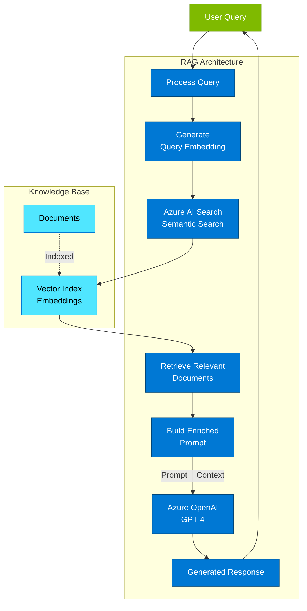
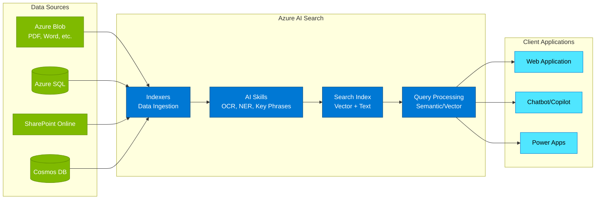
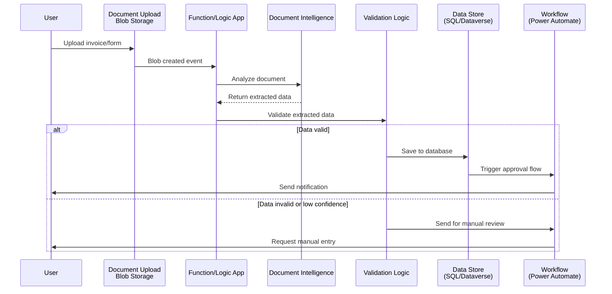
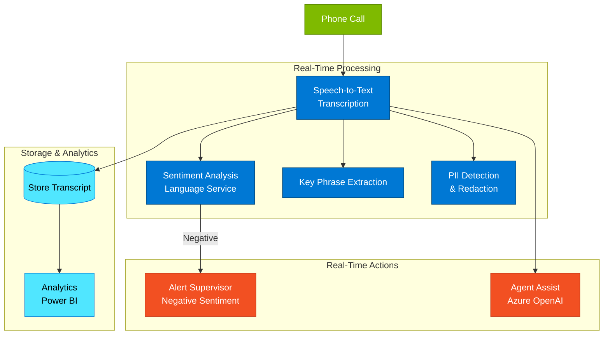
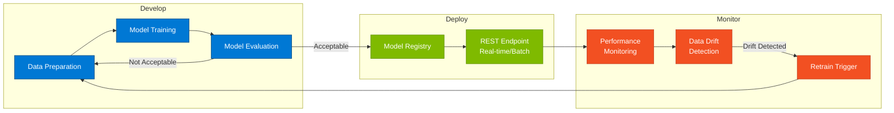
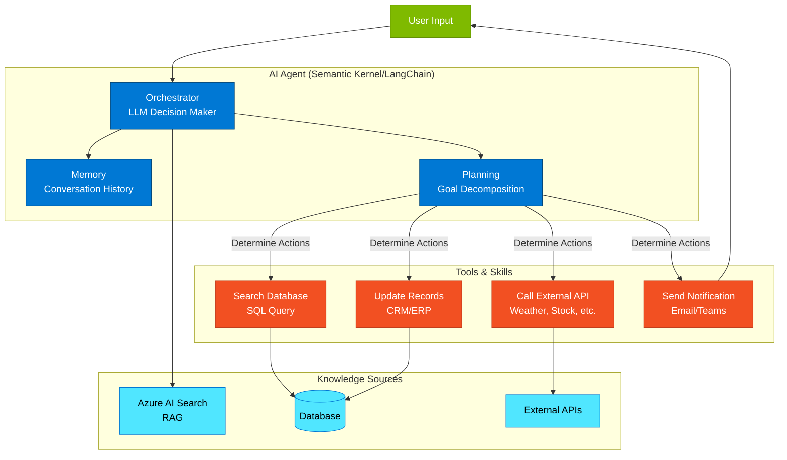
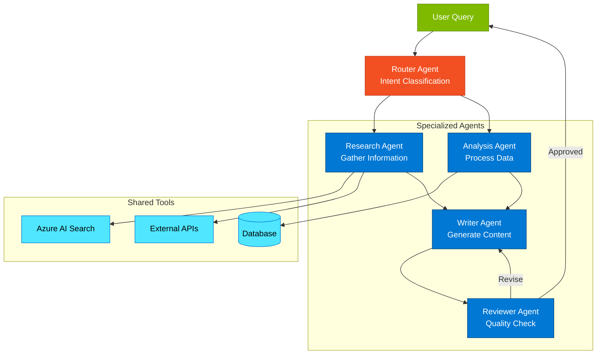
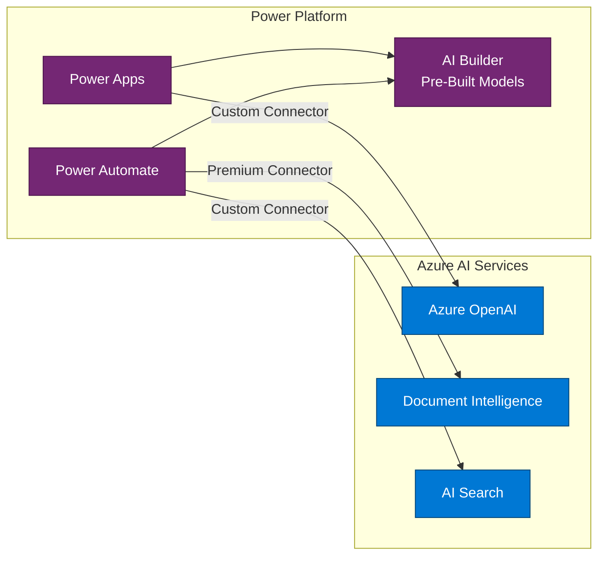
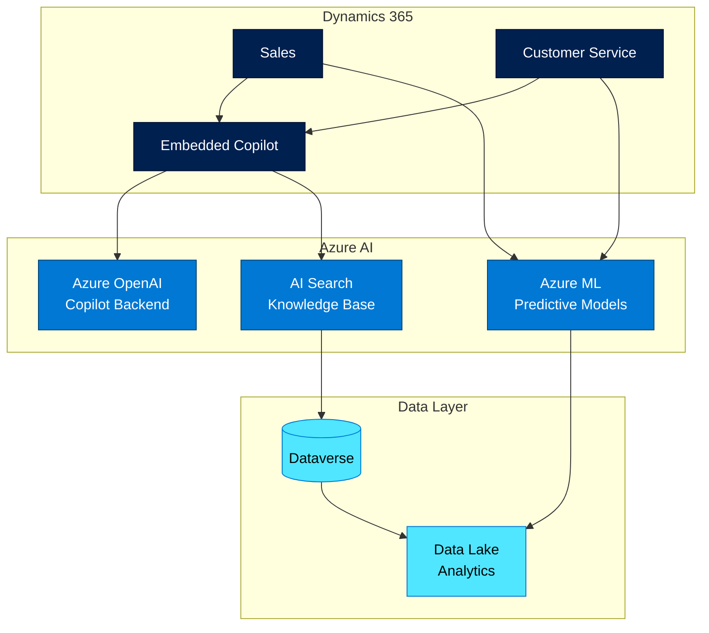
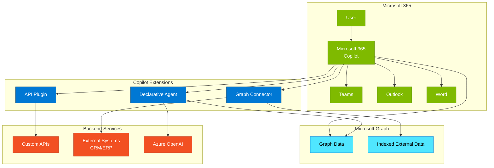

# Azure AI & Cognitive Services - Intelligent Solutions Architecture

## Overview

Azure AI & Cognitive Services represent Microsoft's comprehensive artificial intelligence platform, providing pre-built AI capabilities and tools for custom machine learning models. For enterprise architects, Azure AI enables the integration of intelligent capabilities (from generative AI with Azure OpenAI to specialized cognitive services) into enterprise applications without requiring deep data science expertise.

## Platform Positioning

**Strategic Role**: Azure AI democratizes artificial intelligence for enterprises:
- **Generative AI**: Azure OpenAI Service for conversational AI, content generation, code assistance
- **Pre-Built AI**: Cognitive Services for vision, speech, language, and decision-making
- **Custom AI**: Azure Machine Learning for custom model development
- **AI Orchestration**: Semantic Kernel and frameworks for agentic systems
- **Search**: AI-powered search with Azure AI Search (formerly Cognitive Search)
- **Responsible AI**: Built-in tools for fairness, reliability, safety, and transparency

**Architectural Philosophy**: "AI-first, but responsible." Embed AI throughout solutions while maintaining ethical standards, privacy, and security.

## Core AI Services

### Azure OpenAI Service

**Purpose**: Enterprise-grade access to OpenAI's large language models (LLMs)

**Available Models** (as of November 2025):

**GPT-5 Family** (Latest Generation):
- **GPT-5**: Next-generation flagship model (requires registration for access)
- **GPT-5 Mini**: Cost-effective variant of GPT-5 (no registration required)
- **GPT-5 Nano**: Ultra-efficient model for high-volume scenarios (no registration required)
- **GPT-5 Chat**: Optimized for conversational AI applications (no registration required)
- **Launch Regions**: East US 2 and Sweden Central

**GPT-4 Family**:
- **GPT-4o**: Multimodal model with vision, audio, and text (128K tokens context)
- **GPT-4o mini**: Cost-effective, fast variant of GPT-4o for common tasks
- **GPT-4 Turbo**: Previous generation model for complex reasoning (128K tokens)
- **GPT-4**: Standard model (8K/32K tokens)

**Reasoning Models**:
- **o1-preview**: Advanced reasoning model with extended thinking for complex problems
- **o1-mini**: Fast reasoning model optimized for coding, math, and science

**Other Models**:
- **GPT-3.5 Turbo**: Legacy model for cost-sensitive scenarios
- **Embeddings (text-embedding-3-small/large)**: Latest embedding models for semantic search
- **DALL-E 3**: Image generation from text descriptions
- **Whisper**: Speech-to-text transcription and translation

**Azure AI Foundry Agent Service Model Support** ([details](https://learn.microsoft.com/en-us/azure/ai-foundry/agents/concepts/model-region-support)):
- Hub-based agent projects support: gpt-4o, gpt-4o-mini, gpt-4, gpt-35-turbo
- Model availability varies by region and cloud deployment type (standard vs. provisioned)
- Global deployment options available for higher throughput across Azure infrastructure
- Regional expansion: Brazil South, Germany West Central, Italy North, South Central US
- **Note**: File search tool currently unavailable in Italy North and Brazil South regions

**Key Capabilities**:
- **Content Generation**: Articles, summaries, translations
- **Conversational AI**: Chatbots, copilots, virtual assistants
- **Code Generation**: Code completion, explanation, debugging
- **Data Extraction**: Extract structured data from unstructured text
- **Semantic Search**: Find relevant content based on meaning
- **Function Calling**: LLM orchestrates function/API calls

**Architecture Pattern - Retrieval Augmented Generation (RAG)**:

**RAG Pattern Benefits**:
- Ground responses in organizational knowledge
- Reduce hallucinations with factual data
- Keep content current without retraining models
- Maintain data privacy (data not sent to OpenAI for training)
- Enable citation and source attribution

**Best Practices**:
- Use RAG pattern for enterprise knowledge scenarios
- Implement prompt engineering best practices
- Use function calling for structured outputs and tool use
- Implement content filtering for safety
- Monitor token usage for cost optimization
- Use semantic caching for repeated queries
- Implement retry logic with exponential backoff
- Use managed identities for authentication

**Pricing Considerations**:
- Token-based pricing (prompt tokens + completion tokens)
- GPT-4 significantly more expensive than GPT-3.5
- Embeddings relatively inexpensive
- Provisioned throughput for predictable costs and guaranteed capacity

---

### Azure AI Search (Cognitive Search)

**Purpose**: AI-powered search with semantic understanding

**Key Capabilities**:
- **Full-Text Search**: Traditional keyword-based search
- **Semantic Search**: Understanding query intent and context
- **Vector Search**: Similarity search using embeddings
- **Hybrid Search**: Combine keyword, semantic, and vector search
- **AI Enrichment**: Extract insights during indexing (OCR, entity recognition, key phrases)
- **Indexing**: Multiple data sources (Blob, SQL, Cosmos, SharePoint)

**Architecture Pattern - Intelligent Search**:

**AI Enrichment Pipeline**:
1. **Extract**: OCR for images, text extraction from documents
2. **Detect**: Language detection, entity recognition (people, places, organizations)
3. **Analyze**: Key phrase extraction, sentiment analysis
4. **Translate**: Language translation
5. **Generate**: Image descriptions, tags

**Best Practices**:
- Use semantic search for natural language queries
- Implement vector search for similarity-based retrieval
- Use hybrid search for best relevance
- Design index schema carefully (searchable, filterable, facetable fields)
- Implement incremental indexing for large datasets
- Use AI enrichment for unstructured content
- Monitor search analytics to improve relevance

**Agentic Retrieval Pattern** ([learn more](https://learn.microsoft.com/en-us/azure/search/agentic-retrieval-overview)):

Azure AI Search now supports agentic retrieval patterns where AI agents autonomously:
- Formulate search queries based on user intent
- Retrieve relevant documents from multiple indexes
- Re-rank and synthesize results
- Iteratively refine queries based on results
- Combine search with other data sources

**Key Features**:
- **Dynamic query generation**: LLM generates optimal search queries
- **Multi-turn retrieval**: Agent refines queries across multiple rounds
- **Cross-index search**: Query multiple indexes simultaneously
- **Semantic re-ranking**: Re-order results based on relevance
- **Citation and provenance**: Track source documents for transparency

**Use Cases**:
- Research assistants that autonomously gather information
- Multi-step question answering across knowledge bases
- Complex analytical queries requiring multiple data sources
- Enterprise copilots with dynamic knowledge retrieval

---

### Azure AI Document Intelligence (Form Recognizer)

**Purpose**: Extract structured data from documents

**Pre-Built Models**:
- **Invoices**: Extract vendor, items, totals
- **Receipts**: Extract merchant, date, items, total
- **ID Documents**: Extract name, DOB, address from passports, licenses
- **Business Cards**: Extract contact information
- **W-2 Forms**: Extract tax information

**Custom Models**:
- **Custom Template**: For fixed-layout forms
- **Custom Neural**: For variable layouts using deep learning
- **Composed Models**: Combine multiple models

**Architecture Pattern - Document Processing**:

**Best Practices**:
- Start with pre-built models when available
- Use custom models for organization-specific forms
- Implement confidence score thresholds for quality control
- Use human-in-the-loop for low-confidence extractions
- Train custom models with diverse examples (15-20 minimum)
- Version and test models before production deployment
- Monitor accuracy and retrain as needed

**Integration Scenarios**:
- Invoice processing with Dynamics 365 Finance
- Receipt scanning for expense management
- Contract analysis and metadata extraction
- Onboarding document processing

---

### Azure Cognitive Services

**Purpose**: Pre-built AI capabilities for common scenarios

#### 1. Computer Vision

**Capabilities**:
- **Image Analysis**: Detect objects, faces, brands, celebrities
- **OCR**: Extract text from images
- **Spatial Analysis**: People counting, social distancing monitoring
- **Custom Vision**: Train custom image classification models

**Use Cases**:
- Product recognition in retail
- Quality inspection in manufacturing
- Document digitization
- Accessibility features (describe images for visually impaired)

---

#### 2. Speech Services

**Capabilities**:
- **Speech-to-Text**: Transcribe audio to text (real-time or batch)
- **Text-to-Speech**: Natural-sounding speech synthesis
- **Speech Translation**: Real-time translation of spoken language
- **Speaker Recognition**: Identify and verify speakers

**Use Cases**:
- Call center transcription and analytics
- Meeting transcription (Teams integration)
- Voice-enabled applications
- Accessibility features

**Architecture Pattern - Call Center Intelligence**:

---

#### 3. Language Services

**Capabilities**:
- **Text Analysis**: Sentiment analysis, key phrase extraction, named entity recognition
- **Question Answering**: Build FAQ bots from documents
- **Language Understanding (CLU)**: Intent and entity recognition for conversational AI
- **Translator**: 100+ language translation

**Use Cases**:
- Sentiment analysis of customer feedback
- Content moderation for user-generated content
- Multi-lingual customer support
- Extract insights from survey responses

---

#### 4. Azure AI Content Safety

**Purpose**: Detect harmful content (text and images)

**Capabilities**:
- **Text Moderation**: Detect hate speech, violence, self-harm, sexual content
- **Image Moderation**: Detect inappropriate images
- **Severity Levels**: Configure thresholds per category
- **PII Detection**: Identify and redact personal information

**Use Cases**:
- User-generated content moderation
- Chatbot safety filters
- Compliance with content policies
- Child safety in educational apps

**Best Practices**:
- Implement content safety for all user-facing AI
- Configure severity thresholds based on use case
- Use in conjunction with Azure OpenAI content filters
- Monitor and review flagged content
- Implement appeals process for false positives

---

### Azure Machine Learning

**Purpose**: Platform for custom machine learning model development

**Key Capabilities**:
- **Automated ML**: Auto-generate ML models without coding
- **Designer**: Drag-and-drop ML pipeline creation
- **Notebooks**: Jupyter notebooks for data science
- **MLOps**: CI/CD for model lifecycle
- **Model Management**: Versioning, deployment, monitoring
- **Responsible AI**: Fairness, interpretability, error analysis

**ML Lifecycle**:

**When to Use Custom ML vs. Pre-Built AI**:
- **Use Pre-Built** (Cognitive Services, Azure OpenAI):
  - Common scenarios (vision, speech, language, search)
  - Limited training data
  - Fast time to market
  - No data science expertise

- **Use Custom ML** (Azure Machine Learning):
  - Highly specialized domain
  - Large amounts of training data available
  - Need for model interpretability
  - Unique business problem not solved by pre-built models

---

## Agentic AI and Copilot Architectures

### What are AI Agents?

**AI Agents** are autonomous systems that:
- Perceive their environment (inputs, data)
- Make decisions based on goals
- Take actions (call APIs, update data, respond)
- Learn and adapt from feedback

### Agent Architecture Pattern

**Key Components**:
1. **Orchestrator**: LLM that makes decisions (Azure OpenAI)
2. **Memory**: Maintains conversation context and history
3. **Planning**: Breaks complex goals into steps
4. **Tools/Skills**: Functions the agent can call (APIs, databases, services)
5. **Knowledge**: RAG with Azure AI Search for grounding

**Microsoft AI Orchestration Frameworks**:
- **Microsoft Agent Framework**: Enterprise-grade open-source framework for building production agentic AI applications ([learn more](https://learn.microsoft.com/en-us/agent-framework/overview/agent-framework-overview))
- **Azure AI Foundry**: Unified platform for building, evaluating, and deploying agentic AI solutions ([learn more](https://devblogs.microsoft.com/foundry/introducing-microsoft-agent-framework-the-open-source-engine-for-agentic-ai-apps/))
- **Semantic Kernel**: Microsoft's SDK for AI orchestration with plugins and planners (.NET, Python, Java) ([learn more](https://learn.microsoft.com/en-us/semantic-kernel/))
- **Copilot Studio**: Low-code platform for building custom copilots and agents ([learn more](https://learn.microsoft.com/en-us/microsoft-copilot-studio/overview))
- **AutoGen**: Microsoft Research framework for multi-agent conversation systems ([learn more](https://github.com/microsoft/autogen))
- **Agent Factory**: Microsoft's reference architecture and patterns for agentic AI ([learn more](https://azure.microsoft.com/en-us/blog/agent-factory/))

---

### Multi-Agent Architecture

**Pattern**: Multiple specialized agents collaborating

**Use Cases**:
- Complex research and analysis tasks
- Content creation pipelines
- Customer service with specialized domains
- Software development assistants (research, code, test, review)

**Reference**: See `/references/frameworks/agent-development-framework.md` for comprehensive agentic architecture patterns.

---

## Integration with Microsoft Platforms

### Azure AI + Power Platform

**Common Scenarios**:
- Custom connectors to Azure OpenAI in Power Apps/Automate
- AI Builder (Power Platform's AI) for simple scenarios
- Document Intelligence in Power Automate flows
- Azure AI Search from Power Apps

**Architecture Pattern**:

**When to Use AI Builder vs. Azure AI**:
- **AI Builder**: Simple scenarios, citizen developer-friendly, included in Power Platform licenses (with limits)
- **Azure AI**: Advanced scenarios, custom models, higher volume, full control

---

### Azure AI + Dynamics 365

**Copilot Integration**:
- Sales Copilot (relationship intelligence, email drafting)
- Service Copilot (agent assistance, case summarization)
- Marketing Copilot (content generation, journey optimization)

**Custom AI Extensions**:
- Predictive scoring (lead, opportunity, churn)
- Sentiment analysis on customer feedback
- Product recommendations
- Intelligent case routing

**Architecture Pattern**:

---

### Azure AI + Microsoft 365

**Microsoft 365 Copilot**:
- **Chat**: Enterprise-wide AI assistant with organizational context
- **Copilots in Apps**: Word, Excel, PowerPoint, Outlook, Teams, OneNote
- **Microsoft Graph Grounding**: Accesses organizational data (emails, documents, chats, calendar)
- **Enterprise-grade Security**: Data stays within tenant boundary, no training on customer data

**Microsoft 365 Copilot Extensibility** ([learn more](https://learn.microsoft.com/en-us/microsoft-365-copilot/extensibility/overview)):

Extend Microsoft 365 Copilot with custom capabilities:

1. **Graph Connectors**: Index external data sources into Microsoft Graph
   - CRM systems, project management tools, knowledge bases
   - Makes external data searchable and available to Copilot

2. **Plugins**: Add custom actions and integrations
   - **API Plugins**: Call external REST APIs from Copilot
   - **Copilot Studio Plugins**: Build low-code conversational plugins
   - **Message Extensions**: Surface app data in Teams and Copilot

3. **Declarative Agents**: Custom copilots with specific instructions and knowledge
   - Define agent behavior with natural language instructions
   - Connect to specific data sources via Graph connectors
   - Deploy in Teams, Outlook, or as standalone copilots

4. **Copilot Studio Agents**: Build sophisticated multi-turn agents
   - Low-code agent builder with pre-built templates
   - Integration with Power Platform, Dynamics 365, Azure AI
   - Publish to Microsoft 365, Teams, websites, custom apps

**Architecture Pattern - M365 Copilot Extensibility**:

**Extensibility Use Cases**:
- **Enterprise Knowledge Integration**: Connect Copilot to internal wikis, documentation, procedures
- **CRM/ERP Integration**: Surface customer data, order status, inventory from business systems
- **Workflow Automation**: Create approvals, submit tickets, update records via conversational interface
- **Specialized Assistants**: Build domain-specific copilots (HR, Finance, Legal, Sales)

**Best Practices**:
- Start with Graph connectors to make existing data accessible
- Use declarative agents for simple, focused use cases
- Use Copilot Studio for complex multi-turn conversations
- Implement proper authentication and authorization for plugins
- Test extensions in Teams before rolling out to M365 Copilot
- Monitor usage analytics to optimize agent performance

---

## Responsible AI and Governance

### Microsoft's Responsible AI Principles

1. **Fairness**: AI should treat everyone fairly
2. **Reliability and Safety**: AI should be safe and reliable
3. **Privacy and Security**: AI should be secure and respect privacy
4. **Inclusiveness**: AI should empower everyone
5. **Transparency**: AI should be understandable
6. **Accountability**: People should be accountable for AI

### Technical Implementation

**Content Filtering** (Azure OpenAI):
- Hate and fairness
- Sexual content
- Violence
- Self-harm
- Configurable severity thresholds

**Abuse Monitoring**:
- Track API usage for policy violations
- Rate limiting per user/application
- Audit logging for compliance

**Data Privacy**:
- Customer data NOT used for model training (Azure OpenAI)
- Data residency options
- Encryption at rest and in transit
- Managed identities for authentication

**Model Transparency**:
- Document model capabilities and limitations
- Provide confidence scores
- Enable human oversight for high-stakes decisions
- Implement explainability (Azure ML)

### Governance Best Practices

- Establish AI governance board
- Define acceptable use policies
- Implement human-in-the-loop for critical decisions
- Monitor for bias and fairness issues
- Maintain audit logs
- Regular review and retraining of models
- User education on AI limitations

---

## Cost Optimization

### Azure OpenAI Cost Management

**Pricing Factors**:
- Model type (GPT-4 >> GPT-3.5)
- Token count (prompt + completion)
- Deployment type (standard vs. provisioned throughput)

**Optimization Strategies**:
- Use GPT-3.5 Turbo for simpler tasks
- Implement semantic caching
- Optimize prompts (fewer tokens)
- Use streaming for better UX without cost increase
- Set max_tokens to limit completion length
- Use function calling instead of free-text parsing
- Consider provisioned throughput for predictable, high-volume scenarios

### Cognitive Services Cost Management

- Use appropriate tiers (Free, Standard, Premium)
- Implement caching where appropriate
- Batch requests when possible
- Monitor usage with Azure Cost Management
- Set spending limits and alerts

### Azure AI Search Cost Management

- Right-size partition and replica count
- Use basic tier for dev/test
- Implement incremental indexing
- Monitor storage usage
- Review and optimize index schema

---

## Common Use Cases

### Use Case 1: Intelligent Document Processing

**Scenario**: Automate invoice processing for accounts payable

**Components**:
- Azure AI Document Intelligence (invoice model)
- Azure OpenAI (validation and classification)
- Power Automate (workflow)
- Dynamics 365 Finance (ERP integration)

**Benefits**: 80-90% automation, reduced errors, faster processing

---

### Use Case 2: Customer Service Copilot

**Scenario**: AI assistant for customer service agents

**Components**:
- Azure OpenAI (conversational AI)
- Azure AI Search (knowledge base RAG)
- Dynamics 365 Customer Service (case management)
- Copilot Studio (orchestration)

**Benefits**: Faster case resolution, improved first-call resolution, agent productivity

---

### Use Case 3: Enterprise Search and Knowledge Management

**Scenario**: Semantic search across SharePoint, OneDrive, and other content

**Components**:
- Azure AI Search (indexing and search)
- Azure OpenAI (embeddings and Q&A)
- Microsoft 365 (content sources)
- Custom web interface or Teams app

**Benefits**: Find information faster, reduce duplicate work, improve knowledge sharing

---

## When to Load This Reference

Load this reference when:
- Designing AI-powered solutions
- Evaluating AI services for requirements
- Building copilots and conversational AI
- Implementing intelligent document processing
- Architecting agentic systems
- Planning AI integration with Microsoft platforms
- Keywords: "AI", "artificial intelligence", "OpenAI", "GPT", "machine learning", "cognitive services", "document intelligence", "AI search", "copilot", "agent", "generative AI"

## Related References

- `/references/technology/core-platforms.md` - Platform selection guidance
- `/references/technology/azure-specifics.md` - Azure integration
- `/references/technology/power-platform-specifics.md` - Power Platform AI Builder
- `/references/technology/dynamics-specifics.md` - Dynamics 365 Copilot
- `/references/frameworks/agent-development-framework.md` - Agentic architecture patterns
- `/references/templates/mermaid-diagram-patterns.md` - AI architecture diagrams

## Microsoft Resources

**Azure OpenAI**:
- Azure OpenAI Service: https://learn.microsoft.com/en-us/azure/ai-services/openai/
- Latest Models: https://learn.microsoft.com/en-us/azure/ai-services/openai/concepts/models
- Prompt Engineering: https://learn.microsoft.com/en-us/azure/ai-services/openai/concepts/prompt-engineering
- Azure OpenAI Best Practices: https://learn.microsoft.com/en-us/azure/ai-services/openai/concepts/best-practices

**Agentic AI Frameworks**:
- Microsoft Agent Framework: https://learn.microsoft.com/en-us/agent-framework/overview/agent-framework-overview
- Azure AI Foundry: https://devblogs.microsoft.com/foundry/introducing-microsoft-agent-framework-the-open-source-engine-for-agentic-ai-apps/
- Semantic Kernel: https://learn.microsoft.com/en-us/semantic-kernel/
- AutoGen: https://github.com/microsoft/autogen
- Agent Factory: https://azure.microsoft.com/en-us/blog/agent-factory/

**Azure AI Search**:
- Documentation: https://learn.microsoft.com/en-us/azure/search/
- Agentic Retrieval: https://learn.microsoft.com/en-us/azure/search/agentic-retrieval-overview
- Vector Search: https://learn.microsoft.com/en-us/azure/search/vector-search-overview
- Semantic Search: https://learn.microsoft.com/en-us/azure/search/semantic-search-overview

**Microsoft 365 Copilot**:
- Copilot Studio: https://learn.microsoft.com/en-us/microsoft-copilot-studio/overview
- M365 Copilot Extensibility: https://learn.microsoft.com/en-us/microsoft-365-copilot/extensibility/overview
- Declarative Agents: https://learn.microsoft.com/en-us/microsoft-365-copilot/extensibility/declarative-agents

**Document Intelligence**:
- Overview: https://learn.microsoft.com/en-us/azure/ai-services/document-intelligence/
- Pre-Built Models: https://learn.microsoft.com/en-us/azure/ai-services/document-intelligence/concept-model-overview

**Cognitive Services**:
- Computer Vision: https://learn.microsoft.com/en-us/azure/ai-services/computer-vision/
- Speech Services: https://learn.microsoft.com/en-us/azure/ai-services/speech-service/
- Language Services: https://learn.microsoft.com/en-us/azure/ai-services/language-service/

**Azure Machine Learning**:
- Overview: https://learn.microsoft.com/en-us/azure/machine-learning/
- Responsible AI: https://learn.microsoft.com/en-us/azure/machine-learning/concept-responsible-ai

**AI Orchestration**:
- Semantic Kernel: https://learn.microsoft.com/en-us/semantic-kernel/
- AutoGen: https://microsoft.github.io/autogen/

**Responsible AI**:
- Microsoft Responsible AI: https://www.microsoft.com/en-us/ai/responsible-ai
- Azure AI Content Safety: https://learn.microsoft.com/en-us/azure/ai-services/content-safety/

**Copilot Development**:
- Copilot Studio: https://learn.microsoft.com/en-us/microsoft-copilot-studio/
- Extend Copilot for M365: https://learn.microsoft.com/en-us/microsoft-365-copilot/extensibility/

---

*Azure AI democratizes artificial intelligence for enterprises. Understanding the breadth of AI services (from generative AI to pre-built cognitive services) and how to architect responsible, scalable AI solutions is increasingly essential for modern enterprise architecture.*
