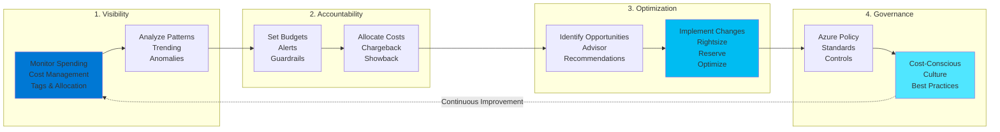
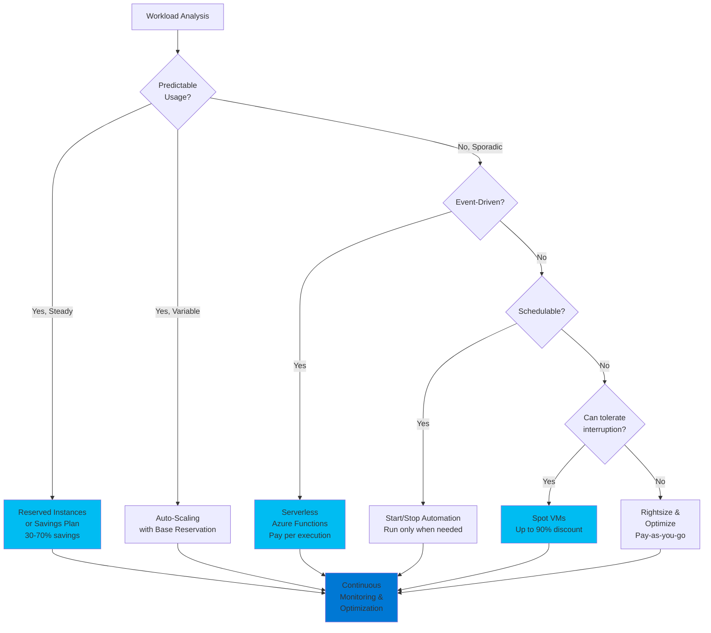

# Cost Optimization - Azure Well-Architected Framework

## Definition

Cost Optimization in the Azure Well-Architected Framework is the practice of managing and reducing cloud expenditure while maximizing business value. It involves making informed decisions about resource provisioning, utilization, and lifecycle management to achieve the optimal balance between cost and performance.

Cost optimization is not simply about minimizing expenses but rather about spending efficiently and strategically. It encompasses understanding spending patterns, eliminating waste, rightsizing resources, leveraging pricing models, and continuously monitoring and optimizing costs as workloads evolve.

The cost optimization pillar aligns closely with FinOps practices, bringing financial accountability to cloud operations through collaboration between engineering, finance, and business teams. It emphasizes visibility, accountability, and optimization as ongoing activities rather than one-time efforts.

## Design Principles

The Azure Well-Architected Framework defines the following core design principles for cost optimization:

1. **Choose the Right Resources**: Select Azure services and SKUs that match your workload requirements. Avoid over-provisioning by understanding actual needs versus perceived needs. Use PaaS services where appropriate to reduce operational costs.

2. **Set Budgets and Alerts**: Establish cost budgets at subscription, resource group, and resource levels. Configure proactive alerts to prevent cost overruns before they occur. Make cost visibility a standard practice.

3. **Dynamically Allocate and Deallocate Resources**: Resources that are not actively in use should be deallocated or deleted. Implement auto-scaling to match capacity with demand. Use Azure Automation to schedule resource startup and shutdown.

4. **Optimize Workloads and Architectures**: Continuously review and optimize architectures for cost efficiency. Refactor applications to use more cost-effective services. Eliminate redundancy and technical debt that drives unnecessary costs.

5. **Use Monitoring and Analytics**: Leverage Azure Cost Management, Azure Advisor, and Azure Monitor to gain visibility into spending patterns. Use tagging strategies to allocate costs to business units, projects, or environments.

6. **Leverage Pricing Models**: Take advantage of Azure Hybrid Benefit, Reserved Instances, Spot VMs, and other pricing options to reduce costs. Commit to long-term usage where appropriate for predictable workloads.

7. **Establish Governance and Policies**: Implement Azure Policy to prevent deployment of oversized or unnecessary resources. Use role-based access control (RBAC) to limit who can provision resources. Create cost-conscious culture through chargeback or showback models.

## Assessment Questions

Use these questions to evaluate the cost optimization posture of your Azure solutions:

1. **Cost Visibility**: Do you have clear visibility into your Azure spending by subscription, resource group, service type, and business unit? Are costs tagged and allocated appropriately?

2. **Budget Management**: Have you established budgets and cost alerts? Are budget thresholds monitored actively, and are there processes to respond to budget alerts?

3. **Resource Utilization**: Are you monitoring resource utilization metrics (CPU, memory, storage, network)? Have you identified underutilized resources that could be rightsized or deallocated?

4. **Unused Resources**: Do you have orphaned resources (unattached disks, unused public IPs, idle VMs, deleted application artifacts)? Is there a process to identify and remove unused resources?

5. **Licensing Optimization**: Are you leveraging Azure Hybrid Benefit for Windows Server and SQL Server? Have you evaluated Windows Virtual Desktop versus individual VM licenses?

6. **Commitment-Based Discounts**: Are you using Reserved Instances or Savings Plans for predictable workloads? What percentage of your compute spend is covered by commitments?

7. **Environment Management**: Are development and test environments running 24/7? Do you have automation to shut down non-production resources outside business hours?

8. **Data Storage Optimization**: Are you using appropriate storage tiers (hot, cool, archive) based on access patterns? Have you implemented lifecycle policies to automatically transition or delete old data?

9. **Network Costs**: Have you analyzed data transfer costs between regions, availability zones, and to the internet? Are you optimizing data transfer patterns and caching strategies?

10. **PaaS vs IaaS**: Have you evaluated whether PaaS alternatives could reduce operational costs compared to managing IaaS resources? Are you considering serverless options for event-driven workloads?

11. **Performance vs Cost**: Are you balancing performance requirements with cost? Have you identified opportunities to trade minor performance for significant cost savings?

12. **Cost Allocation**: Do you have a chargeback or showback model to allocate costs to business units? Are application teams aware of their cloud spending?

## Key Patterns and Practices

### 1. Right-Sizing Resources

Continuously analyze actual resource utilization and adjust VM sizes, database tiers, and service SKUs to match workload requirements.

**Implementation**: Use Azure Advisor recommendations, Azure Monitor metrics analysis, review VM utilization over 30-90 days. Downsize overprovisioned resources, upsize bottlenecked resources.

### 2. Auto-Scaling

Automatically adjust resource capacity based on demand patterns, scaling out during peak hours and scaling in during low-demand periods.

**Implementation**: Virtual Machine Scale Sets, Azure App Service auto-scale rules, Azure SQL Database elastic pools, Azure Functions consumption plan.

### 3. Resource Scheduling

Shut down non-production resources during nights and weekends when they're not needed.

**Implementation**: Azure Automation runbooks, Azure DevTest Labs schedules, Azure Logic Apps, third-party solutions like Azure Cost Management tools.

### 4. Reserved Instances and Savings Plans

Commit to one-year or three-year terms for predictable workloads to receive significant discounts (up to 72% compared to pay-as-you-go).

**Implementation**: Analyze stable workloads, purchase Azure Reserved VM Instances, Azure SQL Database reserved capacity, Azure Cosmos DB reserved capacity. Consider Azure Savings Plans for compute flexibility.

### 5. Spot Virtual Machines

Use Azure Spot VMs for interruptible workloads like batch processing, rendering, testing, and development at up to 90% discount.

**Implementation**: Batch processing jobs, CI/CD build agents, data analysis, fault-tolerant distributed workloads. Set maximum price limits and eviction policies.

### 6. Storage Tiering and Lifecycle Management

Store data in the most cost-effective tier based on access frequency. Automatically transition data to cooler tiers or delete expired data.

**Implementation**: Azure Blob Storage access tiers (hot, cool, archive), lifecycle management policies, Azure Files tiered storage.

### 7. Serverless Computing

Use consumption-based serverless services that charge only for actual usage rather than pre-provisioned capacity.

**Implementation**: Azure Functions, Logic Apps, Azure Container Instances (ACI), Azure Kubernetes Service (AKS) with Virtual Nodes, Consumption plan for Azure SQL.

### 8. Data Transfer Optimization

Minimize data egress costs by optimizing data transfer patterns, using CDNs, and keeping data processing in the same region as data storage.

**Implementation**: Azure CDN for content delivery, keep compute and storage in same region, use Azure Private Link to avoid egress charges, compress data before transfer.

### 9. Development and Test Environments

Use Dev/Test pricing subscriptions and lower-cost SKUs for non-production environments.

**Implementation**: Azure Dev/Test subscriptions, B-series burstable VMs for dev/test, Azure DevTest Labs with cost controls and auto-shutdown.

### 10. FinOps Operating Model

Establish cross-functional collaboration between engineering, finance, and business teams with shared responsibility for cloud costs.

**Implementation**: Regular cost reviews, cost allocation tags, chargeback/showback models, cost optimization KPIs, FinOps team or Center of Excellence.

## Mermaid Diagram Examples

### Cost Optimization Lifecycle

### Resource Scheduling Strategy

```mermaid
gantt
    title Resource Scheduling for Cost Optimization
    dateFormat  HH:mm
    axisFormat %H:%M

    section Production (24/7)
    Prod Web Servers     :active, 00:00, 24h
    Prod Database        :active, 00:00, 24h
    Prod Load Balancer   :active, 00:00, 24h

    section Development (Business Hours)
    Dev Environment      :         00:00, 9h
    Dev Running          :active,  09:00, 9h
    Dev Stopped          :         18:00, 6h

    section Test (Extended Hours)
    Test Environment     :         00:00, 8h
    Test Running         :active,  08:00, 12h
    Test Stopped         :         20:00, 4h

    section Batch Jobs (Off-Peak)
    Batch Processing     :         00:00, 2h
    Batch Running        :active,  02:00, 3h
    Batch Stopped        :         05:00, 19h
```

### Cost Optimization Decision Tree

## Implementation Checklist

Use this checklist when implementing cost optimization in your Azure solutions:

### Visibility and Monitoring
- [ ] Enable Azure Cost Management and Billing for all subscriptions
- [ ] Implement comprehensive tagging strategy (environment, owner, project, cost center)
- [ ] Configure cost alerts at subscription and resource group levels
- [ ] Set up regular cost reporting and dashboards
- [ ] Enable Azure Advisor and review cost recommendations weekly
- [ ] Export cost data to Power BI for advanced analysis
- [ ] Implement anomaly detection for unusual spending patterns

### Resource Optimization
- [ ] Review Azure Advisor recommendations and implement applicable suggestions
- [ ] Analyze VM utilization and rightsize overprovisioned resources
- [ ] Identify and delete orphaned resources (unattached disks, unused IPs, etc.)
- [ ] Review storage accounts and implement appropriate access tiers
- [ ] Analyze database performance metrics and adjust tier/DTUs
- [ ] Convert single-tenant resources to multi-tenant where possible
- [ ] Evaluate PaaS alternatives to IaaS workloads

### Pricing and Licensing
- [ ] Enable Azure Hybrid Benefit for all eligible Windows Server and SQL Server workloads
- [ ] Analyze stable workloads and purchase Reserved Instances or Savings Plans
- [ ] Evaluate Azure Spot VMs for interruptible workloads
- [ ] Review SQL Server licensing (core-based vs vCore-based)
- [ ] Consider Azure Dev/Test pricing for non-production subscriptions
- [ ] Negotiate Enterprise Agreement pricing for large-scale deployments

### Environment Management
- [ ] Implement auto-shutdown for development and test VMs
- [ ] Create Azure Automation runbooks for resource scheduling
- [ ] Use Azure DevTest Labs for development environments with cost controls
- [ ] Separate production and non-production subscriptions
- [ ] Implement approval workflows for high-cost resource deployments
- [ ] Regular cleanup of abandoned or forgotten test resources

### Architecture Optimization
- [ ] Implement auto-scaling for variable workloads
- [ ] Use serverless technologies (Functions, Logic Apps) for event-driven workloads
- [ ] Implement caching strategies to reduce compute and database costs
- [ ] Optimize data transfer by keeping data and compute in the same region
- [ ] Use Azure CDN to reduce bandwidth costs
- [ ] Implement queue-based processing to smooth demand spikes

### Data Management
- [ ] Implement blob lifecycle management policies for automatic tiering
- [ ] Archive or delete old logs and backups based on retention policies
- [ ] Use cool or archive storage for infrequently accessed data
- [ ] Compress data before storage and transmission
- [ ] Evaluate data retention requirements and reduce where possible
- [ ] Use appropriate replication strategies (LRS vs GRS) based on requirements

### Governance and Policy
- [ ] Implement Azure Policy to restrict deployment of oversized resources
- [ ] Create budget scopes for different teams, projects, or applications
- [ ] Establish chargeback or showback model for cost allocation
- [ ] Document and communicate cost optimization best practices
- [ ] Implement approval processes for new resource deployments
- [ ] Regular cost optimization reviews with stakeholders
- [ ] Train development teams on cost-conscious design patterns

### Network Optimization
- [ ] Minimize cross-region data transfer
- [ ] Use Azure Private Link to reduce egress charges
- [ ] Implement ExpressRoute for high-volume data transfer
- [ ] Evaluate VPN Gateway SKU requirements
- [ ] Optimize Azure Front Door and Application Gateway configurations
- [ ] Review and optimize Azure Firewall rules and logging

## Common Anti-Patterns

### 1. Always-On Non-Production Environments
**Problem**: Running development, test, and staging environments 24/7 when they're only used during business hours wastes 60-70% of costs.

**Solution**: Implement automated start/stop schedules. Use Azure Automation, DevTest Labs auto-shutdown, or Logic Apps to automatically deallocate resources outside business hours.

### 2. Ignoring Orphaned Resources
**Problem**: Deleting VMs but leaving disks, public IPs, and NICs attached. Deleting applications but leaving storage accounts and databases.

**Solution**: Implement regular audits for unattached resources. Use Azure Resource Graph queries to identify orphaned resources. Establish cleanup policies.

### 3. One-Size-Fits-All Provisioning
**Problem**: Using the same VM size or database tier for all environments, typically over-provisioning non-production to match production specs.

**Solution**: Rightsize each environment independently. Use lower SKUs for dev/test. Leverage Dev/Test pricing subscriptions.

### 4. No Reserved Capacity for Stable Workloads
**Problem**: Paying pay-as-you-go rates for resources that run continuously for months or years.

**Solution**: Analyze workload stability over 30-90 days. Purchase Reserved Instances or Savings Plans for predictable workloads to save 30-70%.

### 5. Excessive Data Replication
**Problem**: Using geo-redundant storage (GRS) for all data regardless of recovery requirements, tripling storage costs.

**Solution**: Evaluate recovery requirements per data set. Use locally redundant storage (LRS) or zone-redundant storage (ZRS) where geo-replication isn't needed.

### 6. Premium Resources for Non-Critical Workloads
**Problem**: Using premium SSD disks, high-tier databases, or premium service plans for non-production or low-priority workloads.

**Solution**: Match resource SKUs to actual requirements. Use standard disks for non-critical workloads. Leverage burstable B-series VMs for variable workloads.

### 7. No Cost Tagging Strategy
**Problem**: Cannot allocate costs to teams, projects, or applications. No visibility into which business units are driving spending.

**Solution**: Implement mandatory tagging policies using Azure Policy. Tag resources with cost center, project, owner, and environment. Use tags for chargeback models.

### 8. Ignoring Azure Advisor Recommendations
**Problem**: Not reviewing or acting on cost optimization recommendations provided by Azure Advisor.

**Solution**: Schedule regular reviews of Advisor recommendations. Prioritize and implement high-impact suggestions. Track recommendation adoption over time.

## Tradeoffs

Cost optimization decisions involve balancing multiple concerns:

### Cost vs. Performance
Lower-cost resources typically provide lower performance. Rightsizing too aggressively can impact user experience and application functionality.

**Balance**: Use performance testing to identify minimum acceptable resource levels. Monitor application performance metrics after optimization changes. Consider reserved instances for better price-performance.

### Cost vs. Reliability
Reducing redundancy, eliminating geo-replication, or using spot VMs can reduce costs but may impact availability and disaster recovery capabilities.

**Balance**: Align cost decisions with SLA requirements. Reduce costs in non-critical areas while maintaining investment in critical reliability features. Use different strategies for prod vs non-prod.

### Cost vs. Security
Some security features (DDoS protection, WAF, advanced threat protection) add costs. Cheaper SKUs may lack certain security capabilities.

**Balance**: Never compromise on security for cost savings. Find cost-effective security solutions. Leverage built-in security features before adding paid tiers.

### Cost vs. Operational Complexity
Cost optimization often adds complexity through auto-scaling, scheduling, multiple pricing models, and reservation management.

**Balance**: Start with simple, high-impact optimizations (rightsizing, scheduling). Gradually add complexity only where justified by savings. Use automation to manage complexity.

### Cost vs. Innovation Speed
Budget constraints and approval processes can slow down experimentation and innovation. Cost consciousness might discourage trying new services.

**Balance**: Allocate innovation budgets. Use sandbox subscriptions with spending limits. Implement quick approval for small experiments. Focus governance on high-cost resources.

### Short-Term vs. Long-Term Costs
Reserved Instances provide long-term savings but require upfront commitment. Pay-as-you-go offers flexibility but higher costs.

**Balance**: Use reserved capacity for stable, well-understood workloads. Keep flexibility for new or evolving applications. Mix pricing models appropriately.

## Microsoft Resources

### Official Documentation
- [Azure Well-Architected Framework - Cost Optimization](https://learn.microsoft.com/azure/well-architected/cost-optimization/)
- [Azure Cost Management and Billing](https://learn.microsoft.com/azure/cost-management-billing/)
- [Azure Advisor Cost Recommendations](https://learn.microsoft.com/azure/advisor/advisor-cost-recommendations)
- [Azure Pricing Calculator](https://azure.microsoft.com/pricing/calculator/)

### Cost Management Tools
- [Azure Cost Management](https://learn.microsoft.com/azure/cost-management-billing/costs/)
- [Azure Budgets](https://learn.microsoft.com/azure/cost-management-billing/costs/tutorial-acm-create-budgets)
- [Azure Advisor](https://learn.microsoft.com/azure/advisor/)
- [Cost analysis and reporting](https://learn.microsoft.com/azure/cost-management-billing/costs/quick-acm-cost-analysis)

### Pricing Options
- [Azure Reserved VM Instances](https://learn.microsoft.com/azure/cost-management-billing/reservations/save-compute-costs-reservations)
- [Azure Savings Plans](https://learn.microsoft.com/azure/cost-management-billing/savings-plan/)
- [Azure Spot Virtual Machines](https://learn.microsoft.com/azure/virtual-machines/spot-vms)
- [Azure Hybrid Benefit](https://learn.microsoft.com/azure/virtual-machines/windows/hybrid-use-benefit-licensing)
- [Dev/Test pricing](https://azure.microsoft.com/pricing/dev-test/)

### Optimization Guides
- [Azure VM cost optimization](https://learn.microsoft.com/azure/architecture/framework/cost/optimize-vm)
- [Azure Storage cost optimization](https://learn.microsoft.com/azure/storage/common/storage-plan-manage-costs)
- [Azure SQL cost optimization](https://learn.microsoft.com/azure/azure-sql/database/cost-management)
- [Azure Kubernetes Service cost optimization](https://learn.microsoft.com/azure/aks/best-practices-cost)

### FinOps and Best Practices
- [FinOps Foundation](https://www.finops.org/)
- [Microsoft Cloud Adoption Framework - Cost Management](https://learn.microsoft.com/azure/cloud-adoption-framework/govern/cost-management/)
- [Azure Architecture Center - Cost optimization patterns](https://learn.microsoft.com/azure/architecture/framework/cost/design-patterns)
- [Tagging strategy for cost tracking](https://learn.microsoft.com/azure/cloud-adoption-framework/ready/azure-best-practices/resource-tagging)

### Training and Certification
- [Microsoft Azure Fundamentals: Describe cost management in Azure](https://learn.microsoft.com/training/paths/microsoft-azure-fundamentals-describe-cost-management-azure/)
- [Control Azure spending and manage bills](https://learn.microsoft.com/training/paths/control-spending-manage-bills/)
- [Optimize costs on Azure](https://learn.microsoft.com/training/modules/analyze-costs-create-budgets-azure-cost-management/)

## When to Load This Reference

This cost optimization pillar reference should be loaded when the conversation includes:

- **Keywords**: "cost", "optimization", "FinOps", "budget", "pricing", "TCO", "savings", "reserved instances", "spend", "billing"
- **Scenarios**: Optimizing cloud spending, establishing budgets, selecting Azure services, subscription planning, cost allocation models
- **Architecture Reviews**: Evaluating cost efficiency, identifying cost optimization opportunities, right-sizing assessments
- **Financial Planning**: Creating cost projections, TCO analysis, ROI calculations, chargeback models
- **Resource Management**: Rightsizing resources, implementing auto-scaling, scheduling strategies

Load this reference in combination with:
- **Performance pillar**: When balancing performance requirements with cost constraints
- **Operational Excellence pillar**: For implementing automated cost optimization and monitoring
- **Sustainability**: For optimizing resource utilization and reducing waste
- **Business case development**: When calculating cloud economics and justifying investments
