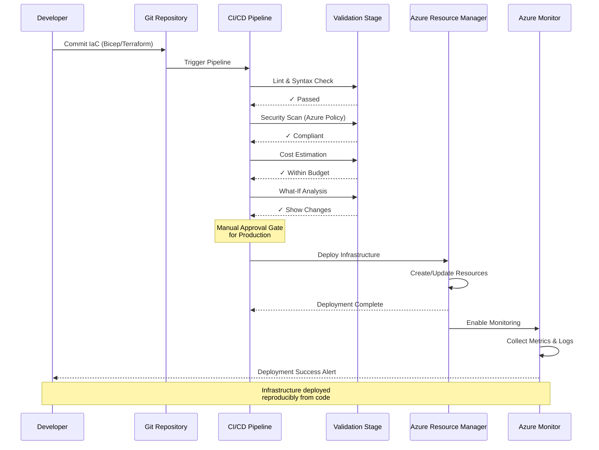
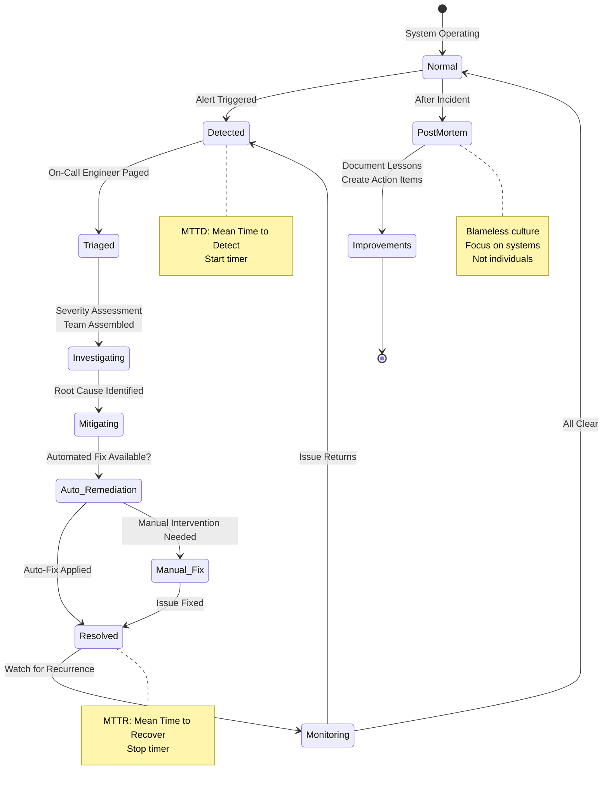

# Operational Excellence - Azure Well-Architected Framework

## Definition

Operational Excellence in the Azure Well-Architected Framework refers to the practices and processes that ensure systems are deployed, operated, monitored, and improved efficiently and reliably. It encompasses the operational processes that keep applications running in production, from deployment automation and infrastructure as code to monitoring, incident response, and continuous improvement.

Operational Excellence is about building sustainable operations that can evolve with business needs while maintaining high quality and minimizing toil. It emphasizes automation over manual processes, observability over reactive troubleshooting, and continuous learning over static procedures.

Modern cloud operations follow DevOps principles, bringing together development and operations teams with shared responsibility for the entire application lifecycle. This includes implementing CI/CD pipelines, infrastructure as code, comprehensive monitoring and observability, automated testing, and establishing a culture of continuous improvement and learning from failures.

## Design Principles

The Azure Well-Architected Framework defines the following core design principles for operational excellence:

1. **Infrastructure as Code (IaC)**: Define all infrastructure through code that can be versioned, tested, and deployed repeatedly. Treat infrastructure with the same rigor as application code. Eliminate manual configuration and "snowflake" environments.

2. **Continuous Integration and Continuous Deployment (CI/CD)**: Automate build, test, and deployment processes. Enable rapid, reliable releases through automated pipelines. Implement progressive deployment strategies like blue-green or canary releases.

3. **Comprehensive Monitoring and Observability**: Implement end-to-end visibility into system health, performance, and behavior. Use telemetry, logs, metrics, and traces to understand system state. Enable proactive issue detection before customers are impacted.

4. **Design for Operations**: Consider operational requirements during the design phase. Build in health monitoring, diagnostics, and troubleshooting capabilities. Make systems observable and debuggable from the start.

5. **Automate Routine Operations**: Eliminate manual, repetitive tasks through automation. Use orchestration, scripts, and runbooks for common operational procedures. Free operations teams to focus on value-added activities.

6. **Learn from Failures**: Implement blameless post-mortems for incidents. Capture lessons learned and feed them back into the system. Treat failures as opportunities to improve resilience and operations.

7. **Test in Production**: Use progressive exposure techniques, feature flags, and chaos engineering to validate operational readiness. Test recovery procedures regularly. Validate monitoring and alerting effectiveness.

8. **Optimize for Mean Time to Recovery (MTTR)**: While preventing failures is important, optimizing for rapid recovery is often more practical. Implement automated recovery, clear runbooks, and effective incident response processes.

## Assessment Questions

Use these questions to evaluate the operational excellence posture of your Azure solutions:

1. **Infrastructure as Code**: Is all infrastructure defined as code? Are you using ARM templates, Bicep, Terraform, or other IaC tools? Is infrastructure code version-controlled?

2. **CI/CD Pipelines**: Do you have automated build and deployment pipelines? How long does it take from commit to production deployment? Can you deploy multiple times per day safely?

3. **Deployment Strategy**: Do you use blue-green, canary, or progressive exposure deployments? Can you roll back quickly if issues are detected?

4. **Configuration Management**: Is configuration externalized from code? Are you using Azure App Configuration or Key Vault? How do you manage environment-specific settings?

5. **Monitoring and Alerting**: Do you have comprehensive application and infrastructure monitoring? Are alerts actionable and routed to the right teams? What's your alert-to-noise ratio?

6. **Observability**: Can you understand system behavior through logs, metrics, and traces? Do you have distributed tracing across microservices? Can you debug production issues effectively?

7. **Incident Response**: Do you have documented incident response procedures? What's your mean time to detect (MTTD) and mean time to recover (MTTR)? Do you conduct post-mortems?

8. **Change Management**: Is there a clear process for deploying changes? How do you handle emergency changes? Are changes tracked and auditable?

9. **Backup and Recovery**: Are backups automated and tested? Have you validated recovery procedures? What are your RTO and RPO targets, and can you meet them?

10. **Documentation**: Is operational documentation up-to-date? Are runbooks automated where possible? Is tribal knowledge captured and shared?

11. **Testing**: Do you have automated unit, integration, and end-to-end tests? Do you perform load testing and chaos testing? What's your test coverage?

12. **Continuous Improvement**: Do you regularly review operational metrics and improve processes? Are retrospectives conducted after incidents? Is there a culture of learning and experimentation?

## Key Patterns and Practices

### 1. Infrastructure as Code (IaC)

Define, deploy, and manage infrastructure through declarative code files rather than manual configuration.

**Implementation**: Azure Resource Manager (ARM) templates, Bicep, Terraform, Pulumi. Store in Git repositories, apply code review practices, automate deployment through pipelines.

### 2. GitOps and Version Control

Use Git as the single source of truth for both application code and infrastructure. Deploy through Git-based workflows.

**Implementation**: Azure DevOps Repos, GitHub, GitLab. Implement branch policies, pull request workflows, automated validation. Use Git history for audit trails.

### 3. CI/CD Pipelines

Automate the entire software delivery process from code commit to production deployment.

**Implementation**: Azure Pipelines, GitHub Actions, Jenkins, GitLab CI. Include stages for build, test, security scanning, approval gates, deployment, and verification.

### 4. Progressive Exposure Deployment

Gradually roll out changes to minimize blast radius and enable quick rollback if issues arise.

**Implementation**: Blue-green deployments, canary releases, traffic splitting with Azure Traffic Manager or Application Gateway, feature flags with Azure App Configuration.

### 5. Comprehensive Monitoring and Alerting

Collect, analyze, and act on telemetry from all system components.

**Implementation**: Azure Monitor, Application Insights, Log Analytics, Azure Workbooks for dashboards. Configure smart alerts based on metrics, logs, and anomalies.

### 6. Distributed Tracing

Track requests across multiple services to understand end-to-end transaction flow and identify bottlenecks.

**Implementation**: Application Insights with distributed tracing, OpenTelemetry, correlation IDs across services, dependency mapping.

### 7. Automated Testing

Implement comprehensive automated testing at multiple levels to catch issues before production.

**Implementation**: Unit tests in CI pipeline, integration tests, end-to-end tests, load/performance tests, security tests (SAST/DAST), chaos engineering experiments.

### 8. Self-Healing Systems

Implement automatic detection and remediation of common failure scenarios.

**Implementation**: Azure Automation runbooks, Azure Functions for automated responses, health probes with automatic restarts, auto-scaling to handle degraded instances.

### 9. Immutable Infrastructure

Deploy new infrastructure versions rather than modifying existing resources. Treat servers as disposable.

**Implementation**: Container-based deployments (AKS, ACI), VM image pipelines with Packer, infrastructure replacement rather than updates.

### 10. Chaos Engineering

Proactively inject failures into production to validate resilience and recovery procedures.

**Implementation**: Azure Chaos Studio, regular disaster recovery drills, failure injection testing, game days for incident response practice.

## Mermaid Diagram Examples

### DevOps Pipeline with Security and Observability

```mermaid
graph LR
    subgraph "Development"
        DEV[Developer] -->|Commit| GIT[Git Repository<br/>Azure Repos/GitHub]
    end

    subgraph "Continuous Integration"
        GIT -->|Trigger| BUILD[Build<br/>Compile & Package]
        BUILD --> UNIT[Unit Tests<br/>Code Coverage]
        UNIT --> SAST[Security Scan<br/>SAST/Dependency Check]
    end

    subgraph "Artifact Management"
        SAST --> ARTIFACT[Azure Artifacts<br/>Container Registry<br/>Versioned Packages]
    end

    subgraph "Continuous Deployment"
        ARTIFACT --> DEV_DEPLOY[Deploy to Dev<br/>Automated]
        DEV_DEPLOY --> INT_TEST[Integration Tests<br/>API Tests]
        INT_TEST --> STAGE_DEPLOY[Deploy to Staging<br/>Approval Gate]
        STAGE_DEPLOY --> E2E_TEST[E2E Tests<br/>Smoke Tests]
        E2E_TEST --> PROD_DEPLOY[Deploy to Production<br/>Canary/Blue-Green]
    end

    subgraph "Observability"
        PROD_DEPLOY --> MONITOR[Azure Monitor<br/>Application Insights]
        MONITOR --> LOGS[Log Analytics<br/>Centralized Logging]
        MONITOR --> METRICS[Metrics & Alerts<br/>Performance Monitoring]
        MONITOR --> TRACE[Distributed Tracing<br/>Dependency Maps]
    end

    subgraph "Operations"
        METRICS --> ALERT{Alert<br/>Triggered?}
        ALERT -->|Yes| INCIDENT[Incident Response<br/>Auto-remediation]
        ALERT -->|No| DASHBOARD[Dashboards<br/>Health Monitoring]
        INCIDENT --> POSTMORTEM[Post-Mortem<br/>Lessons Learned]
        POSTMORTEM -.->|Improvements| DEV
    end

    style GIT fill:#0078d4
    style ARTIFACT fill:#0078d4
    style MONITOR fill:#00bcf2
    style ALERT fill:#d83b01
```

### Infrastructure as Code Workflow

### Incident Response Flow

## Implementation Checklist

Use this checklist when implementing operational excellence in your Azure solutions:

### Infrastructure as Code
- [ ] All infrastructure defined as code (ARM, Bicep, Terraform)
- [ ] IaC templates stored in version control (Git)
- [ ] IaC changes go through code review process
- [ ] Automated validation and linting in CI pipeline
- [ ] Azure Policy integration for compliance checks
- [ ] Parameterized templates for multiple environments
- [ ] Documentation for IaC codebase and patterns

### CI/CD Pipeline
- [ ] Automated build pipeline triggered on code commit
- [ ] Automated unit tests with minimum code coverage threshold
- [ ] Integration tests included in pipeline
- [ ] Security scanning (SAST, dependency check, container scanning)
- [ ] Artifact versioning and retention policies
- [ ] Automated deployment to non-production environments
- [ ] Manual approval gates for production deployments
- [ ] Automated smoke tests after deployment
- [ ] Rollback procedures documented and tested

### Deployment Strategies
- [ ] Blue-green or canary deployment strategy implemented
- [ ] Traffic splitting capabilities configured
- [ ] Feature flags for progressive rollout
- [ ] Health checks integrated with deployment process
- [ ] Automated rollback on deployment failure
- [ ] Zero-downtime deployment capability
- [ ] Database migration strategy (forward-compatible changes)

### Monitoring and Observability
- [ ] Application Insights enabled for all applications
- [ ] Custom metrics and events instrumented
- [ ] Distributed tracing configured across services
- [ ] Log Analytics workspace configured
- [ ] Diagnostic settings enabled for all Azure resources
- [ ] Azure Monitor workbooks created for key dashboards
- [ ] Availability tests configured for critical endpoints
- [ ] SLA/SLO monitoring implemented

### Alerting and Incident Response
- [ ] Alert rules configured for critical metrics
- [ ] Smart detection and anomaly alerts enabled
- [ ] Alerts integrated with incident management system
- [ ] On-call rotation and escalation policies defined
- [ ] Runbooks created for common incidents
- [ ] Incident response procedures documented
- [ ] Post-mortem template and process established
- [ ] Communication channels for incidents defined

### Configuration Management
- [ ] Configuration externalized from application code
- [ ] Azure App Configuration or Key Vault used
- [ ] Secrets never stored in code or config files
- [ ] Environment-specific configuration managed separately
- [ ] Configuration changes tracked and auditable
- [ ] Feature flags implemented for runtime toggles
- [ ] Configuration validation before application startup

### Testing and Validation
- [ ] Unit test coverage meets minimum threshold (e.g., 80%)
- [ ] Integration tests cover critical paths
- [ ] End-to-end tests validate key user scenarios
- [ ] Load and performance testing conducted regularly
- [ ] Chaos engineering experiments scheduled
- [ ] Disaster recovery procedures tested quarterly
- [ ] Security testing integrated (SAST, DAST, penetration testing)

### Backup and Recovery
- [ ] Automated backup configured for all stateful resources
- [ ] Backup retention policies defined and implemented
- [ ] Recovery procedures documented and tested
- [ ] RTO and RPO requirements documented and validated
- [ ] Geo-redundancy implemented where required
- [ ] Point-in-time recovery capability validated

### Documentation and Knowledge Management
- [ ] Architecture decision records (ADRs) maintained
- [ ] Runbooks automated where possible
- [ ] Troubleshooting guides created for common issues
- [ ] Onboarding documentation for new team members
- [ ] Dependency maps and architecture diagrams up-to-date
- [ ] Change log maintained for production deployments
- [ ] Knowledge base with lessons learned from incidents

### Continuous Improvement
- [ ] Regular retrospectives scheduled
- [ ] Operational metrics tracked and reviewed (MTTR, MTTD, deployment frequency)
- [ ] Technical debt tracked and prioritized
- [ ] Innovation time allocated for improvements
- [ ] Feedback loops from operations to development
- [ ] Regular review of Azure Advisor recommendations
- [ ] Continuous learning culture fostered

## Common Anti-Patterns

### 1. Manual Infrastructure Changes
**Problem**: Making configuration changes directly in the Azure Portal or via CLI without updating IaC code leads to drift and inconsistency.

**Solution**: Enforce infrastructure as code for all changes. Use Azure Policy to prevent manual modifications. Treat IaC as the source of truth.

### 2. Missing or Inadequate Monitoring
**Problem**: Deploying applications without proper monitoring, relying on user reports to discover issues.

**Solution**: Implement comprehensive monitoring before production deployment. Monitor application health, business metrics, and user experience. Set up proactive alerting.

### 3. Alert Fatigue
**Problem**: Too many noisy alerts that aren't actionable, leading to ignored alerts and missed critical issues.

**Solution**: Tune alerts to be actionable and meaningful. Use smart detection and anomaly detection. Implement alert severity levels and on-call escalation.

### 4. No Rollback Strategy
**Problem**: Deploying changes without ability to quickly revert, leading to extended outages when issues occur.

**Solution**: Implement blue-green or canary deployments. Test rollback procedures. Maintain ability to roll back database changes. Use feature flags for instant disabling of problematic features.

### 5. Untested Disaster Recovery
**Problem**: Having DR plans that have never been tested, which fail when actually needed.

**Solution**: Conduct regular DR drills and game days. Test backup restoration. Validate failover procedures. Update runbooks based on test results.

### 6. Configuration in Code
**Problem**: Hard-coding configuration and secrets in application code, making changes require redeployment and creating security risks.

**Solution**: Externalize all configuration to Azure App Configuration or environment variables. Store secrets in Key Vault. Use managed identities for authentication.

### 7. Tribal Knowledge Operations
**Problem**: Relying on specific individuals' knowledge to operate systems, creating single points of failure.

**Solution**: Document all operational procedures. Automate common tasks. Cross-train team members. Use runbooks and decision trees for incident response.

### 8. No Testing in CI/CD
**Problem**: Deploying code without automated testing, discovering bugs in production.

**Solution**: Implement comprehensive automated testing in CI/CD pipeline. Require passing tests before deployment. Use code coverage metrics to ensure adequate testing.

### 9. Snowflake Environments
**Problem**: Each environment (dev, test, prod) configured differently through manual changes, making issues hard to reproduce.

**Solution**: Use infrastructure as code to create consistent environments. Use same deployment process for all environments. Maintain parity between prod and non-prod.

### 10. Reactive Instead of Proactive
**Problem**: Only addressing issues after they cause customer impact rather than proactively detecting and preventing problems.

**Solution**: Implement comprehensive monitoring and alerting. Use synthetic monitoring and availability tests. Conduct chaos engineering to find weaknesses before they cause outages.

## Tradeoffs

Operational excellence decisions involve balancing multiple concerns:

### Automation vs. Flexibility
Heavy automation and IaC can reduce flexibility for quick experimental changes or one-off configurations.

**Balance**: Provide sandbox environments for experimentation. Use feature flags for rapid changes. Maintain fast path for approved changes while enforcing governance on production.

### Observability vs. Cost
Comprehensive monitoring, logging, and tracing generates large volumes of telemetry data with associated storage and processing costs.

**Balance**: Implement log sampling for high-volume applications. Use tiered retention policies. Focus detailed monitoring on critical paths. Use cost-effective log aggregation strategies.

### Release Frequency vs. Stability
More frequent releases increase deployment risk and potential for introducing bugs, but also enable faster feature delivery and bug fixes.

**Balance**: Implement progressive deployment strategies (canary, blue-green). Use feature flags to decouple deployment from release. Invest in automated testing to maintain quality at speed.

### Standardization vs. Team Autonomy
Standardized tools and processes improve consistency but may limit teams' ability to choose best tools for their specific needs.

**Balance**: Define standards for critical areas (security, monitoring) while allowing flexibility in development tools. Use platform teams to provide golden paths without mandating them.

### Incident Response Speed vs. Thoroughness
Pressure to restore service quickly may conflict with thorough root cause analysis and proper fixes.

**Balance**: Focus first on mitigation and recovery (MTTR). Conduct proper root cause analysis in post-mortems. Implement temporary fixes quickly, then schedule proper resolution.

### Testing Coverage vs. Development Speed
Comprehensive testing increases confidence but slows down feature development and requires test maintenance overhead.

**Balance**: Focus testing on critical paths and high-risk areas. Use risk-based testing strategies. Automate test creation where possible. Accept higher test coverage requirements for production code.

## Microsoft Resources

### Official Documentation
- [Azure Well-Architected Framework - Operational Excellence](https://learn.microsoft.com/azure/well-architected/operational-excellence/)
- [DevOps resource center](https://learn.microsoft.com/devops/)
- [Azure DevOps documentation](https://learn.microsoft.com/azure/devops/)
- [GitHub Actions for Azure](https://learn.microsoft.com/azure/developer/github/github-actions)

### Infrastructure as Code
- [Azure Resource Manager templates](https://learn.microsoft.com/azure/azure-resource-manager/templates/)
- [Bicep documentation](https://learn.microsoft.com/azure/azure-resource-manager/bicep/)
- [Terraform on Azure](https://learn.microsoft.com/azure/developer/terraform/)
- [Azure Automation](https://learn.microsoft.com/azure/automation/)

### CI/CD and Deployment
- [Azure Pipelines](https://learn.microsoft.com/azure/devops/pipelines/)
- [Deployment strategies](https://learn.microsoft.com/azure/architecture/guide/deployment-strategies/)
- [Blue-green deployment](https://learn.microsoft.com/azure/architecture/example-scenario/blue-green-spring/blue-green-spring)
- [Canary deployments](https://learn.microsoft.com/azure/architecture/solution-ideas/articles/canary-deployments-immutable-infrastructure)

### Monitoring and Observability
- [Azure Monitor](https://learn.microsoft.com/azure/azure-monitor/)
- [Application Insights](https://learn.microsoft.com/azure/azure-monitor/app/app-insights-overview)
- [Log Analytics](https://learn.microsoft.com/azure/azure-monitor/logs/log-analytics-overview)
- [Distributed tracing](https://learn.microsoft.com/azure/azure-monitor/app/distributed-tracing)
- [Azure Workbooks](https://learn.microsoft.com/azure/azure-monitor/visualize/workbooks-overview)

### Testing and Quality
- [Azure Load Testing](https://learn.microsoft.com/azure/load-testing/)
- [Azure Chaos Studio](https://learn.microsoft.com/azure/chaos-studio/)
- [Testing strategies](https://learn.microsoft.com/azure/architecture/checklist/dev-ops)
- [Microsoft Security Code Analysis](https://learn.microsoft.com/azure/security/develop/security-code-analysis-overview)

### Configuration and Secrets Management
- [Azure App Configuration](https://learn.microsoft.com/azure/azure-app-configuration/)
- [Azure Key Vault](https://learn.microsoft.com/azure/key-vault/)
- [Managed identities](https://learn.microsoft.com/azure/active-directory/managed-identities-azure-resources/)

### Patterns and Best Practices
- [DevOps patterns](https://learn.microsoft.com/azure/architecture/guide/devops/devops-patterns)
- [Deployment patterns](https://learn.microsoft.com/azure/architecture/patterns/category/devops)
- [Operational excellence checklist](https://learn.microsoft.com/azure/well-architected/operational-excellence/checklist)

### Training and Certification
- [AZ-400: Designing and Implementing Microsoft DevOps Solutions](https://learn.microsoft.com/certifications/exams/az-400)
- [DevOps Engineer learning path](https://learn.microsoft.com/training/browse/?roles=devops-engineer)
- [Infrastructure as Code learning path](https://learn.microsoft.com/training/paths/az-400-develop-sre-strategy/)

## When to Load This Reference

This operational excellence pillar reference should be loaded when the conversation includes:

- **Keywords**: "operational", "DevOps", "CI/CD", "automation", "monitoring", "observability", "deployment", "infrastructure as code", "IaC", "incident response"
- **Scenarios**: Setting up CI/CD pipelines, implementing monitoring, establishing DevOps practices, automating operations, incident management
- **Architecture Reviews**: Evaluating operational readiness, reviewing deployment processes, assessing monitoring coverage
- **Tooling Decisions**: Selecting DevOps tools, choosing monitoring solutions, implementing IaC frameworks
- **Process Improvement**: Reducing MTTR, improving deployment frequency, establishing SRE practices

Load this reference in combination with:
- **Reliability pillar**: For implementing resilient operations and recovery procedures
- **Security pillar**: For DevSecOps practices and secure pipeline implementation
- **Performance pillar**: When implementing performance monitoring and optimization
- **Azure service-specific documentation**: For service-specific operational best practices
