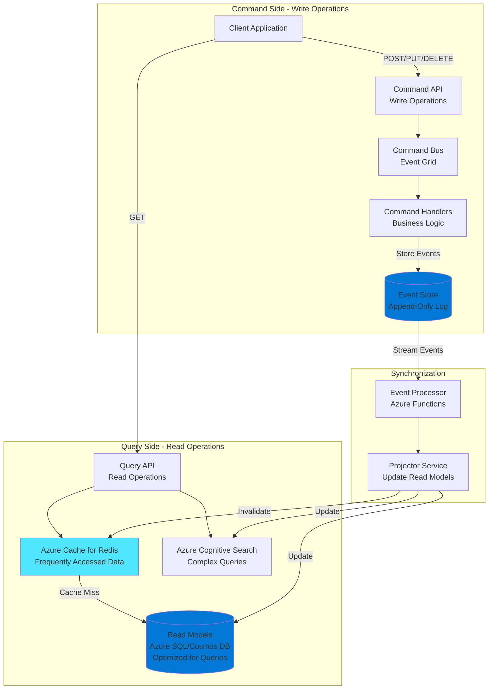
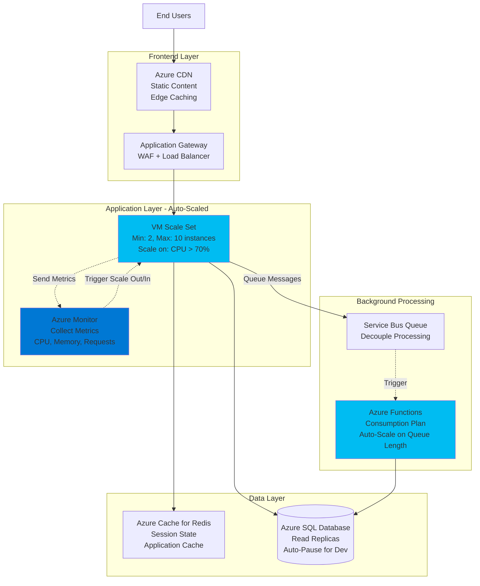
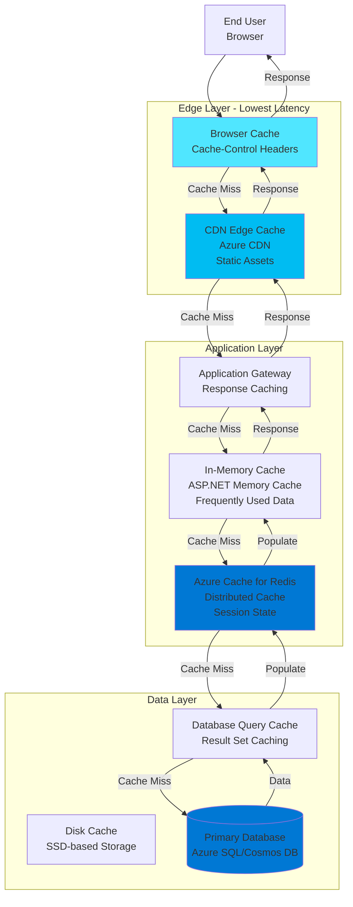

# Performance Efficiency - Azure Well-Architected Framework

## Definition

Performance Efficiency in the Azure Well-Architected Framework refers to the ability of a system to adapt to changes in load by efficiently using available resources to meet performance requirements. It encompasses the practices and patterns that ensure applications respond quickly and scale effectively while maintaining optimal resource utilization.

Performance Efficiency is not just about raw speed but about delivering the right level of performance at the right cost. It involves understanding performance requirements, selecting appropriate Azure services and configurations, implementing scalability patterns, optimizing data access, and continuously monitoring and tuning performance as workload demands evolve.

Modern cloud applications must handle varying loads gracefully, from baseline steady-state operations to burst traffic from events like marketing campaigns or seasonal peaks. Performance Efficiency ensures systems can scale horizontally and vertically, leverage caching and content delivery networks, implement asynchronous processing, and use appropriate data partitioning strategies.

## Design Principles

The Azure Well-Architected Framework defines the following core design principles for performance efficiency:

1. **Design for Horizontal Scaling**: Build applications that can scale out by adding more instances rather than scaling up by using larger instances. Horizontal scaling provides better fault tolerance and cost efficiency.

2. **Use Caching Strategically**: Cache data at multiple layers to reduce latency and backend load. Implement caching for frequently accessed data, computed results, and static content.

3. **Optimize Data Access**: Minimize network calls, implement efficient queries, use appropriate indexing, and consider data locality. Reduce the amount of data transferred and processed.

4. **Implement Asynchronous Processing**: Use message queues and event-driven architectures to decouple components and handle operations asynchronously. Don't make users wait for long-running operations.

5. **Partition Data and Workloads**: Distribute data and processing across multiple resources to improve parallelism and avoid bottlenecks. Use sharding, partitioning, and distributed architectures.

6. **Choose the Right Data Store**: Select the appropriate database or storage service for each use case. Use polyglot persistence with specialized stores for different data types and access patterns.

7. **Monitor and Optimize Continuously**: Measure performance regularly, identify bottlenecks, and optimize iteratively. Performance tuning is an ongoing process, not a one-time activity.

8. **Design for Network Efficiency**: Minimize data transfer, use compression, implement CDNs for content delivery, and keep related components in the same region to reduce latency.

## Assessment Questions

Use these questions to evaluate the performance efficiency posture of your Azure solutions:

1. **Performance Requirements**: Have you defined clear performance requirements (response time, throughput, concurrent users)? Are these requirements documented and measurable?

2. **Load Testing**: Have you conducted load and stress testing to understand system capacity and breaking points? Do you know how the application behaves under peak load?

3. **Scalability Design**: Can your application scale horizontally? Are there any components that cannot scale out and might become bottlenecks?

4. **Auto-Scaling Configuration**: Have you implemented auto-scaling rules based on metrics? Are scaling triggers set appropriately to handle traffic spikes before performance degrades?

5. **Caching Implementation**: Are you caching data at appropriate layers (CDN, application, database)? What's your cache hit rate? Are cache invalidation strategies implemented correctly?

6. **Database Performance**: Are database queries optimized with proper indexes? Have you identified slow queries and N+1 query problems? Is connection pooling implemented?

7. **Data Partitioning**: Is data partitioned or sharded to distribute load? Are hot partitions identified and addressed?

8. **Asynchronous Processing**: Are long-running operations handled asynchronously? Are message queues used to decouple components and smooth traffic spikes?

9. **Network Latency**: Have you measured network latency between components? Are compute and data resources co-located in the same region? Is CDN used for static content?

10. **Resource Bottlenecks**: Have you identified resource bottlenecks (CPU, memory, disk I/O, network)? Are resources sized appropriately for the workload?

11. **API Design**: Are APIs designed efficiently? Is pagination implemented for large result sets? Are you using appropriate protocols (HTTP/2, gRPC)?

12. **Code Optimization**: Have you profiled application code to identify performance hotspots? Are algorithms and data structures optimized?

## Key Patterns and Practices

### 1. Horizontal Scaling (Scale-Out)

Add more instances of application components to handle increased load rather than upgrading to larger instances.

**Implementation**: Azure Virtual Machine Scale Sets, Azure App Service scale-out, Azure Kubernetes Service (AKS) pod scaling, Azure Functions scaling, load balancers for traffic distribution.

### 2. Auto-Scaling

Automatically adjust the number of running instances based on demand metrics like CPU, memory, or request count.

**Implementation**: Azure Monitor autoscale rules, AKS Horizontal Pod Autoscaler, Azure Functions consumption plan automatic scaling, schedule-based scaling for predictable patterns.

### 3. Caching Strategy

Store frequently accessed data in fast-access storage to reduce backend load and improve response times.

**Implementation**: Azure Cache for Redis for application caching, Azure CDN for static content, Application Gateway caching, in-memory caching within applications, database query result caching.

### 4. Content Delivery Network (CDN)

Distribute static content to edge locations close to users to reduce latency and bandwidth consumption.

**Implementation**: Azure CDN for images, JavaScript, CSS, videos. Configure caching rules, compression, and geo-filtering. Integrate with Azure Storage and App Service.

### 5. Asynchronous Request-Reply Pattern

Handle long-running operations asynchronously to avoid blocking client requests and improve perceived responsiveness.

**Implementation**: Azure Service Bus queues, Azure Event Grid, Azure Storage Queues, polling endpoints for status checks, webhooks for completion notifications.

### 6. Queue-Based Load Leveling

Use message queues to buffer requests between components, allowing downstream systems to process at their own pace.

**Implementation**: Azure Service Bus, Azure Event Hubs for high-throughput streaming, Azure Storage Queues for simple messaging, worker roles to process queue messages.

### 7. CQRS (Command Query Responsibility Segregation)

Separate read and write operations to optimize each independently with different models, schemas, and scaling strategies.

**Implementation**: Azure Cosmos DB for write model, Azure SQL Database read replicas for query model, Azure Search for complex queries, event sourcing for command processing.

### 8. Database Scaling Patterns

Scale databases horizontally through sharding, read replicas, or polyglot persistence.

**Implementation**: Azure SQL Database Hyperscale, Cosmos DB partitioning, read replicas for read-heavy workloads, Azure Database for PostgreSQL/MySQL flexible server scaling.

### 9. Compression and Minification

Reduce data transfer size to improve load times and reduce bandwidth costs.

**Implementation**: Enable compression in Azure App Service, Application Gateway, and CDN. Minify JavaScript and CSS. Use efficient data formats (Protocol Buffers, MessagePack).

### 10. Connection Pooling and Multiplexing

Reuse connections to avoid the overhead of establishing new connections for each request.

**Implementation**: Database connection pooling, HTTP connection reuse, multiplexed connections in HTTP/2 and gRPC, Azure SignalR Service for WebSocket connection management.

## Mermaid Diagram Examples

### CQRS Pattern with Event Sourcing

### Auto-Scaling Architecture

### Caching Strategy Layers

## Implementation Checklist

Use this checklist when implementing performance efficiency in your Azure solutions:

### Architecture and Design
- [ ] Define clear performance requirements (response time, throughput, SLAs)
- [ ] Design for horizontal scaling from the beginning
- [ ] Identify stateless vs stateful components
- [ ] Plan data partitioning and sharding strategy
- [ ] Design APIs for efficiency (pagination, filtering, compression)
- [ ] Implement asynchronous processing for long-running operations
- [ ] Choose appropriate Azure services for workload characteristics

### Scalability
- [ ] Configure auto-scaling rules for compute resources
- [ ] Test scaling behavior under load
- [ ] Implement health checks for scale set instances
- [ ] Use Azure Load Balancer or Application Gateway for distribution
- [ ] Configure connection draining for graceful instance removal
- [ ] Plan for scale limits and quotas
- [ ] Implement circuit breakers for dependent services

### Caching
- [ ] Implement Azure CDN for static content delivery
- [ ] Deploy Azure Cache for Redis for application caching
- [ ] Configure cache expiration and eviction policies
- [ ] Implement cache-aside pattern for data caching
- [ ] Use browser caching with appropriate headers
- [ ] Cache authentication tokens and session state
- [ ] Monitor cache hit rates and optimize accordingly

### Data Access Optimization
- [ ] Optimize database queries and add appropriate indexes
- [ ] Implement connection pooling
- [ ] Use read replicas for read-heavy workloads
- [ ] Implement data pagination for large result sets
- [ ] Minimize N+1 query problems
- [ ] Use projection to retrieve only needed columns
- [ ] Implement database query caching where appropriate
- [ ] Consider denormalization for read-optimized scenarios

### Asynchronous Processing
- [ ] Implement message queues for background processing
- [ ] Use Azure Functions for event-driven processing
- [ ] Implement async/await patterns in application code
- [ ] Provide status endpoints for long-running operations
- [ ] Use webhooks for completion notifications
- [ ] Implement retry policies for message processing
- [ ] Configure dead-letter queues for failed messages

### Network Optimization
- [ ] Co-locate compute and data resources in the same region
- [ ] Use Azure Private Link for PaaS service access
- [ ] Enable compression for API responses
- [ ] Implement HTTP/2 or gRPC for efficient communication
- [ ] Minimize payload sizes through efficient serialization
- [ ] Use Azure Front Door for global applications
- [ ] Configure Azure Traffic Manager for geo-routing

### Application Optimization
- [ ] Profile application code to identify bottlenecks
- [ ] Optimize algorithms and data structures
- [ ] Minimize synchronous dependencies
- [ ] Implement lazy loading for resources
- [ ] Use efficient serialization formats (JSON, Protocol Buffers)
- [ ] Minimize reflection and dynamic code generation
- [ ] Implement proper disposal of resources
- [ ] Use compiled queries for Entity Framework

### Monitoring and Optimization
- [ ] Configure Application Insights performance monitoring
- [ ] Set up Application Performance Management (APM)
- [ ] Monitor key performance metrics (response time, throughput)
- [ ] Configure performance alerts and anomaly detection
- [ ] Analyze slow requests and dependencies
- [ ] Create performance baselines and trends
- [ ] Conduct regular performance testing
- [ ] Implement distributed tracing for microservices

### Load Testing
- [ ] Conduct load testing with expected traffic patterns
- [ ] Perform stress testing to identify breaking points
- [ ] Test auto-scaling behavior under load
- [ ] Validate performance under sustained load (soak testing)
- [ ] Test spike traffic scenarios
- [ ] Use Azure Load Testing or third-party tools
- [ ] Test with production-like data volumes

### Database Performance
- [ ] Analyze and optimize slow queries
- [ ] Implement appropriate indexing strategy
- [ ] Consider partitioning for large tables
- [ ] Use database-specific performance features (columnstore, in-memory)
- [ ] Monitor database DTU/vCore utilization
- [ ] Implement retry logic for transient failures
- [ ] Consider read replicas or scale-out options
- [ ] Evaluate alternative data stores for specific use cases

## Common Anti-Patterns

### 1. Chatty I/O
**Problem**: Making many small, frequent calls to databases or APIs rather than batching requests, causing network overhead and latency.

**Solution**: Batch operations, use bulk APIs, implement data aggregation, cache frequently accessed data, and reduce round trips.

### 2. Synchronous I/O in Request Path
**Problem**: Performing blocking I/O operations during request processing, limiting throughput and scalability.

**Solution**: Use async/await patterns, implement asynchronous APIs, offload long-running operations to background jobs, and use message queues.

### 3. N+1 Query Problem
**Problem**: Executing a query for a parent record and then N separate queries for related records, causing excessive database calls.

**Solution**: Use eager loading, join queries, or GraphQL to fetch related data in a single query. Implement data loader patterns.

### 4. No Caching Strategy
**Problem**: Repeatedly querying databases or APIs for the same data, causing unnecessary load and latency.

**Solution**: Implement multi-layer caching strategy with appropriate TTLs. Use CDN for static content, Redis for application data, and query result caching.

### 5. Monolithic Architecture
**Problem**: Single large application that cannot scale different components independently, leading to inefficient resource usage.

**Solution**: Decompose into microservices or modules that can scale independently. Use CQRS to scale read and write operations separately.

### 6. No Database Connection Pooling
**Problem**: Creating new database connections for each request, causing high overhead and connection exhaustion.

**Solution**: Implement connection pooling at the application level. Use managed services that handle connection pooling automatically.

### 7. Over-Fetching Data
**Problem**: Retrieving entire objects or large result sets when only a small subset of data is needed.

**Solution**: Implement projection to select only required fields. Use pagination for large datasets. Implement GraphQL for flexible data fetching.

### 8. Vertical Scaling Only
**Problem**: Only scaling up to larger instances rather than scaling out with more instances, hitting limits and reducing fault tolerance.

**Solution**: Design for horizontal scaling. Use stateless services, external session storage, and load balancers to enable scale-out.

### 9. Hot Partitions
**Problem**: Data or workload unevenly distributed across partitions, causing bottlenecks on specific partitions while others are underutilized.

**Solution**: Choose partition keys carefully to ensure even distribution. Monitor partition metrics and rebalance if needed. Consider compound partition keys.

### 10. Not Monitoring Performance
**Problem**: Deploying without performance monitoring, making it impossible to identify bottlenecks or degradation.

**Solution**: Implement comprehensive APM with Application Insights. Monitor response times, dependencies, and exceptions. Set performance baselines and alerts.

## Tradeoffs

Performance efficiency decisions involve balancing multiple concerns:

### Performance vs. Cost
Higher performance often requires premium SKUs, more instances, or specialized services that increase costs.

**Balance**: Right-size resources to meet requirements without over-provisioning. Use auto-scaling to match capacity with demand. Consider reserved instances for baseline capacity.

### Performance vs. Consistency
Strong consistency often impacts performance, especially in distributed systems across regions.

**Balance**: Use eventual consistency where acceptable for business requirements. Implement CQRS to separate strongly consistent writes from eventually consistent reads.

### Performance vs. Complexity
Performance optimizations like caching, sharding, and CQRS add architectural and operational complexity.

**Balance**: Start simple and add complexity only when performance requirements justify it. Use managed services to reduce operational complexity.

### Latency vs. Throughput
Optimizing for lowest latency may reduce overall throughput, and vice versa. Batching improves throughput but increases latency for individual requests.

**Balance**: Understand your workload characteristics. Use batching for background processing while maintaining low latency for user-facing operations.

### Caching vs. Data Freshness
Aggressive caching improves performance but may serve stale data. Short cache TTLs maintain freshness but reduce effectiveness.

**Balance**: Set cache TTLs based on data volatility and business tolerance for staleness. Implement cache invalidation for critical data changes.

### Horizontal vs. Vertical Scaling
Horizontal scaling provides better fault tolerance but adds complexity. Vertical scaling is simpler but has limits and single points of failure.

**Balance**: Use horizontal scaling for stateless services and vertical scaling where horizontal scaling is difficult (e.g., some databases). Consider hybrid approaches.

## Microsoft Resources

### Official Documentation
- [Azure Well-Architected Framework - Performance Efficiency](https://learn.microsoft.com/azure/well-architected/performance-efficiency/)
- [Performance efficiency checklist](https://learn.microsoft.com/azure/well-architected/performance-efficiency/checklist)
- [Performance tuning guidance](https://learn.microsoft.com/azure/architecture/best-practices/performance-tuning)
- [Scalability patterns](https://learn.microsoft.com/azure/architecture/patterns/category/performance-scalability)

### Caching
- [Azure Cache for Redis](https://learn.microsoft.com/azure/azure-cache-for-redis/)
- [Azure CDN](https://learn.microsoft.com/azure/cdn/)
- [Caching guidance](https://learn.microsoft.com/azure/architecture/best-practices/caching)
- [Cache-Aside pattern](https://learn.microsoft.com/azure/architecture/patterns/cache-aside)

### Scalability and Auto-Scaling
- [Autoscaling guidance](https://learn.microsoft.com/azure/architecture/best-practices/auto-scaling)
- [VM Scale Sets autoscale](https://learn.microsoft.com/azure/virtual-machine-scale-sets/virtual-machine-scale-sets-autoscale-overview)
- [App Service autoscale](https://learn.microsoft.com/azure/app-service/manage-scale-up)
- [AKS autoscale](https://learn.microsoft.com/azure/aks/concepts-scale)

### Data Access and Database Performance
- [Data partitioning guidance](https://learn.microsoft.com/azure/architecture/best-practices/data-partitioning)
- [Azure SQL Database performance guidance](https://learn.microsoft.com/azure/azure-sql/database/performance-guidance)
- [Cosmos DB performance tips](https://learn.microsoft.com/azure/cosmos-db/performance-tips)
- [Database read scale-out](https://learn.microsoft.com/azure/azure-sql/database/read-scale-out)

### Asynchronous Patterns
- [Asynchronous Request-Reply pattern](https://learn.microsoft.com/azure/architecture/patterns/async-request-reply)
- [Queue-Based Load Leveling pattern](https://learn.microsoft.com/azure/architecture/patterns/queue-based-load-leveling)
- [Azure Service Bus](https://learn.microsoft.com/azure/service-bus-messaging/)
- [Azure Event Grid](https://learn.microsoft.com/azure/event-grid/)

### CQRS and Event Sourcing
- [CQRS pattern](https://learn.microsoft.com/azure/architecture/patterns/cqrs)
- [Event Sourcing pattern](https://learn.microsoft.com/azure/architecture/patterns/event-sourcing)
- [CQRS implementation with Azure](https://learn.microsoft.com/azure/architecture/reference-architectures/cqrs/cqrs)

### Performance Testing
- [Azure Load Testing](https://learn.microsoft.com/azure/load-testing/)
- [Performance testing guidance](https://learn.microsoft.com/azure/architecture/framework/scalability/performance-test)
- [JMeter testing in Azure](https://learn.microsoft.com/azure/load-testing/how-to-create-load-test-jmeter)

### Monitoring and Optimization
- [Application Insights](https://learn.microsoft.com/azure/azure-monitor/app/app-insights-overview)
- [Performance monitoring](https://learn.microsoft.com/azure/azure-monitor/app/performance)
- [Profiling applications](https://learn.microsoft.com/azure/azure-monitor/app/profiler)
- [Dependency tracking](https://learn.microsoft.com/azure/azure-monitor/app/asp-net-dependencies)

### Network Performance
- [Azure Front Door](https://learn.microsoft.com/azure/frontdoor/)
- [Azure Traffic Manager](https://learn.microsoft.com/azure/traffic-manager/)
- [Network optimization guidance](https://learn.microsoft.com/azure/architecture/framework/scalability/design-network)

### Architecture Patterns
- [Performance patterns](https://learn.microsoft.com/azure/architecture/patterns/category/performance-scalability)
- [Competing Consumers pattern](https://learn.microsoft.com/azure/architecture/patterns/competing-consumers)
- [Sharding pattern](https://learn.microsoft.com/azure/architecture/patterns/sharding)
- [Throttling pattern](https://learn.microsoft.com/azure/architecture/patterns/throttling)

## When to Load This Reference

This performance efficiency pillar reference should be loaded when the conversation includes:

- **Keywords**: "performance", "scalability", "caching", "load", "CQRS", "throughput", "latency", "auto-scaling", "optimization", "slow", "bottleneck"
- **Scenarios**: Improving application performance, designing scalable architectures, handling high traffic, optimizing database queries, implementing caching
- **Architecture Reviews**: Evaluating scalability, identifying performance bottlenecks, capacity planning
- **Performance Issues**: Troubleshooting slow responses, high resource utilization, capacity constraints
- **Load Planning**: Preparing for traffic spikes, seasonal peaks, growth planning

Load this reference in combination with:
- **Cost Optimization pillar**: When balancing performance with cost efficiency
- **Reliability pillar**: For designing resilient high-performance systems
- **Operational Excellence pillar**: When implementing performance monitoring and optimization processes
- **Database-specific guidance**: For database performance tuning and optimization
