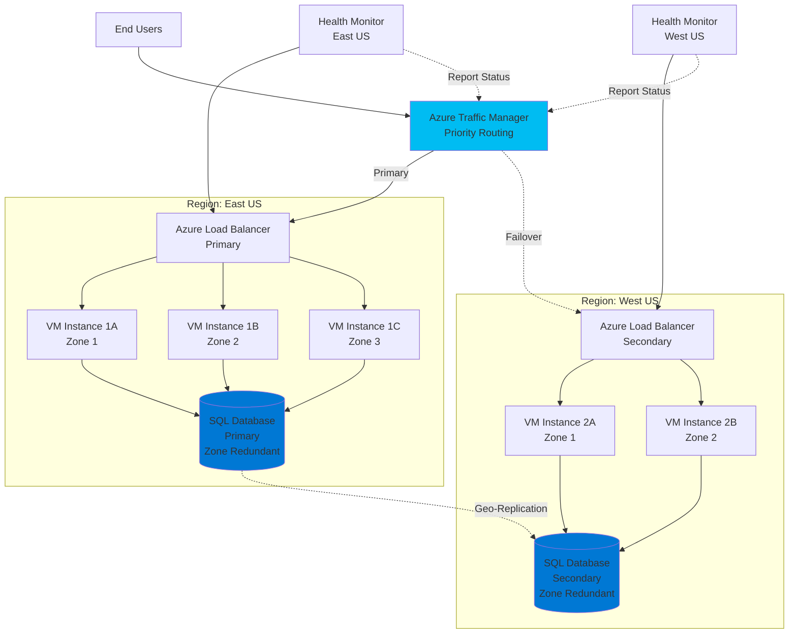
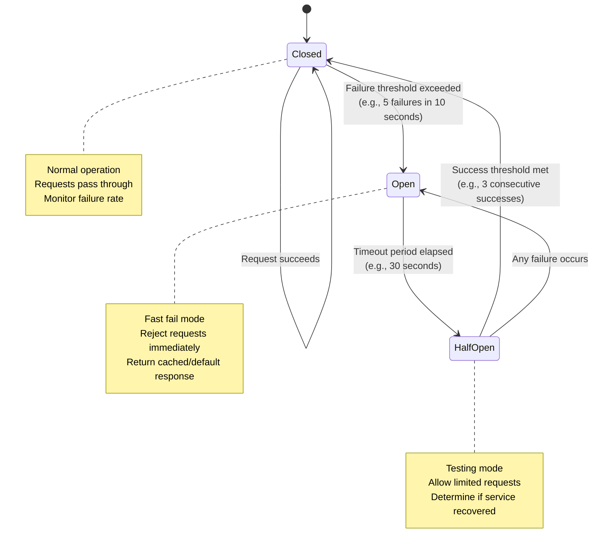
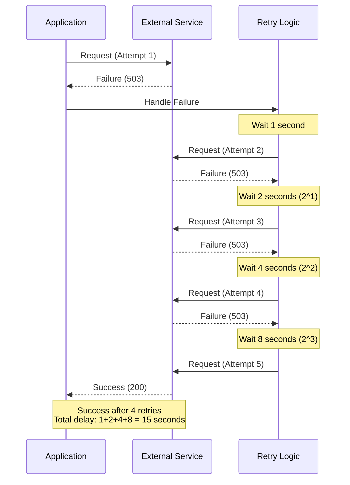

# Reliability - Azure Well-Architected Framework

## Definition

Reliability in the Azure Well-Architected Framework refers to the ability of a system to recover from failures and continue to function correctly. A reliable workload is resilient and available, capable of meeting commitments to customers despite temporary hardware failures, burst traffic patterns, or other disruptions. The reliability pillar encompasses designing systems that can handle failures gracefully, implement self-healing capabilities, and maintain clear service level agreements (SLAs).

Reliability is not just about preventing failures but designing systems that assume failure will occur and plan accordingly. This mindset shift from "if it fails" to "when it fails" is fundamental to building robust cloud architectures that can withstand various failure scenarios while maintaining business continuity.

## Design Principles

The Azure Well-Architected Framework defines the following core design principles for reliability:

1. **Design for Failure**: Assume that failures will occur at every level of the stack. Design your application to detect failures and automatically recover without requiring manual intervention.

2. **Self-Healing Systems**: Implement automated recovery mechanisms that can detect and remediate failures. Use health monitoring, automated failover, and circuit breakers to ensure the system can recover from transient and persistent failures.

3. **Clear Service Level Objectives (SLOs) and Agreements (SLAs)**: Define measurable reliability targets and communicate them clearly. Understand the SLAs of your dependencies and design your system to meet or exceed your commitments.

4. **Test for Resiliency**: Regularly test your failure recovery procedures through chaos engineering, disaster recovery drills, and failure injection testing. What isn't tested won't work when needed.

5. **Design for Scale and Performance**: Ensure your architecture can handle expected and unexpected load patterns without degradation. Build in capacity planning and auto-scaling capabilities.

6. **Implement Defense in Depth**: Use multiple layers of redundancy and failover mechanisms. Single points of failure should be eliminated wherever possible through redundancy at the application, data, and infrastructure layers.

## Assessment Questions

Use these questions to evaluate the reliability posture of your Azure solutions:

1. **Availability Requirements**: Have you defined clear availability requirements (e.g., 99.9%, 99.99%) for your application? Do you understand the cost and architectural implications of each additional nine?

2. **Failure Mode Analysis**: Have you identified all potential failure modes (network partitions, service outages, data corruption, regional disasters) and designed mitigations for each?

3. **Recovery Objectives**: Have you defined Recovery Time Objective (RTO) and Recovery Point Objective (RPO) for each critical component? Can your architecture meet these objectives?

4. **Health Monitoring**: Do you have comprehensive health monitoring in place that can detect failures before customers are impacted? Are you monitoring both application and infrastructure health?

5. **Automated Recovery**: Can your system automatically recover from common failure scenarios without manual intervention? Do you have runbooks for scenarios that require human intervention?

6. **Data Resiliency**: How is your data protected against loss, corruption, or regional disasters? Have you implemented appropriate backup, replication, and geo-redundancy strategies?

7. **Dependency Management**: Have you identified all external dependencies (Azure services, third-party APIs, databases)? Do you understand their SLAs and have you designed appropriate fallback mechanisms?

8. **Testing and Validation**: Do you regularly test your disaster recovery procedures? Have you conducted chaos engineering experiments to validate resilience claims?

9. **Capacity Planning**: Do you have mechanisms to handle traffic spikes and growth? Is auto-scaling configured and tested?

10. **Regional Resilience**: Is your application deployed across multiple regions or availability zones? Can it survive the loss of an entire Azure region?

11. **Update Management**: How do you deploy updates without causing downtime? Have you implemented blue-green deployments, canary releases, or rolling updates?

12. **Degraded State Operations**: Can your application operate in a degraded state if certain non-critical features fail? Have you implemented graceful degradation patterns?

## Key Patterns and Practices

### 1. Circuit Breaker Pattern

Prevent cascading failures by detecting repeated failures and temporarily blocking requests to failing services. Allows failing services time to recover while preventing resource exhaustion.

**Implementation**: Use Azure API Management policies, Polly library in .NET, or custom circuit breaker logic.

### 2. Retry Logic with Exponential Backoff

Handle transient failures by automatically retrying failed operations with increasing delays between attempts. Prevents overwhelming already-stressed services.

**Implementation**: Azure SDKs include built-in retry policies. Configure retry count, delay strategy, and which errors should trigger retries.

### 3. Queue-Based Load Leveling

Decouple components using message queues to handle load spikes without overwhelming downstream services. Provides natural buffering and enables asynchronous processing.

**Implementation**: Use Azure Service Bus, Azure Storage Queues, or Azure Event Grid for message buffering.

### 4. Health Endpoint Monitoring

Expose health endpoints that report the status of application components, dependencies, and infrastructure. Enable automated monitoring and recovery.

**Implementation**: Implement /health endpoints, integrate with Azure Application Insights, use Azure Load Balancer health probes.

### 5. Bulkhead Pattern

Isolate critical resources to prevent failures in one area from cascading to others. Similar to watertight compartments in ships.

**Implementation**: Use separate connection pools, thread pools, or compute resources for different features or tenants.

### 6. Throttling and Rate Limiting

Protect services from being overwhelmed by controlling the rate of requests. Maintains service availability during high-load scenarios.

**Implementation**: Azure API Management throttling policies, Azure Front Door rate limiting, application-level throttling.

### 7. Multi-Region Deployment

Deploy application instances across multiple Azure regions to survive regional outages. Enables active-active or active-passive configurations.

**Implementation**: Azure Traffic Manager for DNS-based routing, Azure Front Door for global load balancing, geo-replicated databases.

### 8. Compensating Transaction Pattern

Undo the work performed by a series of steps when one step fails. Essential for maintaining consistency in distributed systems.

**Implementation**: Event sourcing, saga pattern implementation, Azure Durable Functions for orchestration.

### 9. Automated Backup and Recovery

Regular automated backups with tested recovery procedures ensure data can be restored when needed.

**Implementation**: Azure Backup, Azure Site Recovery, database-native backup features, blob snapshots.

### 10. Availability Zones and Sets

Use Azure Availability Zones for datacenter-level fault tolerance and Availability Sets for rack-level isolation.

**Implementation**: Deploy VMs, managed disks, and zone-redundant services across availability zones.

## Mermaid Diagram Examples

### Multi-Region Failover Architecture

### Circuit Breaker Pattern Flow

### Retry with Exponential Backoff

## Implementation Checklist

Use this checklist when implementing reliability in your Azure solutions:

### Design Phase
- [ ] Define availability requirements and SLAs for all components
- [ ] Document RTO and RPO for each critical system
- [ ] Identify all single points of failure and plan elimination
- [ ] Map all external dependencies and their SLAs
- [ ] Design failure modes and recovery strategies
- [ ] Plan multi-region architecture if required for availability targets

### Infrastructure
- [ ] Deploy across Availability Zones where supported
- [ ] Configure Azure Load Balancer or Application Gateway with health probes
- [ ] Implement Azure Traffic Manager or Front Door for multi-region routing
- [ ] Enable zone-redundant storage for critical data
- [ ] Configure auto-scaling rules based on metrics and schedules
- [ ] Set up Azure Site Recovery for disaster recovery

### Application
- [ ] Implement health check endpoints for all services
- [ ] Add retry logic with exponential backoff for all external calls
- [ ] Implement circuit breaker pattern for critical dependencies
- [ ] Use queue-based load leveling for async processing
- [ ] Implement graceful degradation for non-critical features
- [ ] Add request timeout configurations

### Data
- [ ] Enable geo-replication for databases requiring cross-region resilience
- [ ] Configure automated backups with appropriate retention
- [ ] Implement point-in-time restore capability
- [ ] Test backup restoration regularly
- [ ] Use Azure Cosmos DB multi-region writes if eventual consistency is acceptable
- [ ] Implement data validation and corruption detection

### Monitoring
- [ ] Configure Azure Monitor and Application Insights
- [ ] Set up availability tests and synthetic monitoring
- [ ] Create alerts for availability metrics and anomalies
- [ ] Implement distributed tracing for end-to-end visibility
- [ ] Configure log aggregation and analysis
- [ ] Create dashboards for real-time health visibility

### Testing
- [ ] Conduct regular disaster recovery drills
- [ ] Perform chaos engineering experiments (Azure Chaos Studio)
- [ ] Load test to validate auto-scaling behavior
- [ ] Test failover and failback procedures
- [ ] Validate backup restoration procedures
- [ ] Test circuit breaker and retry behavior

## Common Anti-Patterns

### 1. Ignoring Transient Failures
**Problem**: Not implementing retry logic, causing failures from temporary network issues or service hiccups.

**Solution**: Implement automatic retry with exponential backoff for all external dependencies.

### 2. Synchronous Dependencies
**Problem**: Tightly coupling services with synchronous calls creates cascading failures when one service is slow or unavailable.

**Solution**: Use asynchronous messaging patterns and queue-based load leveling to decouple services.

### 3. Assuming Network Reliability
**Problem**: Designing as if network calls always succeed and have low latency.

**Solution**: Implement timeouts, circuit breakers, and fallback mechanisms for all network dependencies.

### 4. Single Region Deployment
**Problem**: Deploying only to a single Azure region makes the application vulnerable to regional outages.

**Solution**: Deploy across multiple regions with automated failover for critical applications requiring high availability.

### 5. Untested Disaster Recovery
**Problem**: Having disaster recovery plans that have never been tested or validated.

**Solution**: Regularly test and update disaster recovery procedures. Conduct game days and chaos experiments.

### 6. No Health Monitoring
**Problem**: Relying only on infrastructure metrics without application-level health checks.

**Solution**: Implement comprehensive health endpoints that verify application functionality and dependency health.

### 7. Infinite Retries
**Problem**: Retrying failed operations indefinitely, which can overwhelm failing services and prevent recovery.

**Solution**: Implement bounded retries with exponential backoff and circuit breaker patterns.

### 8. Shared Fate Architecture
**Problem**: All components share the same infrastructure or dependencies, creating correlated failures.

**Solution**: Implement bulkhead pattern to isolate critical components and prevent failure propagation.

## Tradeoffs

Reliability decisions involve balancing multiple concerns:

### Reliability vs. Cost
Higher availability requires redundant resources, multi-region deployment, and premium SKUs. A 99.9% SLA architecture costs significantly less than 99.99% or 99.999%.

**Balance**: Define appropriate availability targets based on business impact. Not all workloads need five-nines availability.

### Reliability vs. Performance
Adding retry logic, circuit breakers, and health checks introduces latency. Synchronous replication across regions impacts write performance.

**Balance**: Use asynchronous replication where eventual consistency is acceptable. Implement caching to offset retry overhead.

### Reliability vs. Consistency
Multi-region active-active deployments often require accepting eventual consistency. Strong consistency across regions impacts availability and performance.

**Balance**: Use appropriate consistency models (strong, bounded staleness, eventual) based on business requirements. Consider CQRS patterns.

### Reliability vs. Complexity
Implementing comprehensive resilience patterns increases system complexity, making it harder to develop, test, and operate.

**Balance**: Start with critical paths and gradually add resilience patterns. Use managed services that provide built-in resilience.

### Reliability vs. Time to Market
Building highly reliable systems requires additional development time for testing, automation, and redundancy.

**Balance**: Implement minimum viable reliability for launch, then iteratively improve based on customer impact and business growth.

## Microsoft Resources

### Official Documentation
- [Azure Well-Architected Framework - Reliability](https://learn.microsoft.com/azure/well-architected/reliability/)
- [Reliability patterns - Cloud Design Patterns](https://learn.microsoft.com/azure/architecture/patterns/category/resiliency)
- [Azure reliability documentation](https://learn.microsoft.com/azure/reliability/)
- [Failure mode analysis for Azure applications](https://learn.microsoft.com/azure/architecture/resiliency/failure-mode-analysis)

### Service-Specific Guidance
- [Azure Site Recovery documentation](https://learn.microsoft.com/azure/site-recovery/)
- [Azure Traffic Manager documentation](https://learn.microsoft.com/azure/traffic-manager/)
- [Azure Availability Zones](https://learn.microsoft.com/azure/availability-zones/az-overview)
- [Azure Backup documentation](https://learn.microsoft.com/azure/backup/)

### Tools and Testing
- [Azure Chaos Studio](https://learn.microsoft.com/azure/chaos-studio/)
- [Azure Monitor](https://learn.microsoft.com/azure/azure-monitor/)
- [Azure Advisor reliability recommendations](https://learn.microsoft.com/azure/advisor/)

### Architecture Examples
- [Mission-critical baseline architecture](https://learn.microsoft.com/azure/architecture/reference-architectures/containers/aks-mission-critical/mission-critical-intro)
- [Multi-region web application](https://learn.microsoft.com/azure/architecture/reference-architectures/app-service-web-app/multi-region)
- [Highly available multi-tier application](https://learn.microsoft.com/azure/architecture/reference-architectures/n-tier/n-tier-sql-server)

## When to Load This Reference

This reliability pillar reference should be loaded when the conversation includes:

- **Keywords**: "reliability", "availability", "uptime", "SLA", "disaster recovery", "failover", "high availability", "resilience", "fault tolerance"
- **Scenarios**: Designing mission-critical systems, defining availability requirements, recovering from outages, multi-region architectures
- **Architecture Reviews**: Evaluating existing solutions for reliability gaps, conducting failure mode analysis
- **Incident Response**: Analyzing outages and designing prevention measures
- **Compliance**: Meeting regulatory requirements for availability and data protection

Load this reference in combination with:
- **Security pillar**: When designing resilient security controls and identity failover
- **Operational Excellence pillar**: For implementing automated recovery and monitoring
- **Performance pillar**: When balancing reliability patterns with performance requirements
- **Emergency Response**: For incident management and recovery procedures
