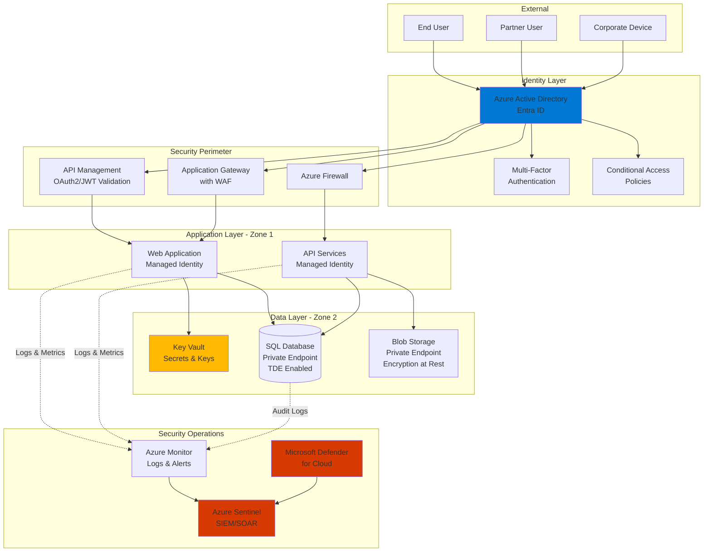
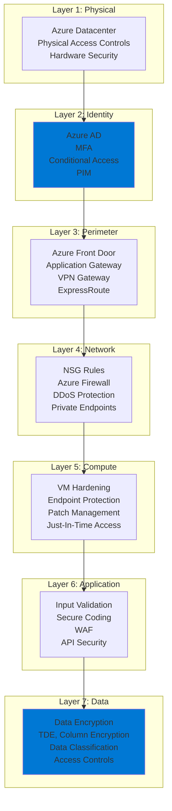
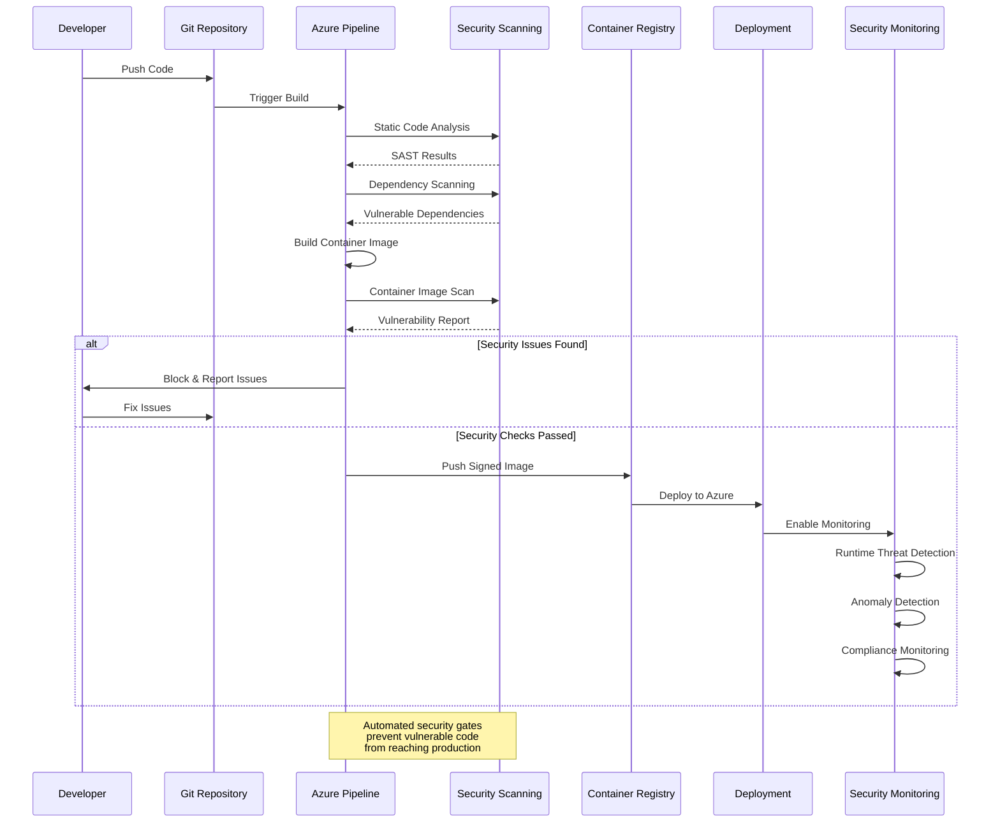

# Security - Azure Well-Architected Framework

## Definition

Security in the Azure Well-Architected Framework focuses on protecting applications and data from threats and vulnerabilities. It encompasses the practices and technologies that safeguard systems against unauthorized access, data breaches, and malicious attacks while maintaining confidentiality, integrity, and availability of information assets.

Security is a foundational pillar that must be integrated into every layer of your architecture, from the physical infrastructure to the application code and user interactions. Modern cloud security follows a Zero Trust approach, assuming breach and verifying explicitly rather than trusting implicitly based on network location.

The security pillar covers identity and access management, data protection, network security, application security, security operations, and governance - all working together to create defense in depth.

## Design Principles

The Azure Well-Architected Framework defines the following core design principles for security:

1. **Zero Trust Architecture**: Never trust, always verify. Assume breach and verify each request as though it originates from an uncontrolled network. Use identity as the primary security perimeter rather than network location.

2. **Defense in Depth**: Implement multiple layers of security controls across your architecture. If one layer is compromised, additional layers provide continued protection. Apply security at network, host, application, and data levels.

3. **Principle of Least Privilege**: Grant the minimum permissions necessary for users, applications, and services to perform their functions. Use just-in-time access and regularly review and revoke unnecessary permissions.

4. **Security by Design**: Integrate security considerations from the beginning of the design process rather than adding them later. Make security a requirement, not an afterthought.

5. **Assume Breach Mentality**: Design systems assuming attackers will gain access. Implement comprehensive monitoring, detection, and response capabilities. Minimize blast radius through segmentation and isolation.

6. **End-to-End Encryption**: Protect data at rest, in transit, and in use. Use encryption for all sensitive data and implement proper key management practices.

7. **Continuous Security Validation**: Regularly test security controls through vulnerability scanning, penetration testing, and red team exercises. Security is not a one-time activity but a continuous process.

## Assessment Questions

Use these questions to evaluate the security posture of your Azure solutions:

1. **Identity and Access Management**: Have you implemented Azure Active Directory (Entra ID) for all authentication? Is multi-factor authentication (MFA) enforced for all users, especially administrators?

2. **Privileged Access**: Are you using Azure AD Privileged Identity Management (PIM) for just-in-time access to sensitive resources? Have you eliminated standing administrative privileges?

3. **Service Identity**: Are you using managed identities for Azure resources instead of storing credentials in code or configuration? Have you eliminated all hard-coded secrets?

4. **Network Security**: Have you implemented network segmentation using Virtual Networks, Network Security Groups, and Azure Firewall? Is there a clear network security architecture with defined security zones?

5. **Data Protection**: Is data encrypted at rest and in transit? Are you using Azure Key Vault for key management? Have you classified data and applied appropriate protection mechanisms?

6. **Application Security**: Have you implemented Web Application Firewall (WAF) for internet-facing applications? Are you following secure coding practices and conducting regular security testing?

7. **Threat Detection**: Have you enabled Azure Defender (Microsoft Defender for Cloud) across all workloads? Are security alerts routed to a SIEM solution for analysis?

8. **Security Monitoring**: Do you have comprehensive logging enabled for all Azure resources? Are logs centralized in Azure Monitor or Azure Sentinel for correlation and analysis?

9. **Vulnerability Management**: Do you have automated vulnerability scanning in place? Is there a process for rapid patching and remediation of identified vulnerabilities?

10. **Incident Response**: Do you have a documented incident response plan? Is there a security operations center (SOC) or equivalent capability to respond to security incidents?

11. **Compliance and Governance**: Have you implemented Azure Policy to enforce security baselines? Are you meeting regulatory compliance requirements (GDPR, HIPAA, PCI-DSS, etc.)?

12. **Supply Chain Security**: Have you validated the security of third-party components and dependencies? Are container images scanned for vulnerabilities before deployment?

## Key Patterns and Practices

### 1. Zero Trust Network Access

Move from network-centric security to identity-centric security. Verify every access request regardless of origin location.

**Implementation**: Azure AD Conditional Access policies, Azure AD Application Proxy, Azure Private Link, Azure Bastion for secure VM access.

### 2. Identity Federation and Single Sign-On

Centralize authentication through Azure Active Directory and eliminate password sprawl.

**Implementation**: Azure AD SSO integration, SAML/OAuth/OpenID Connect protocols, Azure AD B2B for partner access, Azure AD B2C for customer identity.

### 3. Secrets Management

Never store secrets in code or configuration files. Use centralized secret management with access controls and auditing.

**Implementation**: Azure Key Vault for secrets, keys, and certificates. Managed identities for service-to-service authentication. Key rotation policies.

### 4. Network Segmentation

Divide networks into security zones with controlled communication paths between zones.

**Implementation**: Virtual Networks with subnets, Network Security Groups (NSGs), Azure Firewall, Application Security Groups (ASGs), Private Endpoints.

### 5. Encryption at All Layers

Encrypt data in transit, at rest, and during processing to protect confidentiality.

**Implementation**: TLS 1.2+ for transit, Azure Storage Service Encryption, Azure Disk Encryption, Transparent Data Encryption (TDE) for databases, Always Encrypted for column-level encryption.

### 6. Threat Detection and Response

Continuously monitor for suspicious activity and respond rapidly to security incidents.

**Implementation**: Microsoft Defender for Cloud, Azure Sentinel (SIEM/SOAR), Azure Monitor, Azure Policy compliance monitoring.

### 7. Just-In-Time Access

Provide time-limited elevated access only when needed, reducing the attack surface.

**Implementation**: Azure AD Privileged Identity Management (PIM), Just-In-Time VM access in Defender for Cloud, Azure Bastion.

### 8. Web Application Firewall (WAF)

Protect web applications from common attacks and vulnerabilities.

**Implementation**: Azure Application Gateway WAF, Azure Front Door WAF, OWASP Top 10 protection, custom WAF rules.

### 9. DDoS Protection

Defend against distributed denial-of-service attacks that could impact availability.

**Implementation**: Azure DDoS Protection Standard, traffic analysis and mitigation, automatic protection for PaaS services.

### 10. Security DevOps (DevSecOps)

Integrate security testing and validation into CI/CD pipelines.

**Implementation**: Azure DevOps security scanning, GitHub Advanced Security, Microsoft Security Code Analysis, container image scanning.

## Mermaid Diagram Examples

### Zero Trust Architecture Pattern

### Defense in Depth Layers

### Secure DevOps Pipeline

## Implementation Checklist

Use this checklist when implementing security in your Azure solutions:

### Identity and Access Management
- [ ] Implement Azure AD (Entra ID) as the central identity provider
- [ ] Enable and enforce MFA for all users, especially administrators
- [ ] Configure Azure AD Conditional Access policies based on risk signals
- [ ] Implement Azure AD Privileged Identity Management for just-in-time admin access
- [ ] Use managed identities for all Azure service-to-service authentication
- [ ] Remove all hard-coded credentials from code and configuration
- [ ] Implement role-based access control (RBAC) with least privilege
- [ ] Enable Azure AD Identity Protection for risk-based policies

### Network Security
- [ ] Design network architecture with clear security zones
- [ ] Implement Network Security Groups (NSGs) on all subnets
- [ ] Deploy Azure Firewall for centralized network security
- [ ] Use Private Endpoints for Azure PaaS services to avoid public exposure
- [ ] Enable DDoS Protection Standard for production workloads
- [ ] Implement hub-and-spoke network topology with controlled routing
- [ ] Use Azure Bastion for secure RDP/SSH access to VMs
- [ ] Enable network flow logs for traffic analysis

### Data Protection
- [ ] Enable encryption at rest for all storage resources
- [ ] Enforce TLS 1.2+ for all data in transit
- [ ] Implement Azure Key Vault for secrets, keys, and certificates
- [ ] Enable Transparent Data Encryption (TDE) for databases
- [ ] Classify data and apply appropriate protection (Azure Information Protection)
- [ ] Implement key rotation policies
- [ ] Enable soft delete and purge protection for Key Vault
- [ ] Use customer-managed keys for sensitive workloads

### Application Security
- [ ] Deploy Web Application Firewall (WAF) for all internet-facing apps
- [ ] Implement OWASP Top 10 protections
- [ ] Conduct regular application security testing (SAST/DAST)
- [ ] Validate and sanitize all user inputs
- [ ] Implement proper error handling without leaking sensitive information
- [ ] Use secure coding practices and security linters
- [ ] Enable CORS policies appropriately
- [ ] Implement API throttling and rate limiting

### Threat Detection and Response
- [ ] Enable Microsoft Defender for Cloud on all subscriptions
- [ ] Configure Azure Sentinel or integrate with existing SIEM
- [ ] Enable diagnostic logging for all Azure resources
- [ ] Configure security alerts and automated responses
- [ ] Implement security incident response procedures
- [ ] Conduct regular security drills and tabletop exercises
- [ ] Enable Microsoft Defender for specific workload types (App Service, SQL, Storage, etc.)
- [ ] Configure automated remediation for common security issues

### Governance and Compliance
- [ ] Implement Azure Policy to enforce security baselines
- [ ] Enable Azure Blueprints for repeatable, compliant deployments
- [ ] Configure regulatory compliance assessments (PCI-DSS, HIPAA, etc.)
- [ ] Implement resource tagging for classification and governance
- [ ] Enable Azure Cost Management alerts for anomalous spending (security indicator)
- [ ] Conduct regular access reviews and privilege cleanup
- [ ] Document security architecture and maintain security documentation
- [ ] Implement change management processes with security review gates

### DevSecOps
- [ ] Integrate security scanning in CI/CD pipelines
- [ ] Scan container images for vulnerabilities before deployment
- [ ] Implement code signing and image signing
- [ ] Use Azure DevOps security features or GitHub Advanced Security
- [ ] Conduct pre-deployment security validation
- [ ] Implement infrastructure as code with security policies
- [ ] Enable branch protection and require security reviews
- [ ] Maintain software bill of materials (SBOM) for dependencies

## Common Anti-Patterns

### 1. Shared Administrator Accounts
**Problem**: Using shared administrative credentials or generic "admin" accounts makes accountability impossible and increases breach risk.

**Solution**: Implement individual Azure AD accounts for all users, enforce MFA, and use Azure AD PIM for just-in-time administrative access.

### 2. Overly Permissive Network Rules
**Problem**: Allowing 0.0.0.0/0 (any source) in Network Security Groups or firewall rules creates unnecessary exposure.

**Solution**: Implement principle of least privilege for network access. Use specific IP ranges, service tags, and application security groups.

### 3. Secrets in Source Code
**Problem**: Hard-coding passwords, connection strings, or API keys in application code or configuration files.

**Solution**: Use Azure Key Vault for all secrets. Leverage managed identities. Scan repositories for accidentally committed secrets.

### 4. Public Storage Endpoints
**Problem**: Exposing Azure Storage accounts, databases, or other PaaS services directly to the internet.

**Solution**: Use Private Endpoints to access PaaS services over private IP addresses. Disable public network access where possible.

### 5. Ignoring Security Updates
**Problem**: Running outdated operating systems, applications, or dependencies with known vulnerabilities.

**Solution**: Implement automated patch management, vulnerability scanning, and dependency updates. Use Azure Update Management.

### 6. No Logging or Monitoring
**Problem**: Lack of audit logging makes it impossible to detect breaches or conduct forensic analysis.

**Solution**: Enable diagnostic logging for all resources. Centralize logs in Azure Monitor. Implement Azure Sentinel for SIEM capabilities.

### 7. Trusting Internal Networks
**Problem**: Assuming anything inside the corporate network is trustworthy (the old "castle and moat" model).

**Solution**: Implement Zero Trust architecture. Verify every access request. Use micro-segmentation and network isolation.

### 8. Insufficient Identity Verification
**Problem**: Relying solely on passwords for authentication without MFA or risk-based policies.

**Solution**: Enforce MFA for all users. Implement Azure AD Conditional Access with risk-based policies. Use passwordless authentication where possible.

## Tradeoffs

Security decisions involve balancing multiple concerns:

### Security vs. Usability
Strong security controls like MFA, approval workflows, and restricted access can impact user productivity and experience.

**Balance**: Implement risk-based conditional access that applies stronger controls only when needed. Use passwordless authentication (Windows Hello, FIDO2) for better UX.

### Security vs. Performance
Encryption, deep packet inspection, and security scanning add processing overhead and latency.

**Balance**: Use hardware-accelerated encryption. Implement security scanning in parallel rather than sequential gates. Cache security decisions where appropriate.

### Security vs. Cost
Comprehensive security requires investment in tools, services, and operational capabilities (SIEM, WAF, DDoS protection, security staff).

**Balance**: Prioritize security investments based on risk assessment. Start with high-impact, low-cost controls (MFA, basic monitoring). Scale security budget with business criticality.

### Security vs. Innovation Speed
Security reviews, approval gates, and compliance checks can slow down development and deployment velocity.

**Balance**: Shift security left with DevSecOps practices. Automate security testing and compliance validation. Implement security-as-code for rapid, safe deployments.

### Security vs. Openness
Strict security controls can limit collaboration with partners, external developers, or open-source communities.

**Balance**: Use Azure AD B2B for secure partner collaboration. Implement clear security boundaries and graduated trust levels. Use managed identities and service principals for automation.

## Microsoft Resources

### Official Documentation
- [Azure Well-Architected Framework - Security](https://learn.microsoft.com/azure/well-architected/security/)
- [Azure Security Best Practices](https://learn.microsoft.com/azure/security/fundamentals/best-practices-and-patterns)
- [Azure Security Baseline](https://learn.microsoft.com/security/benchmark/azure/)
- [Zero Trust security model](https://learn.microsoft.com/security/zero-trust/)

### Azure Security Services
- [Microsoft Defender for Cloud](https://learn.microsoft.com/azure/defender-for-cloud/)
- [Azure Sentinel (Microsoft Sentinel)](https://learn.microsoft.com/azure/sentinel/)
- [Azure Active Directory](https://learn.microsoft.com/azure/active-directory/)
- [Azure Key Vault](https://learn.microsoft.com/azure/key-vault/)
- [Azure Firewall](https://learn.microsoft.com/azure/firewall/)
- [Azure DDoS Protection](https://learn.microsoft.com/azure/ddos-protection/)

### Security Patterns
- [Security patterns - Cloud Design Patterns](https://learn.microsoft.com/azure/architecture/patterns/category/security)
- [Federated Identity pattern](https://learn.microsoft.com/azure/architecture/patterns/federated-identity)
- [Valet Key pattern](https://learn.microsoft.com/azure/architecture/patterns/valet-key)
- [Gatekeeper pattern](https://learn.microsoft.com/azure/architecture/patterns/gatekeeper)

### Compliance and Governance
- [Azure Compliance documentation](https://learn.microsoft.com/azure/compliance/)
- [Azure Policy](https://learn.microsoft.com/azure/governance/policy/)
- [Azure Blueprints](https://learn.microsoft.com/azure/governance/blueprints/)
- [Microsoft Trust Center](https://www.microsoft.com/trust-center)

### Security Operations
- [Azure Security Center and Azure Defender](https://learn.microsoft.com/azure/security-center/)
- [Security Operations Center (SOC) guidance](https://learn.microsoft.com/security/operations/)
- [Incident response planning](https://learn.microsoft.com/security/operations/incident-response-planning)

### Training and Certification
- [Microsoft Security, Compliance, and Identity Fundamentals (SC-900)](https://learn.microsoft.com/certifications/security-compliance-and-identity-fundamentals/)
- [Azure Security Engineer Associate (AZ-500)](https://learn.microsoft.com/certifications/azure-security-engineer/)

## When to Load This Reference

This security pillar reference should be loaded when the conversation includes:

- **Keywords**: "security", "Zero Trust", "authentication", "authorization", "encryption", "compliance", "identity", "access control", "threat", "vulnerability", "breach"
- **Scenarios**: Designing secure architectures, implementing identity management, responding to security incidents, meeting compliance requirements
- **Architecture Reviews**: Evaluating security posture, conducting threat modeling, security assessments
- **Compliance Projects**: Implementing GDPR, HIPAA, PCI-DSS, ISO 27001, or other regulatory requirements
- **Incident Response**: Analyzing security breaches, implementing prevention measures, forensic analysis

Load this reference in combination with:
- **Reliability pillar**: When implementing secure backup and disaster recovery
- **Operational Excellence pillar**: For security operations, monitoring, and automated response
- **Governance documentation**: When enforcing security policies and standards
- **Compliance requirements**: For industry-specific security controls
