# Azure - Enterprise Cloud Platform Architecture

## Overview

Microsoft Azure is the comprehensive cloud computing platform for building, deploying, and managing enterprise applications and infrastructure. For enterprise architects, Azure provides the foundational infrastructure (IaaS), platform services (PaaS), and managed services required for modern, cloud-native, and hybrid solutions.

## Platform Positioning

**Strategic Role**: Azure is Microsoft's enterprise-grade cloud platform for:
- **Custom application development**: Code-first, full-stack development
- **Infrastructure modernization**: Lift-and-shift and cloud-native transformation
- **Hybrid and multi-cloud**: Seamless on-premises and cloud integration
- **Mission-critical workloads**: Enterprise SLAs and global scale
- **Innovation platform**: AI, IoT, blockchain, quantum computing

**Architectural Philosophy**: "Build intelligently, scale efficiently, run securely." Leverage managed services where possible; use IaaS only when necessary.

## Core Service Categories

### Compute Services

Azure offers multiple compute options, each suited for different scenarios:

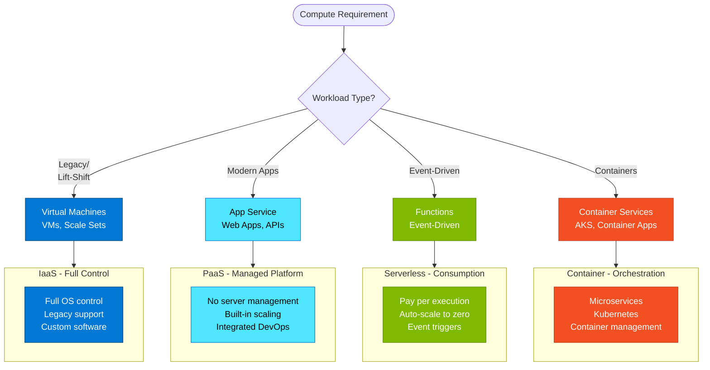

#### 1. Virtual Machines (IaaS)

**When to Use**:
- Legacy applications requiring specific OS configurations
- Applications not easily containerized
- Lift-and-shift migrations
- Full control over software stack required

**Architecture Patterns**:
- **Availability Sets**: Protection against hardware failures within datacenter
- **Availability Zones**: Protection against datacenter failures
- **Virtual Machine Scale Sets**: Auto-scaling groups of VMs

**Best Practices**:
- Use managed disks for reliability
- Implement Azure Backup for disaster recovery
- Use Azure Monitor for observability
- Right-size VMs (don't over-provision)
- Consider Reserved Instances for cost savings (1-3 year commitment)

---

#### 2. App Service (PaaS)

**When to Use**:
- Web applications and APIs
- Focus on code, not infrastructure
- Need built-in CI/CD integration
- Require auto-scaling without managing VMs

**Capabilities**:
- **Multiple runtimes**: .NET, Java, Node.js, Python, PHP, Ruby
- **Deployment slots**: Blue-green deployments, staging
- **Auto-scaling**: Based on metrics or schedule
- **Built-in authentication**: Azure AD, social providers
- **Hybrid connections**: Connect to on-premises resources

**Architecture Pattern**:
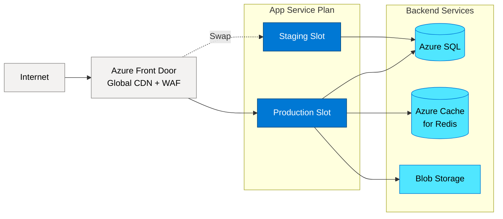

**Best Practices**:
- Use deployment slots for zero-downtime deployments
- Implement Application Insights for monitoring
- Use managed identities for Azure service authentication
- Separate App Service Plans for production and non-production
- Configure auto-scaling rules based on actual usage patterns

---

#### 3. Azure Functions (Serverless)

**When to Use**:
- Event-driven processing
- Scheduled tasks (cron jobs)
- Lightweight APIs
- Processing queues and messages
- Respond to Azure service events

**Trigger Types**:
- HTTP triggers (RESTful APIs)
- Timer triggers (scheduled)
- Queue triggers (Azure Queue/Service Bus)
- Blob triggers (file uploads)
- Event Grid triggers (event-driven architecture)
- Cosmos DB triggers (change feed)

**Hosting Plans**:
- **Consumption**: Pay per execution, auto-scale (cold start possible)
- **Premium**: Pre-warmed instances, VNet integration, unlimited duration
- **Dedicated**: Run on App Service Plan (for existing capacity)

**Architecture Pattern**:
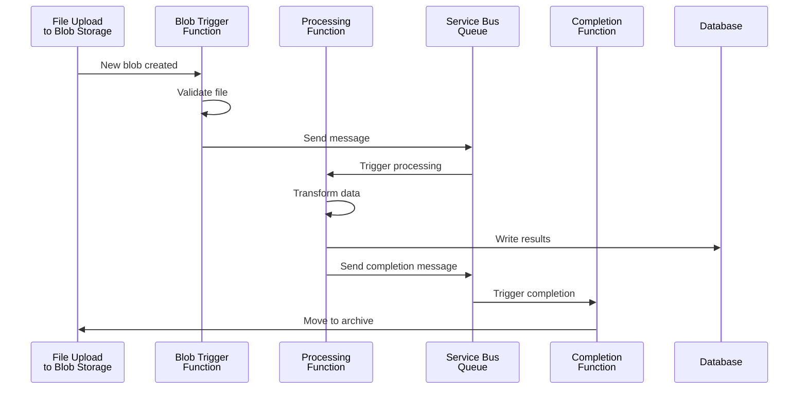

**Best Practices**:
- Keep functions small and focused (single responsibility)
- Use durable functions for complex orchestrations
- Implement idempotency for retry scenarios
- Use managed identities for authentication
- Monitor with Application Insights
- Consider Premium plan for production workloads (avoid cold start)

---

#### 4. Azure Kubernetes Service (AKS)

**When to Use**:
- Microservices architectures
- Container orchestration at scale
- Multi-tenancy requirements
- Advanced deployment strategies (canary, blue-green)
- Portable across clouds (Kubernetes standard)

**Architecture Pattern**:
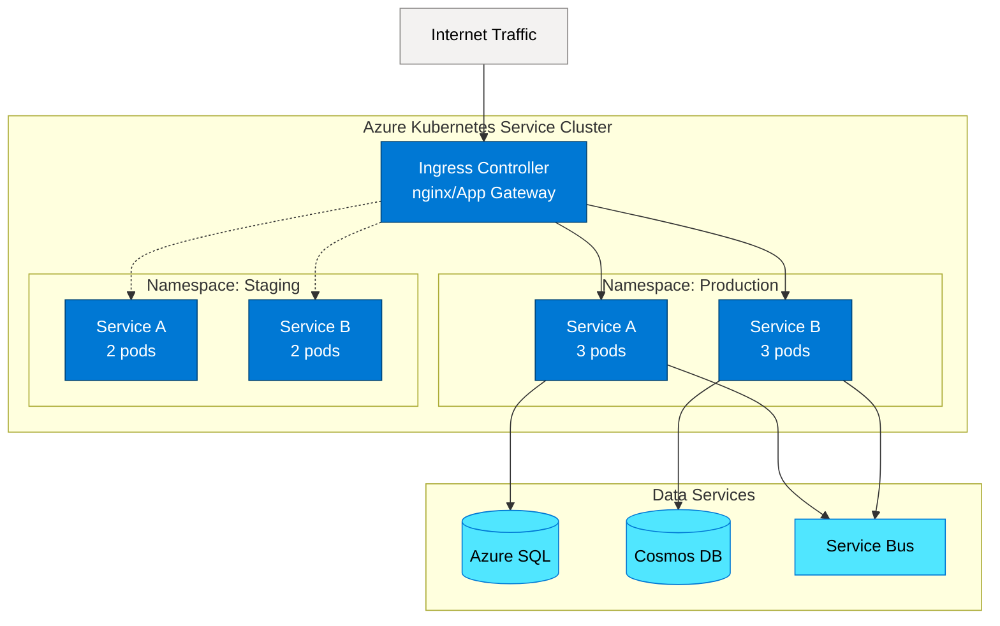

**Best Practices**:
- Use Azure CNI networking for VNet integration
- Implement pod identity for Azure service authentication
- Use Horizontal Pod Autoscaler (HPA) for scaling
- Implement network policies for security
- Use Azure Container Registry (ACR) for image storage
- Enable cluster autoscaling
- Implement GitOps for deployment (Flux/Argo CD)
- Use Azure Monitor for containers

---

### Data Services

Azure provides comprehensive data services for various scenarios:

#### 1. Azure SQL Database

**When to Use**:
- Relational database needs
- Mission-critical OLTP workloads
- Existing SQL Server workloads moving to cloud
- Need for automatic tuning and backups

**Service Tiers**:
- **DTU-based**: Basic, Standard, Premium (predictable performance)
- **vCore-based**: General Purpose, Business Critical, Hyperscale (configurable)

**High Availability Options**:
- **Zone-redundant**: Protection within region
- **Geo-replication**: Active readable secondaries in other regions
- **Auto-failover groups**: Automatic failover to secondary region

**Architecture Pattern**:
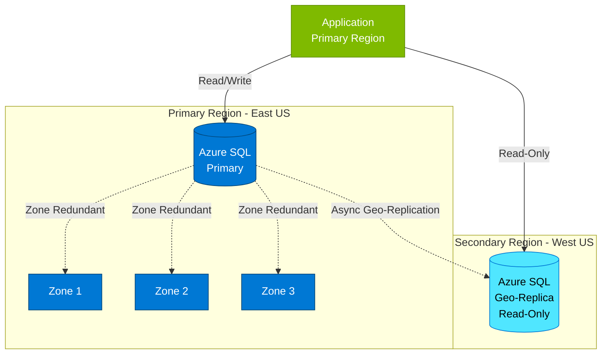

**Best Practices**:
- Use Elastic Pools for multiple databases with variable usage
- Implement temporal tables for audit and history
- Use Query Performance Insight for optimization
- Enable Transparent Data Encryption (TDE)
- Implement row-level security for multi-tenancy
- Use managed identities for application authentication

---

#### 2. Cosmos DB

**When to Use**:
- Global distribution requirements
- Low-latency reads and writes worldwide
- NoSQL data models (document, key-value, graph, column-family)
- Massive scale (petabytes)
- Variable schema requirements

**APIs Supported**:
- Core (SQL) - Document database
- MongoDB - Document database (MongoDB compatible)
- Cassandra - Wide-column store
- Gremlin - Graph database
- Table - Key-value store (Azure Table Storage compatible)

**Distribution Pattern**:
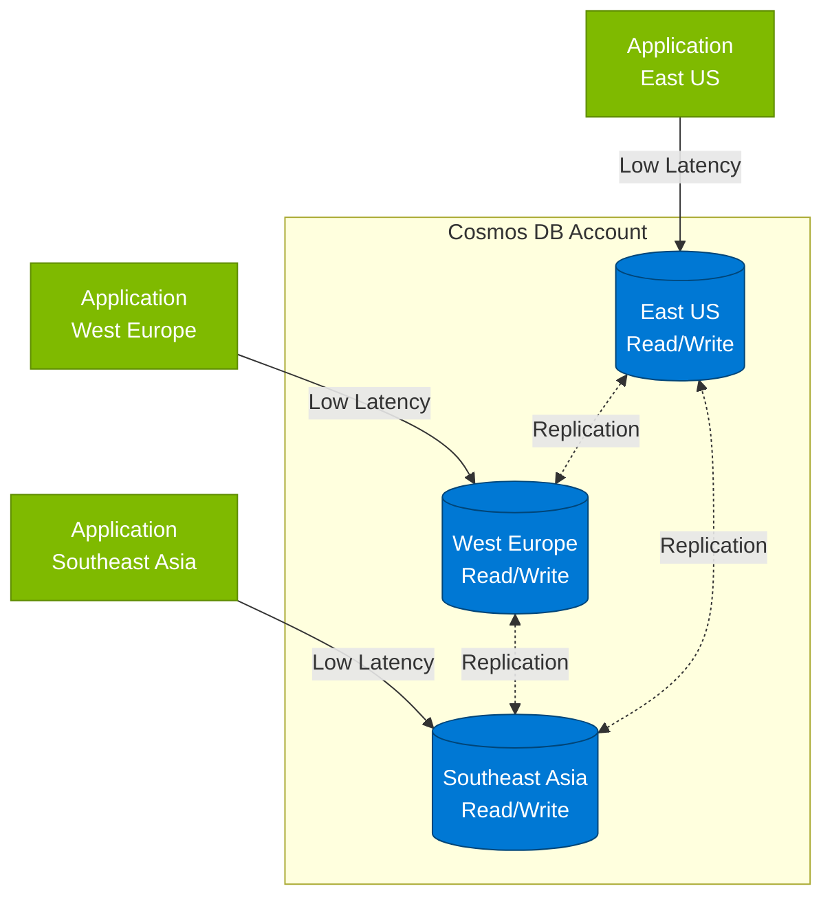

**Consistency Levels**:
- **Strong**: Linearizability guarantee (highest latency)
- **Bounded Staleness**: Consistent prefix with bounded lag
- **Session**: Consistent within client session (most common)
- **Consistent Prefix**: Reads never see out-of-order writes
- **Eventual**: Lowest latency, eventual consistency

**Best Practices**:
- Choose appropriate partition key (even distribution, avoid hot partitions)
- Use session consistency for most scenarios
- Implement change feed for event-driven architectures
- Use TTL for automatic data expiration
- Monitor RU consumption and optimize queries
- Use bulk executor for large data loads

---

#### 3. Azure Storage

**Storage Types**:
- **Blob Storage**: Object storage (files, images, videos, backups)
- **File Storage**: SMB file shares for cloud or hybrid
- **Queue Storage**: Message queuing for decoupling
- **Table Storage**: NoSQL key-value store (simple, cheap)

**Blob Storage Tiers**:
- **Hot**: Frequently accessed data
- **Cool**: Infrequently accessed (30+ days)
- **Archive**: Rarely accessed (180+ days, offline)

**Best Practices**:
- Use lifecycle management policies for tier transitions
- Implement soft delete for protection against accidental deletion
- Use Azure CDN for global content delivery
- Enable versioning for critical data
- Use shared access signatures (SAS) for temporary access
- Implement redundancy (LRS, ZRS, GRS, GZRS)

---

### Integration Services

#### 1. Azure Service Bus

**When to Use**:
- Reliable message queuing
- Publish-subscribe patterns
- Transaction support
- Duplicate detection
- Message ordering (FIFO)

**Components**:
- **Queues**: Point-to-point communication
- **Topics and Subscriptions**: Publish-subscribe pattern

**Pattern: Event-Driven Microservices**:
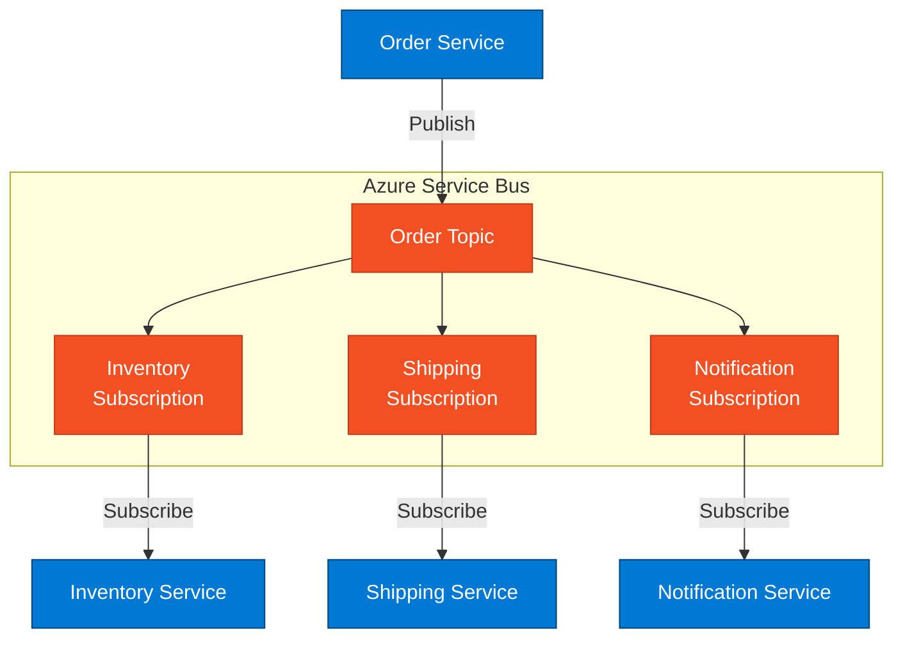

**Best Practices**:
- Use topics for pub-sub scenarios, queues for load leveling
- Implement dead-letter queue handling
- Use sessions for message ordering
- Configure duplicate detection
- Implement circuit breaker for failed message processing
- Monitor with Azure Monitor

---

#### 2. Azure API Management

**When to Use**:
- API gateway and management
- API versioning and lifecycle
- Rate limiting and throttling
- API monetization
- Developer portal for API consumers

**Key Capabilities**:
- **Gateway**: Route requests to backend services
- **Policies**: Transform requests/responses, implement security
- **Developer Portal**: Self-service API discovery and onboarding
- **Analytics**: Monitor API usage and performance

**Architecture Pattern**:
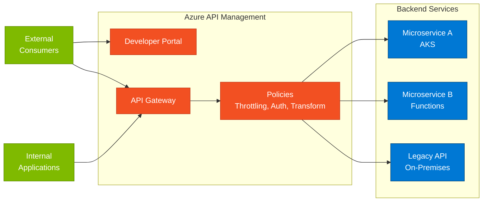

**Best Practices**:
- Use products for grouping and access control
- Implement caching for frequently accessed data
- Use managed identities for backend authentication
- Implement versioning strategy from the start
- Use named values for configuration
- Monitor with Application Insights integration

---

### Security and Identity

#### Microsoft Entra ID (Azure Active Directory)

**Role**: Identity and access management foundation for all Azure services

**Key Capabilities**:
- **Authentication**: Single sign-on for Azure and custom apps
- **Conditional Access**: Risk-based access policies
- **MFA**: Multi-factor authentication
- **Privileged Identity Management**: Just-in-time admin access
- **B2B/B2C**: External identity scenarios

**Integration Pattern**:
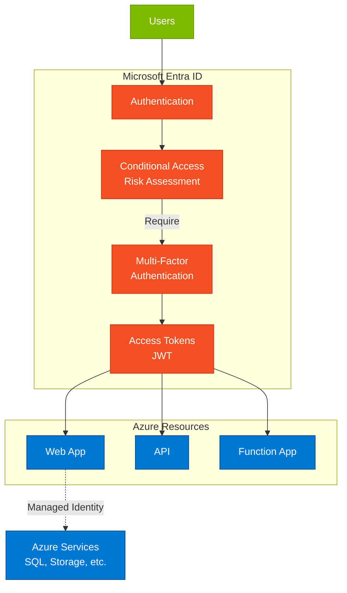

**Best Practices**:
- Use managed identities for Azure service-to-service authentication
- Implement Conditional Access for all production resources
- Enable MFA for all users
- Use PIM for administrative roles
- Implement least privilege access
- Monitor with Identity Protection

---

#### Azure Key Vault

**When to Use**:
- Secure storage for secrets, keys, certificates
- Centralized secret management
- Encryption key management (Customer-Managed Keys)
- Certificate lifecycle management

**Best Practices**:
- Use separate Key Vaults for different environments (dev, test, prod)
- Implement soft delete and purge protection
- Use RBAC for access control (not legacy access policies)
- Enable logging and monitoring
- Use managed identities for application access
- Rotate secrets regularly (automate with Key Vault Events)

---

## Common Architecture Patterns

### Pattern 1: N-Tier Web Application

**Scenario**: Traditional web application with presentation, business logic, and data tiers

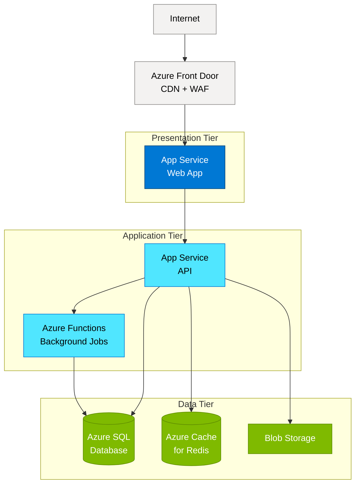

**Benefits**:
- Clear separation of concerns
- Independent scaling of tiers
- Technology choice flexibility
- Security through network isolation

---

### Pattern 2: Microservices on AKS

**Scenario**: Cloud-native microservices with container orchestration

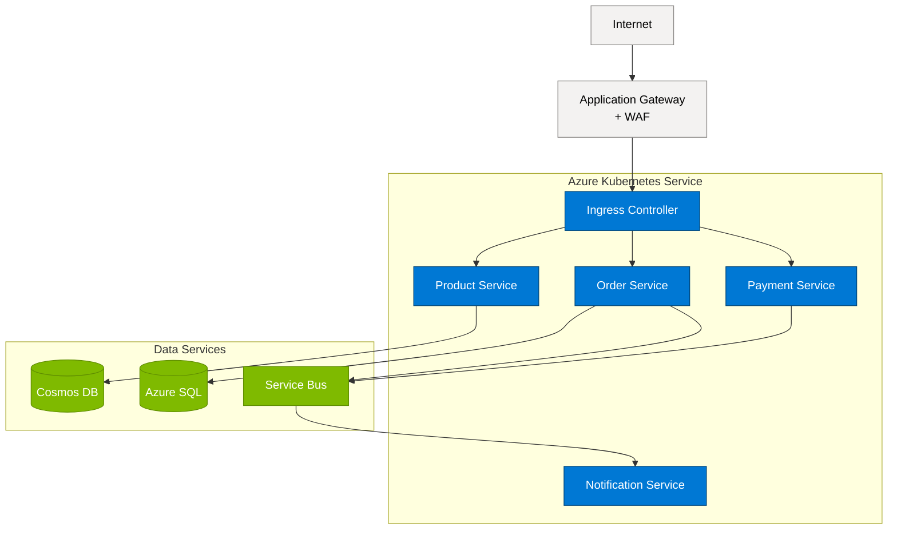

**Benefits**:
- Independent deployment and scaling
- Technology diversity
- Resilience through isolation
- Optimized for DevOps

---

### Pattern 3: Event-Driven Serverless

**Scenario**: Event-driven processing with serverless functions

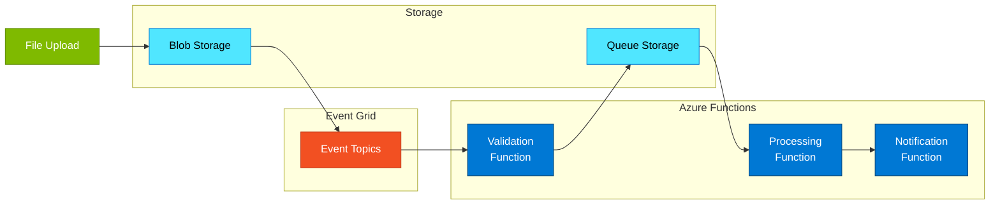

**Benefits**:
- Pay per execution
- Auto-scaling
- Event-driven architecture
- Loose coupling

---

## Integration with Other Microsoft Platforms

### Azure + Power Platform

**Common Scenarios**:
- Custom connectors to Azure Functions/API Management
- Power BI DirectQuery to Azure SQL
- Power Automate calling Azure Logic Apps
- Power Apps using Azure SQL (premium connector)

**Best Practices**:
- Use API Management for Power Platform custom connectors
- Implement OAuth 2.0 for authentication
- Use managed identities where possible
- Implement throttling to protect Azure resources

---

### Azure + Microsoft 365

**Common Scenarios**:
- Azure Functions processing SharePoint events
- Azure Logic Apps for M365 integration workflows
- Azure AI services processing M365 content
- Azure SQL storing M365 data for analytics

**Best Practices**:
- Use Microsoft Graph SDK in Azure Functions
- Implement Microsoft Graph webhooks for events
- Use managed identities with Graph API
- Handle Microsoft Graph throttling appropriately

---

### Azure + Dynamics 365

**Common Scenarios**:
- Azure Functions extending Dynamics 365 business logic
- Azure Data Factory syncing Dynamics data to data lake
- Azure Integration Services for ERP integration
- Azure AI enhancing Dynamics with ML models

**Best Practices**:
- Use Dataverse Web API from Azure services
- Implement service principal authentication
- Use Azure Service Bus for reliable integration
- Monitor integration with Application Insights

---

## Cost Optimization

### Right-Sizing Strategies

**Compute**:
- Use Azure Advisor for right-sizing recommendations
- Implement auto-scaling to match demand
- Use Reserved Instances (1-3 year) for predictable workloads
- Consider Azure Spot VMs for fault-tolerant workloads
- Shut down non-production resources when not in use

**Storage**:
- Use appropriate storage tiers (Hot/Cool/Archive)
- Implement lifecycle management policies
- Use Azure Blob Storage instead of premium disks when appropriate
- Delete unattached disks and unused snapshots

**Databases**:
- Use elastic pools for multiple databases
- Consider serverless SQL for variable workloads
- Use read replicas only when needed
- Implement auto-pause for dev/test databases

**Monitoring Costs**:
- Use Azure Cost Management + Billing
- Set up budget alerts
- Tag resources by environment, cost center, project
- Review Azure Advisor cost recommendations monthly

---

## When to Load This Reference

Load this reference when:
- Designing cloud-native applications
- Planning infrastructure modernization
- Architecting microservices solutions
- Designing hybrid cloud architectures
- Selecting Azure services for requirements
- Planning Azure integration with other platforms
- Keywords: "Azure", "cloud", "IaaS", "PaaS", "App Service", "Functions", "AKS", "Kubernetes", "microservices", "API Management"

## Related References

- `/references/technology/core-platforms.md` - Platform selection guidance
- `/references/technology/m365-specifics.md` - Microsoft 365 integration
- `/references/technology/power-platform-specifics.md` - Power Platform integration
- `/references/technology/ai-cognitive-specifics.md` - Azure AI services
- `/references/frameworks/azure-waf-*.md` - Azure Well-Architected Framework pillars
- `/references/templates/mermaid-diagram-patterns.md` - Architecture diagram templates

## Microsoft Resources

**Azure Architecture**:
- Azure Architecture Center: https://learn.microsoft.com/en-us/azure/architecture/
- Cloud Adoption Framework: https://learn.microsoft.com/en-us/azure/cloud-adoption-framework/
- Azure Application Architecture Guide: https://learn.microsoft.com/en-us/azure/architecture/guide/

**Azure Well-Architected Framework**:
- Overview: https://learn.microsoft.com/en-us/azure/well-architected/
- Reliability: https://learn.microsoft.com/en-us/azure/well-architected/reliability/
- Security: https://learn.microsoft.com/en-us/azure/well-architected/security/
- Cost Optimization: https://learn.microsoft.com/en-us/azure/well-architected/cost-optimization/
- Operational Excellence: https://learn.microsoft.com/en-us/azure/well-architected/operational-excellence/
- Performance Efficiency: https://learn.microsoft.com/en-us/azure/well-architected/performance-efficiency/

**Service Documentation**:
- App Service: https://learn.microsoft.com/en-us/azure/app-service/
- Azure Functions: https://learn.microsoft.com/en-us/azure/azure-functions/
- AKS: https://learn.microsoft.com/en-us/azure/aks/
- Azure SQL: https://learn.microsoft.com/en-us/azure/azure-sql/
- Cosmos DB: https://learn.microsoft.com/en-us/azure/cosmos-db/
- API Management: https://learn.microsoft.com/en-us/azure/api-management/

**Cost Management**:
- Azure Pricing Calculator: https://azure.microsoft.com/en-us/pricing/calculator/
- Cost Management + Billing: https://learn.microsoft.com/en-us/azure/cost-management-billing/

---

*Azure provides the foundation for enterprise cloud solutions. Understanding service selection, architecture patterns, and integration capabilities is essential for designing scalable, reliable, and cost-effective cloud solutions.*
