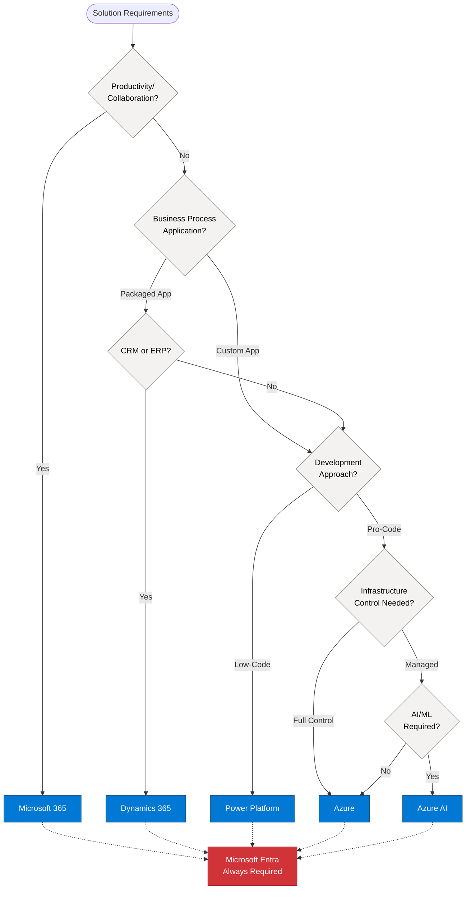
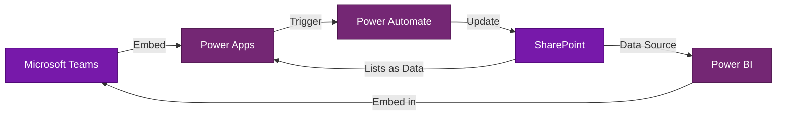
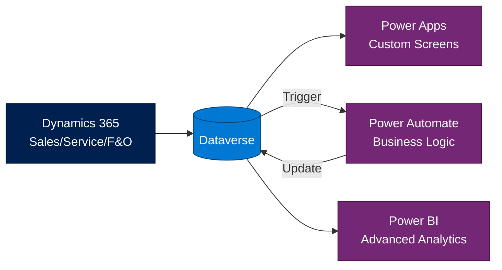
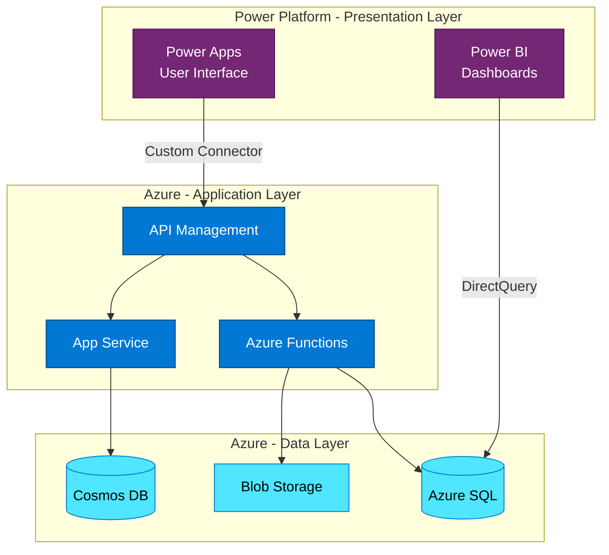
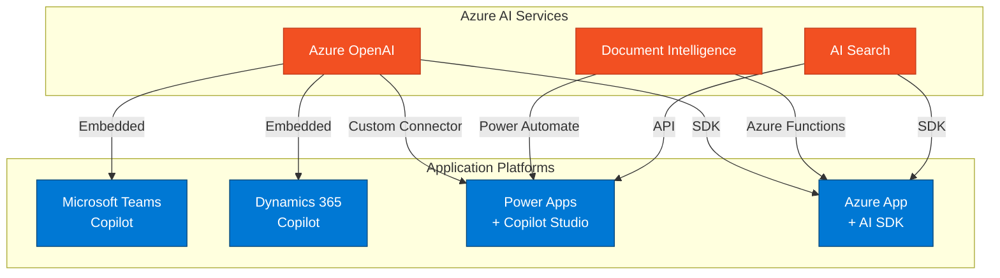

# Microsoft Enterprise Platform Landscape

## Overview

Microsoft's enterprise technology ecosystem consists of six primary platforms, each designed to address specific business and technical needs. Understanding when to use each platform, and how they integrate, is fundamental to enterprise architecture. This reference provides a comprehensive overview of the Microsoft platform landscape and decision guidance for selecting the right platform for your solution.

## Purpose of This Reference

This document helps enterprise architects:
- **Understand the strategic positioning** of each Microsoft platform
- **Make informed platform selection decisions** based on business requirements
- **Identify integration opportunities** across platforms
- **Avoid anti-patterns** like forcing solutions onto inappropriate platforms
- **Leverage platform synergies** for comprehensive enterprise solutions

## The Six Core Microsoft Platforms

### 1. Microsoft 365 (M365)
**Positioning**: Productivity, collaboration, and content management platform

**Core Value Proposition**:
Microsoft 365 provides the foundational productivity suite for modern enterprises, combining familiar Office applications with cloud-based collaboration, communication, and content management capabilities.

**When to Use**:
- Employee collaboration and communication needs
- Document management and co-authoring
- Business email and calendaring
- Team-based workspaces
- Enterprise content management
- Intranet and knowledge management

**Key Services**: Teams, SharePoint, Exchange Online, OneDrive, Viva

**Architecture Sweet Spot**: User-facing productivity solutions with minimal custom development

---

### 2. Power Platform
**Positioning**: Low-code/no-code application development and business process automation

**Core Value Proposition**:
Power Platform democratizes application development, enabling business users and citizen developers to create solutions while providing professional developers with tools to extend capabilities.

**When to Use**:
- Departmental applications with rapid development needs
- Business process automation
- Data visualization and reporting
- Simple websites and portals
- Solutions requiring minimal coding
- Extending Microsoft 365 and Dynamics 365

**Key Services**: Power Apps, Power Automate, Power BI, Power Pages, Power Virtual Agents, Copilot Studio

**Architecture Sweet Spot**: Business-led solutions with IT governance and oversight

---

### 3. Azure
**Positioning**: Enterprise cloud computing platform for custom applications and infrastructure

**Core Value Proposition**:
Azure provides comprehensive cloud infrastructure (IaaS), platform services (PaaS), and managed services enabling organizations to build, deploy, and manage applications at enterprise scale with full control and flexibility.

**When to Use**:
- Custom application development requiring code-first approach
- Infrastructure modernization and migration
- Microservices and containerized applications
- High-performance computing needs
- Complex integration requirements
- Mission-critical enterprise applications
- IoT and edge computing solutions

**Key Services**: Virtual Machines, App Service, Azure Functions, AKS, Azure SQL, Cosmos DB, Service Bus, API Management

**Architecture Sweet Spot**: Code-first, scalable, mission-critical enterprise applications

---

### 4. Dynamics 365
**Positioning**: Intelligent business applications for CRM and ERP

**Core Value Proposition**:
Dynamics 365 provides industry-leading business applications for customer engagement (CRM) and enterprise operations (ERP), with built-in AI and deep integration with the Microsoft ecosystem.

**When to Use**:
- Customer relationship management (Sales, Marketing, Service)
- Enterprise resource planning (Finance, Supply Chain, Manufacturing)
- Customer data platform needs
- Industry-specific business processes
- Organizations wanting packaged business applications vs. custom development

**Key Services**: Sales, Customer Service, Marketing, Field Service, Finance & Operations, Supply Chain, Customer Insights

**Architecture Sweet Spot**: Core business processes requiring enterprise-grade business applications

---

### 5. AI & Cognitive Services
**Positioning**: Artificial intelligence and machine learning platform

**Core Value Proposition**:
Azure AI provides enterprise-ready AI capabilities, from pre-built cognitive services to custom machine learning models, now including generative AI through Azure OpenAI Service.

**When to Use**:
- Intelligent document processing
- Conversational AI (chatbots, copilots, agents)
- Computer vision and image analysis
- Natural language processing
- Generative AI applications
- Semantic search and knowledge retrieval
- AI-augmented business processes

**Key Services**: Azure OpenAI Service, Azure AI Search, Document Intelligence, Cognitive Services, Azure Machine Learning

**Architecture Sweet Spot**: AI-augmented solutions and intelligent automation

---

### 6. Security & Compliance (Microsoft Entra)
**Positioning**: Identity, security, and compliance platform

**Core Value Proposition**:
Microsoft Entra (formerly Azure AD) provides comprehensive identity and access management, Zero Trust security, and compliance capabilities across all Microsoft platforms.

**When to Use**:
- All Microsoft solutions (foundational requirement)
- Single sign-on and identity management
- Zero Trust security implementations
- Conditional access and multi-factor authentication
- B2B and B2C identity scenarios
- Compliance and governance

**Key Services**: Entra ID (Azure AD), Entra ID Protection, Conditional Access, Privileged Identity Management, Microsoft Purview

**Architecture Sweet Spot**: Foundational security and identity layer for all solutions

## Platform Selection Decision Framework

### Decision Criteria Matrix

### Quick Reference Table

| Use Case | Primary Platform | Common Extensions |
|----------|-----------------|-------------------|
| Team collaboration | Microsoft 365 | Power Platform for workflow |
| Document management | Microsoft 365 | Azure for advanced processing |
| Business process automation | Power Platform | Azure Functions for custom logic |
| Departmental apps | Power Platform | Azure for APIs, M365 for data |
| Enterprise web apps | Azure | Power Platform for admin portals |
| Mobile apps | Azure or Power Platform | Both can host mobile solutions |
| Sales force automation | Dynamics 365 Sales | Power Platform for extensions |
| ERP/Finance | Dynamics 365 F&O | Power BI for reporting |
| Customer service | Dynamics 365 Service | Virtual Agents for chatbots |
| Data warehousing | Azure Synapse | Power BI for visualization |
| Real-time dashboards | Power BI | Azure for data processing |
| Public websites | Power Pages or Azure | Azure for complex scenarios |
| IoT solutions | Azure IoT | Power BI for analytics |
| AI/ML applications | Azure AI | All platforms for integration |
| Document intelligence | Azure AI Document Intelligence | Power Platform for workflow |
| Conversational AI | Azure OpenAI + Copilot Studio | Dynamics/M365 for integration |

## Platform Integration Patterns

### Pattern 1: Microsoft 365 + Power Platform
**Common Scenario**: Extending collaboration with custom apps and automation

**Use Cases**:
- Team-based approval workflows
- Departmental dashboards embedded in Teams
- Custom forms and data collection
- Automated document routing

---

### Pattern 2: Dynamics 365 + Power Platform
**Common Scenario**: Extending business applications with custom workflows and reporting

**Use Cases**:
- Custom business process flows
- Executive dashboards and reporting
- Mobile field service applications
- Industry-specific extensions

---

### Pattern 3: Azure + Power Platform
**Common Scenario**: Enterprise-grade backend with low-code frontend

**Use Cases**:
- Enterprise applications with rich UI needs
- Reusable APIs consumed by multiple frontends
- Legacy modernization with modern interfaces
- Citizen developer access to enterprise data

---

### Pattern 4: Multi-Platform AI Integration
**Common Scenario**: AI capabilities across the enterprise

**Use Cases**:
- Enterprise-wide conversational AI (copilots)
- Intelligent document processing
- Semantic search across platforms
- AI-augmented business processes

## Licensing Considerations

### Licensing Model Overview

Understanding licensing is crucial for platform selection and solution design:

| Platform | Primary Licensing Model | Key Considerations |
|----------|------------------------|-------------------|
| Microsoft 365 | Per-user subscription (E3, E5, Business) | Includes baseline services; premium features require E5 |
| Power Platform | Per-user or per-app | Premium connectors, AI Builder require additional licensing |
| Azure | Consumption-based (pay-as-you-go) | Predictable costs require careful architecture planning |
| Dynamics 365 | Per-user subscription by application | Can be costly; consider user types (full vs. team member) |
| Azure AI | Consumption-based | OpenAI has specific pricing models (tokens); can add significant cost |
| Microsoft Entra | Included in M365; premium features extra | P1/P2 required for advanced features |

### Cost Optimization Patterns

**Pattern**: Use appropriate user licensing tiers
- Full users for power users
- Team member licenses for limited access
- External user scenarios via Entra B2B

**Pattern**: Leverage included capabilities
- Power Platform included with many M365 licenses (with limits)
- Azure AD P1 included with many E3+ licenses
- Basic Dataverse included with Power Apps licenses

**Pattern**: Hybrid platform approaches
- Use Power Platform for internal users (per-user license)
- Use Azure for external-facing solutions (consumption-based)
- Leverage M365 for data storage (included with licenses)

## Common Anti-Patterns to Avoid

### Anti-Pattern 1: Using Azure for Simple Business Apps
**Problem**: Building custom code solutions when low-code would suffice

**Impact**:
- Higher development costs and timelines
- Increased maintenance burden
- Reduced business agility

**Solution**: Evaluate Power Platform first for departmental apps; use Azure for complex, mission-critical solutions

---

### Anti-Pattern 2: Over-Extending Low-Code Platforms
**Problem**: Forcing complex requirements into Power Platform

**Impact**:
- Performance issues
- Maintainability challenges
- Technical debt accumulation

**Solution**: Recognize when requirements exceed low-code capabilities; use Azure for complex business logic and integration

---

### Anti-Pattern 3: Ignoring Data Platform Integration
**Problem**: Creating data silos by not leveraging Dataverse or Azure integration

**Impact**:
- Duplicate data across platforms
- Synchronization complexity
- Inconsistent data quality

**Solution**: Use Dataverse as the common data platform for business applications; Azure SQL/Cosmos for specialized needs

---

### Anti-Pattern 4: Platform Islands
**Problem**: Implementing platforms in isolation without integration strategy

**Impact**:
- Missed productivity opportunities
- Poor user experience
- Redundant capabilities

**Solution**: Design for cross-platform integration from the start; leverage Microsoft Graph, connectors, and APIs

---

### Anti-Pattern 5: Wrong Platform for AI Solutions
**Problem**: Building custom AI/ML from scratch when pre-built services exist

**Impact**:
- Reinventing the wheel
- Higher complexity and cost
- Delayed time to value

**Solution**: Leverage Azure AI services first; build custom models only when necessary

## Platform Evolution and Trends

### Current Trends (2024-2025)

**AI Integration Everywhere**:
- Copilots embedded in every platform
- Generative AI capabilities becoming standard
- AI-assisted development and operations

**Platform Convergence**:
- Deeper integration between platforms
- Unified developer experiences
- Common data models (Microsoft Cloud for Industry)

**Low-Code Expansion**:
- Power Platform capabilities expanding
- Professional developer tools improving
- Fusion development models emerging

**Sovereign Cloud and Compliance**:
- Regional data residency options
- Industry-specific clouds
- Enhanced compliance capabilities

## When to Load This Reference

Load this reference when:
- Starting solution envisioning or architecture work
- Making platform selection decisions
- Designing cross-platform integration
- Evaluating multiple platform options
- Educating stakeholders on Microsoft ecosystem
- Keywords: "which platform", "Microsoft platforms", "platform selection", "M365 vs Azure", "Dynamics vs Power Platform"

## Related References

- `/references/technology/m365-specifics.md` - Deep dive into Microsoft 365 capabilities
- `/references/technology/power-platform-specifics.md` - Power Platform architecture patterns
- `/references/technology/azure-specifics.md` - Azure services and integration
- `/references/technology/dynamics-specifics.md` - Dynamics 365 business applications
- `/references/technology/ai-cognitive-specifics.md` - AI and cognitive services
- `/references/frameworks/domain-driven-design.md` - For context mapping across platforms
- `/references/phases/phase-vision.md` - For technology selection during envisioning

## Microsoft Resources

**Platform Overviews**:
- Microsoft Cloud Architecture: https://learn.microsoft.com/en-us/microsoft-cloud/
- Microsoft 365 Architecture: https://learn.microsoft.com/en-us/microsoft-365/solutions/architecture-center
- Power Platform Architecture: https://learn.microsoft.com/en-us/power-platform/architecture/
- Azure Architecture Center: https://learn.microsoft.com/en-us/azure/architecture/
- Dynamics 365 Architecture: https://learn.microsoft.com/en-us/dynamics365/guidance/architecture/

**Integration Guidance**:
- Microsoft Graph: https://learn.microsoft.com/en-us/graph/overview
- Cross-platform integration: https://learn.microsoft.com/en-us/microsoft-cloud/architecture/integration

**Licensing Resources**:
- Microsoft 365 Licensing: https://www.microsoft.com/en-us/microsoft-365/compare-all-microsoft-365-plans
- Power Platform Licensing: https://www.microsoft.com/en-us/power-platform/products/power-apps/pricing
- Azure Pricing Calculator: https://azure.microsoft.com/en-us/pricing/calculator/
- Dynamics 365 Licensing: https://dynamics.microsoft.com/en-us/pricing/

---

*This reference provides the foundation for understanding Microsoft's enterprise platform landscape. All subsequent technology references build upon these core concepts.*
