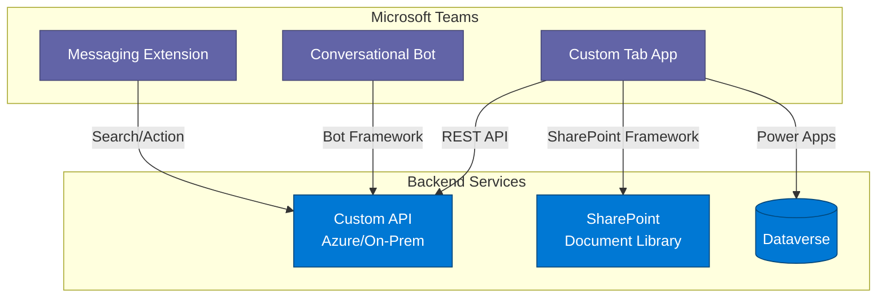
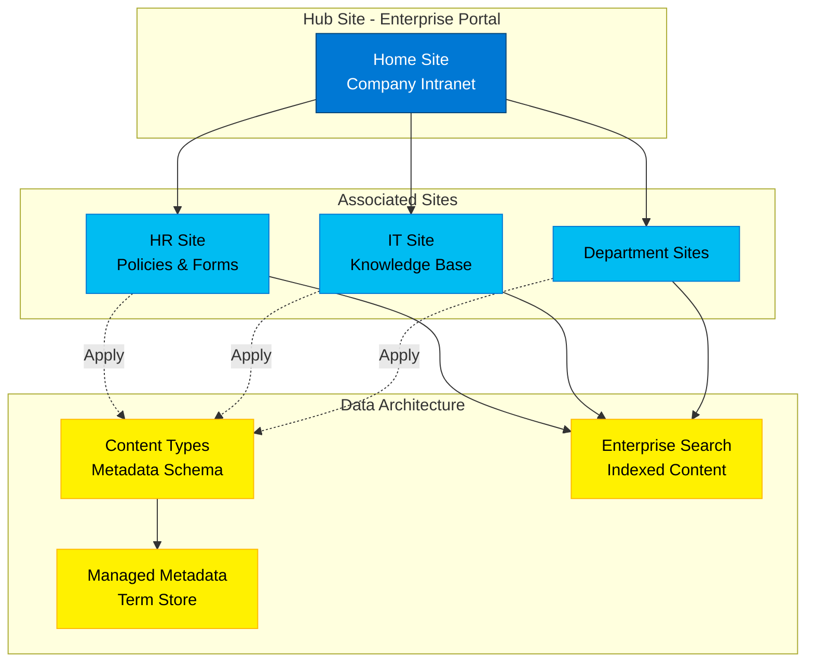
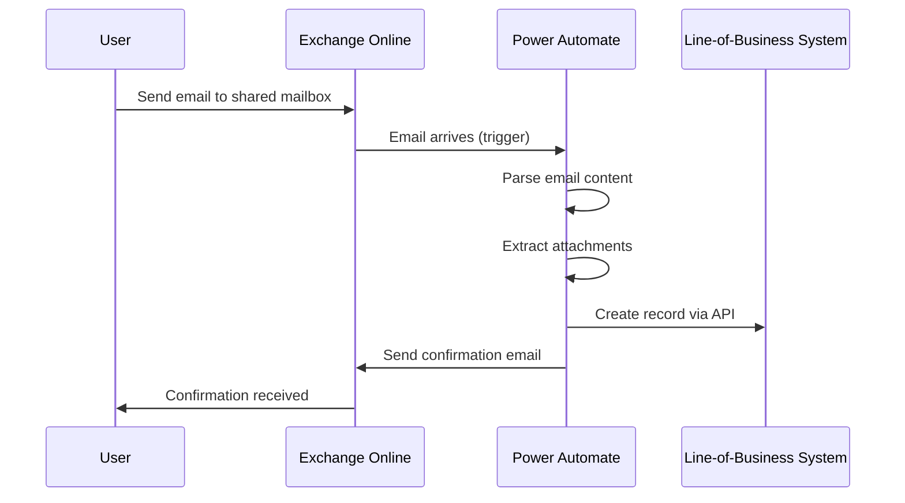
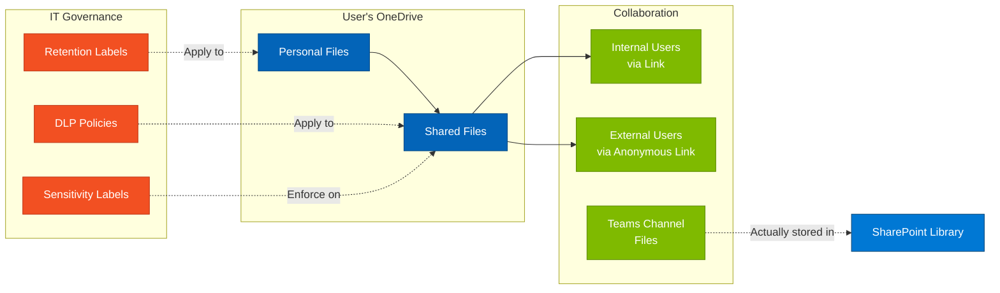
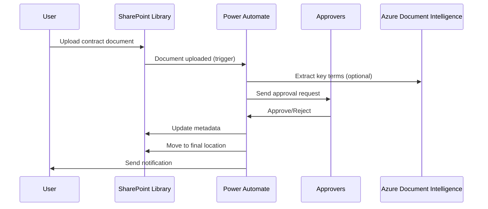
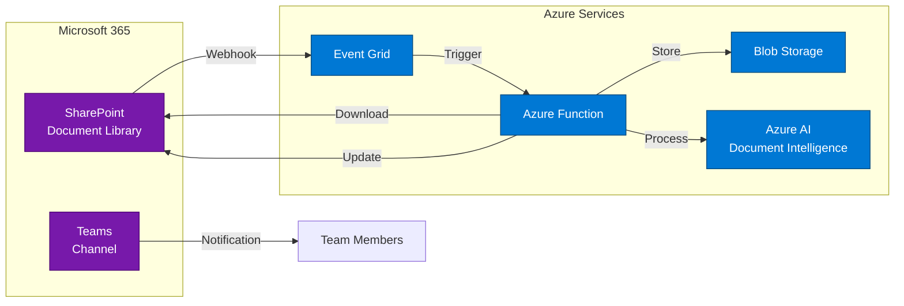
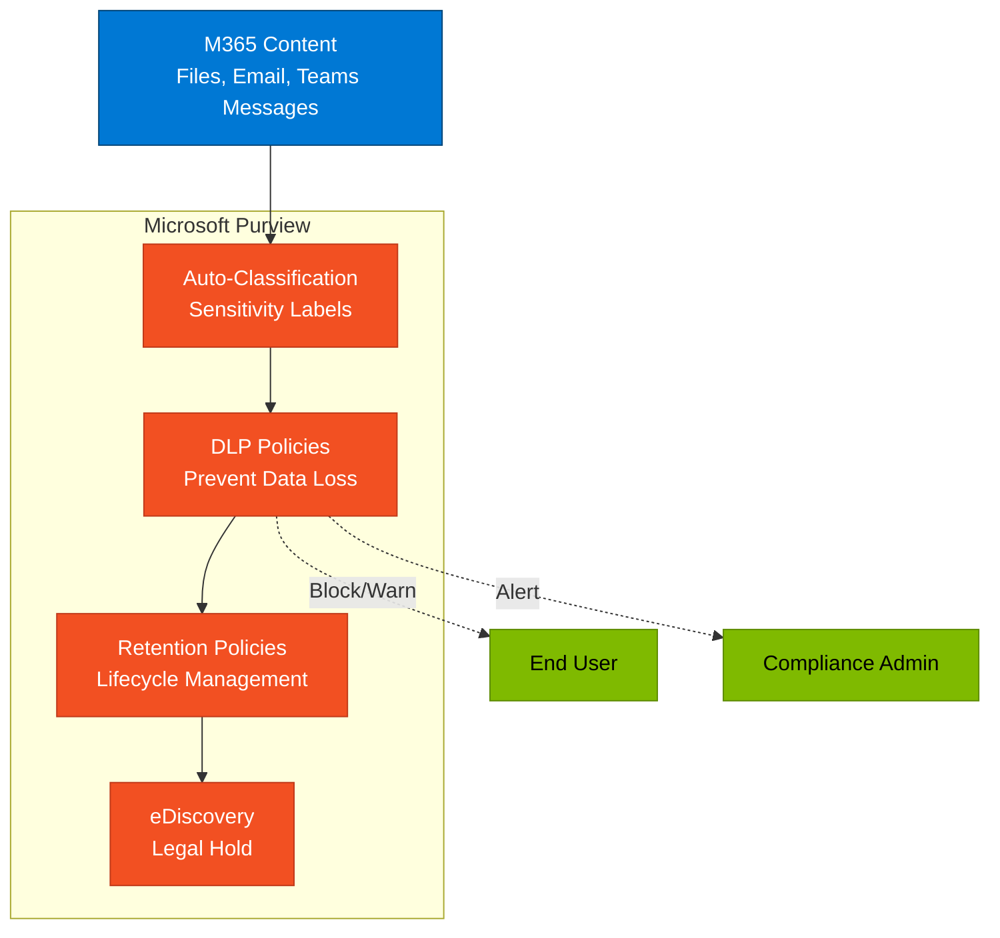

# Microsoft 365 Platform - Architecture and Integration Patterns

## Overview

Microsoft 365 (M365) is Microsoft's comprehensive productivity and collaboration platform, combining Office applications, cloud services, device management, and security into an integrated solution. For enterprise architects, M365 serves as the foundational productivity layer and data platform for many enterprise solutions.

## Platform Positioning

**Strategic Role**: Microsoft 365 is the productivity foundation of the modern workplace, providing:
- User productivity tools (Office apps)
- Collaboration and communication (Teams, SharePoint, Exchange)
- Content management and compliance (SharePoint, OneDrive, Purview)
- Identity and security foundation (Microsoft Entra ID)
- Extensibility platform for custom solutions

**Architectural Significance**: M365 is not just an application suite. It is a platform with rich APIs (Microsoft Graph), extensibility points, and integration capabilities that make it central to enterprise architecture.

## Core Services Deep Dive

### 1. Microsoft Teams

**Purpose**: Hub for teamwork combining chat, meetings, calling, and collaboration

**Architecture Capabilities**:
- **Channel-based collaboration** with persistent chat history
- **Integrated meetings** with recording and transcription
- **App extensibility** via tabs, bots, messaging extensions, and meeting apps
- **Teams Toolkit** for developer productivity
- **Graph API integration** for programmatic access

**Common Architecture Patterns**:



**Integration Points**:
- Power Apps embedded as tabs
- Power BI reports and dashboards
- SharePoint pages and document libraries
- Custom Line-of-Business (LOB) applications
- Third-party SaaS via connectors

**Licensing Considerations**:
- Basic Teams capabilities included in all M365 licenses
- Advanced features (webinars, advanced calling) require specific licenses
- Developer tools free with M365 subscription

---

### 2. SharePoint Online

**Purpose**: Enterprise content management, intranet, and collaboration platform

**Architecture Capabilities**:
- **Document libraries** with versioning, check-in/out, metadata
- **Lists** as structured data stores (relational-like)
- **Sites and hubs** for information architecture
- **SharePoint Framework (SPFx)** for custom development
- **Content types and managed metadata** for taxonomy
- **Search** with customization and refinement
- **Workflow integration** with Power Automate

**Common Architecture Patterns**:



**Data Storage Patterns**:
- **Document-centric**: Primary use case, with Office integration
- **Structured lists**: Lightweight relational data (use Dataverse for complex scenarios)
- **Hybrid**: Document libraries with rich metadata from lists

**Integration Points**:
- **Microsoft Graph**: Programmatic access to sites, lists, and documents
- **Power Platform**: SharePoint lists as data sources for Power Apps/Automate
- **Teams**: SharePoint provides backend storage for Teams files
- **Azure**: Event-driven integration via webhooks and Azure functions
- **Search**: Microsoft Search aggregates SharePoint, OneDrive, and other M365 content

**Licensing Considerations**:
- SharePoint Online included in all M365 business and enterprise licenses
- Storage quotas: 1TB base + 10GB per licensed user + additional storage available
- Advanced features (advanced data loss prevention) require E5

---

### 3. Exchange Online

**Purpose**: Enterprise email, calendaring, and contact management

**Architecture Capabilities**:
- **Mailbox services** with archiving and compliance
- **Calendaring** with scheduling assistance and room booking
- **Mail flow rules** for routing and compliance
- **Journaling and retention** for regulatory compliance
- **REST APIs** for application integration
- **Shared mailboxes** for team scenarios

**Common Architecture Patterns**:

**Pattern: Email-Triggered Workflows**


**Integration Points**:
- **Power Automate**: Email triggers for business process automation
- **Microsoft Graph**: Programmatic access to mail, calendar, contacts
- **Azure Logic Apps**: Enterprise integration scenarios
- **Third-party systems**: SMTP/IMAP for legacy integration
- **Compliance systems**: Journaling and eDiscovery integration

**Anti-Patterns to Avoid**:
- Using email as primary data store (use proper databases)
- Building custom email infrastructure (leverage built-in capabilities)
- Ignoring mail flow security (implement SPF, DKIM, DMARC)

**Licensing Considerations**:
- Exchange Online Plan 1: 50GB mailbox
- Exchange Online Plan 2 or M365 E3/E5: 100GB mailbox + in-place archive
- Shared mailboxes: Free (no license required, up to 50GB)

---

### 4. OneDrive for Business

**Purpose**: Personal cloud storage and file synchronization

**Architecture Capabilities**:
- **Personal storage** (1TB+ per user)
- **File synchronization** across devices
- **Sharing and collaboration** with internal and external users
- **Version history** and file recovery
- **Offline access** via sync client
- **Known Folder Move** for desktop, documents, pictures

**Common Architecture Patterns**:

**Pattern: Personal Workspace with Controlled Sharing**


**Integration Points**:
- **Microsoft Graph**: Access files programmatically
- **Power Automate**: File-based triggers and actions
- **Azure**: Sync files to Azure blob storage for processing
- **Desktop applications**: Direct integration with Office apps

**Architecture Considerations**:
- OneDrive vs. SharePoint: OneDrive for personal files; SharePoint for team/organizational content
- External sharing governance: Configure organization-wide sharing policies
- Data loss prevention: Apply DLP policies to prevent sensitive data leakage
- Backup strategy: Microsoft provides version history and recycle bin, but consider third-party backup for compliance

**Licensing Considerations**:
- Storage: 1TB per user (M365 Business/E3), can increase to 5TB+ with E5
- Advanced features (ransomware detection, file restore) available in all plans
- No additional licensing required for mobile apps or sync client

---

### 5. Microsoft Viva

**Purpose**: Employee experience platform

**Architecture Capabilities**:
- **Viva Connections**: Personalized employee portal (SharePoint-based)
- **Viva Engage**: Communities and conversations (Yammer evolution)
- **Viva Learning**: Learning management within Teams
- **Viva Insights**: Productivity and wellbeing analytics
- **Viva Goals**: OKR tracking and alignment

**Integration Points**:
- Extensible via SharePoint Framework (SPFx) and Adaptive Cards
- Data integrations with HRIS, LMS, and other systems
- Microsoft Graph for personalization
- Power Platform for custom experiences

**Licensing Considerations**:
- Viva suite licensing or individual module licensing
- Some capabilities included in base M365 licenses
- Advanced features require additional licenses

---

## Microsoft 365 as a Data Platform

### Microsoft Graph: The Unified API

Microsoft Graph is the gateway to Microsoft 365 data and intelligence:

**Capabilities**:
- **Single endpoint**: `https://graph.microsoft.com`
- **Unified access**: Users, groups, mail, calendar, files, Teams, SharePoint, and more
- **Consistent patterns**: REST API with OData query capabilities
- **Webhooks**: Subscribe to change notifications
- **Batch requests**: Combine multiple requests for efficiency

**Common Integration Pattern**:

```mermaid
flowchart TB
    subgraph Apps["Applications"]
        CustomApp[Custom Application]
        PowerApp[Power Apps]
        LogicApp[Azure Logic Apps]
    end

    Graph[Microsoft Graph API<br/>graph.microsoft.com]

    subgraph M365["Microsoft 365 Data"]
        Users[Users & Groups<br/>Entra ID]
        Mail[Email & Calendar<br/>Exchange]
        Files[Files & Folders<br/>OneDrive/SharePoint]
        Teams[Teams & Channels]
        Analytics[Analytics<br/>Viva Insights]
    end

    CustomApp -->|REST API| Graph
    PowerApp -->|Standard Connector| Graph
    LogicApp -->|Built-in Connector| Graph

    Graph --> Users
    Graph --> Mail
    Graph --> Files
    Graph --> Teams
    Graph --> Analytics

    classDef app fill:#0078d4,stroke:#004578,color:#fff
    classDef graph fill:#f25022,stroke:#c03a1a,color:#fff
    classDef data fill:#7fba00,stroke:#5e8c00,color:#fff

    class CustomApp,PowerApp,LogicApp app
    class Graph graph
    class Users,Mail,Files,Teams,Analytics data
```

**Authentication**:
- Delegated permissions: User context (interactive apps)
- Application permissions: App-only context (daemon services)
- Conditional Access policies apply to Graph API calls

---

### SharePoint Lists vs. Dataverse: When to Use Each

| Criteria | SharePoint Lists | Dataverse |
|----------|-----------------|-----------|
| **Best For** | Simple data, document-centric | Complex business data, relational |
| **Relationships** | Lookup columns (simple) | Complex relationships, foreign keys |
| **Business Logic** | Power Automate, SPFx | Business rules, plugins, workflows |
| **Security** | Item-level permissions (limited) | Field-level security, row-level security |
| **Licensing** | Included in M365 | Power Apps/Dynamics 365 required |
| **Storage** | Part of SharePoint quota | Separate database capacity |
| **Offline** | Limited | Full offline capabilities |
| **Performance** | Good for <5000 items per view | Optimized for millions of records |

**Decision Guidance**:
- Start with SharePoint lists for simple scenarios
- Migrate to Dataverse when you need complex business logic, relationships, or offline capabilities
- Use hybrid approach: Documents in SharePoint, structured data in Dataverse

---

## Architecture Patterns and Best Practices

### Pattern 1: Intranet Portal with Personalization

**Scenario**: Enterprise-wide intranet with personalized content

**Architecture**:
- Hub site for corporate brand and navigation
- Associated sites for departments, regions, locations
- Audience targeting for personalized content
- Microsoft Search for unified discovery
- Viva Connections for mobile experience

**Best Practices**:
- Information architecture planning before building
- Governance model for site provisioning
- Content approval workflows
- Analytics for continuous improvement

---

### Pattern 2: Document-Centric Workflow

**Scenario**: Contract approval process with document collaboration

**Architecture**:


**Best Practices**:
- Leverage content types for document classification
- Use managed metadata for consistent taxonomy
- Implement retention labels for compliance
- Version history for audit trail
- Sensitivity labels for data protection

---

### Pattern 3: Teams-First Collaboration

**Scenario**: Project collaboration with integrated tools

**Architecture**:
- Teams workspace as central hub
- SharePoint for file storage (automatic)
- Planner for task management
- OneNote for meeting notes
- Power Apps for custom forms
- Power BI for project dashboards

**Best Practices**:
- Templates for consistent team setup
- Naming conventions and governance
- Lifecycle management (archive inactive teams)
- External access policies
- DLP policies for sensitive projects

---

## Integration with Other Microsoft Platforms

### M365 + Power Platform

**Common Scenarios**:
- Power Apps using SharePoint lists as data source
- Power Automate for email-driven workflows
- Power BI embedded in SharePoint pages
- Power Virtual Agents in Teams

**Integration Points**:
- SharePoint connector (standard, no premium required)
- Office 365 connectors (Outlook, Teams, Excel)
- Microsoft Graph connector (premium for some operations)

**Best Practices**:
- Use SharePoint for document-heavy scenarios, Dataverse for relational data
- Leverage included connectors to avoid premium licensing
- Use Microsoft Graph for operations not covered by standard connectors

---

### M365 + Azure

**Common Scenarios**:
- Azure Functions processing SharePoint webhooks
- Azure Logic Apps for enterprise integration
- Azure AI services processing M365 content
- Azure Event Grid for event-driven architecture

**Integration Pattern**:


**Best Practices**:
- Use managed identities for Azure-to-M365 authentication
- Implement throttling and retry logic for Graph API
- Use Azure Key Vault for credentials
- Consider Azure API Management for complex scenarios

---

### M365 + Dynamics 365

**Common Scenarios**:
- SharePoint document libraries for Dynamics 365 records
- Teams integration with Dynamics 365 apps
- Outlook integration for email tracking
- OneDrive for personal sales documents

**Integration Points**:
- Native SharePoint integration in Dynamics 365
- Server-side synchronization for email
- Teams app for Dynamics 365
- Microsoft Graph for custom integration

---

## Security and Compliance

### Microsoft Entra ID (Azure AD) Integration

**Role**: Identity foundation for all M365 services

**Key Capabilities**:
- Single Sign-On (SSO) for all M365 apps
- Conditional Access policies
- Multi-factor authentication (MFA)
- Identity Protection with risk-based policies
- Privileged Identity Management (PIM) for admin roles

**Architecture Consideration**: All M365 architecture should include Entra ID design for authentication, authorization, and security

---

### Information Protection and Governance

**Microsoft Purview** capabilities within M365:

**Data Classification**:
- Sensitivity labels (confidential, internal, public)
- Retention labels (legal hold, records management)
- Trainable classifiers (machine learning-based)

**Data Loss Prevention (DLP)**:
- Policies across SharePoint, OneDrive, Teams, Exchange
- Endpoint DLP for local devices
- Protective actions (block, warn, audit)

**Information Governance**:
- Retention policies and retention labels
- Records management
- eDiscovery and content search
- Audit logging

**Architecture Pattern**:


---

## Licensing and Capacity Planning

### License Tiers

**Microsoft 365 Business**:
- Business Basic: Web and mobile apps, email, cloud storage
- Business Standard: Desktop apps + web/mobile
- Business Premium: Advanced security + device management

**Microsoft 365 Enterprise**:
- E3: Full Office suite + advanced security + compliance
- E5: E3 + advanced security/compliance + analytics + voice

**Key Decision Points**:
- E3 vs E5: Advanced features (Purview advanced compliance, advanced threat protection, Power BI Pro)
- F3 (Frontline): Optimized for frontline workers, limited features
- Add-ons: Advanced eDiscovery, Advanced Compliance individually

### Capacity Considerations

**Storage Quotas**:
- SharePoint: 1TB + 10GB per licensed user (pooled across organization)
- OneDrive: 1TB per user (E3), can increase to 5TB+ (E5)
- Exchange: 50GB (Plan 1), 100GB (Plan 2/E3/E5)
- Teams: Uses SharePoint storage

**Performance Limits**:
- SharePoint list view threshold: 5,000 items
- API throttling: Microsoft Graph has per-app and per-tenant limits
- Email sending limits: 10,000 recipients per day

**Best Practices**:
- Monitor storage usage via admin center
- Implement retention policies to manage storage
- Use SharePoint site collection storage limits
- Plan for growth (10-20% year-over-year typical)

---

## Common Use Cases and Scenarios

### Use Case 1: Employee Onboarding Portal

**Solution Components**:
- SharePoint hub site for HR portal
- Document libraries for policies and forms
- Lists for onboarding tasks
- Power Automate for new hire workflow
- Teams workspace for new hire cohorts
- Viva Learning for training content

**Architecture Benefits**:
- Self-service access to information
- Automated workflows reduce manual work
- Consistent onboarding experience
- Compliance with retention policies

---

### Use Case 2: Department Collaboration Hub

**Solution Components**:
- Teams workspace per department
- SharePoint for document collaboration
- Planner for task tracking
- Power Apps for custom departmental forms
- Power BI for departmental dashboards
- Stream for training videos

**Architecture Benefits**:
- All collaboration in one place
- Mobile access via Teams app
- Integration with existing processes
- Extensible with custom apps

---

### Use Case 3: Executive Communication Platform

**Solution Components**:
- SharePoint communication site
- Targeted news posts with audience targeting
- Video messages via Stream (SharePoint)
- Yammer/Viva Engage for comments
- Analytics on engagement

**Architecture Benefits**:
- Reach all employees
- Mobile-optimized
- Measurable engagement
- Two-way communication

---

## When to Load This Reference

Load this reference when:
- Designing collaboration and productivity solutions
- Planning intranet or portal solutions
- Architecting document management systems
- Extending M365 with custom applications
- Integrating M365 with other platforms
- Planning M365 governance and compliance
- Keywords: "Microsoft 365", "M365", "SharePoint", "Teams", "OneDrive", "Exchange", "collaboration", "intranet", "productivity"

## Related References

- `/references/technology/core-platforms.md` - Platform selection guidance
- `/references/technology/power-platform-specifics.md` - Extending M365 with Power Platform
- `/references/technology/azure-specifics.md` - Azure integration scenarios
- `/references/frameworks/azure-waf-security.md` - Security considerations
- `/references/phases/phase-vision.md` - Envisioning M365 solutions

## Microsoft Resources

**Architecture**:
- Microsoft 365 Architecture Center: https://learn.microsoft.com/en-us/microsoft-365/solutions/architecture-center
- SharePoint Architecture: https://learn.microsoft.com/en-us/sharepoint/dev/solution-guidance/architectural-overview
- Teams Architecture: https://learn.microsoft.com/en-us/microsoftteams/teams-architecture-solutions-posters

**Development**:
- Microsoft Graph: https://learn.microsoft.com/en-us/graph/overview
- SharePoint Framework (SPFx): https://learn.microsoft.com/en-us/sharepoint/dev/spfx/sharepoint-framework-overview
- Teams Developer Platform: https://learn.microsoft.com/en-us/microsoftteams/platform/

**Security and Compliance**:
- Microsoft Purview: https://learn.microsoft.com/en-us/purview/
- Data Loss Prevention: https://learn.microsoft.com/en-us/purview/dlp-learn-about-dlp
- Sensitivity Labels: https://learn.microsoft.com/en-us/purview/sensitivity-labels

**Administration**:
- Microsoft 365 Admin Center: https://admin.microsoft.com
- SharePoint Admin Center: https://learn.microsoft.com/en-us/sharepoint/sharepoint-admin-role
- Exchange Admin Center: https://learn.microsoft.com/en-us/exchange/exchange-admin-center

---

*Microsoft 365 is the productivity foundation for enterprise solutions. Understanding its capabilities, integration points, and limitations is essential for enterprise architects working in the Microsoft ecosystem.*
