# Dynamics 365 - Business Applications Platform Architecture

## Overview

Dynamics 365 is Microsoft's suite of intelligent business applications for customer relationship management (CRM) and enterprise resource planning (ERP). For enterprise architects, Dynamics 365 represents a strategic platform for core business processes, combining pre-built business applications with extensibility through Power Platform and integration with the broader Microsoft ecosystem.

## Platform Positioning

**Strategic Role**: Dynamics 365 provides packaged business applications for:
- **Customer Engagement**: Sales, Marketing, Customer Service, Field Service
- **Operations**: Finance, Supply Chain Management, Commerce, Human Resources
- **Customer Data**: Customer Insights for unified customer data platform
- **Industry Solutions**: Pre-built solutions for healthcare, manufacturing, retail, financial services

**Architectural Philosophy**: "Configure first, customize when needed": leverage out-of-box capabilities, extend with Power Platform, develop custom code only when necessary.

## Core Applications Overview

### Customer Engagement Applications

These applications run on Dataverse and focus on customer-facing processes:

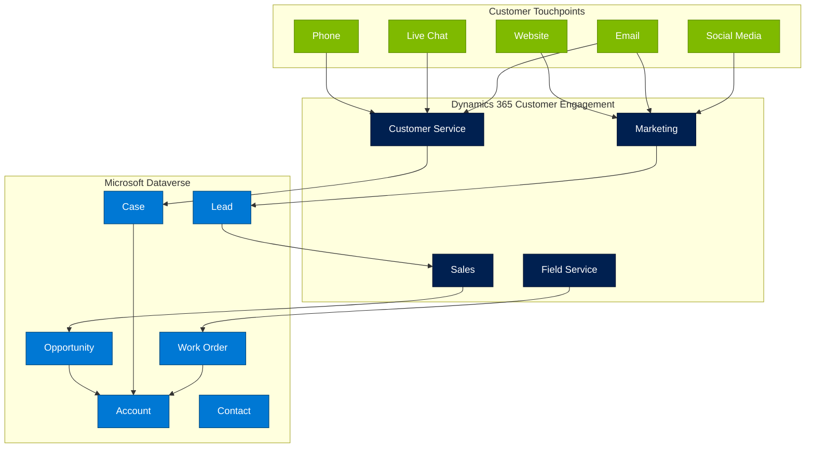

---

### 1. Dynamics 365 Sales

**Purpose**: Sales force automation and customer relationship management

**Key Capabilities**:
- **Lead and Opportunity Management**: Track sales pipeline from lead to close
- **Sales Process Automation**: Business process flows for consistent sales methodology
- **Relationship Intelligence**: AI-driven insights and recommendations
- **Sales Accelerator**: Prioritized work lists and sequences
- **LinkedIn Sales Navigator Integration**: Social selling capabilities
- **Forecasting**: Sales forecasting and predictive analytics
- **Mobile App**: iOS and Android apps for sales on the go

**Architecture Components**:

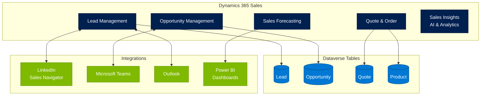

**Common Customizations**:
- Custom sales stages aligned to organization's methodology
- Industry-specific fields and processes
- Integration with proposal/CPQ systems
- Commission calculation workflows
- Custom dashboards and reports

**Best Practices**:
- Use business process flows to enforce sales methodology
- Leverage sales insights for AI-driven recommendations
- Integrate with LinkedIn Sales Navigator for social selling
- Implement lead scoring for prioritization
- Use sales accelerator for productivity
- Configure security roles aligned to sales hierarchy

---

### 2. Dynamics 365 Customer Service

**Purpose**: Omnichannel customer support and case management

**Key Capabilities**:
- **Case Management**: Track and resolve customer issues
- **Knowledge Management**: Self-service and agent knowledge base
- **Omnichannel**: Chat, email, phone, social media, SMS
- **Service Level Agreements (SLAs)**: Track and enforce resolution times
- **AI-Powered Agent Assistance**: Suggested responses and articles
- **Customer Service Insights**: Analytics and sentiment analysis
- **Self-Service Portal**: Customer portal via Power Pages

**Architecture Pattern - Omnichannel Engagement**:

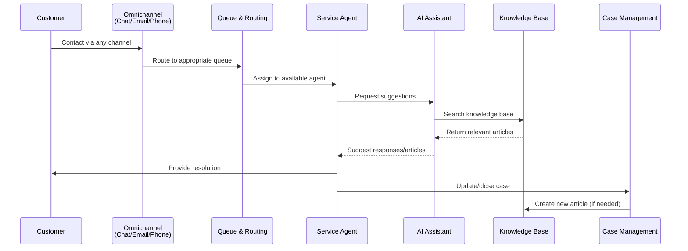

**Integration Points**:
- **Power Virtual Agents/Copilot Studio**: Chatbots for tier-0 support
- **Power BI**: Customer service analytics and dashboards
- **Power Automate**: Case routing and escalation workflows
- **Dynamics 365 Field Service**: Escalate to field service when needed
- **Microsoft Teams**: Agent collaboration on complex cases

**Best Practices**:
- Implement omnichannel for unified customer experience
- Use AI suggestions to improve agent productivity
- Build comprehensive knowledge base for self-service
- Configure SLAs aligned to service commitments
- Use sentiment analysis to identify at-risk customers
- Implement tiered support with chatbots (tier-0), agents (tier-1/2), specialists (tier-3)

---

### 3. Dynamics 365 Marketing

**Purpose**: Marketing automation and customer journey orchestration

**Key Capabilities**:
- **Customer Journey Orchestration**: Multi-step, multi-channel campaigns
- **Lead Scoring and Nurturing**: Automated lead qualification
- **Event Management**: Webinars, in-person events, hybrid events
- **Email Marketing**: Drag-and-drop email designer with A/B testing
- **Marketing Pages**: Landing pages and forms
- **LinkedIn Integration**: Lead Gen Forms and audience matching
- **Real-Time Marketing**: Event-driven, real-time customer journeys
- **Marketing Analytics**: Campaign performance and attribution

**Architecture Pattern - Customer Journey**:

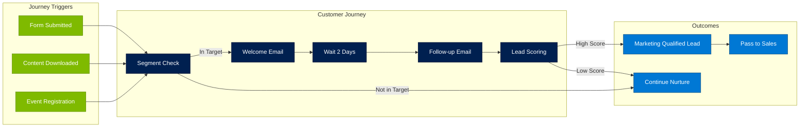

**Integration with Customer Insights**:
- Unified customer profiles from multiple sources
- Segment building based on unified data
- Personalization using customer attributes
- Measure marketing impact on customer lifetime value

**Best Practices**:
- Start with real-time marketing for new implementations
- Build clear lead scoring models aligned to sales
- Implement lead nurturing journeys for different buyer personas
- Use A/B testing for email optimization
- Integrate with webinar platforms (Teams, ON24, etc.)
- Track marketing attribution and ROI

---

### 4. Dynamics 365 Field Service

**Purpose**: Field service management and mobile workforce optimization

**Key Capabilities**:
- **Work Order Management**: Schedule and dispatch field technicians
- **Scheduling Optimization**: AI-powered scheduling and route optimization
- **Mobile App**: Offline-capable mobile app for technicians
- **Asset Management**: Track customer assets and service history
- **Inventory Management**: Parts, warehouse, and truck stock
- **Preventive Maintenance**: Recurring work order generation
- **IoT Integration**: Proactive service from IoT device telemetry
- **Mixed Reality**: Remote assistance with Dynamics 365 Remote Assist

**Architecture Pattern - IoT-Driven Field Service**:

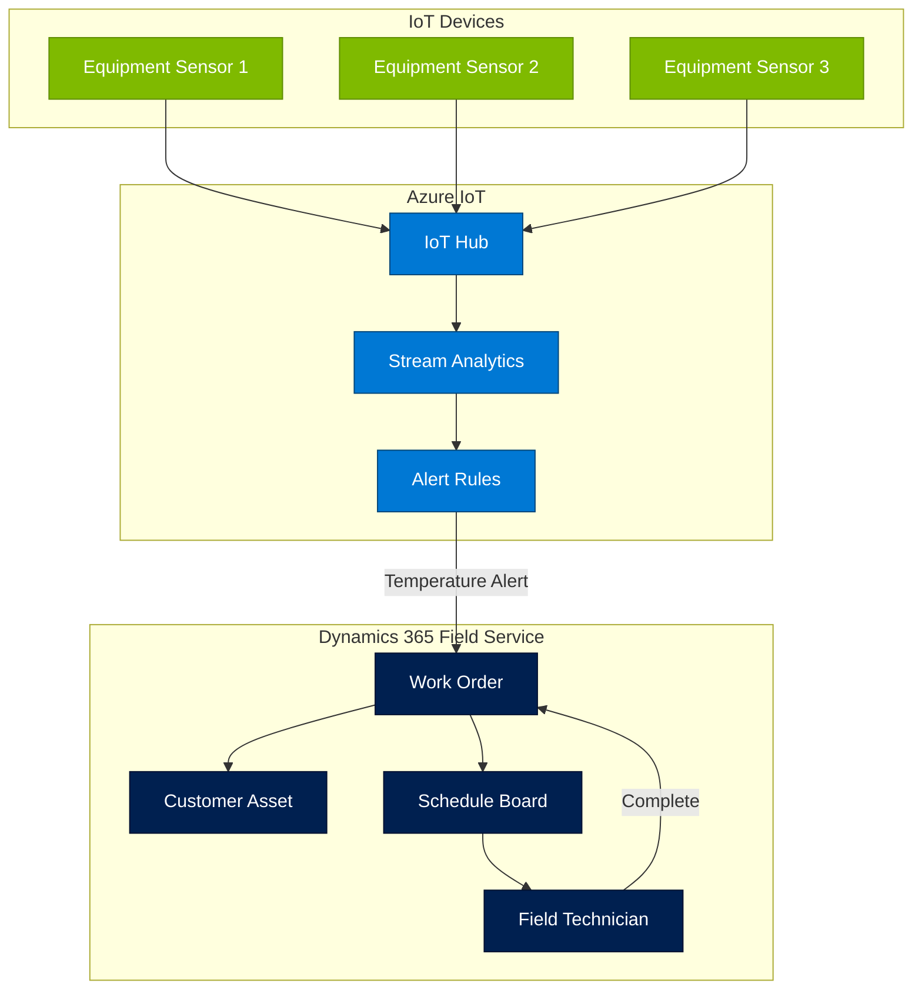

**Best Practices**:
- Implement scheduling optimization for efficiency gains
- Use mobile app offline capabilities for remote locations
- Integrate IoT for predictive maintenance
- Track asset service history for warranty and compliance
- Use mixed reality for remote expert assistance
- Implement geofencing for automatic check-in/out

---

### Operations Applications (ERP)

### 5. Dynamics 365 Finance

**Purpose**: Financial management and accounting

**Key Capabilities**:
- **General Ledger**: Multi-currency, multi-company accounting
- **Accounts Payable/Receivable**: Vendor and customer invoicing
- **Cash and Bank Management**: Cash flow forecasting and bank reconciliation
- **Fixed Assets**: Asset lifecycle management
- **Budgeting**: Budget planning and control
- **Financial Reporting**: Real-time financial insights with Power BI
- **Compliance**: Regulatory reporting and audit trails

**Architecture Considerations**:
- Separate database from other Dynamics 365 apps (not Dataverse)
- Data entities for integration
- Dual-write for Dataverse synchronization (when integrating with CE apps)
- Power Platform integration via virtual tables or connectors

---

### 6. Dynamics 365 Supply Chain Management

**Purpose**: End-to-end supply chain and manufacturing operations

**Key Capabilities**:
- **Procurement**: Purchase orders, vendor management
- **Inventory Management**: Multi-warehouse, lot and serial tracking
- **Production Control**: Manufacturing execution and shop floor control
- **Warehouse Management**: Advanced warehousing with mobile devices
- **Transportation Management**: Freight, shipping, logistics
- **Master Planning**: Demand forecasting and MRP
- **Asset Management**: Maintenance management for production assets

**Integration Pattern - Finance & Supply Chain with Sales**:

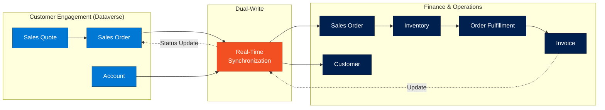

**Dual-Write Considerations**:
- Enables real-time sync between Dataverse (CE apps) and F&O
- Bidirectional synchronization
- Common data model for customers, products, orders
- Requires careful planning and testing
- Performance considerations for high-volume scenarios

---

### 7. Dynamics 365 Customer Insights

**Purpose**: Customer data platform (CDP) for unified customer view

**Capabilities**:
- **Data Unification**: Combine data from multiple sources
- **Customer Profiles**: 360-degree view of customers
- **Segmentation**: Build segments for targeting
- **Measures and KPIs**: Calculate customer lifetime value, churn risk
- **Predictions**: AI-powered predictions (churn, product recommendations)
- **Activations**: Push segments to marketing and sales tools

**Architecture Pattern - Unified Customer Profile**:

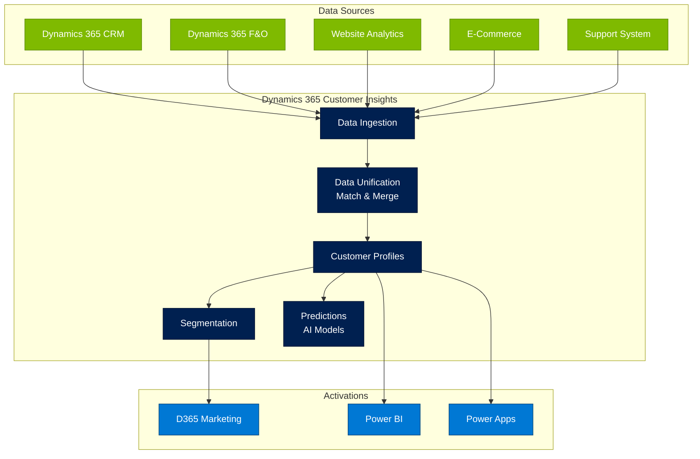

**Best Practices**:
- Start with key data sources (CRM, marketing, e-commerce)
- Define clear matching rules for customer identity resolution
- Build segments aligned to business use cases
- Use predictions for proactive engagement
- Activate segments in marketing and sales tools
- Measure impact on customer lifetime value

---

## Dataverse as the Foundation

### Why Dataverse Matters for Dynamics 365

Customer Engagement apps (Sales, Service, Marketing, Field Service) run on **Dataverse**:
- **Common data model**: Shared schema across apps
- **Business logic**: Shared business rules, workflows, plugins
- **Security**: Unified security model
- **Extensibility**: Power Platform native integration
- **APIs**: Single Web API for all apps

### Dynamics 365 Data Architecture

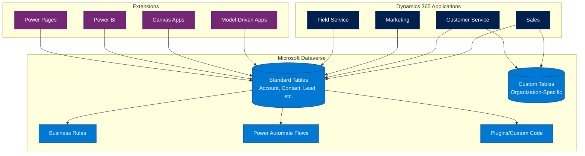

---

## Extensibility and Customization

### Extension Hierarchy (Preferred Approaches)

1. **Configuration** (No-code): Use out-of-box configuration
   - Custom fields, views, forms
   - Business rules
   - Business process flows

2. **Low-Code Extensions** (Power Platform):
   - Power Automate for workflows
   - Power Apps for custom screens
   - Power BI for analytics
   - Copilot Studio for chatbots

3. **Pro-Code Extensions** (Custom development):
   - Plugins (server-side code)
   - Custom APIs
   - Client-side scripts (JavaScript)
   - PCF controls (Power Apps Component Framework)

4. **Integration** (External systems):
   - Custom connectors
   - Azure Functions
   - Azure Logic Apps
   - API Management

**Best Practice**: Start at the top of the hierarchy and move down only when necessary.

---

## X++ Development for D365 Finance & Operations

### Overview

X++ is the programming language for Dynamics 365 Finance & Operations customization and extension. Development is done exclusively in Visual Studio with the Dynamics 365 development tools. X++ is used for F&O only; Customer Engagement apps (Sales, Service, Marketing, Field Service) use C# plugins and JavaScript web resources on Dataverse.

### Development Environment

- **IDE**: Visual Studio 2019+ with Dynamics 365 Finance and Operations development tools
- **Language**: X++ (object-oriented, SQL-integrated, .NET interoperable)
- **Project type**: Operations Project template in Visual Studio
- **Application Explorer**: Browse and interact with the model store elements (tables, classes, forms, data entities)
- **Cloud-hosted environments**: Development VMs provisioned through LCS (Lifecycle Services)

### Extension Model (Preferred over Overlayering)

D365 F&O uses an extension-based customization model. Overlayering (modifying base code directly) is deprecated and blocked in modern versions. All customizations must use extensions:

- **Table extensions**: Add fields, indexes, relations to existing tables
- **Class extensions** (Chain of Command): Wrap existing class methods with pre/post logic using `[ExtensionOf]` attribute
- **Form extensions**: Add controls, modify properties, add event handlers to existing forms
- **Data entity extensions**: Extend existing data entities with custom fields
- **Enum extensions**: Add new values to existing enumerations
- **Menu extensions**: Add menu items to existing menus
- **Security extensions**: Add new duties, privileges, and roles; extend existing security artifacts

### Key Development Patterns

- **Data entities**: OData-enabled data contracts for integration (create, read, update, delete). Data entities are the primary integration surface for F&O.
- **Business events**: Publish business events to external systems (Event Grid, Service Bus, Logic Apps). Custom business events extend the `BusinessEventsBase` class.
- **Number sequences**: Framework for auto-generated identifiers (invoice numbers, order numbers, etc.)
- **Batch framework**: Server-side batch processing for long-running operations. Batch jobs run on dedicated batch servers with retry and scheduling.
- **SysOperation framework**: Replacement for RunBase; provides asynchronous operations with UI. Use `SysOperationServiceController` for all new batch-capable operations.
- **Electronic reporting (ER)**: Configurable document generation (invoices, reports, regulatory filings). Business users can modify formats without developer involvement.
- **Feature management**: Toggle features on/off per environment. New functionality ships behind feature flags for controlled rollout.

### Build and Deployment

- **Build automation**: Azure DevOps pipelines with NuGet packages for model references
- **Deployable packages**: Build artifacts deployed to LCS (Lifecycle Services) for environment deployment
- **Environment tiers**: Dev (cloud-hosted) → Tier 2+ (sandbox with production-like data) → Production
- **ALM**: Azure DevOps for source control (TFVC or Git), work items, CI/CD pipelines
- **Automated testing**: SysTest framework for unit tests, RSAT (Regression Suite Automation Tool) for end-to-end acceptance tests
- **One Version**: Microsoft releases continuous updates; customizations must be extension-based to avoid blocking updates

### Integration Patterns

- **OData endpoints**: RESTful CRUD over data entities. Primary pattern for external system integration.
- **Custom services**: SOAP/REST custom service classes for complex operations beyond CRUD
- **Dual-write**: Real-time bidirectional sync between F&O and Dataverse/CE. Maps F&O tables to Dataverse tables with row-level sync.
- **Virtual entities**: Expose F&O data as virtual tables in Dataverse without data replication. Read-heavy scenarios.
- **Data management framework (DMF)**: Bulk import/export via data entities. Supports recurring integration jobs for scheduled data exchange.
- **Business events → Azure**: Event Grid, Service Bus, Logic Apps, Azure Functions. Publish domain events from F&O to trigger downstream processing.

### X++ Coding Standards

- Use extension model (Chain of Command); never overlayer base code
- Follow naming conventions: ISV prefix for all custom elements (e.g., `ContosoSalesOrderExt`)
- Use `SysOperation` for async operations, not `RunBase` (legacy)
- Use `EventHandlerResult` for pre/post event handlers
- Data entities: always expose through OData for integration; use staging tables for batch import
- Cross-references: use `DictTable`, `DictClass` for dynamic metadata access
- Security: privilege-duty-role model for authorization. Every menu item must have a privilege.
- Performance: use set-based operations (`insert_recordset`, `update_recordset`) over row-by-row processing
- Avoid direct SQL; use X++ query objects or LINQ-style syntax for data access

---

## Common Architecture Patterns

### Pattern 1: Unified Sales and Service

**Scenario**: Integrate sales and customer service for complete customer view

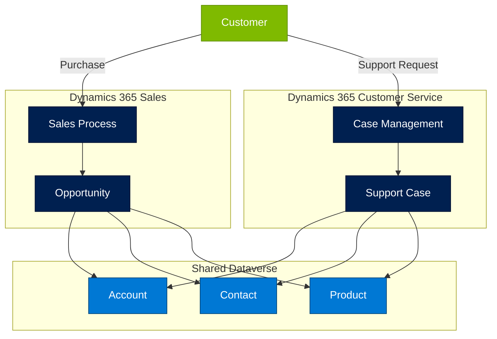

**Benefits**:
- Unified customer view across sales and service
- Service can see sales history (upsell opportunities)
- Sales can see support history (customer health)
- Shared product catalog

---

### Pattern 2: Field Service with IoT

**Scenario**: Predictive maintenance using IoT telemetry

Benefits covered in Field Service section above with architecture diagram.

---

### Pattern 3: Marketing to Sales Pipeline

**Scenario**: Marketing-qualified leads automatically passed to sales

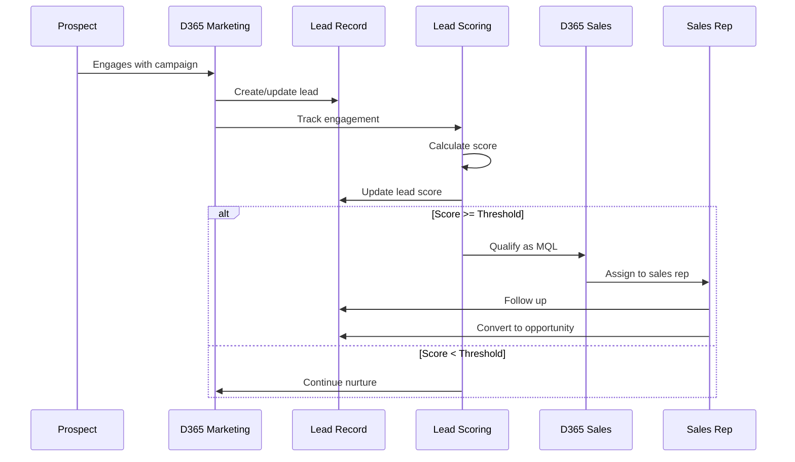

---

## Integration Patterns

### Dynamics 365 + Power Platform

**Native Integration**: Same underlying platform (Dataverse)

**Common Extensions**:
- Canvas Apps for mobile field scenarios
- Power Automate for complex approvals
- Power BI for advanced analytics
- Power Pages for customer/partner portals
- Copilot Studio for customer service chatbots

**Best Practices**:
- Leverage Dataverse connectors (no custom API needed)
- Use model-driven apps for form-heavy scenarios
- Use canvas apps for mobile and pixel-perfect UI
- Build portals on Power Pages for external users

---

### Dynamics 365 + Azure

**Common Scenarios**:
- Azure Data Lake for data warehousing
- Azure Functions for complex business logic
- Azure Logic Apps for enterprise integration
- Azure AI for advanced analytics and ML

**Integration Pattern**:
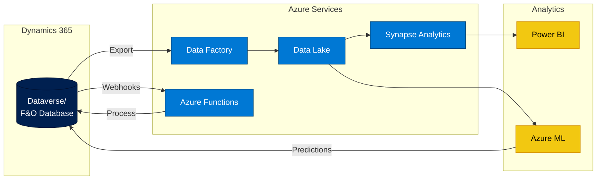

**Best Practices**:
- Use Dataverse export to data lake for analytics
- Use Azure Functions with managed identity authentication
- Implement retry logic for API calls
- Use Azure Key Vault for credential storage
- Monitor integration with Application Insights

---

### Dynamics 365 + Microsoft 365

**Built-in Integrations**:
- **Outlook**: Email tracking, appointments sync
- **Excel**: Export data, Excel templates
- **Teams**: Embedded apps, collaboration
- **SharePoint**: Document management

**Architecture Pattern**:
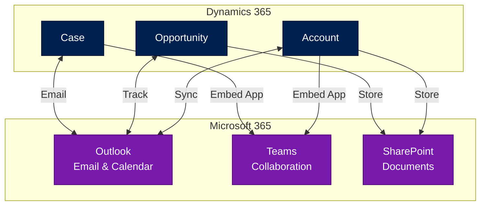

**Best Practices**:
- Use server-side sync for email/calendar
- Store large documents in SharePoint (not Dataverse)
- Embed model-driven apps in Teams for collaboration
- Use Microsoft Graph for advanced M365 integration

---

## Licensing Considerations

### Dynamics 365 Licensing Models

**Base Licenses** (full user):
- **Dynamics 365 Sales** Enterprise/Professional: $65-$95/user/month
- **Dynamics 365 Customer Service** Enterprise/Professional: $50-$95/user/month
- **Dynamics 365 Field Service**: $95/user/month
- **Dynamics 365 Finance**: ~$180/user/month
- **Dynamics 365 Supply Chain**: ~$180/user/month

**Team Member License**: Limited access across all apps (~$8/user/month)

**Bundles**:
- **Customer Engagement Bundle**: Sales + Service + Marketing
- **Unified Operations**: Finance + Supply Chain + Commerce

**Additional Capacity**:
- Dataverse database capacity
- Dataverse file capacity
- API request capacity
- Marketing contacts (for Dynamics 365 Marketing)

### Licensing Best Practices

- Use team member licenses for read-only users
- Bundle apps when multiple are needed
- Monitor Dataverse capacity usage
- Consider usage patterns (concurrent vs. named users)
- Factor in Power Platform for extensions (often included or discounted)

---

## Common Anti-Patterns to Avoid

### Anti-Pattern 1: Over-Customization

**Problem**: Excessive custom code making upgrades difficult

**Impact**: Technical debt, upgrade blockers, supportability issues

**Solution**: Leverage configuration and Power Platform; use custom code sparingly

---

### Anti-Pattern 2: Ignoring Data Model

**Problem**: Creating flat custom tables without relationships

**Impact**: Data integrity issues, reporting challenges, poor performance

**Solution**: Follow common data model, use relationships, normalize appropriately

---

### Anti-Pattern 3: Poor Integration Design

**Problem**: Synchronous, real-time integration causing performance issues

**Impact**: Slow user experience, timeout errors, data inconsistency

**Solution**: Use asynchronous patterns, queuing, dual-write only when needed

---

## When to Load This Reference

Load this reference when:
- Designing CRM or ERP solutions
- Evaluating Dynamics 365 for business requirements
- Planning Dynamics 365 implementation
- Integrating Dynamics 365 with other platforms
- Extending Dynamics 365 with Power Platform or Azure
- Architecting customer data platform solutions
- Keywords: "Dynamics 365", "CRM", "ERP", "Sales", "Service", "Field Service", "Finance", "Supply Chain", "Customer Insights", "customer data platform"

## Related References

- `/references/technology/core-platforms.md` - Platform selection guidance
- `/references/technology/power-platform-specifics.md` - Power Platform extensions
- `/references/technology/azure-specifics.md` - Azure integration patterns
- `/references/technology/m365-specifics.md` - Microsoft 365 integration
- `/references/frameworks/domain-driven-design.md` - DDD for business applications
- `/references/templates/mermaid-diagram-patterns.md` - Architecture diagrams

## Microsoft Resources

**Dynamics 365 Architecture**:
- Dynamics 365 Guidance: https://learn.microsoft.com/en-us/dynamics365/guidance/
- Implementation Guide: https://learn.microsoft.com/en-us/dynamics365/guidance/implementation-guide/overview
- Architecture: https://learn.microsoft.com/en-us/dynamics365/guidance/architecture/

**Application Documentation**:
- Dynamics 365 Sales: https://learn.microsoft.com/en-us/dynamics365/sales/
- Dynamics 365 Customer Service: https://learn.microsoft.com/en-us/dynamics365/customer-service/
- Dynamics 365 Marketing: https://learn.microsoft.com/en-us/dynamics365/marketing/
- Dynamics 365 Field Service: https://learn.microsoft.com/en-us/dynamics365/field-service/
- Dynamics 365 Finance: https://learn.microsoft.com/en-us/dynamics365/finance/
- Dynamics 365 Supply Chain: https://learn.microsoft.com/en-us/dynamics365/supply-chain/
- Dynamics 365 Customer Insights: https://learn.microsoft.com/en-us/dynamics365/customer-insights/

**Development**:
- Dataverse Developer Guide: https://learn.microsoft.com/en-us/power-apps/developer/data-platform/
- Dual-Write: https://learn.microsoft.com/en-us/dynamics365/fin-ops-core/dev-itpro/data-entities/dual-write/dual-write-home-page
- Virtual Tables: https://learn.microsoft.com/en-us/power-apps/developer/data-platform/virtual-entities/

**Licensing**:
- Dynamics 365 Licensing Guide: https://www.microsoft.com/en-us/licensing/product-licensing/dynamics365

---

*Dynamics 365 provides packaged business applications with deep integration across the Microsoft ecosystem. Understanding when to configure vs. customize, and how to extend with Power Platform and Azure, is key to successful implementations.*
