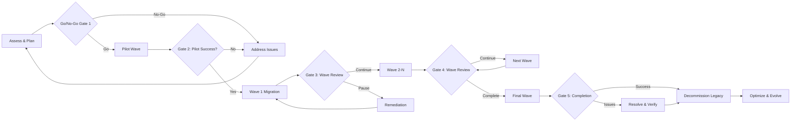
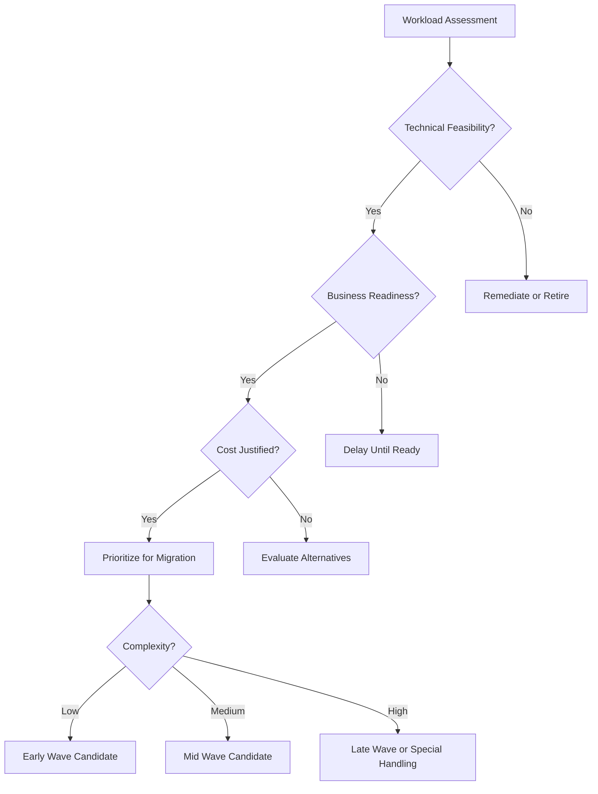
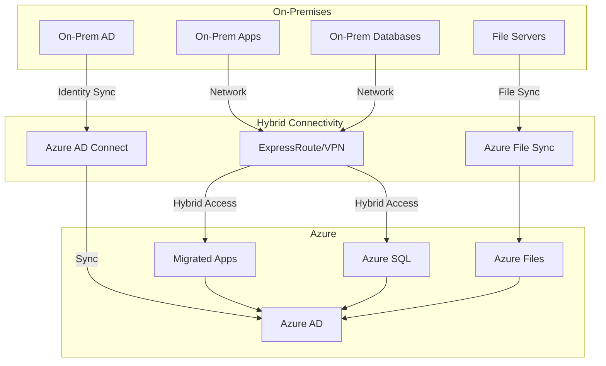
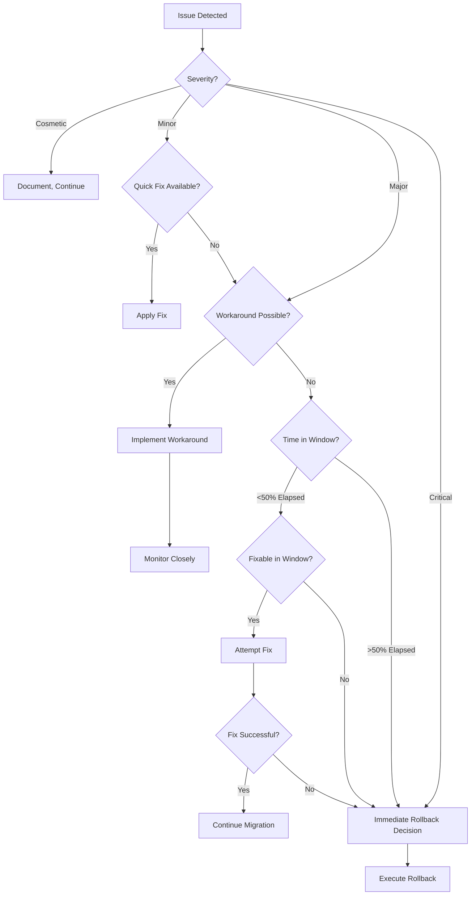
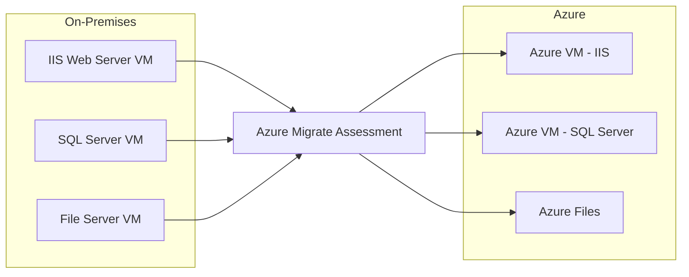
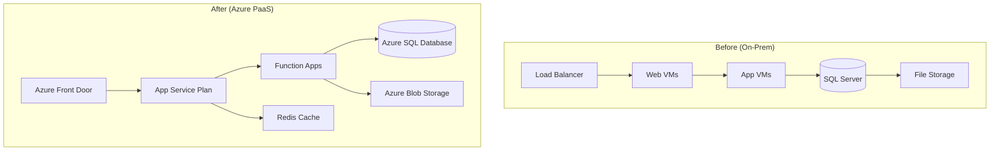
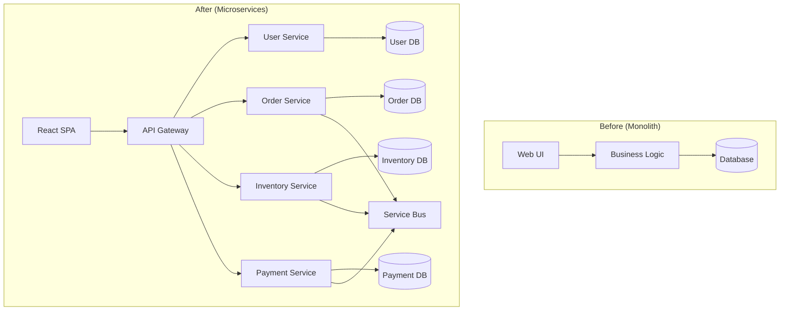

# Large-Scale Migrations

## Overview

Large-scale migrations represent transformational initiatives that reshape an organization's technology landscape. Whether migrating from on-premises infrastructure to cloud, transitioning between cloud platforms, or modernizing legacy applications, successful migrations require comprehensive planning, risk management, and disciplined execution. This reference provides enterprise architects with proven patterns, strategies, and decision frameworks for executing complex migrations using Microsoft's cloud platforms.

## Purpose of This Reference

This document helps enterprise architects:
- **Design phased migration approaches** with clear decision gates
- **Implement coexistence strategies** that minimize disruption during transitions
- **Mitigate risks** through proven approaches and contingency planning
- **Plan rollback procedures** for rapid recovery when needed
- **Develop comprehensive communication strategies** to manage organizational change
- **Select appropriate migration patterns** based on workload characteristics
- **Execute data migrations** with validation and quality assurance
- **Plan and execute cutover activities** with minimal business impact

## Phased Migration Plans with Decision Gates

### Migration Phase Framework

Large-scale migrations should follow a structured approach with clearly defined phases, deliverables, and decision gates. This framework aligns with the enterprise architecture 5-phase methodology while addressing migration-specific requirements.



### Phase 1: Assessment and Planning

**Objectives**:
- Discover and inventory existing environment
- Assess readiness for migration
- Identify dependencies and constraints
- Define success criteria and KPIs
- Develop detailed migration plan
- Secure stakeholder buy-in and funding

**Key Activities**:

**Discovery and Inventory**:
- **Infrastructure**: Servers, storage, network, databases
- **Applications**: Portfolio analysis, technical debt assessment
- **Data**: Volumes, types, sensitivity, quality
- **Integrations**: Dependencies between systems
- **Licenses**: Current licensing and entitlements
- **Users**: Personas, locations, usage patterns

**Tools for Discovery**:
- **Azure Migrate**: Agentless discovery for VMware, Hyper-V, physical servers
- **Data Migration Assistant (DMA)**: SQL Server assessment and compatibility
- **Storage Migration Service**: File server inventory and planning
- **App Service Migration Assistant**: Web app assessment
- **Microsoft 365 Migration tools**: Tenant and workload assessment
- **Azure Migrate appliance**: Dependency mapping and performance data

**Readiness Assessment**:



**Migration Wave Planning**:

**Wave Characteristics**:
- **Wave 0 (Pilot)**: 5-50 users, low-risk, IT-savvy, multiple scenarios
- **Wave 1**: 50-500 users, low complexity, early adopters
- **Wave 2-N**: 500-5,000 per wave, moderate complexity, phased rollout
- **Final Wave**: Remaining users, complex scenarios, stragglers

**Wave Selection Criteria**:
1. **Technical complexity**: Simple first, complex later (learn and improve)
2. **Business criticality**: Non-critical before mission-critical (reduce risk)
3. **Geographic location**: Minimize timezone impact, enable local support
4. **Organizational readiness**: Champions first, resistors later
5. **Dependencies**: Migrate dependencies together or in sequence

**Decision Gate 1: Proceed to Pilot**

**Gate Criteria**:
- [ ] Complete inventory of migration scope
- [ ] Wave plan defined with timeline
- [ ] Success criteria and KPIs established
- [ ] Budget and resources approved
- [ ] Risks identified with mitigation plans
- [ ] Stakeholder alignment achieved
- [ ] Technical prerequisites validated (network, identity, etc.)
- [ ] Rollback procedures documented

**Gate Participants**:
- Executive Sponsor
- Program Manager
- Enterprise Architect
- Infrastructure Lead
- Application Owner(s)
- Change Management Lead

**Go Decision**: Requires unanimous agreement or defined escalation

### Phase 2: Pilot Migration

**Objectives**:
- Validate migration procedures end-to-end
- Identify issues in controlled environment
- Refine documentation and runbooks
- Build team confidence and capability
- Demonstrate success to stakeholders

**Pilot Scope Definition**:

**Infrastructure Pilot**:
- 5-10 servers representing different OS versions
- Mix of physical and virtual
- Representative database configurations
- Sample applications with dependencies
- Include monitoring and management tooling

**Application Pilot**:
- 1-3 applications with different architectures
- Include simple and moderately complex scenarios
- Test integration points
- Validate performance requirements
- Confirm backup and recovery procedures

**User Pilot (Microsoft 365, Dynamics)**:
- 25-100 users from diverse roles
- Include executives, IT staff, and end users
- Multiple departments represented
- Range of technical proficiency
- Include mobile device users

**Pilot Execution Framework**:

**Pre-Migration**:
1. Configure target environment
2. Set up migration tooling
3. Create user accounts and licenses
4. Establish connectivity (ExpressRoute, VPN)
5. Configure monitoring and logging
6. Brief pilot participants
7. Document baseline metrics (performance, user satisfaction)

**Migration**:
1. Execute migration runbook step-by-step
2. Document actual times vs. estimates
3. Capture issues and resolutions
4. Validate data integrity
5. Test functionality and integrations
6. Monitor performance and errors

**Post-Migration**:
1. Survey pilot users
2. Analyze telemetry and logs
3. Document lessons learned
4. Update runbooks and procedures
5. Calculate actual costs vs. estimates
6. Refine wave plans based on learnings

**Decision Gate 2: Proceed to Wave 1**

**Gate Criteria**:
- [ ] Pilot migration >90% successful
- [ ] Critical issues resolved or mitigated
- [ ] User satisfaction score >7/10
- [ ] Performance meets requirements
- [ ] Data validation successful
- [ ] Rollback tested successfully
- [ ] Team trained and confident
- [ ] Updated estimates for subsequent waves
- [ ] Stakeholders approve continuation

**Pilot Failure Scenarios**:
- **Major technical blockers**: Return to planning, redesign approach
- **Unacceptable user impact**: Enhance training, communication, support
- **Cost overruns**: Re-evaluate business case, optimize, or descope
- **Performance issues**: Remediate sizing, configuration, or design

### Phase 3: Wave Migrations

**Wave Execution Cadence**:

**Typical Schedule**:
- Wave planning: 2 weeks before wave start
- Pre-migration setup: 1 week before
- Migration window: Weekend or off-hours
- Stabilization: 1 week post-migration
- Review and adjust: 1 week
- Next wave planning: Overlaps with previous wave stabilization

**Wave Rhythm Example (Monthly Waves)**:
```
Week 1-2: Wave N planning and preparation
Week 3: Wave N pre-migration activities
Week 4: Wave N migration execution (weekend)
Week 4+1: Wave N stabilization and support
Week 4+2: Wave N review and Wave N+1 planning begins
```

**Pre-Migration Activities (Every Wave)**:

**Technical Preparation**:
- [ ] Provision target infrastructure
- [ ] Create user accounts and assign licenses
- [ ] Configure security policies and access controls
- [ ] Set up monitoring and alerting
- [ ] Test connectivity and integrations
- [ ] Stage migration tooling and scripts
- [ ] Verify backup completion
- [ ] Document wave-specific configurations

**Communication**:
- [ ] T-14 days: Initial notification to wave participants
- [ ] T-7 days: Detailed migration guide and training resources
- [ ] T-3 days: Reminder with timeline and support contacts
- [ ] T-1 day: Final confirmation and readiness check
- [ ] T-0: Migration day communication (what to expect)
- [ ] T+1: Post-migration status and support resources

**Migration Execution**:

**Cutover Sequence** (Example: Infrastructure Migration):
1. **Friday evening**: Freeze changes, final backup
2. **Saturday 00:00**: Begin replication/migration
3. **Saturday 08:00**: Validate data integrity
4. **Saturday 10:00**: Configure networking and DNS
5. **Saturday 12:00**: Application smoke tests
6. **Saturday 14:00**: Integration validation
7. **Saturday 16:00**: Performance validation
8. **Saturday 18:00**: Go/No-Go decision for Monday
9. **Saturday 18:00-Sunday**: Contingency time or rollback if needed
10. **Monday 06:00**: Users begin using new environment

**Migration Validation Checklist**:
- [ ] All systems/users migrated per plan
- [ ] Data integrity validated (checksums, record counts)
- [ ] Applications functional (smoke tests passed)
- [ ] Integrations working (end-to-end tests)
- [ ] Performance acceptable (response times within SLA)
- [ ] Security controls active (access, encryption, logging)
- [ ] Monitoring operational (alerts configured)
- [ ] Backup/DR configured and tested
- [ ] User access verified (sample logins)
- [ ] Support team ready (extended hours scheduled)

**Decision Gate 3: Continue to Next Wave**

**Gate Criteria**:
- [ ] Wave migration >95% successful
- [ ] Critical issues resolved within 72 hours
- [ ] No showstopper defects outstanding
- [ ] User satisfaction trend positive
- [ ] Support ticket volume within capacity
- [ ] Performance metrics within acceptable range
- [ ] Timeline and budget on track
- [ ] Lessons learned documented and incorporated

**Pause Scenarios**:
- **Significant issues affecting user productivity**: Pause to remediate
- **Pattern of similar failures across waves**: Address root cause
- **Support team overwhelmed**: Reduce wave size or increase interval
- **Budget exhaustion**: Secure additional funding or descope
- **External factors**: Business events, holidays, outages

### Phase 4: Final Wave and Completion

**Final Wave Characteristics**:
- Typically smaller than mid-waves
- Contains edge cases and complex scenarios
- Includes stragglers from previous waves
- May require custom handling
- Higher touch support

**Long-Tail Management**:

**Stragglers**: Users/systems not migrated in planned wave
- Document reason for delay
- Create remediation plan
- Set firm deadline for completion
- Escalate if blocking business needs

**Exceptions**: Legitimate reasons for exclusion
- Document exception and business justification
- Define alternative approach (e.g., remain on-premises)
- Set review date for re-evaluation
- Ensure supported and secure

**Decision Gate 5: Declare Migration Complete**

**Completion Criteria**:
- [ ] >98% of planned scope migrated successfully
- [ ] Remaining items documented with plans
- [ ] All critical and high-severity issues resolved
- [ ] User satisfaction targets met
- [ ] Performance and reliability targets met
- [ ] Documentation complete and current
- [ ] Support model transitioned to BAU
- [ ] Legacy environment ready for decommissioning
- [ ] Business sign-off obtained

### Phase 5: Decommission and Optimize

**Decommissioning Legacy Environment**:

**Decommission Timeline**:
- **0-30 days post-migration**: Keep legacy environment running (safety net)
- **30-90 days**: Read-only mode for reference
- **90-180 days**: Archive critical data, shut down services
- **180+ days**: Final data archive, hardware disposal/return

**Decommission Activities**:
- [ ] Export final audit logs and compliance data
- [ ] Archive business-critical historical data
- [ ] Document asset disposal/return process
- [ ] Revoke access to legacy environment
- [ ] Cancel legacy software licenses
- [ ] Terminate infrastructure leases/contracts
- [ ] Update disaster recovery plans
- [ ] Update network diagrams and documentation
- [ ] Recognize and celebrate team success

**Optimization Phase** (See phase-evolve.md):
- Right-size resources based on actual usage
- Optimize costs (reserved instances, scaling policies)
- Enhance security posture
- Improve operational procedures
- Collect lessons learned for future migrations

## Coexistence Strategies for Transition Periods

### Hybrid Infrastructure Coexistence

**Coexistence Patterns**:

**Pattern 1: Parallel Running**
- Both old and new environments fully operational
- Users/workloads gradually shifted
- Highest cost (running both)
- Lowest risk (easy rollback)
- Suitable for critical systems requiring extensive validation

**Pattern 2: Shared Services**
- Core services migrate first (identity, network)
- Applications gradually migrate
- Moderate cost and risk
- Enables phased approach
- Requires strong integration layer

**Pattern 3: Burst to Cloud**
- On-premises remains primary
- Cloud used for overflow capacity
- Lower initial cost
- Good for pilot and learning
- Can evolve to full cloud

**Hybrid Identity**:

**Azure AD Connect**:
- Synchronizes on-premises AD to Azure AD
- Password Hash Synchronization (PHS): Cloud authentication with sync'd hashes
- Pass-Through Authentication (PTA): On-premises authentication via agents
- Federation (ADFS): On-premises STS for authentication

**Recommendation for Migrations**:
- Start with PHS for simplicity and resilience
- Transition to cloud-only authentication post-migration
- Enable Seamless SSO for transparent experience
- Plan for certificate renewals and agent updates

**Hybrid Networking**:

**Connectivity Options**:

**Site-to-Site VPN**:
- Quick to establish (hours to days)
- Lower cost ($0.04-0.15/hour per gateway)
- Variable performance (shared internet)
- Bandwidth up to 10 Gbps (with multiple tunnels)
- Suitable for non-production, pilot, or low-bandwidth scenarios

**Azure ExpressRoute**:
- Dedicated private connection (not over internet)
- Predictable performance and lower latency
- Higher cost ($50-15,000+/month depending on bandwidth)
- 50 Mbps to 100 Gbps options
- Required for production enterprise migrations
- Setup time: 30-90 days (provisioning with carrier)

**Coexistence Architecture**:



### Database Coexistence

**Database Migration Approaches**:

**Online Migration (Continuous Replication)**:
- Replicate from source to target continuously
- Minimal downtime cutover (seconds to minutes)
- Higher complexity and cost
- Suitable for 24/7 critical databases

**Tools**:
- **Azure Database Migration Service (DMS)**: SQL Server, MySQL, PostgreSQL, MongoDB
- **SQL Server transactional replication**: Legacy to Azure SQL
- **Oracle GoldenGate**: Oracle to Azure or Postgres
- **AWS Database Migration Service**: Cross-cloud migrations

**Offline Migration (Backup/Restore)**:
- Backup from source, restore to target
- Downtime during transfer and restore (hours to days)
- Simpler process, lower cost
- Suitable for databases with acceptable downtime windows

**Hybrid Database Scenarios**:

**Scenario 1: Distributed Transactions**
- Some applications migrated, some remain on-premises
- Both need to update same database
- Challenge: Maintaining consistency across environments

**Solutions**:
- **Database in cloud, apps hybrid**: Use ExpressRoute for low latency
- **Distributed transactions**: Azure SQL Managed Instance supports distributed transactions
- **Event-driven eventual consistency**: Event Grid/Service Bus for async updates
- **API-based coordination**: Avoid distributed transactions, use compensating transactions

**Scenario 2: Reporting During Migration**
- Operational database migrating to cloud
- Reporting/analytics remain on-premises temporarily

**Solutions**:
- Set up replication from Azure to on-prem (reverse sync)
- Use Azure Synapse Link for real-time analytics
- Export data periodically to on-premises
- Transition reporting to Power BI cloud

### Application Coexistence

**API Versioning During Migration**:

**Challenge**: Old and new versions of application coexist

**Strategies**:
1. **URL-based versioning**: `/api/v1/` and `/api/v2/`
2. **Header-based versioning**: `Accept: application/vnd.company.v2+json`
3. **Azure API Management**: Route to old or new backend based on version
4. **Feature flags**: Same codebase, toggle features for migrated users

**Load Balancing Across Environments**:

**Azure Traffic Manager**:
- DNS-based routing to on-prem or cloud
- Weighted routing for gradual shift (10% cloud, 90% on-prem → 100% cloud)
- Geographic routing (region A to cloud, region B to on-prem)
- Priority routing (primary cloud, failover on-prem or vice versa)

**Example Gradual Shift**:
```
Week 1: 5% traffic to Azure, 95% on-prem
Week 2: 15% traffic to Azure, 85% on-prem
Week 3: 30% traffic to Azure, 70% on-prem
Week 4: 50% traffic to Azure, 50% on-prem
Week 5: 75% traffic to Azure, 25% on-prem
Week 6: 100% traffic to Azure, decommission on-prem
```

**Session Affinity Considerations**:
- Use sticky sessions during transition
- Store session state in Redis (accessible from both)
- Avoid server-side session state if possible
- Plan for users switching between environments

## Risk Mitigation Approaches

### Risk Identification and Assessment

**Common Migration Risks**:

| Risk Category | Specific Risks | Probability | Impact | Mitigation Priority |
|---------------|----------------|-------------|---------|---------------------|
| **Technical** | Data loss during migration | Medium | Critical | High |
| **Technical** | Performance degradation | High | High | High |
| **Technical** | Integration failures | Medium | High | High |
| **Technical** | Security vulnerabilities | Low | Critical | High |
| **Operational** | Extended downtime | Medium | High | High |
| **Operational** | Support team unready | Medium | Medium | Medium |
| **Business** | User resistance | High | Medium | Medium |
| **Business** | Budget overrun | Medium | Medium | Medium |
| **Compliance** | Regulatory violation | Low | Critical | High |
| **Vendor** | Migration tool limitations | Medium | Medium | Low |

### Risk Mitigation Strategies

**Data Loss Prevention**:

**Mitigation Measures**:
1. **Multiple backups**: Before, during, and after migration
2. **Validation at each stage**: Checksums, record counts, data sampling
3. **Read-only period**: Freeze source before cutover
4. **Parallel running**: Keep old system until validation complete
5. **Incremental migration**: Sync changes multiple times before cutover

**Validation Framework**:
```sql
-- Pre-migration baseline
SELECT COUNT(*) as RecordCount,
       CHECKSUM_AGG(CHECKSUM(*)) as DataChecksum
FROM SourceTable;

-- Post-migration validation
SELECT COUNT(*) as RecordCount,
       CHECKSUM_AGG(CHECKSUM(*)) as DataChecksum
FROM TargetTable;

-- Compare results - must match exactly
```

**Performance Risk Mitigation**:

**Pre-Migration Performance Baseline**:
- Document current response times (p50, p95, p99)
- Identify performance-critical transactions
- Capture peak load characteristics
- Document user experience metrics

**Performance Testing in Target Environment**:
- **Load testing**: Simulate normal load, validate response times
- **Stress testing**: Push beyond expected load, find breaking point
- **Soak testing**: Run at normal load for extended period (24-48 hours)
- **Spike testing**: Sudden traffic increases

**Performance Issue Remediation**:
- Right-size Azure resources (scale up if needed)
- Optimize database indexes and queries
- Implement caching strategies (Azure Cache for Redis)
- Use CDN for static content
- Optimize network routing (ExpressRoute, peering)

**Integration Failure Mitigation**:

**Pre-Migration Integration Mapping**:
- Document all integration points
- Identify synchronous vs. asynchronous
- Determine impact of integration failure
- Design fallback mechanisms

**Integration Testing Approach**:
1. **Unit tests**: Individual components
2. **Integration tests**: Component interactions
3. **End-to-end tests**: Complete business processes
4. **Failure scenario tests**: What happens when integration fails?

**Circuit Breaker Pattern**:
```csharp
// Pseudo-code for circuit breaker
if (circuitBreakerOpen) {
    return fallbackResponse;
}

try {
    var response = await CallDownstreamService();
    ResetCircuitBreaker();
    return response;
}
catch (Exception ex) {
    IncrementFailureCount();
    if (failureCount > threshold) {
        OpenCircuitBreaker();
    }
    return fallbackResponse;
}
```

**Extended Downtime Mitigation**:

**Minimize Downtime Strategies**:
1. **Pre-stage as much as possible**: Infrastructure, accounts, configuration
2. **Incremental data sync**: Sync bulk data days before, delta sync during cutover
3. **Parallel execution**: Multiple teams working simultaneously on independent tasks
4. **Automation**: Scripts and runbooks to eliminate manual errors and speed execution
5. **Rehearsal**: Practice cutover in non-production environment

**Downtime Communication**:
- Announce maintenance window well in advance (30+ days)
- Provide progress updates during window
- Establish clear go/no-go decision points
- Communicate extension immediately if needed

## Rollback Procedures

### Rollback Strategy Design

**Rollback Decision Framework**:



**Rollback Decision Criteria**:

**Automatic Rollback Triggers**:
- Data loss detected
- Security breach or vulnerability
- Complete service unavailability >30 minutes
- Critical business process failure

**Escalated Rollback Decision**:
- Performance degradation >50%
- Partial service availability
- Workarounds available but suboptimal
- >25% of users affected
- Costs significantly exceeding budget

**Rollback Procedure Components**:

**Technical Rollback Steps**:

**Infrastructure Migration Rollback**:
1. Switch DNS/traffic routing back to source
2. Verify source environment operational
3. Restore any data modified during migration
4. Disable target environment (prevent confusion)
5. Document rollback reason and timeline
6. Communicate to all stakeholders
7. Schedule post-mortem

**Application Migration Rollback**:
1. Redirect load balancer to old version
2. Stop new version to prevent state issues
3. Verify old version handling traffic
4. Check database state (may need rollback or forward migration)
5. Clear caches if necessary
6. Monitor for residual issues

**Data Migration Rollback**:
1. **If database migrated**: Restore from backup
2. **If synchronization active**: Stop sync, keep using source
3. **If incremental sync**: Replay transactions since migration start
4. **If data modified in target**: Complex - may need to preserve and merge

**Rollback Challenges**:

**Data Synchronization**:
- **Challenge**: Data modified in both old and new during coexistence
- **Solution**: Maintain synchronization mechanism, designate source of truth

**User Confusion**:
- **Challenge**: Users accessed new environment, now reverted to old
- **Solution**: Clear communication, may need to export user actions from new and replay in old

**Dependency Complexity**:
- **Challenge**: Some components migrated, some rolled back
- **Solution**: Define atomic rollback units, rollback all or none

**Time Constraints**:
- **Challenge**: Rollback takes time, extends outage
- **Solution**: Practice rollback procedure, automate where possible, factor rollback time into window planning

## Comprehensive User Communication Plans

### Communication Strategy Framework

**Communication Principles**:
1. **Early and often**: Communicate before users need to know
2. **Multi-channel**: Email, intranet, Teams, town halls, posters
3. **Audience-appropriate**: Executives need different info than end users
4. **Two-way**: Provide feedback channels
5. **Consistent**: Avoid conflicting messages
6. **Honest**: Acknowledge challenges, don't overpromise

### Communication Plan Components

**Stakeholder Communication Matrix**:

| Audience | Information Needs | Frequency | Channels | Owner |
|----------|------------------|-----------|----------|-------|
| **Executives** | Business impact, timeline, budget, risks | Monthly | Executive briefing, email | Program Manager |
| **Business Unit Leaders** | Department impact, schedule, change impacts | Bi-weekly | Email, 1:1 meetings | Change Manager |
| **IT Staff** | Technical details, responsibilities, timeline | Weekly | Email, Teams, meetings | Technical Lead |
| **End Users** | What's changing, when, how to prepare, support | Bi-weekly, daily near cutover | Email, intranet, Teams | Change Manager |
| **Help Desk** | Anticipated issues, escalation, FAQs | Weekly, daily during migration | Email, knowledge base | Support Manager |

**Communication Timeline**:

**T-90 Days: Initial Announcement**
- Migration initiative kicked off
- High-level timeline and goals
- Benefits and rationale
- How to stay informed

**T-60 Days: Detailed Planning Shared**
- Wave assignments announced
- Detailed timeline per wave
- Training resources available
- FAQ published

**T-30 Days: Preparation Begins**
- Wave-specific communications
- Required actions (if any)
- Training schedule
- Change champions identified

**T-14 Days: Final Preparation**
- Detailed migration day timeline
- What to expect before, during, after
- Support resources and contacts
- Known issues and workarounds

**T-3 Days: Final Reminder**
- Countdown communication
- Last chance for questions
- Verify readiness
- Support team extended hours announced

**T-0 (Migration Day): Real-Time Updates**
- Morning: Migration underway
- Midday: Progress update
- Evening: Status (on track, delayed, issues)
- Next morning: Go-live confirmation or delay notice

**T+1 to T+7 (First Week): Intensive Support**
- Daily status emails
- Quick wins and successes highlighted
- Issues being addressed acknowledged
- Support resources reminder

**T+30 Days: First Month Retrospective**
- Lessons learned shared
- User feedback summary
- Improvements made
- Next wave preview

**Communication Channels**:

**Email**:
- Formal announcements
- Detailed information
- Reference documentation
- Archival record

**Intranet/SharePoint**:
- Central information hub
- FAQ (updated regularly)
- Training videos and guides
- Timeline and wave schedules
- Feedback form

**Microsoft Teams**:
- Migration Q&A channel
- Real-time updates during migration
- Community support (users helping users)
- Quick polls and feedback

**Town Halls / Webinars**:
- Executive presence and commitment
- Q&A sessions
- Success stories
- Major milestone celebrations

**Posters / Digital Signage**:
- High-traffic areas (cafeteria, lobby)
- Visual reminders
- Key dates and contacts
- QR codes to resources

### Change Management Program

**Change Champions Network**:

**Champion Selection**:
- 1 champion per 50-100 users
- Respected by peers
- Tech-savvy and enthusiastic
- Diverse representation (roles, locations, demographics)
- Volunteers preferred over assigned

**Champion Responsibilities**:
- Attend champion training sessions
- Share information within their group
- Collect feedback and concerns
- Provide informal support
- Report issues to migration team
- Celebrate successes

**Champion Benefits**:
- Early access to new environment
- Special training and resources
- Recognition (certificate, LinkedIn badge, appreciation event)
- Networking with leadership and peers

**Training Program**:

**Training Modalities**:
1. **Self-paced e-learning**: Videos, interactive guides, available 24/7
2. **Virtual instructor-led**: Live sessions with Q&A, recorded for replay
3. **In-person workshops**: Hands-on practice, for complex scenarios or executives
4. **Office hours**: Drop-in sessions for questions
5. **Quick reference cards**: One-page guides for common tasks
6. **Contextual help**: In-app guidance and tooltips

**Training Content**:
- **What's different**: Side-by-side comparison of old vs. new
- **How to do common tasks**: Step-by-step guides
- **Troubleshooting**: Common issues and solutions
- **Where to get help**: Support resources and contacts
- **Best practices**: Tips for productivity and security

**Measuring Training Effectiveness**:
- Completion rates (target >80%)
- Assessment scores (target >75%)
- User confidence surveys (pre/post training)
- Support ticket volume (lower post-training)
- User satisfaction with training (target >7/10)

### Support Model During Migration

**Support Tiers**:

**Tier 0: Self-Service**
- FAQ and knowledge base
- Training videos
- Automated chatbot
- Community forums (Teams)

**Tier 1: Help Desk**
- Password resets
- Access issues
- Basic how-to questions
- Ticket creation for complex issues
- Extended hours during migration (6am-10pm vs. normal 8am-6pm)

**Tier 2: Application Support**
- Application-specific issues
- Integration problems
- Performance concerns
- Configuration changes

**Tier 3: Engineering Escalation**
- Critical bugs
- Architecture issues
- Vendor engagement
- Hotfixes and patches

**Migration War Room**:
- Dedicated space (physical or virtual Teams room)
- Representatives from all teams
- Real-time issue triage
- Executive sponsor availability for decisions
- Active during migration window and first week post-migration

## Migration Patterns

### Pattern 1: Lift and Shift (Rehost)

**Description**: Migrate applications to cloud with minimal or no changes. Virtual machines and configurations moved as-is to Azure.

**When to Use**:
- Tight timeline (quickest migration path)
- Skills gap (team unfamiliar with cloud-native)
- Legacy applications (no source code or vendor support)
- Temporary solution before modernization
- Low-risk approach for initial cloud experience

**Microsoft Tools**:
- Azure Migrate for assessment and replication
- Azure Site Recovery for VM replication
- Storage Migration Service for file servers
- Database Migration Service for SQL Server

**Example: On-Prem IIS App to Azure VMs**:


**Advantages**:
- Fast migration (weeks vs. months)
- Minimal application risk
- Familiar management model
- Immediate cost benefits (no hardware refresh)

**Disadvantages**:
- Not optimized for cloud (higher ongoing costs)
- Missed cloud-native benefits (scalability, managed services)
- License implications (bring your own license)
- Technical debt carried forward

**Post-Migration Optimization**:
- Right-size VMs based on actual usage
- Migrate to Azure SQL Database (PaaS) when ready
- Implement auto-scaling
- Transition to managed disks with appropriate tier

### Pattern 2: Refactor (Replatform)

**Description**: Migrate with minor modifications to take advantage of cloud capabilities without full re-architecture. Move to platform-as-a-service (PaaS) where possible.

**When to Use**:
- Moderate timeline (balanced speed and optimization)
- Applications suitable for PaaS (web apps, databases)
- Want cloud benefits without full rewrite
- Reduce operational burden (managed services)

**Migration Path Examples**:

**Web Application Refactor**:
```
On-Prem IIS → Azure App Service
Benefits:
- Auto-scaling
- Deployment slots (blue/green)
- Built-in load balancing
- Managed patching and updates
- Integration with Azure AD
```

**Database Refactor**:
```
On-Prem SQL Server → Azure SQL Database
Benefits:
- Automated backups
- Built-in high availability
- Elastic scale
- Advanced threat protection
- Automated tuning
```

**File Server Refactor**:
```
On-Prem File Server → SharePoint Online or Azure Files
Benefits:
- Unlimited storage
- Built-in collaboration features
- Mobile access
- Advanced search
- Version history and retention
```

**Code Changes Required**:
- Connection strings (point to Azure services)
- Authentication (integrate Azure AD)
- Configuration (use Azure App Configuration or Key Vault)
- Logging (use Application Insights)
- Session state (use Redis Cache instead of in-memory)

**Example: Three-Tier App Refactor**:



**Advantages**:
- Lower TCO than IaaS (no VM management)
- Better scalability and performance
- Improved security (managed service hardening)
- Faster time to market for new features

**Disadvantages**:
- Requires code changes (testing needed)
- Longer timeline than lift-and-shift
- May hit PaaS limitations (customization constraints)
- Team learning curve for PaaS services

### Pattern 3: Rearchitect (Redesign for Cloud-Native)

**Description**: Redesign applications to be cloud-native, leveraging microservices, containers, serverless, and other modern patterns.

**When to Use**:
- Long-term modernization initiative
- Monolithic application causing issues
- Need dramatic scalability improvements
- Want to adopt DevOps and continuous delivery
- Strategic application requiring investment

**Cloud-Native Patterns**:

**Microservices Architecture**:
- Break monolith into independent services
- Each service owns its data
- Services communicate via APIs (REST, gRPC, messaging)
- Independent deployment and scaling
- Technology diversity (choose best tool per service)

**Containerization**:
- Package applications in containers (Docker)
- Orchestrate with Kubernetes (Azure Kubernetes Service)
- Infrastructure as code (Bicep, Terraform)
- CI/CD pipelines (Azure DevOps, GitHub Actions)

**Serverless**:
- Event-driven architecture (Azure Functions, Logic Apps)
- Pay per execution (vs. always-on VMs)
- Auto-scale to zero (cost optimization)
- Integrate with Event Grid, Service Bus, Event Hubs

**Example: Monolith to Microservices**:



**Migration Strategy**:
- **Strangler Fig Pattern**: Gradually replace monolith pieces
- **Start with new features**: Build new capabilities as microservices
- **Extract bounded contexts**: Identify natural service boundaries (domain-driven design)
- **API Gateway**: Route requests to old or new services
- **Event-driven integration**: Decouple services with messaging

**Advantages**:
- Maximum cloud benefits (scale, resilience, cost efficiency)
- Modern development practices (DevOps, CI/CD)
- Technology flexibility
- Improved team agility (independent teams per service)

**Disadvantages**:
- Highest complexity and cost
- Longest timeline (months to years)
- Requires significant skills (distributed systems, containers, DevOps)
- Operational complexity (monitoring, debugging distributed systems)

### Pattern 4: Rebuild (Greenfield Replacement)

**Description**: Rebuild application from scratch using modern technologies and cloud services. Discard legacy codebase entirely.

**When to Use**:
- Legacy application beyond salvage
- Business requirements dramatically changed
- Technology obsolete (no vendor support, security risk)
- Cost of maintaining exceeds rebuild cost
- Opportunity to fundamentally rethink solution

**Build vs. Buy Decision**:
- **Consider SaaS alternatives**: Microsoft 365, Dynamics 365, third-party SaaS
- **Custom build only if**: Unique business requirements, competitive differentiator
- **Low-code platforms**: Power Platform for rapid development
- **Hybrid**: SaaS core + custom extensions

**Rebuild Approach**:
1. **Capture requirements** from business (not from old app)
2. **Design modern architecture** (cloud-native, microservices, etc.)
3. **Build iteratively** (MVP then expand)
4. **Run in parallel** with legacy during transition
5. **Migrate data** at cutover
6. **Decommission legacy** once validated

**Example: Legacy Desktop App to Modern Web/Mobile**:
```
Before: VB6 Desktop App + Access Database
After: React Web App + React Native Mobile + Azure SQL + Azure Functions
```

**Advantages**:
- Clean slate (no technical debt)
- Modern user experience
- Cloud-native from start
- Remove unnecessary features (simplify)

**Disadvantages**:
- Highest risk (completely new codebase)
- Longest timeline
- Highest cost
- Requires full testing and validation
- User retraining on new interface

## Data Migration Strategies

### Data Migration Patterns

**Pattern 1: Big Bang Migration**:
- Migrate all data in single cutover event
- Suitable for smaller datasets (<1 TB)
- Higher risk but simpler process
- Requires maintenance window

**Pattern 2: Phased Data Migration**:
- Migrate data in stages (by entity, date range, geography)
- Suitable for very large datasets
- Lower risk per phase
- Longer overall timeline
- Requires data synchronization between phases

**Pattern 3: Trickle Migration**:
- Gradually migrate data over time
- New data goes to new system
- Old data migrated in background
- Suitable for applications with clear cutoff (e.g., financial year)

**Pattern 4: Sync and Cutover**:
- Initial bulk migration (while source active)
- Continuous sync of changes
- Final cutover with minimal downtime
- Suitable for large datasets with minimal acceptable downtime

### ETL (Extract, Transform, Load)

**Extract Phase**:
- **Full extraction**: All data from source (initial load)
- **Incremental extraction**: Only changes since last extraction (ongoing sync)
- **Change Data Capture (CDC)**: Database native tracking of changes
- **Tools**: Azure Data Factory, SQL Server Integration Services (SSIS), custom scripts

**Transform Phase**:
- **Data cleansing**: Remove duplicates, correct errors
- **Format conversion**: Date formats, character encoding
- **Schema mapping**: Source structure to target structure
- **Business logic**: Calculations, derivations
- **Data enrichment**: Add missing information from other sources

**Load Phase**:
- **Full load**: Replace target data entirely
- **Incremental load**: Append new/changed records
- **Upsert**: Insert new, update existing
- **Parallel load**: Multiple threads for performance
- **Batch processing**: Large datasets in chunks

### Data Validation and Quality Assurance

**Validation Levels**:

**Level 1: Count Validation**:
```sql
-- Simple record count comparison
SELECT 'Source' as Location, COUNT(*) as RecordCount FROM SourceDB.dbo.Customers
UNION ALL
SELECT 'Target' as Location, COUNT(*) as RecordCount FROM TargetDB.dbo.Customers;
```

**Level 2: Checksum Validation**:
```sql
-- Data integrity check
SELECT CHECKSUM_AGG(CHECKSUM(*)) as DataChecksum FROM SourceDB.dbo.Customers;
SELECT CHECKSUM_AGG(CHECKSUM(*)) as DataChecksum FROM TargetDB.dbo.Customers;
```

**Level 3: Sampling Validation**:
- Select random sample (e.g., 1% of records)
- Compare field-by-field
- Identify patterns in discrepancies
- Investigate and correct

**Level 4: Business Logic Validation**:
- Run reports from both systems
- Compare business metrics (totals, averages, counts)
- Execute key queries and compare results
- Validate referential integrity

**Data Quality Metrics**:
- **Completeness**: % of fields populated
- **Accuracy**: % of records matching expected values
- **Consistency**: % of records consistent across related tables
- **Timeliness**: Data current as of expected time
- **Validity**: Data conforms to business rules

### Cutover Planning and Execution

**Cutover Preparation**:

**Pre-Cutover Checklist** (1 Week Before):
- [ ] Final cutover plan reviewed and approved
- [ ] All teams trained on cutover procedures
- [ ] Rollback procedures documented and tested
- [ ] Success criteria defined and agreed
- [ ] Communication templates prepared
- [ ] Support team schedules confirmed
- [ ] Monitoring and alerting configured
- [ ] Final backup of source systems completed

**Cutover Day Preparation** (Day Before):
- [ ] Final sync of data executed
- [ ] Validation of sync results (counts, checksums)
- [ ] War room setup (physical or virtual)
- [ ] Communication sent to all stakeholders
- [ ] Emergency contact list distributed
- [ ] Go/No-Go meeting scheduled (morning of cutover)

**Cutover Execution**:

**Cutover Timeline Example** (Weekend Migration):

**Friday Evening**:
- 5:00 PM: Announce maintenance window begins
- 5:30 PM: Freeze changes in source systems
- 6:00 PM: Final backup of all source systems
- 6:30 PM: Begin final data sync to target
- 8:00 PM: Validation of final sync
- 9:00 PM: Update DNS/configuration to point to target
- 10:00 PM: Execute smoke tests
- 11:00 PM: Go/No-Go decision for Saturday morning validation

**Saturday**:
- 8:00 AM: War room assembles
- 8:00 AM - 12:00 PM: Comprehensive testing
  - Functional testing (key business processes)
  - Integration testing (external systems)
  - Performance testing (load simulation)
  - Security validation (access controls)
- 12:00 PM: Lunch break (rotating, war room staffed)
- 12:00 PM - 4:00 PM: Issue remediation
- 4:00 PM: Final Go/No-Go decision for Monday
- 5:00 PM: Communication sent (Go or Rollback announcement)

**Sunday**:
- Contingency day for issues or rollback
- On-call staff available for issues
- Final preparation for Monday go-live

**Monday Morning**:
- 6:00 AM: Final system checks
- 6:00 AM: Go-live communication sent
- 8:00 AM: Users begin accessing new environment
- 8:00 AM: War room monitoring activity
- 9:00 AM: First status update
- 5:00 PM: End of day status report

**Post-Cutover**:
- Week 1: Daily status meetings, war room active
- Week 2-4: Weekly status meetings, extended support hours
- Month 2-3: Bi-weekly status, transition to BAU support
- Month 3: Decommission source systems (if stable)

**Success Criteria**:
- [ ] All users able to access and authenticate
- [ ] Key business processes functional
- [ ] Performance within acceptable range (<20% degradation max)
- [ ] Data integrity validated (100% match)
- [ ] Integrations operational
- [ ] No critical defects (P1/P2)
- [ ] Support ticket volume manageable (<2x normal)

## Best Practices

1. **Plan meticulously, execute confidently**: Invest heavily in planning and pilot
2. **Automate everything possible**: Manual steps introduce errors and delays
3. **Communicate proactively**: Over-communication better than under-communication
4. **Validate at every stage**: Catch issues early when easier to fix
5. **Practice makes perfect**: Rehearse cutover procedures before the real event
6. **Have a rollback plan**: Hope for the best, plan for the worst
7. **Learn from each wave**: Continuous improvement across migration waves
8. **Celebrate milestones**: Maintain team morale through long initiatives
9. **Document thoroughly**: Future you will thank present you
10. **Focus on user experience**: Technology serves business, not the other way around

## Reference Links

- [Azure Cloud Adoption Framework - Migrate](https://learn.microsoft.com/en-us/azure/cloud-adoption-framework/migrate/)
- [Azure Migrate Documentation](https://learn.microsoft.com/en-us/azure/migrate/)
- [Database Migration Guide](https://datamigration.microsoft.com/)
- [Microsoft 365 Migration Resources](https://learn.microsoft.com/en-us/microsoft-365/enterprise/migration-microsoft-365-enterprise)
- [Azure Database Migration Service](https://learn.microsoft.com/en-us/azure/dms/)

## Related References

- **Phase Methodology**: See phase-vision.md, phase-validate.md, phase-construct.md, phase-deploy.md, phase-evolve.md for detailed process guidance
- **M&A Migrations**: See merger-acquisition.md for tenant consolidation scenarios
- **Multi-Geo**: See multi-geo-deployments.md for geographic data migration considerations
- **Compliance**: See regulated-industries.md for regulatory requirements during migration
- **Technology Platforms**: See azure-specifics.md, m365-specifics.md for platform-specific migration guidance
- **Decision Records**: See architecture-decision-records.md for documenting migration decisions
