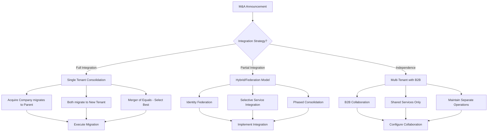
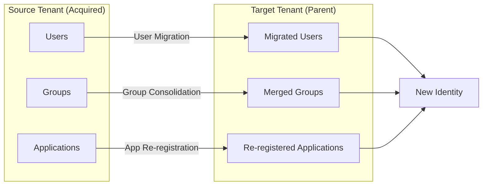
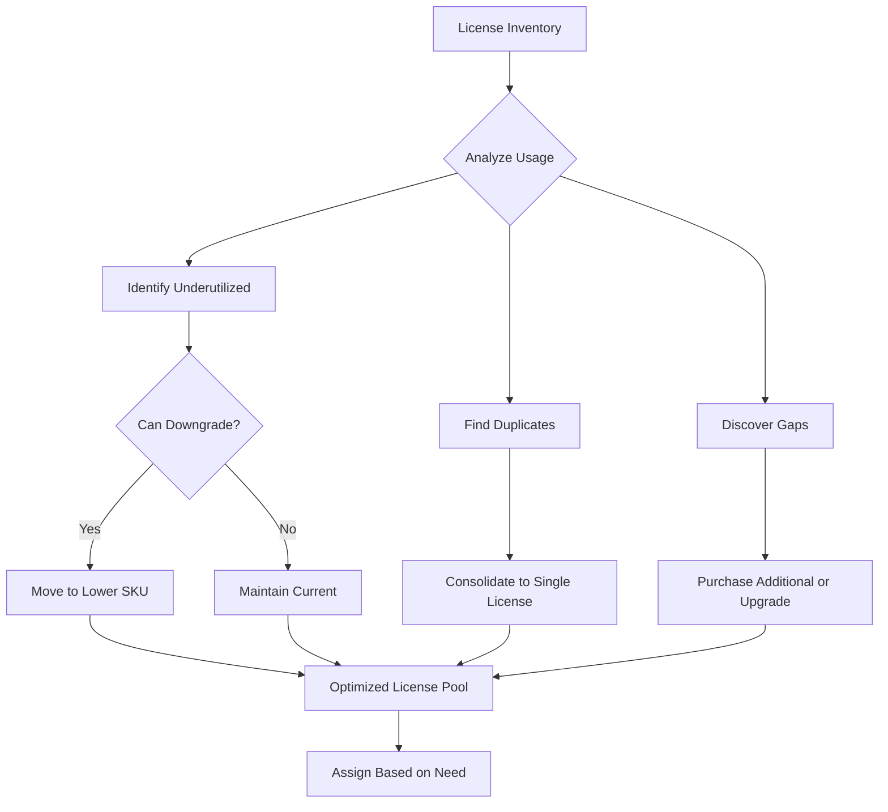
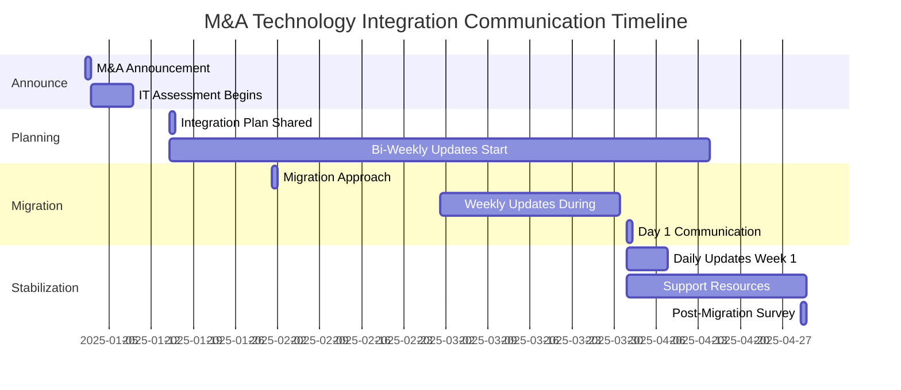
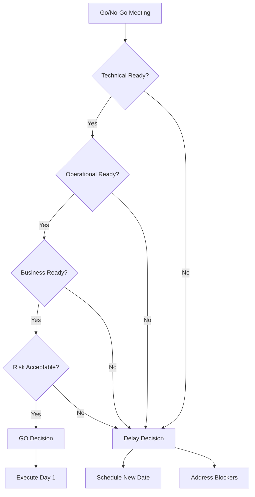

# Merger and Acquisition Technology Integration

## Overview

Mergers and acquisitions (M&A) represent critical inflection points requiring rapid yet careful technology integration. The architectural decisions made during M&A integration impact organizational productivity, security posture, and operational efficiency for years. This reference provides comprehensive guidance for architecting technology integration in M&A scenarios using Microsoft's enterprise platforms.

## Purpose of This Reference

This document helps enterprise architects:
- **Design tenant consolidation strategies** for Microsoft 365 environments
- **Plan identity integration** across organizations
- **Execute secure data migrations** with minimal business disruption
- **Optimize licensing** during organizational changes
- **Manage change effectively** through technology transitions
- **Deliver Day 1 readiness** for business continuity

## Tenant Consolidation Approaches and Strategies

### Single Tenant vs. Multiple Tenants Decision

**Single Tenant Strategy**
- **Pros**:
  - Unified identity and access management
  - Simplified administration and governance
  - Lower licensing costs (consolidated agreements)
  - Integrated collaboration across organizations
  - Centralized security and compliance controls

- **Cons**:
  - Complex migration process
  - Potential for disruption during consolidation
  - Loss of subsidiary independence
  - Requires organizational alignment

- **When to Use**: Full integration scenarios, shared corporate culture, long-term unified operations

**Multiple Tenant Strategy**
- **Pros**:
  - Maintains operational independence
  - Faster time to basic connectivity
  - Lower short-term risk
  - Preserves existing processes
  - Easier to divest if acquisition fails

- **Cons**:
  - Higher ongoing costs (separate licenses, administration)
  - Complex cross-tenant collaboration
  - Duplicate security and compliance efforts
  - Fragmented reporting and analytics

- **When to Use**: Portfolio acquisitions, planned divestitures, significant operational independence required

### Consolidation Patterns



### Pattern 1: Acquired Company to Parent Tenant

**Description**: The acquired organization's users and data migrate to the parent company's existing Microsoft 365 tenant.

**Advantages**:
- Parent tenant remains stable
- Clear consolidation target
- Leverages existing parent governance
- Acquired company adopts parent standards

**Considerations**:
- Requires migration of all acquired company data
- May lose acquired company customizations
- Potential for user resistance
- Parent tenant must scale to accommodate growth

**Implementation Steps**:
1. **Assessment Phase** (See phase-vision.md)
   - Inventory acquired company's Microsoft 365 usage
   - Identify custom applications and integrations
   - Document licensing and entitlements
   - Map organizational structure

2. **Planning Phase** (See phase-validate.md)
   - Design target state in parent tenant
   - Plan user account migration strategy
   - Schedule data migration windows
   - Develop communication plan

3. **Execution Phase** (See phase-construct.md and phase-deploy.md)
   - Create user accounts in parent tenant
   - Migrate mailboxes and OneDrive content
   - Transition SharePoint sites and Teams
   - Update DNS and external integrations
   - Decommission source tenant

### Pattern 2: Both Organizations to New Tenant

**Description**: Both organizations migrate to a newly created Microsoft 365 tenant representing the merged entity.

**Advantages**:
- Fresh start with neutral platform
- Opportunity to redesign architecture
- Equal treatment of both organizations
- Clean slate for governance and standards

**Considerations**:
- Highest complexity (two migrations)
- Extended timeline
- Risk of double disruption
- Requires new tenant setup and configuration

**When to Use**: Merger of equals, major architectural debt in both tenants, regulatory reasons requiring clean separation from legacy

### Pattern 3: Hybrid/Federation Model

**Description**: Organizations maintain separate tenants but implement identity federation and selective service integration.

**Advantages**:
- Minimal disruption to existing operations
- Faster time to collaboration
- Maintains operational independence
- Can evolve to full consolidation later

**Considerations**:
- Ongoing multi-tenant management overhead
- Complex licensing scenarios
- Requires careful governance design
- May not achieve full cost synergies

**Use Cases**:
- Acquisition with planned divestiture window
- Business units requiring regulatory separation
- Portfolio company model
- Phased integration approach

## Identity Federation Strategy

### Azure AD/Entra ID Consolidation

**Identity Consolidation Approaches**

**Approach 1: Migrate All Users to Parent Tenant**


**Migration Considerations**:
- User Principal Names (UPNs) may need to change
- Multi-factor authentication settings must be reconfigured
- Conditional Access policies must be recreated
- Application registrations must be moved
- Service principals and managed identities recreated

**Approach 2: B2B Collaboration (Azure AD B2B)**

**Use Cases for B2B**:
- Temporary collaboration needs
- Gradual migration approach
- External partner scenarios
- Maintaining subsidiary independence

**B2B Implementation**:
1. Configure cross-tenant access settings
2. Invite users from acquired tenant as B2B guests
3. Assign appropriate licenses and access
4. Configure conditional access for external users
5. Monitor and audit B2B activity

**Limitations of B2B**:
- Guest users have limited capabilities
- Cannot be full owners of resources
- Complex licensing requirements
- Not suitable for full employees long-term

### Authentication and SSO Strategy

**Federated Authentication Scenarios**

**Scenario 1: Both Organizations Using ADFS**
- Consolidate to single ADFS farm or migrate to Azure AD
- Merge forests or establish forest trusts
- Plan for certificate renewal and infrastructure updates
- Consider password hash sync for backup authentication

**Scenario 2: Hybrid Identity with AD Connect**
- Consolidate AD Connect servers or run multiple
- Plan forest consolidation or cross-forest sync
- Handle duplicate UPNs and conflicts
- Migrate to Azure AD Connect Cloud Sync for simplified management

**Scenario 3: Cloud-Only Authentication**
- Simplest from infrastructure perspective
- Migrate all users to cloud authentication
- Implement passwordless authentication (Windows Hello, FIDO2)
- Use Temporary Access Pass for initial migration

### Conditional Access and Security Policies

**Policy Consolidation Strategy**:

1. **Audit Existing Policies**: Document both organizations' policies
2. **Identify Best Practices**: Select strongest controls from either org
3. **Design Unified Policies**: Create new policy set for combined organization
4. **Pilot with Test Users**: Validate before broad rollout
5. **Gradual Rollout**: Use staged assignment to minimize disruption
6. **Monitor and Adjust**: Track sign-in logs and user feedback

**Common Policy Conflicts**:
- Different MFA requirements
- Varying device compliance requirements
- Conflicting legacy authentication blocks
- Different trusted location definitions

**Resolution Approach**:
- Default to most restrictive policy
- Provide exceptions for transition period
- Set timeline for full compliance
- Communicate requirements clearly

## Data Migration Methodology

### Tenant-to-Tenant Migration Overview

**Migration Scope**:
- **Exchange Online**: Mailboxes, contacts, calendars, public folders
- **SharePoint Online**: Sites, libraries, lists, permissions
- **OneDrive for Business**: User files and sharing
- **Microsoft Teams**: Teams, channels, files, chat history (limited)
- **Security & Compliance**: Retention policies, eDiscovery, labels
- **Azure AD**: Users, groups, devices, applications

### Exchange Online Migration

**Migration Options**

**Option 1: Microsoft FastTrack Migration**
- Available for eligible customers (500+ seats)
- Microsoft-led migration service
- Supports large-scale migrations
- No additional cost for eligible customers
- Limited to mailbox migrations

**Option 2: Third-Party Migration Tools**
- Full-featured migration platforms
  - BitTitan MigrationWiz
  - AvePoint Fly
  - Quest On Demand Migration
  - SkyKick
- Support complex scenarios (PST files, archives, public folders)
- Provide reporting and validation
- Additional licensing cost

**Option 3: Native Microsoft Tools**
- Cross-tenant mailbox migration (Preview feature)
- Limited features compared to third-party
- No additional cost
- Requires configuration in both tenants

**Migration Phases**:

1. **Pre-Migration** (Weeks before cutover)
   - Inventory mailboxes and sizes
   - Clean up unnecessary data
   - Provision target mailboxes
   - Configure mail routing
   - Test migrations with pilot group

2. **Migration** (Cutover weekend/period)
   - Perform bulk mailbox migration
   - Monitor progress and errors
   - Validate data integrity
   - Update DNS (MX records)
   - Switch mail flow to target tenant

3. **Post-Migration** (Days/weeks after cutover)
   - Complete stragglers and failed items
   - Decommission source mailboxes
   - Update documentation
   - Collect user feedback
   - Address issues and exceptions

### SharePoint and OneDrive Migration

**SharePoint Migration Strategies**

**Lift and Shift Approach**:
- Migrate sites as-is to target tenant
- Preserves structure and permissions
- Fastest approach
- May perpetuate technical debt

**Restructure and Optimize**:
- Redesign information architecture
- Consolidate redundant sites
- Apply modern SharePoint patterns
- Longer timeline but better outcome

**Migration Tools**:

**SharePoint Migration Tool (SPMT)**:
- Free Microsoft tool
- Supports file shares, SharePoint, and OneDrive
- Bulk migration capabilities
- Limited reporting

**Migration API**:
- Programmatic approach for developers
- Highest performance for large datasets
- Requires custom development
- Complex to implement

**Third-Party Platforms**:
- Comprehensive migration features
- Advanced permissions mapping
- Metadata preservation
- Version history retention
- Detailed reporting and validation

**OneDrive Migration**:
- Pre-provision OneDrive for all users
- Use SPMT or third-party tools
- Preserve sharing links where possible
- Communicate shared links will break
- Provide grace period for users to access old content

### Microsoft Teams Migration

**Teams Migration Challenges**:
- Chat history not easily migrated
- Private channels have complex permissions
- Apps and connectors must be reconfigured
- Tabs contain hard-coded URLs
- Meeting recordings tied to original tenant

**Migration Approach**:

**Option 1: Fresh Start**:
- Create new teams in target tenant
- Migrate files only (via SharePoint migration)
- Accept loss of chat history
- Simplest approach, least complexity

**Option 2: Partial Migration**:
- Use third-party tools (AvePoint, BitTitan) for files and structure
- Export important chat history to PST or HTML
- Store in SharePoint for reference
- Reconfigure apps and tabs manually

**Option 3: Extended Coexistence**:
- Keep source tenant read-only for historical access
- Transition to new teams in target tenant
- Provide access to both during transition
- Eventually decommission source

### Data Validation and Quality Assurance

**Validation Checklist**:
- [ ] User count matches source tenant
- [ ] Mailbox sizes consistent with source
- [ ] Critical SharePoint sites migrated successfully
- [ ] OneDrive data complete for all users
- [ ] Permissions properly mapped
- [ ] Sharing links functional (where preserved)
- [ ] Groups and membership accurate
- [ ] Distribution lists and contacts migrated
- [ ] Mobile device access working
- [ ] Key applications functioning

**Data Quality Metrics**:
- **Completeness**: % of items successfully migrated
- **Accuracy**: Validation of metadata and attributes
- **Timeliness**: Migration completed within window
- **Consistency**: Relationships between items preserved

## Licensing Optimization Opportunities

### License Discovery and Inventory

**Assessment Activities**:

1. **Inventory Current Licenses**:
   - Parent organization licenses by SKU
   - Acquired organization licenses by SKU
   - Assignment rates (% of licenses in use)
   - Usage patterns (active vs. inactive users)

2. **Identify Overlaps and Gaps**:
   - Users with duplicate licenses
   - Underutilized licenses that can be consolidated
   - Gaps requiring additional purchases
   - Opportunities to standardize on fewer SKUs

3. **Analyze Usage Patterns**:
   - Microsoft 365 Usage Analytics
   - Azure AD sign-in reports
   - Application usage data
   - Feature utilization (Teams, SharePoint, etc.)

### License Consolidation Strategies

**SKU Rationalization**:



**Common Optimization Patterns**:

**Pattern 1: Standardize on Single E3/E5 SKU**
- Evaluate if E3 meets majority needs
- Upgrade subset of users to E5 for advanced features
- Decommission legacy E1/F1/Business plans
- Negotiate volume discount with Microsoft

**Pattern 2: Frontline Worker Optimization**
- Identify users who can use F1/F3 licenses
- Move non-knowledge workers to Frontline SKUs
- Significant cost savings (F3 ~$8/user vs. E3 ~$36/user)
- Ensure Frontline SKU meets use case requirements

**Pattern 3: Add-On Consolidation**
- Identify standalone add-ons (Advanced Compliance, Advanced Threat Protection)
- Evaluate if E5 more cost-effective than E3 + add-ons
- Threshold typically around 30-40% of users needing add-ons

### Enterprise Agreement Negotiation

**M&A as Leverage Point**:

1. **True-Up Timing**: Align acquisition with EA anniversary date
2. **Volume Commitments**: Combine user counts for higher discounts
3. **Co-Termination**: Align contract end dates for future flexibility
4. **Buyout Rights**: Negotiate ability to buyout acquired company's existing agreements
5. **Transition Credits**: Request credits for migration costs or overlapping licenses

**Negotiation Checklist**:
- [ ] Consolidate to single Enterprise Agreement
- [ ] Achieve higher volume discount tiers
- [ ] Eliminate duplicate baseline commitments
- [ ] Negotiate migration assistance (FastTrack)
- [ ] Secure professional services credits
- [ ] Extend payment terms if needed for cash flow
- [ ] Lock in pricing for post-merger growth

## Comprehensive Change Management Program

### Stakeholder Engagement Strategy

**Key Stakeholder Groups**:

1. **Executive Leadership**:
   - Communicate business benefits of integration
   - Provide high-level timeline and milestones
   - Escalate risks and decision points
   - Secure budget and resource commitments

2. **IT Leadership**:
   - Involve in architectural decisions
   - Align on standards and governance
   - Coordinate team integration
   - Plan for support model changes

3. **End Users**:
   - Communicate what changes and when
   - Provide training and resources
   - Establish feedback channels
   - Recognize and celebrate milestones

4. **Business Unit Leaders**:
   - Understand department-specific impacts
   - Identify champions for change
   - Address business process changes
   - Manage local resistance

### Communication Plan

**Communication Cadence**:



**Communication Channels**:
- **Email**: Formal announcements and detailed information
- **Intranet**: Centralized resource for FAQs, guides, and updates
- **Town Halls**: Executive presence for major milestones
- **Teams Channels**: Real-time Q&A and support during migration
- **Videos**: Short training videos and walkthroughs
- **Champions Network**: Department representatives for grassroots communication

### Training and Support Strategy

**Training Program Components**:

1. **Self-Service Resources**:
   - Migration FAQ document
   - Video tutorials for common tasks
   - Before/after comparison guides
   - Quick reference cards

2. **Instructor-Led Training**:
   - Overview sessions for all users
   - Power user deep dives
   - Department-specific training
   - Executive briefings

3. **Just-in-Time Support**:
   - Migration day "war room"
   - Extended help desk hours
   - On-site support for critical facilities
   - Escalation paths for urgent issues

**Support Model Evolution**:
- **Pre-Migration**: Both support teams operational
- **Migration Window**: Joint war room with resources from both orgs
- **Post-Migration (0-30 days)**: Extended support hours, both teams
- **Post-Migration (30-90 days)**: Transition to unified support model
- **Ongoing**: Single IT service desk for combined organization

## Day 1 Readiness Requirements

### Day 1 Definition and Scope

**What is Day 1?**
Day 1 represents the first business day when acquired company employees must function using the consolidated technology environment. Critical systems must be operational, users must have access, and business operations must continue without significant disruption.

**Day 1 Success Criteria**:
- All users can access email and calendar
- Critical business applications functional
- File sharing and collaboration operational
- Security and compliance controls active
- Support channels available and responsive
- No critical showstopper issues

### Critical Systems Inventory

**Tier 1: Day 1 Must-Have**:
- [ ] Email and calendar (Exchange Online)
- [ ] Identity and authentication (Azure AD/Entra ID)
- [ ] File storage (OneDrive, SharePoint)
- [ ] Communication (Teams, phone system)
- [ ] Business-critical applications (ERP, CRM)
- [ ] VPN and network access
- [ ] Help desk and support systems

**Tier 2: Week 1 Required**:
- [ ] Departmental applications
- [ ] Reporting and analytics
- [ ] Collaboration workspaces (Teams, SharePoint sites)
- [ ] Mobile device access
- [ ] Printing and local resources
- [ ] Integrations between systems

**Tier 3: Month 1 Target**:
- [ ] Non-critical applications
- [ ] Archive access
- [ ] Historical data
- [ ] Nice-to-have integrations
- [ ] Process optimizations

### Day 1 Readiness Checklist

**Technical Readiness**:
- [ ] All user accounts provisioned in target tenant
- [ ] Licenses assigned to all users
- [ ] Email migration completed and validated
- [ ] DNS changes ready to execute (MX, SPF, DKIM, DMARC)
- [ ] OneDrive pre-provisioned and migrated
- [ ] Critical SharePoint sites migrated
- [ ] Teams created for key departments
- [ ] Multi-factor authentication configured
- [ ] Conditional Access policies deployed
- [ ] VPN access configured for all users
- [ ] Application integrations tested
- [ ] Mobile device management policies active
- [ ] Monitoring and alerting operational

**Operational Readiness**:
- [ ] Support teams trained on new environment
- [ ] Escalation procedures documented
- [ ] Communication sent to all users
- [ ] Executive briefing completed
- [ ] Rollback procedures documented and tested
- [ ] War room staffed and ready
- [ ] Help desk extended hours scheduled
- [ ] Known issues documented with workarounds

**Business Readiness**:
- [ ] Critical business processes tested
- [ ] Key stakeholders signed off on go-live
- [ ] User training completed
- [ ] Champions identified and prepared
- [ ] Backup communication methods established
- [ ] Customer-facing impact minimized
- [ ] Regulatory requirements validated

### Go/No-Go Decision Framework

**48 Hours Before Day 1**:



**Decision Criteria**:
1. **All Tier 1 systems validated**: No critical blockers
2. **Migration >95% complete**: Stragglers documented with plan
3. **Support team confidence high**: Training complete, procedures tested
4. **No major external factors**: Holidays, other outages, business critical events
5. **Executive sponsor approval**: Final go-ahead from business leadership

## Coexistence Patterns During Integration

### Hybrid Identity Coexistence

**Coexistence Scenario**: Users from both organizations need to collaborate while identities remain in separate tenants.

**Implementation**:
1. **Configure Azure AD B2B**: Enable cross-tenant access
2. **Set Up Auto-Redemption**: Reduce friction for invited users
3. **Configure Conditional Access**: Extend policies to B2B guests
4. **Enable MFA**: Require MFA for cross-tenant access
5. **Monitor Guest Access**: Audit and review regularly

**Duration**: Typically 3-6 months during gradual migration

### Mail Coexistence and Routing

**Mail Flow Patterns**:

**Pattern 1: Separate Mail Domains**
- Each organization keeps existing email domains
- Mail routing independent initially
- Gradual transition to consolidated domain
- GAL (Global Address List) synchronization for directory lookups

**Pattern 2: Unified GAL with Free/Busy**
- Configure GAL sync between tenants
- Enable calendar sharing and free/busy lookup
- Schedule meetings across organizations
- Maintain separate email systems temporarily

**Pattern 3: Mail Forwarding During Migration**
- Forward mail from old mailbox to new
- Maintain both mailboxes during transition
- Users check single mailbox (new one)
- Old mailbox for legacy access only

**Implementation Example**:
```powershell
# Configure mail forwarding in source tenant
Set-Mailbox user@acquired.com -ForwardingAddress user@parent.com
Set-Mailbox user@acquired.com -DeliverToMailboxAndForward $true
```

### Collaboration Coexistence (SharePoint and Teams)

**Coexistence Approaches**:

**Option 1: Guest Access Model**
- Share sites and Teams with users from other tenant as guests
- Limited features for guest users
- Simple to implement
- Suitable for short-term needs

**Option 2: Duplicate Teams**
- Create new Teams in target tenant
- Migrate files via SharePoint migration
- Users switch to new Teams
- Maintain old Teams read-only for history

**Option 3: Phased Site Migration**
- Migrate critical/active sites first
- Leave archived sites for later
- Provide access to both tenants during transition
- Gradual decommissioning of source

### Application Integration During Coexistence

**Challenges**:
- Applications registered in source tenant
- API calls authenticated against source Azure AD
- Service principals and managed identities tenant-specific
- Custom connectors point to source resources

**Mitigation Strategies**:

1. **Parallel Applications**:
   - Re-register apps in target tenant
   - Maintain both versions during transition
   - Redirect users to appropriate version based on tenant
   - Eventually decommission source apps

2. **Cross-Tenant API Access**:
   - Configure multi-tenant app registrations
   - Use service-to-service authentication
   - Implement API gateways if needed
   - Monitor and audit cross-tenant calls

3. **Data Integration**:
   - Azure Data Factory for data movement
   - Logic Apps for workflow integration
   - API Management for unified interfaces
   - Event Grid for event-driven integration

## Timelines and Phasing Strategies

### Typical Timeline

**Small Acquisition (<500 users)**:
- **Month 1**: Assessment and planning
- **Month 2**: Preparation and pilot
- **Month 3**: Migration and cutover
- **Month 4**: Stabilization and optimization

**Medium Acquisition (500-2,000 users)**:
- **Months 1-2**: Assessment and planning
- **Month 3**: Pilot migration (50-100 users)
- **Months 4-5**: Phased migration (waves)
- **Month 6**: Final cutover and stragglers
- **Months 7-8**: Stabilization and optimization

**Large Acquisition (2,000+ users)**:
- **Months 1-3**: Comprehensive assessment and planning
- **Month 4**: Pilot migration (100-200 users)
- **Months 5-9**: Multi-wave phased migration
- **Months 10-11**: Final cutover and long-tail migrations
- **Month 12**: Decommissioning and optimization

### Wave Planning Strategy

**Wave Definition Approaches**:

**Geographic Waves**:
- Wave 1: Headquarters/pilot location
- Wave 2: Domestic offices
- Wave 3: International offices by region
- Advantages: Timezone-aligned support, localized communication
- Disadvantages: May split departments across waves

**Departmental Waves**:
- Wave 1: IT and pilot departments
- Wave 2: Administrative functions
- Wave 3: Sales and customer-facing
- Wave 4: Production/operations
- Advantages: Maintain team cohesion
- Disadvantages: Cross-departmental collaboration complexity

**Risk-Based Waves**:
- Wave 1: Low-risk users (IT, tech-savvy)
- Wave 2: Medium-risk standard users
- Wave 3: High-complexity users (executives, specialized needs)
- Advantages: Learn and improve with each wave
- Disadvantages: May delay critical stakeholders

### Pilot Strategy

**Pilot Objectives**:
1. Validate technical migration procedures
2. Test user experience and identify issues
3. Refine communication and training materials
4. Build confidence with stakeholders
5. Establish support procedures and escalation paths

**Pilot Selection Criteria**:
- Include 50-200 users (1-10% of total)
- Mix of roles and technical proficiency
- Friendly/patient users willing to provide feedback
- Include IT team members for real-world testing
- Avoid executive leadership for initial pilot

**Pilot Success Metrics**:
- Migration completion rate >95%
- Critical issues identified and resolved
- User satisfaction score >7/10
- Support ticket volume within capacity
- Technical procedures validated and documented

## Best Practices

1. **Start Planning Pre-Close**: Begin technical assessment during due diligence if possible
2. **Establish Joint Governance Early**: Create integration team with representation from both organizations
3. **Communicate Proactively**: Overcommunicate rather than undercommunicate
4. **Pilot Before Scale**: Never skip the pilot phase regardless of timeline pressure
5. **Plan for Rollback**: Have backout plans even if you hope not to use them
6. **Preserve Data**: Maintain source tenant read-only for historical access during decommissioning
7. **Document Decisions**: Create Architecture Decision Records for major choices (See architecture-decision-records.md)
8. **Celebrate Milestones**: Recognize team efforts and user patience throughout process

## Reference Links

- [Microsoft 365 tenant-to-tenant migrations](https://learn.microsoft.com/en-us/microsoft-365/enterprise/microsoft-365-tenant-to-tenant-migrations)
- [Cross-tenant mailbox migration](https://learn.microsoft.com/en-us/microsoft-365/enterprise/cross-tenant-mailbox-migration)
- [Azure AD B2B collaboration](https://learn.microsoft.com/en-us/azure/active-directory/external-identities/what-is-b2b)
- [SharePoint Migration Tool](https://learn.microsoft.com/en-us/sharepointmigration/introducing-the-sharepoint-migration-tool)

## Related References

- **Technology Platforms**: See m365-specifics.md, azure-specifics.md for platform details
- **Migration Methodology**: See large-scale-migrations.md for migration patterns
- **Compliance**: See regulated-industries.md for compliance considerations
- **Phase Methodology**: See phase-vision.md, phase-validate.md, phase-construct.md, phase-deploy.md for process guidance
- **Decision Documentation**: See architecture-decision-records.md for recording key decisions
