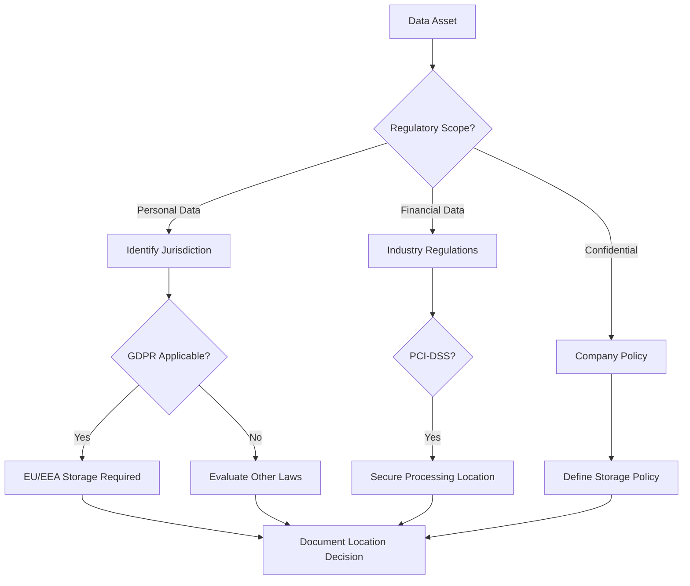
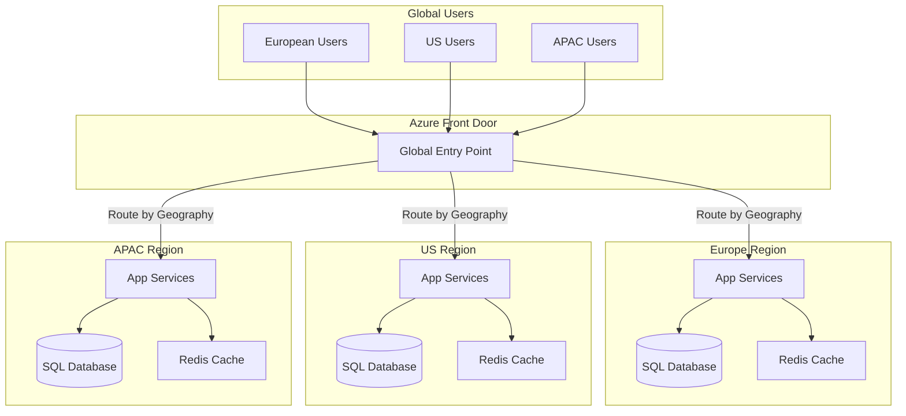
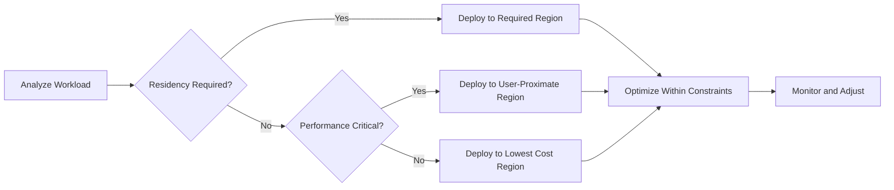
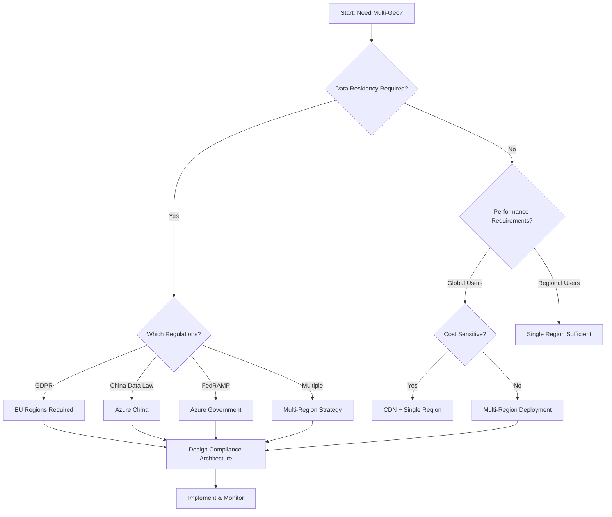

# Multi-Geo Deployments

## Overview

Multi-geo deployments enable organizations to establish data presence in multiple geographic locations to meet data residency requirements, optimize performance, and comply with local regulations. This architecture pattern is essential for global enterprises operating across regions with varying regulatory requirements and performance expectations.

## Purpose of This Reference

This document helps enterprise architects:
- **Design compliant multi-geo architectures** that meet data sovereignty requirements
- **Optimize network topology** for global performance and reliability
- **Plan cost-effective** multi-regional deployments
- **Navigate regulatory compliance** across different jurisdictions
- **Implement data classification** and location policies

## Data Residency Requirements and Regulations

### Key Regulatory Frameworks

**GDPR (General Data Protection Regulation)**
- Applies to organizations processing EU citizen data
- Requires data to remain within EU/EEA unless adequate safeguards exist
- Mandates data subject rights (access, deletion, portability)
- Imposes strict breach notification requirements (72 hours)
- Penalties up to 4% of global annual revenue

**Data Sovereignty Considerations**
- **China**: Cybersecurity Law requires data localization for critical information infrastructure
- **Russia**: Federal Law 242-FZ mandates Russian citizen data storage within Russia
- **Australia**: Privacy Act 1988 and Notifiable Data Breaches scheme
- **Brazil**: LGPD (Lei Geral de Proteção de Dados) similar to GDPR
- **India**: Personal Data Protection Bill proposes data localization requirements

### Microsoft Cloud Compliance Boundary

Microsoft provides regional cloud instances to address data sovereignty:
- **Azure Public Cloud**: Global regions with data residency commitments
- **Azure Government**: US government compliance (FedRAMP, DoD IL5)
- **Azure China**: Operated by 21Vianet for China compliance
- **Azure Germany**: Meets German data trustee model (transitioning to EU regions)

### Data Classification for Residency



## Network Topology Design for Multi-Geo

### Azure Regional Architecture

**Paired Regions Strategy**
- Each Azure region paired with another in same geography
- Enables disaster recovery and high availability
- Examples: East US ↔ West US, North Europe ↔ West Europe
- Updates rolled out to one region at a time in pair
- Data replication options within region pairs

**Availability Zones**
- 3+ physically separated zones within region
- Independent power, cooling, and networking
- <2ms latency between zones
- 99.99% SLA for zone-redundant services
- Use for business-critical workloads

### Traffic Routing and Latency Optimization

**Azure Traffic Manager**
- DNS-based traffic routing
- Routing methods:
  - **Performance**: Routes to closest endpoint
  - **Geographic**: Routes based on DNS query origin
  - **Priority**: Primary/failover configuration
  - **Weighted**: Distribute traffic across endpoints
- Sub-second failover detection
- Integrate with health probes

**Azure Front Door**
- Layer 7 load balancing with SSL offload
- Anycast protocol for low latency
- URL-based routing and path-based routing
- Web Application Firewall integration
- Dynamic site acceleration (DSA)

### Network Topology Patterns



## Compliance Boundaries Per Geography

### Defining Compliance Boundaries

**Boundary Definition Framework**
1. **Identify applicable regulations** per geography
2. **Map data types** to regulatory requirements
3. **Define processing locations** for each data type
4. **Document cross-border data flows** and legal mechanisms
5. **Implement technical controls** to enforce boundaries

**Example: EU Compliance Boundary**
- **Scope**: All EU citizen personal data (GDPR Article 4)
- **Storage**: EU regions only (Ireland, Netherlands, France, Germany)
- **Processing**: Within EU or with Standard Contractual Clauses (SCCs)
- **Data Transfers**: Documented, lawful basis required
- **Backup/DR**: Must remain within compliance boundary

### Technical Enforcement Mechanisms

**Azure Policy for Geographic Compliance**
```json
{
  "if": {
    "allOf": [
      {
        "field": "type",
        "equals": "Microsoft.Storage/storageAccounts"
      },
      {
        "field": "tags.DataClassification",
        "equals": "GDPR-Personal"
      }
    ]
  },
  "then": {
    "effect": "deny",
    "details": {
      "allowedLocations": [
        "westeurope",
        "northeurope",
        "francecentral",
        "germanywestcentral"
      ]
    }
  }
}
```

**Microsoft Purview for Data Governance**
- Automated data discovery and classification
- Data lineage tracking across regions
- Compliance dashboard and reporting
- Policy enforcement integration

## Performance Optimization Strategies

### Content Delivery Network (CDN)

**Azure CDN Use Cases**
- Static content delivery (images, CSS, JavaScript)
- Software distribution and updates
- Streaming media optimization
- API acceleration for read-heavy workloads

**CDN Strategy**
- Use Azure CDN with Premium Verizon or Standard Microsoft
- Implement cache rules based on content type
- Set appropriate TTL (Time To Live) values
- Use query string caching for dynamic variants
- Monitor cache hit ratio (target >80%)

### Edge Computing with Azure

**Azure IoT Edge**
- Process data locally before cloud transmission
- Reduces latency for IoT scenarios
- Supports offline operation
- Custom modules in containers

**Azure Stack Edge**
- On-premises Azure services
- Local data processing and AI inference
- Automatic data transfer to Azure
- Use for manufacturing, retail, remote offices

### Regional Caching Strategies

**Distributed Caching Pattern**
- Deploy Azure Cache for Redis in each region
- Cache frequently accessed reference data locally
- Implement cache-aside pattern for application data
- Use geo-replication for read replicas
- Monitor cache performance and hit rates

**Application-Level Optimization**
- Minimize cross-region database queries
- Use local replicas for read operations
- Implement eventual consistency where acceptable
- Batch cross-region updates during off-peak hours

## Cost Implications of Multi-Geo

### Data Transfer Costs

**Azure Bandwidth Pricing Model**
- **Inbound**: Free (data ingress to Azure)
- **Outbound**: Tiered pricing by volume
  - First 100 GB/month: Free
  - 100 GB - 10 TB: $0.087/GB (varies by region)
  - 10 TB - 50 TB: $0.083/GB
  - 50 TB - 150 TB: $0.070/GB
  - 150 TB+: $0.050/GB
- **Inter-region**: $0.02/GB between regions

**Cost Optimization Strategies**
1. **Minimize cross-region traffic**: Keep data and compute co-located
2. **Use CDN for static content**: Reduce origin bandwidth
3. **Implement regional caching**: Reduce database cross-region queries
4. **Compress data in transit**: Use gzip/brotli compression
5. **Schedule data replication**: Use off-peak hours when possible

### Regional Pricing Differences

**Price Variation by Region**
- US regions typically baseline pricing
- EU regions often 10-15% higher
- APAC regions 15-30% higher
- Brazil and India can be 50%+ higher
- Government clouds have different pricing models

**Cost Optimization Framework**


### Total Cost of Ownership (TCO) Considerations

**Multi-Geo TCO Components**
1. **Compute costs**: VM instances, App Services across regions
2. **Storage costs**: Redundancy levels (LRS, ZRS, GRS, GZRS)
3. **Networking costs**: Bandwidth, VPN/ExpressRoute, load balancers
4. **Data replication**: Database geo-replication costs
5. **Management overhead**: Additional complexity, tooling, staff
6. **Licensing**: Microsoft 365 Multi-Geo add-on costs

## Microsoft 365 Multi-Geo Capabilities

### Overview

Microsoft 365 Multi-Geo enables organizations to store data at rest in specified geographic locations while maintaining a single global tenant. This addresses data residency requirements while providing unified administration.

**Licensing Requirements**
- Requires Microsoft 365 Multi-Geo add-on
- Minimum 250 Microsoft 365 seats in tenant
- Available for Enterprise Agreement customers
- Per-user assignment to geo locations

### Supported Geo Locations

**Available Geographies** (as of 2025)
- North America (US)
- Europe (EU)
- Asia-Pacific (APAC)
- Australia (AUS)
- United Kingdom (UK)
- Japan (JPN)
- Canada (CAN)
- India (IND)
- France (FRA)
- Germany (DEU)
- Switzerland (CHE)
- Norway (NOR)
- United Arab Emirates (UAE)
- South Africa (ZAF)

### Service-Specific Capabilities

**Exchange Online**
- User mailboxes stored in assigned geo location
- Archive mailboxes follow primary mailbox location
- Public folders remain in default geo
- Shared mailboxes can be assigned to any geo
- Mail routing automatic and transparent

**SharePoint Online and OneDrive**
- User OneDrive provisioned in preferred data location (PDL)
- SharePoint sites can be created in any satellite geo
- Microsoft 365 Groups provisioned in PDL of group creator
- Move sites between geos using admin tools
- Search index per geo location

**Microsoft Teams**
- Chat messages stored in mailbox geo location
- Files stored in SharePoint/OneDrive geo location
- Recordings stored in OneDrive of recorder
- Meeting metadata in organizer's geo

### Implementation Strategy

**Phase 1: Planning (See phase-vision.md)**
1. Identify users requiring specific geo locations
2. Map organizational units to geographic requirements
3. Plan satellite geo activation sequence
4. Design migration approach for existing users
5. Communicate with stakeholders

**Phase 2: Configuration**
1. Activate satellite geo locations in tenant
2. Set Preferred Data Location (PDL) for users
3. Create geo-specific SharePoint sites
4. Configure eDiscovery and compliance boundaries
5. Update governance policies

**Phase 3: Migration**
1. Provision new users in correct geo
2. Move existing users to new geo (supported by Microsoft)
3. Migrate SharePoint sites as needed
4. Validate data location compliance
5. Update documentation

### Multi-Geo Governance

**Compliance Boundaries**
- Configure Microsoft Purview compliance policies per geo
- Set up geo-specific eDiscovery cases
- Implement data loss prevention (DLP) per region
- Audit log search scoped to specific geos

## Azure Regional Deployments

### Regional Deployment Patterns

**Pattern 1: Active-Active Multi-Region**
- All regions serve live production traffic
- Data replicated across regions
- Provides highest availability and performance
- Highest cost due to full redundancy
- Use for mission-critical global applications

**Pattern 2: Active-Passive (DR)**
- Primary region serves all traffic
- Secondary region for disaster recovery only
- Data replicated to secondary
- Lower cost than active-active
- Use for business-critical apps with RTO/RPO requirements

**Pattern 3: Regional Isolation**
- Each region completely independent
- No cross-region data sharing
- Simplified compliance and governance
- Users assigned to specific region
- Use for strict data sovereignty requirements

### Paired Regions for Disaster Recovery

**Benefits of Paired Regions**
- Physical separation (minimum 300 miles)
- Platform updates rolled out sequentially
- Data replication prioritized within pairs
- Region recovery sequence prioritized
- Same geography for compliance

**Common Paired Regions**
- East US ↔ West US
- North Europe (Ireland) ↔ West Europe (Netherlands)
- Southeast Asia (Singapore) ↔ East Asia (Hong Kong)
- UK South (London) ↔ UK West (Cardiff)
- Australia East (Sydney) ↔ Australia Southeast (Melbourne)

### Availability Zones Strategy

**Zone-Redundant Services**
- Azure App Service (Premium v2, v3)
- Azure Kubernetes Service (AKS)
- Azure SQL Database (Premium, Business Critical tiers)
- Azure Storage (ZRS, GZRS)
- Azure Load Balancer (Standard tier)
- Azure Virtual Machines (zone deployment)

**Implementation Checklist**
- [ ] Deploy critical workloads across 3 availability zones
- [ ] Use zone-redundant storage (ZRS) for data
- [ ] Configure zone-aware load balancing
- [ ] Test zone failure scenarios
- [ ] Monitor zone health and distribution
- [ ] Document zone deployment architecture

## Power Platform Environment Strategy

### Environment Regions and Data Location

**Environment Creation**
- Environment region selected at creation time
- Cannot change environment region after creation
- Data at rest stored in selected region
- Determines data center for Dataverse database

**Available Regions**
Power Platform environments available in 20+ regions including:
- United States, Canada, Brazil
- Europe (multiple), United Kingdom
- Asia Pacific, Japan, India, Australia
- UAE, South Africa

### Multi-Geo Environment Strategy

**Pattern 1: Regional Environments**
- Create separate environments per region
- Each environment in local data center
- Duplicate apps and flows across environments
- Maintain separate data sets regionally
- Use for strict data isolation

**Pattern 2: Hub and Spoke**
- Central environment for global processes
- Satellite environments for regional data
- Integration via APIs and connectors
- Centralized governance, regional execution
- Balance between consistency and localization

**Pattern 3: Single Global Environment**
- One environment for entire organization
- Dataverse data in single region
- Simplest administration model
- May not meet data residency requirements
- Use when residency not mandated

### Data Residency Considerations

**Dataverse Data Location**
- Customer data at rest in environment region
- System metadata may be in multiple regions
- Backup stored in paired region within geography
- Audit logs stored in environment region

**Integration Data Flows**
- Custom connectors may process data in other regions
- Azure Logic Apps follow Azure region selection
- Document cross-border flows for compliance
- Use on-premises data gateway for local data sources

## Dynamics 365 Geo-Specific Instances

### Deployment Regions

Dynamics 365 customer engagement apps available in regional data centers:
- **Americas**: United States, Canada, Brazil, Chile
- **Europe**: UK, France, Germany, Switzerland, Norway
- **Asia Pacific**: Japan, India, Singapore, Australia, Korea
- **Middle East**: UAE
- **Africa**: South Africa

### Instance Geo Selection

**Considerations for Geo Selection**
1. **Primary user location**: Choose region closest to majority of users
2. **Data residency**: Comply with local data storage laws
3. **Integration dependencies**: Consider location of integrated systems
4. **Latency requirements**: <100ms latency for optimal user experience
5. **Disaster recovery**: Understand backup and DR capabilities per region

### Multi-Instance Strategy

**When to Use Multiple Instances**
- Different legal entities with separate data requirements
- Regulatory requirements mandate data isolation
- Distinct business processes by geography
- Mergers and acquisitions with separate operations
- Development, test, and production environments

**Integration Between Instances**
- Dual-write for data synchronization
- Azure Data Factory for ETL processes
- API-based integration
- Consider data sovereignty in integration design

## Decision Framework

### Multi-Geo Deployment Decision Tree



### Architecture Checklist

**Planning Phase**
- [ ] Document data residency requirements by data type
- [ ] Map users to geographic regions
- [ ] Identify applicable regulations per region
- [ ] Calculate projected bandwidth and costs
- [ ] Define RTO/RPO requirements per region
- [ ] Assess integration points and data flows

**Design Phase** (See phase-validate.md)
- [ ] Select Azure regions and availability strategy
- [ ] Design network topology (Traffic Manager, Front Door)
- [ ] Plan data replication strategy
- [ ] Define compliance boundaries and controls
- [ ] Design authentication and authorization model
- [ ] Document data classification and location policies

**Implementation Phase** (See phase-construct.md and phase-deploy.md)
- [ ] Deploy regional infrastructure
- [ ] Configure traffic routing and failover
- [ ] Implement data replication
- [ ] Enable monitoring and alerting
- [ ] Configure backup and disaster recovery
- [ ] Test cross-region failover scenarios

**Operations Phase** (See phase-evolve.md)
- [ ] Monitor compliance with data location policies
- [ ] Track bandwidth costs and optimize
- [ ] Review and update disaster recovery procedures
- [ ] Conduct regular failover drills
- [ ] Audit data flows across regions
- [ ] Optimize performance based on usage patterns

## Best Practices

1. **Start with clear data classification**: Define what data must stay where and why
2. **Document compliance requirements**: Maintain evidence for audits and reviews
3. **Test disaster recovery regularly**: Don't wait for actual incidents
4. **Monitor costs continuously**: Multi-geo deployments can escalate quickly
5. **Automate compliance controls**: Use Azure Policy and governance tools
6. **Plan for change**: Regulations and business needs evolve
7. **Educate stakeholders**: Ensure understanding of constraints and tradeoffs
8. **Integrate with governance**: Align with overall enterprise architecture (See delivery-methodology-overview.md)

## Reference Links

- [Microsoft 365 Multi-Geo Documentation](https://learn.microsoft.com/en-us/microsoft-365/enterprise/microsoft-365-multi-geo)
- [Azure Paired Regions](https://learn.microsoft.com/en-us/azure/reliability/cross-region-replication-azure)
- [Azure Availability Zones](https://learn.microsoft.com/en-us/azure/reliability/availability-zones-overview)
- [Power Platform Regions](https://learn.microsoft.com/en-us/power-platform/admin/regions-overview)
- [Dynamics 365 Data Locations](https://learn.microsoft.com/en-us/power-platform/admin/new-datacenter-regions)

## Related References

- **Technology Deep Dives**: See azure-specifics.md, m365-specifics.md, power-platform-specifics.md
- **Compliance Frameworks**: See regulated-industries.md for compliance details
- **Deployment Strategy**: See phase-deploy.md for deployment methodology
- **Governance**: See azure-waf-operational-excellence.md for operational practices
