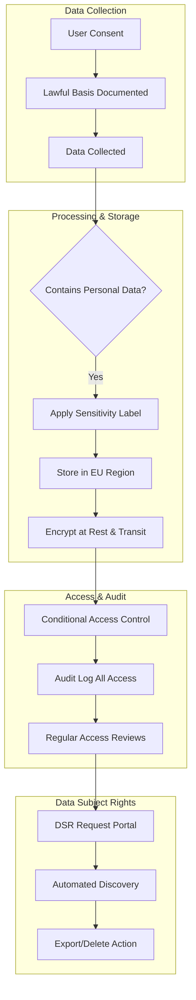
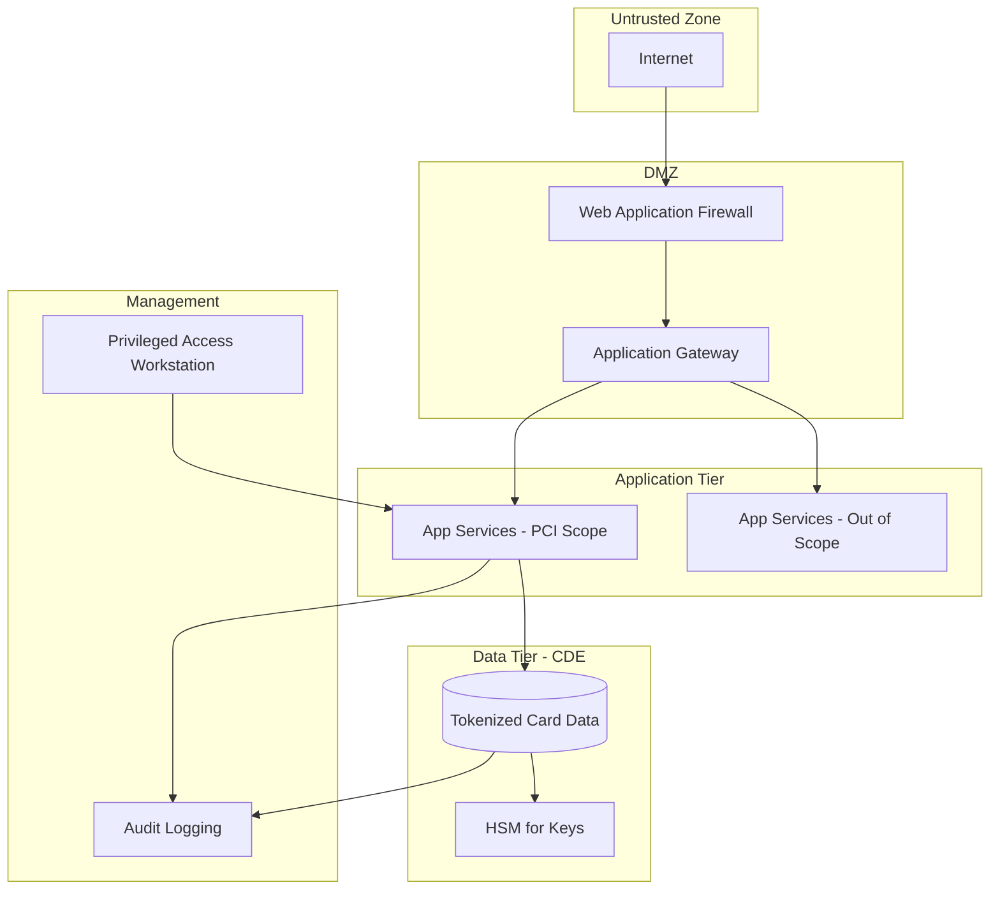
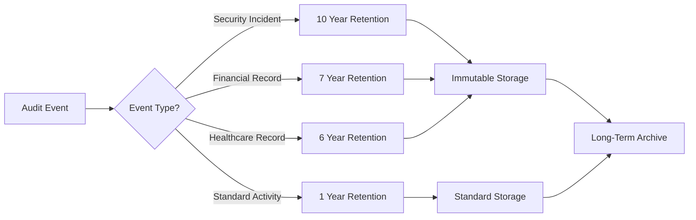
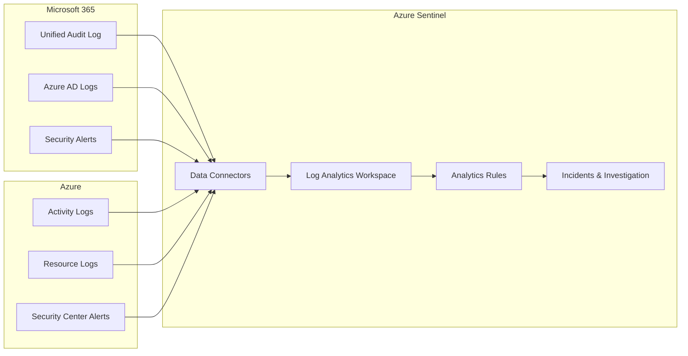
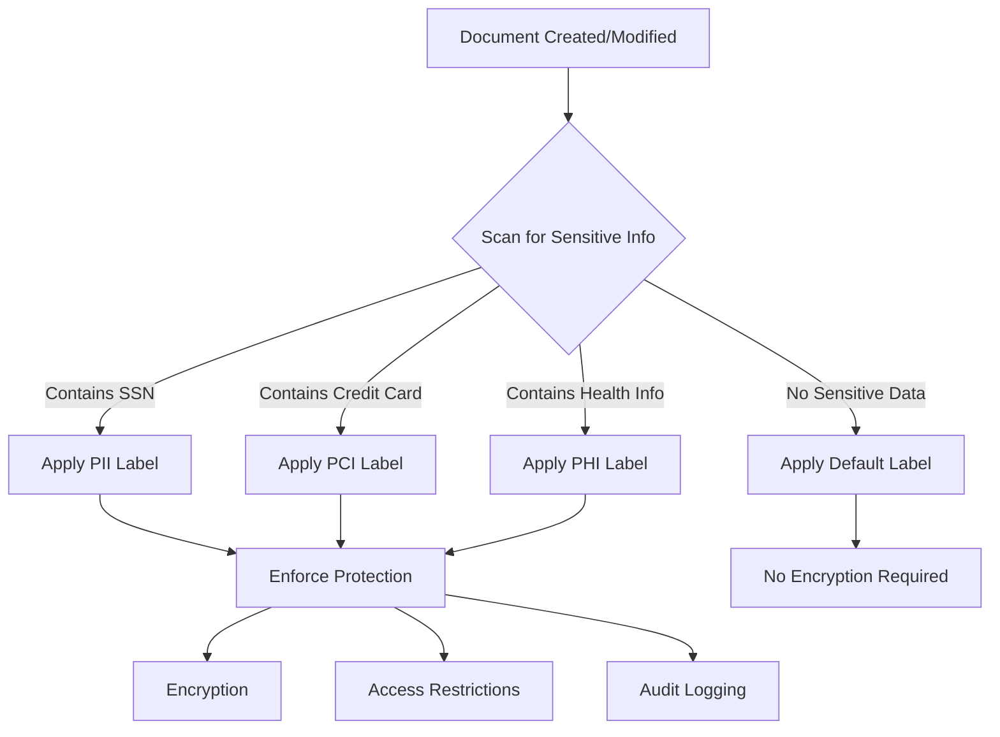
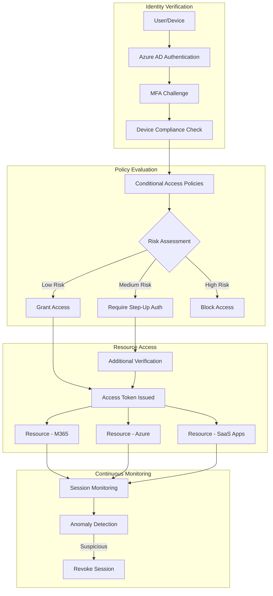
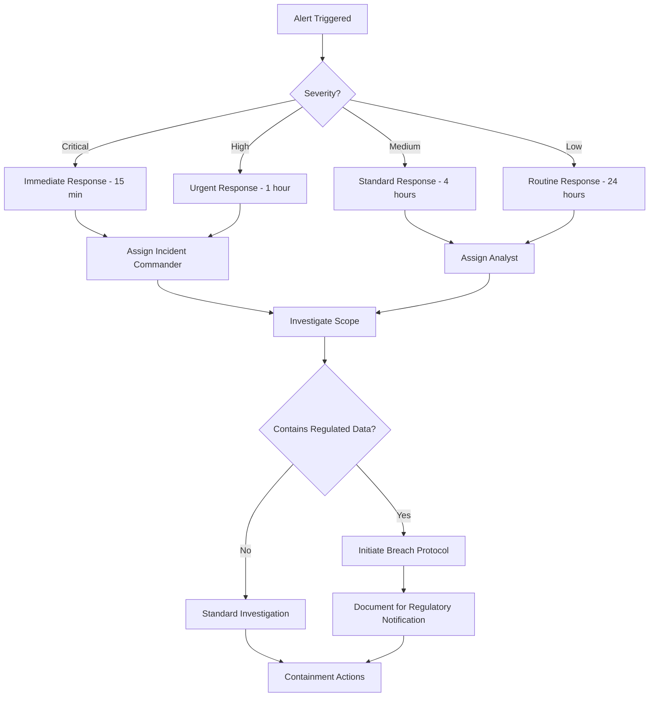
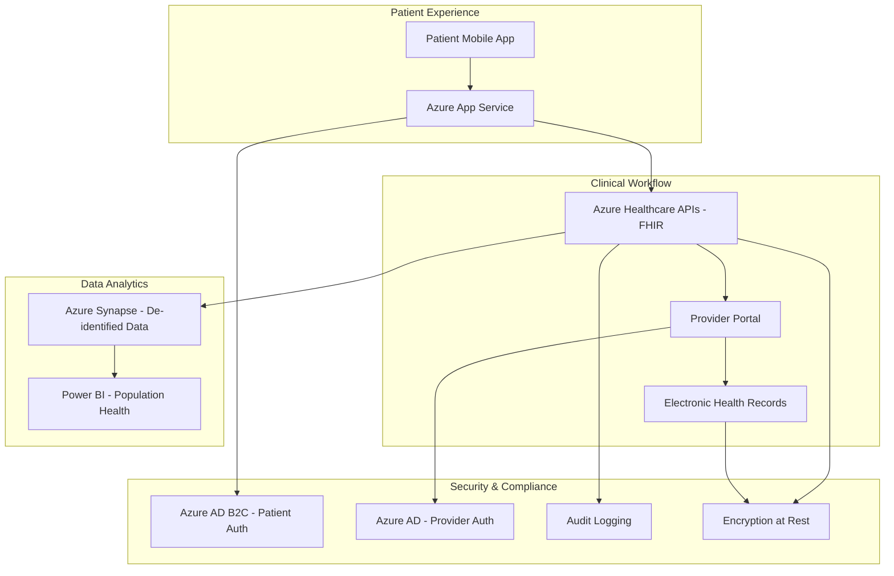
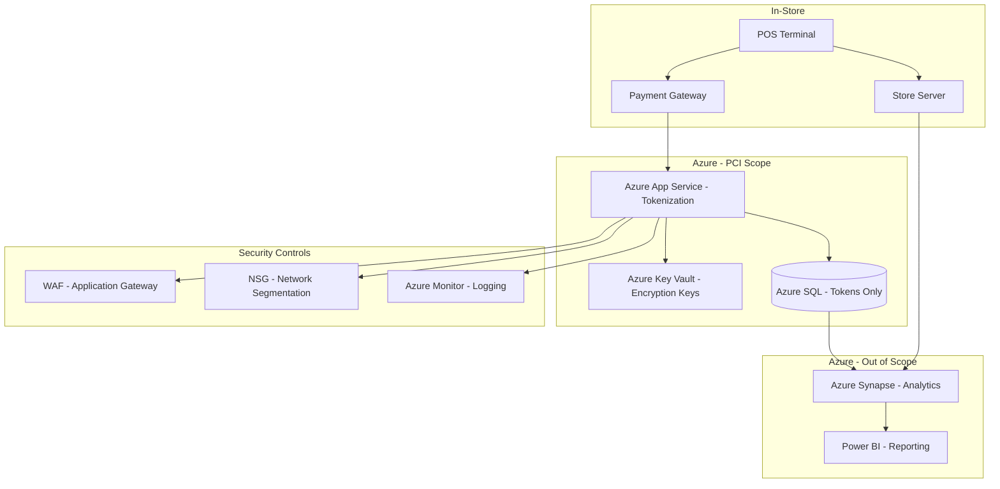

# Regulated Industries Architecture

## Overview

Organizations operating in regulated industries face unique architectural challenges requiring careful balance between innovation, security, compliance, and operational efficiency. This reference provides comprehensive guidance for architecting Microsoft cloud solutions that meet stringent regulatory requirements while enabling business objectives.

## Purpose of This Reference

This document helps enterprise architects:
- **Map regulatory requirements** to technical controls and Microsoft services
- **Implement comprehensive audit trails** for compliance verification
- **Enforce data classification** and protection across the enterprise
- **Design access controls** aligned with zero trust principles
- **Document incident response** procedures meeting regulatory standards
- **Maintain compliance evidence** for audits and certifications
- **Address industry-specific requirements** across major regulated sectors

## Compliance Framework Mapping

### Understanding Compliance Frameworks

Compliance frameworks provide structured approaches to managing security, privacy, and operational requirements. Microsoft cloud services undergo rigorous audits and maintain certifications across numerous frameworks, enabling customers to inherit baseline compliance.

### Major Global Compliance Frameworks

**GDPR (General Data Protection Regulation)**

**Scope**: EU and EEA data subjects, regardless of company location

**Key Requirements**:
- Lawful basis for processing personal data
- Data subject rights (access, erasure, portability, rectification)
- Privacy by design and default
- Data Protection Impact Assessments (DPIAs)
- Breach notification within 72 hours
- Data Processing Agreements (DPAs) with processors
- Cross-border transfer mechanisms (SCCs, BCRs)

**Microsoft Services Support**:
- Microsoft Purview for data governance and protection
- Azure Policy for geographic restrictions
- Audit logs for access tracking
- Data Subject Request (DSR) tools
- DPA included in service terms
- EU Data Boundary commitment

**Architecture Patterns**:


**HIPAA (Health Insurance Portability and Accountability Act)**

**Scope**: US healthcare providers, payers, and business associates

**Key Requirements**:
- Protected Health Information (PHI) safeguards
- Administrative, physical, and technical safeguards
- Business Associate Agreements (BAAs)
- Risk assessment and management
- Breach notification procedures
- Employee training and access controls

**Microsoft Services Support**:
- HIPAA BAA available for covered services
- Azure Government for sensitive healthcare data
- Encryption for PHI at rest and in transit
- Audit logging meeting HIPAA standards
- Access controls and authentication

**Covered Azure Services** (with BAA):
- Azure SQL Database, Cosmos DB
- Azure Storage, Azure Backup
- Azure App Service, Azure Functions
- Azure Virtual Machines
- Azure Active Directory
- Microsoft 365 (with BAA)

**SOX (Sarbanes-Oxley Act)**

**Scope**: US publicly traded companies and subsidiaries

**Key Requirements**:
- Financial reporting controls (Section 302, 404)
- IT general controls (ITGC)
- Change management procedures
- Access controls and segregation of duties
- Audit trails for financial systems
- Data retention policies

**Microsoft Services Support**:
- SOC 1 Type 2 reports for control evaluation
- Azure Policy for enforcing controls
- Immutable storage for audit evidence
- Privileged Identity Management for SOD
- Detailed audit logs

**Architecture Considerations**:
- Implement approval workflows for financial system changes
- Separate development, test, production environments
- Restrict privileged access with just-in-time activation
- Retain audit logs per retention schedule (typically 7 years)
- Document and test disaster recovery procedures

**PCI-DSS (Payment Card Industry Data Security Standard)**

**Scope**: Organizations processing, storing, or transmitting payment card data

**Key Requirements** (12 Requirements, 6 Goals):
1. Build and maintain secure network and systems
2. Protect cardholder data
3. Maintain vulnerability management program
4. Implement strong access control measures
5. Regularly monitor and test networks
6. Maintain information security policy

**Microsoft Services Support**:
- PCI-DSS 3.2.1 compliance for in-scope services
- Azure Security Center for security monitoring
- Azure Key Vault for encryption key management
- Network Security Groups for network segmentation
- Azure DDoS Protection

**Cardholder Data Environment (CDE) Isolation**:


**FedRAMP (Federal Risk and Authorization Management Program)**

**Scope**: US federal agencies and service providers

**Impact Levels**:
- **Low**: Loss of confidentiality, integrity, or availability has limited adverse effect
- **Moderate**: Serious adverse effect
- **High**: Severe or catastrophic adverse effect

**Microsoft Services Support**:
- Azure Government (FedRAMP High)
- Microsoft 365 Government (GCC, GCC High, DoD)
- Dynamics 365 Government
- Power Platform Government

**Additional Requirements for High**:
- US citizenship for support personnel
- US-based data centers
- Enhanced background checks
- Dedicated infrastructure
- Government-only tenant isolation

**ISO 27001 (Information Security Management)**

**Scope**: Global information security standard

**Key Requirements**:
- Information Security Management System (ISMS)
- Risk assessment methodology
- Statement of Applicability (SoA)
- 114 controls across 14 domains
- Continuous improvement (Plan-Do-Check-Act)
- Internal and external audits

**Microsoft Services Support**:
- ISO 27001 certified for major cloud services
- ISO 27017 (cloud-specific controls)
- ISO 27018 (privacy in cloud)
- ISO 27701 (privacy information management)

**Control Domains**:
1. Information security policies
2. Organization of information security
3. Human resource security
4. Asset management
5. Access control
6. Cryptography
7. Physical and environmental security
8. Operations security
9. Communications security
10. System acquisition, development and maintenance
11. Supplier relationships
12. Information security incident management
13. Business continuity management
14. Compliance

## Robust Audit Trail Implementation

### Microsoft Purview Audit Solution

**Audit Capabilities**:

**Mailbox Auditing**:
- Owner, delegate, and admin actions
- Folder-level access
- Message send, receive, delete
- Permissions changes
- Retention: 365 days (E5), 90 days (E3)

**SharePoint and OneDrive Auditing**:
- File and folder access
- Sharing activities
- Permission changes
- Site administration
- User activities (view, modify, download, delete)

**Azure AD Auditing**:
- Sign-in logs (interactive and non-interactive)
- Directory changes (users, groups, apps)
- Privileged operations
- Conditional Access policy changes
- Administrative unit modifications

**Microsoft Teams Auditing**:
- Team creation and deletion
- Channel changes
- Member additions/removals
- Settings modifications
- App installations

### Audit Log Retention Strategy

**Retention Tiers**:



**Implementation**:

1. **Enable Unified Audit Log**:
   ```powershell
   # Enable organization-wide
   Set-AdminAuditLogConfig -UnifiedAuditLogIngestionEnabled $true
   ```

2. **Create Audit Log Retention Policies**:
   ```powershell
   New-UnifiedAuditLogRetentionPolicy -Name "Financial Records" `
       -Description "7 year retention for SOX compliance" `
       -RetentionDuration TenYears `
       -RecordTypes ExchangeItem, SharePointFileOperation
   ```

3. **Export to Long-Term Storage**:
   - Use Microsoft Purview Audit (Premium) for long-term retention
   - Export to Azure Storage for additional processing
   - Integrate with SIEM for security monitoring
   - Maintain immutable copies for compliance

### Advanced Audit Features

**Microsoft Purview Audit (Premium)**:
- Extended retention (up to 10 years)
- Audit log retention policies
- Intelligent insights (anomaly detection)
- High-value crucial events
- Higher bandwidth for Office 365 Management API
- Requires E5 or add-on license

**Crucial Events for Investigation**:
- Mail items accessed
- Mail items sent
- Search query performed (eDiscovery)
- User logged in (Azure AD)
- User account created/deleted
- Permission changes to sensitive data

### SIEM Integration

**Azure Sentinel Integration**:



**Benefits**:
- Centralized security monitoring
- Automated threat detection
- Compliance reporting dashboards
- Long-term retention in Log Analytics
- Machine learning-based anomaly detection
- Integration with SOAR (Security Orchestration, Automation, Response)

## Data Classification Enforcement

### Microsoft Purview Information Protection

**Data Classification Hierarchy**:

**Sensitivity Labels**:
- Public
- Internal
- Confidential
- Highly Confidential
- Regulated (e.g., HIPAA, PCI)

**Sub-Labels for Context**:
- Confidential \ Legal
- Confidential \ Finance
- Confidential \ HR
- Highly Confidential \ Executive
- Regulated \ PHI
- Regulated \ PII
- Regulated \ Financial

### Automatic Classification

**Trainable Classifiers**:
- Pre-trained models (resumes, source code, financial documents)
- Custom trainable classifiers using machine learning
- Requires 50-500 sample documents for training
- Available with E5 or Compliance add-on

**Sensitive Information Types (SIT)**:
- Built-in (credit cards, SSN, passport numbers, etc.)
- Custom regex patterns
- Keyword dictionaries
- Exact Data Match (EDM) for databases
- Document fingerprinting

**Auto-Labeling Policies**:



**Implementation**:

1. **Define Sensitivity Labels**:
   - Create label taxonomy in Microsoft Purview compliance portal
   - Configure protection settings (encryption, watermarks, access controls)
   - Publish labels to users and groups

2. **Configure Auto-Labeling**:
   - Create policies based on sensitive information types
   - Set confidence threshold (recommended 75-85%)
   - Choose simulation mode vs. automatic application
   - Monitor and refine based on results

3. **Enforce Protection**:
   - Encrypt highly sensitive documents
   - Apply rights management (view-only, no-forward)
   - Block external sharing for regulated data
   - Require justification for label changes

### Data Loss Prevention (DLP)

**DLP Policy Framework**:

**Policy Components**:
1. **Locations**: Exchange, SharePoint, OneDrive, Teams, Devices, Power Platform
2. **Conditions**: Sensitive info types, labels, document properties
3. **Actions**: Block, warn, notify, encrypt, restrict access
4. **Exceptions**: Specific users, groups, or scenarios
5. **Notifications**: User education, admin alerts

**Common DLP Policies for Regulated Industries**:

**Healthcare (HIPAA)**:
```
Policy: Prevent PHI Sharing
Conditions: Content contains PHI (Medical records, patient IDs)
Locations: Exchange, SharePoint, OneDrive, Teams, Endpoints
Actions:
  - Block external sharing
  - Require business justification for sharing
  - Notify compliance team
  - Apply PHI sensitivity label
```

**Financial Services (SOX, PCI)**:
```
Policy: Protect Financial Data
Conditions:
  - Credit card numbers detected OR
  - Financial reports labeled as Confidential
Locations: All
Actions:
  - Block sharing outside organization
  - Block upload to non-corporate cloud services
  - Encrypt when sent via email
  - Alert security team on policy violation
```

**Government (FedRAMP, ITAR)**:
```
Policy: Controlled Unclassified Information (CUI)
Conditions: CUI label applied or controlled technical data
Locations: All Microsoft 365, Azure DevOps
Actions:
  - Block sharing with non-US persons
  - Require MFA for access
  - Block download to unmanaged devices
  - Create incident for investigation
```

### Endpoint DLP

**Microsoft Purview Endpoint DLP** (requires E5 Compliance or DLP add-on):

**Protected Activities**:
- Copy to removable media
- Copy to cloud services
- Print documents
- Copy to clipboard
- Share via Bluetooth
- Upload to browser

**Use Case Example - Manufacturing IP Protection**:
```
Policy: Prevent CAD File Exfiltration
Conditions:
  - File extension .dwg, .dxf, .sldprt OR
  - Trainable classifier: Engineering Drawings
Devices: All Windows 10/11 workstations
Actions:
  - Block copy to USB drives
  - Block upload to personal OneDrive/Dropbox
  - Allow print with watermark
  - User notification with compliance guidance
```

## Access Control Refinement

### Zero Trust Architecture

**Zero Trust Principles**:
1. **Verify explicitly**: Always authenticate and authorize
2. **Least privilege access**: Just-in-time and just-enough-access
3. **Assume breach**: Minimize blast radius, segment access

**Zero Trust Implementation with Microsoft**:



### Conditional Access Policies

**Policy Design for Regulated Industries**:

**Policy 1: Require MFA for All Users**
```
Name: Baseline - Require MFA
Assignments:
  Users: All users
  Cloud apps: All cloud apps
Conditions: All sign-ins
Access controls:
  Grant: Require multi-factor authentication
  Session: Sign-in frequency = Every time
```

**Policy 2: Require Compliant or Hybrid Azure AD Joined Device**
```
Name: Healthcare - Require Managed Devices for PHI Access
Assignments:
  Users: All users
  Cloud apps:
    - SharePoint Online
    - OneDrive
    - Exchange Online
    - Electronic Health Record System
Conditions:
  Location: Any location
Access controls:
  Grant:
    - Require MFA
    - Require device to be compliant
    - Require Hybrid Azure AD joined device (for domain-joined scenarios)
  Session: Use app enforced restrictions
```

**Policy 3: Block Access from Non-Approved Countries**
```
Name: Compliance - Geographic Restrictions
Assignments:
  Users: All users
  Cloud apps: All cloud apps
Conditions:
  Locations:
    Exclude: Approved countries (US, UK, Canada)
    Include: Any location not in exclusion list
Access controls:
  Block access
Exclusions:
  - Emergency access accounts
  - Approved traveling executives (via group)
```

**Policy 4: Require Privileged Access Workstation for Admin**
```
Name: Security - Privileged Admin Access
Assignments:
  Users: Directory role = Global Admin, Exchange Admin, Security Admin
  Cloud apps: Microsoft Admin Portals
Conditions:
  Device platforms: Windows
Access controls:
  Grant:
    - Require MFA
    - Require compliant device
    - Require device claim: PAW=True
  Session:
    - Sign-in frequency: 4 hours
    - Persistent browser session: Never
```

### Privileged Access Management

**Just-In-Time (JIT) Access with Azure AD PIM**:

**Benefits**:
- No standing administrative privileges
- Time-bound access (1-24 hours typical)
- Approval workflows for sensitive roles
- Access reviews for compliance
- Audit trail of all activations

**Implementation for Regulated Industries**:

1. **Eliminate Standing Privileges**:
   - Identify all users with admin roles
   - Remove direct role assignments
   - Configure as eligible (not active)

2. **Configure Activation Requirements**:
   ```
   Role: Global Administrator
   Activation:
     - Maximum duration: 8 hours
     - Require MFA: Yes
     - Require approval: Yes (two approvers)
     - Require justification: Yes
     - Require ticket number: Yes
   ```

3. **Implement Access Reviews**:
   - Quarterly reviews of eligible assignments
   - Manager attestation for continued need
   - Automatic removal if not approved
   - Audit logging for compliance evidence

4. **Alert on Privileged Operations**:
   - Activate Azure AD Identity Protection
   - Configure alerts for privileged role activations
   - Integrate with SIEM for investigation
   - Require incident documentation

### Privileged Access Workstations (PAW)

**PAW Architecture for Regulated Industries**:

- **Dedicated devices** for administrative tasks
- **Isolated from internet browsing** and email
- **Hardened configurations** (CIS benchmarks)
- **Conditional Access enforcement** (device compliance claim)
- **Just-in-time admin access** (PIM integration)

**Compliance Mapping**:
- **PCI-DSS Requirement 8.3**: Secure privileged access to CDE
- **NIST 800-53 AC-6**: Least privilege and privilege management
- **SOX ITGC**: Segregation of duties for IT administrators

## Incident Response Procedure Documentation

### Incident Response Framework

**NIST Incident Response Lifecycle**:
1. Preparation
2. Detection and Analysis
3. Containment, Eradication, Recovery
4. Post-Incident Activity

### Preparation Phase

**Regulatory Requirements**:
- **HIPAA**: Documented incident response procedures
- **GDPR**: Breach notification within 72 hours
- **PCI-DSS**: Incident response plan (Requirement 12.10)
- **SOX**: IT incident management controls

**Microsoft 365 Preparation Checklist**:
- [ ] Enable Microsoft 365 Defender
- [ ] Configure Azure Sentinel for centralized logging
- [ ] Implement Microsoft Purview Insider Risk Management
- [ ] Enable Advanced Audit logging
- [ ] Configure alert policies for security events
- [ ] Document escalation procedures
- [ ] Assign incident response roles
- [ ] Conduct tabletop exercises
- [ ] Establish communication templates
- [ ] Integrate with ticketing system (ServiceNow, Jira)

### Detection and Analysis

**Detection Mechanisms**:

**Microsoft Defender for Endpoint**:
- Automated investigation and remediation
- Threat and vulnerability management
- Attack surface reduction
- Endpoint detection and response (EDR)

**Microsoft Defender for Office 365**:
- Anti-phishing, anti-spam, anti-malware
- Safe Attachments and Safe Links
- Automated investigation and response (AIR)
- Threat Explorer for investigation

**Microsoft Defender for Cloud Apps**:
- Anomalous activity detection
- Shadow IT discovery
- Conditional Access App Control
- OAuth app governance

**Alert Investigation Process**:



### Containment, Eradication, Recovery

**Containment Actions**:

**Account Compromise**:
1. Revoke all active sessions
2. Reset password and revoke refresh tokens
3. Disable account if necessary
4. Enable MFA if not already configured
5. Review and remove suspicious inbox rules, forwarding, delegates
6. Check for OAuth app grants (especially suspicious permissions)

**Malware Infection**:
1. Isolate device from network
2. Run Microsoft Defender full scan
3. Collect forensic artifacts
4. Re-image device if necessary
5. Restore from known-good backup
6. Verify no persistence mechanisms

**Data Exfiltration**:
1. Revoke external sharing links
2. Remove guest user access
3. Enable DLP policies immediately
4. Review audit logs for scope of breach
5. Notify affected individuals per regulatory requirements
6. Document timeline and affected records

### Regulatory Breach Notification

**GDPR Breach Notification**:
- **Timeline**: 72 hours to notify supervisory authority
- **Threshold**: Risk to rights and freedoms of individuals
- **Required Information**:
  - Nature of breach
  - Categories and approximate number of data subjects
  - Contact point for information
  - Likely consequences
  - Measures taken or proposed

**HIPAA Breach Notification**:
- **Timeline**: 60 days to notify affected individuals; immediate for media (500+ affected)
- **Threshold**: >5% risk of compromise to PHI
- **Required Information**:
  - Description of breach
  - Types of information involved
  - Steps individuals should take
  - What entity is doing to investigate and prevent recurrence
  - Contact information

**Microsoft Tools for Breach Response**:
- **Microsoft Purview eDiscovery**: Identify scope of affected data
- **Microsoft Purview Data Subject Requests**: Facilitate individual notifications
- **Azure AD Sign-in Logs**: Determine unauthorized access timeline
- **Microsoft 365 Audit Logs**: Document when breach occurred and actions taken

### Post-Incident Activity

**Lessons Learned Meeting** (within 2 weeks of incident):
- What happened and timeline
- What went well
- What could be improved
- Action items for improvement
- Update incident response procedures

**Compliance Documentation**:
- Incident report with timeline
- Root cause analysis
- Affected systems and data
- Notification records (who, when, how)
- Remediation actions
- Preventive measures implemented
- Store in immutable audit repository

## Regulatory Alignment Documentation Maintenance

### Compliance Documentation Repository

**Required Documentation by Framework**:

**ISO 27001**:
- Information Security Policy
- Risk Assessment Methodology and Results
- Statement of Applicability (SoA)
- Asset Inventory
- Access Control Procedures
- Incident Management Procedures
- Business Continuity Plans
- Internal Audit Reports
- Management Review Minutes

**SOC 2**:
- System Description
- Control Objectives and Controls
- Risk Assessment
- Change Management Procedures
- Access Control Matrix
- Vendor Management Procedures
- Monitoring and Logging Procedures
- Incident Response Plan

**HIPAA**:
- Security Risk Assessment
- Policies and Procedures (Administrative, Physical, Technical Safeguards)
- Business Associate Agreements
- Workforce Training Records
- Incident Response and Breach Notification Procedures
- Audit Logs and Access Reports
- Contingency Plans

### Evidence Collection Automation

**Microsoft Purview Compliance Manager**:

**Features**:
- Pre-built assessments for 300+ regulations
- Automated control testing
- Improvement action tracking
- Evidence collection and storage
- Compliance score calculation
- Executive reporting

**Implementation**:
1. Add assessments for applicable regulations (HIPAA, GDPR, ISO 27001, etc.)
2. Assign improvement actions to responsible parties
3. Upload evidence for manual controls
4. Monitor automated control assessments
5. Generate compliance reports for auditors
6. Track progress over time

**Evidence Types**:
- **Technical Evidence**: Automatically collected (policy configurations, audit logs, device compliance)
- **Procedural Evidence**: Manually uploaded (signed policies, training records, meeting minutes)
- **Test Results**: Manually documented (penetration tests, DR drills, access reviews)

### Continuous Compliance Monitoring

**Automated Monitoring with Azure Policy**:

```json
{
  "displayName": "Audit VMs that do not use managed disks for HIPAA compliance",
  "description": "HIPAA requires encryption at rest for PHI",
  "policyRule": {
    "if": {
      "allOf": [
        {
          "field": "type",
          "equals": "Microsoft.Compute/virtualMachines"
        },
        {
          "field": "Microsoft.Compute/virtualMachines/storageProfile.osDisk.managedDisk",
          "exists": "false"
        },
        {
          "field": "tags.DataClassification",
          "equals": "PHI"
        }
      ]
    },
    "then": {
      "effect": "audit"
    }
  }
}
```

**Compliance Dashboard**:
- Real-time compliance posture
- Policy violations and trends
- Remediation tracking
- Executive summary view
- Drill-down to specific resources
- Export for audit reporting

## Industry-Specific Requirements

### Financial Services

**Applicable Regulations**:
- SOX (Sarbanes-Oxley Act)
- PCI-DSS (Payment Card Industry)
- FINRA (Financial Industry Regulatory Authority)
- GLBA (Gramm-Leach-Bliley Act)
- Basel III/IV (International banking standards)
- Dodd-Frank Act

**Architecture Considerations**:

**Trading Systems**:
- Ultra-low latency requirements (<10ms)
- Market data integrity and auditability
- Segregation of client funds and assets
- Transaction logging and reconstruction
- Use Azure ExpressRoute for dedicated connectivity
- Deploy in Azure Availability Zones for high availability

**Risk Management**:
- Real-time risk calculations
- Stress testing and scenario analysis
- Position and exposure tracking
- Use Azure Synapse Analytics for big data processing
- Implement data lineage with Microsoft Purview

**Regulatory Reporting**:
- Automated report generation
- Audit trail for all reports
- Immutable storage for retention (7+ years)
- Use Azure Data Factory for ETL
- Store in Azure Storage with WORM (Write Once, Read Many)

**Key Controls**:
- [ ] Segregation of duties (SOX 404)
- [ ] Change management with approvals
- [ ] Quarterly access recertification
- [ ] Immutable audit logs (7 year retention)
- [ ] Encryption for data at rest and in transit (GLBA)
- [ ] Network segmentation for PCI environments
- [ ] Privileged access management
- [ ] Regular penetration testing
- [ ] Business continuity testing (annual minimum)

### Healthcare

**Applicable Regulations**:
- HIPAA (Health Insurance Portability and Accountability Act)
- HITECH (Health Information Technology for Economic and Clinical Health)
- 21 CFR Part 11 (FDA electronic records for pharmaceuticals)
- GDPR (for EU operations)

**Protected Health Information (PHI) Safeguards**:

**Technical Safeguards**:
- [ ] Unique user identification
- [ ] Emergency access procedures
- [ ] Automatic log-off from workstations
- [ ] Encryption and decryption (at rest and in transit)
- [ ] Audit controls and logging
- [ ] Integrity controls (checksums for data)
- [ ] Transmission security (TLS 1.2+)

**Administrative Safeguards**:
- [ ] Security officer designated
- [ ] Workforce training program
- [ ] Information access management
- [ ] Business associate agreements
- [ ] Contingency planning (backup, disaster recovery, emergency mode)
- [ ] Evaluation and management review

**Physical Safeguards**:
- [ ] Facility access controls
- [ ] Workstation use and security policies
- [ ] Device and media controls

**Microsoft Healthcare Cloud**:
- Industry-specific capabilities for health data
- HIPAA/HITECH compliance built-in
- Integration with FHIR (Fast Healthcare Interoperability Resources)
- Patient 360 view
- Care coordination workflows
- Azure Health Data Services

**Use Case: Telemedicine Platform**:


### Government

**Applicable Standards**:
- FedRAMP (Federal Risk and Authorization Management Program)
- FISMA (Federal Information Security Management Act)
- ITAR (International Traffic in Arms Regulations)
- CMMC (Cybersecurity Maturity Model Certification) - Defense contractors
- CJIS (Criminal Justice Information Services) - Law enforcement

**Microsoft Government Clouds**:

**Azure Government**:
- FedRAMP High authorized
- DoD Impact Level 5 (IL5) provisional authorization
- Screening of personnel (US citizens)
- Physical and logical separation
- Dedicated regions (US Gov Virginia, US Gov Arizona, US Gov Texas, DoD regions)

**Microsoft 365 Government**:
- **GCC (Government Community Cloud)**: FedRAMP Moderate
- **GCC High**: FedRAMP High
- **DoD**: DoD IL5

**CMMC Implementation (Defense Industrial Base)**:

**CMMC Levels**:
- **Level 1**: Basic cyber hygiene (17 practices)
- **Level 2**: Advanced cyber hygiene (110 practices, aligned with NIST 800-171)
- **Level 3**: Expert cyber hygiene (110 practices + additional advanced practices)

**NIST 800-171 Mapping to Microsoft Services**:
```
Access Control (AC):
  - Azure AD Conditional Access
  - Privileged Identity Management
  - Multi-factor authentication

Audit and Accountability (AU):
  - Microsoft Purview Audit
  - Azure Monitor
  - Log Analytics

Identification and Authentication (IA):
  - Azure AD authentication
  - Passwordless authentication
  - Phishing-resistant MFA

System and Communications Protection (SC):
  - Azure DDoS Protection
  - Network Security Groups
  - Application Gateway with WAF
  - Encryption (TLS 1.2+, BitLocker, Azure Storage encryption)
```

### Manufacturing

**Applicable Standards**:
- ITAR (Export controls for defense articles)
- EAR (Export Administration Regulations)
- TISAX (Trusted Information Security Assessment Exchange - Automotive)
- ISO 27001 (Information security)

**Intellectual Property Protection**:

**Design File Protection** (CAD, simulations, specifications):
- [ ] Apply Highly Confidential labels automatically
- [ ] Endpoint DLP to prevent USB copy
- [ ] Block personal cloud storage (Dropbox, Google Drive)
- [ ] Watermark on print and view
- [ ] Track access and downloads
- [ ] Require justification for external sharing

**Supply Chain Security**:
- [ ] Vendor risk assessment program
- [ ] Secure file exchange portals (SharePoint with external access controls)
- [ ] Contractual data protection requirements
- [ ] Third-party access reviews (quarterly)
- [ ] Microsoft Defender for Cloud Apps for shadow IT

**Operational Technology (OT) Integration**:
- [ ] Network segmentation (IT/OT separation)
- [ ] Azure IoT Edge for local processing
- [ ] Azure Sphere for secured MCU
- [ ] Anomaly detection for industrial systems
- [ ] Read-only data extraction from OT to IT

### Retail

**Applicable Regulations**:
- PCI-DSS (Payment Card Industry)
- GDPR / CCPA (Consumer privacy)
- Industry-specific (e.g., UK Payment Services Regulations)

**Point of Sale (POS) Security**:

**PCI-DSS Compliance Architecture**:


**Tokenization Strategy**:
- Never store full credit card numbers (PANs)
- Use tokenization service (Azure Payment HSM or third-party)
- Store tokens for transaction lookup
- Minimize PCI-DSS scope to tokenization gateway only

**Customer Data Privacy (GDPR/CCPA)**:
- [ ] Consent management for marketing
- [ ] Customer data subject request portal
- [ ] Automated PII discovery and classification
- [ ] Data retention policies (purge after legal requirement)
- [ ] Right to erasure implementation
- [ ] Portability (export customer data)

## Architecture Decision Framework

**Regulated Industry Readiness Checklist**:

**Phase 1: Requirements Analysis** (See phase-vision.md)
- [ ] Identify all applicable regulations
- [ ] Document specific compliance requirements
- [ ] Map requirements to technical controls
- [ ] Determine required certifications
- [ ] Assess Microsoft service compliance coverage
- [ ] Identify gaps requiring additional controls

**Phase 2: Architecture Design** (See phase-validate.md)
- [ ] Select appropriate Microsoft cloud (Public, Government, etc.)
- [ ] Design data classification and labeling scheme
- [ ] Define access control model
- [ ] Plan audit logging and retention strategy
- [ ] Design network segmentation and isolation
- [ ] Plan encryption strategy (at rest, in transit)
- [ ] Document architecture decisions (See architecture-decision-records.md)

**Phase 3: Implementation** (See phase-construct.md and phase-deploy.md)
- [ ] Deploy baseline security controls
- [ ] Configure sensitivity labels and auto-classification
- [ ] Implement DLP policies
- [ ] Deploy Conditional Access policies
- [ ] Enable audit logging
- [ ] Configure SIEM integration
- [ ] Test all controls

**Phase 4: Ongoing Operations** (See phase-evolve.md)
- [ ] Monitor compliance score continuously
- [ ] Conduct regular access reviews
- [ ] Perform vulnerability assessments
- [ ] Execute incident response drills
- [ ] Maintain compliance documentation
- [ ] Prepare for audits proactively
- [ ] Stay current with regulatory changes

## Best Practices

1. **Start with data classification**: You can't protect what you don't know about
2. **Automate wherever possible**: Manual processes don't scale and are error-prone
3. **Defense in depth**: Layer controls (identity, device, data, network)
4. **Assume breach**: Design for containment and rapid response
5. **Document everything**: Compliance requires evidence, not just controls
6. **Test regularly**: DR drills, penetration tests, access reviews, incident simulations
7. **Engage compliance early**: Don't retrofit compliance into existing architecture
8. **Leverage Microsoft's compliance inheritance**: Use built-in controls rather than rebuilding

## Reference Links

- [Microsoft Compliance Offerings](https://learn.microsoft.com/en-us/compliance/regulatory/offering-home)
- [Microsoft Trust Center](https://www.microsoft.com/en-us/trust-center)
- [Azure Compliance Documentation](https://learn.microsoft.com/en-us/azure/compliance/)
- [Microsoft Purview Documentation](https://learn.microsoft.com/en-us/purview/)
- [Azure Government](https://azure.microsoft.com/en-us/explore/global-infrastructure/government/)

## Related References

- **Security Frameworks**: See azure-waf-security.md, powerplatform-waf-security.md
- **Data Governance**: See m365-specifics.md for Microsoft 365 capabilities
- **Multi-Geo Compliance**: See multi-geo-deployments.md for data residency
- **Migration Compliance**: See large-scale-migrations.md for maintaining compliance during transitions
- **Methodology**: See delivery-methodology-overview.md for overall approach
