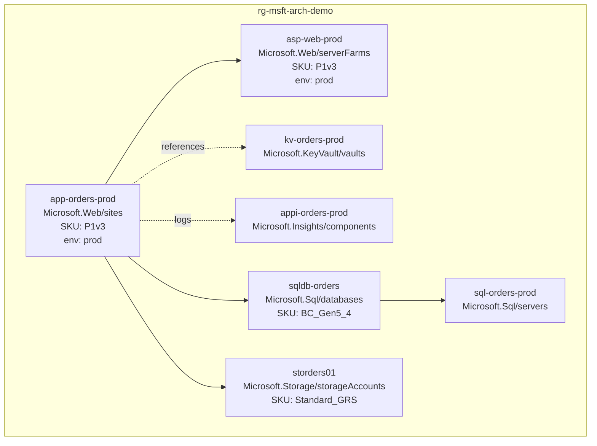

# Live-Architecture Diagram from Resource Group (Mermaid-from-RG)

Generates a Mermaid `graph TD` of an Azure deployment by querying Azure Resource Graph and emitting a `.mmd` plus a rendered `.svg`. Used by the `docs` skill when a stakeholder asks for an "as-built" or "live" diagram of an existing deployment, not a target-state HLD.

Inspiration credit: pattern derived from `awesome-copilot/azure-resource-visualizer` (MIT). Inspiration only, no code ported.

## When to use

Trigger phrases: "diagram our current setup", "show what's in resource group X", "live architecture", "as-built diagram", "render the deployment". For target-state diagrams, use the C4 templates instead (`standards/references/diagrams/c4-diagram-guide.md`).

## Step 1: Query Azure Resource Graph

Auth requirement: at minimum `Reader` on the target resource group (or on a parent management group if the RG inherits). For private-link-only resources behind a hub-spoke, `Reader` on the network-watcher RG too.

Use `az graph query` with the Resource Graph KQL dialect:

```bash
RG="rg-msft-arch-demo"

az graph query -q "
resources
| where resourceGroup =~ '$RG'
| project id, type, name, location, sku, tags, properties
| order by type asc, name asc
" --output json > .scratch/diagrams/$RG-resources.json
```

For multi-RG queries (typical hub-spoke):

```bash
az graph query -q "
resources
| where resourceGroup in ('rg-hub','rg-spoke-app','rg-spoke-data')
| project id, type, name, resourceGroup, sku, tags
" > .scratch/diagrams/multi-rg.json
```

Page large RGs by `type` to stay under the 1000-row default limit:

```bash
for type in 'microsoft.web/sites' 'microsoft.sql/servers' 'microsoft.keyvault/vaults' 'microsoft.storage/storageaccounts'; do
  az graph query -q "resources | where resourceGroup =~ '$RG' and type =~ '$type'" >> .scratch/diagrams/$RG-resources.jsonl
done
```

## Step 2: Generate Mermaid `graph TD`

Map each resource to a node. Encode resource type, SKU, and a curated tag set (`environment`, `cost-center`, `owner`) into the label. Quote labels that contain spaces or parens.

Worked example, 7 resources (App Service plan + web app + SQL server + SQL DB + Key Vault + Storage + App Insights):



Node-label template:

```
"<short-name><br/>
<resource-type><br/>
SKU: <sku.name or sku.tier or 'n/a'><br/>
env: <tags.environment or 'untagged'>"
```

## Step 3: Derive edges

Three sources, in priority order:

1. `properties.dependsOn` (ARM-resolved). When present, this is authoritative.
2. Naming convention or property reference: `microsoft.web/sites` to `serverFarms` via `properties.serverFarmId`; `microsoft.sql/databases` to `microsoft.sql/servers` via the parent `id` segment; `microsoft.containerregistry/registries` to AKS via image references.
3. Network association: subnet membership (`properties.subnetId`), private endpoint targets (`properties.privateLinkServiceConnections[].properties.privateLinkServiceId`).

Encode edge style by relationship type:
- Solid arrow (`-->`) for compute-to-platform dependencies (web app to plan, db to server)
- Dashed arrow (`-. label .->`) for "references" (web app to Key Vault, web app to App Insights)
- Bold arrow (`==>`) for primary data flow (queue producer to consumer, gateway to backend)

## Step 4: Output to `docs/diagrams/`

Emit alongside HLD/LLD with deterministic filename:

```bash
RG="rg-msft-arch-demo"
mkdir -p docs/diagrams

# Write the .mmd
cat > docs/diagrams/$RG-live-architecture.mmd <<'MMD'
graph TD
  ...
MMD

# Render to SVG via mermaid-cli
npm install -g @mermaid-js/mermaid-cli  # or: brew install mermaid-cli
mmdc -i docs/diagrams/$RG-live-architecture.mmd \
     -o docs/diagrams/$RG-live-architecture.svg \
     --theme neutral
```

Cross-link the rendered SVG from the HLD's "Infrastructure Topology" section (see `references/design/hld-template.md`).

## Step 5: Failure modes

| Failure mode | Symptom | Mitigation |
|---|---|---|
| RG with >100 resources | Diagram becomes unreadable; `az graph` truncates at 1000 rows by default | Page by `type` (Step 1); render per-tier subgraphs (compute, data, networking, security) |
| Missing `dependsOn` metadata | ARM-deployed resources show all dependencies; portal-deployed often miss them | Fall back to property-reference and naming-convention heuristics (Step 3) |
| Private resources visible only via parent management group | RG-level Reader misses peered hub resources | Re-run query with management-group scope; document the auth gap in the diagram footer |
| Large stickered tag sets | Node labels become unreadable | Tag allowlist: `environment`, `cost-center`, `owner`. Drop the rest into a separate appendix table |
| Tenant-scoped or subscription-scoped resources (e.g., Entra apps) | Not returned by RG-scoped query | Explicitly call out in the diagram footer; these belong to the identity diagram, not the infra diagram |

## Step 6: Append to HLD

In the HLD's "Infrastructure Topology" section, add:

```markdown
### Live architecture (as-built)

Generated from Azure Resource Graph on <date> against resource group `<rg-name>`.
See [docs/diagrams/<rg-name>-live-architecture.svg](diagrams/<rg-name>-live-architecture.svg).

| Statistic | Value |
|---|---|
| Resources | <count> |
| Resource types | <distinct-type-count> |
| Untagged resources | <count> (see remediation backlog) |
```

## Validation checklist

- [ ] `az graph query` ran successfully against the target RG
- [ ] Output `.mmd` validates with `mmdc --parse-only`
- [ ] Rendered `.svg` opens in a browser without errors
- [ ] All resources from the JSON appear as nodes
- [ ] At least one edge per node (orphan resources flagged for follow-up)
- [ ] Tag allowlist applied (no PII or secret-looking tag values in labels)
- [ ] Filename matches `<rg-name>-live-architecture.{mmd,svg}`
- [ ] HLD cross-link added to "Infrastructure Topology"
