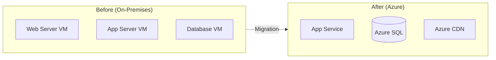

# Architecture Decision Records (ADR) Templates

## Overview

Architecture Decision Records (ADRs) document important architectural decisions along with their context and consequences. ADRs create an audit trail of why systems are built the way they are, enabling teams to understand past decisions and make informed future choices.

**Skills-First Reminder**: Before creating ANY ADR, ALWAYS check for available skills:
- **docx skill** → ADR documents for version control and collaboration
- **pdf skill** → Final ADRs for formal architectural governance
- **pptx skill** → ADR presentations for architecture review boards
- Check for user-uploaded skills for custom ADR templates or brand guidelines

**Reference**: [ADR GitHub Initiative](https://adr.github.io/) - Community-driven ADR best practices

## What is an Architecture Decision Record?

An ADR is a document that captures a significant architectural decision along with its context and consequences. Key characteristics:

- **Immutable**: Once accepted, ADRs are not edited; they are superseded by new ADRs
- **Structured Reference Number**: Format MS-[TECH]-[PLATFORM]-[PROJECT]-XXX for traceability
- **Focused on 5 Core Sections**: Ref No, Title, Context, Decision, Consequences
- **Concise**: Typically 2-3 pages, comprehensive yet focused
- **Discoverable**: Stored in version control, searchable by project and technology
- **Context-rich**: Explains technical/functional context, gaps, assumptions, and key considerations

---

## ADR Template Structure

### Standard ADR Template (use **docx skill**)

```markdown
# Architecture Decision Record

## ADR Ref No
**MS-[TECH]-[PLATFORM]-[PROJECT]-XXX**

Examples:
- MS-AI-PP-CALLCENTER-001 (AI solution, Power Platform, Call Center project)
- MS-DATA-AZURE-ANALYTICS-001 (Data solution, Azure, Analytics project)
- MS-INT-D365-CRM-001 (Integration solution, Dynamics 365, CRM project)
- MS-SEC-ENTRA-ENTERPRISE-001 (Security solution, Entra ID, Enterprise-wide)

**Format Components**:
- **MS**: Microsoft (constant prefix)
- **[TECH]**: Technology domain (AI, DATA, INT, SEC, INFRA, APP)
- **[PLATFORM]**: Microsoft platform (PP=Power Platform, AZURE, D365, M365, ENTRA)
- **[PROJECT]**: Project name (uppercase, no spaces)
- **XXX**: Sequential number (001, 002, etc.)

**Status**: [Proposed | Accepted | Deprecated | Superseded by MS-XX-XX-XX-XXX]

**Date**: [YYYY-MM-DD]

**Author(s)**: [Name(s) of decision makers]

**Reviewers**: [Name(s) of reviewers]

---

## Title
[A terse definition of what the decision is or related to]

**Example**: "Adopt Azure OpenAI Service with RAG Pattern for Customer Service Copilot"

---

## Context

### Technical Context
[Describe the technical landscape, current architecture, and relevant systems]

**Current State**:
- [Description of existing architecture or absence of solution]
- [Relevant technologies in use]
- [Integration points and dependencies]

**Functional Context**:
- [Business requirements driving this decision]
- [User needs and expectations]
- [Functional capabilities required]

### Gaps
[List current gaps that this decision addresses]

1. **[Gap 1]**: [Description of what's missing or broken]
2. **[Gap 2]**: [Description]
3. **[Gap 3]**: [Description]

### Technical Assumptions
[State assumptions being made for this decision]

1. **[Assumption 1]**: [e.g., "Azure OpenAI Service will be available in our region"]
2. **[Assumption 2]**: [e.g., "User adoption will reach 80% within 6 months"]
3. **[Assumption 3]**: [e.g., "Integration with existing CRM is technically feasible"]
4. **[Assumption 4]**: [e.g., "Budget approved for $XXX over Y years"]

### Key Considerations
[Factors that influenced the decision]

**Performance Requirements**:
- [Requirement 1]: [Target metric - e.g., "Response time < 2 seconds"]
- [Requirement 2]: [Target metric]

**Security & Compliance**:
- [Requirement 1]: [e.g., "GDPR compliance required"]
- [Requirement 2]: [e.g., "Zero Trust architecture alignment"]

**Cost Constraints**:
- [Budget limitations or cost targets]
- [TCO considerations]

**Scalability Needs**:
- [Expected growth or load requirements]
- [Geographic distribution requirements]

**Integration Requirements**:
- [Systems that must integrate]
- [Data exchange requirements]

**Operational Requirements**:
- [SLA targets - e.g., 99.9% availability]
- [Support model requirements]

---

## Decision

[Detailed description of the architecture decision]

### What We Will Do

**Primary Decision**:
[Clear, detailed statement of what was decided]

**Technology/Platform Selected**:
- [Specific technology chosen - e.g., "Azure OpenAI Service GPT-4o"]
- [Specific components - e.g., "Azure AI Search for RAG implementation"]
- [Specific patterns - e.g., "Retrieval Augmented Generation (RAG) pattern"]

**Architecture Approach**:
[Describe the architectural pattern or approach]

Example:
```
We will implement a RAG-based copilot using:
1. Azure OpenAI Service (GPT-4o model) for natural language understanding and generation
2. Azure AI Search for vector and semantic search over knowledge base
3. Dataverse as the primary data source for customer records
4. Power Platform (Power Apps + Copilot Studio) for low-code front-end
5. Azure API Management for secure API access and throttling
```

**Scope and Boundaries**:
- **In Scope**: [What this decision covers]
- **Out of Scope**: [What this decision does not cover]
- **Future Consideration**: [What might be addressed later]

**Implementation Approach**:
1. **Phase 1**: [Description - e.g., "Pilot with 50 users in customer service"]
2. **Phase 2**: [Description - e.g., "Expand to all 200 service agents"]
3. **Phase 3**: [Description - e.g., "Add multilingual support"]

**Well-Architected Framework Alignment**:
- **Reliability**: [How this decision supports reliability]
- **Security**: [How this decision supports security]
- **Cost Optimization**: [Cost considerations]
- **Operational Excellence**: [Operational benefits]
- **Performance Efficiency**: [Performance approach]

### Alternatives Considered

**Alternative 1**: [Name - e.g., "Build custom LLM using Azure ML"]
- **Pros**: [List advantages]
- **Cons**: [List disadvantages]
- **Why Not Chosen**: [Reason]

**Alternative 2**: [Name - e.g., "Use third-party SaaS copilot solution"]
- **Pros**: [List advantages]
- **Cons**: [List disadvantages]
- **Why Not Chosen**: [Reason]

**Alternative 3**: [Name - e.g., "Do nothing / manual process"]
- **Pros**: [List advantages if any]
- **Cons**: [List disadvantages]
- **Why Not Chosen**: [Reason]

---

## Consequences

[Defines what happens when we apply the decision]

### What Happens When Applied

**Immediate Effects**:
1. [Effect 1 - e.g., "Customer service agents gain AI-powered assistance for case resolution"]
2. [Effect 2 - e.g., "Knowledge base becomes searchable via natural language queries"]
3. [Effect 3 - e.g., "Average handle time expected to reduce by 30%"]

**Medium-Term Effects** (3-6 months):
1. [Effect 1 - e.g., "Agent productivity increases as AI learns from historical data"]
2. [Effect 2 - e.g., "Customer satisfaction scores improve due to faster resolution"]

**Long-Term Effects** (6-12+ months):
1. [Effect 1 - e.g., "AI copilot becomes primary knowledge source for agents"]
2. [Effect 2 - e.g., "Reduced training time for new agents"]

### Risks Mitigated

**Risk 1**: [Risk name - e.g., "Knowledge Loss from Employee Turnover"]
- **How Mitigated**: [Explanation - e.g., "AI copilot captures and codifies institutional knowledge in searchable format"]
- **Impact**: [High/Medium/Low reduction in risk]

**Risk 2**: [Risk name - e.g., "Inconsistent Customer Experience"]
- **How Mitigated**: [Explanation]
- **Impact**: [High/Medium/Low reduction in risk]

**Risk 3**: [Risk name - e.g., "Compliance Violations from Human Error"]
- **How Mitigated**: [Explanation]
- **Impact**: [High/Medium/Low reduction in risk]

### Risks Introduced

**Risk 1**: [New risk - e.g., "AI Hallucination Leading to Incorrect Information"]
- **Mitigation Strategy**: [How we'll address - e.g., "Implement RAG pattern to ground responses in verified data, add citation links, human-in-the-loop for critical decisions"]
- **Likelihood**: [High/Medium/Low]
- **Impact**: [High/Medium/Low]

**Risk 2**: [New risk - e.g., "Vendor Lock-in to Azure OpenAI"]
- **Mitigation Strategy**: [How we'll address]
- **Likelihood**: [High/Medium/Low]
- **Impact**: [High/Medium/Low]

### Operational Impacts

**Development Operations**:
- [Impact 1 - e.g., "Development team requires training on Azure OpenAI SDK and prompt engineering"]
- [Impact 2 - e.g., "CI/CD pipeline must incorporate AI model versioning and testing"]
- [Impact 3 - e.g., "New monitoring for token usage and API costs required"]

**IT Operations**:
- [Impact 1 - e.g., "24/7 monitoring of Azure OpenAI endpoint availability"]
- [Impact 2 - e.g., "Incident response procedures updated for AI-related issues"]
- [Impact 3 - e.g., "Capacity planning for concurrent API calls and throttling limits"]

**Business Operations**:
- [Impact 1 - e.g., "Customer service agents require 2-week training on copilot usage"]
- [Impact 2 - e.g., "Knowledge base management becomes critical operational process"]
- [Impact 3 - e.g., "New KPIs for AI-assisted case resolution tracking"]

**Cost Impacts**:
- **Initial Investment**: $[Amount] - [Breakdown]
- **Recurring Annual Cost**: $[Amount] - [Breakdown: licenses, consumption, support]
- **Cost Savings**: $[Amount] - [From efficiency gains, reduced errors, etc.]
- **Net Impact**: [Positive/Negative] $[Amount] over [timeframe]

**Skills/Training Requirements**:
- [Skill 1 required]: [Training plan]
- [Skill 2 required]: [Training plan]
- [Estimated training investment]: [Time and cost]

**Vendor/License Changes**:
- [New vendors/licenses required]
- [Existing vendors/licenses no longer needed]
- [Changed dependencies]

### Related Decisions

- **MS-XX-XX-XX-XXX**: [Related ADR title] - [How it relates]
- **MS-YY-YY-YY-YYY**: [Related ADR title] - [How it relates]

### Success Criteria

[How we'll measure if this decision was successful]

**Technical Success Criteria** (3 months):
- [ ] System availability ≥ 99.9%
- [ ] API response time < 2 seconds (95th percentile)
- [ ] AI response accuracy > 85% (validated against test set)

**Business Success Criteria** (6 months):
- [ ] User adoption ≥ 80% of customer service agents
- [ ] Average handle time reduced by 25%
- [ ] Customer satisfaction (CSAT) score increased by 10%
- [ ] First contact resolution rate improved by 15%

**Cost Success Criteria** (12 months):
- [ ] ROI positive (benefits exceed costs)
- [ ] Azure OpenAI consumption within budget ($XXX/month)
- [ ] Total cost of operation < projected $XXX annually

---

## References

**Documentation**:
- [Link to technical specifications]
- [Link to proof of concept results]
- [Link to vendor documentation]

**Architecture Diagrams**:
- [Link to Mermaid diagram or use inline diagram below]

```mermaid
[Insert relevant architecture diagram using Mermaid]
```

**Related Resources**:
- [Microsoft documentation references]
- [Internal wiki or knowledge base links]
- [Vendor evaluation scorecards]

---

## Approval

| Role | Name | Signature | Date |
|------|------|-----------|------|
| Solution Architect | | | |
| Enterprise Architect | | | |
| Security Architect | | | |
| Technical Lead | | | |
| Product Owner | | | |
| Approving Authority (CIO/CTO) | | | |

---

## Revision History

| Version | Date | Author | Changes |
|---------|------|--------|---------|
| 1.0 | YYYY-MM-DD | [Name] | Initial version |
| | | | |

---

**Notes**: [Any additional context, follow-up actions, or review dates]
```

---

## ADR Best Practices

### When to Create an ADR

Create an ADR for decisions that:

✅ **Structural Impact**: Affect the fundamental structure of the system
✅ **High Cost to Change**: Would be expensive to reverse later
✅ **Affect Multiple Teams**: Cross-team or enterprise-wide impact
✅ **Non-Obvious**: Not immediately obvious why this choice was made
✅ **Set Precedent**: Establish patterns for future decisions
✅ **Compliance/Security**: Impact regulatory or security posture

**Examples**:
- Choosing Azure vs. AWS vs. on-premises
- Selecting microservices vs. monolithic architecture
- Choosing SQL vs. NoSQL database
- Implementing Zero Trust security model
- Adopting Domain-Driven Design patterns

**Don't create ADRs for**:
- ❌ Routine implementation details (variable naming, code style)
- ❌ Easily reversible decisions
- ❌ Team-local decisions with no broader impact
- ❌ Obvious choices with no real alternatives

### ADR Numbering and Versioning

**Reference Number Convention**:

**Format**: `MS-[TECH]-[PLATFORM]-[PROJECT]-XXX`

**Components Explained**:
- **MS**: Microsoft (constant prefix for all ADRs)
- **[TECH]**: Technology domain abbreviation
  - AI: Artificial Intelligence / Copilot solutions
  - DATA: Data platform / analytics / databases
  - INT: Integration / middleware / APIs
  - SEC: Security / identity / compliance
  - INFRA: Infrastructure / networking / compute
  - APP: Application / custom development
- **[PLATFORM]**: Microsoft platform abbreviation
  - PP: Power Platform
  - AZURE: Microsoft Azure
  - D365: Dynamics 365
  - M365: Microsoft 365
  - ENTRA: Entra ID (Azure AD)
  - FABRIC: Microsoft Fabric
- **[PROJECT]**: Project name in uppercase, no spaces
  - Examples: CALLCENTER, CRM, ANALYTICS, PORTAL, INTRANET
- **XXX**: Three-digit sequential number (001, 002, etc.)

**Numbering Rules**:
- Use three-digit zero-padding: 001, 002, 010, 100
- Numbers are sequential within a project
- Never reuse numbers, even if an ADR is superseded
- Each project maintains its own sequence

**Examples**:
- `MS-AI-PP-CALLCENTER-001`: First AI decision for Power Platform call center project
- `MS-AI-PP-CALLCENTER-002`: Second AI decision for same project
- `MS-DATA-AZURE-ANALYTICS-001`: First data decision for Azure analytics project
- `MS-SEC-ENTRA-ENTERPRISE-001`: First security decision for enterprise-wide Entra deployment

**Status Lifecycle**:
1. **Proposed**: Under discussion, not yet decided
2. **Accepted**: Decision made and approved
3. **Deprecated**: No longer applicable but not replaced
4. **Superseded by MS-XX-XX-XX-XXX**: Replaced by a newer decision

**Versioning**:
- ADRs are immutable once accepted
- Do not edit accepted ADRs
- If the decision changes, create a new ADR that supersedes the old one
- Update the old ADR status to "Superseded by MS-XX-XX-XX-XXX"
- Use revision history table for tracking changes during "Proposed" status

### Storage and Organization

**Recommended Locations**:

1. **In Source Control** (Preferred):
   ```
   /docs/architecture/decisions/
   ├── MS-INFRA-AZURE-ENTERPRISE-001-azure-as-cloud-platform.md
   ├── MS-DATA-AZURE-ENTERPRISE-001-dataverse-as-data-platform.md
   ├── MS-APP-AZURE-ENTERPRISE-001-domain-driven-design-adoption.md
   ├── MS-AI-PP-CALLCENTER-001-azure-openai-for-copilot.md
   └── README.md (index of all ADRs)
   ```

2. **Organized by Project** (Alternative):
   ```
   /docs/architecture/decisions/
   ├── CALLCENTER/
   │   ├── MS-AI-PP-CALLCENTER-001-azure-openai-adoption.md
   │   ├── MS-INT-PP-CALLCENTER-001-dataverse-integration.md
   │   └── MS-SEC-PP-CALLCENTER-001-rbac-security-model.md
   ├── ANALYTICS/
   │   ├── MS-DATA-AZURE-ANALYTICS-001-synapse-analytics-platform.md
   │   └── MS-INT-AZURE-ANALYTICS-001-api-management.md
   └── README.md
   ```

3. **In SharePoint/Confluence**: For non-technical stakeholder access

4. **Both**: Store in Git, publish to SharePoint for visibility

**File Naming**:
- `MS-[TECH]-[PLATFORM]-[PROJECT]-XXX-[short-title-kebab-case].md`
- Examples:
  - `MS-AI-PP-CALLCENTER-001-azure-openai-adoption.md`
  - `MS-DATA-AZURE-ANALYTICS-001-synapse-platform-selection.md`
  - `MS-SEC-ENTRA-ENTERPRISE-001-zero-trust-architecture.md`

**Format**:
- Markdown (preferred) for version control
- Word/PDF (use **docx skill** or **pdf skill**) for formal governance
- Both: Generate PDFs from Markdown for archival

### Review and Approval Process

**Typical Flow**:

1. **Draft**: Author creates ADR in "Proposed" status
2. **Peer Review**: Technical leads review and provide feedback
3. **Architecture Review Board (ARB)**: Present to ARB for discussion
4. **Approval**: ARB approves, status changed to "Accepted"
5. **Communication**: Share with affected teams
6. **Implementation**: Implement per the ADR
7. **Retrospective**: Review outcomes after implementation

**Approval Authority**:
- **System-level ADRs**: Solution Architect + Tech Lead
- **Enterprise-wide ADRs**: Enterprise Architect + CTO/CIO
- **Security-impacting ADRs**: Security Architect required
- **High-cost ADRs**: May require CFO/budget approval

**Timeline**:
- Allow 1-2 weeks for review and feedback
- Urgent decisions: Expedited ARB review within 48 hours
- Document if normal process was bypassed (e.g., emergency)

### Lifecycle Management

**Reviewing ADRs**:
- Quarterly: Review recent ADRs to validate decisions
- Annually: Review all ADRs for obsolescence
- Major changes: Review affected ADRs when system evolves

**Deprecating ADRs**:
- Mark as "Deprecated" if no longer applicable
- Do not delete - preserve historical record
- Document why it's deprecated

**Superseding ADRs**:
- Create new ADR with updated decision
- Reference original ADR: "Supersedes ADR-XXX"
- Update original ADR: "Superseded by ADR-YYY"

---

## Common ADR Categories

### 1. Platform Selection Decisions

**Examples**:
- MS-INFRA-AZURE-ENTERPRISE-001: Adopt Microsoft Azure as Cloud Platform
- MS-DATA-AZURE-ENTERPRISE-001: Use Dataverse as Enterprise Data Platform
- MS-APP-PP-ENTERPRISE-001: Adopt Power Platform for Citizen Development

**Key Considerations**:
- Vendor evaluation criteria
- Total Cost of Ownership (TCO)
- Licensing and support
- Migration path from current state
- Skill availability and training needs

### 2. Integration Pattern Choices

**Examples**:
- MS-INT-AZURE-CRM-001: Use Azure Service Bus for Asynchronous Integration
- MS-INT-AZURE-ENTERPRISE-001: Adopt API Management for External APIs
- MS-INT-AZURE-PORTAL-001: Implement Event-Driven Architecture with Event Grid

**Key Considerations**:
- Synchronous vs. asynchronous
- Performance and latency requirements
- Error handling and retry logic
- Security and authentication patterns
- Monitoring and observability

### 3. Security Control Implementations

**Examples**:
- MS-SEC-ENTRA-ENTERPRISE-001: Implement Zero Trust Architecture
- MS-SEC-ENTRA-PORTAL-001: Adopt Azure AD B2C for Customer Identity
- MS-SEC-AZURE-ANALYTICS-001: Use Managed Identities for Service Authentication

**Key Considerations**:
- Compliance requirements (GDPR, HIPAA, SOX)
- Threat model and attack vectors
- Defense in depth strategy
- Audit and logging requirements
- Incident response procedures

### 4. Performance Optimization Tradeoffs

**Examples**:
- MS-APP-AZURE-CRM-001: Implement CQRS Pattern for Read Scalability
- MS-INFRA-AZURE-PORTAL-001: Use Redis Cache for Session State
- MS-INFRA-AZURE-ENTERPRISE-001: Adopt CDN for Static Content Delivery

**Key Considerations**:
- Performance targets (latency, throughput)
- Scalability requirements
- Cost implications
- Complexity vs. benefit tradeoff
- Monitoring and alerting strategy

### 5. Cost Optimization Decisions

**Examples**:
- MS-INFRA-AZURE-ENTERPRISE-001: Use Azure Reserved Instances for Predictable Workloads
- MS-INFRA-AZURE-ENTERPRISE-002: Implement Auto-Scaling for Non-Production Environments
- MS-INFRA-AZURE-ENTERPRISE-003: Adopt FinOps Practices for Cost Management

**Key Considerations**:
- Budget constraints
- Cost vs. performance tradeoffs
- Cost vs. reliability tradeoffs
- FinOps governance
- Cost allocation and chargeback

---

## Integration with Skills and Tools

### Using docx Skill for ADRs

**Workflow**:
1. Create ADR using **docx skill** with template above
2. Store in SharePoint with version control enabled
3. Enable comments for collaborative review
4. Track changes during review process
5. Generate final PDF using **pdf skill** when accepted

**Benefits**:
- Professional formatting
- Easy collaboration and commenting
- Version history built-in
- Familiar to stakeholders

### Using Mermaid Diagrams in ADRs

Include architecture diagrams to visualize decisions:

**Example - Before/After Architecture**:


**Reference**: Load `mermaid-diagram-patterns.md` for comprehensive diagram templates

### Version Control Best Practices

**Git Workflow**:
```bash
# Create feature branch for ADR
git checkout -b adr/ms-ai-pp-callcenter-001

# Create ADR file using the structured reference number
# File: docs/architecture/decisions/MS-AI-PP-CALLCENTER-001-azure-openai-adoption.md

# Commit with descriptive message including ADR reference number
git add docs/architecture/decisions/MS-AI-PP-CALLCENTER-001-azure-openai-adoption.md
git commit -m "docs: Add MS-AI-PP-CALLCENTER-001 for Azure OpenAI adoption decision"

# Push and create PR for review
git push origin adr/ms-ai-pp-callcenter-001

# After approval, merge to main
# ADR status changed from "Proposed" to "Accepted"
# Update revision history in the ADR document
```

**Branch Naming Convention**:
- Use lowercase for branch names: `adr/ms-ai-pp-callcenter-001`
- Format: `adr/[full-adr-ref-lowercase]`
- Keep consistent with ADR reference number for easy tracking

---

## Example ADR Scenarios

### Scenario 1: Choosing Between Microservices and Monolith
- **Context**: Building new enterprise application
- **Decision**: Start with modular monolith, transition to microservices
- **Rationale**: Balance agility with team maturity
- **Consequences**: Easier initial development, planned migration path

### Scenario 2: Data Residency for Multi-Geo Deployment
- **Context**: Global expansion with data sovereignty requirements
- **Decision**: Deploy regional Azure instances with data replication
- **Rationale**: Compliance with GDPR and local regulations
- **Consequences**: Increased complexity, higher cost, compliance achieved

### Scenario 3: AI Model Selection for Copilot
- **Context**: Building internal copilot for customer service
- **Decision**: Use Azure OpenAI GPT-4o with RAG pattern
- **Rationale**: Best balance of capability, cost, and data privacy
- **Consequences**: Enterprise-grade AI, higher cost than alternatives, vendor dependency

---

## Related References

- `/references/phases/phase-construct.md` - ADRs created during Construct phase
- `/references/frameworks/domain-driven-design.md` - DDD architectural decisions
- `/references/templates/technical-documentation-templates.md` - Related documentation
- `/references/templates/mermaid-diagram-patterns.md` - Diagrams for ADRs
- `/references/quality-standards.md` - Quality criteria for ADRs

## External Resources

- **ADR GitHub**: https://adr.github.io/
- **ADR Tools**: https://github.com/npryce/adr-tools
- **Microsoft Architecture Center**: https://learn.microsoft.com/en-us/azure/architecture/
- **MADR Template**: https://adr.github.io/madr/ (Markdown ADR)

---

## When to Load This Reference

Load this reference when:
- Creating architecture decision records
- Establishing ADR governance processes
- Documenting significant architectural choices
- Onboarding teams to ADR practices
- Keywords: "ADR", "architecture decision", "decision record", "architectural choice", "governance", "documentation"
