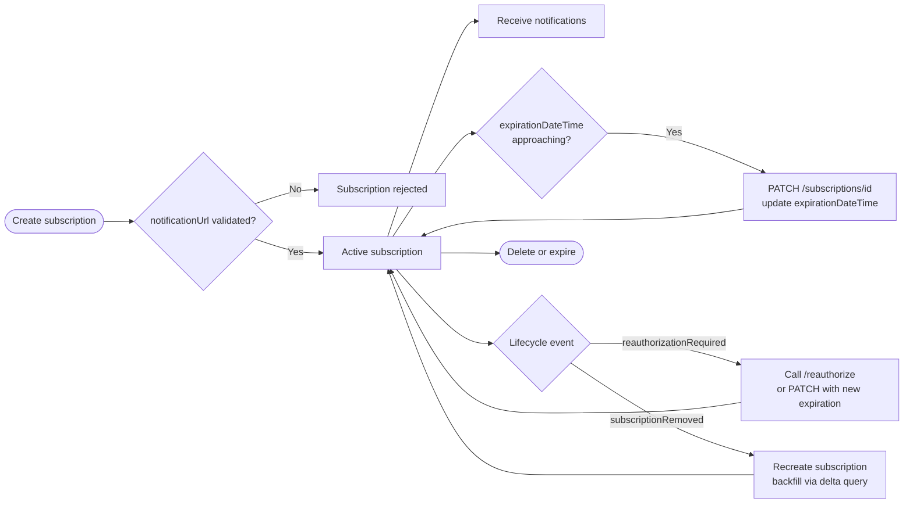

# Microsoft Graph Change Notifications (Webhooks)

Webhooks (change notifications) > polling for state changes. A subscription tells Graph to POST change notifications to your endpoint when a tracked resource changes. Used well, this collapses what would otherwise be a minute-by-minute polling loop into a near-real-time push. Used poorly, it produces silently dropped subscriptions, missed events, and unauthenticated webhook endpoints.

---

## Subscription lifecycle



Subscription lifetime varies by resource. Most Outlook resources cap at three days; security alerts cap at 30 days. Always renew at half the maximum: do not wait for the expiration to arrive.

---

## Validation of `notificationUrl`

When you create a subscription, Graph POSTs the URL with `?validationToken=...` and expects a response inside 10 seconds:

- HTTP 200 OK
- `Content-Type: text/plain`
- Body containing the URL-decoded plain text validation token

If the endpoint does not respond within 10 seconds with the correct payload, Graph rejects the subscription. The endpoint must also stay below the 10-second response window for live notifications: more than 15% slow responses in a 10-minute window puts the endpoint into a "drop" state for 10 minutes.

```csharp
[HttpPost("/api/graph/notifications")]
public async Task<IActionResult> Receive(
    [FromQuery] string? validationToken,
    [FromBody] ChangeNotificationCollection? body)
{
    if (!string.IsNullOrEmpty(validationToken))
    {
        // Plain text, URL-decoded, 200 OK, return within 10 seconds
        return Content(validationToken, "text/plain");
    }

    // Respond 202 immediately, validate after
    _ = Task.Run(() => ProcessAsync(body));
    return Accepted();
}
```

---

## Validating notification payloads

Two layers:

1. **`clientState`**: a secret you set when creating the subscription, echoed in every notification. Verify it matches what you stored. Required for basic notifications.
2. **`validationTokens` (rich notifications only)**: array of JWTs in the notification envelope, one per `(app, tenant)` pair. Validate every token via MSAL or a JWT library before processing. A `null` `validationTokens` value means the resource data could not be encrypted, which is an app misconfiguration, not a transient issue.

Always respond `202 Accepted` first, then validate. The notification endpoint must absorb traffic without revealing validation outcomes to the caller.

---

## Lifecycle notifications

Configure `lifecycleNotificationUrl` on every long-lived subscription. Lifecycle events:

| Event | Meaning | Action |
|---|---|---|
| `reauthorizationRequired` | Access token nearing expiry, subscription nearing expiry, or admin revoked permission | Call `POST /subscriptions/{id}/reauthorize` to refresh without changing expiration, or `PATCH /subscriptions/{id}` to extend expiration (do both as a single PATCH if you need both: never issue both within 10 minutes) |
| `subscriptionRemoved` | Graph removed the subscription (auth changed, resource gone, etc.) | Recreate subscription, backfill via delta query for the gap |
| `missed` | One or more notifications could not be delivered | Reconcile via delta query; do not assume continuity |

Without a lifecycle endpoint, you have no early warning that a subscription is about to die. Treat `lifecycleNotificationUrl` as mandatory.

---

## Pairing with delta query

Webhooks deliver "something changed" notifications. Most resources include the change details, but some (e.g. Outlook with rich data off, or any subscription that received a `missed` lifecycle event) require a follow-up `delta` call to fetch the actual changes.

```http
GET https://graph.microsoft.com/v1.0/me/mailFolders/inbox/messages/delta?$select=subject,from,receivedDateTime
```

The first call returns a snapshot plus a `@odata.deltaLink`. Subsequent calls against the deltaLink return only changes since last sync. This is the right "what changed" primitive for cold-start, gap-recovery, and large-collection sync. Combine with webhooks: webhook says "changed", delta call says "here is what".

---

## Delivery patterns: webhook vs Event Hubs vs Event Grid

| Channel | When |
|---|---|
| HTTPS webhook (`notificationUrl`) | Default. Endpoint can sustain 10-second response SLO |
| Azure Event Hubs | High volume, more than the webhook can absorb (Graph supports Event Hubs as a notification target). No `validationTokens` (subscription is implicitly trusted via Event Hub access policy) |
| Azure Event Grid (Microsoft Graph events) | Use Azure Event Grid system topic for Graph subscriptions when the consumer is an Azure-hosted handler that benefits from Event Grid filtering and dead-letter |

For Azure-hosted, multi-handler scenarios, prefer Event Grid: the dead-letter and filtering primitives are richer than rolling your own webhook plumbing.

---

## Subscription resource configuration

```json
{
  "changeType": "created,updated",
  "notificationUrl": "https://api.contoso.com/webhooks/graph",
  "lifecycleNotificationUrl": "https://api.contoso.com/webhooks/graph/lifecycle",
  "resource": "users/{user-id}/messages",
  "expirationDateTime": "2026-05-06T00:00:00Z",
  "clientState": "shared-secret-stored-server-side",
  "includeResourceData": false,
  "encryptionCertificate": "...",
  "encryptionCertificateId": "..."
}
```

`includeResourceData=true` requires `encryptionCertificate` and a corresponding private key managed in Key Vault. Use only when you need the resource body in the push, accept the additional ops surface area: certificate rotation now matters.

---

## Operational checklist

- [ ] `notificationUrl` returns plain-text validation token in <10 seconds
- [ ] Endpoint sustains <15% slow responses (10-minute window)
- [ ] `lifecycleNotificationUrl` configured on every subscription
- [ ] Subscription renewal job runs at half the resource's max lifetime
- [ ] `clientState` stored server-side, verified on every notification
- [ ] `validationTokens` (rich notifications) validated per JWT
- [ ] Recovery path documented for `subscriptionRemoved` and `missed` events
- [ ] Firewall allows only Microsoft Graph IP ranges to reach the webhook (see additional-office365-ip-addresses-and-urls)
- [ ] Encryption certificate in Key Vault, rotation automated, if `includeResourceData=true`

---

## Trade-offs and exceptions

- **Push vs poll**: push is the right default. The few cases where polling wins: extremely low-volume resources where the renewal overhead exceeds the polling cost, and air-gapped consumers that cannot accept inbound HTTPS.
- **Outlook delta + webhook**: the combination is more reliable than webhooks alone for mailboxes that receive bursty traffic. Use both.
- **Multi-tenant subscriptions**: every tenant has its own subscription. Track them per tenant in your store: do not treat a multi-tenant app as having one subscription.
- **Event Hubs as target**: bypasses the 10-second webhook SLO but loses `validationTokens`; instead, trust the Event Hub auth model.
- **Beta resources**: change-notification support varies. Confirm the resource supports subscriptions before designing.
