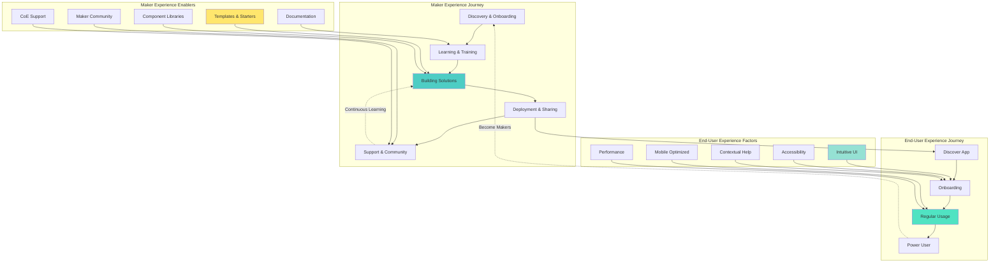
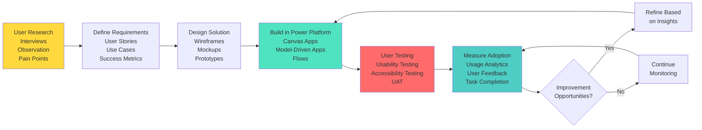

# Experience Optimization - Power Platform Well-Architected Framework

## Definition

Experience Optimization is a pillar unique to the Power Platform Well-Architected Framework, replacing Cost Optimization from the Azure WAF. This pillar recognizes that in low-code/no-code platforms, user experience is paramount to adoption and business value realization. Experience Optimization encompasses both the end-user experience of consuming Power Platform solutions and the maker experience of building them. It focuses on creating intuitive, accessible, engaging, and adoption-friendly applications that meet users where they are, while simultaneously enabling citizen developers to be productive, confident, and successful in their solution building journey.

Power Platform's democratization of development means that both makers and end users may not have technical backgrounds, making experience design critical to success. This pillar addresses designing responsive and intuitive Power Apps interfaces, creating seamless Power Automate workflows that provide appropriate feedback, building Power BI reports that communicate insights clearly, ensuring accessibility compliance for inclusive experiences, optimizing for mobile and cross-device usage, measuring and improving adoption metrics, and continuously gathering and acting on user feedback. Experience Optimization recognizes that the best technically correct solution that nobody uses or that frustrates users is a failed solution.

## Design Principles

The Power Platform Well-Architected Framework defines the following core design principles for experience optimization:

1. **Design for the Actual User, Not the Ideal User**: Understand real user capabilities, contexts, and constraints. Design for users who may be non-technical, using mobile devices in field conditions, accessing apps infrequently, or requiring accessibility accommodations.

2. **Prioritize Maker Experience to Scale Innovation**: Enable citizen developers with intuitive tools, templates, clear documentation, and supportive communities. Remove friction from the maker journey to accelerate solution delivery and platform adoption.

3. **Implement Accessibility from the Beginning**: Build accessible solutions that work for all users including those with disabilities. Accessibility is not optional: it is a requirement for inclusive, compliant, and user-friendly experiences.

4. **Provide Clear Feedback and Error Handling**: Always inform users about system status, processing activities, and errors in plain language. Never leave users wondering what's happening or what went wrong.

5. **Optimize for Mobile-First Experiences**: Design primarily for mobile use cases, as many Power Platform users access solutions on tablets and smartphones in the field. Desktop experience follows from mobile design, not vice versa.

6. **Measure Adoption and Act on Insights**: Track usage metrics, user satisfaction, task completion rates, and adoption patterns. Use data to continuously improve experiences rather than making assumptions.

7. **Reduce Cognitive Load Through Simplicity**: Minimize the information, choices, and actions required to accomplish user goals. Complexity is the enemy of adoption. Simplify ruthlessly.

## Assessment Questions

Use these questions to evaluate the experience optimization posture of your Power Platform solutions:

1. **User Research**: Have you conducted user research to understand actual user needs, contexts, and pain points? Do you design based on user feedback or assumptions?

2. **End-User Experience**: How would you rate the intuitiveness of your Power Apps? Can new users accomplish tasks without training? What is the average time to complete key workflows?

3. **Maker Experience**: How quickly can new citizen developers create their first app? What friction points slow down makers? Are templates and components readily available?

4. **Accessibility Compliance**: Do your solutions meet WCAG 2.1 AA standards? Have you tested with screen readers? Is keyboard navigation fully functional? Are color contrasts adequate?

5. **Mobile Experience**: What percentage of users access solutions via mobile? Are apps optimized for touch interfaces? Do layouts adapt appropriately to different screen sizes?

6. **Error Handling**: When errors occur, do users understand what happened and what to do next? Are error messages in plain language? Do you log errors for analysis?

7. **User Onboarding**: Is there in-app guidance for new users? Are there tooltips, help text, or tutorial experiences? How long does onboarding take?

8. **Adoption Metrics**: What percentage of target users actively use your solutions? What is the usage frequency? Are users completing their intended workflows?

9. **User Satisfaction**: Have you measured user satisfaction through surveys or feedback? What is the Net Promoter Score (NPS) for your solutions? What are common complaints?

10. **Performance Perception**: Do loading indicators provide feedback during data operations? Is the UI responsive to user interactions? What is the perceived performance?

11. **Consistency**: Are UI patterns, terminology, and navigation consistent across your Power Platform solutions? Do you follow organizational design standards?

12. **Internationalization**: If serving global audiences, do solutions support multiple languages? Are date, time, and number formats localized appropriately?

## Key Patterns and Practices

### 1. Responsive Layout Design for Multi-Device

Design canvas apps that adapt gracefully across desktop, tablet, and mobile devices.

**Implementation**: Use container controls and responsive layout features. Test on actual devices, not just the designer. Set Scale to fit property appropriately. Design mobile-first, then enhance for larger screens.

**Best Practices**: Avoid fixed pixel sizes. Use percentages and parent dimensions. Simplify layouts for mobile: fewer controls, larger touch targets, vertical scrolling.

### 2. Progressive Disclosure to Reduce Complexity

Show only essential information and actions initially, revealing additional details as needed.

**Implementation**: Use expandable sections, modal dialogs for secondary workflows, and galleries with detail screens rather than showing all data at once.

**Example**: Show list of customers with key details, expand to full profile on selection. Hide advanced filters in collapsible panel.

### 3. Consistent Navigation Patterns

Establish predictable navigation that users can learn once and apply across all solutions.

**Implementation**: Use standard navigation components (header, navigation menu, breadcrumbs). Place navigation consistently (left sidebar or top menu). Always provide "home" and "back" options.

**Organizational Standard**: Create navigation component in component library for reuse across all apps.

### 4. Clear Visual Feedback for User Actions

Provide immediate visual confirmation when users perform actions.

**Implementation**: Show loading spinners during data operations. Display success/error notifications after form submissions. Highlight selected items. Disable buttons during processing to prevent double-clicks.

**User Confidence**: Users should never wonder if their action was registered or is processing.

### 5. Accessible Form Design

Create forms that work for all users including those using assistive technologies.

**Implementation**: Use semantic controls (proper labels, accessible labels for screen readers). Ensure keyboard navigation works. Maintain 4.5:1 color contrast ratios. Provide text alternatives for icons. Use ARIA labels where needed.

**Testing**: Validate with browser accessibility tools and actual screen readers (NVDA, JAWS, VoiceOver).

### 6. Intelligent Defaults and Auto-Fill

Minimize data entry by pre-populating fields with intelligent defaults based on context.

**Implementation**: Use User() function to pre-fill user information. Default dates to today. Remember user preferences. Use lookup values from previous entries. Implement type-ahead and autocomplete.

**Balance**: Pre-fill for efficiency but allow override for flexibility.

### 7. Maker Templates and Starter Kits

Provide pre-built templates that embed best practices and accelerate maker productivity.

**Implementation**: Create app templates for common scenarios (inspection app, approval workflow, dashboard). Build component libraries with standard controls. Document templates with usage guidance.

**CoE Practice**: Publish templates in organization-wide catalog. Celebrate makers who create reusable components.

### 8. In-App Contextual Help

Provide help and guidance within the application rather than requiring external documentation.

**Implementation**: Use tooltips for complex controls. Add info icons with helpful descriptions. Create onboarding tours for new users. Provide inline examples for data formats.

**Power Apps**: Use hint text on text inputs, add description labels, implement help screens accessible via header button.

### 9. Micro-Interactions and Animation

Use subtle animations and micro-interactions to provide feedback and create engaging experiences.

**Implementation**: Animate transitions between screens. Provide visual feedback on button clicks. Use progress bars for multi-step processes. Implement subtle hover effects.

**Caution**: Keep animations quick and purposeful. Avoid excessive animation that slows down workflows or annoys users.

### 10. Adoption Measurement Framework

Systematically measure and track adoption metrics to guide continuous improvement.

**Implementation**: Track daily/monthly active users, session duration, task completion rates, error rates, and user satisfaction. Use CoE Starter Kit analytics. Implement in-app surveys for feedback.

**Action**: Review metrics monthly, identify drop-off points, experiment with improvements, measure impact.

## Mermaid Diagram Examples

### Dual Experience Optimization Model

### User-Centered Design Process

### Accessibility Implementation Checklist Flow

```mermaid
graph TB
    Start([Design Phase])

    Start --> ColorContrast{Color Contrast<br/>≥4.5:1?}
    ColorContrast -->|No| FixColors[Adjust Colors]
    ColorContrast -->|Yes| Labels{All Controls<br/>Have Labels?}

    FixColors --> Labels

    Labels -->|No| AddLabels[Add Accessible Labels]
    Labels -->|Yes| Keyboard{Keyboard Nav<br/>Complete?}

    AddLabels --> Keyboard

    Keyboard -->|No| FixKeyboard[Fix Tab Order &<br/>Keyboard Actions]
    Keyboard -->|Yes| ScreenReader{Screen Reader<br/>Compatible?}

    FixKeyboard --> ScreenReader

    ScreenReader -->|No| AddARIA[Add ARIA Labels<br/>& Descriptions]
    ScreenReader -->|Yes| FocusVisible{Focus Indicators<br/>Visible?}

    AddARIA --> FocusVisible

    FocusVisible -->|No| AddFocus[Add Focus Styles]
    FocusVisible -->|Yes| TextAlts{Images Have<br/>Alt Text?}

    AddFocus --> TextAlts

    TextAlts -->|No| AddAltText[Add Alternative Text]
    TextAlts -->|Yes| Motion{Respect Motion<br/>Preferences?}

    AddAltText --> Motion

    Motion -->|No| ReduceMotion[Add Motion Controls]
    Motion -->|Yes| Test[Test with<br/>Assistive Tech]

    ReduceMotion --> Test

    Test --> Validate{Issues<br/>Found?}

    Validate -->|Yes| FixIssues[Fix Issues]
    Validate -->|No| Compliant([Accessible<br/>Solution])

    FixIssues --> Test

    style ColorContrast fill:#ffe66d
    style ScreenReader fill:#ffe66d
    style Test fill:#ff6b6b
    style Compliant fill:#95e1d3
```

## Implementation Checklist

Use this checklist when implementing experience optimization in Power Platform solutions:

### User Research and Discovery
- [ ] Conduct user interviews to understand needs and pain points
- [ ] Observe users in their actual work context
- [ ] Create user personas representing different user types
- [ ] Map user journeys for key workflows
- [ ] Identify accessibility requirements for user population
- [ ] Document user constraints (devices, network, skills)

### End-User Experience Design
- [ ] Design mobile-first layouts with responsive adaptation
- [ ] Implement consistent navigation across solutions
- [ ] Use progressive disclosure to reduce complexity
- [ ] Provide clear visual feedback for all user actions
- [ ] Add loading indicators for data operations
- [ ] Design clear, actionable error messages in plain language
- [ ] Minimize required data entry through defaults and auto-fill
- [ ] Test on actual target devices and screen sizes

### Accessibility Implementation
- [ ] Ensure color contrast meets WCAG 2.1 AA standards (4.5:1)
- [ ] Add accessible labels for all controls
- [ ] Implement complete keyboard navigation
- [ ] Test with screen readers (NVDA, JAWS, VoiceOver)
- [ ] Provide text alternatives for images and icons
- [ ] Ensure focus indicators are clearly visible
- [ ] Support browser zoom up to 200%
- [ ] Respect user motion preferences
- [ ] Use semantic HTML in Power Pages and custom components
- [ ] Validate with accessibility tools (Lighthouse, axe DevTools)

### Mobile Optimization
- [ ] Design for touch interfaces with large touch targets (44x44 pixels minimum)
- [ ] Optimize layouts for vertical scrolling
- [ ] Test with actual mobile devices, not just responsive view
- [ ] Minimize data usage for field workers with limited connectivity
- [ ] Support offline scenarios where applicable
- [ ] Optimize images and media for mobile bandwidth
- [ ] Simplify navigation for small screens
- [ ] Test on both iOS and Android devices

### User Onboarding
- [ ] Create first-run onboarding experience
- [ ] Add contextual help and tooltips
- [ ] Provide inline examples for data formats
- [ ] Create help documentation or FAQ
- [ ] Add info icons with helpful descriptions
- [ ] Design empty states with guidance for new users
- [ ] Implement progressive feature introduction

### Maker Experience Enablement
- [ ] Create app templates for common scenarios
- [ ] Build component library with reusable controls
- [ ] Document development standards and guidelines
- [ ] Provide maker onboarding and training
- [ ] Create maker community and support channels
- [ ] Publish how-to guides and video tutorials
- [ ] Celebrate and showcase maker achievements
- [ ] Provide starter kits with embedded best practices

### Visual Design and Branding
- [ ] Apply consistent organizational branding
- [ ] Use corporate color palette and typography
- [ ] Create visually appealing, modern interfaces
- [ ] Maintain visual hierarchy for content organization
- [ ] Use whitespace effectively to reduce clutter
- [ ] Ensure consistent icon usage and style
- [ ] Design for cultural and global audiences

### Feedback and Communication
- [ ] Display clear success/error messages after actions
- [ ] Provide confirmation for destructive actions
- [ ] Show progress for multi-step processes
- [ ] Implement in-app notifications for important updates
- [ ] Add validation feedback for form inputs
- [ ] Create status indicators for long-running processes
- [ ] Enable users to provide feedback within apps

### Adoption Measurement
- [ ] Configure Power Platform analytics
- [ ] Track daily and monthly active users
- [ ] Monitor session duration and frequency
- [ ] Measure task completion rates
- [ ] Track error rates and types
- [ ] Implement in-app satisfaction surveys
- [ ] Monitor app sharing and viral adoption
- [ ] Create adoption dashboards for visibility

### Continuous Improvement
- [ ] Establish regular user feedback collection
- [ ] Conduct periodic usability testing
- [ ] Review analytics and identify improvement opportunities
- [ ] Run A/B tests for design alternatives
- [ ] Monitor support tickets for common issues
- [ ] Update solutions based on user feedback
- [ ] Share learnings across maker community

## Common Anti-Patterns

### 1. Desktop-Only Design

**Problem**: Designing apps exclusively for desktop use when majority of users access via mobile devices, resulting in unusable mobile experiences.

**Solution**: Design mobile-first. Test on actual mobile devices early and often. Use responsive layouts and touch-friendly controls.

**Impact**: Users abandon apps that don't work on their preferred devices, leading to low adoption.

### 2. Ignoring Accessibility

**Problem**: Building apps without considering accessibility, excluding users with disabilities and creating compliance risk.

**Solution**: Implement accessibility from the start. Test with screen readers. Ensure keyboard navigation works. Maintain proper color contrast.

**Impact**: Legal risk, excluded users, poor user experience for 15-20% of population.

### 3. Complex Navigation Structures

**Problem**: Creating deep navigation hierarchies with many levels, hidden menus, or inconsistent navigation patterns that confuse users.

**Solution**: Keep navigation simple and flat (2-3 levels maximum). Use consistent patterns. Always provide clear way back or home.

**Impact**: Users get lost, can't find features, abandon tasks in frustration.

### 4. No Loading Indicators

**Problem**: Performing data operations without visual feedback, leaving users wondering if app is frozen or processing.

**Solution**: Always show loading spinners, progress bars, or skeleton screens during data operations. Provide time estimates for long operations.

**Impact**: Users think app is broken, click multiple times, or abandon before operation completes.

### 5. Technical Error Messages

**Problem**: Showing raw error messages with technical jargon, stack traces, or GUIDs that mean nothing to end users.

**Solution**: Translate errors to plain language. Provide actionable guidance ("Contact IT support at x1234"). Log technical details separately.

**Impact**: User frustration, increased support calls, inability to self-serve solutions.

### 6. Feature Overload

**Problem**: Including every possible feature and option in the interface, overwhelming users with choices and complexity.

**Solution**: Focus on core user tasks. Use progressive disclosure. Remove rarely-used features or hide in advanced sections.

**Impact**: Cognitive overload, slower task completion, lower adoption as users find app too complex.

### 7. No Maker Support Resources

**Problem**: Expecting citizen developers to figure out Power Platform on their own without templates, documentation, or support.

**Solution**: Provide templates, component libraries, documentation, training, and active community support. Make success easy.

**Impact**: Slow maker productivity, inconsistent quality, reinventing patterns, maker frustration.

### 8. Assuming User Knowledge

**Problem**: Designing apps that assume users understand business processes, technical terminology, or organizational acronyms.

**Solution**: Use plain language. Provide contextual help. Do not assume knowledge; design for occasional users and new employees.

**Impact**: Confusion, errors, incomplete tasks, increased training burden.

### 9. No Adoption Measurement

**Problem**: Deploying apps without tracking usage, adoption, or user satisfaction, having no data to guide improvements.

**Solution**: Implement analytics from day one. Track usage metrics. Collect user feedback. Review data regularly and act on insights.

**Impact**: Wasted effort on unused features, missed opportunities for improvement, no business value evidence.

### 10. Inconsistent Experiences

**Problem**: Every app having different navigation, visual design, terminology, and interaction patterns, forcing users to relearn each app.

**Solution**: Establish organizational design system. Use shared component libraries. Create and enforce design standards.

**Impact**: Cognitive burden, slower adoption, reduced efficiency, fragmented user experience.

## Tradeoffs

Experience optimization decisions in Power Platform involve balancing multiple concerns:

### Simplicity vs. Functionality

Simpler interfaces are easier to use but may lack features that power users need.

**Balance**: Design for primary user tasks with simple default experience. Use progressive disclosure for advanced features. Implement user role-based views.

### Maker Freedom vs. Consistency

Allowing makers full creative freedom results in inconsistent user experiences across solutions.

**Balance**: Provide component libraries and templates that make consistent design easy. Enforce standards for enterprise-critical apps while allowing flexibility for personal productivity tools.

### Customization vs. Usability

Highly customized solutions can perfectly match unique processes but may be harder to use and maintain.

**Balance**: Use standard patterns and controls where possible. Customize only where business process truly requires it. Document customizations thoroughly.

### Rich Features vs. Performance

Adding visual effects, animations, and rich interactions can slow down apps and frustrate users.

**Balance**: Use subtle, purposeful animations. Optimize performance first, then enhance visually. Test on actual target devices and network conditions.

### Accessibility vs. Visual Design

Some visual design choices may conflict with accessibility requirements (e.g., low contrast for aesthetic reasons).

**Balance**: Accessibility is non-negotiable. Design beautiful experiences that are also accessible. Many accessibility improvements benefit all users.

### Mobile Optimization vs. Desktop Features

Simplifying for mobile may mean removing features that desktop users value.

**Balance**: Identify core mobile scenarios and optimize those. Provide full feature set on desktop. Consider separate mobile and desktop versions for complex apps.

## Microsoft Resources

### Official Documentation
- [Power Platform Well-Architected - Experience Optimization](https://learn.microsoft.com/power-platform/well-architected/experience-optimization/)
- [Power Apps user experience guidance](https://learn.microsoft.com/power-apps/guidance/planning/user-experience)
- [Design guidance for model-driven apps](https://learn.microsoft.com/power-apps/maker/model-driven-apps/design-considerations-main-forms)

### Accessibility
- [Create accessible canvas apps](https://learn.microsoft.com/power-apps/maker/canvas-apps/accessible-apps)
- [Accessibility in model-driven apps](https://learn.microsoft.com/power-apps/maker/model-driven-apps/accessibility)
- [WCAG 2.1 guidelines](https://www.w3.org/WAI/WCAG21/quickref/)
- [Accessibility properties](https://learn.microsoft.com/power-apps/maker/canvas-apps/controls/properties-accessibility)

### Mobile and Responsive Design
- [Build mobile-optimized apps](https://learn.microsoft.com/power-apps/mobile/power-apps-mobile-canvas-app-best-practices)
- [Responsive layouts](https://learn.microsoft.com/power-apps/maker/canvas-apps/build-responsive-apps)
- [Container control](https://learn.microsoft.com/power-apps/maker/canvas-apps/controls/control-container)

### User Experience Design
- [App design best practices](https://learn.microsoft.com/power-apps/guidance/planning/app-design)
- [UI/UX patterns](https://learn.microsoft.com/power-apps/maker/canvas-apps/common-ux-patterns)
- [Navigation patterns](https://learn.microsoft.com/power-apps/maker/canvas-apps/add-navigation)
- [Loading and error handling](https://learn.microsoft.com/power-apps/maker/canvas-apps/working-with-data-sources)

### Maker Experience
- [Citizen developer guidance](https://learn.microsoft.com/power-platform/guidance/adoption/methodology)
- [App in a day workshop](https://learn.microsoft.com/power-platform/guidance/adoption/app-in-a-day)
- [Power Apps templates](https://learn.microsoft.com/power-apps/maker/canvas-apps/get-started-test-drive)
- [Component libraries](https://learn.microsoft.com/power-apps/maker/canvas-apps/component-library)
- [Creator Kit](https://learn.microsoft.com/power-platform/guidance/creator-kit/overview)

### Analytics and Adoption
- [Power Apps analytics](https://learn.microsoft.com/power-platform/admin/analytics-powerapps)
- [App usage insights](https://learn.microsoft.com/power-apps/maker/canvas-apps/app-insights)
- [CoE adoption metrics](https://learn.microsoft.com/power-platform/guidance/coe/power-bi)
- [User engagement patterns](https://learn.microsoft.com/power-platform/guidance/adoption/measure-adoption)

### Design Systems and Components
- [Fluent UI](https://developer.microsoft.com/fluentui)
- [Power Apps Creator Kit](https://learn.microsoft.com/power-platform/guidance/creator-kit/overview)
- [Component framework](https://learn.microsoft.com/power-apps/developer/component-framework/overview)
- [Themed controls](https://learn.microsoft.com/power-apps/maker/canvas-apps/controls/control-new-form)

### Internationalization
- [Multi-language apps](https://learn.microsoft.com/power-apps/maker/canvas-apps/global-apps)
- [Language support](https://learn.microsoft.com/power-platform/admin/language-collations)
- [Time zones and localization](https://learn.microsoft.com/power-apps/maker/canvas-apps/functions/function-clock-calendar)

## When to Load This Reference

This experience optimization pillar reference should be loaded when the conversation includes:

- **Keywords**: "user experience", "UX", "accessibility", "mobile", "adoption", "usability", "maker experience", "intuitive", "responsive design", "user satisfaction"
- **Scenarios**: Designing user-facing apps, improving adoption rates, implementing accessibility, optimizing mobile experiences, creating maker templates, conducting usability testing
- **Architecture Reviews**: Evaluating solution usability, assessing accessibility compliance, reviewing mobile optimization, analyzing adoption metrics
- **User Feedback**: Responding to complaints about app usability, addressing accessibility requirements, improving user satisfaction
- **Adoption Challenges**: Low usage rates, user resistance, training burden, support tickets indicating UX issues

Load this reference in combination with:
- **Power Platform Performance Efficiency pillar**: For balancing UX richness with performance
- **Power Platform Operational Excellence pillar**: For measuring adoption and continuous improvement
- **Power Platform Security pillar**: When balancing security controls with user experience
- **Accessibility standards**: When implementing compliance requirements
- **Design system documentation**: When establishing organizational design standards
