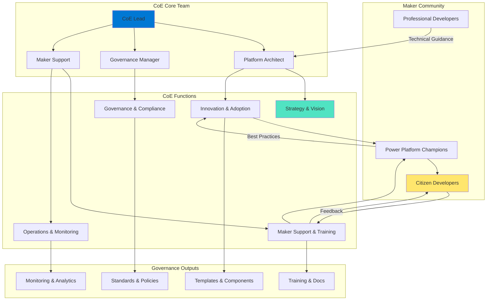
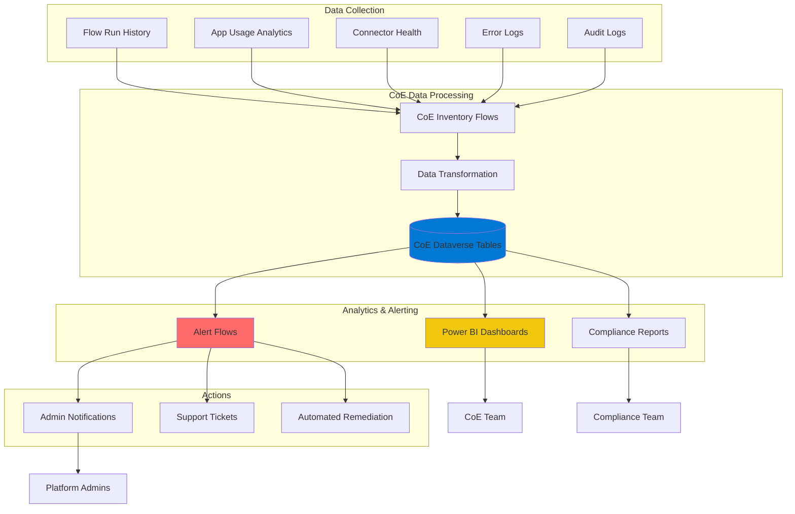

# Operational Excellence - Power Platform Well-Architected Framework

## Definition

Operational Excellence in the Power Platform Well-Architected Framework encompasses the processes, practices, and organizational capabilities that enable efficient deployment, monitoring, and continuous improvement of low-code/no-code solutions. For Power Platform, operational excellence extends beyond traditional DevOps to include citizen developer enablement, Center of Excellence (CoE) operations, maker support, solution lifecycle management, and the governance frameworks that maintain quality and compliance across a democratized development environment.

Power Platform operational excellence recognizes that solutions are created by both professional developers and business users, requiring operational practices that scale across skill levels. This includes establishing maker onboarding processes, implementing application lifecycle management (ALM) practices tailored for low-code solutions, providing self-service support resources, monitoring solution health across thousands of potential apps and flows, and continuously improving both the solutions and the platform capabilities themselves through feedback loops and analytics.

## Design Principles

The Power Platform Well-Architected Framework defines the following core design principles for operational excellence:

1. **Establish Center of Excellence (CoE) from Day One**: Create a dedicated team and governance framework to support makers, establish standards, monitor usage, and drive platform adoption. The CoE is the operational backbone of Power Platform success.

2. **Implement Application Lifecycle Management (ALM) for All Solutions**: Establish clear development, testing, and deployment processes using environments, solutions, and deployment pipelines. Even citizen-developed solutions should follow basic ALM principles when moving to production.

3. **Enable Self-Service with Guardrails**: Provide makers with templates, components, training, and documentation that enable self-service development while maintaining quality standards. Balance autonomy with governance.

4. **Monitor Solution Health Proactively**: Implement comprehensive monitoring that tracks flow failures, app errors, performance metrics, and usage patterns. Use CoE tools to identify issues before users report them.

5. **Automate Operational Tasks**: Automate environment provisioning, solution deployment, compliance checking, license management, and reporting to reduce manual effort and ensure consistency.

6. **Foster Community and Knowledge Sharing**: Build internal communities of practice, maintain knowledge bases, celebrate maker achievements, and facilitate peer learning to scale operational excellence across the organization.

7. **Continuously Improve Through Feedback and Analytics**: Collect feedback from makers and users, analyze usage patterns, identify improvement opportunities, and iteratively enhance both solutions and operational processes.

## Assessment Questions

Use these questions to evaluate the operational excellence posture of your Power Platform environment:

1. **Center of Excellence**: Do you have a dedicated CoE team with clear roles and responsibilities? Is the CoE Starter Kit deployed? How does the CoE engage with makers and business units?

2. **Maker Onboarding**: Is there a formal onboarding process for new makers? Do makers receive training on Power Platform best practices, security, and governance? How quickly can new makers become productive?

3. **Environment Strategy**: Do you have a documented environment strategy? How are environments provisioned and managed? Are there clear promotion paths from development to production?

4. **ALM Practices**: What percentage of production solutions use proper ALM practices (solutions, source control, deployment pipelines)? How are solution updates deployed to production?

5. **Monitoring and Alerting**: Are flow failures monitored and alerted? Do you track app usage and error rates? Can you identify orphaned or unused solutions? How quickly are issues detected and resolved?

6. **Support Model**: How do makers get help when they encounter issues? Is there a support portal or help desk? What is the average time to resolution for maker requests?

7. **Documentation and Standards**: Are development standards documented and accessible? Do you have templates and starter kits for common scenarios? Is solution documentation maintained?

8. **License Management**: How are Power Platform licenses allocated and tracked? Can you identify license optimization opportunities? Do you monitor premium connector usage?

9. **Compliance and Governance**: How do you ensure solutions comply with organizational policies? Are there automated compliance checks? How are policy violations detected and remediated?

10. **Release Management**: Do you have scheduled release windows? How are production changes communicated to users? Is there a rollback process for failed deployments?

11. **Incident Management**: How are production incidents handled? Is there an on-call rotation? Are incidents tracked and analyzed for continuous improvement?

12. **Maker Productivity**: What metrics track maker productivity and satisfaction? Are there bottlenecks in the development or deployment process? How can the platform better enable makers?

## Key Patterns and Practices

### 1. Center of Excellence (CoE) Starter Kit Deployment

Deploy and customize the Microsoft CoE Starter Kit as the foundation for operational excellence.

**Implementation**: Install CoE Kit in a dedicated production environment. Configure the inventory, compliance, and nurture components. Customize dashboards and reports for your organization.

**Capabilities**: Automated solution inventory, risk assessment, compliance monitoring, maker nurturing, usage analytics, and environment management.

**Best Practice**: Start with core components, then gradually add advanced capabilities. Assign dedicated resources to maintain and evolve the CoE.

### 2. Multi-Environment Strategy with Proper ALM

Establish development, test, and production environments with clear promotion paths.

**Implementation**: Create environment naming conventions. Define security groups for each environment type. Implement deployment pipelines using Azure DevOps or GitHub Actions. Use managed solutions in production.

**Flow**: Developer creates unmanaged solution in dev environment → Export and check into source control → Automated pipeline imports to test → After validation, promote to production as managed solution.

### 3. Solution Templates and Component Libraries

Create reusable templates, component libraries, and starter kits that embed best practices.

**Implementation**: Build canvas app templates with standard headers, navigation, and error handling. Create flow templates for common patterns (approval workflows, data sync). Publish component libraries with corporate branding and reusable controls.

**Benefit**: Accelerates maker productivity, ensures consistency, reduces errors, and makes operational best practices the default path.

### 4. Automated Solution Compliance Scanning

Implement automated scans that check solutions against organizational standards before production deployment.

**Implementation**: Use Power Platform Build Tools in CI/CD pipelines. Run Solution Checker to identify issues. Implement custom compliance checks (naming conventions, required documentation, security settings).

**Enforcement**: Block deployment pipelines if critical compliance issues are found. Generate compliance reports for auditing.

### 5. Proactive Monitoring and Health Dashboards

Create comprehensive dashboards that provide real-time visibility into solution health and usage.

**Implementation**: Use CoE Starter Kit dashboards as foundation. Add Power BI reports for custom metrics. Configure alerts for flow failures, app errors, and performance degradation.

**Monitoring Areas**: Solution inventory, flow run history, app usage, connector health, license utilization, environment capacity.

### 6. Maker Support Portal and Knowledge Base

Establish centralized support resources for citizen developers.

**Implementation**: Create SharePoint or Teams site with documentation, training videos, FAQs, templates, and how-to guides. Implement Teams channel or Yammer group for maker community. Use Power Apps portal for support ticket submission.

**Content**: Getting started guides, connector documentation, design patterns, troubleshooting guides, compliance requirements.

### 7. Scheduled Release Windows and Change Management

Implement structured release management for production changes.

**Implementation**: Define release windows (e.g., Tuesday/Thursday afternoons). Require change requests for production updates. Communicate upcoming changes to users via email or Teams. Maintain release notes.

**Benefits**: Reduces surprise outages, allows for proper testing, enables rollback planning, improves user communication.

### 8. Automated Environment Provisioning

Automate environment creation and configuration for consistency and speed.

**Implementation**: Use Power Platform Admin connectors in flows to provision environments. Apply standard DLP policies, security groups, and settings automatically. Track environment metadata in Dataverse.

**Use Cases**: Provision dev environments on demand for makers, create project-specific environments, automate sandbox provisioning.

### 9. Solution Archival and Lifecycle Management

Implement processes to identify and archive unused or obsolete solutions.

**Implementation**: Use CoE tools to identify apps with zero usage and flows that haven't run in 90+ days. Contact owners for confirmation. Archive or delete unused solutions. Reclaim licenses.

**Metrics**: Track solution creation vs. deletion rates. Monitor solution age and usage trends.

### 10. Incident Response and Postmortem Process

Establish formal incident management processes with blameless postmortems.

**Implementation**: Define severity levels and response SLAs. Create on-call rotation for critical solutions. Document incidents in ticketing system. Conduct postmortems for major incidents with action items.

**Continuous Improvement**: Track incident trends, implement preventive measures, update runbooks based on learnings.

## Mermaid Diagram Examples

### Center of Excellence Operating Model

### Application Lifecycle Management Flow

```mermaid
flowchart LR
    subgraph "Development"
        MakerDev[Maker Development]
        DevEnv[(Dev Environment<br/>Unmanaged Solution)]
        SourceControl[Source Control<br/>Git Repository]

        MakerDev --> DevEnv
        DevEnv -->|Export & Commit| SourceControl
    end

    subgraph "Build Pipeline"
        Trigger[Pipeline Trigger]
        Build[Build Solution]
        SolutionChecker[Solution Checker]
        Compliance[Compliance Scan]

        SourceControl --> Trigger
        Trigger --> Build
        Build --> SolutionChecker
        SolutionChecker --> Compliance
    end

    subgraph "Test Environment"
        TestDeploy[Automated Deployment]
        TestEnv[(Test Environment<br/>Managed Solution)]
        TestValidation[Automated Testing]
        ManualTest[Manual Testing]

        Compliance -->|Pass| TestDeploy
        TestDeploy --> TestEnv
        TestEnv --> TestValidation
        TestValidation --> ManualTest
    end

    subgraph "Production"
        Approval[Approval Gate]
        ProdDeploy[Production Deployment]
        ProdEnv[(Production Environment<br/>Managed Solution)]
        Monitor[Monitoring & Alerts]

        ManualTest --> Approval
        Approval -->|Approved| ProdDeploy
        ProdDeploy --> ProdEnv
        ProdEnv --> Monitor
    end

    Compliance -.->|Fail| DevEnv
    Monitor -.->|Issues| MakerDev

    style DevEnv fill:#ffd93d
    style TestEnv fill:#6bcf7f
    style ProdEnv fill:#4d96ff
    style Compliance fill:#ff6b6b
```

### Solution Health Monitoring Architecture

## Implementation Checklist

Use this checklist when implementing operational excellence in Power Platform:

### Center of Excellence Setup
- [ ] Define CoE team structure, roles, and responsibilities
- [ ] Deploy CoE Starter Kit in dedicated production environment
- [ ] Configure core components (inventory, compliance, nurture)
- [ ] Set up Power BI dashboards for CoE analytics
- [ ] Establish regular CoE team meetings and review cadence
- [ ] Create CoE charter and communicate to organization

### Environment Management
- [ ] Define environment strategy and naming conventions
- [ ] Create development, test, and production environments
- [ ] Configure security groups for environment access
- [ ] Apply DLP policies to each environment type
- [ ] Document environment provisioning and deprovisioning process
- [ ] Implement automated environment provisioning workflows

### Application Lifecycle Management
- [ ] Establish solution packaging standards
- [ ] Set up source control repository (Azure DevOps or GitHub)
- [ ] Implement deployment pipelines with appropriate gates
- [ ] Configure Solution Checker in CI/CD process
- [ ] Define promotion process from dev to test to production
- [ ] Use managed solutions exclusively in production
- [ ] Document ALM process and train makers

### Maker Enablement
- [ ] Create maker onboarding program and materials
- [ ] Develop training curriculum for different skill levels
- [ ] Build template library for common scenarios
- [ ] Create component library with reusable controls
- [ ] Establish maker support portal or help desk
- [ ] Implement maker community (Teams/Yammer)
- [ ] Create maker newsletter for platform updates

### Monitoring and Alerting
- [ ] Configure flow run monitoring and failure alerts
- [ ] Set up app usage tracking and error monitoring
- [ ] Implement license usage monitoring
- [ ] Create health dashboards for platform overview
- [ ] Configure alerts for policy violations
- [ ] Monitor connector health and throttling
- [ ] Track solution inventory and orphaned resources

### Documentation and Knowledge Management
- [ ] Document platform governance policies and standards
- [ ] Create developer guidelines and best practices
- [ ] Maintain connector usage guidance and limitations
- [ ] Build troubleshooting and FAQ knowledge base
- [ ] Document security and compliance requirements
- [ ] Create architecture decision records (ADRs)
- [ ] Maintain environment and solution documentation

### Release Management
- [ ] Define release windows and schedules
- [ ] Implement change request process for production
- [ ] Create deployment runbooks and checklists
- [ ] Establish rollback procedures
- [ ] Configure user communication channels
- [ ] Maintain release notes and change logs

### Compliance and Governance
- [ ] Define solution classification criteria
- [ ] Implement automated compliance scanning
- [ ] Create solution approval workflows
- [ ] Configure archival process for unused solutions
- [ ] Establish license reclamation procedures
- [ ] Implement audit log review process
- [ ] Create compliance reporting dashboards

### Incident Management
- [ ] Define incident severity levels and SLAs
- [ ] Create on-call rotation for critical solutions
- [ ] Implement incident tracking system
- [ ] Develop incident response runbooks
- [ ] Establish postmortem process
- [ ] Create escalation procedures
- [ ] Track incident metrics and trends

### Continuous Improvement
- [ ] Collect maker feedback regularly (surveys, interviews)
- [ ] Analyze platform usage patterns and bottlenecks
- [ ] Review and update governance policies quarterly
- [ ] Identify and implement platform enhancements
- [ ] Conduct regular CoE retrospectives
- [ ] Share learnings and best practices across organization

## Common Anti-Patterns

### 1. No Center of Excellence

**Problem**: Attempting to govern Power Platform without a dedicated CoE team, leading to ad-hoc governance, inconsistent practices, and maker frustration.

**Solution**: Establish formal CoE with dedicated resources (even part-time initially). Deploy CoE Starter Kit. Create clear roles, responsibilities, and operating model.

### 2. Direct Production Development

**Problem**: Makers developing and modifying solutions directly in production environments without testing or validation.

**Solution**: Implement multi-environment strategy. Disable solution creation in production for non-admins. Require ALM practices for all production solutions.

### 3. No Monitoring or Analytics

**Problem**: Running Power Platform without monitoring solution health, usage, or failures, learning about issues only when users complain.

**Solution**: Deploy CoE Starter Kit monitoring components. Configure alerts for failures. Create health dashboards. Review metrics regularly.

### 4. Reactive Support Model

**Problem**: Only helping makers when they submit support tickets, leading to frustration, duplicated effort, and missed learning opportunities.

**Solution**: Implement proactive maker enablement with training, templates, documentation, and community support. Monitor maker activities and offer help before issues escalate.

### 5. No Solution Lifecycle Management

**Problem**: Allowing unlimited solution growth without archival, leading to environment clutter, wasted licenses, and degraded performance.

**Solution**: Implement solution lifecycle policies. Regularly review usage metrics. Archive or delete unused solutions. Reclaim licenses from inactive resources.

### 6. Maker Isolation

**Problem**: Makers working in silos without knowledge sharing or collaboration, leading to duplicated effort and missed reuse opportunities.

**Solution**: Build maker community. Implement component libraries. Showcase maker achievements. Facilitate cross-functional collaboration and learning.

### 7. Documentation Debt

**Problem**: Solutions deployed to production without documentation, making them impossible to maintain when original makers leave or forget implementation details.

**Solution**: Require documentation as part of deployment approval. Use templates for consistent documentation. Store documentation with solutions in source control.

### 8. Manual Deployments and Configuration

**Problem**: Manually deploying solutions and configuring environments, leading to errors, inconsistencies, and operational inefficiency.

**Solution**: Automate deployments using pipelines. Script environment configuration. Use infrastructure-as-code practices where possible.

### 9. Ignoring Feedback and Metrics

**Problem**: Collecting metrics and feedback but not acting on them, missing opportunities to improve platform experience and adoption.

**Solution**: Establish regular review cadence for metrics. Implement feedback loops with makers. Prioritize and implement improvements based on data.

### 10. No Incident Learning

**Problem**: Responding to incidents but not conducting postmortems or implementing preventive measures, leading to repeated failures.

**Solution**: Conduct blameless postmortems for significant incidents. Track action items. Analyze incident trends. Update runbooks and preventive measures.

## Tradeoffs

Operational excellence decisions in Power Platform involve balancing multiple concerns:

### Governance vs. Agility

Strict operational controls and approval processes can slow down the platform's key benefit of rapid solution delivery.

**Balance**: Implement risk-based governance where lightweight solutions have streamlined processes, while business-critical solutions require comprehensive controls. Automate governance checks where possible.

### Centralized CoE vs. Federated Support

Centralized CoE provides consistency but may not scale to support large organizations, while federated models risk inconsistency.

**Balance**: Establish central CoE for strategy and standards, with federated champions in business units for local support and adoption. Use CoE Starter Kit for consistent monitoring across federated models.

### Automation vs. Manual Control

Heavy automation increases efficiency but requires upfront investment and may be inflexible for edge cases.

**Balance**: Automate repetitive, high-volume tasks (compliance scanning, monitoring). Maintain manual approval for high-risk operations (production deployments, sensitive data access).

### Self-Service vs. Managed Service

Full self-service enables maker autonomy but risks quality and compliance issues, while managed service models limit agility.

**Balance**: Provide self-service within guardrails (templates, automated compliance, sandboxes). Require managed service approach for enterprise-critical solutions.

### Monitoring Detail vs. Resource Cost

Comprehensive monitoring provides better visibility but consumes API calls, storage, and administrator time to review dashboards.

**Balance**: Implement tiered monitoring with detailed tracking for production and business-critical solutions, lighter monitoring for personal productivity apps. Use alert-driven workflows rather than constant dashboard watching.

## Microsoft Resources

### Official Documentation
- [Power Platform Well-Architected - Operational Excellence](https://learn.microsoft.com/power-platform/well-architected/operational-excellence/)
- [Power Platform adoption best practices](https://learn.microsoft.com/power-platform/guidance/adoption/methodology)
- [Application lifecycle management (ALM)](https://learn.microsoft.com/power-platform/alm/)
- [Admin documentation](https://learn.microsoft.com/power-platform/admin/)

### Center of Excellence (CoE)
- [CoE Starter Kit](https://learn.microsoft.com/power-platform/guidance/coe/starter-kit)
- [CoE Starter Kit setup](https://learn.microsoft.com/power-platform/guidance/coe/setup)
- [Establish CoE](https://learn.microsoft.com/power-platform/guidance/adoption/coe)
- [Admin in a day workshop](https://learn.microsoft.com/power-platform/guidance/adoption/admin-in-a-day)

### ALM and DevOps
- [Power Platform Build Tools](https://learn.microsoft.com/power-platform/alm/devops-build-tools)
- [Solution concepts](https://learn.microsoft.com/power-apps/maker/data-platform/solutions-overview)
- [Environment strategy](https://learn.microsoft.com/power-platform/guidance/adoption/environment-strategy)
- [Pipelines for Power Platform](https://learn.microsoft.com/power-platform/alm/pipelines)
- [Solution Checker](https://learn.microsoft.com/power-apps/maker/data-platform/use-powerapps-checker)

### Monitoring and Analytics
- [Power Platform analytics](https://learn.microsoft.com/power-platform/admin/analytics-common-data-service)
- [Power Automate analytics](https://learn.microsoft.com/power-automate/analytics)
- [Tenant-level analytics](https://learn.microsoft.com/power-platform/admin/tenant-level-analytics)
- [CoE dashboards](https://learn.microsoft.com/power-platform/guidance/coe/power-bi)

### Maker Enablement
- [Power Platform learning paths](https://learn.microsoft.com/training/powerplatform/)
- [App in a day workshop](https://learn.microsoft.com/power-platform/guidance/adoption/app-in-a-day)
- [Nurture components (CoE Kit)](https://learn.microsoft.com/power-platform/guidance/coe/nurture-components)
- [Power Platform community](https://powerusers.microsoft.com/)

### Governance and Compliance
- [Governance white paper](https://learn.microsoft.com/power-platform/guidance/white-papers/governance-security)
- [Compliance and data privacy](https://learn.microsoft.com/power-platform/admin/wp-compliance-data-privacy)
- [DLP policies](https://learn.microsoft.com/power-platform/admin/wp-data-loss-prevention)
- [Environment groups](https://learn.microsoft.com/power-platform/admin/environment-groups)

### Support and Community
- [Power Platform community forums](https://powerusers.microsoft.com/)
- [Power Apps ideas](https://ideas.powerapps.com/)
- [Power Automate ideas](https://ideas.powerautomate.com/)
- [Power Platform support](https://learn.microsoft.com/power-platform/admin/get-help-support)

## When to Load This Reference

This operational excellence pillar reference should be loaded when the conversation includes:

- **Keywords**: "CoE", "Center of Excellence", "ALM", "application lifecycle management", "monitoring", "governance", "maker support", "deployment", "environment management", "incident response"
- **Scenarios**: Establishing CoE, implementing ALM practices, setting up monitoring, creating maker onboarding programs, deploying solutions to production
- **Architecture Reviews**: Evaluating operational maturity, assessing governance effectiveness, reviewing deployment processes
- **Platform Management**: Managing Power Platform tenant, environment strategy, license optimization, compliance monitoring
- **Continuous Improvement**: Analyzing platform usage, improving maker productivity, optimizing operations, scaling platform adoption

Load this reference in combination with:
- **Power Platform Reliability pillar**: For implementing monitoring and incident response
- **Power Platform Security pillar**: For compliance monitoring and governance
- **Power Platform Performance Efficiency pillar**: For optimizing solution performance and platform efficiency
- **CoE Starter Kit documentation**: When implementing or extending CoE capabilities
