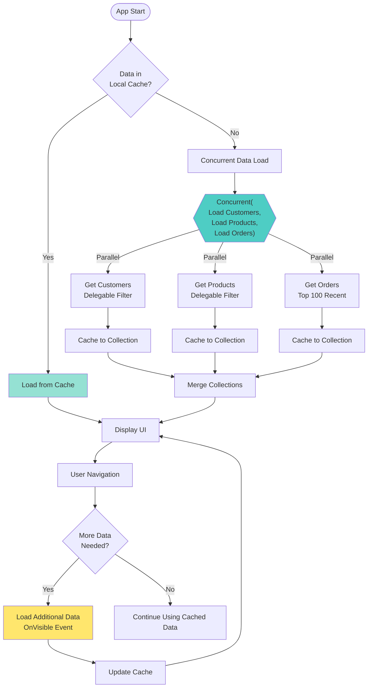
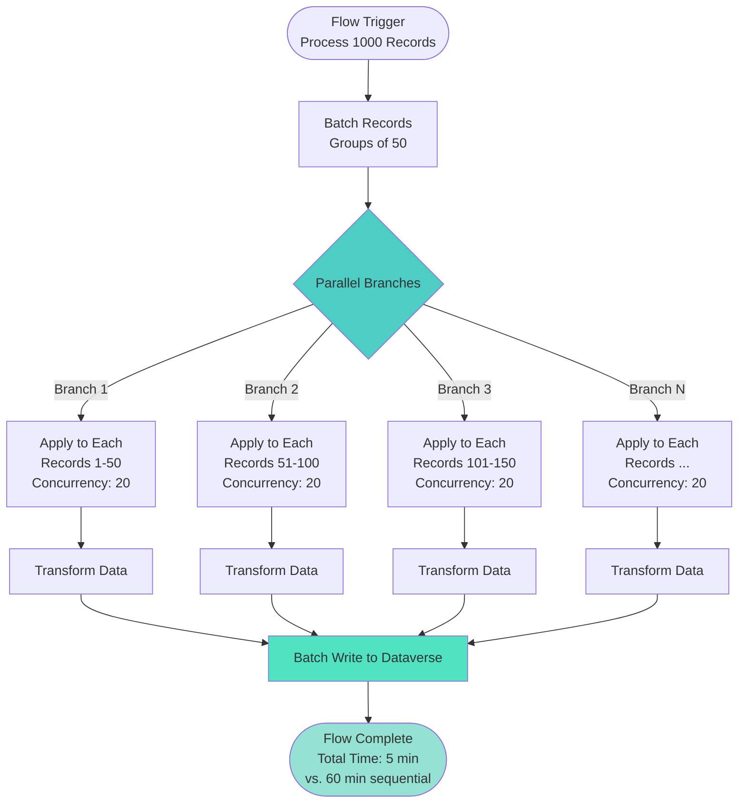
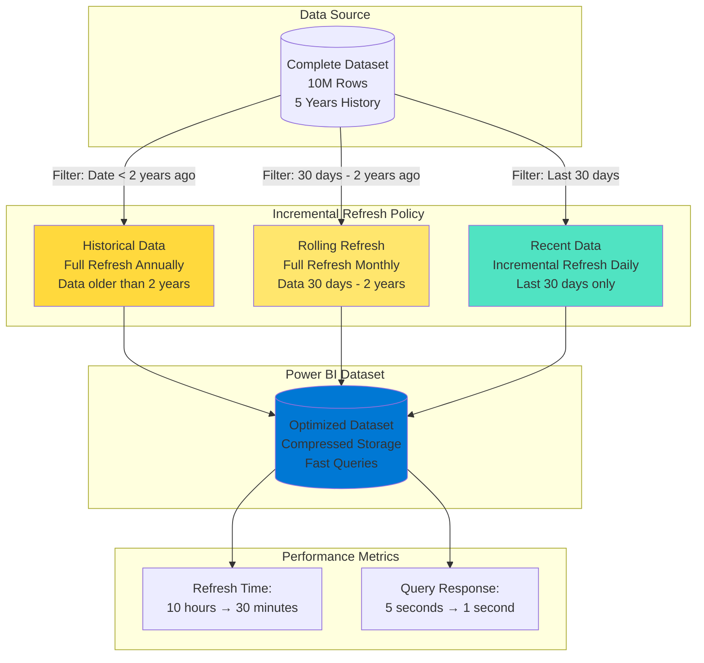

# Performance Efficiency - Power Platform Well-Architected Framework

## Definition

Performance Efficiency in the Power Platform Well-Architected Framework refers to the ability of low-code/no-code solutions to perform optimally, respond quickly to user interactions, and scale to meet workload demands while using resources efficiently. For Power Platform, performance efficiency extends beyond traditional application performance to address the unique characteristics of canvas apps with data delegation, model-driven apps with query optimization, Power Automate flows with concurrency management, and Power BI reports with dataset optimization.

Power Platform performance efficiency requires understanding the constraints and capabilities of a managed platform where citizen developers may not have deep performance tuning expertise. This includes educating makers on delegation, optimizing connector calls, managing API throttling limits, implementing caching strategies, optimizing data models in Dataverse, configuring appropriate capacity and licensing tiers, and designing solutions that perform well within the platform's guardrails. Performance must be balanced with development speed, as overly complex optimizations can reduce the productivity benefits of low-code development.

## Design Principles

The Power Platform Well-Architected Framework defines the following core design principles for performance efficiency:

1. **Understand and Leverage Delegation**: Design canvas apps with delegation-compatible formulas that push data processing to the server. Avoid loading large datasets into memory on the client device.

2. **Optimize Connector Usage**: Minimize connector calls, implement caching strategies, batch operations where possible, and understand connector throttling limits to prevent performance degradation.

3. **Design Efficient Data Models**: Structure Dataverse tables, columns, and relationships for optimal query performance. Use indexes, avoid overly complex relationships, and denormalize strategically when needed.

4. **Right-Size Capacity and Licensing**: Select appropriate capacity tiers, understand service limits, and scale capacity based on workload requirements. Use premium capabilities where performance demands justify the cost.

5. **Implement Progressive Loading**: Load data progressively and asynchronously to maintain responsive user interfaces. Use pagination, lazy loading, and background processing for better perceived performance.

6. **Monitor and Optimize Continuously**: Track performance metrics, identify bottlenecks, analyze slow operations, and iteratively optimize based on real-world usage patterns.

7. **Educate Makers on Performance Patterns**: Citizen developers may not instinctively optimize for performance. Provide templates, guidelines, and automated checks that make performant design the default path.

## Assessment Questions

Use these questions to evaluate the performance efficiency posture of your Power Platform solutions:

1. **Canvas App Performance**: Are your canvas apps responsive (loading in under 3 seconds)? Are formulas delegation-compatible? Do you avoid loading entire large datasets into collections?

2. **Data Delegation**: What percentage of your gallery and data table controls show delegation warnings? Are makers trained on delegation limitations and workarounds?

3. **Connector Optimization**: How many connector calls do your apps and flows make? Are there opportunities to batch operations or cache data? Do flows hit throttling limits?

4. **Dataverse Performance**: Are Dataverse queries optimized? Do you use indexes on frequently queried columns? Are there performance issues with complex relationships or large datasets?

5. **Power Automate Efficiency**: Are flows completing within acceptable timeframes? Do you use parallel branches appropriately? Are there concurrency issues causing delays?

6. **Power BI Performance**: Are Power BI reports loading within acceptable timeframes? Do you use incremental refresh for large datasets? Are DAX calculations optimized?

7. **Capacity Planning**: Have you right-sized Power Apps capacity and Power BI Premium capacity? Are you monitoring capacity utilization and throttling metrics?

8. **API Limits and Throttling**: Are solutions approaching API call limits? Do you monitor service protection limits? Have you implemented retry logic and exponential backoff?

9. **Network Optimization**: Are you minimizing payload sizes? Do you compress data where appropriate? Are assets (images, documents) optimized for web delivery?

10. **User Experience Performance**: What is the perceived performance from user perspective? Are there loading indicators? Is the UI responsive during data operations?

11. **Mobile Performance**: Do solutions perform well on mobile devices with limited bandwidth and processing power? Are images and media optimized for mobile?

12. **Performance Testing**: Do you performance test solutions before production deployment? Are there benchmarks and performance targets defined?

## Key Patterns and Practices

### 1. Delegation-First Formula Design

Design canvas app formulas that delegate processing to the data source rather than processing locally.

**Implementation**: Use delegation-compatible functions (Filter, Search, Sort on delegable columns). Avoid non-delegable functions like CountRows, Sum, Average on large datasets. Test with large datasets and check for delegation warnings.

**Best Practice**: Set "Data row limit for non-delegable queries" to a low value during development to catch delegation issues early.

**Example**: Use `CountRows(Filter(Customers, Country = "USA"))` (delegable) instead of `CountRows(Customers)` (not delegable for large datasets).

### 2. Collection Caching and Data Reuse

Cache frequently accessed data in collections to reduce connector calls and improve responsiveness.

**Implementation**: Load data once on app start into collections. Use ClearCollect for initial load, Collect for incremental updates. Set cache expiration logic based on data freshness requirements.

**Caution**: Don't cache large datasets (thousands of records) in memory. Cache only reference data and frequently accessed subsets.

### 3. Lazy Loading and Progressive Data Display

Load data on-demand as users navigate through the app rather than loading everything upfront.

**Implementation**: Use gallery OnVisible events to load data when sections become visible. Implement pagination for large datasets. Show initial page while loading additional data in background.

**User Experience**: Display loading spinners or skeleton screens while data loads.

### 4. Concurrent Data Retrieval

Use Concurrent function in canvas apps to fetch data from multiple sources simultaneously.

**Implementation**: `Concurrent(ClearCollect(Orders, ...), ClearCollect(Products, ...), ClearCollect(Customers, ...))` to load multiple collections in parallel.

**Benefit**: Reduces overall load time by parallelizing network calls instead of sequential execution.

### 5. Power Automate Parallel Branches

Design flows with parallel branches to execute independent operations simultaneously.

**Implementation**: Use parallel branches in Power Automate for operations that don't depend on each other. Split data processing across parallel branches when possible.

**Example**: Send notifications to different teams in parallel rather than sequentially. Process array items concurrently using Apply to each with concurrency control set to 10-50.

### 6. Incremental Refresh for Power BI

Configure incremental refresh to load only new or changed data rather than full dataset refreshes.

**Implementation**: Use Power BI Premium or Pro Per User. Define incremental refresh policy with date range filters. Configure refresh periods (full refresh for historical data, incremental for recent data).

**Benefit**: Dramatically reduces refresh time and resource consumption for large datasets.

### 7. Dataverse Query Optimization with Views

Create optimized views in Dataverse that return only necessary columns and pre-filter data.

**Implementation**: Create views with only required columns (avoid SELECT *). Add filtering conditions to views. Use indexes on filter columns. Reference views in model-driven apps and canvas apps.

**Performance**: Views with fewer columns and pre-filtering are significantly faster than querying all columns.

### 8. Image and Media Optimization

Optimize images, videos, and documents for web delivery to reduce load times.

**Implementation**: Compress images before upload. Use appropriate formats (WebP for photos, PNG for graphics, SVG for icons). Store large media in Azure Blob Storage or CDN rather than embedding in apps.

**Canvas Apps**: Set image compression quality. Use SVG for icons and graphics when possible.

### 9. Strategic Denormalization

Selectively denormalize data in Dataverse to reduce join complexity and improve query performance.

**Implementation**: Duplicate frequently accessed lookup data into primary table to avoid relationship traversal. Use calculated or rollup columns to pre-compute aggregations.

**Tradeoff**: Improves read performance at the cost of increased storage and write complexity. Use for read-heavy scenarios.

### 10. Service Principal for High-Volume Flows

Use service principal connections for high-volume automated flows to get higher API limits.

**Implementation**: Register Azure AD application. Use service principal authentication in connectors. Configure appropriate service protection limit exemptions if needed.

**Benefit**: Service principals often have higher throttling limits than user-based connections for critical automation.

## Mermaid Diagram Examples

### Canvas App Performance Optimization Flow

### Power Automate Performance Pattern

### Power BI Incremental Refresh Strategy

## Implementation Checklist

Use this checklist when implementing performance efficiency in Power Platform solutions:

### Canvas Apps Performance
- [ ] Review and resolve all delegation warnings in formulas
- [ ] Set data row limit to 500 during development to catch delegation issues
- [ ] Use Concurrent function for parallel data loading on app start
- [ ] Implement collection caching for reference data
- [ ] Add loading indicators for data operations
- [ ] Optimize image sizes and use compression
- [ ] Minimize number of controls and screens in app
- [ ] Use components to reduce control duplication
- [ ] Test app performance with realistic data volumes
- [ ] Implement lazy loading for galleries with large datasets

### Model-Driven Apps Performance
- [ ] Create optimized views with only necessary columns
- [ ] Add indexes to frequently filtered and sorted columns
- [ ] Minimize use of related entity columns in views
- [ ] Configure form performance optimization settings
- [ ] Use quick view forms instead of subgrids where appropriate
- [ ] Limit number of tabs and sections on forms
- [ ] Remove unnecessary business rules and JavaScript

### Power Automate Performance
- [ ] Use parallel branches for independent operations
- [ ] Configure appropriate concurrency settings (10-50 for most cases)
- [ ] Batch operations instead of individual API calls
- [ ] Implement pagination for large dataset processing
- [ ] Use select statements to retrieve only needed fields
- [ ] Add delays and retry policies to handle throttling
- [ ] Avoid unnecessary loops and iterations
- [ ] Use child flows for reusable logic instead of duplicating actions
- [ ] Monitor flow run duration and optimize slow flows

### Dataverse Performance
- [ ] Create indexes on columns used in filters and sorts
- [ ] Avoid overly deep relationship chains (3+ levels)
- [ ] Use alternate keys for frequently accessed records
- [ ] Implement audit retention policies to limit table growth
- [ ] Consider strategic denormalization for read-heavy scenarios
- [ ] Use rollup columns instead of real-time calculations
- [ ] Archive historical data to improve query performance
- [ ] Monitor database storage and performance metrics

### Power BI Performance
- [ ] Configure incremental refresh for large datasets
- [ ] Implement query folding where possible
- [ ] Use DirectQuery or Composite models appropriately
- [ ] Optimize DAX calculations and measures
- [ ] Remove unused columns and tables from data model
- [ ] Use aggregations for large fact tables
- [ ] Configure scheduled refresh during off-peak hours
- [ ] Monitor refresh duration and query performance
- [ ] Use Premium capacity for large datasets and advanced features

### Connector Optimization
- [ ] Minimize connector calls through batching and caching
- [ ] Use select and filter OData query parameters
- [ ] Monitor API call usage against limits
- [ ] Implement retry logic for transient failures
- [ ] Use premium connectors when performance justifies cost
- [ ] Consider custom connectors with optimized endpoints

### Capacity and Licensing
- [ ] Right-size Power Apps capacity based on usage
- [ ] Monitor entitlement consumption and throttling
- [ ] Consider Power BI Premium for large datasets
- [ ] Use Power Automate Process or Power Automate per flow for high-volume scenarios
- [ ] Review and optimize license allocation
- [ ] Track capacity metrics and plan for growth

### Performance Monitoring
- [ ] Configure Application Insights for detailed telemetry
- [ ] Monitor flow run durations and failures
- [ ] Track canvas app load times and errors
- [ ] Review Power BI refresh and query performance
- [ ] Set up alerts for performance degradation
- [ ] Create performance dashboards for visibility
- [ ] Conduct regular performance reviews

### Testing and Validation
- [ ] Performance test with production-scale data volumes
- [ ] Test on various devices and network conditions
- [ ] Validate mobile app performance
- [ ] Load test critical flows and integrations
- [ ] Benchmark against performance targets
- [ ] Test with concurrent users for multi-user scenarios

## Common Anti-Patterns

### 1. Ignoring Delegation Warnings

**Problem**: Creating canvas apps with non-delegable formulas that work fine with small test datasets but fail or perform poorly with production data volumes.

**Solution**: Always resolve delegation warnings. Use delegation-compatible functions. Filter server-side rather than loading all data and filtering in collections.

**Impact**: Apps that load slowly or show incomplete data when deployed to production with thousands of records.

### 2. Loading Entire Large Datasets into Collections

**Problem**: Using `ClearCollect(AllCustomers, Customers)` to load thousands or tens of thousands of records into memory on the client device.

**Solution**: Load only necessary data using filters. Implement pagination for large datasets. Use server-side filtering and delegation.

**Impact**: Slow app load times, memory issues, app crashes on mobile devices.

### 3. Sequential Flow Processing

**Problem**: Processing arrays or large datasets sequentially in Power Automate using Apply to Each with concurrency set to 1, or using multiple sequential actions when parallel execution is possible.

**Solution**: Increase concurrency to 10-50 for Apply to Each loops. Use parallel branches for independent operations. Batch operations when possible.

**Impact**: Flows that take hours instead of minutes to process large datasets.

### 4. Excessive Connector Calls in Loops

**Problem**: Making individual connector calls inside loops, such as calling "Get record" 1000 times in a loop instead of a single batch operation.

**Solution**: Use batch operations. Retrieve data in bulk using filters. Cache data and reuse. Minimize calls inside loops.

**Impact**: Throttling errors, slow flow execution, high API call consumption.

### 5. No Incremental Refresh for Large Power BI Datasets

**Problem**: Running full dataset refreshes on multi-million row Power BI datasets, causing hours-long refresh times and impacting report availability.

**Solution**: Implement incremental refresh policies. Use Premium capacity. Configure appropriate refresh windows for historical vs. recent data.

**Impact**: Dataset unavailable during refresh, resource consumption, refresh failures.

### 6. Unoptimized DAX Calculations

**Problem**: Writing inefficient DAX formulas that scan entire tables multiple times, use complex nested iterators, or don't leverage relationships properly.

**Solution**: Optimize DAX using CALCULATE, filter context, and relationship traversal. Avoid row-by-row iterations when set-based operations are possible. Use variables to avoid recalculation.

**Impact**: Slow report rendering, poor user experience, high resource consumption.

### 7. Retrieving All Columns When Only Few Are Needed

**Problem**: Using default queries that retrieve all columns from tables in Dataverse or SQL, even when only a few columns are needed.

**Solution**: Use $select parameter in OData queries. Create views with only necessary columns. Specify column lists in Power Automate actions.

**Impact**: Increased payload size, slower network transfer, higher resource consumption.

### 8. No Image Optimization

**Problem**: Embedding large, uncompressed images directly in canvas apps, causing slow load times especially on mobile devices.

**Solution**: Compress images before adding to apps. Use appropriate formats (WebP, optimized PNG/JPEG). Store large media in Azure Storage with CDN. Use image streaming services.

**Impact**: Slow app load times, high bandwidth consumption, poor mobile experience.

### 9. Complex Relationships and Deep Lookups

**Problem**: Creating Dataverse models with many-to-many relationships, deep lookup chains (4+ levels), or overly normalized structures that require complex joins.

**Solution**: Limit relationship depth. Strategically denormalize frequently accessed data. Use rollup columns for aggregations. Create flattened views for complex queries.

**Impact**: Slow query performance, timeout errors, complex form load times.

### 10. Synchronous Long-Running Operations

**Problem**: Implementing long-running data processing or complex calculations synchronously in canvas apps, blocking the UI and creating poor user experience.

**Solution**: Move long-running operations to Power Automate flows triggered asynchronously. Use status tracking and notifications. Provide progress indicators.

**Impact**: Frozen UI, timeouts, user frustration, abandoned sessions.

## Tradeoffs

Performance efficiency decisions in Power Platform involve balancing multiple concerns:

### Performance vs. Development Speed

Optimizing for maximum performance requires detailed tuning, testing, and sometimes complex implementations that slow down citizen development.

**Balance**: Focus optimization efforts on user-facing operations and high-volume scenarios. Accept adequate performance for low-usage or internal tools. Use performance templates to make optimization easier.

### Delegation vs. Feature Richness

Delegation-compatible formulas are more limited than non-delegable operations, potentially restricting app functionality.

**Balance**: Use delegation for user-facing operations with large datasets. Allow non-delegable operations for small, bounded datasets (reference data, filtered subsets). Implement server-side logic for complex operations.

### Caching vs. Data Freshness

Caching improves performance but can show stale data to users.

**Balance**: Implement appropriate cache invalidation strategies. Use short cache durations for frequently changing data. Allow manual refresh for critical scenarios. Use real-time data where freshness is essential.

### Parallelization vs. Resource Consumption

Running operations in parallel improves speed but consumes more API calls, memory, and may hit throttling limits.

**Balance**: Parallelize where it provides significant time savings and doesn't exceed limits. Use appropriate concurrency settings (10-50 typically). Monitor throttling metrics and adjust.

### Performance vs. Cost

Premium capacity, higher licensing tiers, and optimized infrastructure improve performance but increase costs.

**Balance**: Right-size capacity based on business requirements. Use standard capacity for non-critical workloads. Reserve premium features for performance-sensitive scenarios. Monitor utilization and optimize spend.

### Denormalization vs. Data Consistency

Denormalizing data improves read performance but complicates writes and can create consistency issues.

**Balance**: Denormalize strategically for read-heavy scenarios. Implement synchronization logic to maintain consistency. Use for derived/calculated data rather than source-of-truth fields.

## Microsoft Resources

### Official Documentation
- [Power Platform Well-Architected - Performance Efficiency](https://learn.microsoft.com/power-platform/well-architected/performance-efficiency/)
- [Performance and optimization](https://learn.microsoft.com/power-platform/guidance/adoption/performance-optimization)
- [Power Apps performance tips](https://learn.microsoft.com/power-apps/maker/canvas-apps/performance-tips)
- [Delegation overview](https://learn.microsoft.com/power-apps/maker/canvas-apps/delegation-overview)

### Canvas Apps Performance
- [Understand delegation](https://learn.microsoft.com/power-apps/maker/canvas-apps/delegation-overview)
- [Delegable functions](https://learn.microsoft.com/power-apps/maker/canvas-apps/delegation-list)
- [Optimize canvas app performance](https://learn.microsoft.com/power-apps/maker/canvas-apps/performance-tips)
- [Concurrent function](https://learn.microsoft.com/power-apps/maker/canvas-apps/functions/function-concurrent)

### Power Automate Performance
- [Limits and configuration](https://learn.microsoft.com/power-automate/limits-and-config)
- [Optimize cloud flow performance](https://learn.microsoft.com/power-automate/guidance/planning/optimize-cloud-flow-performance)
- [Concurrency control](https://learn.microsoft.com/power-automate/apply-to-each#change-concurrency-settings)
- [Pagination](https://learn.microsoft.com/power-automate/dataverse/list-rows#use-pagination)

### Dataverse Performance
- [Dataverse service protection limits](https://learn.microsoft.com/power-apps/developer/data-platform/api-limits)
- [Performance optimization](https://learn.microsoft.com/power-apps/developer/data-platform/optimize-performance)
- [Index columns](https://learn.microsoft.com/power-apps/developer/data-platform/define-alternate-keys-reference-records#performance)
- [Query optimization](https://learn.microsoft.com/power-apps/developer/data-platform/org-service/use-fetchxml-construct-query)

### Power BI Performance
- [Optimization guide for Power BI](https://learn.microsoft.com/power-bi/guidance/power-bi-optimization)
- [Incremental refresh](https://learn.microsoft.com/power-bi/connect-data/incremental-refresh-overview)
- [Query folding](https://learn.microsoft.com/power-query/power-query-folding)
- [DirectQuery model guidance](https://learn.microsoft.com/power-bi/guidance/directquery-model-guidance)
- [DAX optimization](https://learn.microsoft.com/dax/best-practices/dax-optimization)

### Monitoring and Analytics
- [Application Insights integration](https://learn.microsoft.com/power-platform/admin/app-insights-cloud-flow)
- [Monitor app performance](https://learn.microsoft.com/power-apps/maker/canvas-apps/performance-monitoring)
- [Power Automate analytics](https://learn.microsoft.com/power-automate/analytics)
- [Power BI performance monitoring](https://learn.microsoft.com/power-bi/enterprise/service-premium-metrics-app)

### Capacity and Limits
- [Power Apps capacity add-on](https://learn.microsoft.com/power-platform/admin/capacity-add-on)
- [Entitlement limits](https://learn.microsoft.com/power-platform/admin/api-request-limits-allocations)
- [Power BI Premium capacity](https://learn.microsoft.com/power-bi/enterprise/service-premium-what-is)
- [Request limits and allocations](https://learn.microsoft.com/power-platform/admin/api-request-limits-allocations)

## When to Load This Reference

This performance efficiency pillar reference should be loaded when the conversation includes:

- **Keywords**: "performance", "slow", "delegation", "optimization", "throttling", "API limits", "incremental refresh", "caching", "concurrency", "load time"
- **Scenarios**: Optimizing slow apps or flows, resolving delegation warnings, handling large datasets, improving Power BI refresh times, addressing throttling issues
- **Architecture Reviews**: Evaluating solution performance, identifying bottlenecks, reviewing data models for optimization opportunities
- **Capacity Planning**: Right-sizing capacity, planning for scale, addressing entitlement limits
- **Performance Testing**: Load testing, benchmarking, performance validation before production deployment

Load this reference in combination with:
- **Power Platform Reliability pillar**: For understanding performance impact on reliability (timeouts, failures)
- **Power Platform Operational Excellence pillar**: For performance monitoring and continuous optimization
- **Dataverse data modeling**: When optimizing data structures for performance
- **Power BI optimization guides**: For detailed report and dataset tuning
