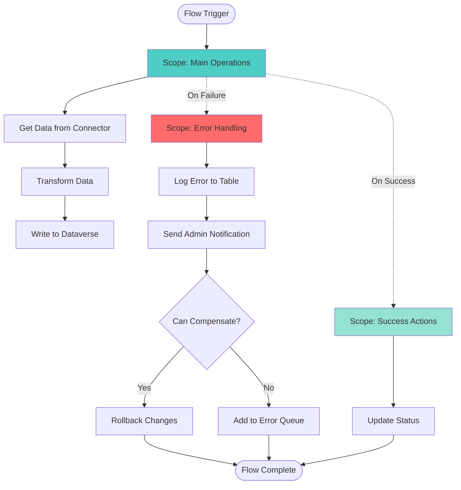
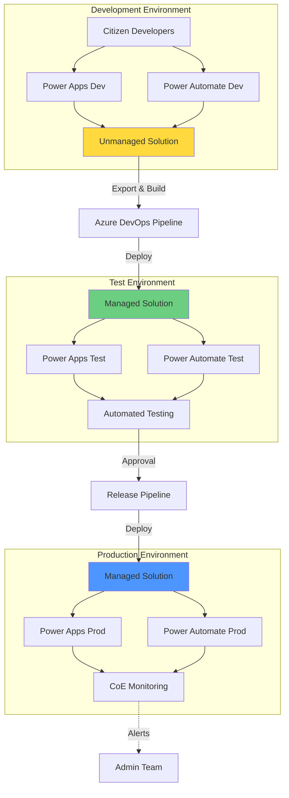
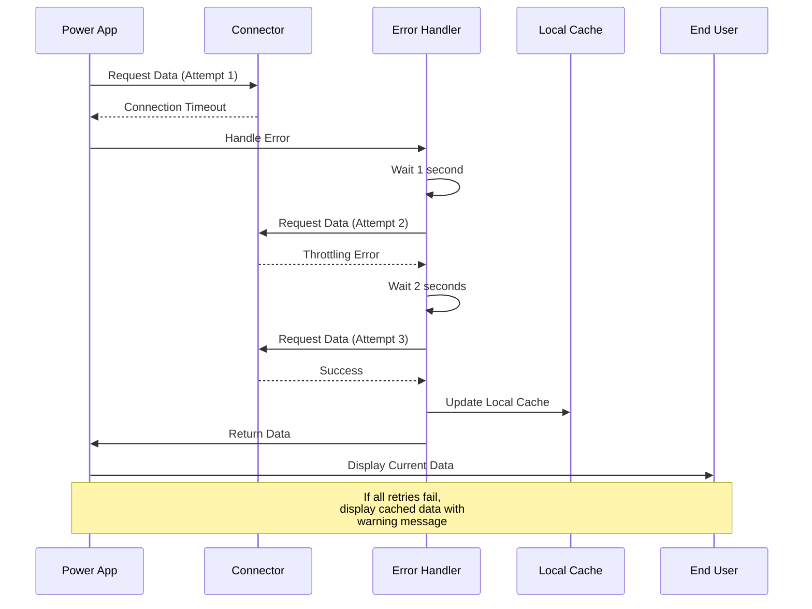

# Reliability - Power Platform Well-Architected Framework

## Definition

Reliability in the Power Platform Well-Architected Framework refers to the ability of low-code/no-code solutions to recover from failures, maintain consistent availability, and continue delivering business value despite disruptions. For Power Platform, reliability encompasses not only technical resilience but also governance, maker enablement, and the unique challenges of citizen developer ecosystems where solutions can proliferate rapidly without traditional IT oversight.

Power Platform reliability requires a balanced approach that enables business agility through citizen development while maintaining enterprise-grade resilience. This includes managing connection reliability, handling API throttling, ensuring data consistency across connectors, and maintaining solution health across Power Apps, Power Automate, Power BI, and Power Pages. The low-code nature demands specific reliability patterns that account for visual design tools, limited debugging capabilities, and the need for maker education on resilience best practices.

## Design Principles

The Power Platform Well-Architected Framework defines the following core design principles for reliability:

1. **Design for Connection Resilience**: Power Platform solutions depend heavily on connectors. Assume connector failures will occur and implement retry logic, error handling, and graceful degradation for all data sources and external services.

2. **Implement Center of Excellence (CoE) Guardrails**: Establish organizational policies, compliance frameworks, and automated monitoring through the CoE Starter Kit to ensure solutions maintain reliability standards even when created by citizen developers.

3. **Handle Throttling and Limits Gracefully**: Power Platform services have throttling limits, API call quotas, and concurrency restrictions. Design solutions that respect these limits, implement exponential backoff, and provide clear feedback when approaching limits.

4. **Ensure Data Consistency Across Connectors**: When integrating multiple data sources, implement patterns that maintain data integrity despite eventual consistency, connection timeouts, or partial failures in distributed operations.

5. **Enable Monitoring and Telemetry for Citizen Solutions**: Since citizen developers may not implement robust monitoring by default, provide centralized telemetry, error tracking, and health monitoring through CoE tools and organizational standards.

6. **Plan for Environment and Service Availability**: Understand Power Platform service dependencies, regional availability, and environment isolation. Design multi-environment strategies that enable business continuity during maintenance windows or service disruptions.

7. **Validate Solutions Before Production Deployment**: Implement ALM practices that require solution validation, testing, and approval workflows to prevent unreliable citizen-developed solutions from reaching production users.

## Assessment Questions

Use these questions to evaluate the reliability posture of your Power Platform solutions:

1. **Availability Requirements**: Have you defined availability requirements for critical Power Platform solutions? Do citizen developers understand the difference between personal productivity apps and mission-critical business applications?

2. **Connection Resilience**: How do your Power Apps and Power Automate flows handle connector failures? Have you implemented retry logic for critical operations? Do you have fallback mechanisms when external services are unavailable?

3. **Throttling Management**: Are you monitoring API call usage to avoid throttling limits? Do your Power Automate flows implement appropriate delay actions and concurrency controls? Have you educated makers on connector limits?

4. **Error Handling**: Do Power Automate flows have proper error handling configured with scopes, try-catch patterns, and compensating transactions? Are errors logged centrally for analysis?

5. **Data Backup and Recovery**: How is Dataverse data protected? Do you have backup strategies for SharePoint lists, SQL databases, and other connected data sources? Can you restore solutions and data if needed?

6. **Environment Strategy**: Do you have separate development, test, and production environments? Is there a promotion process that validates reliability before production deployment?

7. **Solution Dependencies**: Have you documented all connector dependencies, premium licensing requirements, and external service dependencies for each solution? What happens when a dependency is unavailable?

8. **Monitoring and Alerting**: Are you using the CoE Starter Kit to monitor solution health? Do you have alerts configured for flow failures, app errors, and connector issues?

9. **Licensing Continuity**: Have you planned for license changes or expiration? What happens to critical solutions if premium connectors become unavailable due to licensing?

10. **Maker Support and Documentation**: Do makers have access to reliability best practices, templates, and support? Is there a process for escalating citizen-developed solutions that become business-critical?

11. **Service Principal and Identity Resilience**: Are service accounts and application registrations used for critical flows properly maintained? Do you have fallback authentication methods?

12. **Power BI Report Resilience**: For critical Power BI reports, have you implemented incremental refresh, query optimization, and scheduled refresh monitoring? Are there fallbacks when data sources are unavailable?

## Key Patterns and Practices

### 1. Scope-Based Error Handling in Power Automate

Wrap critical operations in scopes with proper error handling to prevent flow failures from cascading.

**Implementation**: Use Scope actions to group related operations, configure "Configure run after" settings to handle failures, and implement compensating actions when operations fail.

**Example**: Wrap database writes in a scope, and if the scope fails, write to an error queue or send notifications to admins.

### 2. Exponential Backoff for Connector Retries

Implement retry logic with increasing delays when connectors fail due to transient issues or throttling.

**Implementation**: Use the "Retry Policy" settings in Power Automate actions, or implement custom delay loops with exponentially increasing wait times.

**Best Practice**: Start with 1 second delay, then 2, 4, 8 seconds, with a maximum of 4-5 retry attempts.

### 3. Queue-Based Processing with Power Automate

Decouple operations using Dataverse tables, SharePoint lists, or Azure Service Bus queues to handle load spikes and prevent flow concurrency issues.

**Implementation**: One flow writes requests to a queue table, another flow processes items from the queue with appropriate concurrency controls.

**Benefit**: Prevents overwhelming downstream systems and enables graceful degradation during high-load periods.

### 4. Health Check Flows and Proactive Monitoring

Create scheduled flows that verify connectivity, data quality, and solution health before users encounter issues.

**Implementation**: Create daily or hourly flows that test critical connectors, verify data freshness, and send alerts when thresholds are exceeded.

**CoE Integration**: Use the CoE Starter Kit's monitoring flows to track solution health across the tenant.

### 5. Graceful Degradation in Power Apps

Design apps to function in a limited capacity when connections fail rather than becoming completely unusable.

**Implementation**: Use OnError handlers, local collections for caching data, and clear user messaging when features are unavailable. Implement IsBlank() and If() checks before accessing connector data.

### 6. Multi-Environment Deployment Strategy

Maintain separate development, test, and production environments with validated promotion paths.

**Implementation**: Use Power Platform solutions, Azure DevOps pipelines, or GitHub Actions for ALM. Require testing and approval before production deployment.

**CoE Practice**: Implement environment policies that prevent direct production changes by citizen developers.

### 7. Connection Reference Pattern

Use connection references in solutions to enable environment-specific connections without modifying apps and flows.

**Implementation**: Always use connection references when packaging solutions. Document required connections in solution documentation.

**Benefit**: Enables reliable deployment across environments and simplifies connection management.

### 8. Compensating Transactions for Distributed Operations

When operations span multiple systems (Dynamics 365, SharePoint, SQL), implement compensation logic if any step fails.

**Implementation**: Track operation state in Dataverse, use status columns to manage workflow state, and implement rollback flows that undo partial changes.

### 9. Incremental Refresh and Optimization for Power BI

Configure incremental refresh for large datasets to ensure reports remain reliable as data volumes grow.

**Implementation**: Use Power BI Premium or Pro Per User capacity, configure incremental refresh policies, implement query folding, and use DirectQuery or Composite models appropriately.

### 10. Service Principal Authentication for Critical Flows

Use service principals instead of user accounts for critical automated flows to prevent failures when users leave or passwords change.

**Implementation**: Register Azure AD applications, grant necessary API permissions, and configure flows to use service principal connections.

## Mermaid Diagram Examples

### Power Automate Error Handling Pattern

### Multi-Environment ALM Strategy

### Connection Resilience Pattern

## Implementation Checklist

Use this checklist when implementing reliability in Power Platform solutions:

### Governance and CoE
- [ ] Deploy Center of Excellence (CoE) Starter Kit for tenant-wide monitoring
- [ ] Define solution classification criteria (personal, team, enterprise-critical)
- [ ] Establish environment strategy (dev, test, prod) with access controls
- [ ] Create maker onboarding process that includes reliability training
- [ ] Implement automated compliance checks for new solutions
- [ ] Define service-level agreements (SLAs) for enterprise-critical solutions

### Power Apps
- [ ] Implement OnError handlers for all critical operations
- [ ] Use local collections to cache data for offline scenarios
- [ ] Add loading indicators and error messages for user feedback
- [ ] Implement IsBlank() and IsError() checks before accessing data
- [ ] Test apps with poor network conditions and connector failures
- [ ] Document required connections and permissions in app documentation

### Power Automate
- [ ] Wrap critical operations in Scope actions with error handling
- [ ] Configure retry policies for all connector actions
- [ ] Implement timeout settings appropriate for each operation
- [ ] Use "Configure run after" to handle scope failures
- [ ] Log errors to centralized table or Application Insights
- [ ] Implement concurrency controls to prevent overwhelming downstream systems
- [ ] Create health check flows for critical automations

### Power BI
- [ ] Configure incremental refresh for large datasets
- [ ] Implement query folding for optimal performance
- [ ] Set up scheduled refresh monitoring and alerts
- [ ] Use Premium capacity for mission-critical reports
- [ ] Implement row-level security (RLS) for data isolation
- [ ] Create fallback reports for when primary data sources fail

### Data and Connectors
- [ ] Document all connector dependencies and their reliability SLAs
- [ ] Implement connection references in all solutions
- [ ] Use service principals for critical automated connections
- [ ] Configure appropriate timeout values for each connector
- [ ] Monitor API call usage to stay under throttling limits
- [ ] Implement data backup strategies for Dataverse and connected sources

### ALM and Deployment
- [ ] Package solutions with proper dependencies and connection references
- [ ] Implement automated deployment pipelines (Azure DevOps/GitHub)
- [ ] Require testing and validation before production deployment
- [ ] Use managed solutions in production environments
- [ ] Maintain solution documentation including reliability requirements
- [ ] Implement rollback procedures for failed deployments

### Monitoring and Operations
- [ ] Enable Power Automate analytics and monitoring
- [ ] Configure alerts for flow failures and errors
- [ ] Monitor Power Apps usage and error rates
- [ ] Track connector health and throttling metrics
- [ ] Create dashboards for solution health visibility
- [ ] Establish incident response procedures for critical solution failures

## Common Anti-Patterns

### 1. No Error Handling in Power Automate Flows

**Problem**: Citizen developers often create flows without proper error handling, causing silent failures or incomplete operations that are difficult to diagnose.

**Solution**: Require scope-based error handling for all production flows. Use CoE policies to scan and flag flows without error handling.

### 2. Synchronous Long-Running Operations

**Problem**: Implementing long-running operations (large data processing, complex calculations) in Power Apps that block the user interface or cause timeout errors.

**Solution**: Move long operations to Power Automate flows triggered asynchronously. Use progress indicators and status tracking in apps.

### 3. Hard-Coded Connections and Credentials

**Problem**: Building solutions with hard-coded connection strings, usernames, or environment-specific values that fail when deployed to other environments.

**Solution**: Always use connection references and environment variables. Avoid embedding credentials or connection details in flow actions.

### 4. Ignoring Connector Throttling Limits

**Problem**: Creating flows that make hundreds of API calls in tight loops, causing throttling errors and flow failures.

**Solution**: Implement batch processing, add delay actions, use concurrency controls, and monitor API call usage.

### 5. Single Environment Development

**Problem**: Developing and testing directly in production without proper staging environments, leading to outages when changes fail.

**Solution**: Implement multi-environment strategy with development, testing, and production environments. Use ALM practices with proper validation gates.

### 6. No Monitoring or Telemetry

**Problem**: Deploying solutions without any health monitoring, making it impossible to detect issues until users report problems.

**Solution**: Implement CoE Starter Kit monitoring, configure flow analytics, enable Application Insights integration, and create health dashboards.

### 7. User Account Dependencies

**Problem**: Critical flows that run under individual user accounts fail when users leave the organization, go on vacation, or change passwords.

**Solution**: Use service principal connections for production flows. Implement shared mailboxes or service accounts with proper lifecycle management.

### 8. Unbounded Data Operations

**Problem**: Power Apps or flows that attempt to load or process entire large datasets without pagination or filtering, causing performance issues and timeouts.

**Solution**: Implement pagination, use filtering and delegation in Power Apps, and process data in manageable batches in flows.

### 9. No Compensating Transactions

**Problem**: Multi-step operations that partially complete (write to SharePoint succeeds, but Dynamics 365 update fails) without cleanup logic, resulting in data inconsistency.

**Solution**: Implement compensating transaction patterns that roll back completed steps when later steps fail.

### 10. Lack of Documentation

**Problem**: Citizen-developed solutions that become business-critical but have no documentation, making it impossible to maintain or troubleshoot when the original maker is unavailable.

**Solution**: Require documentation for all enterprise-critical solutions. Use CoE tools to identify critical solutions and ensure they're properly documented and supported.

## Tradeoffs

Reliability decisions in Power Platform involve balancing multiple concerns:

### Reliability vs. Maker Agility

Strict reliability controls and approval processes can slow down citizen developers and reduce the platform's agility benefits.

**Balance**: Implement risk-based governance where personal and team apps have fewer controls, while enterprise-critical solutions require validation and testing.

### Reliability vs. Licensing Costs

Premium connectors, Power Apps per-app plans, and Power BI Premium capacity improve reliability but increase costs.

**Balance**: Reserve premium features for business-critical solutions. Use standard connectors and capacity where possible for non-critical scenarios.

### Reliability vs. Complexity

Implementing comprehensive error handling, retry logic, and monitoring adds complexity that may be challenging for citizen developers.

**Balance**: Provide templates and components with built-in reliability patterns. Reserve complex reliability implementations for professional development teams.

### Reliability vs. Performance

Adding error handling, logging, and retry logic increases flow execution time and API call consumption.

**Balance**: Implement selective logging (errors only vs. all operations), use asynchronous patterns where possible, and optimize retry strategies.

### Centralized Control vs. Distributed Innovation

Tight CoE governance ensures reliability but can stifle innovation and slow down business units wanting to experiment.

**Balance**: Create innovation sandbox environments with relaxed controls, but require proper reliability standards before promoting solutions to production.

## Microsoft Resources

### Official Documentation
- [Power Platform Well-Architected - Reliability](https://learn.microsoft.com/power-platform/well-architected/reliability/)
- [Power Platform guidance](https://learn.microsoft.com/power-platform/guidance/)
- [Power Automate error handling](https://learn.microsoft.com/power-automate/error-handling)
- [Power Apps formula reference](https://learn.microsoft.com/power-apps/maker/canvas-apps/formula-reference)

### Center of Excellence (CoE)
- [CoE Starter Kit](https://learn.microsoft.com/power-platform/guidance/coe/starter-kit)
- [Establish environment strategy](https://learn.microsoft.com/power-platform/guidance/adoption/environment-strategy)
- [Power Platform admin center](https://learn.microsoft.com/power-platform/admin/)
- [Governance and security white paper](https://learn.microsoft.com/power-platform/guidance/white-papers/governance-security)

### ALM and DevOps
- [Application lifecycle management (ALM)](https://learn.microsoft.com/power-platform/alm/)
- [Power Platform Build Tools for Azure DevOps](https://learn.microsoft.com/power-platform/alm/devops-build-tools)
- [Solution concepts](https://learn.microsoft.com/power-apps/maker/data-platform/solutions-overview)
- [Environment variables](https://learn.microsoft.com/power-apps/maker/data-platform/environmentvariables)

### Service-Specific Guidance
- [Dataverse service protection limits](https://learn.microsoft.com/power-apps/developer/data-platform/api-limits)
- [Power Automate limits and configuration](https://learn.microsoft.com/power-automate/limits-and-config)
- [Power BI Premium features](https://learn.microsoft.com/power-bi/enterprise/service-premium-features)
- [Connector reference](https://learn.microsoft.com/connectors/)

### Monitoring and Operations
- [Power Platform analytics](https://learn.microsoft.com/power-platform/admin/analytics-common-data-service)
- [Power Automate analytics](https://learn.microsoft.com/power-automate/analytics)
- [Application Insights integration](https://learn.microsoft.com/power-platform/admin/app-insights-cloud-flow)

## When to Load This Reference

This reliability pillar reference should be loaded when the conversation includes:

- **Keywords**: "Power Platform reliability", "flow failures", "app errors", "connector issues", "throttling", "CoE", "citizen developer", "maker", "environment strategy"
- **Scenarios**: Designing business-critical Power Platform solutions, implementing error handling, troubleshooting flow failures, establishing CoE governance
- **Architecture Reviews**: Evaluating Power Platform solutions for reliability gaps, assessing citizen-developed solutions for production readiness
- **Incident Response**: Analyzing Power Automate flow failures, Power Apps errors, or connector outages
- **Governance**: Establishing environment strategies, implementing ALM practices, defining SLAs for Power Platform solutions

Load this reference in combination with:
- **Power Platform Security pillar**: For implementing secure and reliable authentication and authorization
- **Power Platform Operational Excellence pillar**: For monitoring, incident management, and continuous improvement
- **Power Platform Performance Efficiency pillar**: When balancing reliability patterns with performance requirements
- **CoE implementation**: When establishing tenant-wide governance and monitoring frameworks
