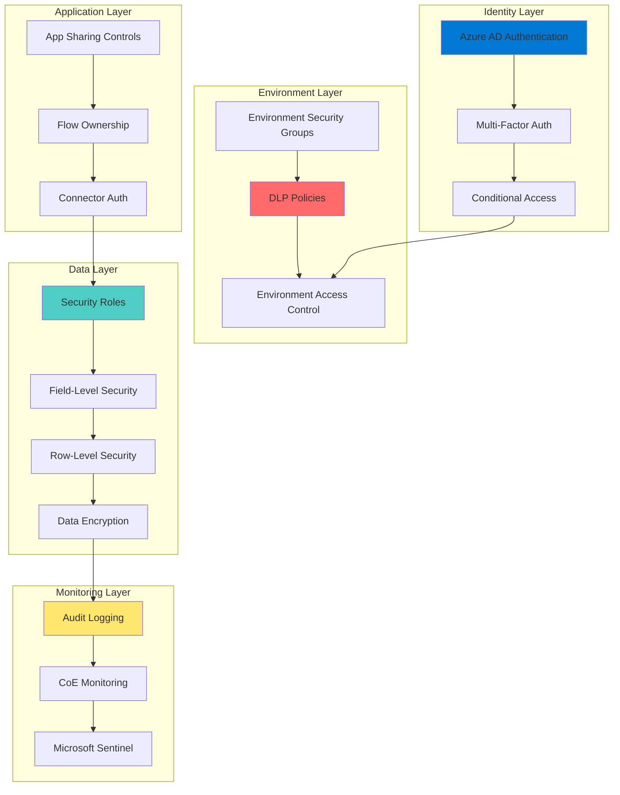
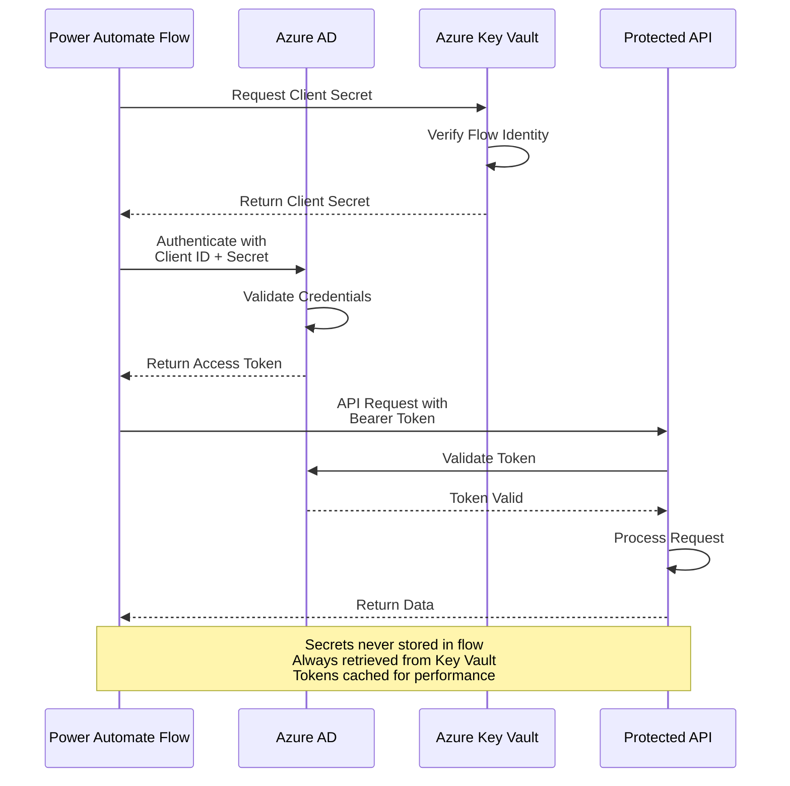

# Security - Power Platform Well-Architected Framework

## Definition

Security in the Power Platform Well-Architected Framework encompasses protecting low-code/no-code solutions, data, and the citizen development ecosystem from unauthorized access, data breaches, and malicious activities. Power Platform security extends beyond traditional application security to address the unique challenges of democratized development, where business users create solutions that may inadvertently expose sensitive data or create security vulnerabilities without realizing the implications.

Power Platform security requires a defense-in-depth approach that balances enabling citizen developers with maintaining enterprise security posture. This includes identity and access management across Azure AD, data loss prevention (DLP) policies to control connector usage, securing Dataverse and connected data sources, protecting premium licensing from unauthorized use, and ensuring compliance with regulatory requirements. The low-code nature demands security guardrails that prevent common mistakes while educating makers on security best practices.

## Design Principles

The Power Platform Well-Architected Framework defines the following core design principles for security:

1. **Implement Defense in Depth for Citizen Development**: Layer security controls at the tenant, environment, solution, and data levels. Use Azure AD for identity, DLP policies for connectors, security roles for data access, and auditing for compliance.

2. **Apply Least Privilege Across Makers and Users**: Grant minimum necessary permissions to citizen developers and end users. Use security groups, security roles, and column-level security to restrict access appropriately.

3. **Prevent Data Exfiltration with DLP Policies**: Implement Data Loss Prevention policies that control which connectors can be used together, preventing sensitive enterprise data from being sent to consumer services or unauthorized destinations.

4. **Secure Data at Rest and in Transit**: Ensure Dataverse data is encrypted at rest and in transit. Use Azure Key Vault for secrets management. Implement field-level encryption for sensitive data like PII or financial information.

5. **Monitor and Audit All Activities**: Enable comprehensive logging and auditing for environment creation, solution deployment, data access, and administrative activities. Use the CoE Starter Kit and Microsoft 365 compliance center for monitoring.

6. **Educate Makers on Security Best Practices**: Citizen developers may not have security training. Provide templates, guidelines, and training on security patterns, and implement automated security reviews through CoE policies.

7. **Implement Secure DevOps Practices**: Use service principals instead of personal accounts for automation, store secrets in Azure Key Vault, implement approval workflows for production deployments, and scan solutions for security issues.

## Assessment Questions

Use these questions to evaluate the security posture of your Power Platform environment:

1. **Identity and Access Management**: Are all users authenticated through Azure AD with appropriate MFA requirements? Have you implemented conditional access policies for Power Platform access?

2. **Environment Security Strategy**: Do you have separate environments for development, test, and production? Are production environments restricted to authorized users? Do you use security groups to control environment access?

3. **Data Loss Prevention**: Have you implemented DLP policies that prevent sensitive data connectors from being used with consumer connectors? Are policies enforced in all production environments?

4. **Dataverse Security**: Are you using security roles and business units appropriately? Have you implemented row-level security based on business requirements? Is column-level security enabled for sensitive fields?

5. **Connector Usage Controls**: Do you have policies controlling which connectors can be used? Are premium and custom connectors restricted to authorized makers? Do you review and approve custom connectors?

6. **Secrets Management**: How are credentials, API keys, and connection strings managed? Are they stored in Azure Key Vault or environment variables? Are they ever hard-coded in apps or flows?

7. **Data Sharing and External Access**: Can Power Apps be shared with external users? Are there controls preventing oversharing of apps and flows? Do you audit sharing activities?

8. **Compliance and Auditing**: Are you logging all administrative actions, data access, and solution deployments? Can you demonstrate compliance with GDPR, HIPAA, or other regulatory requirements?

9. **Service Principal Governance**: Are service principals used for production automation properly secured? Are their credentials rotated regularly? Do you monitor their usage for anomalies?

10. **Power BI Security**: Are Power BI workspaces properly secured? Is row-level security (RLS) implemented for multi-tenant data? Are reports shared appropriately without exposing sensitive data?

11. **Maker Awareness**: Do citizen developers understand security implications of their solutions? Do they know how to handle PII and sensitive data? Is security training part of maker onboarding?

12. **Vulnerability Management**: Do you scan solutions for security vulnerabilities? Are there processes to remediate identified issues? Do you monitor for suspicious activities or data exfiltration attempts?

## Key Patterns and Practices

### 1. Role-Based Access Control (RBAC) with Security Roles

Implement granular access control using Dataverse security roles, business units, and teams.

**Implementation**: Create custom security roles that grant minimum necessary privileges. Use business units for organizational hierarchy and teams for cross-functional collaboration. Implement owner-based sharing for user-created records.

**Best Practice**: Never use the System Administrator role for regular users or service accounts. Create purpose-specific security roles.

### 2. Data Loss Prevention (DLP) Policy Framework

Establish multi-layered DLP policies that prevent data exfiltration while enabling legitimate business scenarios.

**Implementation**: Create tenant-default policies for baseline protection, environment-specific policies for sensitive data, and use connector classification (business, non-business, blocked) appropriately.

**Example**: Block consumer connectors (Gmail, personal OneDrive) in production environments. Allow only approved business connectors like SharePoint, SQL Server, and Dynamics 365.

### 3. Field-Level Security and Encryption

Protect sensitive data using column-level security and field encryption in Dataverse.

**Implementation**: Enable field-level security for PII fields (SSN, credit cards, health information). Create field security profiles that grant access only to authorized roles.

**Advanced**: Use Azure Key Vault integration for additional encryption of highly sensitive fields.

### 4. Service Principal with Azure Key Vault

Use service principals with secrets stored in Azure Key Vault for production automation.

**Implementation**: Register Azure AD application, generate client secret, store in Key Vault, reference in Power Automate using Azure Key Vault connector or premium features.

**Security**: Implement secret rotation policies, use managed identities where possible, audit service principal usage.

### 5. Conditional Access Policies for Power Platform

Apply Azure AD conditional access policies to control Power Platform access based on location, device, risk level.

**Implementation**: Create conditional access policies targeting Power Apps and Power Automate cloud apps. Require MFA, compliant devices, or trusted locations for production environment access.

**Use Case**: Require MFA for any user accessing production environments. Block access from untrusted countries or high-risk sign-ins.

### 6. Environment Isolation and Segmentation

Separate workloads by environment based on data classification and risk profile.

**Implementation**: Create dedicated environments for different security zones (dev, test, prod, sensitive data). Use security groups to control who can create and access each environment.

**Governance**: Implement naming conventions and tagging for environments. Use CoE policies to enforce environment standards.

### 7. Audit Logging and Security Monitoring

Enable comprehensive logging and monitor for security events using Office 365 audit logs and CoE tools.

**Implementation**: Enable audit logging in all environments. Use CoE Starter Kit to track app sharing, flow modifications, and connector usage. Integrate with Microsoft Sentinel for advanced threat detection.

**Monitoring**: Create alerts for unusual sharing activities, bulk data exports, or changes to security roles.

### 8. Secure Application Lifecycle Management (ALM)

Implement secure deployment pipelines that prevent unauthorized changes to production.

**Implementation**: Use Azure DevOps or GitHub with branch protection, required approvals, and automated security scanning. Never deploy directly to production. Use managed solutions in production.

**Security Gate**: Implement solution checker as part of CI/CD pipeline to identify security issues before deployment.

### 9. Row-Level Security (RLS) in Power BI

Implement dynamic RLS to ensure users only see data they're authorized to access.

**Implementation**: Create DAX security filters based on USERNAME() or USERPRINCIPALNAME(). Test RLS thoroughly before publishing. Consider dynamic security groups for easier management.

**Pattern**: For multi-tenant SaaS scenarios, implement RLS based on organization ID to isolate customer data.

### 10. Data Subject Rights and GDPR Compliance

Implement capabilities to fulfill data subject rights requests (access, deletion, portability).

**Implementation**: Use Dataverse search and audit logs to locate personal data. Implement deletion workflows that cascade across all connected systems. Document data retention policies.

**Automation**: Create Power Automate flows to orchestrate data deletion requests across multiple systems.

## Mermaid Diagram Examples

### Defense in Depth Security Layers



### DLP Policy Architecture

```mermaid
graph LR
    subgraph "Connector Groups"
        Business[Business Connectors<br/>SharePoint<br/>Dynamics 365<br/>SQL Server<br/>Office 365]

        NonBusiness[Non-Business Connectors<br/>Twitter<br/>Facebook<br/>Personal OneDrive<br/>Gmail]

        Blocked[Blocked Connectors<br/>File System<br/>Desktop Flows<br/>Custom (Unapproved)]
    end

    subgraph "DLP Policies"
        TenantDefault[Tenant Default Policy]
        ProdEnv[Production Policy<br/>Strictest Controls]
        DevEnv[Development Policy<br/>More Permissive]
    end

    subgraph "Enforcement"
        AppCreation[App Creation]
        FlowCreation[Flow Creation]
        Runtime[Runtime Checks]

        TenantDefault --> AppCreation
        TenantDefault --> FlowCreation

        ProdEnv --> Runtime
        DevEnv --> Runtime
    end

    Business -.->|Allowed Together| Business
    Business -.->|Blocked Together| NonBusiness
    Business -.->|Blocked| Blocked
    NonBusiness -.->|Blocked| Blocked

    TenantDefault --> ProdEnv
    TenantDefault --> DevEnv

    style Business fill:#95e1d3
    style NonBusiness fill:#ffe66d
    style Blocked fill:#ff6b6b
    style ProdEnv fill:#0078d4
```

### Service Principal Authentication Flow



## Implementation Checklist

Use this checklist when implementing security in Power Platform solutions:

### Identity and Access Management
- [ ] Enforce Azure AD authentication for all Power Platform access
- [ ] Implement multi-factor authentication (MFA) for all users
- [ ] Configure conditional access policies for Power Platform services
- [ ] Use security groups to manage environment and application access
- [ ] Implement privileged identity management (PIM) for admin roles
- [ ] Review and audit guest user access regularly

### Environment Security
- [ ] Create separate dev, test, and production environments
- [ ] Implement security groups for environment access control
- [ ] Apply appropriate DLP policies to each environment
- [ ] Enable customer-managed keys for sensitive environments
- [ ] Restrict environment creation to authorized users
- [ ] Implement environment naming and tagging standards

### Data Loss Prevention
- [ ] Create tenant-wide default DLP policy
- [ ] Implement environment-specific DLP policies for production
- [ ] Classify connectors as business, non-business, or blocked
- [ ] Block consumer connectors in production environments
- [ ] Review and approve custom connectors before production use
- [ ] Monitor DLP policy violations and adjust policies as needed

### Dataverse Security
- [ ] Design security role hierarchy based on business needs
- [ ] Implement least privilege access for all security roles
- [ ] Use business units for organizational hierarchy
- [ ] Configure field-level security for sensitive columns
- [ ] Implement row-level security using ownership or teams
- [ ] Audit security role assignments and modifications
- [ ] Remove System Administrator role from regular users

### Application Security
- [ ] Implement app sharing policies and governance
- [ ] Use Azure AD groups for app sharing instead of individuals
- [ ] Review app sharing permissions regularly
- [ ] Implement app certification process for production apps
- [ ] Configure embedded content security for Power Apps portals
- [ ] Use connection references to avoid embedded credentials

### Power Automate Security
- [ ] Use service principals for critical production flows
- [ ] Store secrets in Azure Key Vault, not flow actions
- [ ] Implement approval workflows for sensitive operations
- [ ] Review flow ownership and ensure proper succession planning
- [ ] Audit flows that access sensitive data or perform critical operations
- [ ] Implement error handling that doesn't expose sensitive data in logs

### Power BI Security
- [ ] Implement row-level security (RLS) for all datasets
- [ ] Use Azure AD groups for workspace access management
- [ ] Configure sensitivity labels for reports and datasets
- [ ] Restrict sharing to organization only (no anonymous access)
- [ ] Enable audit logging for all Power BI activities
- [ ] Implement data classification and protection policies

### Secrets Management
- [ ] Store all credentials in Azure Key Vault
- [ ] Use environment variables for configuration settings
- [ ] Implement secret rotation policies
- [ ] Never hard-code credentials in apps, flows, or connectors
- [ ] Use managed identities where supported
- [ ] Audit secret access and usage

### Monitoring and Compliance
- [ ] Enable audit logging in all environments
- [ ] Deploy CoE Starter Kit for security monitoring
- [ ] Configure alerts for suspicious activities
- [ ] Implement regular access reviews
- [ ] Document data retention and deletion policies
- [ ] Create compliance reports for regulatory requirements
- [ ] Integrate with Microsoft Sentinel for advanced threat detection

### Maker Education and Governance
- [ ] Provide security training for all citizen developers
- [ ] Create secure templates and components for reuse
- [ ] Implement solution review process before production deployment
- [ ] Document security standards and best practices
- [ ] Establish security champions program in business units
- [ ] Regular security awareness communications

## Common Anti-Patterns

### 1. Oversharing Apps and Flows with "Everyone"

**Problem**: Citizen developers share apps and flows with "Everyone" in the organization, exposing sensitive data or functionality to unauthorized users.

**Solution**: Implement sharing governance policies. Use Azure AD security groups for sharing. Review sharing activities through CoE tools. Educate makers on least privilege principles.

### 2. System Administrator Role for Regular Users

**Problem**: Granting System Administrator role to users who need to perform administrative tasks, giving them excessive privileges.

**Solution**: Create custom security roles with specific privileges needed. Use the principle of least privilege. Reserve System Administrator for break-glass scenarios only.

### 3. Hard-Coded Credentials and Secrets

**Problem**: Embedding passwords, API keys, or connection strings directly in Power Automate flows or Power Apps formulas.

**Solution**: Use Azure Key Vault for all secrets. Use environment variables for configuration. Use connection references instead of embedded connections.

### 4. No Data Loss Prevention Policies

**Problem**: Allowing unrestricted connector usage, enabling makers to send corporate data to personal email, consumer cloud storage, or social media.

**Solution**: Implement tenant-default DLP policy immediately. Create environment-specific policies for production. Regularly review and update connector classifications.

### 5. Shared Service Accounts for Flows

**Problem**: Using shared generic accounts (like admin@company.com) for flow ownership or connections, creating security and accountability issues.

**Solution**: Use service principals with proper governance. Use individual accounts for development. Implement proper succession planning for flow ownership.

### 6. No Field-Level Security for PII

**Problem**: Storing personally identifiable information (PII) in Dataverse without field-level security, making it accessible to all users with table access.

**Solution**: Identify all PII fields. Implement field-level security. Create field security profiles for authorized roles. Consider encryption for highly sensitive data.

### 7. Unlimited Power BI Report Access

**Problem**: Publishing Power BI reports without row-level security, allowing all users to see all data regardless of their authorization.

**Solution**: Always implement row-level security (RLS) for datasets containing sensitive or multi-tenant data. Test RLS thoroughly. Use dynamic security groups.

### 8. No Audit Logging or Monitoring

**Problem**: Not enabling audit logging or monitoring maker activities, making it impossible to detect security incidents or unauthorized data access.

**Solution**: Enable audit logging in all environments. Deploy CoE Starter Kit. Integrate with Microsoft 365 compliance center. Create security dashboards and alerts.

### 9. Direct Production Changes Without Approval

**Problem**: Allowing citizen developers to modify production apps and flows directly without any review or approval process.

**Solution**: Implement ALM practices with separate environments. Require approval workflows for production deployment. Use managed solutions in production.

### 10. Ignoring External Sharing and Guest Access

**Problem**: Not controlling external sharing, allowing apps and data to be shared with users outside the organization without proper governance.

**Solution**: Configure tenant settings to control external sharing. Monitor guest user access. Implement approval workflows for external sharing requests.

## Tradeoffs

Security decisions in Power Platform involve balancing multiple concerns:

### Security vs. Maker Productivity

Strict security controls can slow down citizen developers and reduce the agility benefits of low-code platforms.

**Balance**: Implement risk-based security where personal and team apps have lighter controls, while enterprise-critical solutions require stricter security measures. Provide secure templates to accelerate compliant development.

### Security vs. Functionality

Some security measures (like DLP policies blocking certain connectors) may prevent legitimate business scenarios.

**Balance**: Create exception processes for justified business needs. Use environment-specific policies to allow more flexibility in development while securing production. Regularly review and update policies based on business feedback.

### Centralized Control vs. Distributed Innovation

Heavy-handed security governance can stifle innovation and prevent business units from solving problems quickly.

**Balance**: Implement sandbox environments with relaxed security for experimentation. Tighten security as solutions move toward production. Focus on detection and monitoring rather than prevention for lower-risk scenarios.

### Usability vs. Security

Strong authentication requirements (MFA, device compliance) can impact user experience and productivity.

**Balance**: Implement risk-based conditional access that requires stronger authentication only for sensitive scenarios (production environment access, sensitive data access). Use seamless SSO where possible.

### Audit Detail vs. Performance and Cost

Comprehensive audit logging generates large volumes of data, impacting performance and storage costs.

**Balance**: Implement tiered logging strategy with detailed logging for production and sensitive environments, lighter logging for development. Archive logs based on retention requirements.

## Microsoft Resources

### Official Documentation
- [Power Platform Well-Architected - Security](https://learn.microsoft.com/power-platform/well-architected/security/)
- [Power Platform security and governance](https://learn.microsoft.com/power-platform/admin/security/)
- [Dataverse security concepts](https://learn.microsoft.com/power-apps/developer/data-platform/security-concepts)
- [Data loss prevention policies](https://learn.microsoft.com/power-platform/admin/wp-data-loss-prevention)

### Identity and Access
- [Azure AD authentication](https://learn.microsoft.com/power-platform/admin/authenticate-with-azure-ad)
- [Conditional access for Power Platform](https://learn.microsoft.com/power-platform/admin/powerapps-flow-licensing-faq#conditional-access)
- [Security roles and privileges](https://learn.microsoft.com/power-platform/admin/security-roles-privileges)
- [Field-level security](https://learn.microsoft.com/power-apps/developer/data-platform/field-security-entities)

### Data Protection
- [Customer-managed encryption keys](https://learn.microsoft.com/power-platform/admin/customer-managed-key)
- [Azure Key Vault integration](https://learn.microsoft.com/connectors/keyvault/)
- [Data encryption in Dataverse](https://learn.microsoft.com/power-apps/developer/data-platform/data-encryption)
- [GDPR and data subject rights](https://learn.microsoft.com/power-platform/admin/powerapps-gdpr-dsr-guide)

### Governance and Compliance
- [CoE Starter Kit](https://learn.microsoft.com/power-platform/guidance/coe/starter-kit)
- [Governance white paper](https://learn.microsoft.com/power-platform/guidance/white-papers/governance-security)
- [Environment security groups](https://learn.microsoft.com/power-platform/admin/control-environment-creation)
- [Tenant isolation](https://learn.microsoft.com/power-platform/admin/cross-tenant-restrictions)

### Power BI Security
- [Power BI security white paper](https://learn.microsoft.com/power-bi/guidance/whitepaper-powerbi-security)
- [Row-level security (RLS)](https://learn.microsoft.com/power-bi/enterprise/service-admin-rls)
- [Sensitivity labels](https://learn.microsoft.com/power-bi/enterprise/service-security-data-protection-overview)
- [Power BI security best practices](https://learn.microsoft.com/power-bi/guidance/powerbi-implementation-planning-security-overview)

### Monitoring and Auditing
- [Audit logging](https://learn.microsoft.com/power-platform/admin/logging-powerapps)
- [Microsoft 365 compliance center](https://learn.microsoft.com/microsoft-365/compliance/)
- [Power Platform admin analytics](https://learn.microsoft.com/power-platform/admin/analytics-common-data-service)
- [Microsoft Sentinel integration](https://learn.microsoft.com/azure/sentinel/)

## When to Load This Reference

This security pillar reference should be loaded when the conversation includes:

- **Keywords**: "Power Platform security", "DLP", "data loss prevention", "security roles", "field security", "compliance", "GDPR", "audit", "authentication", "authorization"
- **Scenarios**: Implementing security controls, designing secure citizen development environments, responding to security incidents, meeting compliance requirements
- **Architecture Reviews**: Evaluating Power Platform solutions for security vulnerabilities, assessing data protection measures, reviewing access controls
- **Governance**: Establishing security policies, implementing CoE security monitoring, defining DLP strategies
- **Compliance Projects**: Implementing GDPR compliance, HIPAA requirements, or other regulatory frameworks

Load this reference in combination with:
- **Power Platform Reliability pillar**: For implementing secure and reliable authentication patterns
- **Power Platform Operational Excellence pillar**: For security monitoring, incident response, and compliance reporting
- **CoE implementation**: When establishing tenant-wide security governance and policies
- **Azure Security references**: When integrating Power Platform security with broader Azure security strategy
