# Power Platform - Low-Code Architecture and Integration Patterns

## Overview

Power Platform is Microsoft's low-code/no-code development platform that enables both citizen developers and professional developers to build business applications, automate processes, analyze data, and create intelligent chatbots. For enterprise architects, Power Platform represents a strategic capability for rapid application development while maintaining enterprise governance and integration.

## Platform Positioning

**Strategic Role**: Power Platform democratizes application development while maintaining IT governance:
- **Business agility**: Reduce backlog by empowering business users
- **Professional productivity**: Accelerate professional development with low-code tools
- **Fusion teams**: Enable collaboration between business users and IT
- **Enterprise integration**: Pre-built connectors to 1000+ services
- **AI democratization**: Make AI accessible without data science expertise

**Architectural Philosophy**: "Low-code first, pro-code when needed": start with low-code capabilities, extend with custom code only where necessary.

## Core Services Deep Dive

### 1. Power Apps

**Purpose**: Build custom business applications with low-code approach

**App Types**:

**Canvas Apps**:
- Pixel-perfect UI design starting from blank canvas
- Mobile-first approach
- Ideal for task-based, highly visual apps
- Limited offline capabilities

**Model-Driven Apps**:
- Data-driven, form-based applications
- Built on Dataverse tables
- Rich business logic and complex data models
- Responsive design (auto-generated UI)
- Full offline capabilities

**Portal Apps (Power Pages)**:
- External-facing websites and portals
- Authenticated or anonymous access
- Content management capabilities
- Separate licensing (see Power Pages section)

**Architecture Comparison**:

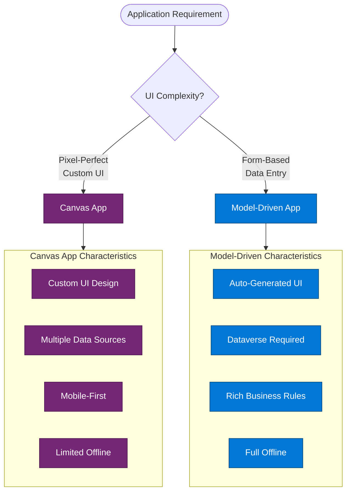

**Common Architecture Patterns**:

**Pattern 1: Canvas App with Multiple Data Sources**
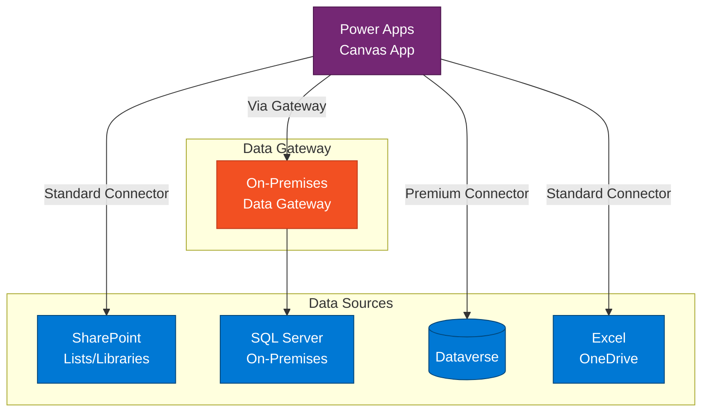

**Best Practices**:
- Use collections to cache data and reduce API calls
- Implement delegation-friendly queries for large datasets
- Separate UI from data layer (use components)
- Use named formulas for reusable logic
- Implement error handling for all data operations

---

### 2. Power Automate (Flow)

**Purpose**: Automate business processes and integrate systems

**Flow Types**:

**Cloud Flows**:
- **Automated**: Triggered by events (email arrives, file created)
- **Instant**: Triggered manually by users
- **Scheduled**: Run on a timer (daily, weekly)

**Desktop Flows (RPA)**:
- Robotic Process Automation for legacy systems
- UI automation and screen scraping
- Attended and unattended modes

**Business Process Flows**:
- Guide users through defined processes
- Integrated with model-driven apps
- Stage-based progression

**Common Architecture Patterns**:

**Pattern 1: Event-Driven Integration**
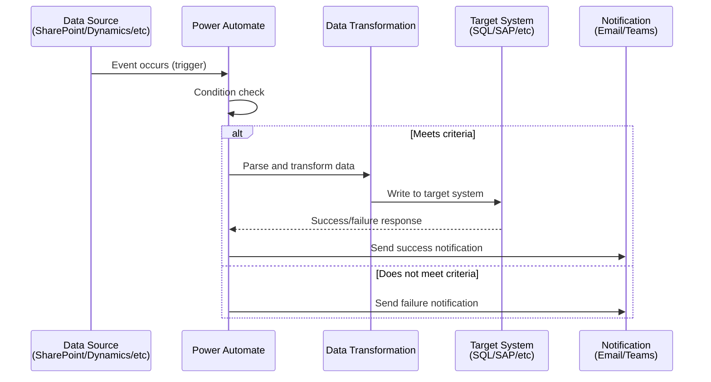

**Pattern 2: Approval Workflow**
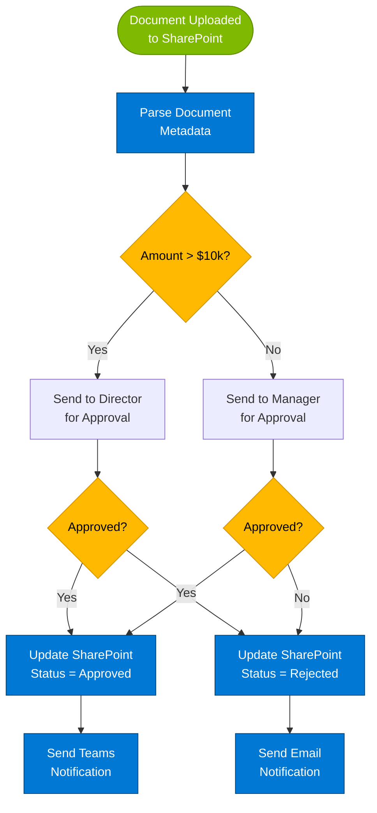

**Best Practices**:
- Use scopes for error handling (try-catch pattern)
- Implement retry policies for transient failures
- Use concurrency control for high-volume scenarios
- Avoid infinite loops (include termination conditions)
- Use child flows for reusable logic
- Monitor flow runs and analytics

**Performance Considerations**:
- Connector throttling limits (varies by connector)
- Flow execution time limits (varies by plan)
- Delegation limitations for loops
- Consider Azure Logic Apps for complex enterprise integration

---

### 3. Power BI

**Purpose**: Business intelligence and data visualization

**Components**:

**Power BI Desktop**: Authoring tool for reports
**Power BI Service**: Cloud-based sharing and collaboration
**Power BI Mobile**: Mobile app for consumption
**Power BI Embedded**: Embed reports in custom applications
**Power BI Report Server**: On-premises reporting (with Premium)

**Architecture Patterns**:

**Pattern 1: Self-Service BI Architecture**
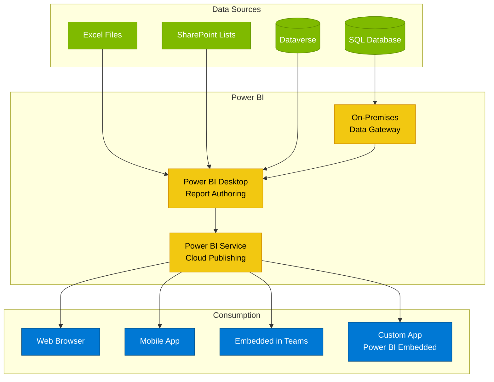

**Data Refresh Strategies**:
- **Import mode**: Data cached in Power BI (scheduled refresh)
- **DirectQuery**: Real-time queries to source (performance considerations)
- **Composite models**: Mix of import and DirectQuery
- **Incremental refresh**: Refresh only changed data (Premium feature)

**Best Practices**:
- Use dataflows for reusable ETL logic
- Implement row-level security (RLS) for multi-tenant scenarios
- Optimize data models (star schema, aggregations)
- Use Power BI Premium for large-scale deployments
- Embed reports in Teams for user adoption
- Use deployment pipelines for Dev/Test/Prod

---

### 4. Power Pages (formerly Power Apps Portals)

**Purpose**: External-facing websites and portals with low-code approach

**Key Capabilities**:
- **Anonymous access**: Public-facing websites
- **Authenticated access**: Customer/partner portals
- **Dataverse integration**: CRUD operations on business data
- **Web forms**: Multi-step wizards and data collection
- **Lists**: Display and filter Dataverse records
- **Content management**: Pages, web files, templates

**Common Architecture Patterns**:

**Pattern 1: Customer Self-Service Portal**
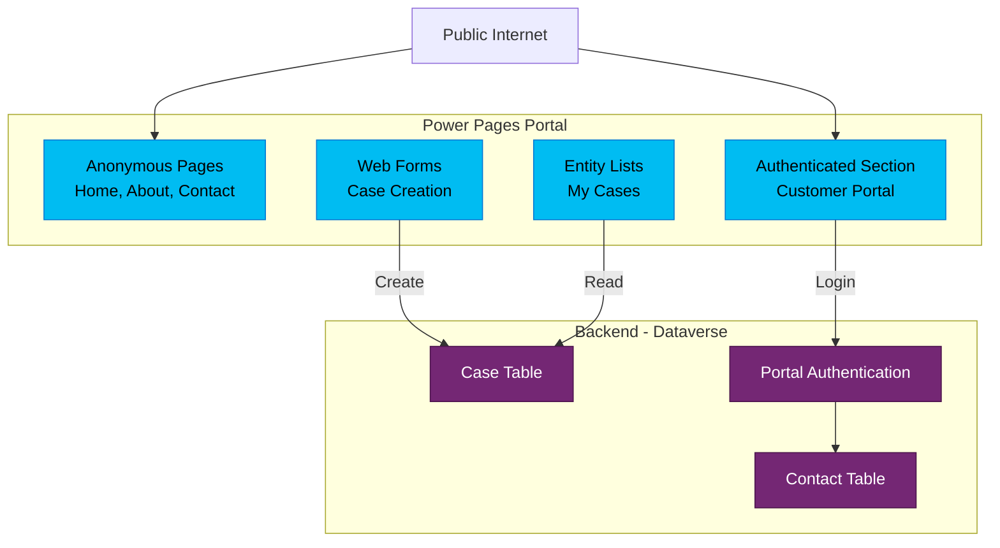

**Authentication Options**:
- Local authentication (Dataverse contact)
- Azure AD B2C
- OAuth 2.0 providers (Google, Facebook, LinkedIn)
- SAML 2.0 (enterprise SSO)

**Best Practices**:
- Use web roles and page permissions for security
- Implement table permissions (entity permissions) carefully
- Optimize for performance (caching, CDN)
- Use custom CSS/JavaScript sparingly (upgrade implications)
- Implement proper error handling and logging
- Plan for scalability (Premium capacity for high traffic)

**Licensing Considerations**:
- Per-website licensing (capacity-based)
- Authenticated users: Internal (via Dynamics/Power Apps) or external (per login)
- Anonymous users: Page view-based capacity

---

### 5. Copilot Studio (formerly Power Virtual Agents)

**Purpose**: Build conversational AI chatbots and copilots

**Key Capabilities**:
- **No-code bot creation**: Visual designer for conversation flows
- **Natural language understanding**: Intent recognition and entity extraction
- **Generative AI**: Integration with Azure OpenAI for dynamic responses
- **Multi-channel deployment**: Teams, websites, mobile apps, Azure Bot Service channels
- **Integration**: Call Power Automate flows, query Dataverse, call APIs

**Architecture Pattern**:

**Pattern: Intelligent Customer Service Bot**
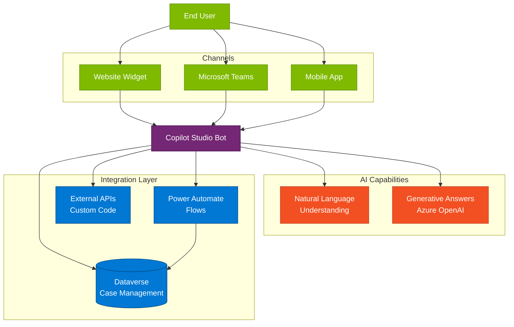

**Generative AI Integration**:
- Boost conversations with Azure OpenAI
- Dynamic responses based on knowledge base
- Website URL scraping for content
- Document upload for context
- Dataverse integration for organizational data

**Best Practices**:
- Start with topic-based conversations, add generative AI for flexibility
- Use entities for consistent data extraction
- Implement slot filling for multi-turn conversations
- Test thoroughly with diverse user inputs
- Monitor analytics for conversation improvement
- Implement fallback topics for unhandled scenarios

---

## Microsoft Dataverse: The Foundation

### Overview

Dataverse is the underlying data platform for Power Platform and Dynamics 365:
- **Relational database** with tables, columns, relationships
- **Business logic layer** with business rules, workflows, plugins
- **Security model** with row-level and field-level security
- **APIs** for integration (Web API, Organization Service)
- **Built-in features**: Audit logging, duplicate detection, business rules

### Architecture

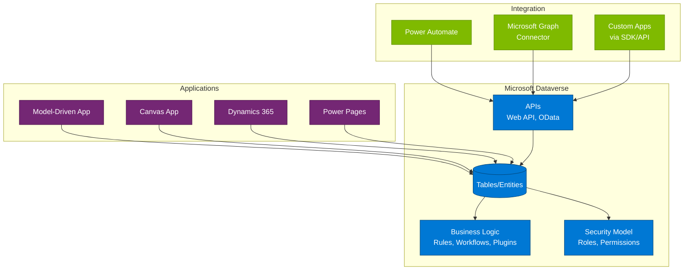

### Dataverse vs. Other Data Platforms

| Feature | Dataverse | SharePoint Lists | Azure SQL | Cosmos DB |
|---------|-----------|------------------|-----------|-----------|
| **Best For** | Business apps, CRM | Document-centric | Relational apps | Global, NoSQL |
| **Licensing** | Power Apps/Dynamics | Included in M365 | Azure consumption | Azure consumption |
| **Offline** | Full support | Limited | Custom code needed | Custom code needed |
| **Business Logic** | Native (plugins, rules) | Limited (Power Automate) | Stored procedures | Application layer |
| **Security** | Row/field level | Item level (limited) | Row level | Application layer |
| **Integration** | Native to Power Platform | Good with Power Platform | Azure services | Azure services |
| **Scalability** | Up to 4TB per environment | Limited per list | Virtually unlimited | Virtually unlimited |

---

## Power Platform Well-Architected Framework

Power Platform has its own Well-Architected Framework with six pillars (note: Experience Optimization replaces Cost Optimization):

### Pillars Overview

1. **Reliability**: Ensure solutions meet uptime commitments
2. **Security**: Protect data and meet compliance requirements
3. **Operational Excellence**: Streamline development and operations
4. **Performance Efficiency**: Meet performance requirements efficiently
5. **Experience Optimization**: Deliver great user experience and adoption
6. **Azure Integration** (Security): Secure integration with Azure services

**Reference**: See `/references/frameworks/powerplatform-waf-*.md` for detailed guidance on each pillar.

---

## Integration Patterns

### Power Platform + Microsoft 365

**Common Scenarios**:
- SharePoint lists as data source for Canvas Apps
- Outlook integration for email-driven flows
- Teams embedding of Canvas Apps and Power BI
- OneDrive for document storage in Power Apps

**Integration Pattern**:
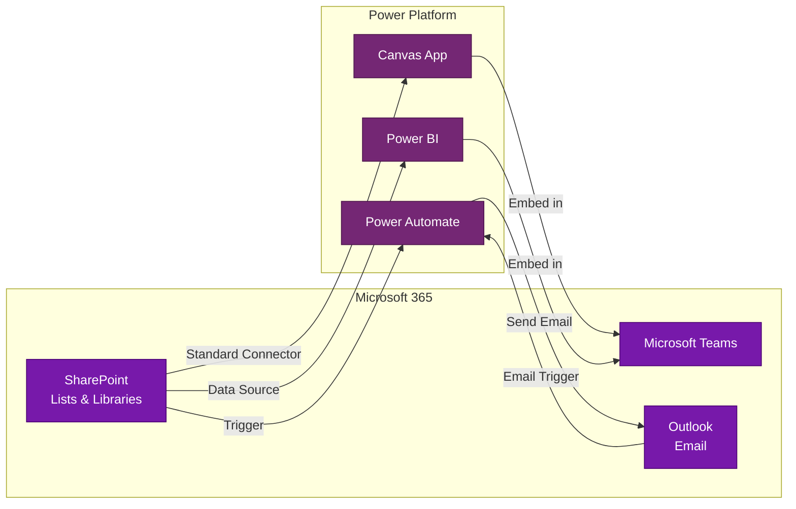

**Best Practices**:
- Use SharePoint for documents, Dataverse for relational data
- Leverage included connectors (no premium license required)
- Embed Power Apps in SharePoint for contextual experiences
- Use Microsoft Graph connector for advanced scenarios

---

### Power Platform + Azure

**Common Scenarios**:
- Azure Functions as custom connectors
- Azure SQL as enterprise data source
- Azure Service Bus for reliable messaging
- Azure Key Vault for secure credential storage
- Azure API Management for API governance

**Integration Pattern**:
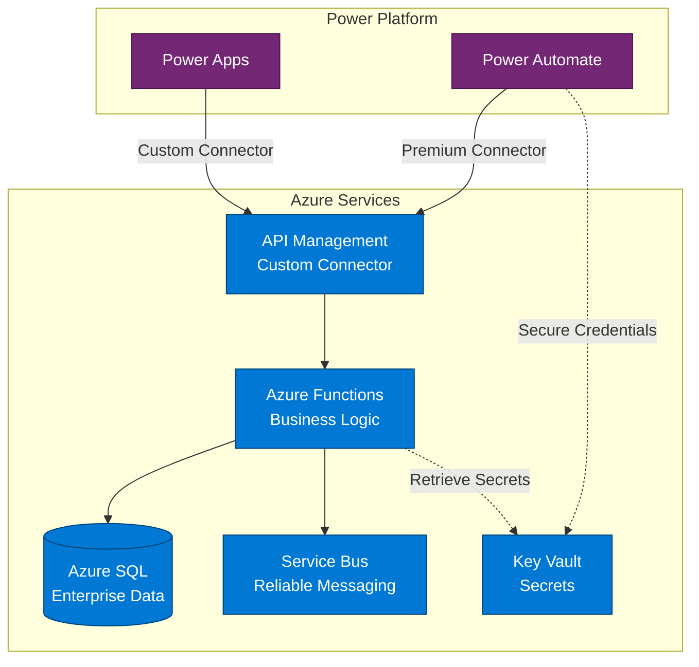

**Custom Connector Pattern**:
- Build Azure Function with HTTP trigger
- Expose OpenAPI specification
- Create custom connector in Power Platform
- Use service principal for authentication
- Implement throttling and error handling

**Best Practices**:
- Use managed identities for Azure service authentication
- Implement API Management for security and throttling
- Use Azure Functions for complex business logic not possible in Power Automate
- Store secrets in Azure Key Vault, not in flows
- Implement logging and monitoring for integration points

---

### Power Platform + Dynamics 365

**Integration Model**:
Dynamics 365 and Power Platform share the same underlying platform (Dataverse), making integration seamless:

**Shared Foundation**:
- Same data model (Dataverse tables)
- Same security model
- Same business logic layer
- Same API (Web API, Organization Service)

**Extension Scenarios**:
- Model-driven apps extend Dynamics 365
- Canvas apps provide mobile experiences
- Power Automate adds custom workflows
- Power BI provides advanced analytics
- Copilot Studio adds conversational interfaces

---

## Licensing and Governance

### Licensing Models

**Power Apps**:
- **Per-user plan**: Unlimited apps for the user ($20/user/month)
- **Per-app plan**: Single app access ($5/user/app/month)
- **Pay-as-you-go**: Azure subscription-based
- **Included with M365**: Limited Power Apps capabilities (standard connectors, limited runs)

**Power Automate**:
- **Per-user plan**: Unlimited flows ($15/user/month)
- **Per-flow plan**: Unlimited users for specific flows ($100/flow/month)
- **Included with M365**: Limited runs per user (varies by plan)

**Power BI**:
- **Free**: Individual use, no sharing
- **Pro**: Collaboration and sharing ($10/user/month)
- **Premium Per User**: Advanced features ($20/user/month)
- **Premium Per Capacity**: Dedicated capacity for organization (starting ~$5000/month)

**Power Pages**:
- **Per-website**: Capacity-based pricing
- **Authenticated users**: Internal or external
- **Anonymous users**: Page views

**Premium Connectors**:
- Many connectors (Azure SQL, Salesforce, custom connectors) require Power Apps/Automate license
- On-premises data gateway scenarios require premium

### Center of Excellence (CoE)

**Purpose**: Govern, manage, and support Power Platform adoption

**CoE Starter Kit Components**:
- **Governance**: Environment management, DLP policies, app/flow inventory
- **Nurture**: Training resources, maker onboarding, communication templates
- **Audit & Reporting**: Usage analytics, license optimization, compliance reports

**Governance Best Practices**:
- Environment strategy (personal, development, test, production)
- Data Loss Prevention (DLP) policies to control connector usage
- Naming conventions for apps, flows, environments
- Approval processes for production deployments
- Maker training and certification
- Regular audits and cleanup of unused resources

**Architecture Pattern for Enterprise Governance**:
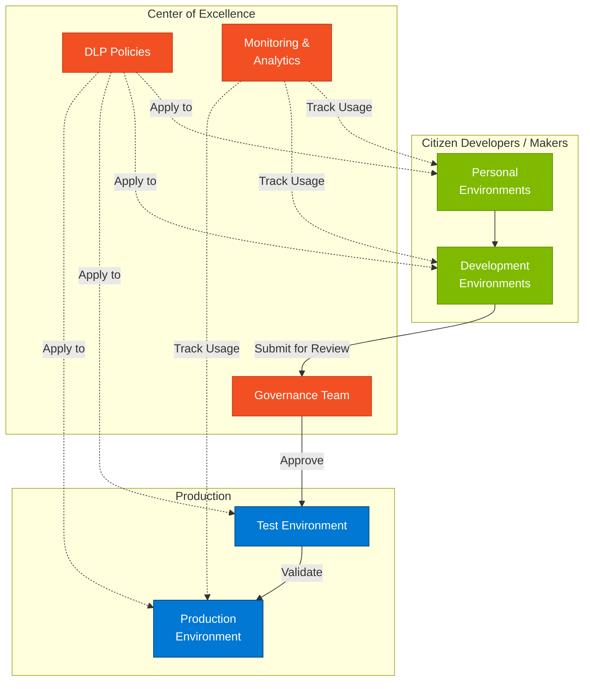

---

## Common Use Cases and Scenarios

### Use Case 1: Employee Expense Management

**Solution Components**:
- Canvas app for mobile expense submission
- Power Automate for approval workflow
- SharePoint for receipt storage
- Power BI for expense analytics
- Integration with ERP via custom connector

**Architecture Benefits**:
- Mobile-first experience for employees
- Automated approval routing based on business rules
- Integration with existing finance systems
- Real-time visibility for managers

---

### Use Case 2: Customer Feedback Portal

**Solution Components**:
- Power Pages for public-facing feedback form
- Dataverse for feedback storage
- Power Automate for routing and notifications
- Model-driven app for internal case management
- Power BI for sentiment analysis and trending

**Architecture Benefits**:
- External users can provide feedback without internal licenses
- Integrated case management for customer service team
- Analytics for continuous improvement

---

### Use Case 3: Inspection and Audit Mobile App

**Solution Components**:
- Canvas app with offline capabilities
- Dataverse for inspection data
- Power Automate for corrective action workflows
- Power BI for compliance dashboards
- Integration with IoT devices via Azure

**Architecture Benefits**:
- Works offline in field locations
- Photo and signature capture
- Automated workflows for non-compliance
- Real-time dashboards for management

---

## Common Anti-Patterns to Avoid

### Anti-Pattern 1: Exceeding Platform Limits

**Problem**: Building solutions that hit delegation limits, connector throttling, or performance constraints

**Impact**: Poor performance, failed flows, user frustration

**Solution**:
- Understand and design for delegation limits (Canvas Apps: 2000 records by default)
- Use Dataverse instead of SharePoint for large datasets
- Implement pagination and data virtualization
- Consider Azure for high-volume processing scenarios

---

### Anti-Pattern 2: Insufficient Governance

**Problem**: Allowing uncontrolled creation of apps, flows, and environments

**Impact**: Sprawl, duplicate solutions, security risks, licensing waste

**Solution**:
- Implement Center of Excellence
- DLP policies from day one
- Environment strategy and provisioning process
- Regular audits and cleanup

---

### Anti-Pattern 3: Ignoring ALM

**Problem**: Developing directly in production or lacking deployment pipeline

**Impact**: Broken production apps, lost work, inability to rollback

**Solution**:
- Separate development, test, and production environments
- Use solutions for packaging and deployment
- Implement source control integration (Azure DevOps, GitHub)
- Use deployment pipelines (Power Platform Pipelines or Azure DevOps)

---

## When to Load This Reference

Load this reference when:
- Designing low-code/no-code solutions
- Evaluating Power Platform for business requirements
- Architecting Dataverse data models
- Planning Power Platform governance
- Integrating Power Platform with other Microsoft platforms
- Extending Dynamics 365 or Microsoft 365
- Keywords: "Power Apps", "Power Automate", "Power BI", "Power Pages", "Copilot Studio", "low-code", "citizen developer", "Dataverse"

## Related References

- `/references/technology/core-platforms.md` - Platform selection guidance
- `/references/technology/m365-specifics.md` - Microsoft 365 integration
- `/references/technology/azure-specifics.md` - Azure integration scenarios
- `/references/technology/dynamics-specifics.md` - Dynamics 365 integration
- `/references/frameworks/powerplatform-waf-*.md` - Power Platform Well-Architected Framework pillars
- `/references/templates/mermaid-diagram-patterns.md` - Diagram templates

## Microsoft Resources

**Power Platform Architecture**:
- Power Platform Architecture: https://learn.microsoft.com/en-us/power-platform/architecture/
- Power Apps Architecture: https://learn.microsoft.com/en-us/power-apps/guidance/architecture/
- Power Automate Architecture: https://learn.microsoft.com/en-us/power-automate/guidance/planning/

**Power Platform Well-Architected**:
- Power Platform WAF: https://learn.microsoft.com/en-us/power-platform/well-architected/

**Development**:
- Power Apps Component Framework: https://learn.microsoft.com/en-us/power-apps/developer/component-framework/overview
- Dataverse Developer Guide: https://learn.microsoft.com/en-us/power-apps/developer/data-platform/
- Custom Connectors: https://learn.microsoft.com/en-us/connectors/custom-connectors/

**Governance**:
- Center of Excellence Starter Kit: https://learn.microsoft.com/en-us/power-platform/guidance/coe/starter-kit
- DLP Policies: https://learn.microsoft.com/en-us/power-platform/admin/wp-data-loss-prevention
- Environment Strategy: https://learn.microsoft.com/en-us/power-platform/admin/environments-overview

**Licensing**:
- Power Apps Pricing: https://www.microsoft.com/en-us/power-platform/products/power-apps/pricing
- Power Automate Pricing: https://www.microsoft.com/en-us/power-platform/products/power-automate/pricing
- Power BI Pricing: https://www.microsoft.com/en-us/power-platform/products/power-bi/pricing

---

*Power Platform enables rapid application development while maintaining enterprise governance. Understanding its capabilities, integration patterns, and limitations is essential for delivering business value quickly while ensuring long-term maintainability.*
