# C4 Model Diagram Guide: All 7 Diagram Types with Mermaid Templates

The definitive C4 model reference based on the official specification at c4model.com. Covers all 7 diagram types with copy-paste Mermaid.js templates and filled-in examples for Microsoft technology stacks.

---

## 1. C4 Model Overview

The C4 model provides four core abstraction levels for describing software architecture:

1. **Person**: A human user of the system (user, actor, role, persona). People use software systems to achieve goals.
2. **Software System**: The highest abstraction. A set of containers that together deliver value to users. This is the thing you are building or describing.
3. **Container**: A separately deployable/runnable unit that executes code or stores data. Containers are NOT Docker containers and NOT code libraries. Examples: web app, API, database, message queue, serverless function, mobile app, file system.
4. **Component**: A grouping of related functionality behind a well-defined interface, running inside a single container. Components map to class collections (C#), modules (TypeScript), or function groups (Python).

These abstractions nest hierarchically. Each level zooms in with more detail. A software system is made up of containers, which are made up of components, which are implemented by code constructs.

### Notation Independence

The C4 model is notation-independent. We use **Mermaid.js** for all diagram rendering. The C4 abstractions (Person, System, Container, Component) map to Mermaid's C4 diagram types or standard flowchart/sequence diagrams.

### Mandatory Diagram Rules

All C4 diagrams MUST include:
- **Title** in format: `[Diagram Type] for [Scope]` (e.g., "Container Diagram for Order Management System")
- **Key/Legend** explaining colors, shapes, and line styles
- **Labeled elements** with name, type, technology (where applicable), and description
- **Labeled unidirectional relationships** describing the intent of the interaction
- **Technology/protocol** on relationship labels at container and component levels

### C4 Model Review Checklist (from c4model.com/diagrams/checklist)

- Every diagram has a title describing diagram type and scope
- Every element has a name, type, technology, and description
- Every relationship line has a label describing intent (not just "Uses")
- Every diagram has a key/legend
- Colors are consistent and explained in the legend
- Acronyms are defined or understandable
- No orphaned elements; every element has at least one relationship

---

## 2. Level 1: System Context Diagram

**Scope**: A single software system.
**Primary elements**: The software system in scope (shown as a single box).
**Supporting elements**: People and other software systems that interact with it directly.
**Audience**: Technical AND non-technical stakeholders, from business sponsors to developers.

The System Context diagram is the starting point for diagramming any software architecture. It shows the big picture: how the system fits into the world around it. Detail is not important here; the focus is on people and software systems rather than technologies, protocols, and other low-level details.

This diagram answers: "What is the system? Who uses it? What does it interact with?"

Recommended for ALL software development teams. Draw it at the start of every project.

### Mermaid Template

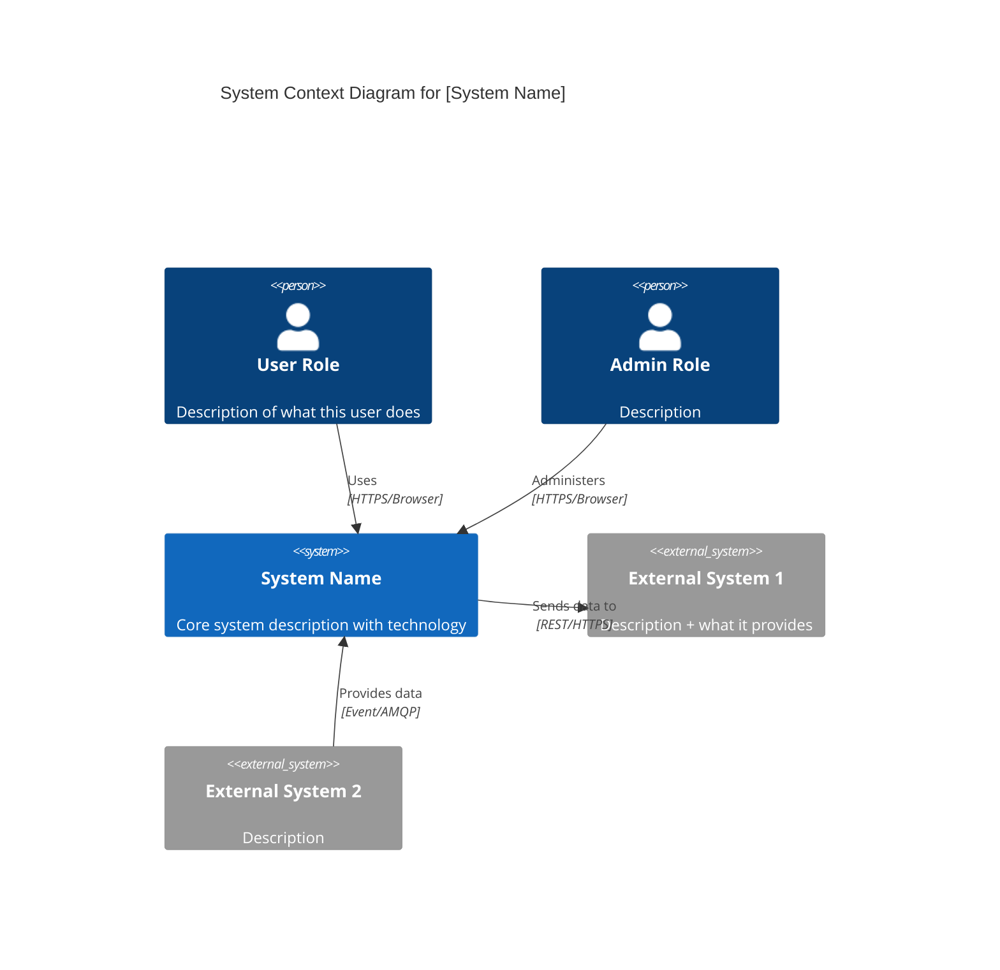

### Filled-In Example: D365 + Power Platform + Azure Solution

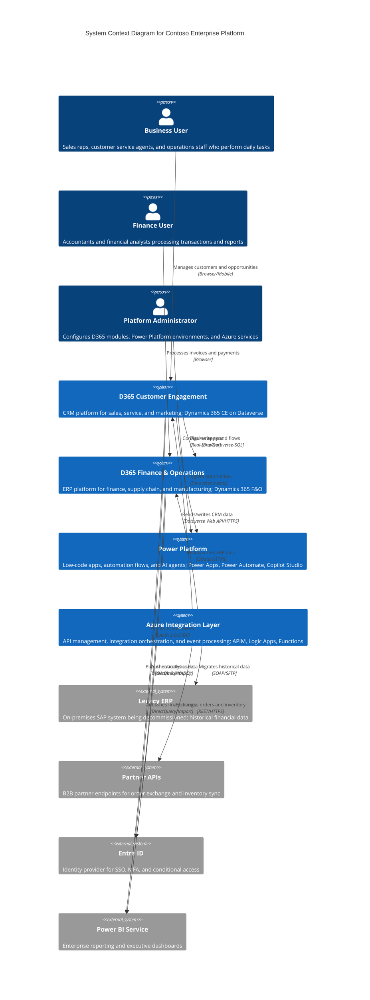

---

## 3. Level 2: Container Diagram

**Scope**: A single software system.
**Primary elements**: Containers (applications, data stores, message brokers) within the system boundary.
**Supporting elements**: People and external software systems that interact with the containers.
**Audience**: Technical people: software architects, developers, and operations staff.

The Container diagram zooms into the software system and shows the high-level shape of the software architecture: what containers exist, what their responsibilities are, what technology choices have been made, and how the containers communicate.

A "container" is a separately deployable/runnable unit: web application, API service, database, message queue, file system, serverless function, mobile app. This is NOT a Docker container (although Docker containers are one way to deploy containers).

**Important**: Deployment details like clustering, load balancing, replication, and failover are intentionally omitted. Those belong in Deployment diagrams (Section 8).

### Mermaid Template

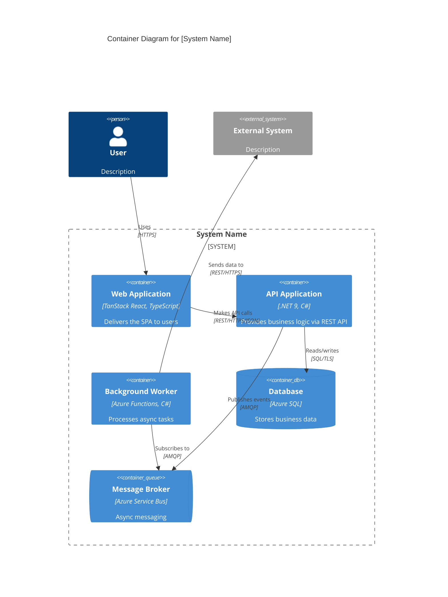

### Filled-In Example: Stack D (D365 + Azure + Fabric)

```mermaid
C4Container
    title Container Diagram for Contoso Enterprise Platform

    Person(salesRep, "Sales Representative", "Manages leads, opportunities, and customer accounts")
    Person(finUser, "Finance User", "Processes invoices, payments, and financial reports")
    Person(exec, "Executive", "Views dashboards and KPIs")

    System_Boundary(platform, "Contoso Enterprise Platform") {
        Container(d365Sales, "D365 Sales", "D365 CE Module", "Lead and opportunity management, pipeline tracking")
        Container(d365Service, "D365 Customer Service", "D365 CE Module", "Case management, knowledge base, SLA tracking")
        Container(d365Finance, "D365 Finance", "D365 F&O Module", "General ledger, AP/AR, financial reporting")
        Container(d365SCM, "D365 Supply Chain", "D365 F&O Module", "Inventory, procurement, warehouse management")
        Container(plugins, "D365 Plugins", "C# / Dataverse SDK", "Custom business logic triggered by platform events")
        Container(powerApps, "Custom Power Apps", "Power Apps Model-Driven + Canvas", "Specialized UI for approvals and field data capture")
        Container(powerAutomate, "Automation Flows", "Power Automate Cloud Flows", "Business process automation and approval routing")
        Container(apim, "API Management", "Azure APIM", "API gateway for external and internal integrations")
        Container(logicApps, "Integration Orchestrator", "Azure Logic Apps", "Data transformation and multi-system orchestration")
        Container(functions, "Event Processors", "Azure Functions C#", "Event-driven compute for async workloads")
        ContainerDb(dataverse, "Dataverse", "Microsoft Dataverse", "Unified data platform for all CE module data")
        ContainerDb(foDb, "F&O Database", "Azure SQL", "Finance and operations transactional data")
        ContainerDb(fabric, "Data Lakehouse", "Microsoft Fabric", "Unified analytics: lakehouse, warehouse, and notebooks")
        Container(pbi, "Reports & Dashboards", "Power BI", "Operational analytics, executive KPIs, and embedded reports")
        ContainerQueue(serviceBus, "Message Broker", "Azure Service Bus", "Async integration messaging between systems")
    }

    System_Ext(legacyERP, "Legacy ERP", "On-premises SAP system with historical financial data")
    System_Ext(partnerAPI, "Partner APIs", "B2B endpoints for order exchange and inventory sync")
    System_Ext(entraID, "Entra ID", "Identity and access management")

    Rel(salesRep, d365Sales, "Manages pipeline", "Browser/Mobile")
    Rel(salesRep, d365Service, "Handles cases", "Browser")
    Rel(finUser, d365Finance, "Processes transactions", "Browser")
    Rel(finUser, d365SCM, "Manages inventory", "Browser")
    Rel(exec, pbi, "Views dashboards", "Browser/Mobile")
    Rel(d365Sales, dataverse, "Reads/writes records", "Dataverse SDK")
    Rel(d365Service, dataverse, "Reads/writes records", "Dataverse SDK")
    Rel(d365Finance, foDb, "Reads/writes data", "SQL/TDS")
    Rel(d365SCM, foDb, "Reads/writes data", "SQL/TDS")
    Rel(plugins, dataverse, "Executes on events", "Dataverse SDK")
    Rel(plugins, serviceBus, "Publishes integration events", "AMQP")
    Rel(powerApps, dataverse, "Reads/writes records", "Dataverse connector")
    Rel(powerAutomate, dataverse, "Automates processes", "Dataverse connector")
    Rel(dataverse, foDb, "Dual-write sync", "Real-time")
    Rel(serviceBus, functions, "Delivers events", "AMQP")
    Rel(serviceBus, logicApps, "Delivers events", "AMQP")
    Rel(logicApps, legacyERP, "Syncs historical data", "REST/SOAP")
    Rel(apim, partnerAPI, "Exchanges orders", "REST/HTTPS")
    Rel(apim, logicApps, "Routes integration requests", "HTTPS/JSON")
    Rel(fabric, dataverse, "Ingests CRM data", "Dataverse shortcut/ADLS")
    Rel(fabric, foDb, "Ingests ERP data", "SQL/Mirroring")
    Rel(pbi, fabric, "Queries analytics data", "DirectLake/SQL endpoint")
    Rel(d365Sales, entraID, "Authenticates users", "OAuth 2.0/OIDC")
    Rel(d365Finance, entraID, "Authenticates users", "OAuth 2.0/OIDC")
```

---

## 4. Level 3: Component Diagram

**Scope**: A single container.
**Primary elements**: Components within the container.
**Supporting elements**: Other containers and external systems that the components interact with.
**Audience**: Developers working on that specific container.

The Component diagram shows how a container is made up of components, what each component is, its responsibilities, and the technology/implementation details. A component is a grouping of related functionality behind a well-defined interface: collections of classes, modules, or function groups.

**Not all containers need component diagrams.** Only create them for complex containers where the internal structure adds significant value to understanding. For simple containers or long-lived documentation, consider auto-generating from code.

### Mermaid Template

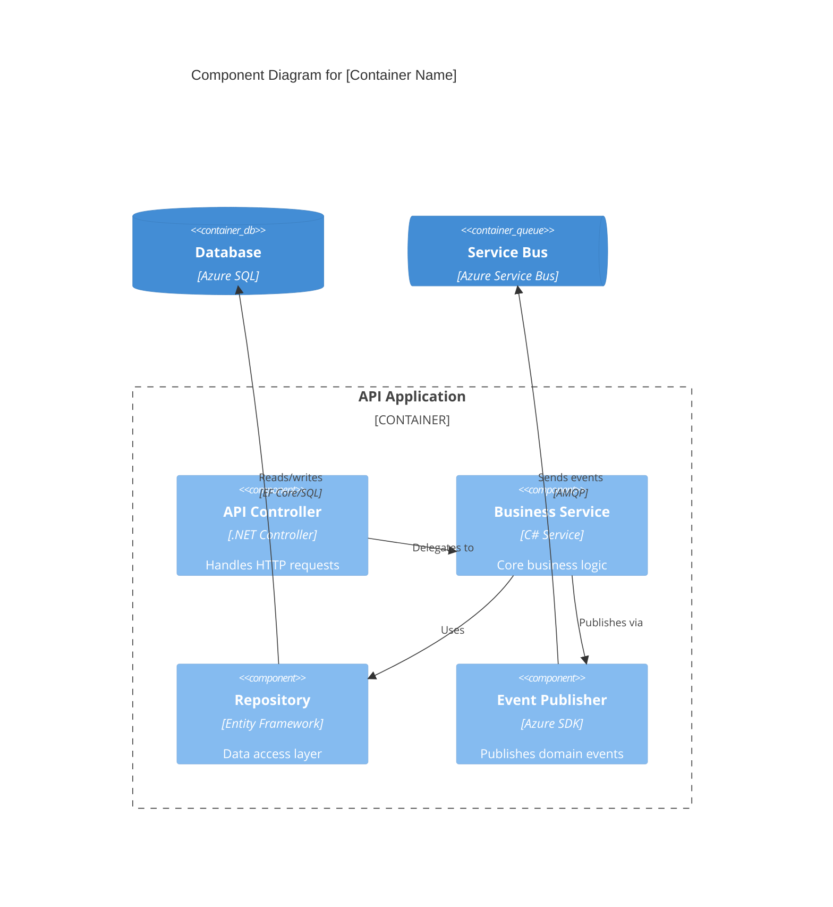

### Filled-In Example: .NET API Container

```mermaid
C4Component
    title Component Diagram for Order Management API [ASP.NET Core C#]

    Container_Boundary(api, "Order Management API") {
        Component(orderCtrl, "Order Controller", "API Controller", "Handles HTTP requests for order CRUD and status changes")
        Component(customerCtrl, "Customer Controller", "API Controller", "Handles HTTP requests for customer lookup and management")
        Component(authMiddleware, "Auth Middleware", "JWT Middleware", "Validates bearer tokens and extracts claims from Entra ID")
        Component(orderSvc, "Order Service", "Domain Service", "Order business rules: validation, pricing, state transitions")
        Component(customerSvc, "Customer Service", "Domain Service", "Customer lifecycle, credit checks, and profile management")
        Component(notifSvc, "Notification Service", "Application Service", "Orchestrates email and push notifications across channels")
        Component(orderRepo, "Order Repository", "EF Core Repository", "Order aggregate persistence and query optimization")
        Component(customerRepo, "Customer Repository", "EF Core Repository", "Customer data access with caching")
        Component(eventPub, "Event Publisher", "Service Bus Client", "Publishes domain events to Azure Service Bus topics")
        Component(extAdapter, "External System Adapter", "HTTP Client / ACL", "Anti-corruption layer for legacy ERP integration")
    }

    ContainerDb(db, "Order Database", "Azure SQL")
    ContainerQueue(sb, "Service Bus", "Azure Service Bus")
    System_Ext(legacyERP, "Legacy ERP", "Historical order data")

    Rel(orderCtrl, authMiddleware, "Validates auth then delegates")
    Rel(customerCtrl, authMiddleware, "Validates auth then delegates")
    Rel(authMiddleware, orderSvc, "Delegates order operations")
    Rel(authMiddleware, customerSvc, "Delegates customer operations")
    Rel(orderSvc, orderRepo, "Persists order aggregates")
    Rel(orderSvc, eventPub, "Publishes OrderCreated, OrderUpdated events")
    Rel(orderSvc, extAdapter, "Fetches historical order data")
    Rel(customerSvc, customerRepo, "Persists customer data")
    Rel(customerSvc, notifSvc, "Triggers welcome email")
    Rel(orderRepo, db, "Reads/writes", "EF Core/SQL")
    Rel(customerRepo, db, "Reads/writes", "EF Core/SQL")
    Rel(eventPub, sb, "Sends events", "AMQP")
    Rel(extAdapter, legacyERP, "Queries legacy data", "REST/HTTPS")
```

---

## 5. Level 4: Code Diagram

Code diagrams show the internal structure of a single component, typically as UML class diagrams or entity-relationship diagrams. These are the lowest level of the C4 model.

**In practice, code diagrams are rarely created manually.** They are best auto-generated from code using IDE tooling (Visual Studio class diagrams, JetBrains diagrams, or static analysis tools). They become outdated quickly when hand-maintained.

Use code diagrams only when:
- A complex type hierarchy needs documentation for onboarding
- A critical domain model needs visual documentation for review
- Auto-generation from code is available

### Mermaid Class Diagram Example

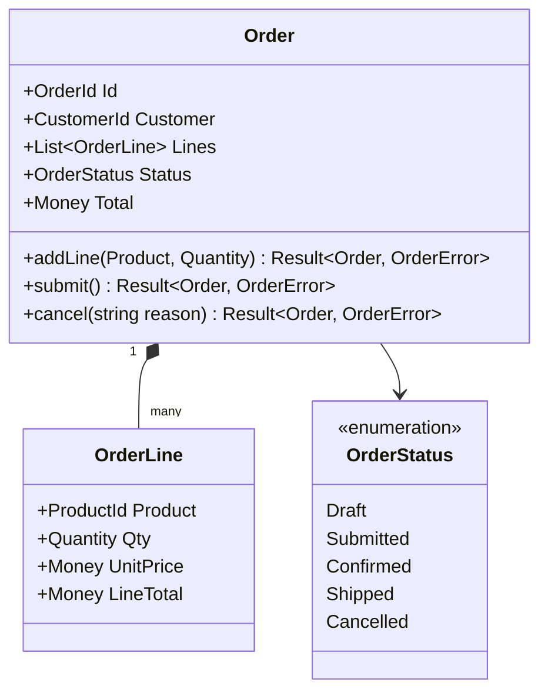

---

## 6. Supplementary: System Landscape Diagram

**Scope**: An enterprise or organization.
**Primary elements**: ALL software systems and people across the organization.
**Supporting elements**: Organizational boundaries and inter-system relationships.
**Audience**: Everyone, from C-suite executives to architects performing M&A due diligence.

A System Landscape diagram is essentially a System Context diagram without focusing on a single system. It provides the big picture of the entire IT landscape: all systems, all users, all inter-system data flows.

### When to Use

- Large organizations with multiple interacting software systems
- Enterprise architecture overviews and portfolio assessments
- M&A due diligence (understanding the target's IT landscape)
- Establishing context before drilling into any specific system

### Mermaid Template

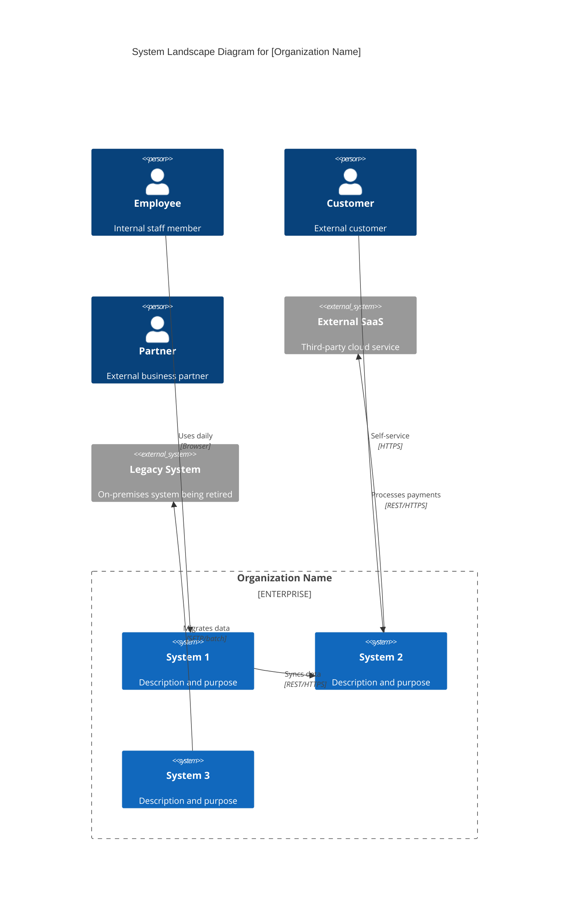

### Filled-In Example: Contoso Enterprise Landscape

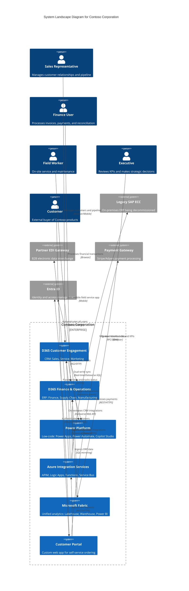

---

## 7. Supplementary: Dynamic Diagram

**Scope**: A specific feature, user story, or use case.
**Primary elements**: C4 elements (containers, components) that participate in the runtime interaction.
**Audience**: Technical stakeholders who need to understand how elements collaborate at runtime.

Dynamic diagrams show how elements interact at runtime to fulfill a specific use case. They are like UML sequence or collaboration diagrams, but use C4 abstractions instead of classes.

Dynamic diagrams can be rendered as:
- **Collaboration style**: free-form flowchart with numbered edges showing interaction order
- **Sequence style**: Mermaid sequence diagram showing temporal message ordering

Use dynamic diagrams for interesting or complex multi-step interactions, not trivial CRUD operations.

### Collaboration Style Template

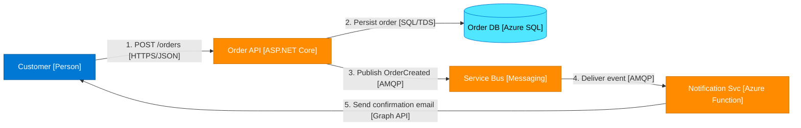

### Sequence Style Template

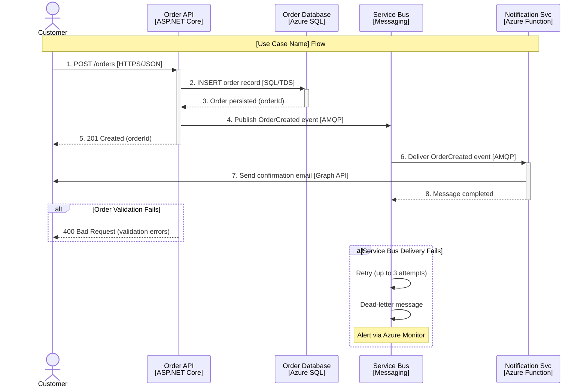

### Filled-In Example: Customer Places Order (D365 CE → Dual-Write → F&O → Fabric → Power BI)

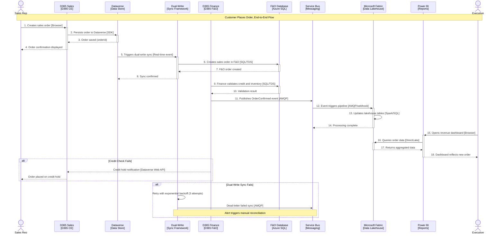

---

## 8. Supplementary: Deployment Diagram

**Scope**: A single deployment environment (development, staging, production).
**Primary elements**: Deployment nodes and container instances mapped to infrastructure.
**Supporting elements**: Infrastructure nodes (DNS, WAF, load balancers, monitoring).
**Audience**: Operations staff, infrastructure architects, DevOps engineers.

Deployment diagrams show how containers from the Container diagram map to real infrastructure. Deployment nodes represent physical or virtual infrastructure: servers, VMs, cloud services, execution environments.

**Deployment nodes can nest**: Azure Region → Resource Group → App Service Plan → App Service. This nesting shows the deployment topology.

Each deployment node should include:
- Name and type of the infrastructure
- Technology/service tier
- Container instances running within it
- Scaling configuration (replicas, auto-scale rules)

### Mermaid Template

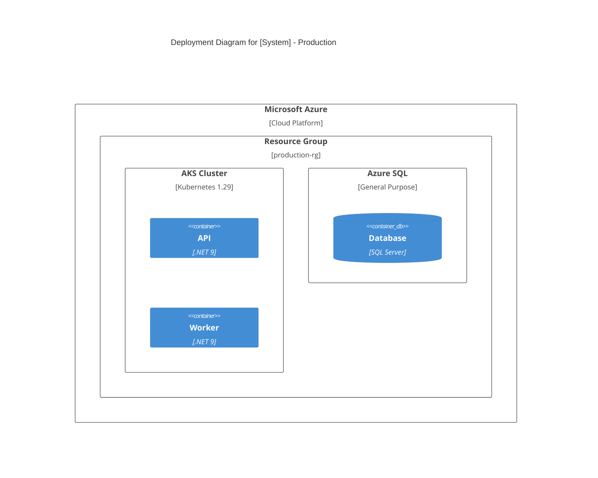

### Filled-In Example: Stack D Production Deployment

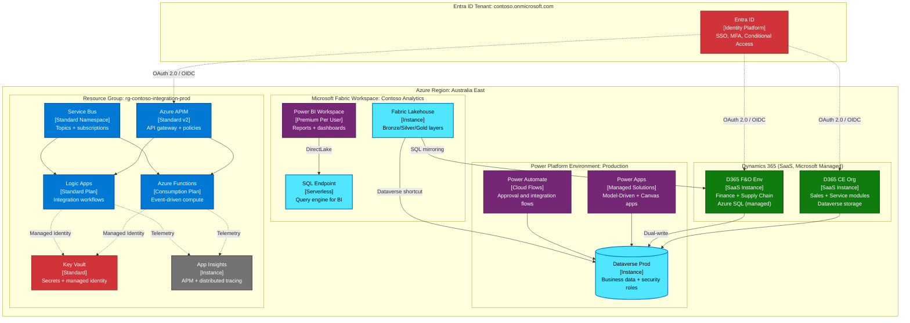

---

## 9. Per-Stack C4 Quick Reference

Decision matrix showing which diagram types are most useful per technology stack.

| Diagram Type | Stack A (Power Platform) | Stack B (PP + Azure PaaS) | Stack C (PP + Azure + Containers) | Stack D (D365 + Azure + Fabric) |
|---|---|---|---|---|
| System Context | Always | Always | Always | Always |
| Container | Recommended | Required | Required | Required |
| Component | Rarely | Complex areas only | Per microservice | Per custom integration |
| Dynamic | Key flows only | Key flows | Key flows | Key flows (dual-write, order-to-cash) |
| Deployment | Environment topology only (SaaS) | Recommended | Required | Recommended |
| System Landscape | Multi-system only | Multi-system only | Multi-system only | Always (shows D365 + surrounding ecosystem) |
| Code | Never | Rarely | Complex domain models | Never |

### Guidance by Document Type

**HLD (High-Level Design)**:
- System Landscape (if multi-system) + System Context + Container + Deployment = minimum set
- Establishes the big picture that all subsequent work references

**LLD (Low-Level Design)**:
- Component diagrams for complex containers + Dynamic diagrams for key flows + Detailed deployment
- Provides the detail developers need for implementation

**spec (Story Specification)**:
- System Context (reference) + Container (reference or updated) + Dynamic (always new for the story)
- Focus on showing how THIS story's feature flows through the architecture

---

## 10. C4 Diagram Review Checklist

Use this checklist to validate every C4 diagram before including it in documentation. Based on the official checklist at c4model.com/diagrams/checklist.

### General

- [ ] Diagram has a title with type and scope (e.g., "Container Diagram for Order Management System")
- [ ] Diagram type is immediately clear to the reader
- [ ] Scope of the diagram is obvious
- [ ] Diagram has a key/legend explaining colors, shapes, and line styles

### Elements

- [ ] Every element has a clear, descriptive name (not "Service A" or "DB")
- [ ] Every element has an explicit type ([Person], [Software System], [Container], [Component])
- [ ] Every element has a short description of its responsibilities
- [ ] All containers and components include technology annotations
- [ ] All acronyms and abbreviations are understandable or defined in the legend
- [ ] Colors are used consistently per the color conventions table
- [ ] No more than 15 elements per diagram (split if larger)

### Relationships

- [ ] Every line has a label describing the intent of the interaction
- [ ] Labels match the arrow direction (source does X to target)
- [ ] Container-level and component-level relationships include technology/protocol
- [ ] Line styles (solid vs. dashed) are explained in the legend if used
- [ ] No orphaned elements; every element has at least one relationship
- [ ] Relationships are unidirectional (one arrow direction per line)

### Color Conventions (Microsoft Stack)

| Color | Hex | Usage |
|-------|-----|-------|
| Blue | `#0078D4` | Azure services (App Service, Functions, APIM, AKS) |
| Purple | `#742774` | Power Platform (Power Apps, Power Automate, Power BI) |
| Green | `#107C10` | Dynamics 365 (CE, F&O, Business Central) |
| Gray | `#737373` | External / third-party systems |
| Orange | `#FF8C00` | Custom-built components (your code) |
| Light Blue | `#50E6FF` | Data stores (databases, blob storage, caches) |
| Dark Blue | `#003067` | System boundaries (subgraph borders) |
| Red | `#D13438` | Security / identity services (Entra ID, Key Vault) |
