# LLD Process Diagrams - Mermaid Templates

This reference provides comprehensive Mermaid.js templates for low-level process diagrams and component interaction flows. These diagrams bridge the gap between architecture documentation and actual implementation: a mid-level developer or coding agent should be able to look at these diagrams and understand exactly what to build, what calls what, what data flows where, and how errors are handled.

---

## 1. Component Interaction Flow Diagrams

These diagrams show method-level interactions between components. Every arrow is labeled with the action and payload shape. Both synchronous and asynchronous interactions are explicitly marked.

### Stack A: Canvas App --> Dataverse --> Power Automate --> External API

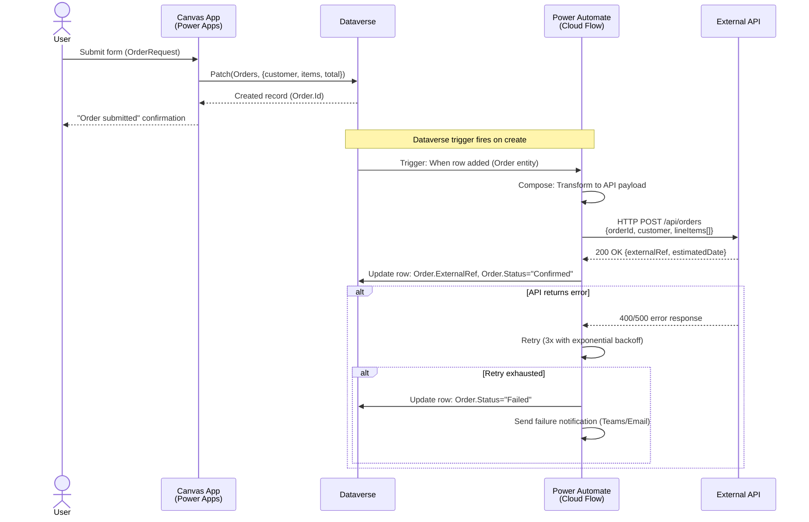

### Stack B: React App --> APIM --> Azure Function --> Azure SQL --> Service Bus

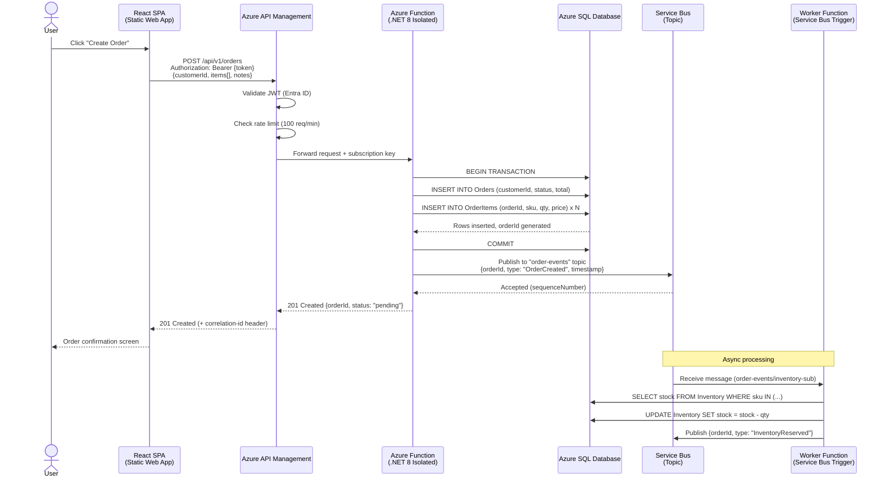

### Stack C: Ingress --> API Container --> Service Container --> Database --> Message Broker

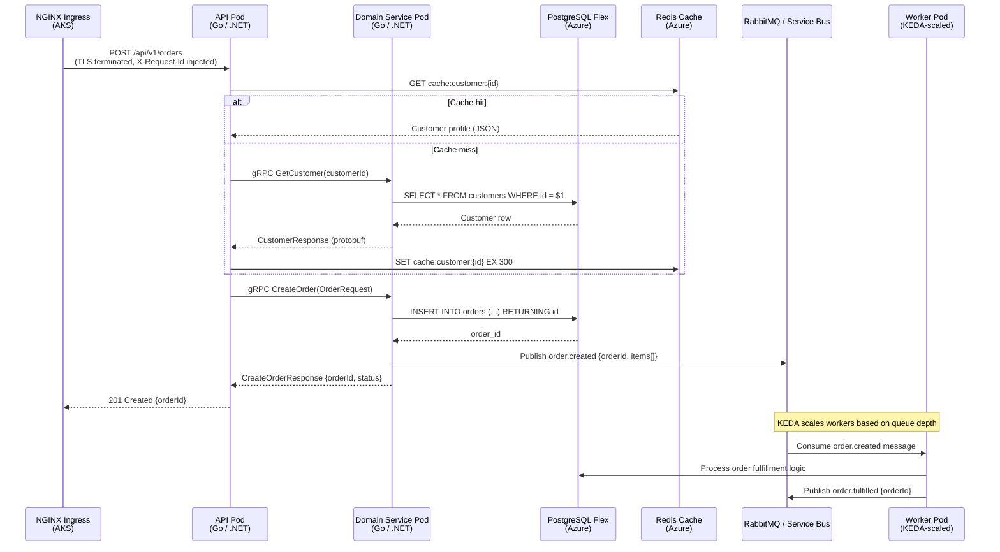

### Stack D: D365 Form --> Plugin --> External API --> Dual-Write --> F&O

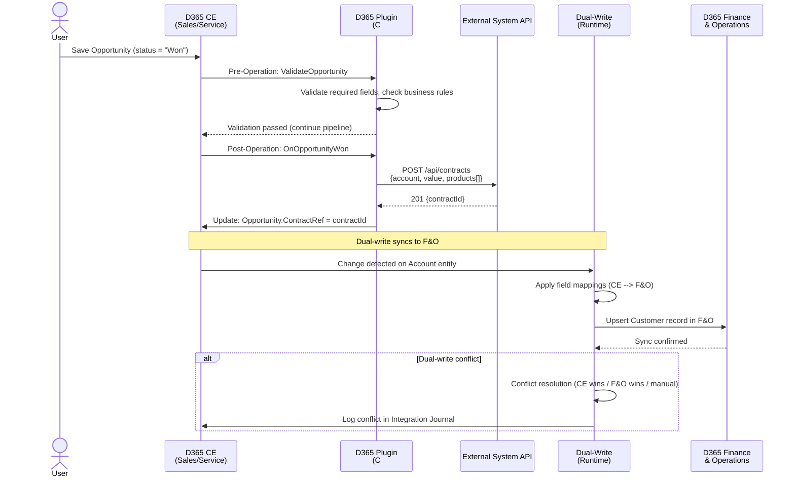

---

## 2. Business Process Flow Diagrams

These diagrams show end-to-end business processes with decision points, parallel paths, and error handling. Swimlane-style subgraphs indicate which component handles each step.

### CRUD Operation with Validation

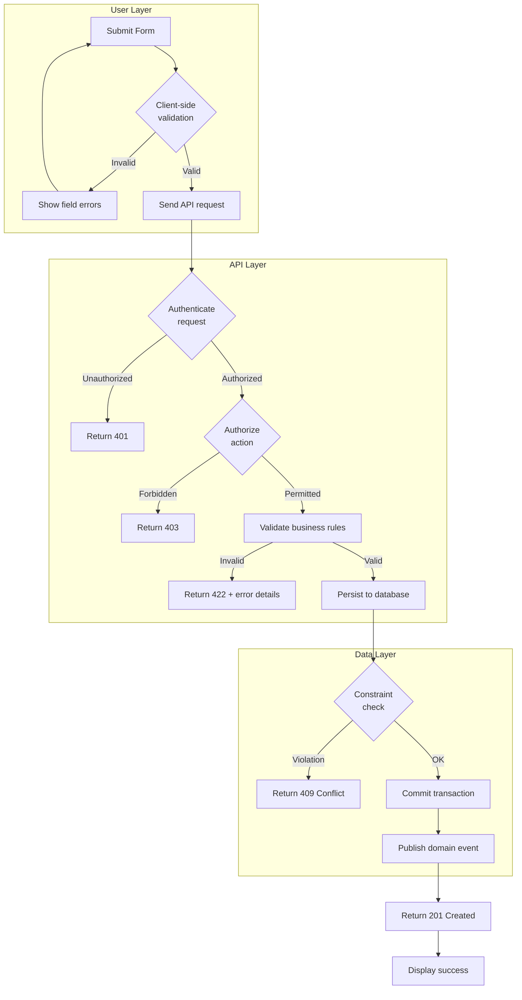

### Approval Workflow with Escalation

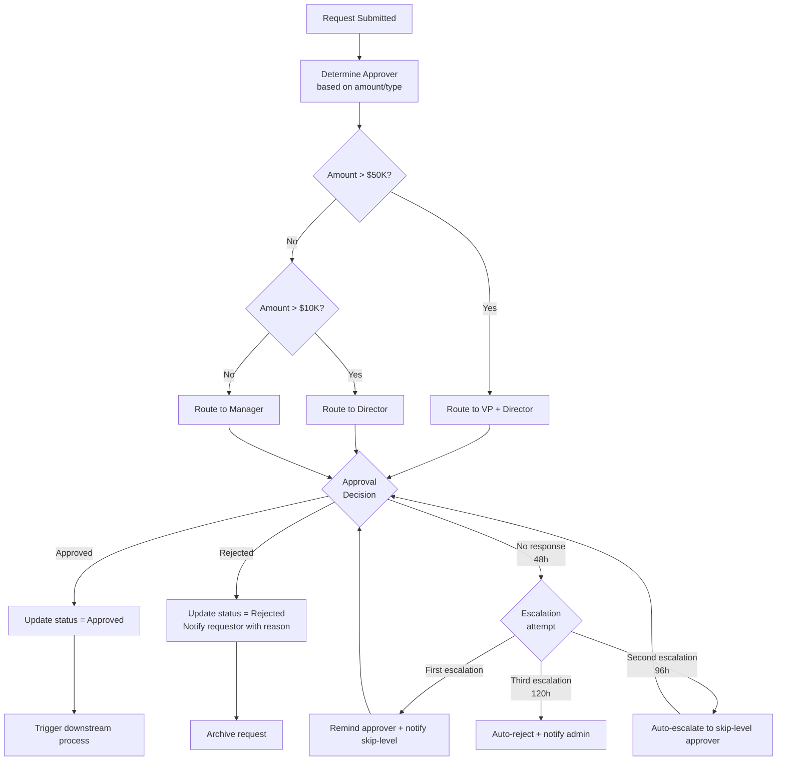

### Data Import / Processing Pipeline

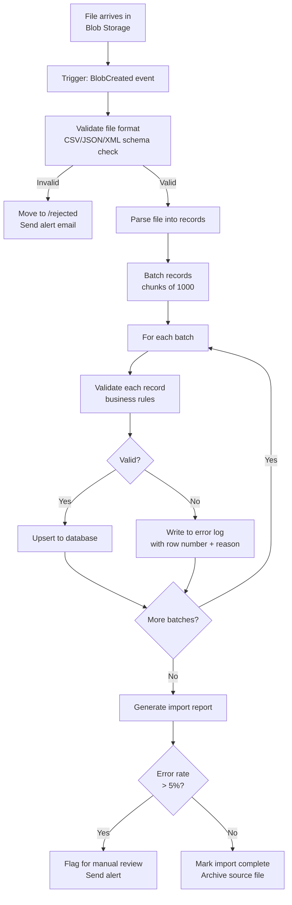

---

## 3. State Machine Diagrams

These diagrams model entities with complex lifecycles. Each transition includes the guard condition (in brackets) and the action performed.

### Order Lifecycle

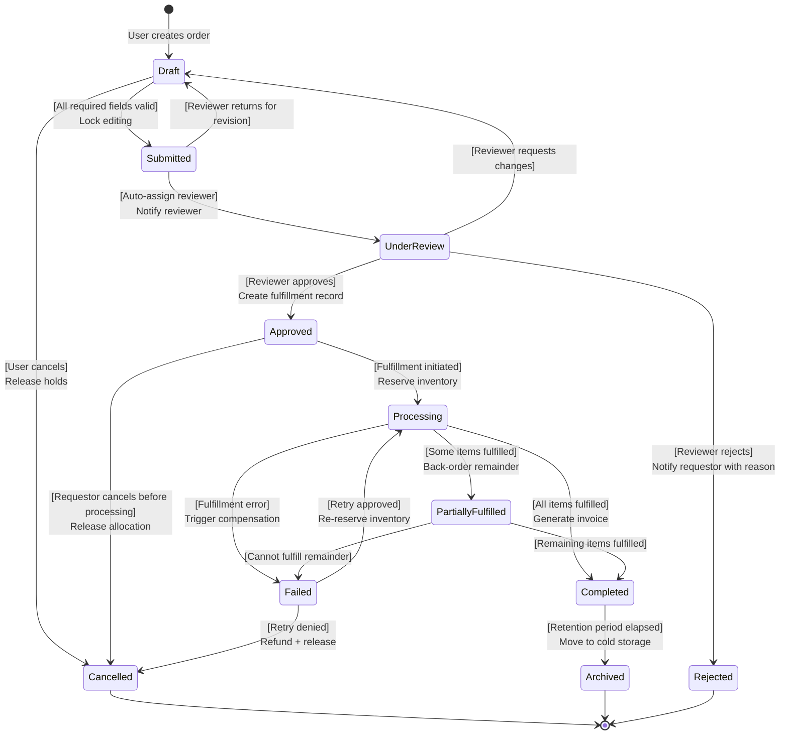

### Case Management Lifecycle

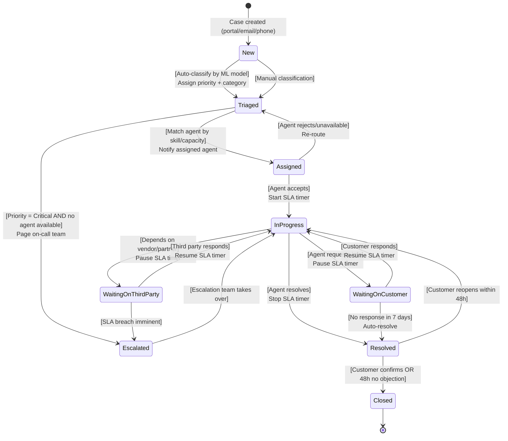

---

## 4. Data Pipeline Flow Diagrams

These diagrams show data transformation steps with error handling branches.

### ETL Pipeline

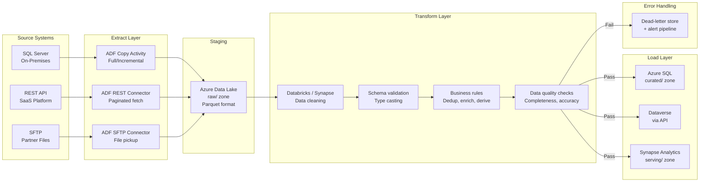

### Real-Time Event Processing

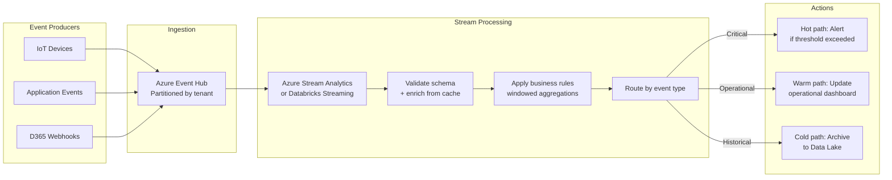

---

## 5. Error Handling Flow Diagrams

### API Error Handling with Retry and Circuit Breaker

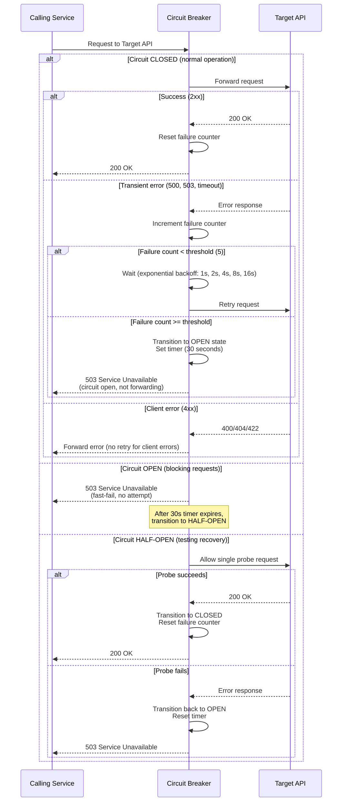

### Message Processing with Dead-Letter Queue

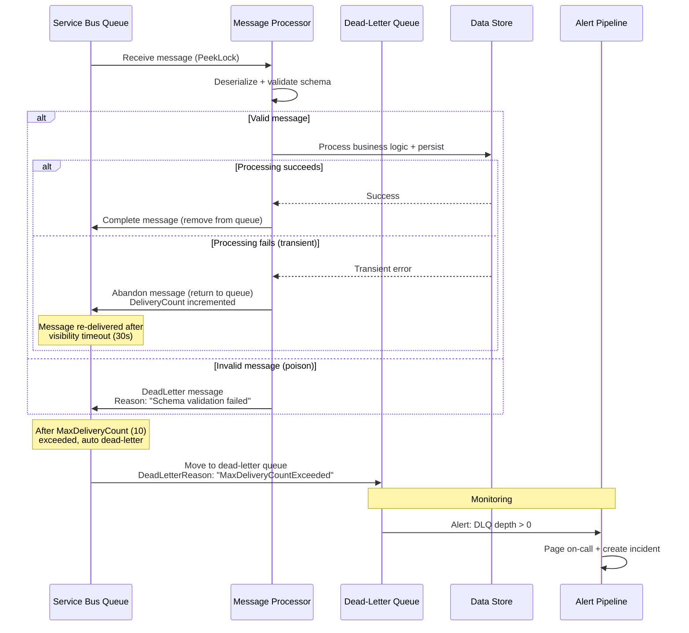

---

## 6. Authentication / Authorization Flow Diagrams

### OAuth2 Authorization Code Flow with Entra ID

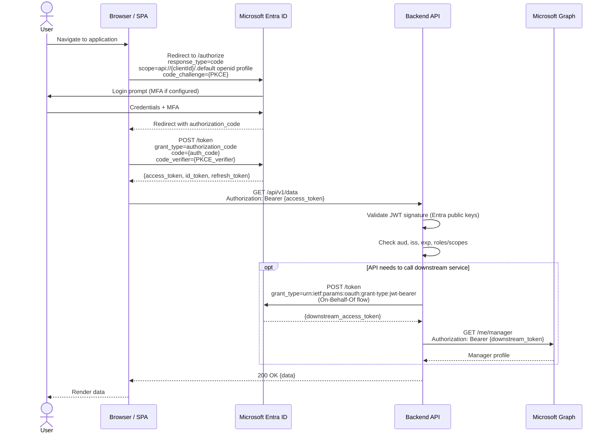

### Service-to-Service with Managed Identity

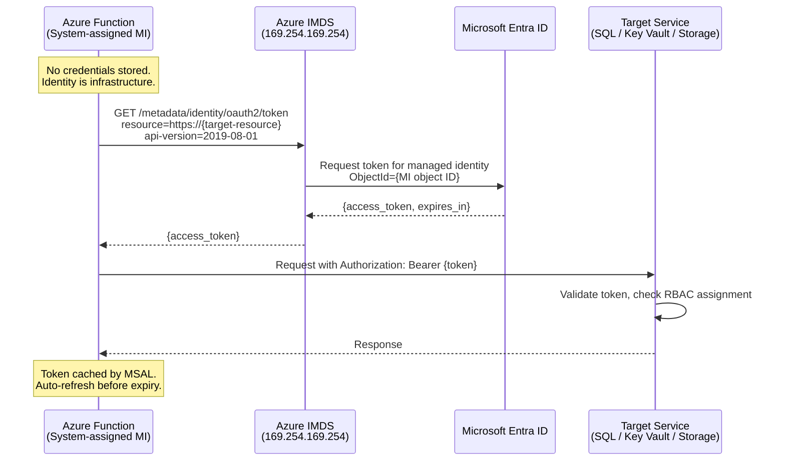

### D365 Plugin Impersonation

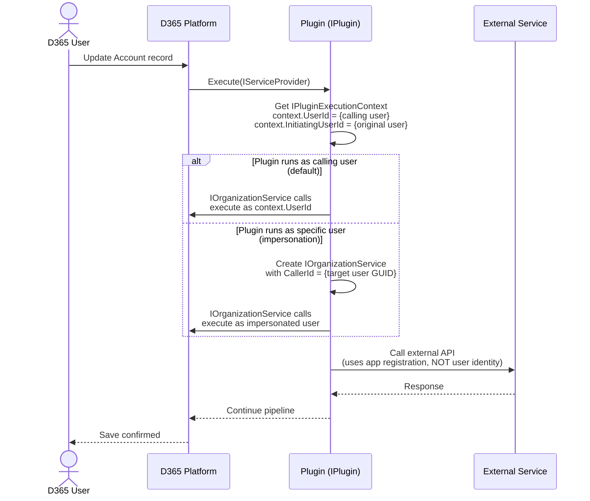

---

## Diagram Quality Checklist

Before including any diagram in a `design.md`, verify it meets these standards:

| Check | Requirement |
|-------|-------------|
| Labeled arrows | Every arrow has a label describing the action or data being passed |
| Error paths | At least one error/exception path is shown (not just happy path) |
| Async markers | Asynchronous operations are clearly marked with notes or dashed lines |
| Technology names | Components use specific technology names (e.g., "Azure Function" not "serverless function") |
| Name consistency | Component names match exactly with the System Components table in `design.md` |
| Payload shapes | Request/response payload shapes are indicated (at minimum, key field names) |
| Authentication | Auth mechanism is shown where applicable (Bearer token, managed identity, API key) |
| Participant labels | Each participant includes both logical name and technology in the label |

---

## Usage Pattern for Coding Agents

When a coding agent receives a `design.md` file, it should consume the diagrams in this order:

1. **Component Interaction Flow** -- understand the call chain between components, method signatures, and payload shapes. This tells the agent what endpoints to implement and what each endpoint calls.

2. **Business Process Flow** -- understand the business logic, decision points, and branching paths. This tells the agent what conditional logic to implement.

3. **State Machine Diagrams** -- understand entity lifecycles and valid state transitions. This tells the agent what status fields to create and what transitions to enforce.

4. **API Contracts** (from `design.md`) -- get exact interface definitions, request/response schemas, and error formats for implementation.

5. **Data Models** (from `design.md`) -- get exact schema definitions, relationships, and constraints for database migrations.

6. **Error Handling Flow** -- understand retry policies, circuit breaker configuration, and dead-letter handling for resilience implementation.

7. **Auth Flow** -- understand the authentication and authorization approach for securing endpoints and service-to-service calls.

---

*Cross-references: `tech-design-spec.md`, `c4-diagram-guide.md`, `lld-template.md`, `integration-patterns.md`, `sub-agent-orchestration.md`*
