# Mermaid Diagram Patterns Library

## 1. Overview and Branding Integration

### Why Diagram-as-Code Matters

Mermaid enables **diagram-as-code**, providing critical advantages over traditional diagramming tools:

**Version Control Benefits**:
- Track diagram evolution alongside code changes
- Review diagram modifications through pull requests
- Maintain single source of truth in Git repositories
- Collaborate through standard development workflows
- Audit trail of architectural decisions and changes

**Maintainability Advantages**:
- Text-based diagrams are easier to update than binary formats
- No vendor lock-in to proprietary diagramming tools
- Automated generation from structured inputs
- Consistent styling through reusable templates
- Integration with documentation pipelines

**Collaboration Benefits**:
- Diagrams live with code in repositories
- Rendered automatically in GitHub, GitLab, Confluence
- No special tools required for team members to view
- Easy to embed in Markdown documentation
- Supports concurrent editing and merging

### Critical: ALWAYS Ask About Branding First

**BEFORE generating ANY diagram**, ask the client:

```
Do you have specific brand colors or styling guidelines I should apply to these diagrams?
```

**Why This Matters**:
- Professional diagrams reflect client brand identity
- Consistency across all deliverables builds trust
- Demonstrates attention to detail and customization
- Avoids rework when branding is applied later

**How to Apply Brand Colors**:
1. Collect client brand hex codes (primary, secondary, accent colors)
2. Map colors to semantic diagram elements (see Styling Standards)
3. Use `classDef` to define brand-specific styles
4. Apply consistently across all diagram types

**Integration with Branding Skill**:
Reference the `branding` skill from the `ms-office-suite` skill collection for:
- Extracting brand colors from client documents
- Applying consistent color schemes
- Maintaining brand compliance across deliverables

### Default Styling Conventions

When NO brand colors are specified, use Microsoft default palette:
- **Primary Blue**: `#0078d4` (core systems, primary actions)
- **Green**: `#7fba00` (success, data stores, supporting systems)
- **Red**: `#f25022` (errors, security concerns, critical paths)
- **Yellow**: `#ffb900` (warnings, pending states)
- **Purple**: `#5c2d91` (AI/ML components, agents, orchestrators)
- **Gray**: `#737373` (external systems, infrastructure)

---

## 2. C4 Model Diagrams

The C4 model provides hierarchical views of software architecture at different abstraction levels. Use C4 diagrams to communicate system structure to different audiences.

### C4 Context Diagram (System Landscape)

**When to Use**:
- Executive presentations showing system boundaries
- Stakeholder alignment on scope and actors
- Initial architecture proposals
- System of systems overviews
- User interaction mapping

**Template**:

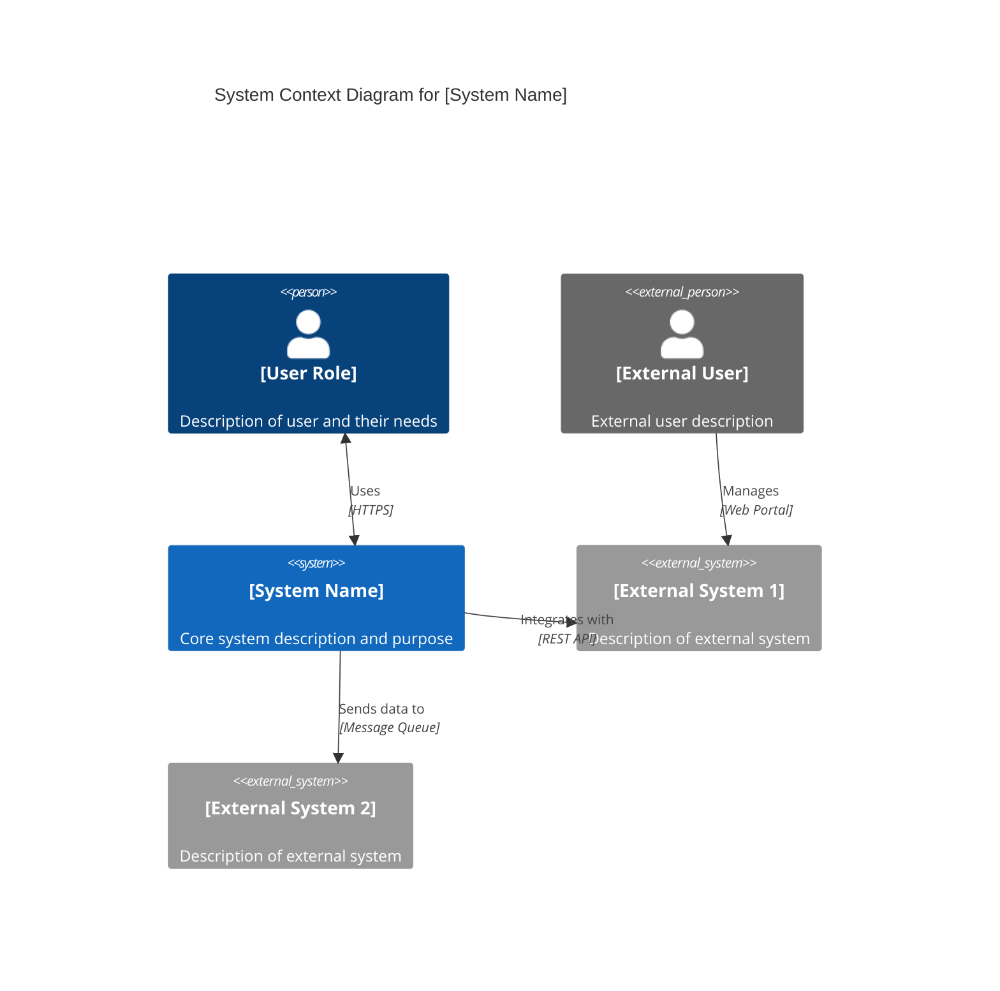
```mermaid
C4Context
    title System Context Diagram for [System Name]

    Person(user, "[User Role]", "Description of user and their needs")
    Person_Ext(external_user, "[External User]", "External user description")

    System(target_system, "[System Name]", "Core system description and purpose")

    System_Ext(external_system_1, "[External System 1]", "Description of external system")
    System_Ext(external_system_2, "[External System 2]", "Description of external system")

    BiRel(user, target_system, "Uses", "HTTPS")
    Rel(target_system, external_system_1, "Integrates with", "REST API")
    Rel(target_system, external_system_2, "Sends data to", "Message Queue")
    Rel(external_user, external_system_1, "Manages", "Web Portal")

    UpdateLayoutConfig($c4ShapeInRow="3", $c4BoundaryInRow="1")
```

**Example Usage**:

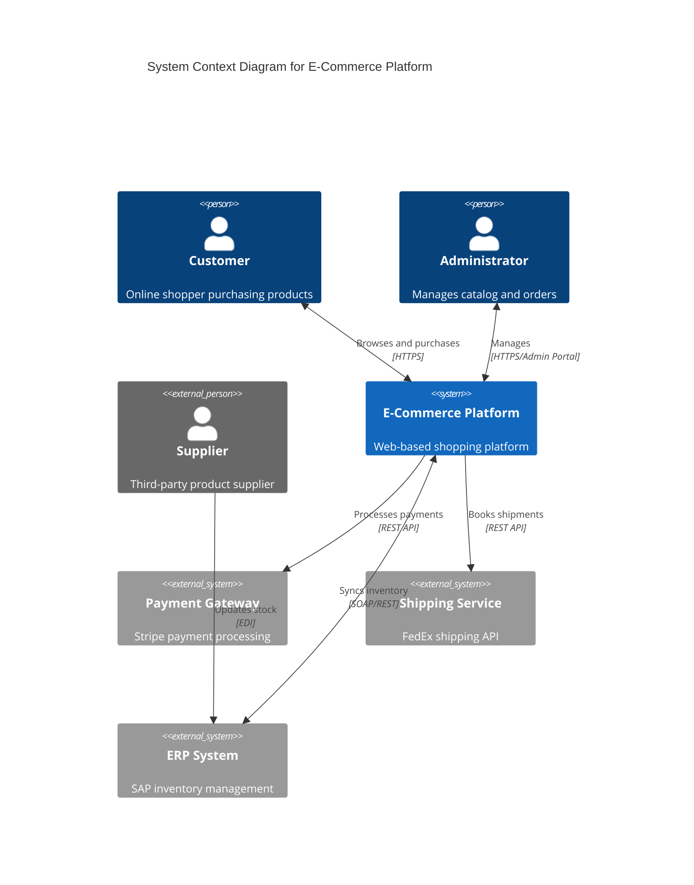
```mermaid
C4Context
    title System Context Diagram for E-Commerce Platform

    Person(customer, "Customer", "Online shopper purchasing products")
    Person(admin, "Administrator", "Manages catalog and orders")
    Person_Ext(supplier, "Supplier", "Third-party product supplier")

    System(ecommerce, "E-Commerce Platform", "Web-based shopping platform")

    System_Ext(payment_gateway, "Payment Gateway", "Stripe payment processing")
    System_Ext(shipping_service, "Shipping Service", "FedEx shipping API")
    System_Ext(erp_system, "ERP System", "SAP inventory management")

    BiRel(customer, ecommerce, "Browses and purchases", "HTTPS")
    BiRel(admin, ecommerce, "Manages", "HTTPS/Admin Portal")
    Rel(ecommerce, payment_gateway, "Processes payments", "REST API")
    Rel(ecommerce, shipping_service, "Books shipments", "REST API")
    BiRel(ecommerce, erp_system, "Syncs inventory", "SOAP/REST")
    Rel(supplier, erp_system, "Updates stock", "EDI")
```

**Styling Guidance**:
- Use `Person` for internal users, `Person_Ext` for external
- Use `System` for your systems, `System_Ext` for external
- Use `BiRel` for bidirectional relationships
- Keep descriptions concise (under 10 words)
- Limit to 5-7 systems maximum for clarity

### C4 Container Diagram (Solution Architecture)

**When to Use**:
- Detailed solution architecture documentation
- Technology stack discussions
- Deployment architecture planning
- Integration pattern definition
- Security boundary identification

**Template**:

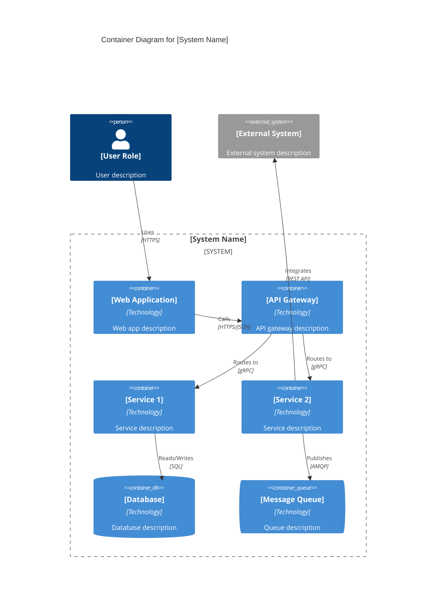
```mermaid
C4Container
    title Container Diagram for [System Name]

    Person(user, "[User Role]", "User description")

    System_Boundary(system_boundary, "[System Name]") {
        Container(web_app, "[Web Application]", "Technology", "Web app description")
        Container(api, "[API Gateway]", "Technology", "API gateway description")
        Container(service_1, "[Service 1]", "Technology", "Service description")
        Container(service_2, "[Service 2]", "Technology", "Service description")
        ContainerDb(database, "[Database]", "Technology", "Database description")
        ContainerQueue(queue, "[Message Queue]", "Technology", "Queue description")
    }

    System_Ext(external_system, "[External System]", "External system description")

    Rel(user, web_app, "Uses", "HTTPS")
    Rel(web_app, api, "Calls", "HTTPS/JSON")
    Rel(api, service_1, "Routes to", "gRPC")
    Rel(api, service_2, "Routes to", "gRPC")
    Rel(service_1, database, "Reads/Writes", "SQL")
    Rel(service_2, queue, "Publishes", "AMQP")
    Rel(service_2, external_system, "Integrates", "REST API")
```

**Example Usage**:

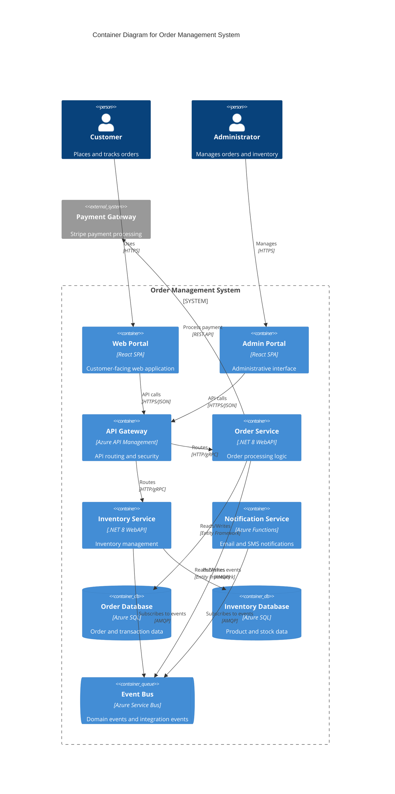
```mermaid
C4Container
    title Container Diagram for Order Management System

    Person(customer, "Customer", "Places and tracks orders")
    Person(admin, "Administrator", "Manages orders and inventory")

    System_Boundary(oms_boundary, "Order Management System") {
        Container(web_portal, "Web Portal", "React SPA", "Customer-facing web application")
        Container(admin_portal, "Admin Portal", "React SPA", "Administrative interface")
        Container(api_gateway, "API Gateway", "Azure API Management", "API routing and security")
        Container(order_service, "Order Service", ".NET 8 WebAPI", "Order processing logic")
        Container(inventory_service, "Inventory Service", ".NET 8 WebAPI", "Inventory management")
        Container(notification_service, "Notification Service", "Azure Functions", "Email and SMS notifications")
        ContainerDb(order_db, "Order Database", "Azure SQL", "Order and transaction data")
        ContainerDb(inventory_db, "Inventory Database", "Azure SQL", "Product and stock data")
        ContainerQueue(event_bus, "Event Bus", "Azure Service Bus", "Domain events and integration events")
    }

    System_Ext(payment_gateway, "Payment Gateway", "Stripe payment processing")

    Rel(customer, web_portal, "Uses", "HTTPS")
    Rel(admin, admin_portal, "Manages", "HTTPS")
    Rel(web_portal, api_gateway, "API calls", "HTTPS/JSON")
    Rel(admin_portal, api_gateway, "API calls", "HTTPS/JSON")
    Rel(api_gateway, order_service, "Routes", "HTTP/gRPC")
    Rel(api_gateway, inventory_service, "Routes", "HTTP/gRPC")
    Rel(order_service, order_db, "Reads/Writes", "Entity Framework")
    Rel(inventory_service, inventory_db, "Reads/Writes", "Entity Framework")
    Rel(order_service, event_bus, "Publishes events", "AMQP")
    Rel(inventory_service, event_bus, "Subscribes to events", "AMQP")
    Rel(notification_service, event_bus, "Subscribes to events", "AMQP")
    Rel(order_service, payment_gateway, "Process payment", "REST API")
```

**Styling Guidance**:
- Group related containers within `System_Boundary`
- Use specific container types: `ContainerDb`, `ContainerQueue`
- Include technology stack in container labels
- Show protocol/format on relationships
- Limit to 8-10 containers per diagram

### C4 Component Diagram (Detailed Architecture)

**When to Use**:
- Detailed service design documentation
- Code structure planning
- Component responsibility definition
- Developer onboarding
- Technical design reviews

**Template**:

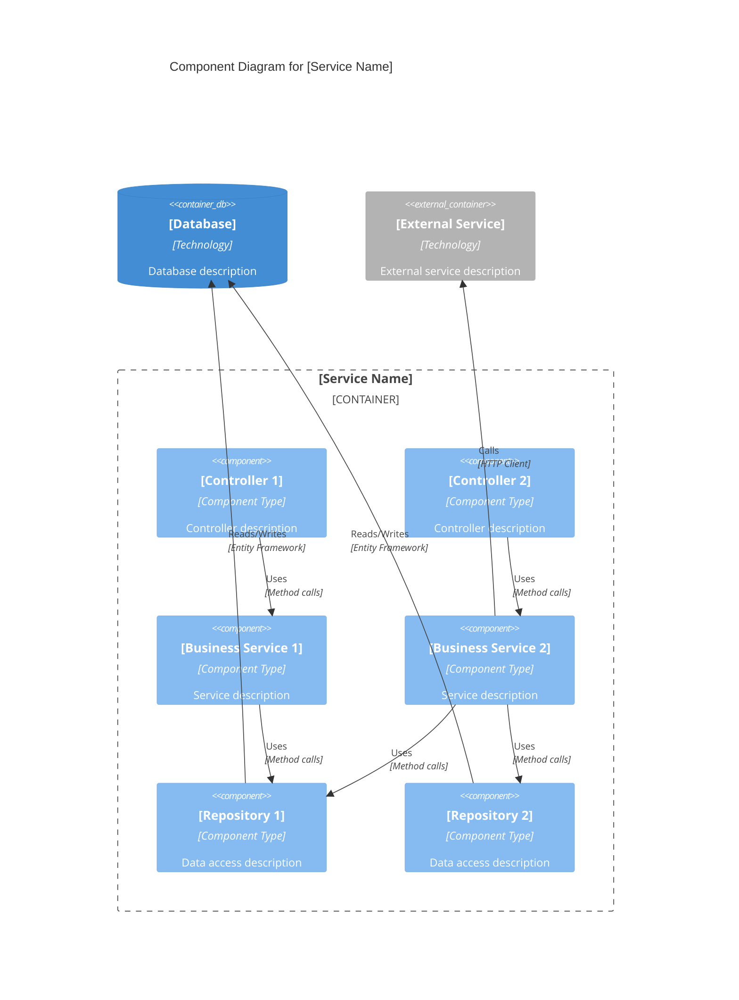
```mermaid
C4Component
    title Component Diagram for [Service Name]

    Container_Boundary(service_boundary, "[Service Name]") {
        Component(controller_1, "[Controller 1]", "Component Type", "Controller description")
        Component(controller_2, "[Controller 2]", "Component Type", "Controller description")
        Component(service_1, "[Business Service 1]", "Component Type", "Service description")
        Component(service_2, "[Business Service 2]", "Component Type", "Service description")
        Component(repository_1, "[Repository 1]", "Component Type", "Data access description")
        Component(repository_2, "[Repository 2]", "Component Type", "Data access description")
    }

    ContainerDb(database, "[Database]", "Technology", "Database description")
    Container_Ext(external_service, "[External Service]", "Technology", "External service description")

    Rel(controller_1, service_1, "Uses", "Method calls")
    Rel(controller_2, service_2, "Uses", "Method calls")
    Rel(service_1, repository_1, "Uses", "Method calls")
    Rel(service_2, repository_1, "Uses", "Method calls")
    Rel(service_2, repository_2, "Uses", "Method calls")
    Rel(repository_1, database, "Reads/Writes", "Entity Framework")
    Rel(repository_2, database, "Reads/Writes", "Entity Framework")
    Rel(service_2, external_service, "Calls", "HTTP Client")
```

**Styling Guidance**:
- Organize by architectural layers (presentation, business, data)
- Use component type labels (Controller, Service, Repository)
- Show dependency direction clearly
- Limit to single service/bounded context
- Include frameworks and patterns in descriptions

---

## 3. Domain-Driven Design Strategic Diagrams

### Bounded Context Map

**When to Use**:
- Strategic DDD design sessions
- Microservices boundary definition
- Team topology planning
- Integration pattern identification
- Legacy modernization planning

**Template with All 7 Context Relationships**:

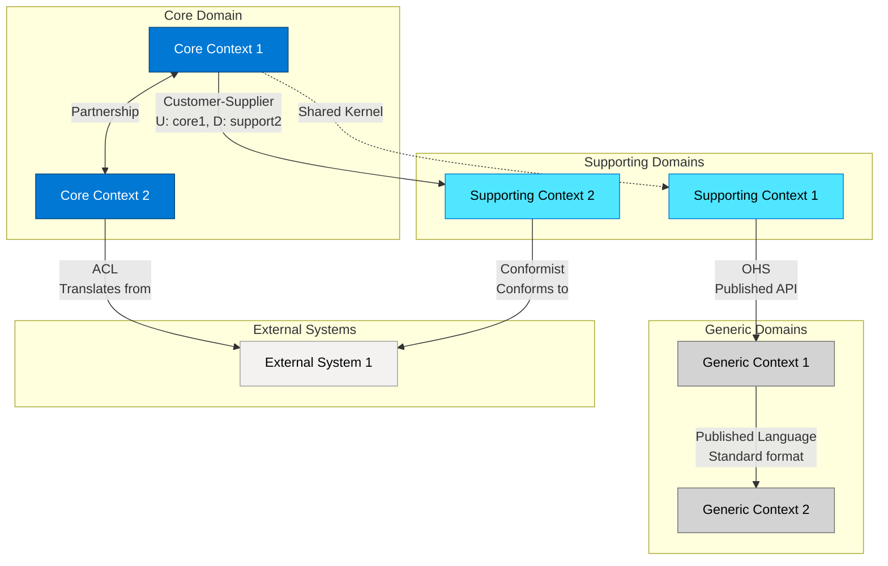
```mermaid
graph TB
    subgraph "Core Domain"
        core1[Core Context 1]:::core
        core2[Core Context 2]:::core
    end

    subgraph "Supporting Domains"
        support1[Supporting Context 1]:::supporting
        support2[Supporting Context 2]:::supporting
    end

    subgraph "Generic Domains"
        generic1[Generic Context 1]:::generic
        generic2[Generic Context 2]:::generic
    end

    subgraph "External Systems"
        external1[External System 1]:::external
    end

    %% Partnership (two-way collaboration)
    core1 <-->|Partnership| core2

    %% Shared Kernel (shared model)
    core1 -.->|Shared Kernel| support1

    %% Customer-Supplier (upstream-downstream)
    core1 -->|Customer-Supplier<br/>U: core1, D: support2| support2

    %% Conformist (downstream conforms)
    support2 -->|Conformist<br/>Conforms to| external1

    %% Anti-Corruption Layer (ACL)
    core2 -->|ACL<br/>Translates from| external1

    %% Open Host Service (OHS)
    support1 -->|OHS<br/>Published API| generic1

    %% Published Language (PL)
    generic1 -->|Published Language<br/>Standard format| generic2

    classDef core fill:#0078d4,stroke:#004578,color:#fff
    classDef supporting fill:#50e6ff,stroke:#0078d4,color:#000
    classDef generic fill:#d3d3d3,stroke:#737373,color:#000
    classDef external fill:#f3f2f1,stroke:#a19f9d,color:#000
```

**Example Usage - E-Commerce Platform**:

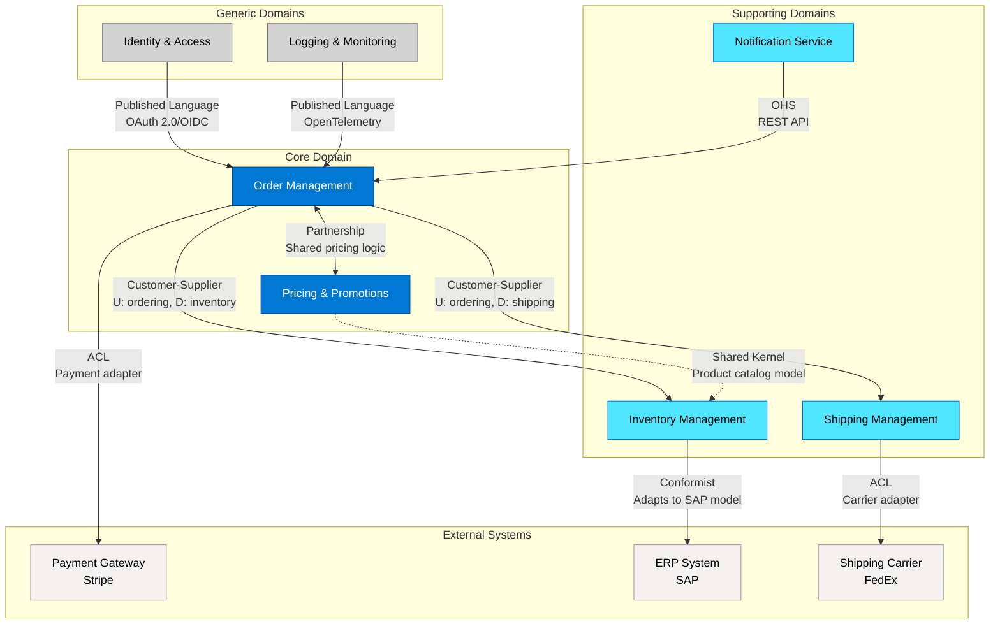
```mermaid
graph TB
    subgraph "Core Domain"
        ordering[Order Management]:::core
        pricing[Pricing & Promotions]:::core
    end

    subgraph "Supporting Domains"
        inventory[Inventory Management]:::supporting
        shipping[Shipping Management]:::supporting
        notification[Notification Service]:::supporting
    end

    subgraph "Generic Domains"
        auth[Identity & Access]:::generic
        logging[Logging & Monitoring]:::generic
    end

    subgraph "External Systems"
        payment[Payment Gateway<br/>Stripe]:::external
        erp[ERP System<br/>SAP]:::external
        carrier[Shipping Carrier<br/>FedEx]:::external
    end

    %% Core domain relationships
    ordering <-->|Partnership<br/>Shared pricing logic| pricing

    %% Core to supporting
    ordering -->|Customer-Supplier<br/>U: ordering, D: inventory| inventory
    ordering -->|Customer-Supplier<br/>U: ordering, D: shipping| shipping
    pricing -.->|Shared Kernel<br/>Product catalog model| inventory

    %% Supporting to external
    ordering -->|ACL<br/>Payment adapter| payment
    inventory -->|Conformist<br/>Adapts to SAP model| erp
    shipping -->|ACL<br/>Carrier adapter| carrier

    %% Generic services
    notification -->|OHS<br/>REST API| ordering
    auth -->|Published Language<br/>OAuth 2.0/OIDC| ordering
    logging -->|Published Language<br/>OpenTelemetry| ordering

    classDef core fill:#0078d4,stroke:#004578,color:#fff
    classDef supporting fill:#50e6ff,stroke:#0078d4,color:#000
    classDef generic fill:#d3d3d3,stroke:#737373,color:#000
    classDef external fill:#f3f2f1,stroke:#a19f9d,color:#000
```

**Color Coding by Domain Type**:
- **Core Domain** (Blue #0078d4): Unique competitive advantage, high complexity
- **Supporting Domain** (Light Blue #50e6ff): Necessary but not differentiating
- **Generic Domain** (Gray #d3d3d3): Commodity capabilities, off-the-shelf solutions
- **External Systems** (Light Gray #f3f2f1): Third-party integrations

### Before/After Architecture Comparison

**When to Use**:
- Transformation roadmap presentations
- Gap analysis visualization
- Migration strategy documentation
- Executive decision support
- Change impact assessment

**Template**:

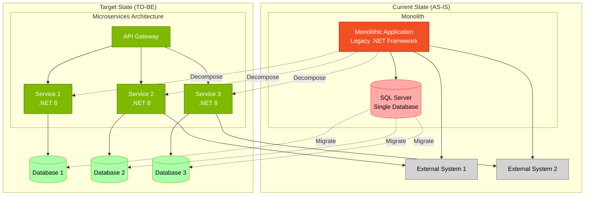
```mermaid
graph TB
    subgraph "Current State (AS-IS)"
        subgraph "Monolith"
            mono[Monolithic Application<br/>Legacy .NET Framework]:::legacy
            mono_db[(SQL Server<br/>Single Database)]:::legacy_db
        end

        ext1[External System 1]:::external
        ext2[External System 2]:::external

        mono --> mono_db
        mono --> ext1
        mono --> ext2
    end

    subgraph "Target State (TO-BE)"
        subgraph "Microservices Architecture"
            api_gw[API Gateway]:::modern
            service1[Service 1<br/>.NET 8]:::modern
            service2[Service 2<br/>.NET 8]:::modern
            service3[Service 3<br/>.NET 8]:::modern
        end

        db1[(Database 1)]:::modern_db
        db2[(Database 2)]:::modern_db
        db3[(Database 3)]:::modern_db

        api_gw --> service1
        api_gw --> service2
        api_gw --> service3
        service1 --> db1
        service2 --> db2
        service3 --> db3
        service2 --> ext1
        service3 --> ext2
    end

    %% Transformation arrows
    mono -.->|Decompose| service1
    mono -.->|Decompose| service2
    mono -.->|Decompose| service3
    mono_db -.->|Migrate| db1
    mono_db -.->|Migrate| db2
    mono_db -.->|Migrate| db3

    classDef legacy fill:#f25022,stroke:#a80000,color:#fff
    classDef legacy_db fill:#faa,stroke:#f25022,color:#000
    classDef modern fill:#7fba00,stroke:#4a7000,color:#fff
    classDef modern_db fill:#afa,stroke:#7fba00,color:#000
    classDef external fill:#d3d3d3,stroke:#737373,color:#000
```

**Styling Guidance**:
- Use red tones for current state (problems, technical debt)
- Use green tones for target state (solutions, modernized)
- Use dotted arrows to show transformation paths
- Group related components in subgraphs
- Include technology labels on components

---

## 4. Sequence Diagrams

### Order Processing Flow

**When to Use**:
- Business process documentation
- Integration flow design
- Error handling scenarios
- Performance analysis
- User journey mapping

**Template**:

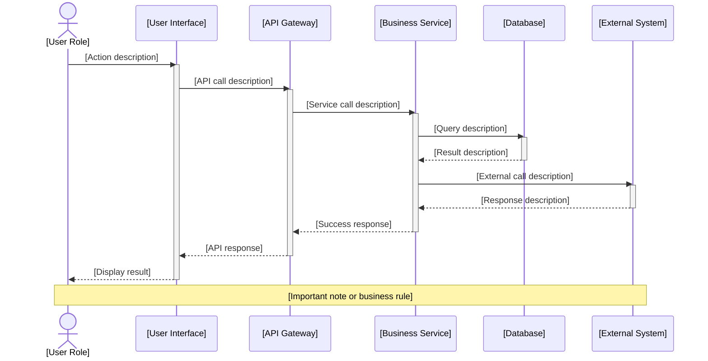
```mermaid
sequenceDiagram
    actor User as [User Role]
    participant UI as [User Interface]
    participant API as [API Gateway]
    participant Service as [Business Service]
    participant DB as [Database]
    participant External as [External System]

    User->>UI: [Action description]
    activate UI
    UI->>API: [API call description]
    activate API
    API->>Service: [Service call description]
    activate Service

    Service->>DB: [Query description]
    activate DB
    DB-->>Service: [Result description]
    deactivate DB

    Service->>External: [External call description]
    activate External
    External-->>Service: [Response description]
    deactivate External

    Service-->>API: [Success response]
    deactivate Service
    API-->>UI: [API response]
    deactivate API
    UI-->>User: [Display result]
    deactivate UI

    Note over User,External: [Important note or business rule]
```

**Example - E-Commerce Order**:

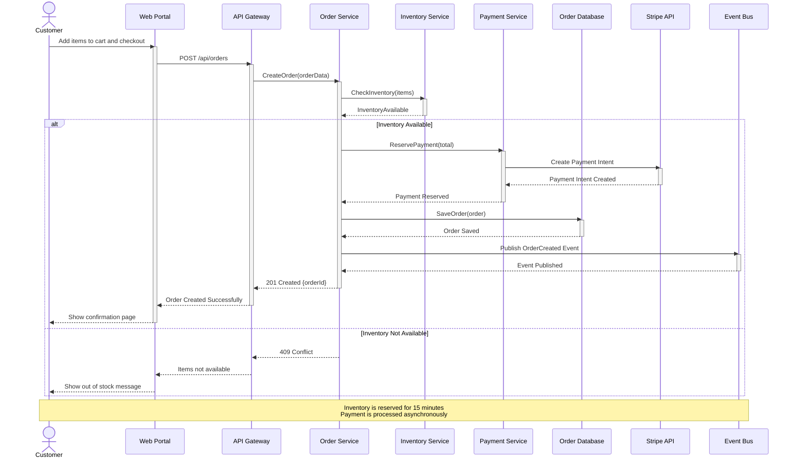
```mermaid
sequenceDiagram
    actor Customer
    participant Web as Web Portal
    participant Gateway as API Gateway
    participant Order as Order Service
    participant Inventory as Inventory Service
    participant Payment as Payment Service
    participant DB as Order Database
    participant Stripe as Stripe API
    participant Bus as Event Bus

    Customer->>Web: Add items to cart and checkout
    activate Web
    Web->>Gateway: POST /api/orders
    activate Gateway
    Gateway->>Order: CreateOrder(orderData)
    activate Order

    Order->>Inventory: CheckInventory(items)
    activate Inventory
    Inventory-->>Order: InventoryAvailable
    deactivate Inventory

    alt Inventory Available
        Order->>Payment: ReservePayment(total)
        activate Payment
        Payment->>Stripe: Create Payment Intent
        activate Stripe
        Stripe-->>Payment: Payment Intent Created
        deactivate Stripe
        Payment-->>Order: Payment Reserved
        deactivate Payment

        Order->>DB: SaveOrder(order)
        activate DB
        DB-->>Order: Order Saved
        deactivate DB

        Order->>Bus: Publish OrderCreated Event
        activate Bus
        Bus-->>Order: Event Published
        deactivate Bus

        Order-->>Gateway: 201 Created {orderId}
        deactivate Order
        Gateway-->>Web: Order Created Successfully
        deactivate Gateway
        Web-->>Customer: Show confirmation page
        deactivate Web
    else Inventory Not Available
        Order-->>Gateway: 409 Conflict
        Gateway-->>Web: Items not available
        Web-->>Customer: Show out of stock message
    end

    Note over Customer,Bus: Inventory is reserved for 15 minutes<br/>Payment is processed asynchronously
```

### Integration Flow

**Template**:

```mermaid
sequenceDiagram
    participant Source as Source System
    participant Integration as Integration Layer
    participant Transform as Transformer
    participant Queue as Message Queue
    participant Target as Target System
    participant DLQ as Dead Letter Queue

    Source->>Integration: Send data
    activate Integration

    Integration->>Transform: Transform data
    activate Transform
    Transform-->>Integration: Transformed data
    deactivate Transform

    Integration->>Queue: Publish message
    activate Queue
    Queue-->>Integration: Ack
    deactivate Integration

    Queue->>Target: Deliver message
    activate Target

    alt Success
        Target-->>Queue: Process success
        deactivate Target
        Queue-->>Queue: Remove message
        deactivate Queue
    else Processing Failure
        Target-->>Queue: Process failed
        deactivate Target
        Queue->>Queue: Retry (3 attempts)
        Queue->>DLQ: Move to DLQ
        deactivate Queue
    end
```

### Authentication Flow

**Template - OAuth 2.0 Authorization Code Flow**:

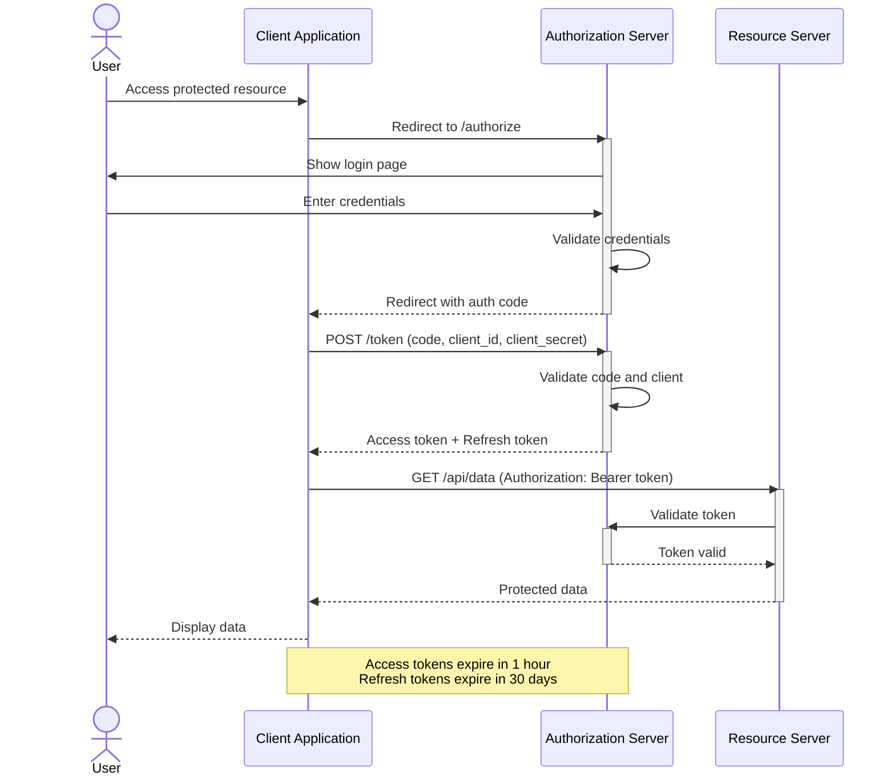
```mermaid
sequenceDiagram
    actor User
    participant Client as Client Application
    participant Auth as Authorization Server
    participant Resource as Resource Server

    User->>Client: Access protected resource
    Client->>Auth: Redirect to /authorize
    activate Auth
    Auth->>User: Show login page
    User->>Auth: Enter credentials
    Auth->>Auth: Validate credentials
    Auth-->>Client: Redirect with auth code
    deactivate Auth

    Client->>Auth: POST /token (code, client_id, client_secret)
    activate Auth
    Auth->>Auth: Validate code and client
    Auth-->>Client: Access token + Refresh token
    deactivate Auth

    Client->>Resource: GET /api/data (Authorization: Bearer token)
    activate Resource
    Resource->>Auth: Validate token
    activate Auth
    Auth-->>Resource: Token valid
    deactivate Auth
    Resource-->>Client: Protected data
    deactivate Resource
    Client-->>User: Display data

    Note over Client,Auth: Access tokens expire in 1 hour<br/>Refresh tokens expire in 30 days
```

**Styling Guidance for Sequence Diagrams**:
- Use `actor` for human users
- Use `participant` for systems and services
- Always `activate`/`deactivate` to show processing time
- Use `alt`/`else` for conditional flows
- Use `loop` for repetitive operations
- Add `Note` for business rules and timing constraints

---

## 5. State Diagrams

### Workflow State Machine

**When to Use**:
- Business workflow design
- Process automation requirements
- State transition validation
- Error state handling
- Saga pattern implementation

**Template**:

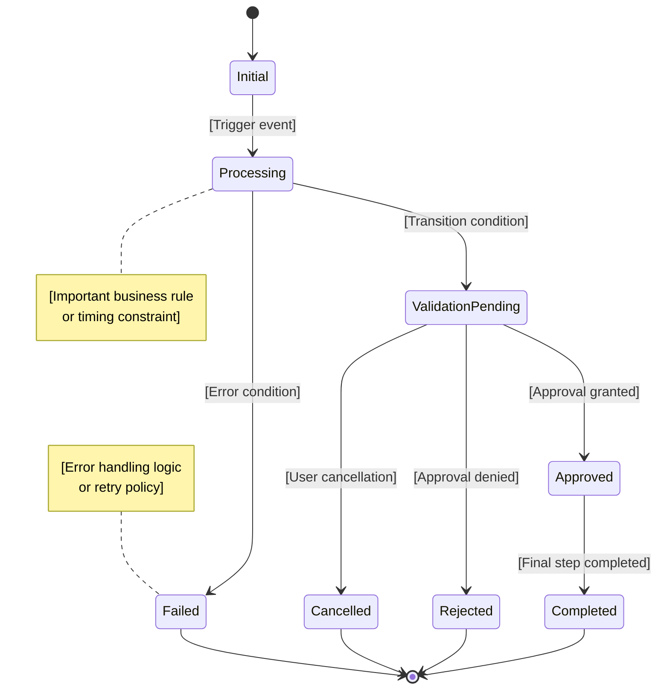
```mermaid
stateDiagram-v2
    [*] --> Initial

    Initial --> Processing: [Trigger event]

    Processing --> ValidationPending: [Transition condition]
    Processing --> Failed: [Error condition]

    ValidationPending --> Approved: [Approval granted]
    ValidationPending --> Rejected: [Approval denied]
    ValidationPending --> Cancelled: [User cancellation]

    Approved --> Completed: [Final step completed]

    Rejected --> [*]
    Failed --> [*]
    Cancelled --> [*]
    Completed --> [*]

    note right of Processing
        [Important business rule
        or timing constraint]
    end note

    note left of Failed
        [Error handling logic
        or retry policy]
    end note
```

**Example - Order State Machine**:

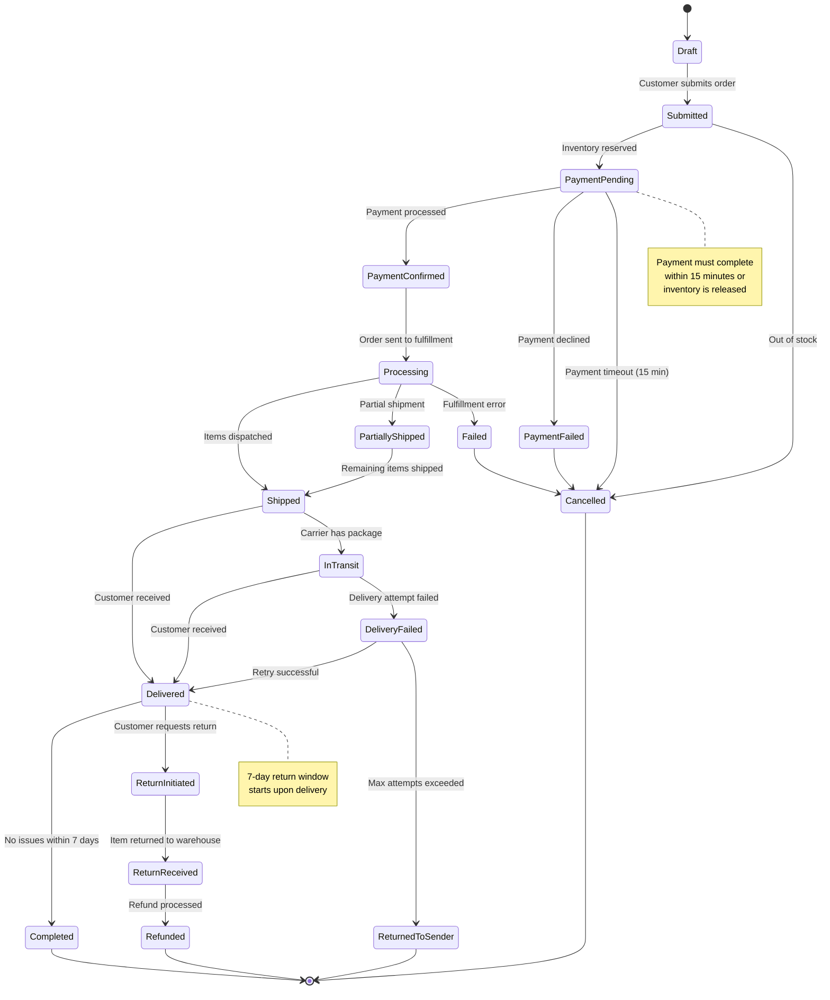
```mermaid
stateDiagram-v2
    [*] --> Draft

    Draft --> Submitted: Customer submits order

    Submitted --> PaymentPending: Inventory reserved
    Submitted --> Cancelled: Out of stock

    PaymentPending --> PaymentConfirmed: Payment processed
    PaymentPending --> PaymentFailed: Payment declined
    PaymentPending --> Cancelled: Payment timeout (15 min)

    PaymentConfirmed --> Processing: Order sent to fulfillment

    Processing --> Shipped: Items dispatched
    Processing --> PartiallyShipped: Partial shipment
    Processing --> Failed: Fulfillment error

    PartiallyShipped --> Shipped: Remaining items shipped

    Shipped --> Delivered: Customer received
    Shipped --> InTransit: Carrier has package

    InTransit --> Delivered: Customer received
    InTransit --> DeliveryFailed: Delivery attempt failed

    DeliveryFailed --> Delivered: Retry successful
    DeliveryFailed --> ReturnedToSender: Max attempts exceeded

    Delivered --> Completed: No issues within 7 days
    Delivered --> ReturnInitiated: Customer requests return

    ReturnInitiated --> ReturnReceived: Item returned to warehouse
    ReturnReceived --> Refunded: Refund processed

    PaymentFailed --> Cancelled
    Failed --> Cancelled
    Cancelled --> [*]
    ReturnedToSender --> [*]
    Refunded --> [*]
    Completed --> [*]

    note right of PaymentPending
        Payment must complete
        within 15 minutes or
        inventory is released
    end note

    note right of Delivered
        7-day return window
        starts upon delivery
    end note
```

### Circuit Breaker State Machine

**Example - Resilience Pattern**:

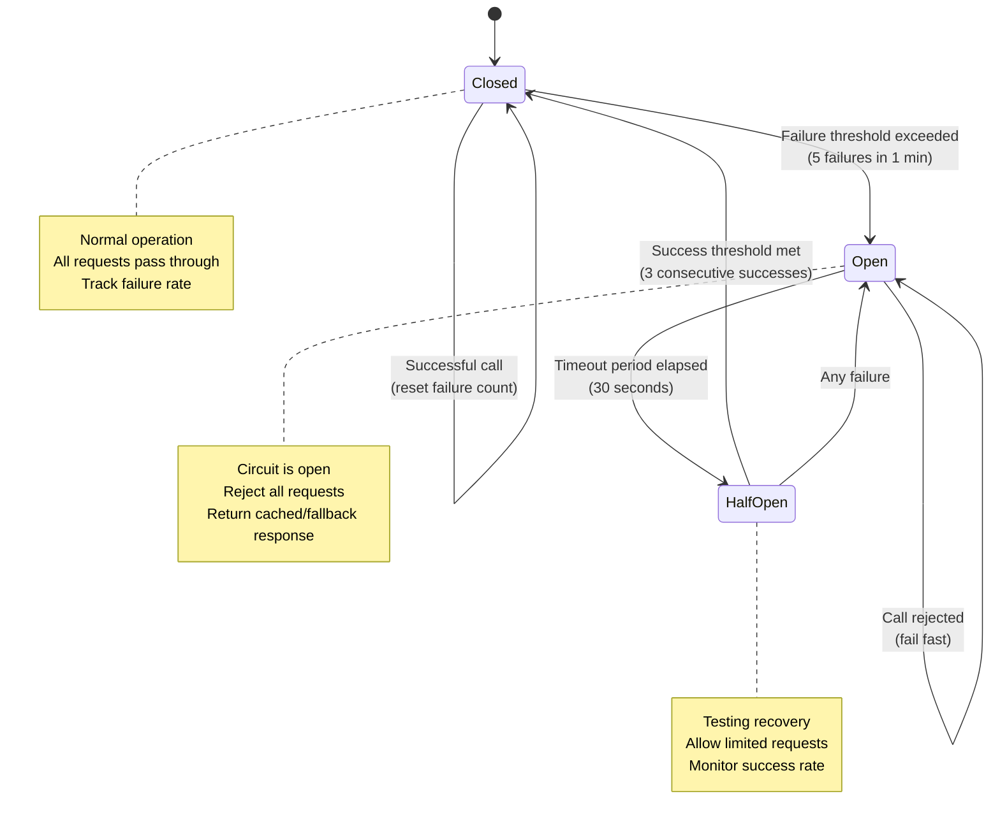
```mermaid
stateDiagram-v2
    [*] --> Closed

    Closed --> Open: Failure threshold exceeded<br/>(5 failures in 1 min)
    Closed --> Closed: Successful call<br/>(reset failure count)

    Open --> HalfOpen: Timeout period elapsed<br/>(30 seconds)
    Open --> Open: Call rejected<br/>(fail fast)

    HalfOpen --> Closed: Success threshold met<br/>(3 consecutive successes)
    HalfOpen --> Open: Any failure

    note right of Closed
        Normal operation
        All requests pass through
        Track failure rate
    end note

    note right of Open
        Circuit is open
        Reject all requests
        Return cached/fallback response
    end note

    note right of HalfOpen
        Testing recovery
        Allow limited requests
        Monitor success rate
    end note
```

**Styling Guidance**:
- Use clear, action-oriented state names
- Label transitions with trigger events
- Include timing constraints in notes
- Show terminal states with `[*]`
- Document business rules alongside diagram

---

## 6. Entity Relationship Diagrams

### Domain Data Model

**When to Use**:
- Database schema design
- Domain model documentation
- Data migration planning
- API contract definition
- Data governance discussions

**Template with Relationship Types**:

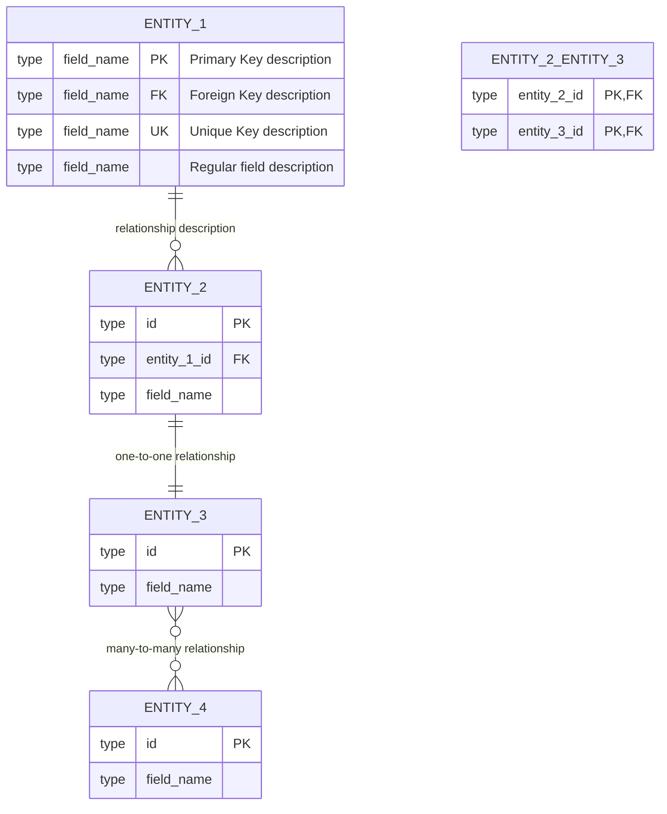
```mermaid
erDiagram
    ENTITY_1 ||--o{ ENTITY_2 : "relationship description"
    ENTITY_1 {
        type field_name PK "Primary Key description"
        type field_name FK "Foreign Key description"
        type field_name UK "Unique Key description"
        type field_name "Regular field description"
    }

    ENTITY_2 ||--|| ENTITY_3 : "one-to-one relationship"
    ENTITY_2 {
        type id PK
        type entity_1_id FK
        type field_name
    }

    ENTITY_3 }o--o{ ENTITY_4 : "many-to-many relationship"
    ENTITY_3 {
        type id PK
        type field_name
    }

    ENTITY_4 {
        type id PK
        type field_name
    }

    ENTITY_2_ENTITY_3 {
        type entity_2_id PK,FK
        type entity_3_id PK,FK
    }
```

**Relationship Cardinality Notation**:
- `||--||` : One-to-one
- `||--o{` : One-to-many
- `}o--o{` : Many-to-many
- `||--o|` : One-to-zero-or-one
- `}o--||` : Many-to-one

**Example - E-Commerce Domain**:

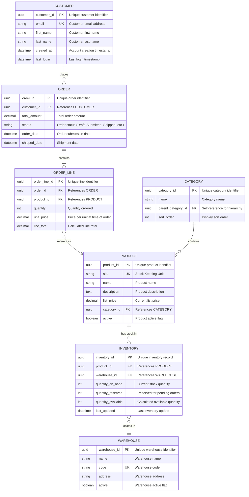
```mermaid
erDiagram
    CUSTOMER ||--o{ ORDER : "places"
    CUSTOMER {
        uuid customer_id PK "Unique customer identifier"
        string email UK "Customer email address"
        string first_name "Customer first name"
        string last_name "Customer last name"
        datetime created_at "Account creation timestamp"
        datetime last_login "Last login timestamp"
    }

    ORDER ||--|{ ORDER_LINE : "contains"
    ORDER {
        uuid order_id PK "Unique order identifier"
        uuid customer_id FK "References CUSTOMER"
        decimal total_amount "Total order amount"
        string status "Order status (Draft, Submitted, Shipped, etc.)"
        datetime order_date "Order submission date"
        datetime shipped_date "Shipment date"
    }

    ORDER_LINE }o--|| PRODUCT : "references"
    ORDER_LINE {
        uuid order_line_id PK "Unique line identifier"
        uuid order_id FK "References ORDER"
        uuid product_id FK "References PRODUCT"
        int quantity "Quantity ordered"
        decimal unit_price "Price per unit at time of order"
        decimal line_total "Calculated line total"
    }

    PRODUCT ||--o{ INVENTORY : "has stock in"
    PRODUCT {
        uuid product_id PK "Unique product identifier"
        string sku UK "Stock Keeping Unit"
        string name "Product name"
        text description "Product description"
        decimal list_price "Current list price"
        uuid category_id FK "References CATEGORY"
        boolean active "Product active flag"
    }

    CATEGORY ||--o{ PRODUCT : "contains"
    CATEGORY {
        uuid category_id PK "Unique category identifier"
        string name "Category name"
        uuid parent_category_id FK "Self-reference for hierarchy"
        int sort_order "Display sort order"
    }

    INVENTORY }o--|| WAREHOUSE : "located in"
    INVENTORY {
        uuid inventory_id PK "Unique inventory record"
        uuid product_id FK "References PRODUCT"
        uuid warehouse_id FK "References WAREHOUSE"
        int quantity_on_hand "Current stock quantity"
        int quantity_reserved "Reserved for pending orders"
        int quantity_available "Calculated available quantity"
        datetime last_updated "Last inventory update"
    }

    WAREHOUSE {
        uuid warehouse_id PK "Unique warehouse identifier"
        string name "Warehouse name"
        string code UK "Warehouse code"
        string address "Warehouse address"
        boolean active "Warehouse active flag"
    }
```

**Field Notation Standards**:
- **PK**: Primary Key
- **FK**: Foreign Key
- **UK**: Unique Key
- **PK,FK**: Composite key (common in junction tables)

**Styling Guidance**:
- Use UPPERCASE for entity names
- Use snake_case for field names
- Always include field types (uuid, string, int, decimal, datetime, boolean, text)
- Provide meaningful field descriptions
- Show cardinality on relationship lines
- Use descriptive relationship labels

---

## 7. Agentic Architecture Patterns

### Orchestrator-Worker Pattern

**When to Use**:
- AI agent systems with task delegation
- Workflow automation with specialized agents
- Multi-step reasoning processes
- RAG systems with specialized retrievers
- Agent-based microservices

**Template**:

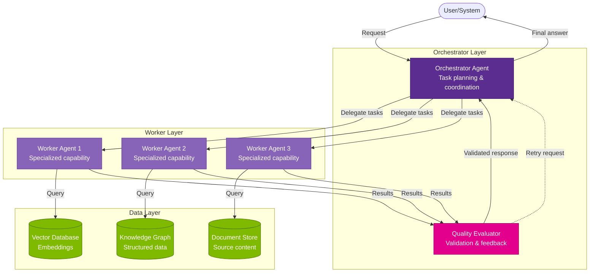
```mermaid
graph TB
    User([User/System])

    subgraph "Orchestrator Layer"
        Orchestrator[Orchestrator Agent<br/>Task planning & coordination]:::orchestrator
        Evaluator[Quality Evaluator<br/>Validation & feedback]:::evaluator
    end

    subgraph "Worker Layer"
        Worker1[Worker Agent 1<br/>Specialized capability]:::worker
        Worker2[Worker Agent 2<br/>Specialized capability]:::worker
        Worker3[Worker Agent 3<br/>Specialized capability]:::worker
    end

    subgraph "Data Layer"
        VectorDB[(Vector Database<br/>Embeddings)]:::data
        KnowledgeGraph[(Knowledge Graph<br/>Structured data)]:::data
        DocumentStore[(Document Store<br/>Source content)]:::data
    end

    User -->|Request| Orchestrator
    Orchestrator -->|Delegate tasks| Worker1
    Orchestrator -->|Delegate tasks| Worker2
    Orchestrator -->|Delegate tasks| Worker3

    Worker1 -->|Query| VectorDB
    Worker2 -->|Query| KnowledgeGraph
    Worker3 -->|Query| DocumentStore

    Worker1 -->|Results| Evaluator
    Worker2 -->|Results| Evaluator
    Worker3 -->|Results| Evaluator

    Evaluator -->|Validated response| Orchestrator
    Orchestrator -->|Final answer| User

    Evaluator -.->|Retry request| Orchestrator

    classDef orchestrator fill:#5c2d91,stroke:#3b1f5f,color:#fff
    classDef worker fill:#8764b8,stroke:#5c2d91,color:#fff
    classDef evaluator fill:#e3008c,stroke:#a50062,color:#fff
    classDef data fill:#7fba00,stroke:#4a7000,color:#fff
```

**Example - Customer Service Agent System**:

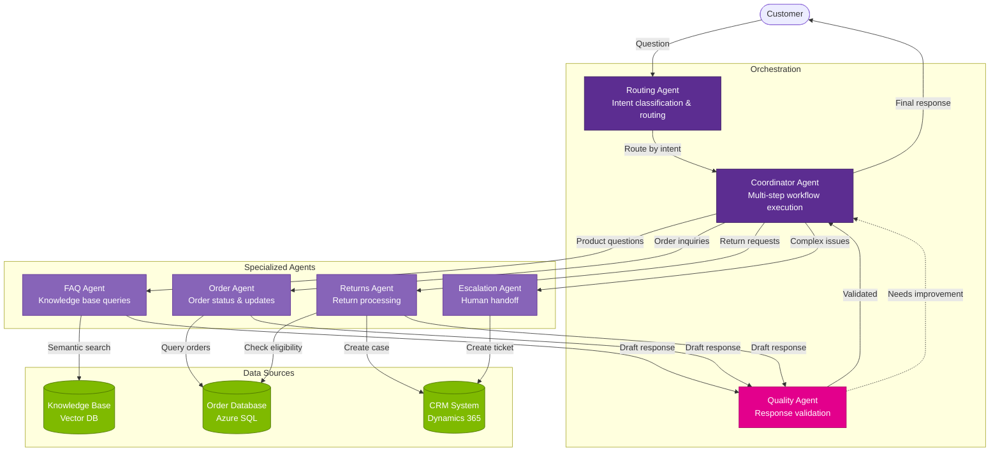
```mermaid
graph TB
    Customer([Customer])

    subgraph "Orchestration"
        Router[Routing Agent<br/>Intent classification & routing]:::orchestrator
        Coordinator[Coordinator Agent<br/>Multi-step workflow execution]:::orchestrator
        QA[Quality Agent<br/>Response validation]:::evaluator
    end

    subgraph "Specialized Agents"
        FAQ[FAQ Agent<br/>Knowledge base queries]:::worker
        Order[Order Agent<br/>Order status & updates]:::worker
        Returns[Returns Agent<br/>Return processing]:::worker
        Escalation[Escalation Agent<br/>Human handoff]:::worker
    end

    subgraph "Data Sources"
        KB[(Knowledge Base<br/>Vector DB)]:::data
        OrderDB[(Order Database<br/>Azure SQL)]:::data
        CRM[(CRM System<br/>Dynamics 365)]:::data
    end

    Customer -->|Question| Router
    Router -->|Route by intent| Coordinator

    Coordinator -->|Product questions| FAQ
    Coordinator -->|Order inquiries| Order
    Coordinator -->|Return requests| Returns
    Coordinator -->|Complex issues| Escalation

    FAQ -->|Semantic search| KB
    Order -->|Query orders| OrderDB
    Returns -->|Check eligibility| OrderDB
    Returns -->|Create case| CRM
    Escalation -->|Create ticket| CRM

    FAQ -->|Draft response| QA
    Order -->|Draft response| QA
    Returns -->|Draft response| QA

    QA -->|Validated| Coordinator
    QA -.->|Needs improvement| Coordinator

    Coordinator -->|Final response| Customer

    classDef orchestrator fill:#5c2d91,stroke:#3b1f5f,color:#fff
    classDef worker fill:#8764b8,stroke:#5c2d91,color:#fff
    classDef evaluator fill:#e3008c,stroke:#a50062,color:#fff
    classDef data fill:#7fba00,stroke:#4a7000,color:#fff
```

### Hierarchical Multi-Agent System

**Template**:

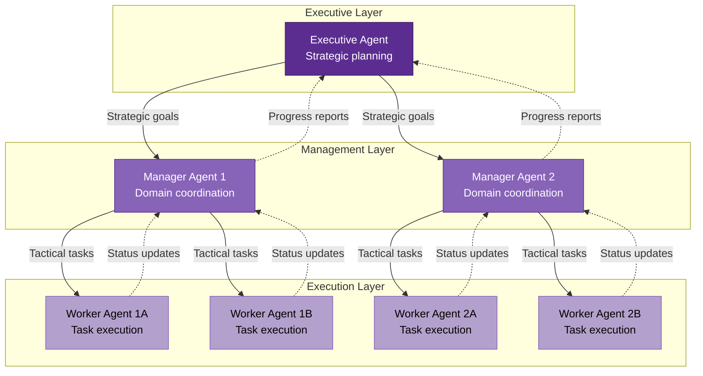
```mermaid
graph TB
    subgraph "Executive Layer"
        Executive[Executive Agent<br/>Strategic planning]:::executive
    end

    subgraph "Management Layer"
        Manager1[Manager Agent 1<br/>Domain coordination]:::manager
        Manager2[Manager Agent 2<br/>Domain coordination]:::manager
    end

    subgraph "Execution Layer"
        Worker1A[Worker Agent 1A<br/>Task execution]:::worker
        Worker1B[Worker Agent 1B<br/>Task execution]:::worker
        Worker2A[Worker Agent 2A<br/>Task execution]:::worker
        Worker2B[Worker Agent 2B<br/>Task execution]:::worker
    end

    Executive -->|Strategic goals| Manager1
    Executive -->|Strategic goals| Manager2

    Manager1 -->|Tactical tasks| Worker1A
    Manager1 -->|Tactical tasks| Worker1B
    Manager2 -->|Tactical tasks| Worker2A
    Manager2 -->|Tactical tasks| Worker2B

    Worker1A -.->|Status updates| Manager1
    Worker1B -.->|Status updates| Manager1
    Worker2A -.->|Status updates| Manager2
    Worker2B -.->|Status updates| Manager2

    Manager1 -.->|Progress reports| Executive
    Manager2 -.->|Progress reports| Executive

    classDef executive fill:#5c2d91,stroke:#3b1f5f,color:#fff
    classDef manager fill:#8764b8,stroke:#5c2d91,color:#fff
    classDef worker fill:#b4a0cd,stroke:#8764b8,color:#000
```

### Agent-ERP Integration Pattern

**Template**:

```mermaid
graph LR
    subgraph "Agent Layer"
        Agent1[Agent 1<br/>Business process automation]:::agent
        Agent2[Agent 2<br/>Data enrichment]:::agent
    end

    subgraph "Integration Layer"
        API[API Gateway]:::integration
        Adapter[ERP Adapter<br/>Protocol translation]:::integration
    end

    subgraph "ERP System"
        ERP_API[ERP API<br/>SOAP/REST]:::erp
        ERP_DB[(ERP Database)]:::erp
    end

    Agent1 -->|API calls| API
    Agent2 -->|API calls| API
    API -->|Transform request| Adapter
    Adapter -->|SOAP/REST| ERP_API
    ERP_API -->|Query| ERP_DB
    ERP_DB -.->|Data| ERP_API
    ERP_API -.->|Response| Adapter
    Adapter -.->|Transform response| API
    API -.->|Structured data| Agent1
    API -.->|Structured data| Agent2

    classDef agent fill:#5c2d91,stroke:#3b1f5f,color:#fff
    classDef integration fill:#0078d4,stroke:#004578,color:#fff
    classDef erp fill:#d3d3d3,stroke:#737373,color:#000
```

**Styling Guidance**:
- Use purple tones for AI agents (#5c2d91)
- Use darker purple for orchestrators
- Use lighter purple for workers
- Use pink/magenta for evaluators (#e3008c)
- Show feedback loops with dotted arrows
- Group agents by responsibility layer

---

## 8. Well-Architected Framework Visualizations

### Reliability - Failover Architecture

**When to Use**:
- High availability design
- Disaster recovery planning
- Multi-region architecture
- Business continuity documentation

**Template**:

```mermaid
graph TB
    User([User])

    subgraph "Primary Region (East US)"
        LB1[Load Balancer]:::lb
        App1A[App Instance 1A]:::primary
        App1B[App Instance 1B]:::primary
        DB1[(Primary Database)]:::primary_db
    end

    subgraph "Secondary Region (West US)"
        LB2[Load Balancer]:::lb
        App2A[App Instance 2A]:::secondary
        App2B[App Instance 2B]:::secondary
        DB2[(Secondary Database<br/>Read Replica)]:::secondary_db
    end

    TM[Traffic Manager<br/>DNS-based routing]:::tm

    User -->|DNS query| TM
    TM -->|Primary route| LB1
    TM -.->|Failover route| LB2

    LB1 --> App1A
    LB1 --> App1B
    LB2 --> App2A
    LB2 --> App2B

    App1A --> DB1
    App1B --> DB1
    App2A --> DB2
    App2B --> DB2

    DB1 -.->|Async replication| DB2

    classDef primary fill:#7fba00,stroke:#4a7000,color:#fff
    classDef primary_db fill:#107c10,stroke:#004b1c,color:#fff
    classDef secondary fill:#ffb900,stroke:#ff8c00,color:#000
    classDef secondary_db fill:#f7630c,stroke:#c50f1f,color:#fff
    classDef lb fill:#0078d4,stroke:#004578,color:#fff
    classDef tm fill:#5c2d91,stroke:#3b1f5f,color:#fff
```

### Security - Zero Trust Architecture

**Template**:

```mermaid
graph TB
    User([User])
    Device[Device<br/>Managed/Unmanaged]

    subgraph "Identity & Access"
        AAD[Azure AD<br/>Identity Provider]:::identity
        MFA[Multi-Factor Auth]:::identity
        CA[Conditional Access]:::identity
    end

    subgraph "Security Perimeter"
        WAF[Web Application Firewall]:::security
        APIM[API Management<br/>Gateway & Policies]:::security
        NSG[Network Security Groups]:::security
    end

    subgraph "Application Layer"
        App[Application]:::app
        API[API Services]:::app
    end

    subgraph "Data Layer"
        DB[(Database<br/>TDE enabled)]:::data
        Storage[(Storage<br/>Encrypted at rest)]:::data
    end

    User -->|1. Authenticate| AAD
    AAD -->|2. MFA challenge| MFA
    MFA -->|3. Evaluate policies| CA
    CA -->|4. Token issued| Device
    Device -->|5. HTTPS + Token| WAF
    WAF -->|6. Filter malicious| APIM
    APIM -->|7. Validate token| AAD
    APIM -->|8. Apply policies| App
    App --> API
    API -->|9. Encrypt in transit| DB
    API -->|9. Encrypt in transit| Storage

    classDef identity fill:#0078d4,stroke:#004578,color:#fff
    classDef security fill:#f25022,stroke:#a80000,color:#fff
    classDef app fill:#7fba00,stroke:#4a7000,color:#fff
    classDef data fill:#5c2d91,stroke:#3b1f5f,color:#fff
```

### Operational Excellence - CI/CD Pipeline

**Template**:

```mermaid
graph LR
    Dev([Developer])

    subgraph "Source Control"
        Git[Git Repository<br/>Azure Repos]:::source
    end

    subgraph "Build Pipeline"
        Build[Build Agent<br/>Compile & Test]:::build
        Test[Unit Tests<br/>Code Coverage]:::build
        Scan[Security Scan<br/>SonarQube]:::build
    end

    subgraph "Artifact Management"
        ACR[Container Registry<br/>Azure ACR]:::artifact
        Artifact[Artifact Storage]:::artifact
    end

    subgraph "Release Pipeline"
        Deploy_Dev[Deploy to Dev]:::deploy_dev
        Deploy_Test[Deploy to Test]:::deploy_test
        Deploy_Prod[Deploy to Prod]:::deploy_prod
    end

    subgraph "Monitoring"
        Monitor[Application Insights<br/>Log Analytics]:::monitor
    end

    Dev -->|git push| Git
    Git -->|Trigger| Build
    Build --> Test
    Test --> Scan
    Scan -->|Publish| ACR
    Scan -->|Publish| Artifact

    ACR --> Deploy_Dev
    Deploy_Dev -->|Automated| Deploy_Test
    Deploy_Test -->|Manual approval| Deploy_Prod

    Deploy_Prod --> Monitor
    Monitor -.->|Feedback| Dev

    classDef source fill:#5c2d91,stroke:#3b1f5f,color:#fff
    classDef build fill:#0078d4,stroke:#004578,color:#fff
    classDef artifact fill:#7fba00,stroke:#4a7000,color:#fff
    classDef deploy_dev fill:#50e6ff,stroke:#0078d4,color:#000
    classDef deploy_test fill:#ffb900,stroke:#ff8c00,color:#000
    classDef deploy_prod fill:#f25022,stroke:#a80000,color:#fff
    classDef monitor fill:#e3008c,stroke:#a50062,color:#fff
```

### Performance - CQRS Pattern

**Template**:

```mermaid
graph TB
    Client([Client])

    subgraph "Command Side (Write)"
        CommandAPI[Command API]:::command
        CommandHandler[Command Handler]:::command
        WriteDB[(Write Database<br/>Optimized for writes)]:::write_db
    end

    subgraph "Query Side (Read)"
        QueryAPI[Query API]:::query
        QueryHandler[Query Handler]:::query
        ReadDB[(Read Database<br/>Denormalized views)]:::read_db
        Cache[(Redis Cache<br/>Hot data)]:::cache
    end

    subgraph "Synchronization"
        EventBus[Event Bus<br/>Domain events]:::sync
    end

    Client -->|Commands<br/>POST, PUT, DELETE| CommandAPI
    Client -->|Queries<br/>GET| QueryAPI

    CommandAPI --> CommandHandler
    CommandHandler -->|Write| WriteDB
    CommandHandler -->|Publish events| EventBus

    EventBus -->|Subscribe| QueryHandler
    QueryHandler -->|Update| ReadDB
    QueryHandler -->|Update| Cache

    QueryAPI -->|Read from cache| Cache
    Cache -.->|Cache miss| ReadDB
    QueryAPI -.->|Read from DB| ReadDB

    classDef command fill:#f25022,stroke:#a80000,color:#fff
    classDef query fill:#7fba00,stroke:#4a7000,color:#fff
    classDef write_db fill:#faa,stroke:#f25022,color:#000
    classDef read_db fill:#afa,stroke:#7fba00,color:#000
    classDef cache fill:#50e6ff,stroke:#0078d4,color:#000
    classDef sync fill:#5c2d91,stroke:#3b1f5f,color:#fff
```

---

## 9. Gantt Charts for Implementation Roadmaps

### Implementation Roadmap Template

**When to Use**:
- Project timeline visualization
- Phase-based planning
- Dependency tracking
- Resource allocation planning
- Executive timeline presentations

**Template**:

```mermaid
gantt
    title [Project Name] Implementation Roadmap
    dateFormat YYYY-MM-DD

    section Phase 1: [Phase Name]
    [Task 1.1]           :a1, 2025-01-01, 30d
    [Task 1.2]           :a2, after a1, 20d
    [Task 1.3]           :a3, after a1, 15d
    [Milestone 1]        :milestone, m1, after a2, 0d

    section Phase 2: [Phase Name]
    [Task 2.1]           :b1, after a2, 25d
    [Task 2.2]           :b2, after b1, 30d
    [Task 2.3]           :b3, after a3, 20d
    [Milestone 2]        :milestone, m2, after b2, 0d

    section Phase 3: [Phase Name]
    [Task 3.1]           :c1, after b2, 15d
    [Task 3.2]           :c2, after b3, 20d
    [Task 3.3]           :c3, after c1, 10d
    [Go-Live]            :milestone, m3, after c3, 0d
```

**Example - Cloud Migration Roadmap**:

```mermaid
gantt
    title Azure Cloud Migration - 6 Month Roadmap
    dateFormat YYYY-MM-DD

    section Phase 1: Assessment
    Current State Analysis    :a1, 2025-01-15, 20d
    Application Portfolio     :a2, 2025-01-15, 25d
    Dependency Mapping        :a3, after a1, 15d
    TCO Analysis             :a4, after a2, 10d
    Assessment Complete      :milestone, m1, after a3, 0d

    section Phase 2: Foundation
    Azure Landing Zone       :b1, after a3, 30d
    Network Configuration    :b2, after b1, 20d
    Identity & Access        :b3, after b1, 15d
    Security Baseline        :b4, after b2, 15d
    Foundation Ready         :milestone, m2, after b4, 0d

    section Phase 3: Migration Wave 1
    Migrate App Group 1      :c1, after b4, 30d
    Migrate App Group 2      :c2, after c1, 25d
    Data Migration Wave 1    :c3, after c1, 20d
    Testing & Validation     :c4, after c2, 15d
    Wave 1 Complete          :milestone, m3, after c4, 0d

    section Phase 4: Migration Wave 2
    Migrate App Group 3      :d1, after c4, 30d
    Migrate App Group 4      :d2, after d1, 25d
    Data Migration Wave 2    :d3, after d1, 20d
    Testing & Validation     :d4, after d2, 15d
    Wave 2 Complete          :milestone, m4, after d4, 0d

    section Phase 5: Optimization
    Performance Tuning       :e1, after d4, 20d
    Cost Optimization        :e2, after e1, 15d
    Security Hardening       :e3, after e1, 15d
    Documentation            :e4, after e2, 10d

    section Phase 6: Transition
    Knowledge Transfer       :f1, after e4, 15d
    Hypercare Period         :f2, after f1, 30d
    Project Closure          :milestone, m5, after f2, 0d
```

**Styling Guidance**:
- Use `milestone` for key decision points and deliverables
- Show dependencies with `after taskId`
- Group related tasks in sections
- Use consistent naming (verb + noun)
- Include buffer time for unknowns

---

## 10. Styling Standards

### Default Color Schemes

**Microsoft Default Palette**:

```mermaid
graph LR
    A[Primary Blue<br/>#0078d4]:::blue
    B[Green<br/>#7fba00]:::green
    C[Red<br/>#f25022]:::red
    D[Yellow<br/>#ffb900]:::yellow
    E[Purple<br/>#5c2d91]:::purple
    F[Gray<br/>#737373]:::gray

    classDef blue fill:#0078d4,stroke:#004578,color:#fff
    classDef green fill:#7fba00,stroke:#4a7000,color:#fff
    classDef red fill:#f25022,stroke:#a80000,color:#fff
    classDef yellow fill:#ffb900,stroke:#ff8c00,color:#000
    classDef purple fill:#5c2d91,stroke:#3b1f5f,color:#fff
    classDef gray fill:#737373,stroke:#464646,color:#fff
```

### classDef Usage Examples

**Basic Syntax**:
```
classDef className fill:#hexcolor,stroke:#hexcolor,color:#hexcolor
```

**Applying Classes**:
```
NodeName[Label]:::className
```

**Complete Example**:

```mermaid
graph LR
    A[Core System]:::core
    B[Supporting System]:::supporting
    C[External System]:::external
    D[Data Store]:::data

    A --> B
    B --> C
    C --> D

    classDef core fill:#0078d4,stroke:#004578,color:#fff
    classDef supporting fill:#50e6ff,stroke:#0078d4,color:#000
    classDef external fill:#d3d3d3,stroke:#737373,color:#000
    classDef data fill:#7fba00,stroke:#4a7000,color:#fff
```

### Semantic Color Coding

**Recommended Color Assignments**:

| **Element Type** | **Color** | **Hex Code** | **Use Case** |
|-----------------|-----------|--------------|--------------|
| Core Systems | Blue | `#0078d4` | Primary business systems, core domains |
| Supporting Systems | Light Blue | `#50e6ff` | Supporting domains, utilities |
| External Systems | Gray | `#737373` | Third-party integrations, legacy systems |
| Data Stores | Green | `#7fba00` | Databases, caches, storage |
| AI/ML Components | Purple | `#5c2d91` | Agents, orchestrators, ML models |
| Security Components | Red | `#f25022` | Firewalls, auth, security services |
| Operations/DevOps | Orange | `#ff8c00` | CI/CD, monitoring, operations |
| Warning/Pending | Yellow | `#ffb900` | Warnings, pending states, caution |
| Success/Active | Green | `#107c10` | Success states, active components |
| Error/Failed | Dark Red | `#c50f1f` | Error states, failed components |

### How to Override with Brand Colors

**Step 1: Collect Brand Colors**:
```
Client Brand Colors:
- Primary: #1e3a8a
- Secondary: #10b981
- Accent: #f59e0b
- Neutral: #6b7280
```

**Step 2: Map to Semantic Elements**:
```
- Core Systems: Primary (#1e3a8a)
- Supporting Systems: Secondary (#10b981)
- Highlights: Accent (#f59e0b)
- External/Infrastructure: Neutral (#6b7280)
```

**Step 3: Define Custom Classes**:
```
classDef brand_core fill:#1e3a8a,stroke:#0f172a,color:#fff
classDef brand_support fill:#10b981,stroke:#047857,color:#000
classDef brand_accent fill:#f59e0b,stroke:#d97706,color:#000
classDef brand_neutral fill:#6b7280,stroke:#374151,color:#fff
```

**Step 4: Apply Consistently**:
```mermaid
graph TB
    A[Core Service]:::brand_core
    B[Supporting Service]:::brand_support
    C[External API]:::brand_neutral
    D[Highlighted Feature]:::brand_accent

    A --> B
    B --> C
    D --> A

    classDef brand_core fill:#1e3a8a,stroke:#0f172a,color:#fff
    classDef brand_support fill:#10b981,stroke:#047857,color:#000
    classDef brand_accent fill:#f59e0b,stroke:#d97706,color:#000
    classDef brand_neutral fill:#6b7280,stroke:#374151,color:#fff
```

---

## 11. Generation Approaches

### Auto-Generation from Structured Inputs

**When to Use**:
- Repetitive diagram creation
- Diagrams from existing data sources
- Batch diagram generation
- Template-based customization

**Approach**:
1. Define JSON/YAML input schema
2. Create diagram template with placeholders
3. Write generation script (Python, PowerShell)
4. Render diagram from data

**Example - Auto-generate from JSON**:

```json
{
  "system": "Order Management",
  "containers": [
    {
      "name": "Web Portal",
      "technology": "React",
      "description": "Customer interface"
    },
    {
      "name": "Order Service",
      "technology": ".NET 8",
      "description": "Order processing"
    },
    {
      "name": "Order Database",
      "technology": "Azure SQL",
      "description": "Order data"
    }
  ],
  "relationships": [
    {
      "from": "Web Portal",
      "to": "Order Service",
      "description": "API calls"
    },
    {
      "from": "Order Service",
      "to": "Order Database",
      "description": "Reads/Writes"
    }
  ]
}
```

**Generation Script Pseudocode**:
```python
def generate_c4_container(config):
    diagram = "C4Container\n"
    diagram += f"    title Container Diagram for {config['system']}\n\n"

    for container in config['containers']:
        diagram += f"    Container({to_id(container['name'])}, "
        diagram += f"\"{container['name']}\", "
        diagram += f"\"{container['technology']}\", "
        diagram += f"\"{container['description']}\")\n"

    for rel in config['relationships']:
        diagram += f"    Rel({to_id(rel['from'])}, "
        diagram += f"{to_id(rel['to'])}, "
        diagram += f"\"{rel['description']}\")\n"

    return diagram
```

### Manual Composition with Templates

**When to Use**:
- Unique, one-off diagrams
- Rapid prototyping
- Exploratory design
- Custom visualizations

**Approach**:
1. Select appropriate template from this library
2. Copy template to working document
3. Replace placeholders with actual values
4. Adjust styling as needed
5. Validate syntax and rendering

**Best Practices**:
- Start with closest matching template
- Maintain consistent naming conventions
- Test incremental changes
- Version control diagram source

### Explicit Request Handling

**When to Use**:
- User explicitly asks for diagram type
- User provides diagram requirements
- User requests visualization of concept

**User Request Patterns**:
- "Show me a sequence diagram for..."
- "Create a C4 context diagram of..."
- "Visualize the state machine for..."
- "I need an ER diagram showing..."

**Response Pattern**:
1. Confirm diagram type and scope
2. Ask about branding (ALWAYS)
3. Select appropriate template
4. Customize with user's specifics
5. Provide rendered diagram
6. Offer to adjust/refine

**Example Interaction**:
```
User: "Create a sequence diagram for user authentication"
Assistant: "Do you have specific brand colors or styling guidelines I should apply to these diagrams?"

User: "No, just use defaults"

Assistant: [Creates OAuth 2.0 sequence diagram with Microsoft color scheme]
```

**Integration with Other Templates**:
- Reference branding skill for color extraction
- Use with technical-documentation-templates.md for documentation
- Include in proposal-templates.md for solution proposals
- Embed in presentation-templates.md for stakeholder presentations

---

## 12. Best Practices

### Consistent Styling Across Diagrams

**Maintain Color Scheme Consistency**:
- Use the same color palette across all diagrams in a project
- Document color assignments in project README
- Create reusable `classDef` blocks in a shared file
- Apply brand colors consistently when specified

**Example - Shared Style Definitions**:
```mermaid
%%{init: {'theme':'base', 'themeVariables': { 'primaryColor':'#0078d4'}}}%%
graph TB
    A[Component]
```

### Semantic Naming Conventions

**Node Naming**:
- Use PascalCase for service names: `OrderService`, `PaymentGateway`
- Use snake_case for database tables: `customer_order`, `product_inventory`
- Use clear, descriptive labels

- Include technology in containers: "React SPA", ".NET 8 WebAPI"

**Relationship Naming**:
- Use verb phrases: "sends", "queries", "publishes to"
- Include protocol/format: "REST API", "gRPC", "AMQP"
- Be specific: "POST /api/orders" vs "API call"

### Direction and Layout Choices

**Graph Direction**:
- `TB` (Top-Bottom): Hierarchical structures, workflows, state machines
- `LR` (Left-Right): Pipelines, sequential processes, data flows
- `RL` (Right-Left): Reverse flows, backward compatibility views
- `BT` (Bottom-Top): Dependencies, build-up views

**When to Use Each**:
```mermaid
graph TB
    %% Use TB for organizational hierarchy
    CEO[CEO]
    CTO[CTO]
    Dev[Development Team]
    CEO --> CTO
    CTO --> Dev
```

```mermaid
graph LR
    %% Use LR for linear processes
    Source[Source] --> Transform[Transform] --> Load[Load] --> Destination[Destination]
```

### Subgraphs for Grouping

**Use Subgraphs to**:
- Group related components by domain/context
- Show system boundaries and trust zones
- Organize by architectural layers
- Highlight regions or deployment zones

**Example - Multi-Layer Architecture**:
```mermaid
graph TB
    subgraph "Presentation Layer"
        UI[Web UI]
        API_Gateway[API Gateway]
    end
    
    subgraph "Business Layer"
        OrderSvc[Order Service]
        InvSvc[Inventory Service]
    end
    
    subgraph "Data Layer"
        OrderDB[(Order Database)]
        InvDB[(Inventory Database)]
    end
    
    UI --> API_Gateway
    API_Gateway --> OrderSvc
    API_Gateway --> InvSvc
    OrderSvc --> OrderDB
    InvSvc --> InvDB
```

### Version Control Integration

**File Organization**:
```
docs/
├── architecture/
│   ├── c4-context.md
│   ├── c4-container.md
│   ├── bounded-contexts.md
│   └── sequence-diagrams/
│       ├── order-processing.md
│       └── authentication.md
├── diagrams/
│   └── styles/
│       └── brand-colors.md
└── adr/
    └── 001-mermaid-for-diagrams.md
```

**Git Workflow**:
1. Commit diagram source alongside code changes
2. Use pull requests to review diagram updates
3. Tag diagram versions with release versions
4. Document diagram purpose in commit messages

**Example Commit Messages**:
```
feat(arch): Add C4 container diagram for order management system
docs(arch): Update sequence diagram to reflect new payment flow
refactor(arch): Apply new brand colors to all architecture diagrams
```

### Tool Integration

**GitHub Integration**:
- Mermaid diagrams render automatically in README.md
- Use in Pull Request descriptions for visual context
- Include in GitHub Issues for bug reports and feature requests
- Embed in GitHub Wiki for documentation

**VS Code Integration**:
- Install "Markdown Preview Mermaid Support" extension
- Preview diagrams while editing
- Export diagrams to SVG/PNG
- Lint Mermaid syntax with extensions

**Confluence Integration**:
- Use "Mermaid Diagrams" plugin
- Embed diagrams in Confluence pages
- Version diagrams with page versions
- Export pages to PDF with rendered diagrams

**Azure DevOps Integration**:
- Render in Wiki pages
- Include in work item descriptions
- Embed in README files in repos
- Use in pipeline documentation

### Complexity Management

**When Diagrams Get Too Complex**:
1. **Split by abstraction level**: Create separate C4 Context, Container, Component diagrams
2. **Split by domain**: One diagram per bounded context or microservice
3. **Split by scenario**: Separate sequence diagrams for different flows
4. **Use drill-down approach**: Link from high-level to detailed diagrams

**Indicators of Over-Complexity**:
- More than 10-12 nodes in a single diagram
- Relationship lines crossing extensively
- Labels overlapping or illegible
- Diagram doesn't fit on screen without scrolling
- Takes more than 30 seconds to explain

**Simplification Techniques**:
- Group related nodes in subgraphs
- Abstract external systems into single nodes
- Remove implementation details from high-level diagrams
- Use notes for detailed explanations instead of adding nodes
- Create separate diagrams for error flows

### Accessibility Considerations

**Color Contrast**:
- Ensure text has sufficient contrast with background
- Don't rely solely on color to convey meaning
- Use patterns or labels in addition to colors
- Test diagrams in grayscale to verify clarity

**Text Readability**:
- Keep labels concise but descriptive
- Use proper capitalization for readability
- Avoid technical jargon unless necessary
- Provide legend when using symbols or abbreviations

### Documentation Standards

**Diagram Metadata**:
Always include with diagrams:
- **Title**: Clear, descriptive title
- **Date**: Creation/update date
- **Author**: Who created/maintains it
- **Version**: Semantic versioning for major changes
- **Purpose**: Why this diagram exists
- **Audience**: Who should read this

**Example Documentation Block**:
```markdown
# Order Processing Sequence Diagram

**Version**: 1.2.0
**Last Updated**: 2025-11-09
**Author**: Enterprise Architecture Team
**Status**: Current

**Purpose**: Documents the end-to-end order processing flow from customer submission through payment confirmation.

**Audience**: Development teams, product owners, QA engineers

**Key Assumptions**:
- Inventory is checked synchronously
- Payment processing is asynchronous
- Order creation uses eventual consistency

```mermaid
sequenceDiagram
    ...
```
```

### Performance Optimization

**Large Diagrams**:
- Mermaid can struggle with 50+ nodes
- Split into multiple diagrams
- Consider using tools like PlantUML for very large diagrams
- Generate static images for frequently accessed diagrams

**Rendering Time**:
- Limit use of styling to essential elements
- Avoid deeply nested subgraphs (max 3-4 levels)
- Use simpler diagram types when possible
- Pre-render diagrams for presentations

### Quality Checklist

Before finalizing any Mermaid diagram, verify:

- [ ] **Branding**: Asked about and applied brand colors if specified
- [ ] **Accuracy**: Diagram reflects actual/planned architecture
- [ ] **Clarity**: Labels are clear and unambiguous
- [ ] **Consistency**: Styling matches other project diagrams
- [ ] **Completeness**: All necessary components are shown
- [ ] **Context**: Diagram has title, legend if needed
- [ ] **Correctness**: Mermaid syntax is valid and renders
- [ ] **Simplicity**: Diagram is as simple as possible but no simpler
- [ ] **Documentation**: Purpose and audience are documented
- [ ] **Version Control**: Diagram source is committed to Git

---

## Summary

This library provides comprehensive patterns for creating professional architecture diagrams using Mermaid. Key takeaways:

1. **Always ask about branding first** before generating any diagram
2. **Use appropriate diagram types** for your communication goal
3. **Apply consistent styling** across all diagrams in a project
4. **Version control diagram source** alongside code
5. **Keep diagrams simple** - split complex diagrams into multiple views
6. **Document diagram purpose** and intended audience
7. **Integrate with existing tools** (GitHub, VS Code, Confluence)
8. **Follow naming conventions** for clarity and consistency

**Next Steps**:
- Review the templates in this library
- Customize color schemes for your organization/client
- Create a shared styles repository for your team
- Establish diagram review processes
- Train team members on Mermaid syntax and patterns

**Resources**:
- [Mermaid Official Documentation](https://mermaid.js.org/)
- [C4 Model](https://c4model.com/)
- [Domain-Driven Design](https://www.domainlanguage.com/ddd/)
- [Azure Well-Architected Framework](https://learn.microsoft.com/azure/well-architected/)

**Remember**: Diagrams are communication tools. The best diagram is the one that effectively conveys your architectural vision to your intended audience.
