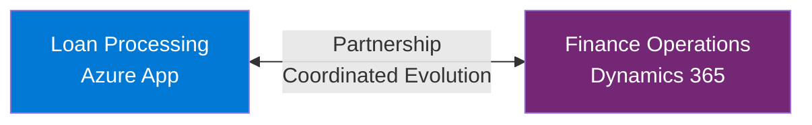
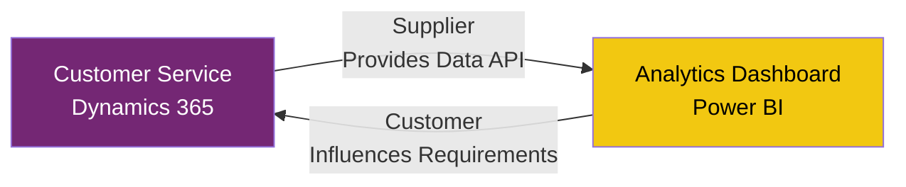
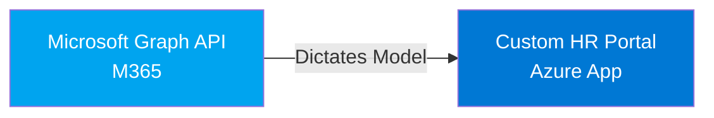
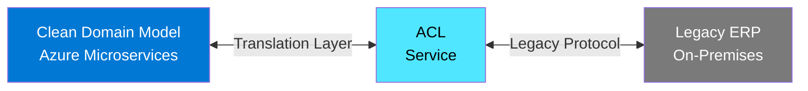
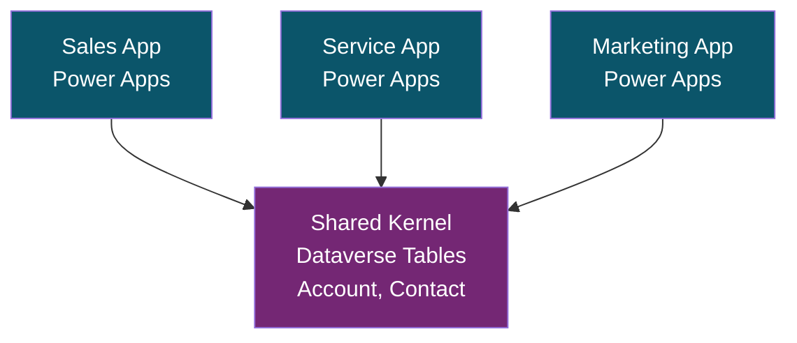
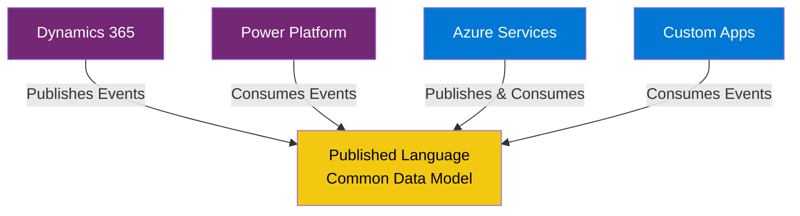
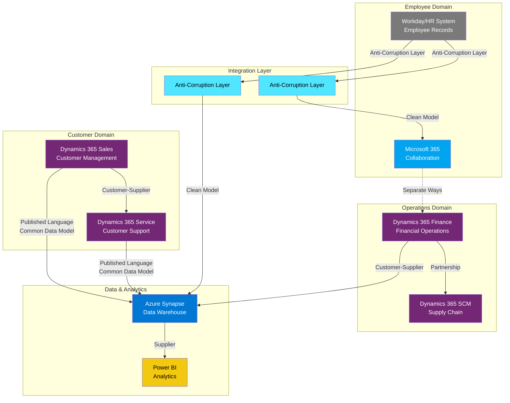

# Domain-Driven Design - Strategic Patterns

## Definition

Domain-Driven Design (DDD) is a software development philosophy and set of patterns focused on modeling complex business domains through close collaboration between technical and domain experts. In enterprise architecture, strategic DDD patterns provide powerful tools for decomposing large systems into manageable, loosely-coupled bounded contexts that align with business capabilities and organizational structures.

Strategic DDD is particularly valuable in Microsoft enterprise ecosystems where multiple platforms (Azure, Dynamics 365, Power Platform, Microsoft 365) must work together cohesively while maintaining clear boundaries and contracts. The strategic patterns help architects make critical decisions about system decomposition, integration strategies, and team organization that directly impact long-term maintainability and business agility.

Unlike tactical DDD (which focuses on implementation patterns like entities, value objects, and aggregates), strategic DDD operates at the architecture level, addressing how different parts of the enterprise system relate to each other, how they communicate, and how they evolve independently while serving the broader business mission.

## Core Strategic Concepts

### Bounded Context

A bounded context is an explicit boundary within which a domain model is defined and applicable. It represents a linguistic and conceptual boundary where terms have specific, unambiguous meanings. In Microsoft enterprise architectures, bounded contexts often align with distinct applications, microservices, or business capabilities.

**Characteristics of Bounded Contexts**:
- **Explicit boundaries**: Clear definition of what is inside and outside the context
- **Unified model**: Consistent domain model within the boundary
- **Autonomous**: Can be developed, deployed, and scaled independently
- **Aligned with business capabilities**: Reflects how the business thinks about its operations

**Microsoft Platform Examples**:
- Customer Management in Dynamics 365 Sales
- Inventory Management in Dynamics 365 Supply Chain
- Employee Directory in Microsoft 365
- Approval Workflows in Power Platform
- Claims Processing in a custom Azure application

### Ubiquitous Language

The ubiquitous language is a shared vocabulary between developers and domain experts that is used consistently in all discussions, code, and models within a bounded context. This linguistic consistency eliminates translation errors and ensures that the software accurately reflects business intent.

**Implementing Ubiquitous Language**:
- Conduct collaborative modeling sessions with business stakeholders
- Document key terms in a glossary specific to each bounded context
- Use business terms in code (class names, method names, API endpoints)
- Ensure the same term has the same meaning across all artifacts
- Accept that terms may have different meanings in different bounded contexts

**Power Platform Application**: In Power Apps and Power Automate, naming conventions should reflect the ubiquitous language. For example, if the business calls it an "Opportunity" in the sales context but an "Order" in fulfillment, these terms should be used in their respective contexts rather than trying to harmonize them artificially.

### Context Mapping

Context mapping is the practice of explicitly documenting the relationships and integration patterns between bounded contexts. This is perhaps the most critical strategic DDD activity for enterprise architects, as it reveals organizational dynamics, defines integration contracts, and guides technology choices.

## Context Mapping Patterns

### 1. Partnership

**Definition**: Two bounded contexts collaborate as equal partners with mutual dependency. Both teams coordinate closely to achieve shared objectives, and neither dominates the relationship.

**When to Use**:
- Both contexts are evolving together
- Teams have close collaboration and shared goals
- Changes need to be coordinated between both sides
- Neither team can dictate terms to the other

**Microsoft Example**: A custom Azure application for loan processing working in partnership with a Dynamics 365 Finance implementation where both systems need to evolve together to support new financial products.

**Implementation Considerations**:
- Establish regular synchronization meetings between teams
- Use shared event schemas or APIs that both teams agree upon
- Implement integration tests that span both contexts
- Coordinate deployment schedules

### 2. Customer-Supplier

**Definition**: A supplier context provides services to a customer context. The supplier has some obligation to provide what the customer needs, but the customer must accept what the supplier offers. The relationship is collaborative but asymmetric.

**When to Use**:
- One context provides capabilities consumed by another
- The supplier has multiple consumers and defines the contract
- The customer has influence but not control over the supplier
- Clear service level agreements exist

**Microsoft Example**: Dynamics 365 Customer Service (supplier) providing customer data to a Power BI reporting solution (customer).

**Implementation Considerations**:
- Define clear API contracts and SLAs
- Customer provides input on API design but respects supplier's constraints
- Implement versioning strategies for APIs
- Use Microsoft Dataverse for shared data models when applicable

### 3. Conformist

**Definition**: The downstream context conforms to the model of the upstream context without negotiation. The downstream team accepts the upstream model as-is, even if it doesn't perfectly fit their needs.

**When to Use**:
- Upstream context is an established system that won't change
- Downstream team has no influence over upstream design
- Cost of translation layer exceeds benefit
- Upstream provides sufficient value despite imperfect model

**Microsoft Example**: A custom application conforming to Microsoft Graph API schemas and conventions, accepting Microsoft's model without attempting to change it.

**Implementation Considerations**:
- Map upstream concepts directly to your domain model
- Accept some semantic mismatch rather than building translation layers
- Document where upstream model differs from ideal local model
- Monitor upstream API changes and deprecations

### 4. Anti-Corruption Layer (ACL)

**Definition**: Create an isolation layer that translates between your domain model and an external system's model. This prevents the external model from corrupting your bounded context's clean domain model.

**When to Use**:
- External system has a complex, legacy, or poorly designed model
- Your context requires a clean domain model distinct from external system
- Multiple external systems need integration
- Long-term maintainability is more important than initial development speed

**Microsoft Example**: Creating an ACL between a modern Azure microservices architecture and legacy SAP systems, or between Dynamics 365 and older on-premises systems.

**Implementation Considerations**:
- Use Azure Functions or Logic Apps for lightweight ACL implementations
- Implement adapters that translate between models
- Isolate external system changes to the ACL layer
- Consider Event-Driven integration with Azure Service Bus or Event Grid
- Document mapping rules explicitly

### 5. Shared Kernel

**Definition**: Two bounded contexts share a subset of the domain model. The shared part is maintained jointly by both teams with careful coordination. Changes require agreement from all sharing teams.

**When to Use**:
- Very close collaboration between teams
- Core concepts are genuinely identical across contexts
- Teams are willing to coordinate changes carefully
- Benefits of sharing outweigh coordination overhead

**Microsoft Example**: Multiple Power Platform solutions sharing common Microsoft Dataverse tables for core business entities like Account and Contact.

**Implementation Considerations**:
- Minimize the shared kernel to essential concepts only
- Establish clear governance for changes to shared model
- Use Dataverse solutions for packaging shared components
- Document shared contracts explicitly
- Implement comprehensive integration tests

### 6. Published Language

**Definition**: Use a well-documented, shared language for integration between contexts. Often implemented as a standardized schema, API specification, or event format that multiple contexts can use.

**When to Use**:
- Multiple contexts need to integrate
- Industry standards exist (HL7, FHIR, EDIFACT, etc.)
- Organization has established canonical data models
- Reducing coupling between multiple contexts is important

**Microsoft Example**: Using industry-standard schemas with Azure Integration Services, or Microsoft's Common Data Model for cross-platform data integration.

**Implementation Considerations**:
- Leverage Microsoft Common Data Model where applicable
- Define schemas in Azure API Management
- Use Azure Event Grid schemas for event-driven integration
- Publish comprehensive API documentation
- Version the published language carefully

### 7. Separate Ways

**Definition**: Recognize that integration between two contexts provides limited value and decide not to integrate them. Each context goes its own way independently.

**When to Use**:
- Integration cost exceeds benefits
- Contexts serve completely different business purposes
- No shared data or processes exist
- Duplication is acceptable

**Microsoft Example**: Keeping HR systems (Workday) and engineering tools (GitHub, Azure DevOps) completely separate when they serve distinct purposes with no overlap.

**Implementation Considerations**:
- Document the decision not to integrate
- Accept some data duplication
- Establish clear boundaries of responsibility
- Revisit the decision periodically as needs evolve

## Context Map for Microsoft Enterprise

Here's an example context map for a typical Microsoft enterprise ecosystem:

## When to Apply DDD in Enterprise Architecture

### High-Value Scenarios

**Complex Business Domains**: When business rules are intricate and evolving, DDD provides structure for managing complexity through clear boundaries and models.

**Large-Scale Systems**: For enterprise systems spanning multiple teams, platforms, and organizational units, strategic DDD prevents the chaos of unmanaged dependencies.

**Platform Integration**: When integrating multiple Microsoft platforms (Dynamics, Azure, Power Platform, M365), context mapping prevents tight coupling and enables independent evolution.

**Digital Transformation**: During major modernization efforts, DDD helps decompose monoliths into well-bounded services aligned with business capabilities.

**Merger & Acquisition**: When combining systems from different organizations, context maps reveal integration challenges and guide harmonization strategies.

### Lower-Value Scenarios

**Simple CRUD Applications**: For straightforward data entry and reporting, DDD may add unnecessary complexity.

**Short-Lived Prototypes**: For MVPs or experiments with uncertain futures, invest in DDD only after product-market fit is validated.

**Single-Team Projects**: Very small projects with one team may not benefit from the overhead of explicit context mapping.

## Integration with Microsoft Platforms

### Dynamics 365

Microsoft Dataverse provides natural bounded context boundaries through business units, solutions, and security roles. Each Dynamics 365 application (Sales, Service, Finance, SCM) represents a distinct bounded context with its own domain model.

**Best Practices**:
- Use Dataverse solutions to package bounded contexts
- Leverage Power Automate for cross-context integration
- Apply security roles to enforce context boundaries
- Use dual-write carefully, considering it creates a shared kernel

### Power Platform

Power Platform's low-code nature makes it excellent for rapidly implementing bounded contexts for specific business capabilities. Context boundaries can align with Power Apps or with solution packages.

**Best Practices**:
- Package each bounded context as a separate solution
- Use environment variables for cross-environment configuration
- Implement integration through Dataverse or custom APIs
- Document ubiquitous language in solution documentation

### Azure

Azure's microservices capabilities align perfectly with DDD bounded contexts. Each microservice can represent a bounded context with clear boundaries, independent deployment, and focused responsibilities.

**Best Practices**:
- Use Azure API Management to define and version context APIs
- Implement ACL patterns with Azure Functions or Logic Apps
- Use Azure Service Bus or Event Grid for asynchronous integration
- Deploy contexts independently using Azure DevOps pipelines
- Use Azure Container Apps or AKS for context isolation

### Microsoft 365

M365 applications represent established bounded contexts with well-defined APIs through Microsoft Graph. Custom applications typically adopt a Conformist relationship with M365.

**Best Practices**:
- Use Microsoft Graph API as the integration point
- Accept M365's domain model in integration scenarios
- Implement webhooks for event-driven integration
- Use SharePoint or Teams as collaboration hubs per context

## Documentation and Communication

### Context Map Documentation

Maintain living documentation of your context map:
- Visual diagrams (Mermaid, Visio, or draw.io)
- Written descriptions of each relationship pattern
- API contracts and schemas
- Integration test suites
- Architecture decision records (ADRs) for key mapping decisions

### Team Alignment

Strategic DDD requires organizational alignment:
- Map teams to bounded contexts where possible (Conway's Law)
- Establish clear ownership for each context
- Create integration working groups for cross-context concerns
- Conduct regular architecture reviews of context boundaries
- Update context maps as the system evolves

## Microsoft Documentation Resources

- **Microsoft Cloud Adoption Framework**: Provides guidance on organizing workloads that aligns with bounded contexts
- **Azure Architecture Center**: Contains reference architectures demonstrating context separation
- **Power Platform CoE Starter Kit**: Includes governance patterns for context management
- **Microsoft Learn**: Offers modules on microservices architecture and integration patterns
- **Common Data Model**: Microsoft's published language for business data

## Assessment Questions

1. **Context Identification**: Have you identified all bounded contexts in your enterprise landscape? Are they aligned with business capabilities?

2. **Context Relationships**: For each pair of contexts, have you explicitly decided which integration pattern to use? Are these patterns documented?

3. **Ubiquitous Language**: Is there a clear, documented ubiquitous language for each bounded context? Do technical and business stakeholders use the same terms?

4. **Integration Strategy**: Are you using anti-corruption layers to protect your domain models from external systems? Or have you consciously chosen conformist patterns?

5. **Team Organization**: Do your team boundaries align with your bounded contexts? If not, how are you managing coordination overhead?

6. **Evolution**: How do you handle changes that span multiple contexts? Do you have governance processes for shared kernel or published language changes?

7. **Platform Alignment**: Are your Dynamics, Azure, and Power Platform implementations aligned with your context boundaries, or do they cut across them?

8. **Documentation**: Is your context map documented and kept up-to-date? Do new team members use it for onboarding?

## Conclusion

Strategic Domain-Driven Design provides essential patterns for managing complexity in Microsoft enterprise architectures. By explicitly mapping bounded contexts and their relationships, architects can design systems that are loosely coupled, independently deployable, and aligned with business capabilities. The context mapping patterns (Partnership, Customer-Supplier, Conformist, Anti-Corruption Layer, Shared Kernel, Published Language, and Separate Ways) provide a vocabulary for describing and managing integration strategies across the Microsoft ecosystem.

The investment in strategic DDD pays dividends in long-term maintainability, team autonomy, and business agility. As Microsoft continues to expand its platform offerings, the ability to maintain clean context boundaries while integrating across Dynamics 365, Azure, Power Platform, and Microsoft 365 becomes increasingly critical for enterprise success.
