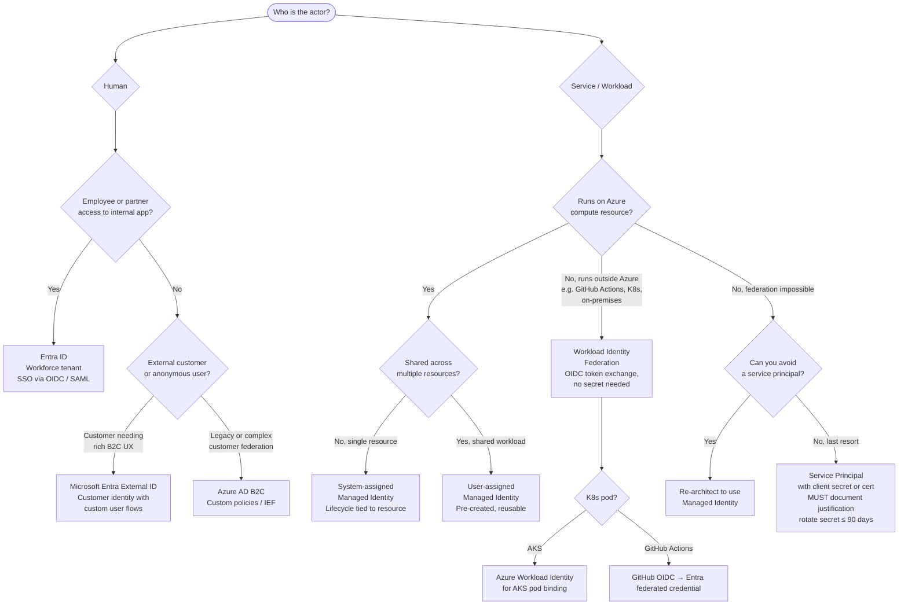

# Identity Decision Tree

Use this reference to select the correct identity primitive for every actor in a Microsoft cloud architecture. Making the wrong choice early is expensive to correct. Managed Identity configurations are not retroactively applied to already-deployed resources.

---

## Decision Tree



---

## Decision Nodes Explained

### Human Actors

**Entra ID (Workforce tenant)**

Use for employees, contractors, and B2B partners accessing internal applications. Provides:
- SSO via OIDC and SAML to Microsoft 365, Azure portal, and custom apps.
- Conditional Access policies (MFA enforcement, device compliance, location controls).
- RBAC via Entra groups or app roles.
- Application registrations for custom app integrations.

Gotcha: Do not use the workforce tenant for external customer-facing apps. You cannot control the user experience and B2B guest accounts accumulate governance debt.

**Microsoft Entra External ID (formerly Azure AD External Identities / Entra CIAM)**

Use for customer-facing applications where you own the sign-up and sign-in UX. Provides:
- Custom-branded user flows (email/password, social providers, passkeys).
- OIDC/OAuth 2.0 issuance for your APIs.
- Per-tenant isolation for multitenant SaaS scenarios.

**Azure AD B2C**

Legacy alternative to Entra External ID with Identity Experience Framework (IEF) custom policies. Still valid for:
- Complex, multi-step custom user journeys that user flows cannot express.
- Existing production B2C deployments: migration to Entra External ID is advisable but not urgent.

New projects: Use Entra External ID. Do not start new projects on Azure AD B2C.

---

### Service / Workload Actors

**System-assigned Managed Identity**

Default choice for any Azure compute resource (App Service, Container App, Function App, VM, AKS node pool). The identity:
- Is created automatically when enabled on the resource.
- Has its lifecycle tied to the resource; it is deleted with the resource.
- Cannot be shared across resources.

Grant RBAC roles to the identity rather than using connection strings or secrets. Example:

```bash
# Enable on App Service
az webapp identity assign --name myapp --resource-group myRG

# Grant Key Vault Secrets User role
az role assignment create \
  --assignee <principal-id> \
  --role "Key Vault Secrets User" \
  --scope /subscriptions/.../vaults/myKeyVault
```

**User-assigned Managed Identity**

Use when:
- Multiple resources share the same identity (e.g., a set of Container Apps in the same logical service).
- You need to pre-create the identity in infrastructure code before the resource exists.
- You need deterministic control over role assignments at deployment time.

The identity exists independently and must be explicitly deleted. Associate it at resource creation or via `az webapp identity assign --identities`.

**Workload Identity Federation**

Use for workloads that run outside Azure but need to access Azure resources without storing a secret. The workload exchanges its OIDC token (from GitHub Actions, Kubernetes, GitLab CI, etc.) for an Entra access token via the federation trust.

GitHub Actions example:

```yaml
# In GitHub Actions workflow
- uses: azure/login@v2
  with:
    client-id: ${{ secrets.AZURE_CLIENT_ID }}
    tenant-id: ${{ secrets.AZURE_TENANT_ID }}
    subscription-id: ${{ secrets.AZURE_SUBSCRIPTION_ID }}
    # No secret needed: uses OIDC federation
```

Configure the federated credential in Entra: `az ad app federated-credential create`.

**Azure Workload Identity for AKS**

Binds a Kubernetes service account to a user-assigned Managed Identity using OIDC federation. Pods annotated with the service account automatically receive an Azure access token projected as a volume.

**Service Principal (Last Resort)**

Only use when Managed Identity and Workload Identity Federation are genuinely unavailable. Required justification:
- Document the reason in your architecture decision record.
- Use a certificate credential, not a client secret, where possible.
- Rotate secrets every 90 days maximum; use Key Vault for storage.
- Set a short credential expiry and automate rotation.

---

## Quick Reference Card

| Actor | Where it runs | Recommended identity |
|---|---|---|
| Employee / contractor | Browser → corporate app | Entra ID (workforce) |
| External customer | Browser → consumer app | Entra External ID |
| Azure App Service / Function | Azure | System-assigned Managed Identity |
| Shared service (multiple deployments) | Azure | User-assigned Managed Identity |
| GitHub Actions pipeline | GitHub | Workload Identity Federation |
| AKS pod | Kubernetes | Azure Workload Identity (OIDC) |
| On-premises agent | On-prem | Workload Identity Federation or Service Principal (cert) |
| CI/CD that cannot use federation | Any | Service Principal with cert; justify in ADR |

---

## Trade-offs and Exceptions

- **System-assigned vs user-assigned**: System-assigned is simpler but creates a many-to-one dependency between the resource and the RBAC grants. If you blue/green deploy resources (delete old, create new), role assignments must be recreated. User-assigned avoids this.
- **Entra External ID vs B2C**: Entra External ID is the strategic product. B2C custom policies are more powerful but require Identity Experience Framework expertise. If your user flow complexity is high and your team lacks IEF experience, prototype both and decide based on capability gap.
- **Service principals in automation**: Some third-party tools (Terraform Cloud, Jenkins) cannot acquire Managed Identity tokens. Document this, use a service principal with a certificate, and set up automated rotation via Key Vault + Event Grid.
- **Multi-tenant apps**: Register the application in the issuing tenant and configure it to accept tokens from `organizations` or specific tenant IDs. Do not accept tokens from `common` unless you validate both `tid` (tenant ID) and `iss` (issuer) in your token validation handler.

> When reviewing identity design in a security context, apply the Spoofing and Elevation of Privilege categories in [stride-a-worksheet.md](./stride-a-worksheet.md).
