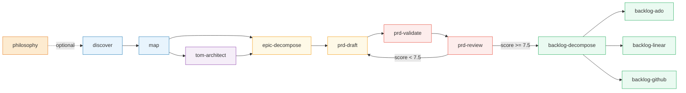

# PM Skills

**Your AI product management team, built as composable skills.**

> From "I have a business problem" to a validated PRD to a fully populated backlog in Azure DevOps, Linear, or GitHub — in one session.

---

## What This Changes

| Without PM Skills | With PM Skills |
|-------------------|---------------|
| Spend days writing a PRD from scratch | Say "help me understand this problem" and get a structured PRD in minutes |
| PRDs that engineering says "we can't estimate from this" | INVEST-compliant stories with Given-When-Then acceptance criteria |
| Copy-paste requirements into Jira/Linear/GitHub one by one | Entire hierarchical backlog created directly on your platform |
| PRDs that aim for "it works" (star 5) | PRDs scored against the 11-Star Experience Framework — aim for "wow" (star 7-8) |
| One monolithic requirements doc nobody reads | One PRD per epic, each self-contained and reviewable |

---

## The Pipeline

Every PM engagement flows through composable skills. Each skill does one thing well, and its output becomes the next skill's input — all through markdown files in your `specs/` directory.



**Orange** = Foundation | **Blue** = Discovery | **Purple** = TOM (Consulting) | **Yellow** = PRD | **Red** = Quality Gates | **Green** = Backlog

---

## Quick Start

### Install the plugin

```
/plugin install pm
```

### Start with the orchestrator

Just tell Claude what you need. The PM Agent routes you to the right skill:

```
/agent I have a business problem — users are dropping off during onboarding
```

Or invoke any skill directly:

```
/discover Help me understand why trial users aren't converting
/prd-draft Create a PRD for the notification management epic
/prd-review Score this PRD against the 11-star framework
/backlog-decompose Turn this PRD into work items for Linear
```

---

## Two Paths, One Pipeline

PM Skills adapts to your context. Tell it who you are, and the entire pipeline adjusts.

### SaaS PM Path

You build software products. You think in user personas, journeys, and activation metrics.

```
[philosophy] → discover → map → epic-decompose → prd-draft → prd-validate → prd-review
```

**Your personas** have behaviors, feelings, and journey stages.
**Your epics** come from pain points and recommended improvements.
**Your metrics** are PLG: activation rate, retention, expansion revenue.
**Your rollout** uses feature flags, percentage rollout, A/B testing.

### Consulting PM Path

You deliver transformation engagements. You think in processes, maturity gaps, and organizational actors.

```
[philosophy] → discover → map → tom-architect → epic-decompose → prd-draft → prd-validate → prd-review
```

**Your personas** are organizational roles with RACI responsibility and process ownership.
**Your epics** come from TOM maturity gaps and capability register gaps.
**Your metrics** are maturity progression and SOW milestone completion.
**Your rollout** uses milestone gates, client approvals, and UAT.

> The Target Operating Model (via `tom-architect`) is mandatory for the consulting path. It grounds your PRDs in operational reality.

### Six Platform Stacks

The TOM architect maps capabilities to your chosen enterprise platform:

| Platform | Key Modules | AI Capability |
|----------|------------|--------------|
| **Microsoft** | D365 F&O, D365 CE, Power Platform, Azure, Fabric | Copilot, Azure AI |
| **SAP** | S/4HANA, SuccessFactors, Ariba, BTP, Analytics Cloud | Joule AI, Business AI |
| **Oracle** | Fusion ERP, HCM Cloud, SCM Cloud, CX Cloud, OCI | Fusion AI, Agent Studio |
| **Salesforce** | Sales/Service/Marketing Cloud, Platform, MuleSoft | Agentforce, Einstein AI |
| **Workday** | HCM, Financial Management, Adaptive Planning | Illuminate, Ask Workday |
| **ServiceNow** | ITSM, ITOM, CSM, HR Service Delivery, App Engine | Now Assist, AI Agents |

---

## The 12 Skills

### Foundation

| Skill | What It Does | When You Need It |
|-------|-------------|-----------------|
| **philosophy** | Creates and maintains a living Product Constitution: product principles, value propositions, positioning, CX philosophy, building approach, prioritization framework, and research bets. Three modes: Create, Co-author, Review. | "Define what we stand for" / "How do we decide what to build?" / "Quarterly review of our product strategy" |

> The constitution uses a **two-tier architecture** to manage context: a compact summary (~800 tokens) that all skills read, plus 7 detailed section files that skills load on-demand. No context budget blown.

### Discovery Pipeline

| Skill | What It Does | When You Need It |
|-------|-------------|-----------------|
| **discover** | Structured questioning across 5 dimensions, root cause analysis (Five Whys, Fishbone), initiative classification | "Help me understand this business problem" |
| **map** | Builds 3-6 persona profiles, generates Mermaid process flows (BPMN, swimlane, state machine), assembles the Business Understanding Document | "Map this process and show me the personas" |

### TOM Pipeline (Consulting Path)

| Skill | What It Does | When You Need It |
|-------|-------------|-----------------|
| **tom-architect** | Designs Target Operating Models: L1-L4 process decomposition, maturity assessment, org design, RACI, KPI framework, AI augmentation overlay. Maps to Microsoft, SAP, Oracle, Salesforce, Workday, or ServiceNow. | "Design a TOM for our finance transformation" |

### PRD Pipeline

| Skill | What It Does | When You Need It |
|-------|-------------|-----------------|
| **epic-decompose** | Extracts epics from upstream artifacts, validates each with the DIVE test, presents for approval | "Break this into epics" |
| **prd-draft** | Generates one complete PRD per epic — 12 sections, INVEST stories, Given-When-Then acceptance criteria | "Write a PRD for this epic" |
| **prd-validate** | Structural validation filter — checks all 12 sections, story quality, metrics, and risks without modifying the PRD | "Is this PRD structurally complete?" |
| **prd-review** | Scores the PRD using Brian Chesky's 11-Star Experience Framework across 7 weighted dimensions | "How good is this PRD? Where can we push harder?" |

### Backlog Pipeline

| Skill | What It Does | When You Need It |
|-------|-------------|-----------------|
| **backlog-decompose** | Transforms finalized PRDs into a platform-neutral hierarchy: epics, features, stories, tech stories, risks, impediments, CI items | "Decompose this PRD into a backlog" |
| **backlog-ado** | Exports to Azure DevOps SAFe — generates an Excel workbook for CSV import with parent-child hierarchy | "Create an ADO backlog from this" |
| **backlog-linear** | Creates issues directly in Linear via MCP — with labels, parent-child relations, and duplicate detection | "Push this backlog to Linear" |
| **backlog-github** | Creates issues directly in GitHub via MCP — with sub-issue hierarchy, labels, milestones, and issue types | "Create GitHub issues from this PRD" |

---

## Real-World Scenarios

### Scenario 1: "Users are churning after the free trial"

You're a SaaS PM. Trial-to-paid conversion is dropping. You need to understand why and build a plan.

**Step 1 — Discover the problem**

```
/discover Our trial users are dropping off after day 3. We think it's an onboarding issue
but we're not sure. Help me understand the real problem.
```

PM Skills asks you 2-3 questions at a time across 5 dimensions: business context, stakeholders, problem definition, constraints, and success criteria. It applies Five Whys to distinguish symptoms from root causes. It classifies this as **Product Development** (new onboarding experience).

**Output**: `specs/onboarding-analysis.md`

**Step 2 — Map personas and flows**

```
/map
```

Reads the analysis, builds persona profiles (Trial User Taylor, Power User Priya, Admin Alex), and generates current-state and target-state Mermaid diagrams with pain points highlighted in red and improvements in green.

**Output**: `specs/onboarding-understanding-doc.md` with embedded diagrams

**Step 3 — Extract epics**

```
/epic-decompose
```

Identifies 4 epics from the understanding doc: User Registration, Profile Setup, Guided Tour, First Value Moment. Each passes the DIVE test. Presents the list for your approval.

**Output**: `specs/prd/onboarding-epic-manifest.md`

**Step 4 — Draft PRDs**

```
/prd-draft Generate PRDs for all approved epics
```

Creates 4 PRD files, each with 12 sections including INVEST-compliant user stories. Every story names a persona, has 3-8 Given-When-Then acceptance criteria, and at least one error scenario.

**Output**: `specs/prd/user-registration-prd.md`, `specs/prd/profile-setup-prd.md`, etc.

**Step 5 — Validate and review**

```
/prd-validate
/prd-review
```

Validation catches structural issues (a story missing acceptance criteria, an empty risk register). Review scores each PRD on the 11-star scale — the Guided Tour PRD scores 5.7 (Major Revision: "The tour is functional but forgettable. Elevate the first-value-moment to star 7 by proactively showing the user their next win").

**Step 6 — Rewrite and finalize**

The review report feeds back to `prd-draft` with specific P0/P1 improvements. The rewrite addresses each one. Re-review scores 8.1 (Approved with Notes).

**Step 7 — Create the backlog**

```
/backlog-decompose
/backlog-linear
```

Decomposes 4 PRDs into 4 epics, 14 features, 42 user stories, 8 technical stories, 5 risks, 2 impediments, and 3 CI items. Creates all of them as Linear issues with parent-child hierarchy, labels, and story point estimates.

**Result**: From "users are churning" to 74 actionable Linear issues in one session.

---

### Scenario 2: "We won a finance transformation engagement"

You're a Consulting PM at a Big Four firm. The client needs to modernize their procure-to-pay process.

```
/agent We just won a finance transformation engagement. The client wants to modernize
their P2P process — currently manual, lots of paper, 3 ERP systems. Help me decompose this.
```

The PM Agent identifies you as a **Consulting PM** and routes through the full consulting pipeline:

1. **discover**: Decomposes the transformation, identifies 5 actor personas (Procurement Officer, AP Clerk, Budget Holder, Vendor, CFO), maps current-state P2P across 3 systems
2. **map**: Generates swimlane diagrams showing handoffs between 3 departments, builds RACI matrix, annotates pain points (manual PO approval = 4-day bottleneck)
3. **tom-architect**: Builds the Target Operating Model — L1-L4 process taxonomy, maturity assessment (current: Level 2, target: Level 4), capability register, AI augmentation candidates
4. **epic-decompose**: Extracts 6 epics from TOM maturity gaps (Invoice Automation, PO Workflow, Vendor Portal, Spend Analytics, Contract Management, Compliance Reporting)
5. **prd-draft**: Generates 6 TOM-backed PRDs with maturity gap sections, SOW traceability, and process-change-based user stories
6. **prd-validate → prd-review**: Validates structure, scores quality, challenges default assumptions ("Does month-end close need to exist? Explore continuous accounting as star 8")
7. **backlog-decompose → backlog-ado**: Creates SAFe-aligned ADO workbook with 6 epics, 22 features, 85 stories, risk register, and impediment log — ready for CSV import

**Result**: From "we won the deal" to a complete SAFe backlog in Azure DevOps, traceable back to the TOM.

---

### Scenario 3: "Review this PRD a vendor sent us"

You received a vendor's PRD and need to assess quality before signing off.

```
/prd-review Review the PRD at specs/prd/vendor-analytics-prd.md
```

PM Skills reads the entire PRD, maps each feature to the 11-star scale, and scores across 7 dimensions:

```
Completeness:     8/10  (all sections present, good depth)
Clarity:          7/10  (mostly clear, 3 ambiguous acceptance criteria)
Feasibility:      8/10  (achievable with stated resources)
Ambition:         4/10  (every feature at star 5 — functional, forgettable)
Differentiation:  3/10  (no features distinguish from competitors)
Metric Alignment: 6/10  (metrics present but no baselines)
Story Quality:    5/10  (stories work but no emotional narrative)

Composite:        5.9   →  Major Revision
```

The review identifies: "The dashboard feature sits at star 5 (shows data). Star 7 would be proactive anomaly detection that alerts users before they notice a problem. Star 8 would predict trends and suggest actions. Design the star 11 version (the dashboard reads your mind), then work backward to the feasible star 7."

---

## Quality Frameworks

### The DIVE Test (Epics)

Every epic must pass before it enters the manifest:

| Criterion | Question |
|-----------|----------|
| **D**eliverable | Can this ship as a standalone release? |
| **I**ndependent | Can it be developed without other epics? |
| **V**aluable | Does it deliver clear value to a named persona? |
| **E**stimable | Can the team assign a rough size? |

### The INVEST Criteria (User Stories)

Every user story is validated against:

| Criterion | What It Means |
|-----------|--------------|
| **I**ndependent | Can be developed without other stories in this epic |
| **N**egotiable | Does not prescribe implementation |
| **V**aluable | Delivers clear value to a named persona |
| **E**stimable | Team can assign S/M/L complexity |
| **S**mall | Fits within a single sprint |
| **T**estable | Has Given-When-Then acceptance criteria |

### The 11-Star Framework (PRD Quality)

Brian Chesky's framework for experience ambition:

| Stars | Level | What It Means for Your PRD |
|-------|-------|---------------------------|
| 1-3 | Broken to clunky | Feature missing, hostile, or requires workarounds |
| 4-5 | Baseline | Works well, matches competitors. **Most PRDs stop here.** |
| **6** | **Anticipates** | **Proactively surfaces what the user needs next** |
| **7** | **Wow** | **Users tell others about it** |
| **8** | **Changes thinking** | **Old way feels broken after using this** |
| 9-11 | Aspirational | Design exercises to stretch thinking, not build targets |

> The sweet spot is **stars 6-8**: ambitious enough to differentiate, feasible enough to ship.

### 7-Dimension Scoring

| Dimension | Weight | What It Measures |
|-----------|--------|-----------------|
| Completeness | 15% | All required sections present with depth |
| Clarity | 15% | Unambiguous, testable requirements |
| Feasibility | 15% | Achievable with available resources |
| Ambition | 15% | Pushes beyond parity toward differentiation |
| Differentiation | 15% | Distinct market position |
| Metric Alignment | 10% | Success metrics tied to outcomes with baselines |
| Story Quality | 15% | Coherent narrative, traceable user journey |

**Verdicts**: < 4.0 Reject | 4.0-5.9 Major Revision | 6.0-7.4 Minor Revision | 7.5-8.9 Approved with Notes | 9.0+ Exemplary

---

## Output Structure

All skills communicate through markdown files in a single `specs/` directory:

```
your-project/
└── specs/
    ├── product-constitution.md             ← philosophy (compact summary, ~800 tokens)
    ├── constitution/
    │   ├── principles.md                   ← philosophy (detailed)
    │   ├── value-propositions.md           ← philosophy (detailed)
    │   ├── positioning.md                  ← philosophy (detailed)
    │   ├── cx-philosophy.md                ← philosophy (detailed)
    │   ├── building-approach.md            ← philosophy (detailed)
    │   ├── prioritization-framework.md     ← philosophy (detailed)
    │   └── research-bets.md               ← philosophy (detailed)
    ├── onboarding-analysis.md              ← discover
    ├── onboarding-understanding-doc.md     ← map
    ├── tom/
    │   ├── finance-tom-design.md           ← tom-architect (consulting)
    │   └── finance-capability-register.xlsx ← tom-architect (workbook)
    ├── prd/
    │   ├── onboarding-epic-manifest.md     ← epic-decompose
    │   ├── user-registration-prd.md        ← prd-draft
    │   ├── user-registration-validation.md ← prd-validate
    │   ├── user-registration-review.md     ← prd-review
    │   ├── guided-tour-prd.md              ← prd-draft
    │   ├── guided-tour-review.md           ← prd-review
    │   └── _prd-index.md                   ← prd-draft (summary)
    └── backlog/
        ├── user-registration-backlog.md    ← backlog-decompose
        ├── guided-tour-backlog.md          ← backlog-decompose
        └── backlog-summary.md              ← pm-backlog-{platform}
```

Every file is human-readable markdown. Read them, edit them, share them with your team.

---

## Architecture: UNIX Philosophy

Each skill follows three principles:

1. **Do one thing well** — `prd-validate` only validates. It never rewrites. `prd-draft` only writes. It never scores. Separation of concerns means you can use any skill independently.

2. **Compose through pipelines** — The output of `discover` is the input to `map`. The output of `map` is the input to `epic-decompose`. Each skill reads markdown and writes markdown. No lock-in, no proprietary formats.

3. **Progressive disclosure** — When you invoke a skill, it loads only its core instructions (~100-150 lines). Methodology references, templates, and examples load on-demand when specific phases need them. This keeps context lean and responses fast.

```
Layer 0: Skill name + description          (~100 tokens at startup)
Layer 1: Core SKILL.md instructions        (<200 lines at activation)
Layer 2: Methodology references            (loaded per-phase, on-demand)
Layer 3: Scripts and validators            (executed via Bash, never read into context)
```

---

## Backlog Platform Support

The same PRD produces the same backlog — the only difference is the export format.

| Platform | Skill | Method | What You Get |
|----------|-------|--------|-------------|
| **Azure DevOps** | `backlog-ado` | Excel workbook for CSV import | SAFe hierarchy with parent-child relations, 18 ADO-specific fields per item |
| **Linear** | `backlog-linear` | Direct MCP creation | Issues with labels, estimates, parent-child, duplicate detection |
| **GitHub** | `backlog-github` | Direct MCP creation | Issues with sub-issue hierarchy, issue types, milestones, labels |

All platforms produce **7 work item types**: Epic, Feature, User Story, Technical User Story, Risk, Impediment, and Continuous Improvement Item.

---

## Tips for Best Results

**Be specific about your problem, not your solution.** "Users are churning after trial" is better than "We need a new onboarding flow." Discovery finds the right solution. Prescribing one skips the analysis.

**Name your personas.** "Trial User Taylor" produces better stories than "the user." Give personas behaviors, feelings, and goals — the skills will thread them through every requirement.

**Let the 11-star framework challenge you.** When review says "this is star 5," resist the urge to defend it. Design the star 11 version first (what if it were magic?), then work backward to the feasible star 7. That's where differentiation lives.

**Don't skip validation.** `prd-validate` takes seconds and catches structural issues before the 11-star review. It's the lint check for your requirements.

**Run the full pipeline at least once.** Individual skills are useful, but the real power is the composition. Going from problem → understanding → epics → PRDs → review → backlog in one session produces more coherent requirements than doing each step in isolation over weeks.

---

## Skill Dependencies

PM Skills integrates with the broader Agent Marketplace ecosystem:

| External Skill | Plugin | When It's Used |
|---------------|--------|---------------|
| `spec` | msft-arch | Post-PRD: generates technical design specifications per epic |
| `enterprise-architect` | msft-arch | Post-PRD: full solution architecture with stack selection |
| `odin` | msft-arch | Complex design decisions referenced in PRDs |
| `xlsx` | (companion) | Excel workbook generation for ADO exports and backlog summaries |

---

## Requirements

- Claude Code, Claude Cowork, or Claude Chat with plugin support
- For `backlog-linear`: Linear MCP server configured
- For `backlog-github`: GitHub MCP server configured
- For `backlog-ado`: `xlsx` skill available (generates Excel workbooks)

---

## License

See `LICENSE.txt` in each skill directory.

---

*PM Skills v2.2.0 | 12 composable skills | UNIX philosophy | Progressive disclosure*
