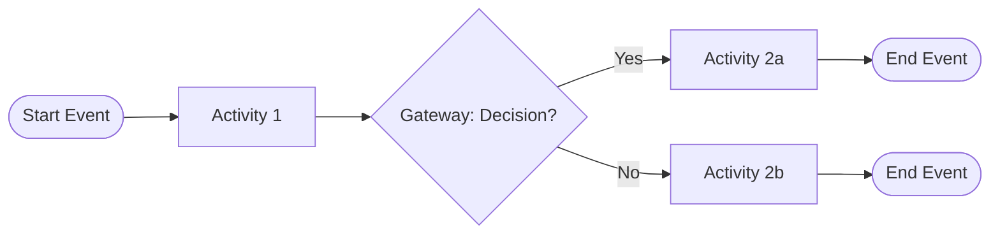
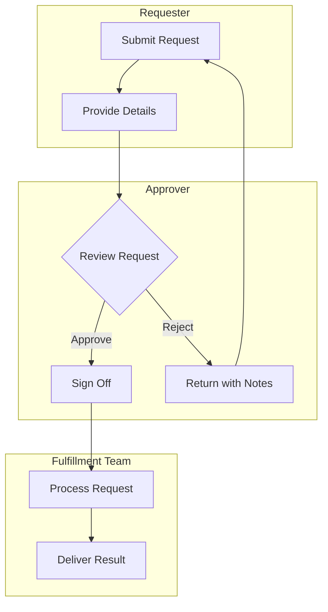
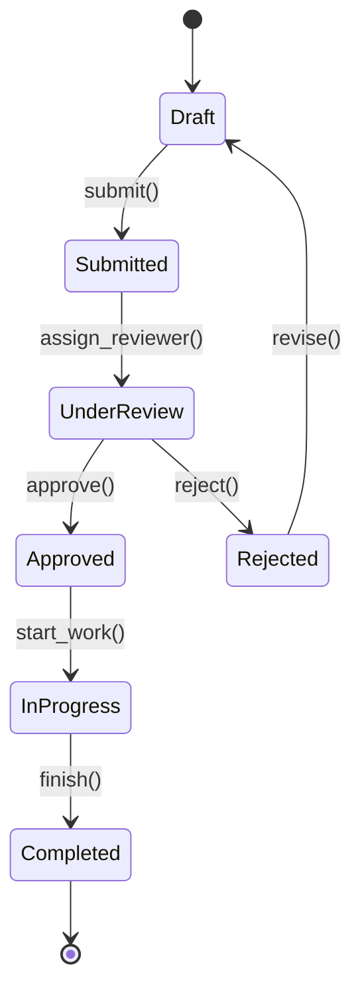

# Diagram Patterns Quick Reference

Quick-reference Mermaid patterns for the three diagram types used in PM Discovery. For comprehensive templates, see the full pattern files in `references/process-flows/`.

## 1. BPMN-Style Flowchart

Use for: Sequential process flows with decision points, start/end events, and activities.



**Key elements:**
- `([...])` -- Rounded rectangle for start/end events
- `[...]` -- Rectangle for activities
- `{...}` -- Diamond for exclusive gateways
- `-->|label|` -- Labeled flow connectors

**Current-state styling** (gray, indicates as-is):
```
style A fill:#e0e0e0,stroke:#666,color:#333
```

**Target-state styling** (blue, indicates to-be):
```
style A fill:#d4e6f1,stroke:#2980b9,color:#1a5276
```

**Pain point annotation** (red border):
```
style A fill:#fadbd8,stroke:#e74c3c,color:#922b21
```

## 2. Swimlane Diagram

Use for: Multi-actor processes showing handoffs between personas or departments.



**Key conventions:**
- One `subgraph` per persona/role
- Handoffs shown as edges crossing subgraph boundaries
- Decision points placed in the subgraph of the decision-maker
- Use `TB` (top-to-bottom) for vertical swimlanes, `LR` for horizontal

## 3. State Machine Diagram

Use for: Entity lifecycle tracking (orders, requests, cases, approvals).



**Key conventions:**
- `[*]` -- Start and end pseudo-states
- `-->` with `: action()` -- Transitions with trigger labels
- Use verb phrases for transitions (e.g., `submit()`, `approve()`)
- Guard conditions shown as `[condition]` after the action

## Diagram Selection Guide

| Scenario | Diagram Type | Why |
|----------|-------------|-----|
| "Show me the approval process" | BPMN Flowchart | Sequential steps with decision points |
| "Who does what in this process?" | Swimlane | Multi-actor responsibility mapping |
| "What states can an order be in?" | State Machine | Entity lifecycle with valid transitions |
| "Compare current vs target process" | BPMN Flowchart (x2) | Side-by-side with different styling |
| "Map the user journey" | Swimlane | User actions vs system responses |
