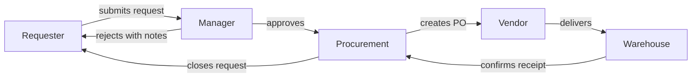

# Persona Mapping Framework

## Purpose

Persona mapping identifies and profiles the actors within a business problem. Personas are the foundation for process flows, stakeholder analysis, and downstream deliverables (PRDs and TOMs). The approach differs significantly between SaaS and Consulting contexts.

---

## Persona Identification Process

### Step 1: Enumerate Actors

List every person or role that interacts with, is affected by, or influences the process or product.

**Sources for identification:**
- Discovery interview responses (Dimension 2: Stakeholder Landscape)
- Process documentation (who is mentioned?)
- System access logs (who uses the system?)
- Organizational charts (who reports to whom?)
- Customer-facing team input (who do they interact with?)

### Step 2: Group and Deduplicate

- Merge roles that behave identically in the context of this problem
- Split roles that appear similar but have different goals, pain points, or authority levels
- Rule of thumb: 3-6 personas per initiative. More than 8 usually means over-segmentation

### Step 3: Prioritize

Rank personas by:
1. **Frequency of interaction** with the problem space
2. **Severity of impact** the problem has on them
3. **Influence over outcomes** (can they block or accelerate?)

---

## Mode A: SaaS Persona Mapping

### Focus Areas

SaaS personas emphasize user behavior, emotional experience, and journey through the product.

### User Behavior Analysis

| Behavior Dimension | What to Capture | How to Discover |
|-------------------|-----------------|-----------------|
| **Usage frequency** | Daily, weekly, monthly, seasonal | Analytics, user interviews |
| **Feature adoption** | Which features used, which ignored | Product analytics, heatmaps |
| **Workflow patterns** | Sequence of actions to complete tasks | Session recordings, contextual inquiry |
| **Workarounds** | How users compensate for product gaps | Support tickets, user interviews |
| **Drop-off points** | Where users abandon the flow | Funnel analytics, exit surveys |

### Feelings and Emotional Journey

Capture the emotional dimension at each stage of the user journey:

| Journey Stage | Positive Feelings | Negative Feelings |
|--------------|-------------------|-------------------|
| **Awareness** | Curious, hopeful | Skeptical, overwhelmed |
| **Onboarding** | Excited, empowered | Confused, frustrated |
| **Regular use** | Productive, confident | Annoyed, bored |
| **Problem encounter** | Determined | Frustrated, anxious |
| **Support interaction** | Relieved, heard | Ignored, angry |
| **Renewal/expansion** | Loyal, advocates | Evaluating alternatives |

### User Journey Map Template

```markdown
## Journey: [Persona Name] -- [Journey Name]

### Stage 1: [Stage Name]
- **Action**: What the user does
- **Touchpoint**: Where the interaction happens
- **Thinking**: What the user is thinking
- **Feeling**: Emotional state (use: delighted / satisfied / neutral / frustrated / angry)
- **Pain point**: What goes wrong or is difficult
- **Opportunity**: What could be improved

### Stage 2: [Stage Name]
...
```

### Pain Point Identification

Categorize pain points by severity and type:

| Type | Description | Example | Severity |
|------|-------------|---------|----------|
| **Blocker** | Cannot complete the task at all | "I literally cannot export my data" | Critical |
| **Friction** | Can complete but with unnecessary effort | "I have to click 7 times to do something simple" | High |
| **Confusion** | Unclear what to do next | "I don't know what this button does" | Medium |
| **Annoyance** | Minor irritation, does not block work | "The loading spinner is ugly" | Low |

---

## Mode B: Consulting Persona Mapping

### Focus Areas

Consulting personas emphasize organizational role, process responsibility, and decision authority.

### Organizational Role Mapping

| Dimension | What to Capture | How to Discover |
|-----------|-----------------|-----------------|
| **Position in hierarchy** | Reporting line, seniority level | Org chart, interviews |
| **Span of control** | Number of direct/indirect reports | HR data, org chart |
| **Process ownership** | Which processes they own or execute | Process documentation, RACI |
| **Decision authority** | What they can approve/reject | Delegation of authority matrix |
| **Cross-functional touchpoints** | Who they interact with across departments | Process flow analysis |

### RACI for Process Actors

Map each persona to their RACI role across the processes in scope:

| Process | Actor 1 | Actor 2 | Actor 3 | Actor 4 |
|---------|---------|---------|---------|---------|
| Request Intake | R | A | I | I |
| Approval | C | A | R | I |
| Fulfillment | I | I | C | R |
| Reporting | C | A | I | R |

### Spans of Control Analysis

```markdown
## [Persona: Process Owner]
- **Direct reports**: [N]
- **Processes owned**: [List]
- **Budget authority**: [Amount or "None"]
- **Geographic scope**: [Regions]
- **Systems accessed**: [List]
- **Average decisions per week**: [N]
```

---

## Persona Template (Universal)

Use this template for every persona regardless of entry mode. Mode-specific fields are marked.

```markdown
## Persona: [Role-Based Name]

### Identity
- **Role**: [Job title or functional role]
- **Organization**: [Department, team, or company segment]
- **Archetype**: [1-2 word summary: "Busy Approver", "Power User", "Reluctant Adopter"]

### Goals
- **Primary goal**: [What they are trying to accomplish]
- **Secondary goals**: [Other objectives]
- **Success metric**: [How they measure their own success]

### Pain Points
1. [Pain point 1 -- severity: Critical/High/Medium/Low]
2. [Pain point 2 -- severity: Critical/High/Medium/Low]
3. [Pain point 3 -- severity: Critical/High/Medium/Low]

### Behavior Patterns
- **Frequency**: [How often they interact with the process/product]
- **Workflow**: [Typical sequence of actions]
- **Workarounds**: [How they cope with current limitations]
- **Tools used**: [Systems, apps, manual tools]

### Feelings (Mode A: SaaS)
- **Current emotional state**: [Frustrated / Neutral / Satisfied]
- **Key frustration trigger**: [What makes them most unhappy]
- **Delight moment**: [What makes them most happy]

### Organizational Context (Mode B: Consulting)
- **Reports to**: [Role]
- **Direct reports**: [N]
- **Decision authority**: [What they can approve]
- **RACI role**: [R/A/C/I for key processes]

### Quotes (from discovery interviews)
> "[Verbatim quote that captures their perspective]"
> "[Another quote]"

### Needs Statement
**When** [situation], **I need** [capability], **so that** [outcome].
```

---

## Cross-Persona Dependency Map

After individual personas are profiled, map their interdependencies.

### How to Build

1. List all personas as nodes
2. Draw directed edges for each handoff, approval, or information flow
3. Label edges with the type of interaction (sends data, approves, escalates, consumes output)
4. Identify bottleneck personas (many incoming edges) and isolated personas (few connections)

### Mermaid Example



---

## Anti-Patterns in Persona Mapping

| Anti-Pattern | Problem | Fix |
|-------------|---------|-----|
| **Too many personas** (>8) | Dilutes focus, increases complexity | Merge similar roles, prioritize by impact |
| **Demographic-first personas** | Age/gender/location rarely drive product behavior | Focus on goals, pain points, behavior patterns |
| **Aspirational personas** | Describing ideal users, not real ones | Ground in interview data and analytics |
| **Missing negative personas** | Not identifying who the product is NOT for | Explicitly define who is out of scope |
| **Static personas** | Never updated as understanding deepens | Revisit personas after each discovery phase |
