# BPMN-Style Mermaid Flowchart Patterns

## Core BPMN Elements in Mermaid

### Start and End Events

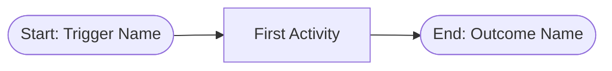

Use `([...])` for rounded rectangles representing start/end events. Always label with the trigger (start) or outcome (end).

### Activities (Tasks)

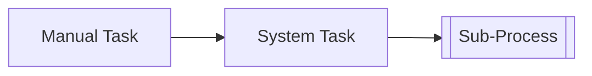

| Syntax | BPMN Element | When to Use |
|--------|-------------|-------------|
| `[Text]` | Task | Standard activity step |
| `[[Text]]` | Sub-process | Activity that expands into its own flow |
| `[/Text/]` | Manual input | User provides data |
| `[(Text)]` | Database operation | Read/write to data store |

### Gateways

#### Exclusive Gateway (XOR) -- Only one path

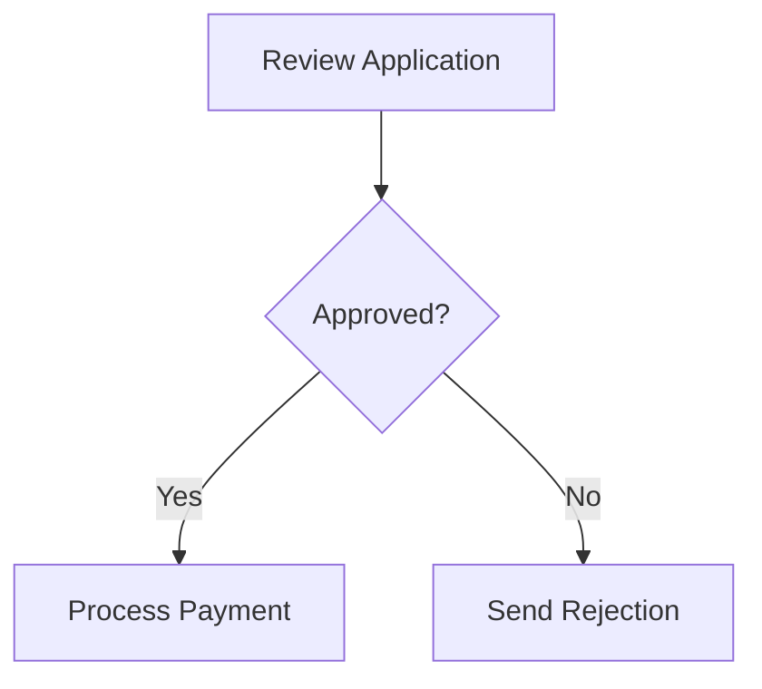

#### Parallel Gateway (AND) -- All paths execute

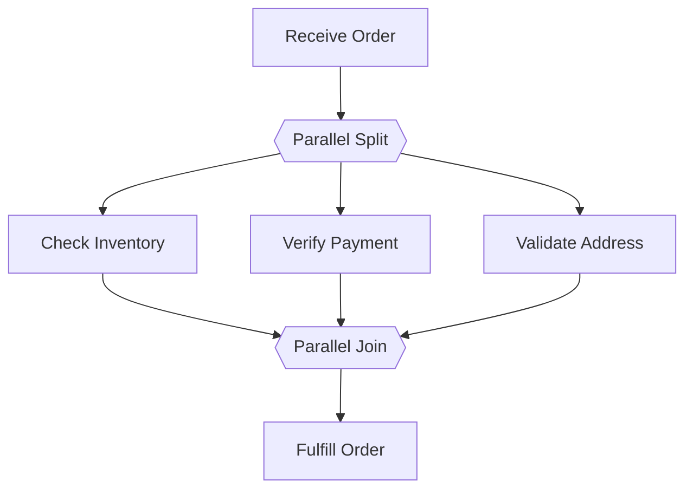

Use `{{" "}}` (hexagon) to represent parallel gateways. Label as "Parallel Split" or "Parallel Join".

#### Inclusive Gateway (OR) -- One or more paths

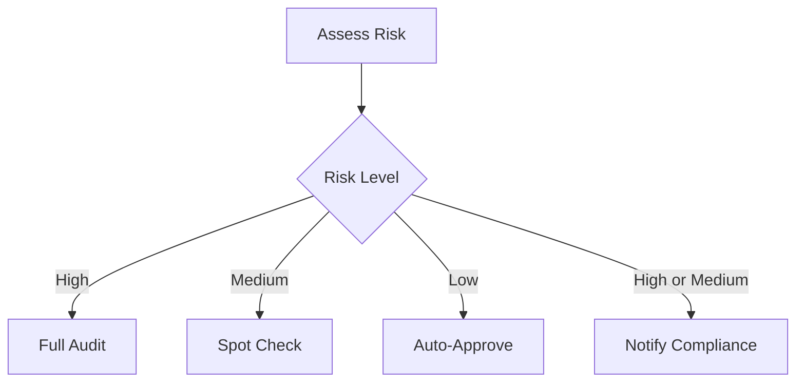

### Sub-Processes

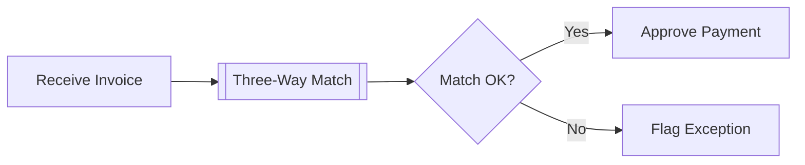

Use `[[...]]` to indicate a sub-process that has its own detailed diagram elsewhere.

---

## Common Business Process Templates

### Approval Process

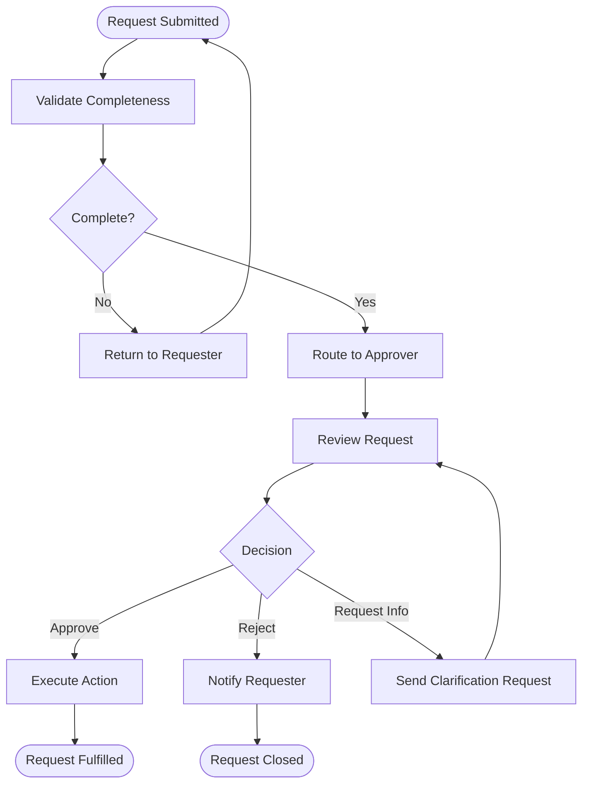

### Procurement Process (P2P)

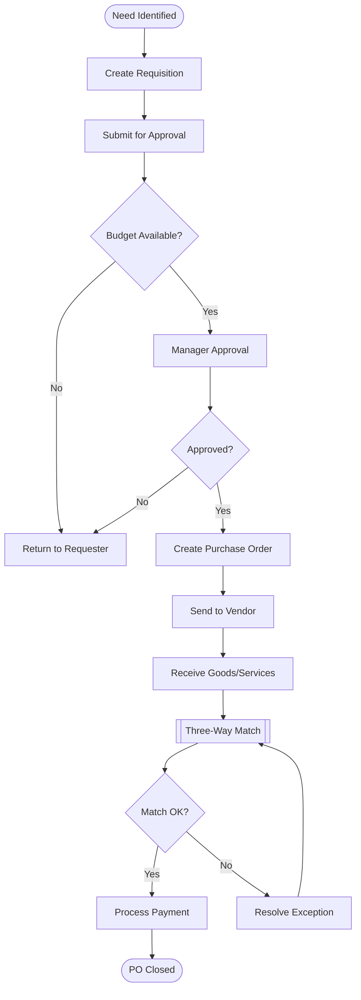

### Incident Management

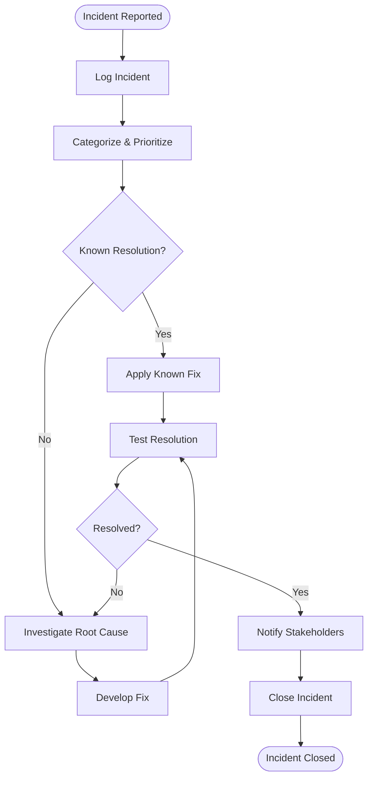

---

## Current-State vs Target-State Styling

### Current-State (As-Is) Diagram

Use gray tones and annotate pain points with red borders.

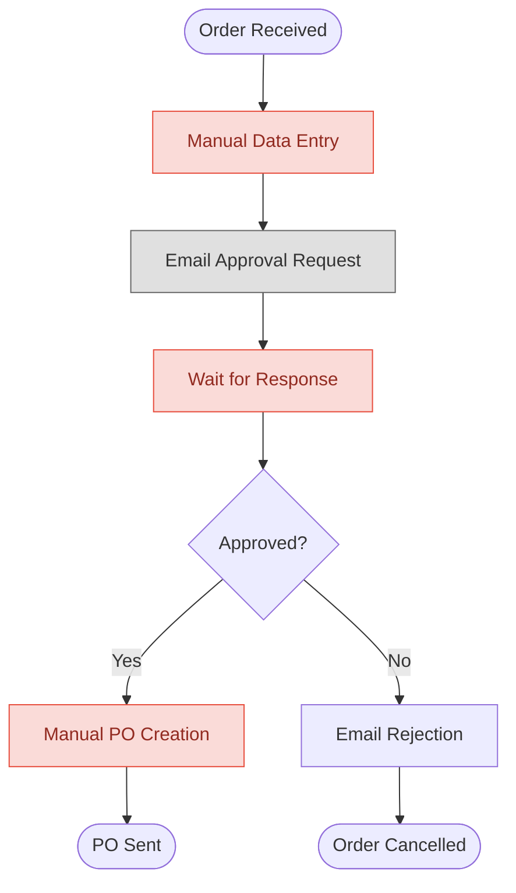

**Style conventions:**
- `fill:#e0e0e0,stroke:#666,color:#333` -- Standard current-state step (gray)
- `fill:#fadbd8,stroke:#e74c3c,color:#922b21` -- Pain point / bottleneck (red)
- Add a note below the diagram listing each pain point with its impact

### Target-State (To-Be) Diagram

Use blue tones and annotate improvements with green borders.

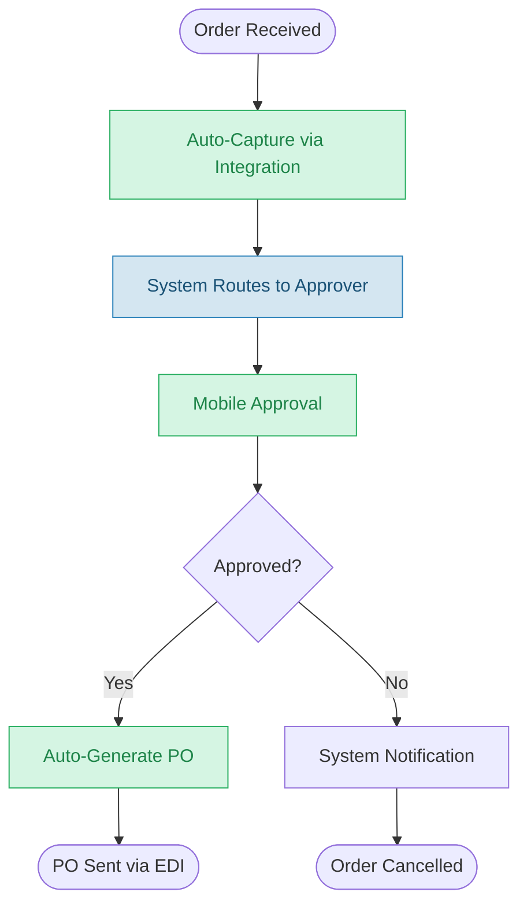

**Style conventions:**
- `fill:#d4e6f1,stroke:#2980b9,color:#1a5276` -- Standard target-state step (blue)
- `fill:#d5f5e3,stroke:#27ae60,color:#1e8449` -- Improvement / automation (green)

---

## Annotation Conventions

### Pain Point Annotation

After a current-state diagram, include a pain point register:

```markdown
**Pain Points Identified:**
1. **PP-01**: Manual data entry (Step A) -- 15 min per order, 5% error rate
2. **PP-02**: Email-based approval (Step C) -- Average 3-day wait time
3. **PP-03**: Manual PO creation (Step E) -- Duplicate entry, no audit trail
```

### Improvement Annotation

After a target-state diagram, include an improvement register:

```markdown
**Improvements:**
1. **IMP-01**: Auto-capture via API integration -- Eliminates PP-01
2. **IMP-02**: Mobile approval workflow -- Reduces PP-02 from 3 days to 2 hours
3. **IMP-03**: Auto-generated PO -- Eliminates PP-03, adds audit trail
```
