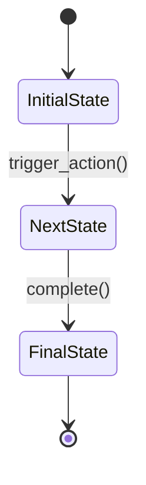
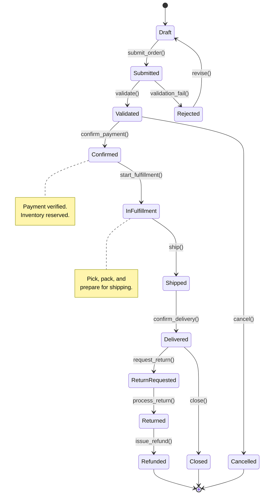
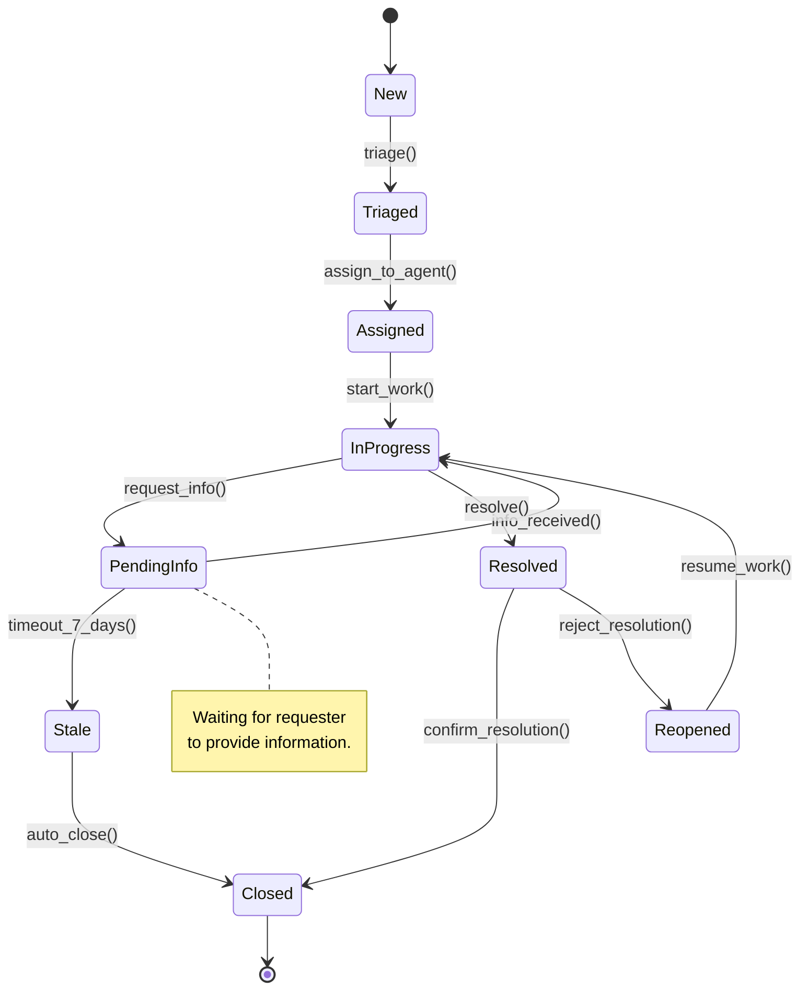
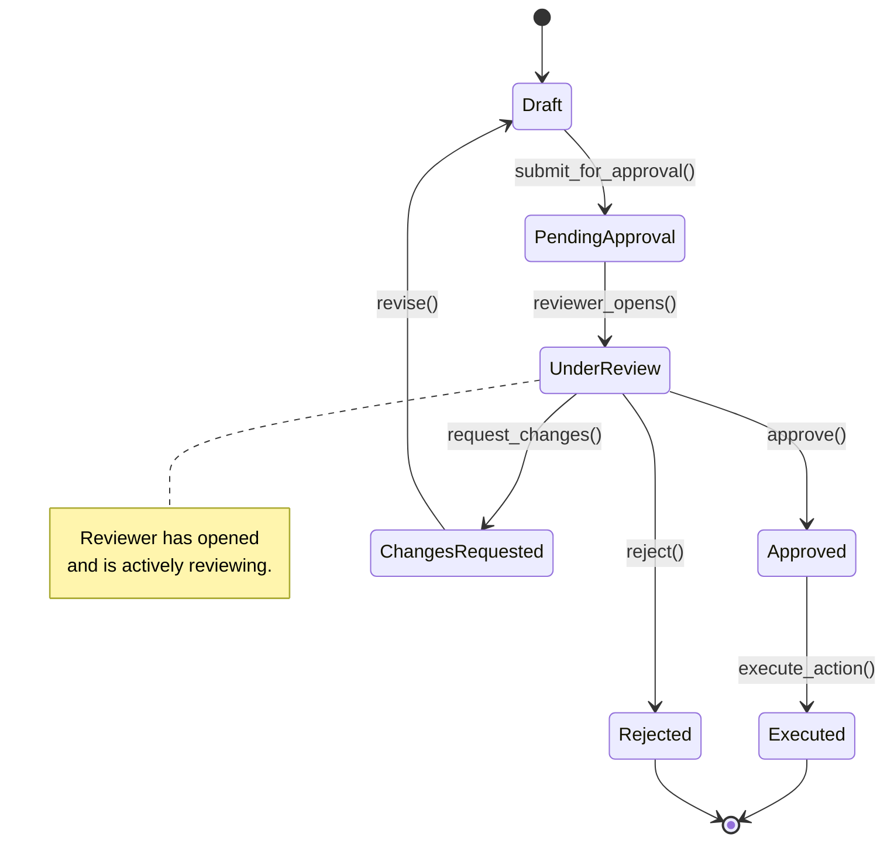
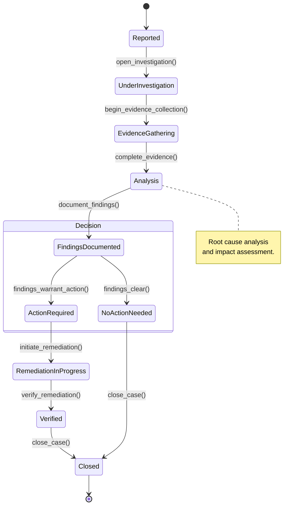
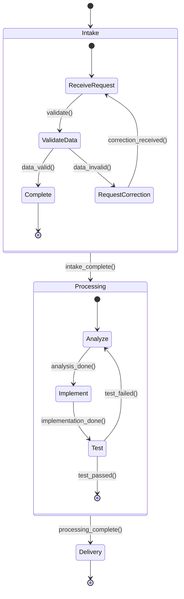
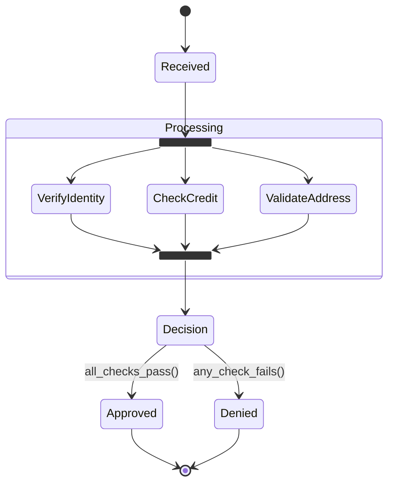

# State Machine Diagram Patterns

## Overview

State machine diagrams model the lifecycle of an entity (order, request, case, approval) by defining the valid states it can be in and the transitions between them. Use Mermaid `stateDiagram-v2` syntax.

## Core Syntax



### Key Elements

| Element | Syntax | Purpose |
|---------|--------|---------|
| Start | `[*] -->` | Entry point |
| End | `--> [*]` | Terminal state |
| State | `StateName` | Named entity state |
| Transition | `--> : action()` | State change with trigger |
| Guard | `[condition]` | Condition that must be true for transition |
| Note | `note right of State` | Annotation on a state |
| Composite | `state "Name" as alias { ... }` | Nested states within a parent state |

---

## Entity Lifecycle Templates

### Order Lifecycle



### Request / Ticket Lifecycle



### Approval Lifecycle



### Case / Investigation Lifecycle



---

## Composite (Nested) States

Use composite states when a high-level state contains sub-states.



---

## Transition Patterns

### Guard Conditions

Guards restrict when a transition can fire.

```
StateA --> StateB : action() [guard_condition]
```

Example:
```
PendingApproval --> AutoApproved : submit() [amount < 1000]
PendingApproval --> ManagerReview : submit() [amount >= 1000]
```

### Timeout Transitions

Model time-based state changes for SLA enforcement.

```
Waiting --> Escalated : timeout_24h()
Escalated --> Critical : timeout_48h()
```

### Parallel States (Fork/Join)

Model concurrent sub-processes within a state.



---

## Styling Conventions

### Current-State Entity Lifecycle
- Use plain state names (no special styling needed)
- Annotate problematic transitions with notes explaining the pain point

### Target-State Entity Lifecycle
- Add new states that represent automation or improvement
- Use notes to highlight what changed from current state

### Annotation Pattern

After the diagram, include a state transition register:

```markdown
**State Transition Register:**

| From | To | Trigger | Actor | SLA | Notes |
|------|----|---------|-------|-----|-------|
| Draft | Submitted | submit_order() | Requester | N/A | Requires all mandatory fields |
| Submitted | Validated | validate() | System | 5 min | Automated validation rules |
| Validated | Confirmed | confirm_payment() | Payment Gateway | 30 sec | Real-time payment verification |
```

---

## Common Anti-Patterns

| Anti-Pattern | Problem | Fix |
|-------------|---------|-----|
| **Missing terminal states** | Entity can never reach completion | Ensure every path leads to `[*]` |
| **Orphan states** | State with no incoming transition | Remove or connect to the flow |
| **Ambiguous transitions** | Same trigger from same state to different targets without guards | Add guard conditions |
| **Too many states** | Diagram becomes unreadable (>15 states) | Use composite states to group related states |
| **No error/exception states** | Only models the happy path | Add Rejected, Failed, Cancelled, Escalated states |
