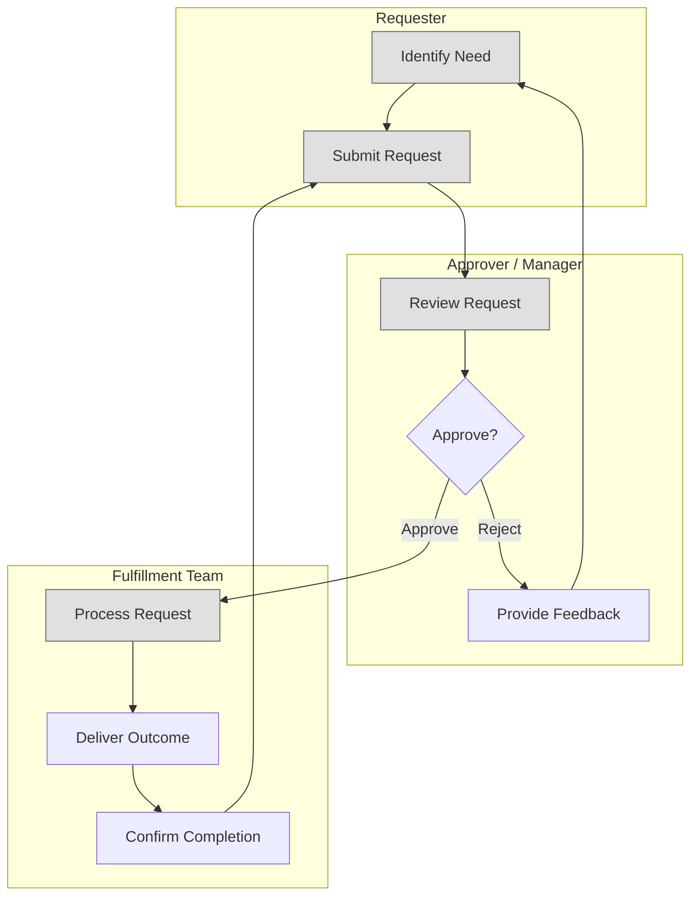
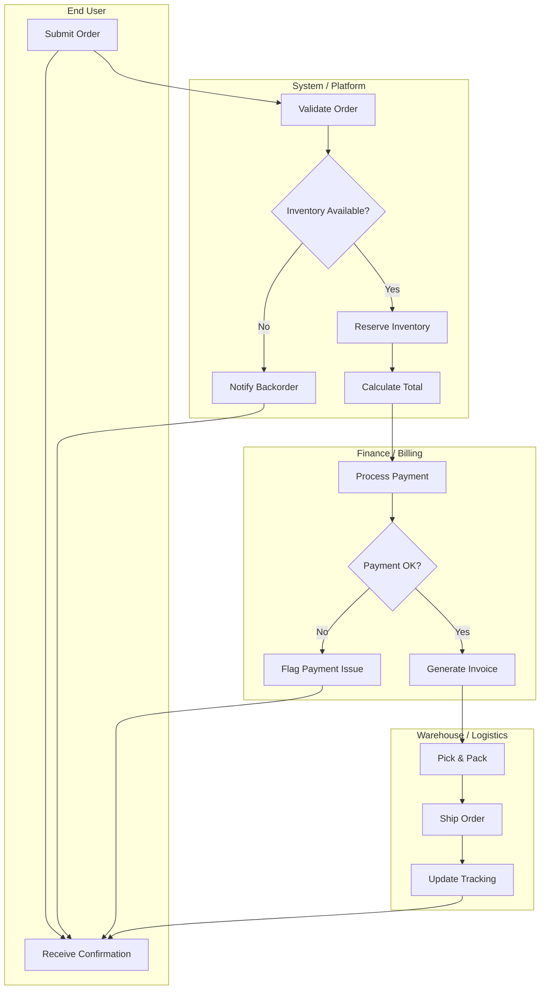
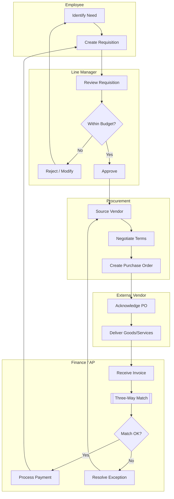
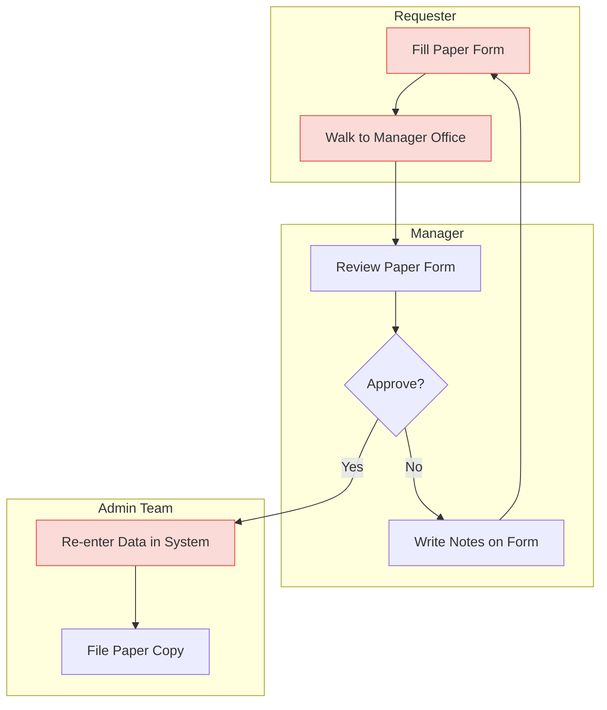
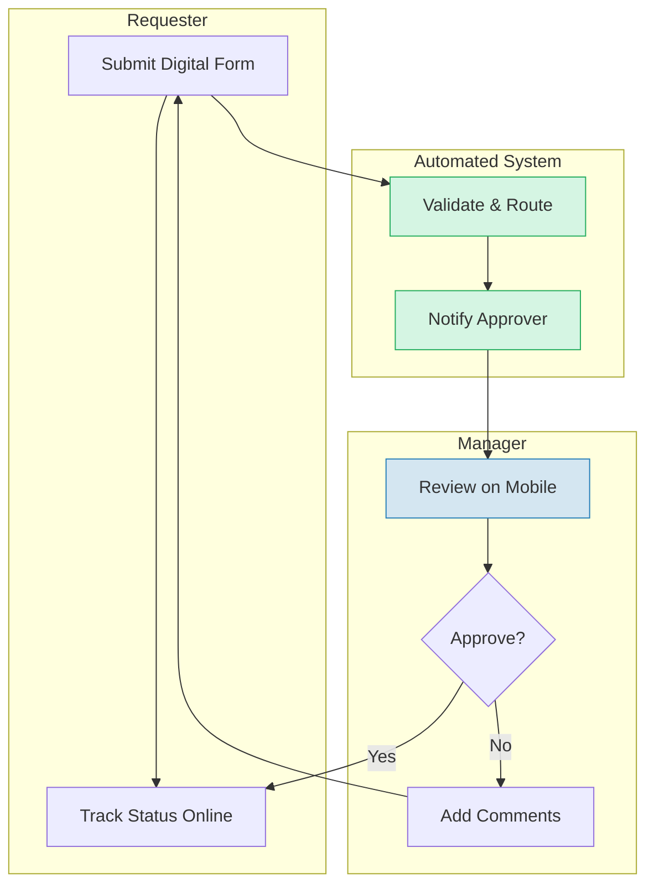
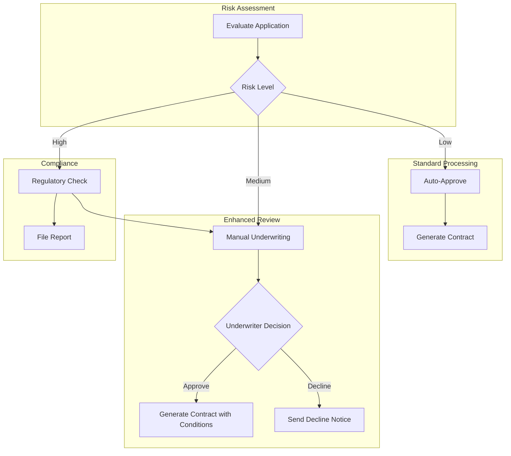

# Swimlane Diagram Patterns

## Overview

Swimlane diagrams show multi-actor processes with clear responsibility boundaries. In Mermaid, swimlanes are built using `subgraph` blocks. Each subgraph represents one persona or organizational role.

## Core Conventions

- **One subgraph per persona/role**: Never mix actors in a single lane
- **Handoffs are cross-lane edges**: Arrows crossing subgraph boundaries represent handoffs
- **Decision points in the decision-maker's lane**: Place the gateway in the subgraph of the person who makes the decision
- **Direction**: Use `TB` (top-to-bottom) for vertical layouts, `LR` (left-to-right) for horizontal
- **Subgraph naming**: Use the persona role name as both ID and label

---

## 3-Lane Process Template

Use for simple processes with a requester, approver, and executor.

### Handoff Points
- **Requester -> Approver**: Request submission (B -> C)
- **Approver -> Executor**: Approval (D -> F)
- **Approver -> Requester**: Rejection with feedback (E -> A)
- **Executor -> Requester**: Completion confirmation (H -> B)

---

## 4-Lane Process Template

Use for processes involving a requester, system, approver, and external party.

---

## 5-Lane Process Template

Use for complex enterprise processes with multiple organizational roles.

---

## Swimlane Styling for Current vs Target State

### Current-State Swimlane

Add pain point styling to bottleneck steps and annotate handoff delays.

### Target-State Swimlane

Highlight automated steps and eliminated handoffs.

---

## Cross-Lane Decision Impact

When a decision in one lane affects multiple other lanes, show the branching edges clearly.

---

## Tips for Effective Swimlane Diagrams

1. **Limit to 5 lanes maximum**: More than 5 becomes unreadable. Group minor roles.
2. **Order lanes by process flow**: Top lane starts the process, bottom lane finishes.
3. **Minimize cross-lane edges**: Too many crossing arrows create visual clutter. Redesign the lane order to reduce crossings.
4. **Label every cross-lane edge**: What is being handed off? Data, approval, physical goods?
5. **Highlight the critical path**: Use bold edges or color for the primary happy-path flow.
6. **Annotate wait times**: Add notes on edges where delays typically occur (e.g., `-->|avg 3 days|`).
