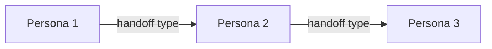
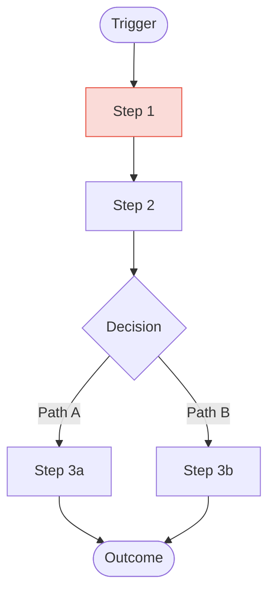
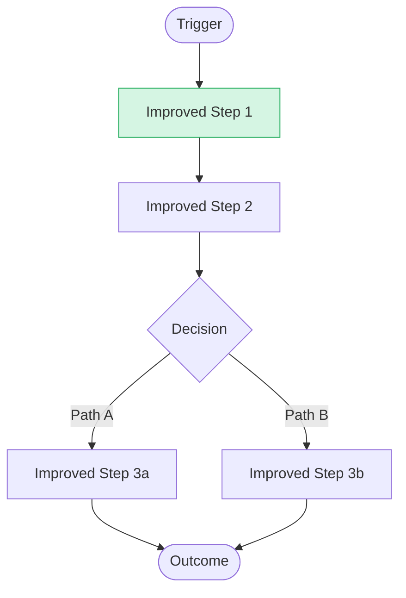
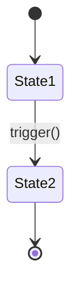

# Business Understanding Document Template

Use this template to assemble the final discovery deliverable. Fill every section with findings from Phases 1-6. Remove placeholder instructions before delivering to stakeholders.

---

```markdown
# Business Understanding Document

**Initiative**: [Initiative Name]
**Date**: [YYYY-MM-DD]
**Author**: [PM Name / Role]
**Version**: [1.0]
**Status**: [Draft | Review | Approved]
**Entry Mode**: [Mode A: SaaS PM | Mode B: Consulting PM]

---

## 1. Executive Summary

[2-3 paragraphs summarizing the business problem, who is affected, what the initiative aims to achieve, and the recommended approach. Write this last after all other sections are complete.]

**Initiative Classification**: [Product Development | Process Improvement | Process Automation | AI/Agent-Based Automation]

**Recommended Handoff**: [pm-prd-generator | tom-architect]

---

## 2. Problem Statement

### Problem
[One sentence describing the core problem. Must describe the problem, not a solution.]

### Impact
[Quantified impact: revenue loss, cost, time waste, error rates, customer churn, employee satisfaction]

| Metric | Current Value | Desired Value | Gap |
|--------|--------------|---------------|-----|
| [Metric 1] | [Baseline] | [Target] | [Delta] |
| [Metric 2] | [Baseline] | [Target] | [Delta] |

### Root Cause Analysis
[Summary of root cause investigation. Reference the technique used: Five Whys, Fishbone, JTBD.]

### Scope Boundary
- **In scope**: [Explicit list]
- **Out of scope**: [Explicit list]
- **Deferred to future phase**: [Items acknowledged but not addressed now]

---

## 3. Actor Personas

### Persona 1: [Role-Based Name]

**Archetype**: [1-2 word summary]
**Organization**: [Department / Team / External]

| Dimension | Detail |
|-----------|--------|
| **Primary goal** | [What they are trying to accomplish] |
| **Pain points** | [Top 3 pain points with severity ratings] |
| **Behavior pattern** | [How they interact with the process/product] |
| **Feelings** | [Emotional state -- Mode A only] |
| **Decision authority** | [What they can approve -- Mode B only] |
| **RACI role** | [R/A/C/I for key processes -- Mode B only] |
| **Tools used** | [Systems and manual tools] |

**Needs statement**: When [situation], I need [capability], so that [outcome].

> "[Verbatim quote from discovery interview]"

### Persona 2: [Role-Based Name]
[Repeat the same structure for each persona. Typically 3-6 personas.]

### Persona Dependency Map

[Mermaid diagram showing handoffs and information flows between personas]



---

## 4. Initiative Classification

**Primary type**: [Product Development | Process Improvement | Process Automation | AI/Agent-Based Automation]

**Secondary characteristics**: [If hybrid, note secondary type]

**Classification rationale**:
[2-3 sentences explaining why this classification was chosen. Reference evidence from discovery.]

**Downstream implications**:
- [How classification affects the handoff skill]
- [What deliverable patterns to expect]
- [What additional analysis the downstream skill will need]

---

## 5. Current State

### Process Inventory

| ID | Process Name | Owner | Frequency | Pain Points | Systems |
|----|-------------|-------|-----------|-------------|---------|
| [ID] | [Name] | [Role] | [Daily/Weekly/etc] | [PP-01, PP-02] | [System list] |

### Current-State Process Flow

[Mermaid BPMN or swimlane diagram showing the as-is process. Use gray styling for standard steps and red styling for pain points.]



### Pain Point Register

| ID | Description | Location | Impact | Severity |
|----|------------|----------|--------|----------|
| PP-01 | [Description] | [Process step] | [Quantified impact] | Critical / High / Medium / Low |
| PP-02 | [Description] | [Process step] | [Quantified impact] | Critical / High / Medium / Low |

---

## 6. Target State

### Target-State Process Flow

[Mermaid BPMN or swimlane diagram showing the to-be process. Use blue styling for standard steps and green styling for improvements.]



### Improvement Register

| ID | Description | Eliminates Pain Point | Expected Benefit |
|----|------------|----------------------|-----------------|
| IMP-01 | [Description] | PP-01 | [Quantified benefit] |
| IMP-02 | [Description] | PP-02 | [Quantified benefit] |

### Entity Lifecycle (if applicable)

[Mermaid state diagram for the primary entity affected by this initiative]



---

## 7. Constraints & Dependencies

### Constraints

| Type | Description | Impact on Solution |
|------|------------|-------------------|
| **Budget** | [Amount or range] | [What this enables or limits] |
| **Timeline** | [Hard or soft deadline] | [What must be delivered by when] |
| **Technical** | [Platform, integration, etc.] | [Technology decisions forced] |
| **Organizational** | [Capacity, skills, culture] | [Change management needs] |
| **Regulatory** | [Compliance requirements] | [Non-negotiable constraints] |

### Dependencies

| Dependency | Type | Owner | Status | Risk if Delayed |
|-----------|------|-------|--------|----------------|
| [Dependency 1] | [Technical / Organizational / Data / External] | [Who] | [Green / Amber / Red] | [Impact] |

---

## 8. Success Criteria

### Quantitative Metrics

| KPI | Baseline | Target | Measurement Method | Frequency |
|-----|----------|--------|-------------------|-----------|
| [KPI 1] | [Current] | [Goal] | [How to measure] | [Weekly / Monthly / Quarterly] |

### Qualitative Goals

| Goal | How to Assess | Evidence |
|------|--------------|----------|
| [Goal 1] | [Assessment method] | [What constitutes evidence] |

### Acceptance Criteria

- [ ] [Criterion 1 -- must be true for stakeholder signoff]
- [ ] [Criterion 2]
- [ ] [Criterion 3]

---

## 9. Assumptions & Risks

### Assumptions

| # | Assumption | Impact if Wrong | Validation Plan |
|---|-----------|----------------|----------------|
| A1 | [Assumption] | [What breaks] | [How to validate] |

### Risks

| # | Risk | Likelihood | Impact | Mitigation |
|---|------|-----------|--------|------------|
| R1 | [Risk] | High / Medium / Low | High / Medium / Low | [Mitigation action] |

---

## 10. Recommended Epics

High-level epic decomposition based on discovery findings. Detail will be expanded by the downstream skill.

| # | Epic Name | Description | Priority | Estimated Complexity |
|---|-----------|-------------|----------|---------------------|
| E1 | [Name] | [1-2 sentence description] | Must / Should / Could | S / M / L / XL |
| E2 | [Name] | [1-2 sentence description] | Must / Should / Could | S / M / L / XL |

---

## 11. Appendix

### A. Stakeholder Register

[Reference to stakeholder register -- see stakeholder-analysis.md template]

### B. Discovery Interview Log

| Date | Stakeholder | Key Findings | Follow-Up Needed |
|------|-----------|--------------|-----------------|
| [Date] | [Role] | [Summary] | [Yes/No -- what] |

### C. Related Documents

| Document | Location | Relevance |
|----------|----------|-----------|
| [Document name] | [Link or path] | [How it relates] |

### D. Glossary

| Term | Definition |
|------|-----------|
| [Term] | [Definition] |
```

---

## Template Usage Notes

1. **Mode A (SaaS)**: Emphasize sections 3 (personas with feelings/journeys), 5 (user flows), and 10 (feature epics). De-emphasize RACI and organizational context.
2. **Mode B (Consulting)**: Emphasize sections 3 (personas with RACI/authority), 5/6 (process flows), and 7 (dependencies). Include organizational structure detail.
3. **Mermaid diagrams**: Always validate syntax before including. Use the styling conventions from diagram-patterns.md.
4. **Length**: Aim for 8-15 pages. Executive summary should stand alone.
5. **Living document**: Mark as "Draft" until stakeholder signoff. Version increment on significant changes.
