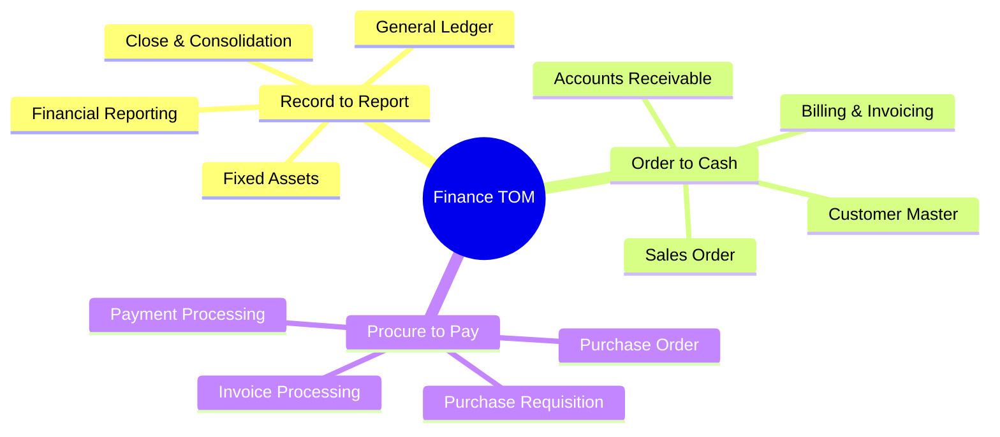
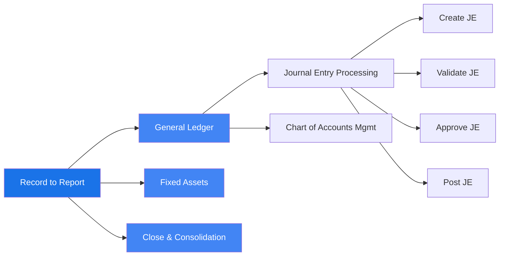
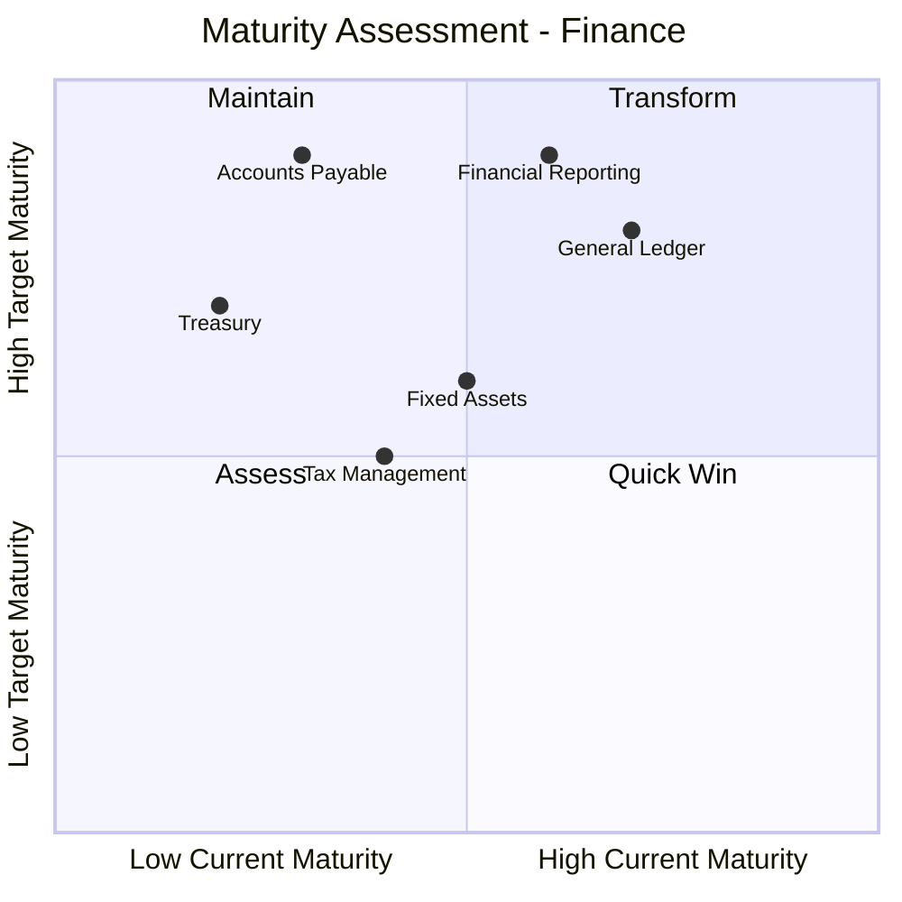
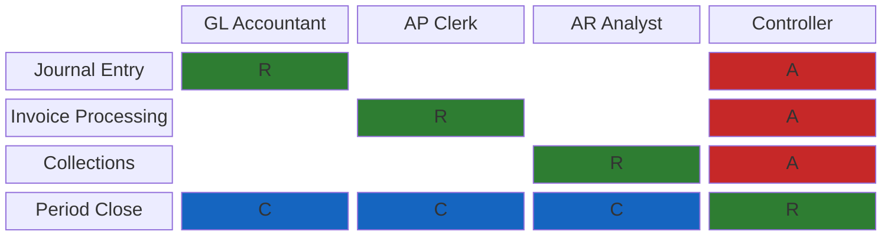
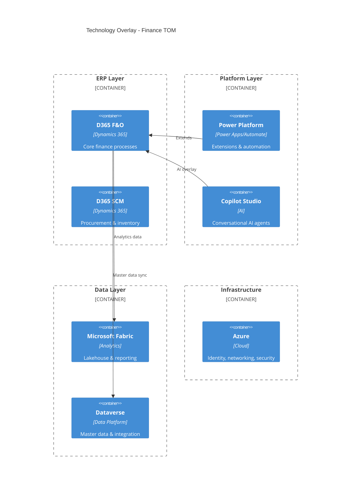

# Diagram Patterns — Quick Reference

Copy-paste-ready Mermaid diagram templates for TOM visualization. For full examples with filled-in data, see `templates/tom-diagram-templates.md`.

---

## 1. Capability Map (Mindmap — L1 to L2 Hierarchy)

**Use when**: Presenting the high-level process landscape for a domain.

**Customization**: Replace root label, L1 branches, and L2 leaves per domain.

---

## 2. Process Taxonomy (Flowchart — L1 to L4)

**Use when**: Showing the decomposition of a single L1 process into its hierarchy.

**Customization**: Expand or collapse levels as needed. Color-code by automation status at L4.

---

## 3. Maturity Assessment (Quadrant Chart — Current vs Target)

**Use when**: Visualizing the gap between current and target maturity across process areas.

**Customization**: Plot each L2 process as a point. X = current maturity (0-1 scale mapped from 1-5), Y = target maturity.

---

## 4. Role-Process Matrix (Block Diagram)

**Use when**: Showing which roles are responsible for which processes.

**Legend**: R = Responsible (green), A = Accountable (red), C = Consulted (blue). Adapt roles and processes per domain.

---

## 5. Technology Overlay (C4-Style Container Diagram)

**Use when**: Showing the technology platform landscape supporting the TOM.

**Customization**: Add or remove containers based on the client's technology landscape. Add integration arrows as needed.
