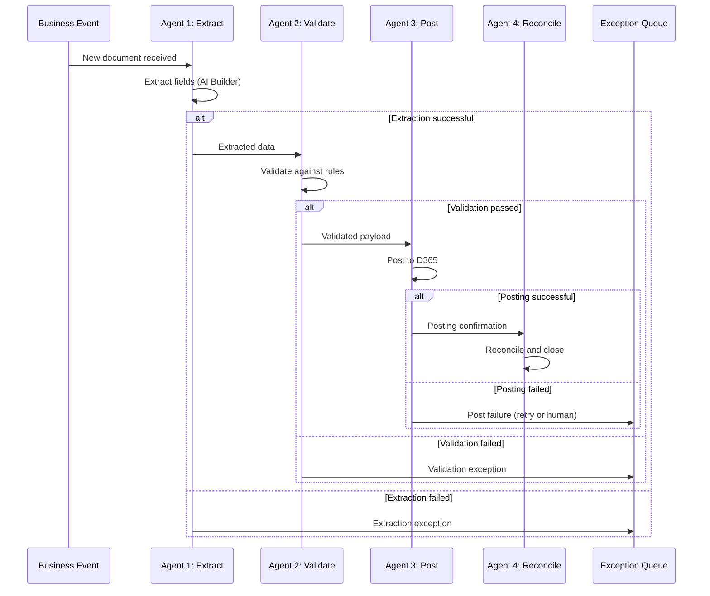
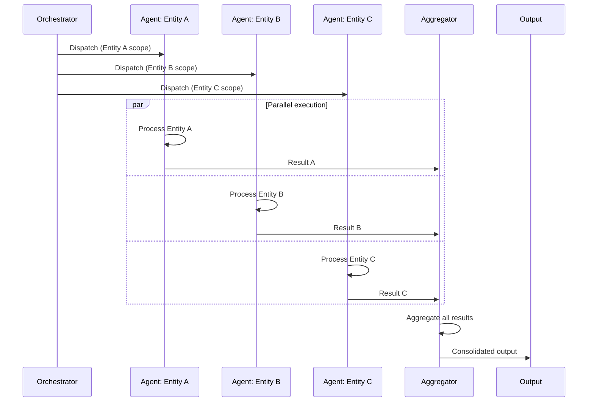
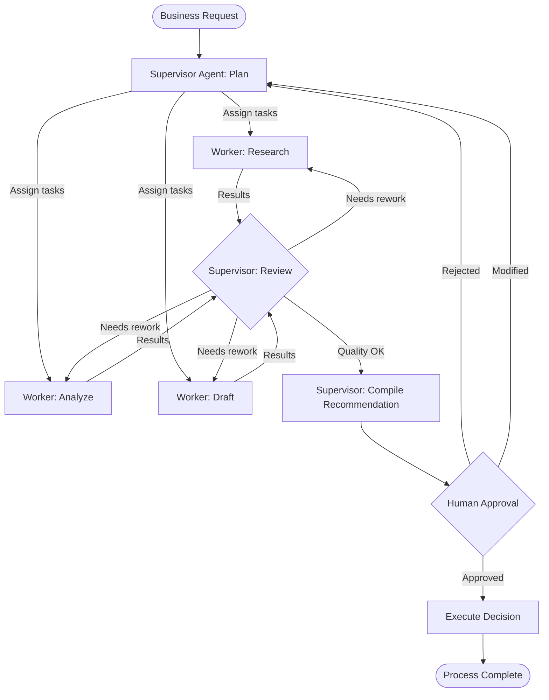
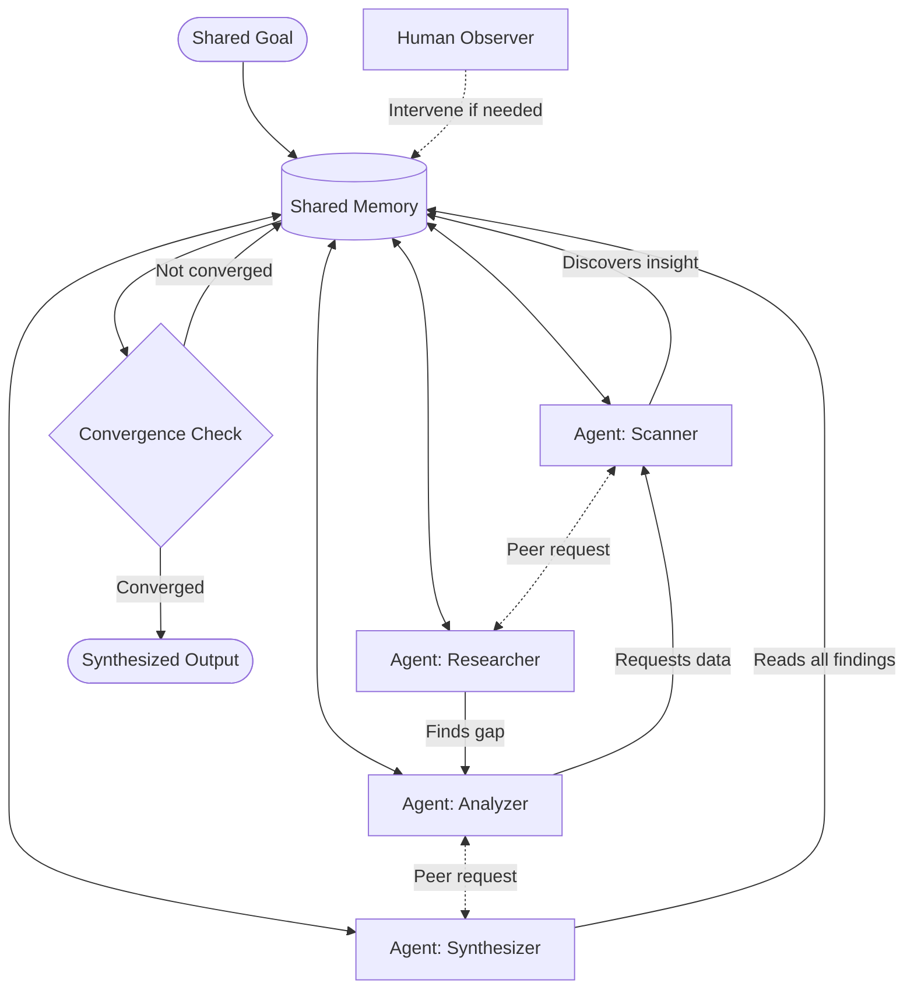

# Agent Orchestration — Multi-Agent Architecture Patterns for TOM Processes

## Overview

Defines four multi-agent orchestration patterns for automating TOM processes. Each pattern includes: when to use it, the Microsoft technology stack, implementation complexity, example TOM processes, and a Mermaid diagram template.

---

## Pattern 1: Sequential Pipeline

### Description

Agents execute in strict order. Each agent completes its task and passes the result to the next. The pipeline is linear with no branching (except error handling).

### When to Use

- Straight-through processing with well-defined stages
- Each stage transforms or enriches the output of the previous stage
- Order of operations matters and cannot be parallelized
- Low branching complexity

### Microsoft Technology

| Component | Technology | Role |
|---|---|---|
| Orchestrator | Power Automate (cloud flow) or Copilot Studio | Manages pipeline sequence and error handling |
| Agent runtime | Copilot Studio (autonomous agents) or Azure Functions | Each agent runs as a step in the pipeline |
| State storage | Dataverse or Azure Cosmos DB | Persist intermediate results between agents |
| Monitoring | Power BI + Application Insights | Pipeline throughput, stage latency, error rates |

### Implementation Complexity

**Low-Medium** — Well-understood pattern; each agent has clear input/output contract.

### Example TOM Processes

| Process | Agent 1 | Agent 2 | Agent 3 | Agent 4 |
|---|---|---|---|---|
| Invoice processing | Extract (AI Builder: OCR, field extraction) | Validate (match PO, receipt, tolerances) | Post (create vendor invoice in D365 F&O) | Reconcile (confirm GL posting, update status) |
| Employee onboarding | Provision (create accounts in Entra ID, D365 HR) | Equip (request laptop, badge via ServiceNow) | Orient (schedule training, assign Viva Learning) | Verify (confirm all tasks complete, notify manager) |
| Journal posting | Prepare (gather sub-ledger data, calculate amounts) | Validate (check balancing, dimension rules, duplicates) | Post (submit journal to D365 GL) | Confirm (verify posting status, trigger downstream) |

### Mermaid Sequence Diagram Template

---

## Pattern 2: Parallel Fan-Out

### Description

An orchestrator dispatches multiple agents simultaneously to work on independent sub-tasks. Results are aggregated when all agents complete (fan-in). Optional: partial results accepted if some agents fail.

### When to Use

- Same operation must be performed across multiple entities (legal entities, cost centers, regions)
- Independent sub-tasks with no cross-dependencies
- Time-critical processes that benefit from parallelism
- Aggregation of results from multiple sources

### Microsoft Technology

| Component | Technology | Role |
|---|---|---|
| Orchestrator | Azure Durable Functions (fan-out/fan-in) or Power Automate (parallel branches) | Dispatch and aggregate agents |
| Agent runtime | Azure Functions or Copilot Studio agents | Each agent handles one entity/partition |
| Queue | Azure Service Bus (topics with subscriptions) | Distribute work items; collect results |
| Aggregation | Azure Functions or Fabric Spark | Combine results from all agents |
| Monitoring | Application Insights + Power BI | Per-agent status, overall completion, SLA tracking |

### Implementation Complexity

**Medium** — Requires careful handling of partial failures, timeouts, and result aggregation.

### Example TOM Processes

| Process | Orchestrator Action | Parallel Agents | Aggregation |
|---|---|---|---|
| Multi-entity period close | Dispatch close tasks per legal entity | Agent per entity: run close checklist, post adjustments, validate balances | Consolidation agent: aggregate trial balances, run eliminations |
| Parallel data validation | Split dataset by region/entity | Agent per partition: validate data quality, flag exceptions | Summary agent: compile validation report, calculate quality score |
| Multi-source enrichment | Fan-out data enrichment requests | Agent per source: credit bureau, news, financials, compliance | Merge agent: combine enrichment data into unified profile |
| Global inventory snapshot | Request inventory position per warehouse | Agent per warehouse: query D365 WMS, calculate ATP | Rollup agent: global inventory position dashboard |

### Mermaid Sequence Diagram Template

---

## Pattern 3: Supervisor

### Description

A supervisor agent plans the work, delegates to specialized worker agents, reviews their outputs, and decides whether to approve, request rework, or escalate to a human. The supervisor maintains the overall plan and tracks progress.

### When to Use

- Complex decisions requiring multiple perspectives or expertise areas
- Quality review is critical before final action
- Different worker agents have different specialized capabilities
- Human approval gate is required at the end
- Iterative refinement may be needed (supervisor sends work back)

### Microsoft Technology

| Component | Technology | Role |
|---|---|---|
| Supervisor agent | Copilot Studio (with Semantic Kernel orchestration) or Azure AI Foundry | Plans, delegates, reviews, decides |
| Worker agents | Copilot Studio agents or Azure Functions | Specialized task execution (research, analysis, drafting) |
| Shared context | Dataverse or Azure Cosmos DB | Shared memory for supervisor and workers |
| Human approval | Power Automate (adaptive cards in Teams) | Final human approval gate |
| Monitoring | Application Insights + Power BI | Agent conversation tracking, review cycles, approval rates |

### Implementation Complexity

**High** — Requires sophisticated planning logic in supervisor; robust error handling; human escalation paths.

### Example TOM Processes

| Process | Supervisor | Worker Agents | Human Gate |
|---|---|---|---|
| Contract review & negotiation | Contract review supervisor (plans review scope) | Legal clause analyzer, financial terms validator, compliance checker, risk assessor | Procurement manager approves final terms |
| Risk assessment | Risk assessment coordinator | Credit risk agent, market risk agent, operational risk agent, regulatory risk agent | Risk committee reviews composite risk score |
| Budget planning | Budget planning coordinator | Revenue forecaster, cost modeler, headcount planner, capital expenditure analyst | CFO approves final budget |
| Vendor evaluation | Sourcing coordinator | Financial health analyzer, quality auditor, delivery performance scorer, compliance verifier | Category manager selects vendor |

### Mermaid Flowchart Template

---

## Pattern 4: Swarm

### Description

Peer agents collaborate without a central orchestrator. Each agent has autonomy to act, request help from peers, and contribute to a shared context (memory). Agents discover and recruit other agents as needed. Coordination emerges from shared goals and context rather than central control.

### When to Use

- Research and analysis tasks where the scope is not fully known upfront
- Exploratory processes where agents need to dynamically adapt
- Tasks requiring diverse expertise that cannot be pre-planned
- Creative or investigative processes
- High tolerance for non-deterministic outcomes

### Microsoft Technology

| Component | Technology | Role |
|---|---|---|
| Agent framework | Semantic Kernel (agent collaboration) or AutoGen | Peer-to-peer agent communication, handoff |
| Agent runtime | Azure Container Apps or AKS | Scalable agent hosting |
| Shared memory | Azure Cosmos DB or Redis | Shared context store for all agents |
| Communication | Azure Service Bus (topics) or Event Grid | Agent-to-agent messaging |
| Human interface | Copilot Studio or Teams bot | Human can observe and intervene |
| Monitoring | Application Insights + custom telemetry | Agent interaction graph, convergence tracking |

### Implementation Complexity

**Very High** — Requires careful design of agent boundaries, communication protocols, convergence criteria, and cost controls (agents can generate unbounded work).

### Example TOM Processes

| Process | Swarm Agents | Shared Context | Convergence Criteria |
|---|---|---|---|
| Competitive intelligence | Market scanner, patent analyzer, financial analyst, news monitor, social sentiment tracker | Competitive intelligence knowledge base | Report confidence threshold met; all key competitors covered |
| Regulatory monitoring | Regulatory feed scanner, impact assessor, gap analyzer, remediation planner | Regulatory change log with impact assessments | All applicable regulatory changes assessed and remediation planned |
| M&A due diligence | Financial analyst, legal reviewer, operational assessor, cultural evaluator, synergy modeler | Due diligence findings repository | All diligence workstreams complete; risk matrix populated |
| Innovation scouting | Technology radar scanner, startup tracker, patent analyzer, internal capability mapper | Innovation opportunity register | Opportunity pipeline populated with scored candidates |

### Mermaid Flowchart Template

---

## Pattern Selection Guide

| Factor | Sequential Pipeline | Parallel Fan-Out | Supervisor | Swarm |
|---|---|---|---|---|
| **Process structure** | Linear, well-defined stages | Same task across partitions | Complex, multi-perspective | Exploratory, emergent |
| **Predictability** | High | High | Medium | Low |
| **Implementation effort** | Low-Medium | Medium | High | Very High |
| **Error handling** | Simple (retry or exception queue) | Partial failure tolerance | Supervisor rework loop | Agent self-correction |
| **Human involvement** | Exception-only | Exception-only | Approval gate | Observer/intervener |
| **Cost predictability** | High (fixed pipeline) | Medium (scales with partitions) | Medium (rework cycles vary) | Low (unbounded agent activity) |
| **Best for TOM layer** | Layer 1 (Process automation) | Layer 5 (Data processing) | Layer 6 (Governance, risk) | Research, strategy |

---

## Implementation Guidelines

### Agent Design Principles

1. **Single responsibility**: Each agent should do one thing well
2. **Clear contract**: Define input schema, output schema, and error types for every agent
3. **Idempotent execution**: Agents should be safely re-runnable without side effects
4. **Observable**: Every agent emits structured telemetry (start, progress, complete, error)
5. **Bounded execution**: Set timeouts and token limits to prevent runaway costs
6. **Graceful degradation**: Agent failure should not crash the orchestration; route to exception handling

### Cost Control

| Control | Implementation |
|---|---|
| Token budgets | Set max tokens per agent per invocation |
| Execution timeouts | Azure Functions timeout; Durable Functions activity timeout |
| Circuit breakers | Stop invoking agent after N consecutive failures |
| Cost alerts | Azure Cost Management alerts per agent resource group |
| Concurrency limits | Service Bus max concurrent consumers; Durable Functions throttling |

### Testing Strategy

| Test Type | Approach |
|---|---|
| Unit test | Test each agent in isolation with mocked inputs |
| Integration test | Test agent pairs (producer-consumer) with real connectors |
| End-to-end test | Run full orchestration with synthetic data in non-prod |
| Chaos test | Inject agent failures, timeouts, bad data to validate error handling |
| Load test | Simulate production volumes to validate throughput and cost |
| Evaluation | Use Azure AI Foundry evaluation for LLM-based agents (groundedness, relevance, coherence) |
