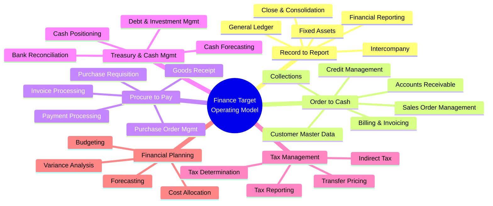
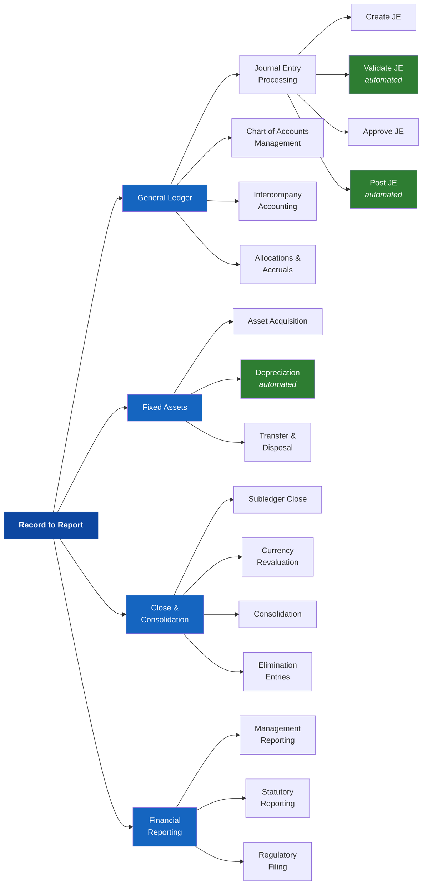
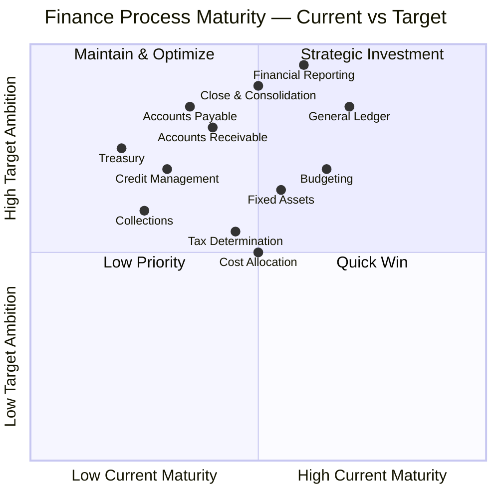
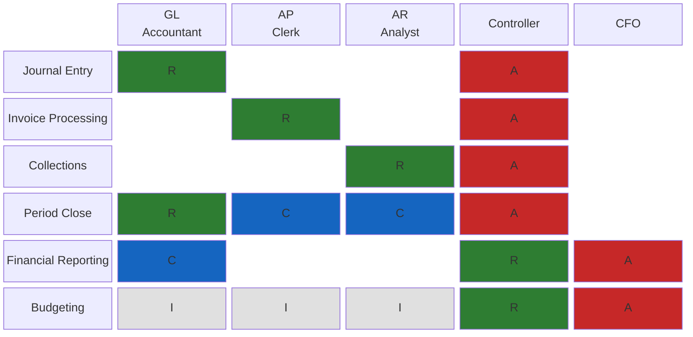
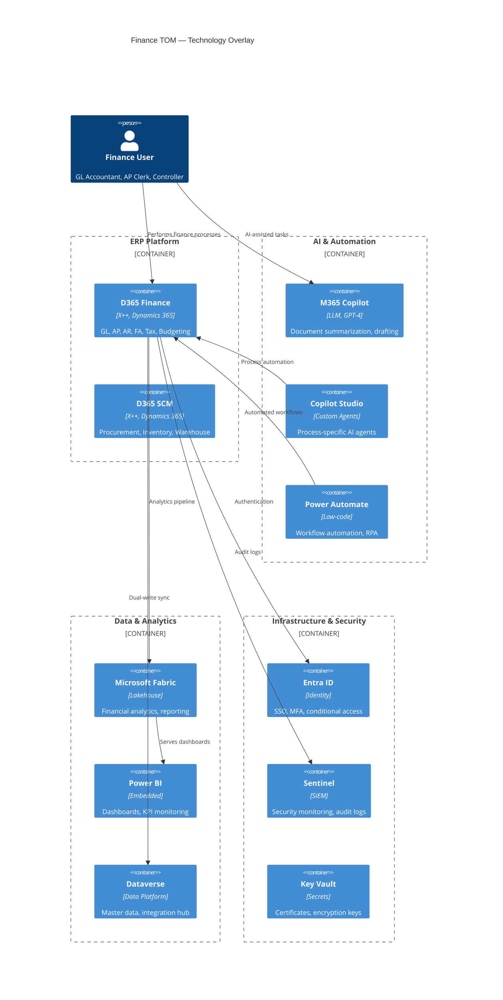
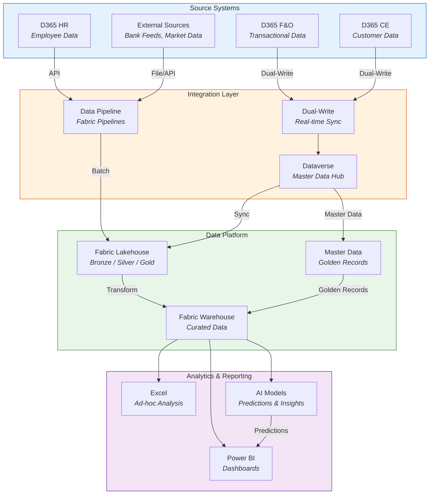
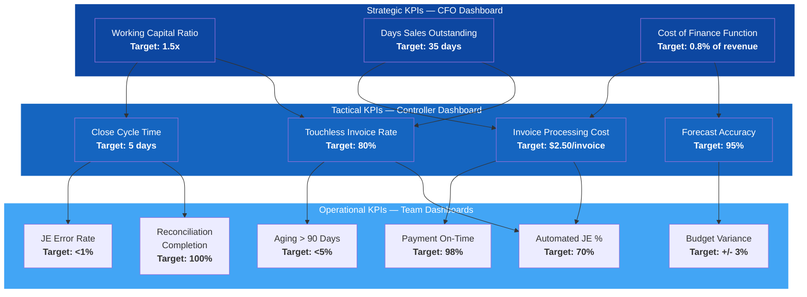

# TOM Diagram Templates — Full Mermaid Examples

Complete, filled-in Mermaid diagram templates for all 7 TOM diagram types. Each template includes the diagram type, when to use it, a full working example, and customization guidance.

---

## 1. Capability Map

**Diagram type**: Mindmap

**When to use**: Present the high-level process landscape for a domain at the L1/L2 level. Best for executive audiences and TOM overview slides. Use on Slide 5 of the TOM deck.

**Complete example**:

**Customization guidance**:
- Replace the root label with the domain name
- Add or remove L1 branches based on scope
- Add a third level (L3) for focused discussions, but limit to 3–4 items per L2 to avoid clutter
- For multi-domain views, use the domain name as L1 and L1 processes as L2

---

## 2. Process Taxonomy

**Diagram type**: Flowchart (left-to-right)

**When to use**: Show the hierarchical decomposition of a single L1 process. Best for workshops and detailed design sessions. Use on Slide 7 of the TOM deck.

**Complete example**:

**Customization guidance**:
- Green nodes indicate automated activities — apply `fill:#2e7d32` to any L4 node flagged as fully automated or AI-augmented
- Add `<i>AI-augmented</i>` or `<i>automated</i>` tags below activity names for visual clarity
- For very large processes, split across multiple diagrams (one per L2)
- Limit L4 detail to processes targeted for redesign or automation

---

## 3. Maturity Assessment

**Diagram type**: Quadrant Chart

**When to use**: Visualize the current vs target maturity gap across L2 processes. Helps prioritize improvement actions. Use on Slide 6 of the TOM deck.

**Complete example**:

**Customization guidance**:
- X-axis values map maturity scores: Level 1 = 0.20, Level 2 = 0.40, Level 3 = 0.60, Level 4 = 0.80, Level 5 = 1.00
- Y-axis values map target maturity using the same scale
- Quadrant labels:
  - Top-left (Strategic Investment): Low current, high target — requires significant transformation
  - Top-right (Maintain & Optimize): High current, high target — sustain and fine-tune
  - Bottom-left (Low Priority): Low current, low target — deprioritize
  - Bottom-right (Quick Win): High current, low target — already performing, easy to maintain
- Add or remove L2 processes based on domain scope

---

## 4. Role-Process Matrix

**Diagram type**: Block-Beta

**When to use**: Show RACI-style responsibility assignments for roles against processes. Best for organizational design discussions. Use alongside Slide 8 of the TOM deck.

**Complete example**:

**Customization guidance**:
- R (Responsible) = green (#2e7d32), A (Accountable) = red (#c62828), C (Consulted) = blue (#1565c0), I (Informed) = gray (#e0e0e0)
- Add or remove role columns based on the domain's role catalog
- Add or remove process rows based on scope
- Verify SoD: no role should have both R and A on the same row
- For large matrices (10+ roles, 15+ processes), split into multiple diagrams by L2 process area

---

## 5. Technology Overlay

**Diagram type**: C4 Container

**When to use**: Show the technology platform landscape and integrations supporting the TOM. Best for technology discussions and architecture reviews. Use on Slide 10 of the TOM deck.

**Complete example**:

**Customization guidance**:
- Add or remove containers based on the actual technology landscape
- Group containers into logical boundaries (ERP, AI, Analytics, Infrastructure)
- Add relationships for all significant data flows and integrations
- For non-Microsoft components, add them as `Container_Ext` with a different style
- Include the Person element to show primary user roles

---

## 6. Data Flow

**Diagram type**: Flowchart (top-down)

**When to use**: Show how data flows between systems, processes, and data stores. Best for data architecture discussions and MDM design. Use alongside Slide 13 of the TOM deck.

**Complete example**:

**Customization guidance**:
- Adjust source systems based on the client's actual landscape
- Add or remove integration patterns (Dual-Write, API, Batch, Event-based)
- The Bronze/Silver/Gold medallion architecture in Fabric is standard — customize layer names if the client uses different terminology
- Add data volume annotations (e.g., "~10K records/day") for sizing discussions
- For complex flows, split by data domain (financial data flow, master data flow, analytics data flow)

---

## 7. KPI Structure

**Diagram type**: Flowchart (top-down with grouping)

**When to use**: Show the hierarchical KPI framework from strategic objectives down to operational metrics. Best for KPI design sessions and executive dashboards. Use on Slide 12 of the TOM deck.

**Complete example**:

**Customization guidance**:
- Three tiers: Strategic (C-suite), Tactical (management), Operational (team)
- Each KPI shows the metric name and target value in bold
- Arrows show causal relationships — operational KPIs drive tactical KPIs, which drive strategic KPIs
- Replace metric names, targets, and relationships based on the domain's KPI catalog (from Section 5.1)
- For multi-domain views, add domain color coding to distinguish Finance KPIs from HR KPIs, etc.
- Keep Strategic tier to 3–5 KPIs, Tactical to 5–8, Operational to 8–15

---

## Diagram Selection Guide

| Scenario | Recommended Diagram | Template # |
|----------|-------------------|-----------|
| Executive overview of scope | Capability Map | 1 |
| Process design workshop | Process Taxonomy | 2 |
| Prioritization discussion | Maturity Assessment | 3 |
| Org design / RACI review | Role-Process Matrix | 4 |
| Architecture review | Technology Overlay | 5 |
| Data architecture / MDM design | Data Flow | 6 |
| KPI design / dashboard planning | KPI Structure | 7 |
| Combined TOM deck | All 7 (one per relevant slide) | All |

---

## Rendering Notes

- All diagrams use standard Mermaid syntax compatible with Mermaid v10+
- Color codes use Material Design palette for consistency
- Diagrams are designed for 16:9 slide embedding — keep node text concise
- For PPTX generation, diagrams can be rendered as SVG and inserted as images
- Test rendering at https://mermaid.live before finalizing
